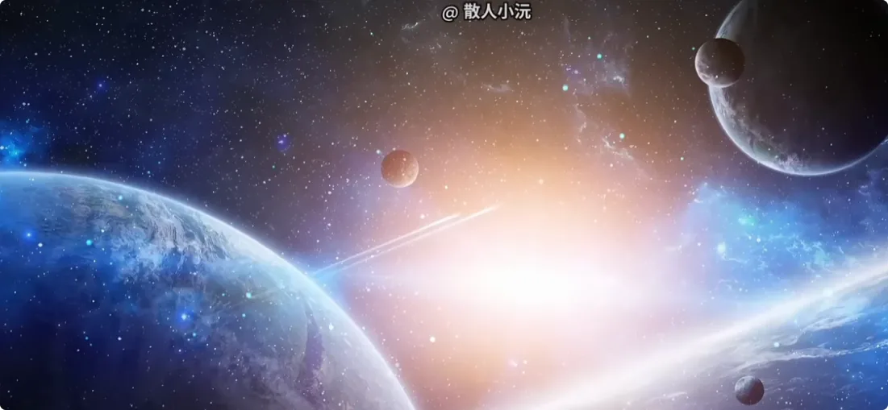
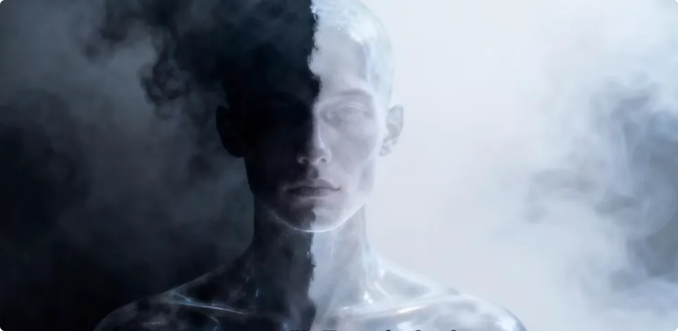
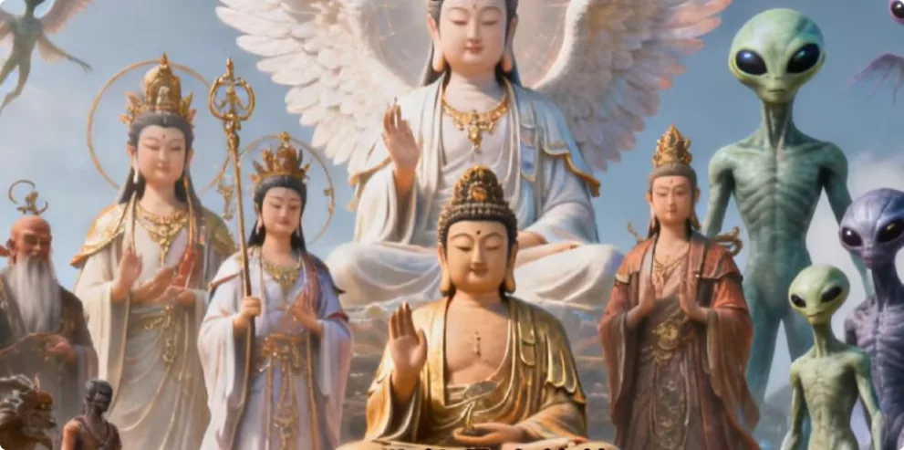
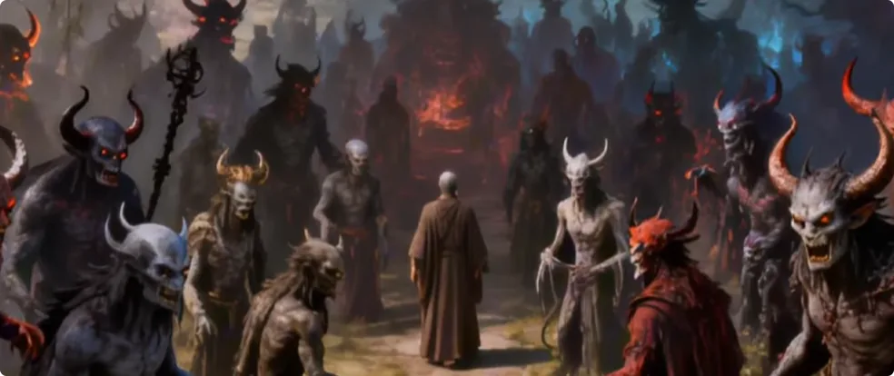

## 前言

* 你是不是跟我也有同样的疑问：
  * 为什么这个世界有这么多的修行法门？
  * 为什么中西方有这么多的概念？
  * 为什么有一些相通，有一些又互相矛盾？
  * 到底谁对谁错？
  * 到底是不是条条大路通罗马？
  * 到底应该相信谁？
* 作为一个修仙者，我今天就一个视频给大家整合所有的学说，捋清楚这个世界的**底层逻辑**和**运作规则**。小板凳坐好，绝对颠覆你的认知。

## 正能量世界的运作规则

* 首先这个世界绝对是**大道至简**的，没有很复杂的概念，甚至一个公式就能解释世间所有的事情。
* 尼古拉·特斯拉曾经说过：“如果你想发现宇宙的秘密，就要从**能量**、**频率**和**震动**的角度思考。”
* 要理解这个世界的底层逻辑，首先我们就要把所有的认知和概念都放一放，把这个世界当成一道数学题来解。

## 核心概念一：能量体与能量值
* **所有存在都是一个能量体**：
  * 是能量体就有一个**能量值**。
  * 能量体存在就会有消耗，能量体想生存下去就需要补充能量。
  * 头顶上都有一个数值，数值越大能量体的等级越高。

 **修炼的本质**：
  * **补充能量 < 消耗能量**：能量体慢慢死去（所有已知生物都在这个范畴，因此有寿命）。
  * **补充能量 = 消耗能量**：能量体死不了，即**永生**。
  * **补充能量 > 消耗能量**：能量体不断壮大，量变到质变时升级（**升维**）。
  * 所有能量体想方设法补充能量、壮大自身能量值以达到永生和升级的状态，这个过程就叫**修炼**。

* **自主意识与非本能补充**：
  * 一个能量体能不能、会不会用**非本能的方法**补充能量，决定了其是否有自主意识和会不会修炼。
  * *非修炼范畴（天生/本能方法）*：人类通过饮食获取能量、植物进行光合作用。
  * *修炼范畴（非本能方法）*：
    * **正道**：石头成精、狐狸拜月，通过吸收天地灵气、日月精华等纯正能量改变自然形态。
    
    * **偏邪**：吸收其他能量体的浊气（如妖吸人阳气、吞食其他妖的妖丹）来壮大自身能量场。

## 关于正负能量

## 核心概念二：能量的正负性
* 《道德经》云：“道生一，一生二。”
  * **道（本源）**：能量值为**无限大**。
  * **一分为二（阴阳）**：即**正能量（+）**与**负能量（-）**。
* **正负抵消法则**：
  * 正负能量相遇会清零抵消，而清零对于能量体就意味着**死亡**。
  * 能量体只能在正能量修炼或负能量修炼中**二选一**：要么在加号世界持续壮大，要么在减号世界持续壮大。

**人类的特殊性**：
  * 人类是中间过渡的存在，是一个中性偏负一点的容器，可以同时装载正能量和负能量。

## 维度与能量等级
* **维度的划分**：
  * **人之上**：有很多维度，存在亿亿万万的能量体（仙、佛、菩萨、神、天使、部分外星人等）。

  * **人之下**：也有很多维度与众生（妖魔鬼怪、部分负面外星人等）:

  
名词不重要，核心只看其**能量值**。

---

## 正负能量的战斗力

* **能量数值对抗逻辑（数学模型）**：
  * 假设人类能量值为 `-1`，大魔为 `-10000`，神仙为 `+10000`。
  * 你与大魔、神仙的能量级别差距都是 `9999`。

* **战力对比法则**：
  * `+1000` 神仙 vs `+100` 外星人：**打得过**（能量值高胜出）
  * `+1000` 神仙 vs `-100` 外星人：**打得过**
  * `+1000` 神仙 vs `-10000` 外星人：**打不过**
  * `+1000` 神仙 vs `-1000` 外星人：**很难说**

## 正负能量环境的差异和层级差距:

* **正负能量环境差异**：
  * 负能量极其浑浊，没有实体愿意一直待在浑浊之地。
  * 许多大妖大魔甘愿归顺天道、放弃千万年修为，转世为人以求正道修行的机会。

* **认清现实与层级差距**：
  * 针对“我就是宇宙、我就是本源”的说辞：你的肉身依然在三维世界。
  * 人类连接一个能量值 `100` 的小神都极为费劲，更遑论直接连接无限大的本源。

* **层级不可逾越性**：
  * 犹如一只觉醒的蚂蚁想直接给总统打电话：
    1. 蚂蚁没有制造电话的功能。
    2. 物种与层级完全不同，忽略了中间 99% 的众生差距。
  * 二维与三维、人类与神仙、神仙与本源之间均存在巨大的维度跨度。

## 在往上呢 ?

* 神仙、佛、菩萨往上的世界，本质上只是一串串**数字**。
* 追求过高而脱离实际并无意义，关键在于明确自身在整个能量体系中所处的具体位置。
* 99.99% 的人既不知道自己的能量值，也不清楚自身的正负属性。
* 与其耗费时间胡思乱想，不如脚踏实地提高能量值，一步一个脚印往上提升。
