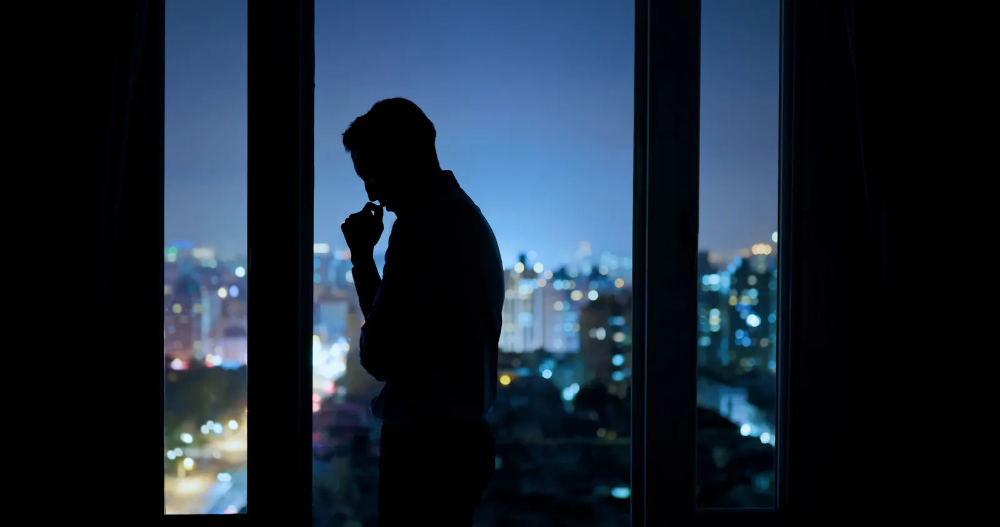
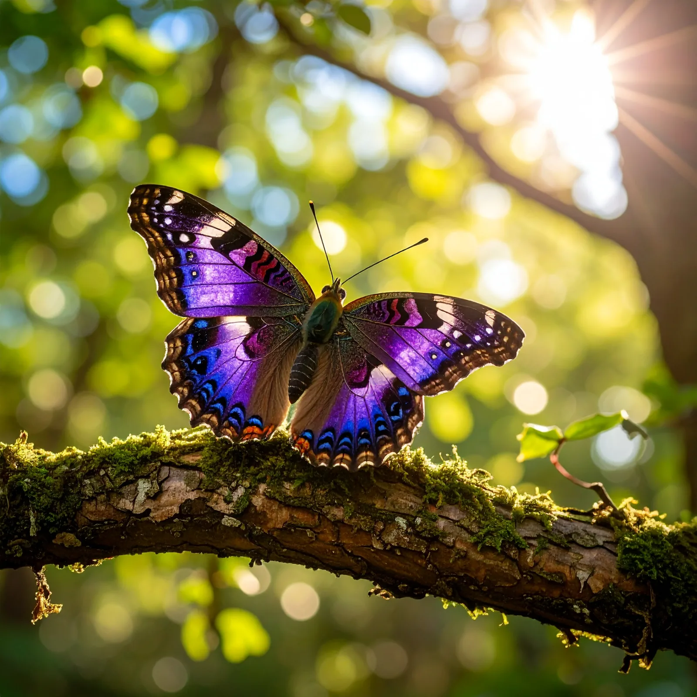

> **人外有人，山外有山。修行人既要学会争取、要有向往，又要学会放下。既浮游于天地间，如何平衡内心，只有不断在自然中领悟真谛。**

## 1. 从格格不入到寻道：我为什么一直觉得自己不属于这里

### 对世俗规则的困惑

大家好，我是修炼者小烨。
今天给大家分享一下真实的修仙是什么样子，内容会比较神异，大家就当奇闻异事听听就好了。
话说我修仙这事儿还得从小时候说起。
从小我就很难理解世人的很多行为，很难理解人类社会的很多潜在规则，学习起来特别吃力。

比如：
1. 为什么至亲之间要存在那么多心眼？
2. 为什么利他的善举会被看作一种愚行？
3. 明明平和的生存之道就可以富足，为什么一定要相互伤害？

我无法理解父母和兄弟姐妹的价值观，但我终究不认为自己有错。
哪怕被亲人嘲笑，我仍然坚持自己的观念：

> **不是我太蠢了，而是世人的欲望太多了。**

所以我总觉得我好像并不属于这里。
我相信世界上一定有跟我想法一样的人，也被遗忘在世界的角落。我很孤独，我想找到相互理解的人。

### 童年时期的灵性启蒙

好在灵性的启蒙也很早。
记得在很小的时候，有天夜里家人都睡着了，只有我醒着。我看到窗户那里有一个盘腿坐着的白衣女子。
那时家里都信佛，我就以为那是观音姐姐，也没有感到害怕。
于那晚到底是谁，我后来也无法求证。不过这倒是让我坚信了灵界存在的想法，谁来劝我，我都雷打不动。
结合我跟世人格格不入的观念，我总觉得我应该来自别的世界。

**也许探索玄学和修行，能让我找到回家的路。**

这种想法支撑了我走过整个压抑的青年时期。

### 越进入所谓的“好平台”，反而越觉得疲惫

后来不知怎的，突然来了劲儿，逼自己考上了一个好的大学。
父母虽然表面认可我的成绩，但心底里终究是看不起一个不懂世道的人。
所以我把注意力转移到新的环境里，可我发现好像平台越好，情况反而更糟糕了。

他们都好像中了魔咒。

人人都是精致的利己主义者，利益永远是他们臣服的第一原则。

真的很没意思。

最终我还是觉得太累了，我离开了这些人。我想找个简单的工作，就这么把自己的日子过下去。

若能有缘见到能引渡我的人，远离这喧嚣的世界，那就更好了。

---

## 2. 云梦山的召唤：第一次听见“回家”的方向

### 大山第一次让我感到真正安心

离开北京的最后那一年，我去了一趟云梦山。
大山在日光下照得通红。
在没有人的地方，它们好像和我一样，不在意世人怎么想，但它们比我自在。

**我突然发现，大山能让我感到安心。**

在我要离开的时候，我经过了云龙剑主峰。
巍峨的山顶处刻着 **80×40米的印章**，印章前还有一处平台，足够安个家。

就那么一瞬间，我好像听到一个声音：

> **“你也可以登上来，来此处安家。”**

### 离开北京后，我开始等待真正的机缘

自此之后，我向往大山。
离开北京后的一年，我基本都在摆烂。
我对城市唯一的希望，都寄托在虚无缥缈的“偶遇真人”这种事情上。

---

## 3. 正式修行的第一课：无论得到什么，都要把自己放低

### 第一次见到真正的“修仙之道”

这是我正式修行的第一天，我终于见到了真正的修仙之道。

当我见到此等仙境的时候，我却并没有表现得像个修行人，反而在人性上有了极大的释放。

当时我在想：

> 功夫不负有心人。
> 
> 我吃了这么多苦，受了这么多冷眼，熬过这么多黑夜，最终都证明这一切是在帮助我走上正道。
> 
> 我是那个注定有机缘的人。

我感到前所未有的自豪，我觉得自己又行了，甚至在那里幻想着化为元神飞上天的样子。

### “跪下磕头”：自满升起，修炼能量戛然而止

不过就在我这么想的时候，此处的修炼能量戛然而止。

> **“跪下磕头。”**

严厉的声音突然出现在我的脑子里，我才醒悟过来，刚才思想走偏了。

我连忙跪下给神灵磕了几个头，一边磕着头一边认错。

直到头叩地的那一刻，周围的修炼能量才重新涌入我的体内。

> **“你啥也不是。”**

这几个字深深地印在了我的心里，让我当场面红耳赤，成了我的第一堂课。

### 一条修仙路上的知识，为什么“一字千金”

对我来说，只有牢牢抓住修仙的路最重要，其他都不重要。

这条路上的任何知识点都是**一字千金**。

领悟其中一个道理，就足以应对很多考验；反复践行一个道理，才能沉淀成自己的品性。

所以自此之后，每次有进步，我都会对自己说：

> **天地自然之间，你啥也不是。**

然后老老实实复盘这段时间学习了什么。

### 多年后，我才明白那一跪真正教我的是什么

多年之后我才明白，那天的一次跪拜、一句话，其实都是在教导我：

> **无论未来收获什么，都要把自己放得很低，把头颅放得和地面一样低。**

只有这样，你才不会走上歪路。

也只有这样，才会有神灵愿意教导你。

原来都是神灵的良苦用心。

想到这儿，我感动得想哭。

心怀感恩，我朝心中的那个方向行了跪拜礼。

---

## 4. 清晨访仙境：穿过鬼域，进入真正清净的结界

### 凌晨五点，向曾在梦中感召我的地方出发

今天早上五点不到我就出发了。

虽然街上有三三两两的人，我倒是觉得跟月亮、星星更亲近些。

毕竟同样追求修炼，也算志同道合。

修到这个阶段，身上的**凡气**已经排去了很多，所以人才能跟自然共鸣。

当年去拜访的仙境，是梦里先有感召。

想想，也许是时候去看看了。

### 山路上的异常：我闯进了一个“鬼众结界”

等我到的时候，天气已经放晴，万里无云。

那个地方离城市很远，除了一条小路，也没有别的人。

就在我还在欣赏风景的时候，突然感觉到一阵头疼。

原来是附近的**鬼气**开始多了起来。

此地不宜久留，我加快往前开去。

可是过了几百米，鬼气依然没有减弱，反而多了起来。

**乌压压、一阵一阵的鬼气，就朝着我的车子撞了过来。**

凭借我的知觉，有大的鬼，也有小点的鬼。不过跟人的亡魂还不太一样，它们的力气更大、更凶。

这时我才确定：

> **我闯进了一个结界里——由鬼众建立的结界。**

在这个结界里，有成千上万的鬼驻守在此。

别无他法，我只能硬着头皮往前开。

足足开了有 **4公里**，直到一处地方，突然头再不疼了。

好像经过了一个卷帘门，帘子把厉鬼们全挡在了门外。

看来此处的能量结界是清净的。

---

## 5. 结界之内：清潭、山峦与神灵的问询

### 穿过鬼域之后，景象突然完全不同

随即我把车停在门内，缓了一会儿才下车查看。

只见此处有一潭青石，清澈见底。

远处的山峦层叠起伏，宛如一幅水墨画。

淡淡的云雾在山腰处缓缓流动，有几分神秘与宁静。

站在这片宁静的地方，时间仿佛静止，心灵也随之沉静下来。

### “来者何人？”

突然有一个声音出现在我的脑海里：

> **“来者何人？”**

我连忙行礼，和神灵打了招呼，回复道：

> “我是修行人小烨，今日前来拜访，请神灵给点能量。”

神灵继续问：

> **“要来作甚？”**

我回复道：

> “为了修炼，为了修行，也为了以后引渡更多的修行人。”

神灵不再追问，于是给了我一些修炼的能量。

能量进入我的身体后，先前残留在身上的鬼气被冲出，接着排出的是一部分**凡气**。

谢过神灵后，我不再逗留，驾车离去了。

---

## 6. 前有鬼域，后有妖山：修仙之路也有不能逾越的规矩

### 离开仙境，厉鬼一路监视到结界之外

离开的时候，那些厉鬼又追了上来。

与其说要来揍我，不如说是监视我离开。

我又往前开了 **4公里**，它们才停止跟随。

我知道，我出了结界了。

### 两公里之后，又遇到了“大妖的山头”

沿着路又开了 **2公里**，眼前出现一处山峦。

看似美丽，实则有些过分妖娆了。

远远就看到很多艳丽的花开在山坡上。

等我的车经过山脚的时候，一阵浓烈、眩晕的妖气扑面而来。

原来这边是大妖住的山头。

我赶紧加速离开了。

### 心术不正的人，即使遇见机缘也可能是灾祸

这个地方前有鬼域，后有妖山。

也就是说，如果有修行人心术不正，没经过允许，无视修仙的规矩，妄图私自拿取能量，那么不管那人自诩多么虔诚，不管曾经是否被认可，都只剩下自取灭亡。

要么死在那 **8公里的鬼域**里，要么被大妖迷惑，入了这个山头，慢慢被吸干身上的气。

---

## 7. 与神灵打交道：修行其实是在一点点补全自己

### 转世成人，就必然带上人性的缺点

要说修行中最有趣的事情，还属和神灵打交道。

一个修行人，无论曾经的元神有多牛，转世成人就必然带上人性的缺点。

想要修成仙，那就必须从别处弥补。

**这其中离不开每一位自然神灵的教导。**

### 一位像弥勒佛一样慷慨乐观的神灵

记得刚开始修仙的那会儿，因为心中常年的阴郁已成为习性，难以消散，所以没多久，我有幸遇见一位慷慨乐观的神灵。

那时我坐在山腰上。

一阵清风沿着山坡吹了过来，轻抚我的额头。

神灵将他的能量吹进了我的胸口。

一个笑口常开的形象在我心中显现，好似弥勒佛那般性情。

我的心突然就释怀了，我很想开怀大笑。

是啊，眼前的一切都是真实而美好的。

我如愿走上了修仙的道路，我的未来一片光亮，我的过去皆是**缘法**。

接下来的路，有美景和万物作伴。

神灵是我的老师，有令我期待的知识，有令我向往的仙界神灵。

那慷慨激昂的能量让我想通了这些事情。

**我残缺的人格，完整了一些。**

---

## 8. 灵树与蝴蝶：原来在世人看不见的地方，万物都在修炼

### 会“解毒”的灵树

有一次我遇到一棵灵树，它的树枝具有解毒气的能力。

这位灵树很可爱。

它随风摆动树枝，好像是在招呼我过去，它说要教我怎么给自己解毒。

它让我把手想象成树枝的模样，从它枝头上引出一股能量，然后再注入身上常生病的地方。

一股病气随之排出。

它说：

> 如果以后有不好治疗的病气，都可以找它帮忙，因为灵树最擅长解毒。

听完这话，我很感动。

### 修炼几十上百年，姿态依然放得很低

灵树已经修炼了几十、上百年，修为已经很高了。

然而姿态依旧放得很低。

这时，一只蝴蝶从树枝上飞过。

它的翅膀扇动的时候，明显有些许修炼的能量。

看来这是灵树引渡的一只蝴蝶精。

它趁着我修炼之际，也过来沾一点福气。

### 修行人其实并不孤独

原来修行人真的不孤独。

> **在世人看不见的地方，很多生灵都在悄悄修炼。**

它们相互陪伴，视天地为父母，视自然为家，内心其实是非常充实的。

人外有人，山外有山。

修行人既要学会争取、要有向往，又要学会放下。

**既浮游于天地间，如何平衡内心，只有不断在自然中领悟真谛。**

---

## 9. 塞北草原的最后一课：放下红尘，才能听见自然的呼唤

### 驶离人类世界，奔向一望无际的草原

一次，我被指引到塞北一处仙境。

当我开车进入草原的时候，我既有些慌张，又有些期待。

之所以慌张，是因为周围人类的建筑越来越少了。

眼前只剩下一望无际、又无人的草原。

仿佛我正在告别人类的世界，奔赴神秘的新世界。

### “要如无边无际的草原那般，拥抱无限的可能性”

草原仙境的那位神灵教导我：

> **“小烨，记住眼前的景色、心境。”**
> 
> **“要如无边无际的草原那般，拥抱无限的可能性；如那平缓起伏推进的大地，泰然自若地抵达远方。”**

远离人类的红尘。

天际线那边，有更值得追求的事情。

也许早在看见云龙剑的那次，那里的神灵就已经赠予我新的追求。

> **也只有当我放下对尘世的执念，才能听见自然对我的呼唤。**

我是修炼者小烨，我们下期再聊。