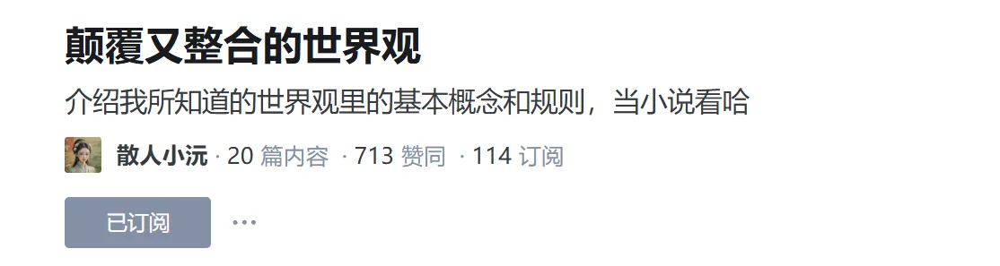
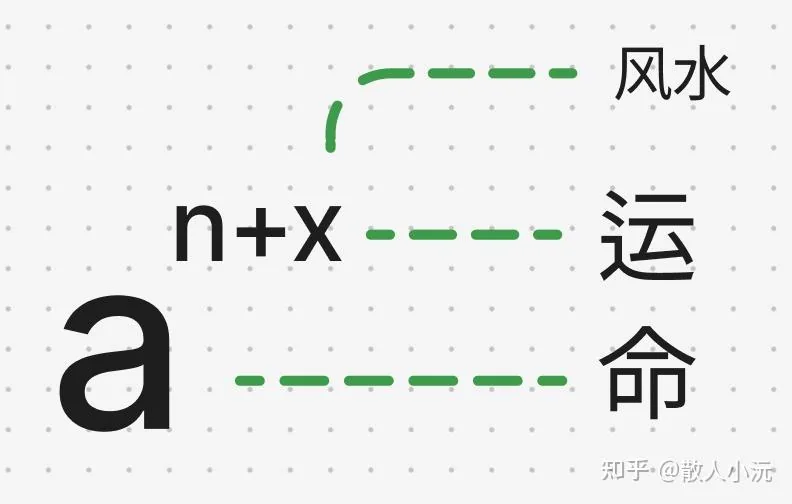

## 资源专栏: 
url: https://zhuanlan.zhihu.com/c_1900959021692870980

## 01-修行的最终目的是为了什么？
>作者：散人小沅  
>
  链接：https://www.zhihu.com/question/612840095/answer/1909626741774881982  
  来源：知乎  

>[!note]
>修行即吸收纯正能量, 全宇宙通用, 而非打坐念经, 能量纯度够了自然心性稳定, 末法时代更加应该保护自己的能量场, 频率不要调乱, 其次真正的修行一定是阶段性可验证，可量化的

## 修行是什么
就是收纯正能量，把自身能量值往上提一提，能量攒够了，自然就往上走一个维度了。

## 纯正能量是什么？

就是古书里经常提到的，[日月精华](https://zhida.zhihu.com/search?content_id=728876545&content_type=Answer&match_order=1&q=%E6%97%A5%E6%9C%88%E7%B2%BE%E5%8D%8E&zhida_source=entity)，上行清炁，[天地灵气](https://zhida.zhihu.com/search?content_id=728876545&content_type=Answer&match_order=1&q=%E5%A4%A9%E5%9C%B0%E7%81%B5%E6%B0%94&zhida_source=entity)，都是一个意思, 我比较喜欢用纯正能量这个词来表述

我相信你也听说过
什么动物，植物，石头，吸收了什么，然后进化成了什么, 对吧？
那你有听说，那些动植物石头
念个什么经，打个什么坐，练了个什么丹，修个什么心，吃个什么香火
然后进化出功能的吗？有吗？
人家是碰巧在那个地方，碰巧吸收了某些东西，碰巧进化出了功能
总结出规律了没有？所以进化，它不靠打坐念经修心，好吧！那些上古大神，那时没有人类也没有香火
人家怎么修啊？其他那些不会打坐念经炼丹练气的众生怎么修？
你有没有想过这个问题, 用你小脑袋瓜子把这个底层逻辑盘一盘嘛！

## **_往上走的路，有且只有一条_**

全宇宙通用！人类和其他亿亿万万众生都是同一条路！同一个规则！这个底层逻辑不能更底层了！这个规则公平得不能再公平了！我真的不知道哪本经书给你们读傻了！对了，那些众生也不读经书，好吧！
市面上说什么[八万四千法门](https://zhida.zhihu.com/search?content_id=728876545&content_type=Answer&match_order=1&q=%E5%85%AB%E4%B8%87%E5%9B%9B%E5%8D%83%E6%B3%95%E9%97%A8&zhida_source=entity)，什么条条大路通罗马. 也不能说人家完全没有用
你先得有纯正能量，那些修法才【可能】**有点用（绝大部分都是割韭菜）

你现在一身凡气，浊气，自循环, 没有纯正且强大的外力托着你往上走, 你是上不去的！
除非你一点都不想往上走: 
不想脱离轮回离苦得乐
不想摆脱地球的束缚
念了一辈子的经，不想成fo
炼了一辈子的丹，不想成仙

那这个确实是 "条条大路通罗马", 怎么修都没有错！

都说**万物有灵**
要是念个什么词，打个什么坐，就能上去那念经机不早就成佛了？
要是耍个什么功，练个什么丹，就能上去, 那从小练的不就上去了？

那些天天说修心的
你长这么大难道不明白这世间最不可测的就是人心吗？
你但凡说钻石可以换升天的机会，我都觉得合情合理
毕竟人家钻石化学元素稳定是公认的

你拿人心跟上面要资源，你当上面的是傻子么？你们敢说自己的心能像钻石一样纯净无暇？你怎么不拿人心去银行取钱？我这么善良这么虔诚，你就应该给我钱！

这是什么？！是[贪嗔痴慢疑](https://zhida.zhihu.com/search?content_id=728876545&content_type=Answer&match_order=1&q=%E8%B4%AA%E5%97%94%E7%97%B4%E6%85%A2%E7%96%91&zhida_source=entity)的哪一种？好好想想
你虔诚你有某些国家虔诚啊？！如果虔诚有用，为什么他们那么穷，争端这么多！想过这个问题没有？！
历史上有多少战争是因为虔诚挑起的，你们数数, 你们能不能以史为鉴

别跟我说，哎呀我不一样，上下五千年，就你最特殊
你是神，你是佛，你是宇宙, 你这么能，咋不上天
在地上跟凡人杠啥！

## 心性如何稳定

我告诉你心性是怎么稳定的, 能量够了自然就稳了
你如果能认识到你得到的是比世间任何东西都要珍贵的资源
世间的所有金钱名利地位美色，所有人和事，在你眼里都是破铜烂铁
你还会有执念吗？

心，根本就不用修！
这就是道法自然！
要修心的，都是没得到过好东西的，好吧

那些看什么经书什么就跟着练的
那你有没有读到，人家也是游历[万山](https://zhida.zhihu.com/search?content_id=728876545&content_type=Answer&match_order=1&q=%E4%B8%87%E5%B1%B1&zhida_source=entity)的
哪个是在家，在庙里观里上去的？
但人家也不能把天机写出来啊

[天道](https://zhida.zhihu.com/search?content_id=728876545&content_type=Answer&match_order=1&q=%E5%A4%A9%E9%81%93&zhida_source=entity)是有很严格的规矩的！所以只能告诉你，我就是打打坐, 就好像有钱人不会告诉你他是怎么赚钱的, 只会告诉你我就是努力的, 然后你们这些牛马努力去吧, 那些有用的书，就是给已经在正道上的人看的, 不是给门外汉看的！
古人打坐你也打坐
几千年前，大环境还很单纯
你打坐，虽然上不去
但也不至于伤身，也属于修身养性了

可是现在[末法时代](https://zhida.zhihu.com/search?content_id=728876545&content_type=Answer&match_order=1&q=%E6%9C%AB%E6%B3%95%E6%97%B6%E4%BB%A3&zhida_source=entity)，能量这么负, 不打坐都不能保护好自己的能量场, 你还把频率乱调，把能量场打开
那旁边的负能量不是吃得很香吗？

真正的修行一定是可验证，可量化的, 不能验证和量化的那种
你总不能噶了才知道自己修得对不对吧

  

真的，原理都掰开了揉碎了喂到嘴边了
你还要打坐修心练这练那的
我也没什么好说的
你有九条命就去，没人拦你
今天就这样！

---

## 02-神仙对凡人动心后，会发生什么？
>[!note]
>神仙和人的能量纯度的不同其实已经是可以看做跨物种了, 因此人身自带的浊气是神仙自带的清气难以忍受的, 如果悬殊很大的话, 其次会漏掉很多的能量

这是霸总剧看多了？
神仙和凡人不是一个物种，差了不是一个两个维度。
凡人对于神仙来讲，气太浊，是滂臭的。

试想一下，人类会对屎壳郎心动吗？
好好的人类不当，非要跟屎壳郎混。
除了脑子有屎，真的想不出其他原因
当然 80 亿人也可能有一两个真的很喜欢屎壳郎的人类
那能怎么办，你自己愿意降级去当个屎壳郎

那去呗
你不想当人类，大把其他生灵抢着投胎转世，正愁没有名额。
只是降级容易，想回来就难咯
且不说名额还有没有
你自己很大概率都不记得回来这件事

但你毕竟曾经做过人类
在屎壳郎的世界怎么都不得劲，都格格不入
异常痛苦还不知道为什么。
但是也没有办法，
你自己的选择就要承担相应的后果
在屎壳郎的世界无限循环
直到有天你的恋屎脑不会再犯，
真的一点都不留恋屎的世界了

别说神仙，就连有一定修为的修行人，都受不了普通人身上的浊气。
连靠近都不想靠近，更别说亲密接触了
即使能忍住臭，圆房了，千辛万苦修来的纯正能量还会被分掉一半

什么概念？
放现代社会就是，睡一次分一半家产
就算富豪也不敢乱搞啊

修行人一心动一半修为没了
这 B 心不动也罢。
光想想就心在滴血，百害而无一利
有病才会心动。

## 03-为什么天庭不准神仙谈恋爱?
>[!note]
>人理解的恋爱和神仙的恋爱可以视作为两个物种的看待维度

谈恋爱是啥了不起的事吗？
都那个能量层级了，谈恋爱干啥？
天上地下就没有比谈恋爱更好玩的事了吗？

**世间绝大部分恋爱都只是打着爱的名义在满足生育和私欲。**
神仙谈恋爱图啥？
图钱？上面也不用钱
图身体？图好看？神仙都是无形的，变啥不行？
图情绪价值？我在人间都知道，修炼是比世间任何感情都快乐的事！
那图啥？图谈恋爱绑手绑脚？迁就来迁就去？

连小情小爱的情欲关都过不了，还能当神仙？
神仙就这意识层级，这觉悟，这格局？
实在恋爱脑的，贬下凡间去谈个够呗。
BUT! 一旦下去，想回来就难咯

## 04-修行之后物理层面都有哪些变化
>[!note]
>真正的修行可验证可量化,  接触纯正能量后, 会让身心都得到愉悦, 运势也是能量的一种表现

我说过真正的修行，一定是性命双修，可验证可量化的。

最直观的就是物理层面，或者说身体层面的变化。

首先，身体是革命的本钱，身体不健康谈什么修心，谈什么情绪稳定，更别提长生，没有意义

其次，一个人的运势，本质就是能量，能量足，运势好。运势好，人际关系，生活各方面都会变好，自然就会情绪稳定。而不是天天在那用各种心理方法，用想象力安慰自己或者压制本心本性。这样的人，天天修天天稳定不了，还天天自责。因为世界根本不是这么运作的。情绪稳定（修心）本质是靠能量足够支撑而自然而然达到的状态。

最后，一个人的[意识层级](https://zhida.zhihu.com/search?content_id=751059899&content_type=Answer&match_order=1&q=%E6%84%8F%E8%AF%86%E5%B1%82%E7%BA%A7&zhida_source=entity)也是靠能量支撑上去的。就是你能量够得着那个层面的事物，才能得到那个层面的信息。那个层级信息让你知道，你才得以知道，这就是俗话说的开悟。一些人一天天在那里靠想象力乱链接，从负能量大佬那里拿到信息，拿到的信息真伪也看大佬的层级，有些确实很厉害，但是以人的阳气做交换的，搞多了就不是伤身那么简单了。

简而言之，修行一定离不开能量，一定不是靠”想象力““向内求”这种无稽之谈。

当你真正接触到这条路之后，具体每个人的变化都是不一样的，所以个人变化，仅供参考。

### 初期：

第一次接触纯正能量

- 眼袋没了 （堪比 [Y美手术](https://zhida.zhihu.com/search?content_id=751059899&content_type=Answer&match_order=1&q=+Y%E7%BE%8E%E6%89%8B%E6%9C%AF&zhida_source=entity)）
- 身体里面的炎症和腐臭味消失了
- 脸色直接亮了起来
- 眼睛亮起来了

底子比较差，或者已经快被吃空的朋友，会非常困。初期困是常有的事。或者遇到负能量也会困。因为正负在打架呢。
底子厚的，会亢奋，精力充沛，但是不是喝了咖啡睡不着那种。
遇到纯正能量的时候，「有时」会有鸡皮疙瘩，麻，或者其他感觉，也可能没有感觉。但都不重要。

在控制其他变量的情况下：就是除了收能量，日常生活没有任何变化，没有特别做什么调养，吃什么饮食，做什么运动，都没有。就是一如既往地该干嘛干嘛。

## 后期:
慢慢积累多了之后，会有种血气充足的感觉，具体表现为

- 不缺铁的了不贫血了，本来一路红灯的血液指标正常了。
- 本来有[乳糖不耐受](https://zhida.zhihu.com/search?content_id=751059899&content_type=Answer&match_order=1&q=%E4%B9%B3%E7%B3%96%E4%B8%8D%E8%80%90%E5%8F%97&zhida_source=entity)，现在吃奶酪制品，没什么反应。
- 姨妈不疼了，一点不疼
- 从小巨怕冷的人，在零下的温度里，不再怕冷，也不再手冻脚冻，半天睡不暖了
- 一天开十几小时车一点不累了
- 吃的好睡得香，甚至会亢奋，睡醒也很开心
- 伤口愈合快：不小心嘴撞车门上，嘴里破皮了，当下真是痛疯了，我都怀疑我会变香肠嘴。但是第二天，我都摸不到我撞哪了，按压也不疼，伤口也没了。
- 维持在健康的体重，不管饮食如何，都没有什么上下浮动。我以前体重每天都会在 2-4 磅上下浮动，还是在控制饮食的情况下。现在每天浮动在 1 磅以内。尝试过 10 天在 0 度条件下的床车生活，吃不太饱（主要不饿）穿不太暖（主要不怕冷），体重一点没变化。
- 情绪稳定，极其稳定
- 人缘变好，动物缘变好
- 面相变了，耷拉的眼角上扬了，凹陷的脸颊蓬起来了。（又堪比 Y 美）
- 指纹变了：许久没用指纹打开电脑，最近发现两个手指头都打不开了，只能用密码打开。重新录入的指纹就能开，有点担心过海关咋整。
- ....

Again，因人而异，这只是我自己观察到的变化，
已经在路上的朋友不要问为什么有，为什么没有，什么时候有，（因为我有的病你没有），说这些都无意义
我只是在说，收能量对物理身体是有非常具体的变化的，但具体变化因人而异。

这些只是纯物理层面的变化
回到家看到室友，吃一堆营养品，非常非常注意饮食，不吃过夜菜，只吃有机，吃糙米，一堆一堆注意事项，就这么养，还每天大病小病的。

我真的很想说一句，你不用想那么多，去收能量，正常吃饭正常作息，别自己作死糟践身体就行。
但是你知道对于现代人，就正常吃饭，正常作息这两件事都很难做到，受干扰太严重了，身不由己。

而我说收能量，她也听不懂，也不会去听的，她在自己认知思维里锁死了。
我也就只能笑笑，听她叨叨了 30 分钟如何养生。

当然我以前修其他修法的时候，也有见过瘤没的，瘸腿修好的。
我自己也包括我朋友们
也有一段自我感觉好极了
但脸色还是营养不良，苍白的，泛黑的

这种就是典型的[夭磨之气](https://zhida.zhihu.com/search?content_id=751059899&content_type=Answer&match_order=1&q=%E5%A4%AD%E7%A3%A8%E4%B9%8B%E6%B0%94&zhida_source=entity)
这种短暂的效果就是一种甜头
不然谁都不是傻子对吧
至于能不能分辨，就真是见仁见智了。
很难说清楚

其他维度的变化，语言过于匮乏，说了也没意义感觉，再说吧....

## 05-善恶因果如果不是绝对，那为什么一定要导人向善那？

实际是人类的自我感动罢了
有谁能承认自己恶呀
总是得找点理由
美化自己的所作所为

善非功，恶非过
有绝对的善恶
但是是从天道的角度去定义的善恶
别说纬度不同
就连认知不同善恶标准都不一样: 

1. 举个例子
天灾是善还是恶？从天道角度来讲: 人类持续作恶, 不利于世间其他众生持续发展, 所以降下天灾让人类苏醒: **是为善**
从人类角度来讲, 只会大骂天道无情, 这是灭种族的大恶啊

2. 举个人间例子
你圣母心泛滥，放走了个杀人犯
导致更多人死亡
是善是恶？

3. 再举个非人间例子
一个人前世欠下的[业债](https://zhida.zhihu.com/search?content_id=745397222&content_type=Answer&match_order=1&q=%E4%B8%9A%E5%80%BA&zhida_source=entity)
今生本该有个意外还清了
人家就能去更好的地方了
但你多事，救他一命
这下又还不清了，浪费了这次投胎
是善还是恶？

有很多所谓的大恶人
搞不好是天道派下来成就大善人的
人家不仅不是恶
人家还有功

比如西游记里天上那些坐骑
下来吓一下唐僧
跟孙悟空比划比划
就被神仙们接回去天上继续当萌宠啦
说白了人家就是下来完成任务的

很多人间所谓的“善”, 在天道眼里为“恶”
因为这个世界不是只有人类

还有亿亿万万有形和无形众生
天道要为所有众生负责
而不是只对人类负责
而人类永远只从自己的角度
自己的认知层级去定义善恶

所以
人在没有能力看清前因后果前世今生. 也悟不到天道的标准的时候
没有资格也没有立场谈善恶
善恶的转换就在一瞬间, 立场一转，纬度一换, 你就成为了恶业的帮凶

## 06-如果有修仙者看上你的资质，让你抛下一切，避世修炼，你愿意吗？

>[!note]

【真的】修仙者看上了你资质
也不会主动要收你为徒

因为：
1. 法不轻传，道不贱卖，师不顺路，医不叩门是规矩。
2. 修仙资源何其难得，谁求谁？
3. 资质（来历）好的人多得很，你不修大把其他资质好的人抢着修。

其次，【真的】修仙者，不会要求你抛下一切，避世修行，因为这不符合目前的修仙规则。避世修行已经过时了，现在是另一套规则了，给你那么多能量，不是给你避世的！

这个假设像啥呢，给你举个例子
一个人在街上说，你骨骼清奇，我要给你一个亿，你从此避世。
荒谬在哪里？
1. 你骨骼是钻石做的吗？人家为什么给你一个亿？
2. 给你一个亿避世，你钱也没地方花，给你干啥。

这个世界所有东西都是等价交换
不是在物理世界就是在无形世界。
物理世界的流通货币是钱，
无形世界的流通货币是能量（能量层面人类拥有的只有阳气，而阳气=命）

所以如果有个人看上你，只有三种可能：
**骗财，骗色，骗命。**

## 07-为什么要修行？为什么人年轻时修行，比等到年纪大了才开始更重要？
修行就是用纯正能量（天地灵气）去冲掉人身上的凡气（阳气），以达到升维的目的（飞升，[扬升](https://zhida.zhihu.com/search?content_id=752399600&content_type=Answer&match_order=1&q=%E6%89%AC%E5%8D%87&zhida_source=entity)，成仙成佛，都是一个意思）

人出生时是阳气最足的，随着年龄的增长，阳气会消散，会因环境影响变浊，会被吃而产生[病气](https://zhida.zhihu.com/search?content_id=752399600&content_type=Answer&match_order=1&q=%E7%97%85%E6%B0%94&zhida_source=entity)死气。越老身体就会出现各种问题，连保证健康都已经非常艰难了，别说修行了。

人身上有多少浊气病气死气，就要用多少灵气去对冲抵消，把身体清干净，把身体重新养好，这一步越老越难。这只是修行前准备。

身体彻底干净了，才可能开始换掉凡气的修行。而换凡气也是个漫长漫长的走遍千山万水的过程，不仅需要时间，也需要体力

越老不仅耗费的灵气就越多，也没有那么多时间和体力去找灵气了。而灵气资源是有限的，你的老师和引路人时间精力也是有限的，太费灵气又没时间没体力能修出个所以然，大概率很难有贡献值。那当然资源会更倾斜给更有希望的人。

所以修行要趁早越早越好，最好的时间是你出生时，其次就是此刻。

## 08-走上正道修行会经历哪些阶段
每个人都略有不同，这个是我经历的几个阶段，仅供参考

**第一阶段：[世界观颠覆](https://zhida.zhihu.com/search?content_id=261544978&content_type=Article&match_order=1&q=%E4%B8%96%E7%95%8C%E8%A7%82%E9%A2%A0%E8%A6%86&zhida_source=entity)崩塌**
这个阶段特别迷茫，因为真正的修行之路，闻所未闻，甚至与自己从小到大的认知体系都不一样。我已经是从小接触[玄学主义](https://zhida.zhihu.com/search?content_id=261544978&content_type=Article&match_order=1&q=%E7%8E%84%E5%AD%A6%E4%B8%BB%E4%B9%89&zhida_source=entity)教育的孩子了。即使这样，也是非常颠覆的。这种突然意识到自己对世界的认知都是错的，会像疯了一样，什么都不敢碰，甚至也不知道应该怎么生活，因为以前的生活方式也是错的。

**第二阶段：求知若渴**
这阶段把自己关起来，翻遍所有能翻到的文章视频，老师的，前辈的，一遍一遍读，一遍一遍看。每篇我真是读了六七八九遍，视频每个都看了 50 遍以上。有一说一，现存的资料真的少得可怜，完全无法填补和构建一个新的完整的世界观。所以只能重重复复地看，生怕错过一点点信息。看书无用，真理不会在书里

**第三阶段：上课上山**
理解真正[修行路](https://zhida.zhihu.com/search?content_id=261544978&content_type=Article&match_order=1&q=%E4%BF%AE%E8%A1%8C%E8%B7%AF&zhida_source=entity)是什么样子之后，确定自己在干嘛，就可以申请上山（通不通过是另一回事），具体流程得经过筛选才能透露了，这里就不说了。

**第四个阶段：大惊小怪，十万个为什么**
因为打开了新世界大门，身体的感官也会有变化，会感知到一些以前感知不到的东西，比如正负能量。结果就是一点头疼脑热，风吹草动，都会大惊小怪。为什么这里疼，为什么那里难受，这个为什么这样，那个为什么那样。但我很幸运，有前辈天天听我叨逼叨，一个会把我骂醒，一个耐心倾听。扪心自问，我自己都做不到对别人这样（对不起大家），我自己会被自己烦死。如果我遇到我这样的人，我肯定把我删了。很多人，并没有这样可以叨逼叨的机会。所以我很想实名感谢一下这几位前辈，但是我不能。

**第五阶段：满脑子都是上山**
这个阶段也像疯了一样，生活工作什么都不想了，就只想上山，不停地上山，被拒了，会哭鼻子。会怀疑自己不够好，怀疑自己不够格，怀疑自己做错了什么，怀疑着怀疑着，又会哭鼻子。这个时候非常危险，因为心态稳对于修行是很重要的，修行是一件长期的事，过于着急很容易会断送自己的修行路。老师也是劝了又劝，让等了又等，我也是哭了又哭，终于有一天做梦，梦见老师和前辈，说我救回来了。前辈说，终于稳下来了，真怕我疯了。
>上山: **通过前辈的严格考核，获得资格去秘密道场（或宗门）进行“封闭式实修”。**
  
**第六阶段：[圣母心泛滥](https://zhida.zhihu.com/search?content_id=261544978&content_type=Article&match_order=1&q=%E5%9C%A3%E6%AF%8D%E5%BF%83%E6%B3%9B%E6%BB%A5&zhida_source=entity)**
因为知道这条路好，这条路对，所以就想安利给全世界，圣母心泛滥，见个人都想救。于是不停地大量地输出，写文章，做视频。但是这个阶段随着能量慢慢增强，也会慢慢趋于平稳，并不是不输出，而是有灵感，平衡地输出。也渐渐接纳自己不可能救所有人的事实，更多是尊重每个生命自己的选择和命数，绝不会多说一句也不会强求。

  
**第七阶段：渐渐远离原本的社交圈**
如果原本的社交圈都是普通人，气没有那么浊，那还能偶尔处一处，聊一些皮毛话题。像我原本社交圈都是搞玄学的，身上的气那叫一个酸爽，一靠近就呕吐不止，完全无法正常对话。国内同路人还比较多，海外的话，听说过的同路人一只手数得过来，碰上是不可能了。会有非常明显的孤独感，连个说话的人都没有。
要是现在还没对象的，修行之后估计难上加难了。

第一，三观和思维层级是肯定不合的，他的人生目标是钱，你的人生目标是仙，聊不到一起的。
第二，对象不修行，身上的气肯定是臭的，忍不了的。
第三，圆房会分能量的。能量何其珍贵，比钱还珍贵。你甘心辛辛苦苦攒的能量，随随便便分人一半吗？如果那人对修行不感兴趣，就会心理不平衡，凭什么我辛辛苦苦攒的能量，你睡一觉就拿一半，而且你拿了也没有用，又不修行。（极端恋爱脑除外啊，恋爱脑先把脑子治治再修。）

要是现在有对象。修行之后，对象如果不修也很难走下去了。要么瞒着，要么送你去精神病院。想修都异常艰难。

**第八阶段：趋于平稳**
这阶段心态就是，修行固然是终极目标，但是好好活着更重要。先把好好生活工作，好好照顾自己为第一要务，然后力所能及地修行。因为修行花费的人力物力财力都不少，所以好好生活工作才能谈后续。

之后当然还有更多的阶段，但都因人而异。最后趋于平静好好生活，稳稳地一步一个脚印的走，肯定是绝大部分人的状态。修行是一辈子的事，不是比谁走得快，而是比谁走得久，谁活到最后。

**【写在最后的碎碎念】**
修行这条路
注定最终只能一个人走
这是每个[修行人](https://zhida.zhihu.com/search?content_id=261544978&content_type=Article&match_order=1&q=%E4%BF%AE%E8%A1%8C%E4%BA%BA&zhida_source=entity)的归宿
我只是提前适应了

## 09-正道修行入门须知
## 什么是[修行](https://zhida.zhihu.com/search?content_id=262253121&content_type=Article&match_order=1&q=%E4%BF%AE%E8%A1%8C&zhida_source=entity)？

这里简要的概括一下
宇宙所有存在都是[能量体](https://zhida.zhihu.com/search?content_id=262253121&content_type=Article&match_order=1&q=%E8%83%BD%E9%87%8F%E4%BD%93&zhida_source=entity)，包括人:
当吸收的能量<消耗的能量，能量体就会慢慢死去。
当吸收的能量=消耗的能量，能量体即可长生
当吸收的能量>消耗的能量，能量体即可升级

而修炼就是尽可能多的吸收能量，从而达到长生或者升级的状态，就是我们所说的修行（修炼）
想要长生，光修心是不够的，肉体也得活下去才行。
所以一定是某种方法可以让你性命双修的。
如果你的修法只注重灵魂层面，不好意思，一定是错的。

## 什么是[正道修行](https://zhida.zhihu.com/search?content_id=262253121&content_type=Article&match_order=1&q=%E6%AD%A3%E9%81%93%E4%BF%AE%E8%A1%8C&zhida_source=entity)？

能量是有正有负的，即道家所说的阴阳平衡。
即修炼有正能量往上走的修炼，也有负能量往下走的修炼
阴阳两种能量同等强大
两种方式都可以成为很厉害的能量体
也就是说有很厉害的 [SHEN](https://zhida.zhihu.com/search?content_id=262253121&content_type=Article&match_order=1&q=SHEN&zhida_source=entity)，也有很厉害的 [MO](https://zhida.zhihu.com/search?content_id=262253121&content_type=Article&match_order=1&q=MO&zhida_source=entity)

正负能量相遇会抵消，所以没有能量体能同时吸两种能量
但人例外，人可以同时承载正能量和负能量
人体的阳气，不算是一种好的能量，
对于负能量众生来说，是极好的一种修炼能量

所以负能量大佬非常很爱吃人气
怎么吃呢？信仰，供奉，链接，Fu身都可以吃

而对于正能量众生，却是浑浊和滂臭的能量
就算你想把人气送上，人家只会嫌臭
而且人类满脑子欲望，大神不屑搭理人类

当然，每个人都可以选择正能量修和负能量修
选择用负能量修炼，本质就是用你的阳气做贡品置换负能量的阴气
所以能修出各种链接下面的神通
但人没有阳气，肯定是要噶的。所以不可能达到性命双修的结果
不管修得能量多大，你也不可能大过给你能量的大佬
总有一天是要被吃干抹净的！噶后也只能是给你背后的负能量大佬打工
上去肯定是上不去的，充其量去底下做个阴仙
很多你们以为上去了的[国学大师](https://zhida.zhihu.com/search?content_id=262253121&content_type=Article&match_order=1&q=%E5%9B%BD%E5%AD%A6%E5%A4%A7%E5%B8%88&zhida_source=entity)都在下面

  
所以本文所指的正道修炼，
专指，用纯正能量来修炼自己，从而达到长生或者飞升的结果的修法, 用纯正能量冲掉身上的浊气，凡气，从而身体越来越清，慢慢往上走
这也是**唯一**一条天道认可的上升之路
  
你试想一下，
上升之路那么多条，世上物种那么多，
如果十万八千条上升规则，谁上得去？！
怎么能保证公平公正？
用脚趾头想想都不可能，上升之路，有且只有一条，
每个时代都不一样，且不由人说了算。
这时代的上升通道，不在市面上任何的棕叫[玄学理论](https://zhida.zhihu.com/search?content_id=262253121&content_type=Article&match_order=1&q=%E7%8E%84%E5%AD%A6%E7%90%86%E8%AE%BA&zhida_source=entity)里

## 纯正能量是什么

天把纯正能量（也称[灵气](https://zhida.zhihu.com/search?content_id=262253121&content_type=Article&match_order=1&q=%E7%81%B5%E6%B0%94&zhida_source=entity)）通过阳光雨露风雨雷电降临到大地上
而山河湖海接收了能量并汇集到某些地方
这些地方就被称为[福地洞天](https://zhida.zhihu.com/search?content_id=262253121&content_type=Article&match_order=1&q=%E7%A6%8F%E5%9C%B0%E6%B4%9E%E5%A4%A9&zhida_source=entity)（风水宝地）
也就是我们说的灵力充沛的地方
而能够聚集并守护这些能量的山河湖海就会诞生【[自然神灵](https://zhida.zhihu.com/search?content_id=262253121&content_type=Article&match_order=1&q=%E8%87%AA%E7%84%B6%E7%A5%9E%E7%81%B5&zhida_source=entity)】

这些纯正能量
一部分用来滋养万物生长，一部分供生灵修炼

地球还灵气充沛那会，地上诞生了很多上古大神
很多古书也有记载
不管是人或者动物, 想要改变意识形态, 也是在灵气充沛的地方才可能

## 纯正能量有什么作用？

咱们不讲虚的，什么福报啊，来世啊，什么乱七八糟看不见摸不着的，无法验证的玩意
那些玩意你就骗骗你自己得了

纯正能量是实打实可验证，可量化，有作用，世间最顶级的资源
少则一生顺遂，无病无灾，多则长生，甚至飞升

对于普通人来说无非就是求以下几点：

1. 身体健康：纯正能量本质就是用清气冲掉浊气，病气，死气。这样病灶很难生根，自然就会身体健康。（当然如果已经有病了，赶紧先去医院看病，别封建迷信）
2. 情绪稳定：人的情绪不稳，绝大部分是人的能量低了或者受了负能量灵体的干扰。纯正能量冲掉的身上的负能量（也就是驱磨驱诡），人自然清明，情绪自然稳定。这是自然而然的。
3. 生活顺遂：运势的本质就是能量，能量足了，运势就好这是很简单的因果关系。谁能成事，本质就是比谁能量大。钱权名利都需要运势，没有运势任何人都成不了事。说能改命都不为过。市面上绝大部分都是借助负能量来提升运势的，这种效果也是很好，但是我说过，这种是要用命去换的，[反噬](https://zhida.zhihu.com/search?content_id=262253121&content_type=Article&match_order=1&q=%E5%8F%8D%E5%99%AC&zhida_source=entity)是很可怕的（但是如果你抱着求名求利的心态来修行，别来，噶得更快）
4. 趋吉避凶：之前讲过，身上有纯正能量，就能分辨那些人事物身上带有多少脏东西。而意外，就是负能量聚集到一定程度在[三维世界](https://zhida.zhihu.com/search?content_id=262253121&content_type=Article&match_order=1&q=%E4%B8%89%E7%BB%B4%E4%B8%96%E7%95%8C&zhida_source=entity)的显像。所以你可以知道，哪些人不能合作，哪些东西不能碰，哪些地方不能去。在你身上，你一定会知道，明天和意外，哪个先来。（叛徒和违背天道规则的除外）
5. 保家人平安：你能保自己平安，必然会保家人平安，这是毋庸置疑的。（家人不想被保或者不信你，那你也得尊重）

普通人到这，这一世已经是有非常大的福气了，可以寿终正寝了。

接下来就是[修行人](https://zhida.zhihu.com/search?content_id=262253121&content_type=Article&match_order=1&q=%E4%BF%AE%E8%A1%8C%E4%BA%BA&zhida_source=entity)求的了：

1. 开悟开智：没有纯正能量之前，人的脑子像蒙了一层纱，只有纯正能量才能慢慢把纱拨开。慢慢地就能领悟到很多更高层次的东西，而不是执着于眼前的三瓜两枣，或者人间的财权名。换句话说，人间的东西，你已经看不上了。
2. 长生甚至[飞升](https://zhida.zhihu.com/search?content_id=262253121&content_type=Article&match_order=3&q=%E9%A3%9E%E5%8D%87&zhida_source=entity)：说这个太远了，你就这么一听就好。因为你现在连门槛都没摸到。光长生这一点，是古代多少帝王想求求不到的。为什么？因为[天道](https://zhida.zhihu.com/search?content_id=262253121&content_type=Article&match_order=3&q=%E5%A4%A9%E9%81%93&zhida_source=entity)不开放。

这么多想都不敢想的好处，绝对的世间最顶级的资源啊
所以不管是普通人还是修行人，只要不是个傻子，都会想找正能量修行的。
你快告诉我哪里找这么好的东西，不告诉我你就是骗子。
先打住，既然是顶级资源，必然有非常严苛的规矩
不然随便什么阿猫阿狗或者贪婪之人拿了去
还有普通人什么事

你想想古代仙人都是怎么考验修行人的，
再想想
你有没有这个慧根和心性，拿得起这个资源
你又用什么态度来求这个资源

---

## 怎么样才能拿到纯正能量？

想拿纯正能量这种顶级资源，已经属于天机的部分，我只说我可以公开说的部分。
天地从来对万物都一视同仁
规则从来都只有一条，而且非常简单，几句话就能说清楚。

要么你正好住在灵力充沛的地方，但这种就是稀稀薄薄一点点给，几百几千年，慢慢来。还是孙悟空为例。

要么就是正道修行，特地去拿能量，无非三点：

1. 去哪拿：首先你要学会怎么找到这种灵力充沛的地方。很多人也知道要去山里修行，但是不得要领。并不是只要是个山就灵气充沛的。找不到，还自以为拿到能量的，拿得都是负能量
2. 怎么拿：你得知道用什么方法拿能量。有很多灵气的地方，甚至在景区，但随便一个游客就能拿吗？答案肯定是否定的。随便走过就能拿，你当灵气是花粉啊？这跟当街撒钱有什么区别
3. 凭什么你拿：你得有许可。这一条，体现了规矩的严格性，没有许可，就是偷了。即使知道方法也会非亖即残。我之前说过，地有多大的灵气，就有大的神灵在保管这个能量，周围就会有多强的大夭大磨守卫。想想一些仙侠剧里的灵草，是不是都有凶兽守护，修行人想要拿都是非亖即伤。所以想要拿，你得有人引荐。用仙侠剧比较具象的例子就是，凶兽想要揍你时，神灵会在后面喊：住手，不得无礼，让他进来。然后你跪在神灵面前，弱弱地问一句，请大神赐我一点点能量。但给不给，给多少，是神灵说了算。当然，这个只是用大家熟知的仙侠剧打个比方，这些都是能量世界发生的事，现实世界你也看不见。

想要正道修炼，以上三条缺一不可。而这三条，没有高人点化，你不可能知道任何一条。
而正道的[修法](https://zhida.zhihu.com/search?content_id=262253121&content_type=Article&match_order=3&q=%E4%BF%AE%E6%B3%95&zhida_source=entity)，只教这三点。但凡你的修法没教你任何一条，不用怀疑，你没在正道上。

## FAQ：

问：纯正能量是不是拿一次就够了

答：当然不是，是能量就会有消耗，在尘世生活，接触的人事物甚至空气，都是人和 yaomoguiguai 排出的污浊之气。必然有损耗。想往上走，必须走很多地方，采集不同的灵气

  
问：是不是什么人都可以拿纯正能量

答：当然不是。要经过考验筛选，人品心性慧根都得考验。心术不正，想抢能量的叛徒也有，缺胳膊少腿都是轻的 （自有天收，而且是马上应验的那种）。

  
问：是不是一学就会

答：是，高人一点就会。但学问是分层次的，层次低时，只能学到层次低的知识，给你透露点皮毛对你很好了。皮毛，也足以拿到非常好的能量了。层次慢慢高了，才会慢慢透露更高的知识。不然不经过考验，谁都拿，视天规何在。当然现在门槛越来越高，能不能入门，都是机缘和个人造化。

## 10-测元神来历的方法
>[!note]
>上士闻道，勤而行之；
中士闻道，若存若亡；
下士闻道，大笑之。
不笑不足以为道

**元神是什么？**
元神是指最开始诞生的意识/神识。
神识/意识是能量体，能量体存在就有消耗，有消耗必须从别处获得能量才能继续存活。这个获得能量方式就叫**修炼**。
按照修炼方式分为依正能量修炼的和依负能量修炼的。
历代成仙成佛者，都需要借助天地间的纯正能量修行，比如：
佛陀，老子，张天师

**正能量修炼的**

诞生于天上的：仙，神，星，神兽。
地上修上去的：动植物，石头。
还没修上去：地仙，人仙，山精水灵（动植物），石头。
*天上下来的，大多数都是犯错被贬下来的。但也有例外的。

**中间过渡载体 （人）**

纯人元神不分正负，但纯人元神很难理解修炼和能量这些概念，因为没接触过，没有灵魂记忆。即使修行，也只会 在庙/观里念念经打打坐。庙/观里有什么第7页会说，僧啊道啊死后，不会成佛成仙，只会成鬼住在庙和观里。

纯人元神很难摸到正道，但如果有机缘，好好修行，也能得人仙，地仙。
上升的通道被天道捏得死死的。人作为一个中间载体，能承载万物之灵。是负能量众生飞升的必经通道。
如果依正道修行，不用经历雷劫。但是如果想绕过规矩，强行飞升，就做好被雷劈的准备。
所以妖魔鬼怪都要想方设法，要么转成人，要么修成人型，要么夺舍，要么被雷劈死。
山精水灵虽然正道修炼，但非常非常非常慢，也需要转成人，才能飞升。

**负能量修炼的 （妖）**

动植物居多，靠吸食人气或浊气修炼，东北那些仙家，都是这一类。这类元神转的或者附体的人，都带有元神的特性。而且天生和元神动物特别亲近。如狐，蛇类，就容易诞生妖。妖喜欢以性欲，纵欲为食，酒店夜店妖类特别多。娱乐圈很多。

*如果归顺天道，给天道打工的，尊称为“妖仙”。

**负能量修炼的 （魔）**

怎么诞生不是确定，大概诞生于两极相生之时，能量层级可以说是大佬级别，以香火，人气和信仰为食。人有欲望的时候，魔就会出现，也称心魔。现在宗教的寺，庙，观啊里面住的多是这类。有求必应必定图谋不轨。

正神修炼之初就没有香火，修成更不需要香火，也不会再黑黢黢的地方住！

*如果归顺天道，给天道打工的，尊称为“魔仙”。这类要是正道修行起来，会特别卷！

**负能量修炼的 （鬼）**

指人死后才开始修炼的元神，修炼的方法和纯人元神有些区别，靠吸食人气，浊气，能量残渣为食，戾气更重。一般有杀欲，抑郁，喜欢刺激，恐怖的人身上，少不了这些的干扰。荒废的地方，这些不要太多。

*如果归顺天道，为天道打工的，会尊称为“鬼仙”。本人就是这类，所以本人就是个狠人，说话也不客气，但人品不差。

**负能量修炼的 （怪）**

由病菌，瘴气，煞气承载的负能量诞生的。无特定的形状，比如一团雾，生锈，发霉的东西上面就很多。也许他们很难理解人类感情或者道德规则。

这种还没有见过转世成人的。

---

**元神来历重要吗？**

元神来历决定了你有没有灵魂记忆，修行有没有根底，对正能量有没有天生的直觉，会不会被带跑偏，有没有机缘能摸到正道这个门，能不能上这个船。

但一旦开始摸到门，来历不重要，一视同仁。自己的福气和机缘自己争取。

**给正能量有缘人：**

是带着任务来的，赶紧的该醒了！跟着灵魂直觉，找回正道修行，不要迷失在凡尘里，不然回不去了！

**给负能量有缘人：**

那些是转世之前给天道打工的“仙”，品行和心性得到天道的认可。才放弃千万年修为转世成人，给正道修行的机会。这些也会有感应。因为这个机会，是他们打工了千万年，转世了千千万万回才争取到的，你灵魂死都得记着这个任务。

---

**测测你的元神来历**

看到这篇帖子的当晚睡觉前，心里请求天道神灵，让你梦见你的元神来历。
但！天道也不一定会搭理所有人。
梦到自己的来历的，请回来反馈。天道提醒你：该回家了！请赶紧找正道！你灵魂是有感应的！
没梦到的，也不一定不是，时机未到而已。只要你心里一直在找路，总有机缘。该吃吃，该睡睡，好好生活，等待机缘。

## 11-一个数学方程式演算逆天改命

“一命，二运，三[风水](https://zhida.zhihu.com/search?content_id=257809971&content_type=Article&match_order=1&q=%E9%A3%8E%E6%B0%B4&zhida_source=entity)”。相信大家都不陌生，但这个体系究竟怎么运作的，人究竟能不能改变自己的命运，没人用科学的方法说清楚过。作为一个隐脉修仙者，我就用数学给大家解释一下如何改变命运

先说结论：命运肯定是可以改的！但普通人改不了

要改变命运，我们先来说说命运的构成。先来看一下这个[方程式](https://zhida.zhihu.com/search?content_id=257809971&content_type=Article&match_order=1&q=%E6%96%B9%E7%A8%8B%E5%BC%8F&zhida_source=entity)。
之前讲过，宇宙的本质是能量，所有存在都是[能量体](https://zhida.zhihu.com/search?content_id=257809971&content_type=Article&match_order=1&q=%E8%83%BD%E9%87%8F%E4%BD%93&zhida_source=entity)，所有事件的产生都是能量聚合到一定程度在[三维世界](https://zhida.zhihu.com/search?content_id=257809971&content_type=Article&match_order=1&q=%E4%B8%89%E7%BB%B4%E4%B8%96%E7%95%8C&zhida_source=entity)的显像。能量大小直接决定了事物的发展规律。

## 普通人的命运

我们把总的[幂值](https://zhida.zhihu.com/search?content_id=257809971&content_type=Article&match_order=1&q=%E5%B9%82%E5%80%BC&zhida_source=entity)看做是一个人的总的能量值。
假设 a 是出生时的[源代码](https://zhida.zhihu.com/search?content_id=257809971&content_type=Article&match_order=1&q=%E6%BA%90%E4%BB%A3%E7%A0%81&zhida_source=entity)，也就是命。在传统玄学里，八字就是这个源代码。那么a 的能量值确实在出生的那一刻就是确定的。
n 次方代表后天努力的能量值，是受天时地利人和影响的。因为天地人都是能量，在能量之中必然会受其影响。
天时：可以理解为流年，有些年份能量足，有些年份能量少
地利：可以理解为出生地，现居地，也可以理解为当事人当下所处环境。
人和：可以理解为原生家庭，婚后家庭，遇到的贵人，小人，生命中所遇见的所有人。

现在你就可以理解，为什么有些同年同月同日同地点出生的人，命运是如此不同。就是这个道理。
但！n 这个数值，其实非常难撼动。基本也是注定的。如果你家里或者自己，没有人懂风水，那么普通人的命运一般到这里就结束了，可操作空间不大

## 有钱人的命运

有钱人为什么有钱呢？为什么越有钱越信风水呢？是因为他们傻吗？
当然不是啊！因为他们掌握了某些顶级资源啊！因为有钱人的方程式长这样：

x 的能量值从三个方面来：

- 祖坟（阴宅）：这个 x 数值可以出生时自带的了。祖坟在什么地方就出什么人才。水主财，山主贵。没有祖坟庇佑，几乎可以说努力完全没有用，你连做成一件事的机会都不会有。
- 自住房（[阳宅](https://zhida.zhihu.com/search?content_id=257809971&content_type=Article&match_order=1&q=%E9%98%B3%E5%AE%85&zhida_source=entity)）：越有钱的家族越敬重[风水师](https://zhida.zhihu.com/search?content_id=257809971&content_type=Article&match_order=1&q=%E9%A3%8E%E6%B0%B4%E5%B8%88&zhida_source=entity)，x 能到什么程度，完全取决于风水师的水平。
- **[正道修行](https://zhida.zhihu.com/search?content_id=257809971&content_type=Article&match_order=1&q=%E6%AD%A3%E9%81%93%E4%BF%AE%E8%A1%8C&zhida_source=entity)：这个后面单独讲**。

看方程式就知道，为什么有钱人能这么有钱，为什么差距这么大。2 的 2次方和 2 的 10 次方的能量值当然不是一个层级。

但是，祖辈蒙荫再多也是有限的，有一天也会用完的。风水师能给的也是有限的，[风水学](https://zhida.zhihu.com/search?content_id=257809971&content_type=Article&match_order=1&q=%E9%A3%8E%E6%B0%B4%E5%AD%A6&zhida_source=entity)有个名词叫：[杀师地](https://zhida.zhihu.com/search?content_id=257809971&content_type=Article&match_order=1&q=%E6%9D%80%E5%B8%88%E5%9C%B0&zhida_source=entity)。大家可以自行搜索我就不解释了。而且大多数有钱人欲望过重，会去请一些[神秘力量](https://zhida.zhihu.com/search?content_id=257809971&content_type=Article&match_order=1&q=%E7%A5%9E%E7%A7%98%E5%8A%9B%E9%87%8F&zhida_source=entity)。这些神秘力量的能量来源都为负。会加速家族衰败，自己作，示例太多，比如马某云，李某杰，你看他们面相就知道了，就是典型的被负的神秘力量抛弃的表现。这个真的可以单独开一篇讲，这篇不多说。

很多人有个误区，很多人以为风水就是摆个什么东西，挪个什么位置。其实都是对风水的误解。这种风水不会给你带来什么好能量，只能说尽量减少负能量影响，也就是保证 x 不会减少，但并不能增多，不会改变人的命运。

综上所述，即使你懂风水，能改的命运也是非常有限的，而且完全依赖他人。

  

## 正道修行人的命运

我相信你听过修行人的命运算不准，为什么？还是同一张图：

如果 x 的能量值完全靠阴宅和阳宅而来，那么你的命运就不是掌握在自己手上的。
但是如果 x 的能量值是自己正道修行得来，那么这个 x 就可以是无限的，量变到质变时，命运就框不住这个人了。

这里强调再强调！
**正道修行专指，遵守天道规则的人，去到特定的能量汇聚的地方，用特定方法采集纯正能量，冲刷掉身上的凡气/浊气，从而壮大自身[能量场](https://zhida.zhihu.com/search?content_id=257809971&content_type=Article&match_order=1&q=%E8%83%BD%E9%87%8F%E5%9C%BA&zhida_source=entity)。**

少则身体健康一生顺遂驱邪避凶，
多则开悟/成佛/成仙（无论你用什么词：就是[升维](https://zhida.zhihu.com/search?content_id=257809971&content_type=Article&match_order=1&q=%E5%8D%87%E7%BB%B4&zhida_source=entity)的意思）。
古人曾说过，“采得[天地灵气](https://zhida.zhihu.com/search?content_id=257809971&content_type=Article&match_order=1&q=%E5%A4%A9%E5%9C%B0%E7%81%B5%E6%B0%94&zhida_source=entity)，方能有机会神灵护体，得道长生”。这个天地灵气就是纯正能量，也称[日月精华](https://zhida.zhihu.com/search?content_id=257809971&content_type=Article&match_order=1&q=%E6%97%A5%E6%9C%88%E7%B2%BE%E5%8D%8E&zhida_source=entity)或上行清炁，都是一个意思。我更喜欢用能量这个词来表述。

纯正能量，是宇宙最最最顶级的资源，是上升的唯一通道，自古以来被天道拿捏得死死的，有获得之法的人寥寥无几，所以从古至今飞升的人才如此少。这样顶级的资源，不可能对外公开，更不可能写进书里。

一旦掌握了采集之法，x 的值就可以无限大。那么能量值就可以无限大。全靠个人努力就可以做到。那么命运，是不是就框不住你了？

我可以很负责的说，市面上你能看到听过的【所有】宗教玄学各种理论，都没掌握这种修法，不管是什么打坐，冥想，练功，炼丹，念经，瑜伽，烧香，拜佛，通灵，颂钵，通通都不正。
除了创始人可能上去了，后辈们只是他们以为自己掌握了，不管自以为修得再好，都没有升上去，而是下去了。（尽管难听，但是事实）

