> 本页为「修行入门与常识」13 篇的合订本；原文章链接会自动跳转到本页。

## 为什么要修仙

很多人问：为什么要修仙？为什么要追求长生？这么无聊的世界一直活下去，难道不是一种痛苦吗？

那是因为你活得不痛快，痛感大过幸福感，所以对生活、对时间产生厌恶。如果你能拥有大量的生活资源，每天都幸福快乐，每天都想积极向上，那么你肯定也想多活几百年。

你不想长生，恰好说明了当下的你活得不明不白: 
***既为笼中之雀，又安知鸿鹄之志呢？***

所以今天我来分享一下：为什么要修仙？修仙到底能给你带来什么？

## 第一: 摆脱欲望的信息失真环境

相信很多人对生活有着强烈的无意义感。明明是身体的主人，却做着身不由己的事，就像是一个机器人，日复一日地运转，找不到生活的意义。

正是因为理想与现实高度不重合，让人们对现实生活有了失真的感觉。

首先是**价值观不真**。

>在这个时代，人被工具化，人生被指标化、标准化。你不再是你，拼命追逐被他人定义好的价值观，你的人生也运行在你不想走的那条路上。

其次是**人心不真**。

>资源被设计得太少，而个人需要争取的权益又太多，每个人都不得不为自身利益步步为营。不是你吃掉我，就是我吃掉你，时刻都要担心失去生存保障。

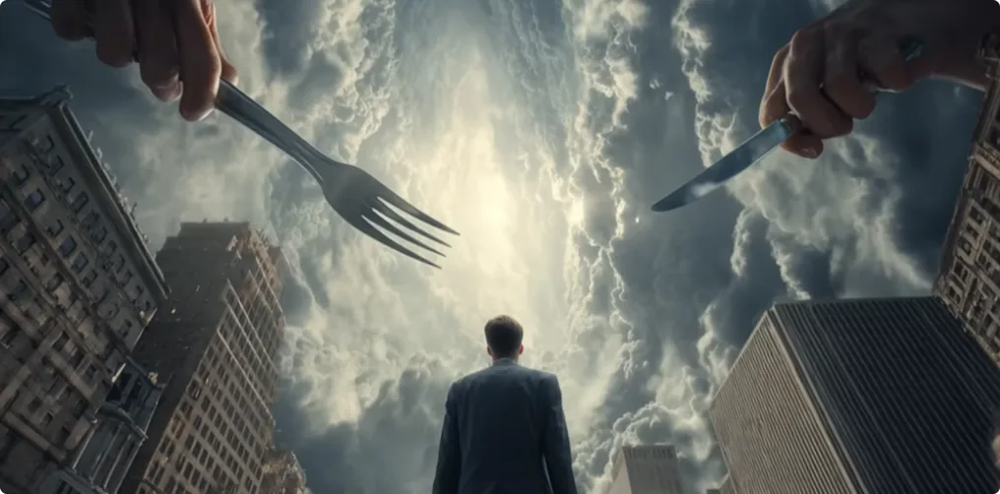

所以，人与人之间，猜忌和防备成为了常态。看似人潮喧嚣，实际上都是一座座孤岛。大多数人其实是有真情的，可笑的是，现实世界却没有。人本该是世界的创作者，却创作不出一个真情的世界。

最后是**信息失真**。

所有围绕在我们身边的信息，真的不多。你能走的人生剧本基本定型，不管是人为设计，还是玄学层面的设计，大多数人都逃不出这两个框架。

你的理想再丰满，也跟你无关。你就像是 NPC，不管多高级的 NPC，也走不出既定的程序。
而想要打破这种不真实感，唯一的路径只有修行，或者直白点说，是修仙。
只有修仙，才能彻底改变一个人的命运，改变你的生命本质，把你挪出 NPC 的位置。只有修仙能给人最大的选择自由，或者说，最大的自由意志。

其次是情感上，只有修仙人之间的感情是纯粹的。修仙之人不以个人利益为前提，而是以道法为共同理想，可以说是真正能体会何为同道中人的人了。

只有在修仙的过程中，你内心深处的愿景得以表露，也没有人会拿现实嘲讽你的理想。

## 第二: 明利害, 懂得趋吉避凶

以前我会跟大家说，修行、修仙可以做到趋吉避凶。
修仙人是自然的孩子，大自然无论如何也不会为难修仙之人，所以修仙才拥有真正的安全。

但现在我说得更直白点：修仙就是为了活着。“活着”这两个字已无价。

因为有些东西，**知者不好多言，言多者大多不知**。

博主一直以来透露了很多事情，差不多把神秘学领域都关联了起来，但大多都只打了桥墩，没有铺桥面，也没法铺桥面。这也是很多人说博主讲的逻辑有漏洞的原因。

现实就是这样。很多知识和信息的传递，由于限制太多，只能是有点社会阅历、修行阅历的人才能接收到。

很多人觉得：“我现在好好的, "活着"又算什么理由？”没关系，听不懂，可以再在生活中好好磨磨性子。毕竟一个人未经历大的磨难，很难大彻大悟。

话说之前我做了一个梦，梦里道法说他怒了。不过具体什么意思，我也不太懂。

## 第三: 渡自己周边的亲人

自古以来，一人得势，家族享福。在修行、修仙领域，也有一句话叫“一人得道，鸡犬升天”。

这里面的道理其实是相通的。
在资源匮乏、社会信任稀缺的环境中，以血脉为纽带的家族，是最基本、最可靠的利益共同体。

>家族会集中有限的资源，去投资最有潜力的成员，助他成才、成功。这是一种着眼于长远发展的投资。而该家族成员成功后，则有责任和义务反馈和反哺家族，以此实现整个家族的繁荣与延续。

而在修行领域中，一人修好，必然也辐射到身边的人，尤其是跟你以血脉相连的人。
首先是**气场**。
你的气场强了，必然会辐射和改善周边的人和环境。哪怕是你家养的鸡和狗，也能沾点真气，说不定还能成精。
其次是**命运**。
你的命运改变了，你带出的因果就变了，你家人的结局也会随着你的选择改变。
最后是**机缘**。
你成为了仙道上的人，你的家人其实也比常人多了一个引渡的缘分。你的家人比陌生人更容易走出 NPC 的角色。

不过别误会，这跟帮亲没什么关系，其实就是就近原则：
眼前人能渡就渡，渡不了也拉倒，就这么简单。

总的来说，想保自己所爱之人的周全，要先能保自己周全。除了修仙，其他手段恐怕都难。

## 第四: 活的更加通透

世人在情感、利益、胜负上执迷不悟的行径，其实是很可笑的。

因为在信息严重失真的情况下，理性和逻辑也毫无用处，辩论也只是无意义的争执。对错已然成为立场的工具，而非真理本身。

人类无法达成共识，争执成为最好消磨精力的手段，可谓是被人卖了还帮着数钱。

想要结束这种不明不白的痴态，最直接的办法就是弥补信息差，尽可能看得更清楚。

既然你改变不了你的地位，也改变不了血液，那么就尝试改变圈子，尤其是那些难以约束的圈子，比如玄学圈。这类人的很多消息都来自于无法管辖的神秘世界。听听他们说什么，也许对你有好处。

但我的建议还是：
修仙、走正道，才是对自己负责。毕竟真知不在道上，还能在哪呢？

## 第五: 知道未雨绸缪

一个人再聪明、再有远见，也无法预料"黑天鹅事件"。
在这件事情上，通灵师比占卜师有用，占卜师比算命师有用，算命师比天才有用。

总结起来就是：消息越不受人管束，这件事越有可能成真。

道理很简单，**大道先行，而德后动。说要有光，才有光**。黑天鹅就是这样的霸道。

他说他来了，最先得到消息的是无形的神秘世界，一层一层往下传，最后才到人间。所以，人是最后一个知道的。

现在行情不好，很多人都喜欢算上一卦，希望做好人生规划，这其实都是自欺欺人。算命改不了命，知道会发生什么，跟你能不能改变结局没有直接关系。

你规划得再严谨，到头来该空也还是空。

很多富豪和家族的兴衰，跟算命没什么关系。算命算不出财富，究其原因，时也，运也。

有些富豪觉得自己的运已经准备得足够多，天不怕地不怕，再不济，瘦死的骆驼比马大。

可是在黑天鹅面前，这还真不一定。没有谁的运是固定的，也没有谁的命是固定的。黑天鹅面前，人人平等。

## 结尾
还是那句话：除了对修仙的规划，其他的规划我真不看好。

> 机关算尽终成患，镜花水月了无痕。

从这期开始，博主的讲话会更加现实，只说给有一定阅历、能听懂的人听。

因为我发现，那些本就听不懂的人，就算把道理给他掰碎了，他也还是理解不了，那我就不费这个力气了。

> 取乎其上，得乎其中。

最近很多人说，无法理解博主作为一个修仙之人，为什么要谈论现实层面的利害。

这个道理也很简单：
修仙是超脱现实，不是脱离现实。修仙者身在凡尘，必须理解和驾驭现实的规则。

修成仙可比干一番事业难多了。脑子不清醒、不严谨的话，你拿什么修仙呢？

我是修炼者小烨，我们下期再见。

## 什么人适合修仙？

你是在什么时候开始有了修仙、修佛的想法？

据我了解，相当多有缘修仙佛之人，他们都在童年阶段因为一些特殊的经历，从而觉醒了修行的意识。

比如：
- 有的人小时候亲眼目睹云层中有仙人穿行；
- 有的人梦到过前世的师父提醒他要修行；
- 有的人的父母在胎梦中梦到过巨龙在天地间穿梭。

而更多的有缘人，则是从小就有一种感觉，好像今生有什么事情没有完成，总觉得这件事情只有通过修行才能得到答案。
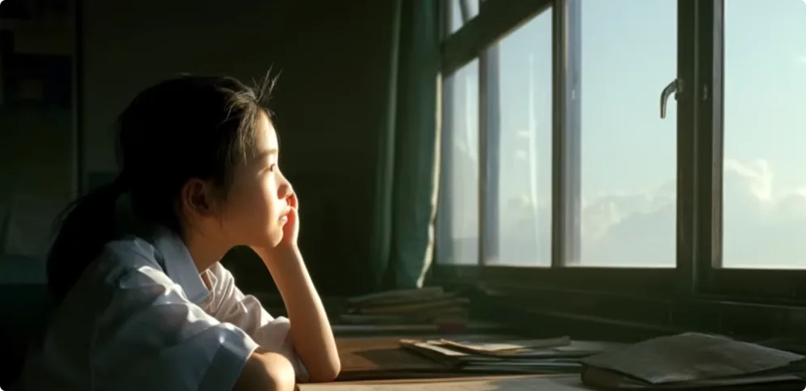

当然，还有更多的启蒙方式。无一例外，这些启蒙背后都有不同的神秘力量在推动，目的是让这些人尽早觉醒修行的意识，开启他们今生的寻路之旅。

在找路的过程中，虽然那些古籍不曾记录真正的修成秘诀，但也在极大程度上培养了灵性思维。
这是一部分前人留给后来者的教诲，但前人终究是不能让后人从书中得到的，因为这违背了修成仙佛的根本逻辑，也就是：
- 实践大于理论；
- 现实大于空想；
- 正果大于剖心。

所以，这些修行人最终都要脱离虚无缥缈的书本，回到现实、实践和实证中来。

以上种种，自幼就被启蒙过的人，其实都可以说是该修行的人。但并不意味着该修行的人就能修有所成，有了修行的意识，并不意味着有了修行的资质。

因为想做一件事跟做成一件事之间，相隔十万八千里。一个人想做成一件事，心性、认知、条件、手段都必不可少。

那么今天，我们就来说说什么样的人才有机会接触和实证修仙佛的道路。

## 一、要从心底里想修仙佛

首先是要从心底里想修仙佛，想从尘世解脱。这是第一步，也是最难的一步。

如果一个人没有强大的、长久的信念，就做不到排除万难，也不会抵达终点。
**当现实和利益都无法说服自己坚持下去时，往往是内心深处那份不可动摇的信念，让人扛过去，让人找到路。**

在视频的开始，我说到，真正的修行人都有一个启蒙阶段。启蒙的目的，就是尽快唤醒修行人修行的本心，也就是他们的深层驱动力。
真正的修行人，都是各类修有所成的生灵转世来的。尽早被唤醒，他们可以尽早与尘世保持疏离感。

尽管大多数修行人会忙于家庭和工作，但是不管他们怎么忙碌，他们也会时不时地想起要修行。他们会觉得，如果今生没有接触到修仙佛之道，那就不完整，甚至因此感到悲伤。
这种深层驱动力会持续推动他们去找路。

正如之前我说过，人间邪道很多，骗局很多，灵界的尔虞我诈也很多。想要看破谎言，想要排除万难，就需要不断探索、不断试错、不断验证答案。
哪怕最后精疲力竭，也做不到放弃，无法忘记寻找真路。而这一切行动，如果没有想修行的本心，就做不到。
**在走投无路的情况下，这些修行人必须迫使自己动用直觉，思考真正的修行、修炼是什么样子。要尽可能地回忆起前世修行的感觉，直到重新悟出真气的必要性，如此才有机会识别出真正的修炼道路。**

然而，我之所以把修行的本心放在第一的位置，是因为我发现，相当多的修行人哪怕已经引渡到路上，仍然缺少持久修行的恒心。

如果说找不到路的修行人是处于学前班的状态，那么找到路的修行人就是小学一年级阶段。其实离登天的考试还有很远的距离，但是后者常常像泄了气的皮球一样，有了一种“上岸了就安全了，可以躺平了”的错误认知。

也许是以前找路太辛苦，所以找到了路就松懈了。
这些修行人应尽快认识到，修行是一辈子的事，不是一时的兴趣，不是生活的插曲。

这其中的差别在于：
- 一个是想修行，一个是想修成；
- 一个停留在想，一个更注重做，想要持续精进学问，想要接受考验升级。

那么，修行人应尽快转变观念，将“想修行”进阶成“想修成”。如此，你才能抵达成仙成佛的终点。

## 二、人品关乎修行之路

如果说想不想修行是个人的事，是个人的觉悟，关乎的是找不找得到路，那么人品的好坏，则关乎一个修行人能不能规划好脚下的路，能不能争取到更多的修行机缘。

因为：
- 一个求学者，离不开教导他的老师、师父或者贵人；
- 一个修炼者，离不开和各类生灵打交道；
- 一个成仙成佛者，离不开对道法的维护和实践。

无论修行人处于何种角色，他都必须考虑自己和他人、和众生的关系。

更何况，在修行大道上，所有修行人都是匮乏不足之人。
**知识、资源、机会都是从高处流向低处，由丰盈者施与不足者。这时，人品的重要性就体现出来了。**
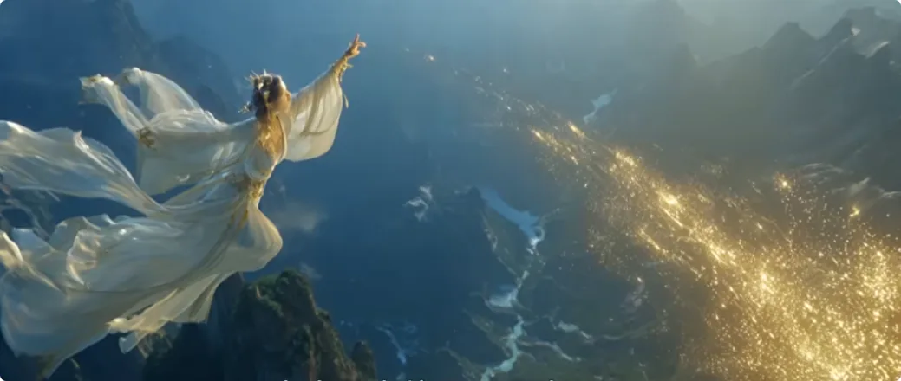

所谓“得道多助，失道寡助”，没有谁会喜欢跟一个人品差的人打交道，哪怕黑帮也不待见这样的人。

如果你认可《凡人修仙传》里那种价值观，那你这辈子可以和修仙佛说拜拜了。
宇宙不可能让一群自私自利、无情无义、目无章法的生灵修上去，让他们去管理众生的生命之源、发展之源。

那么，对于一个修行人来说，什么人品才算是好的呢？
总的来说，记住这个底层逻辑就好了：**不要让对方感到为难或受困。**
接下来，我会用几个修行人的必要品质来解释这句话。

### 1. 修行人要真诚

修行人要真诚，言行合一的真诚。

如果一个人求道时表现的是一副轻浮的态度，那么这个人大概率不是真心想修行的人。他最终一定经受不住考验，更何况还是漫长的考验。

对于这样诚意不够的人，向他施以援手，完全是浪费时间、精力和资源。
很多人可能会有异议：施道者难道不应该耐心教导和培养吗？

那我问你，现实中有几亿的修行人，一个个去教导，早累死了。在时间、精力和资源有限的情况下，当然是尽可能引渡本就准备好的人。
所以，如果你诚意足够，记得言行合一地表达出来。不要让施道者猜，没有那么多时间来理解你。

### 2. 修行人要忠义

修行人要忠义。背信弃义永远是关系的大忌，这意味着施道者之前的所有付出和心血都付诸东流。
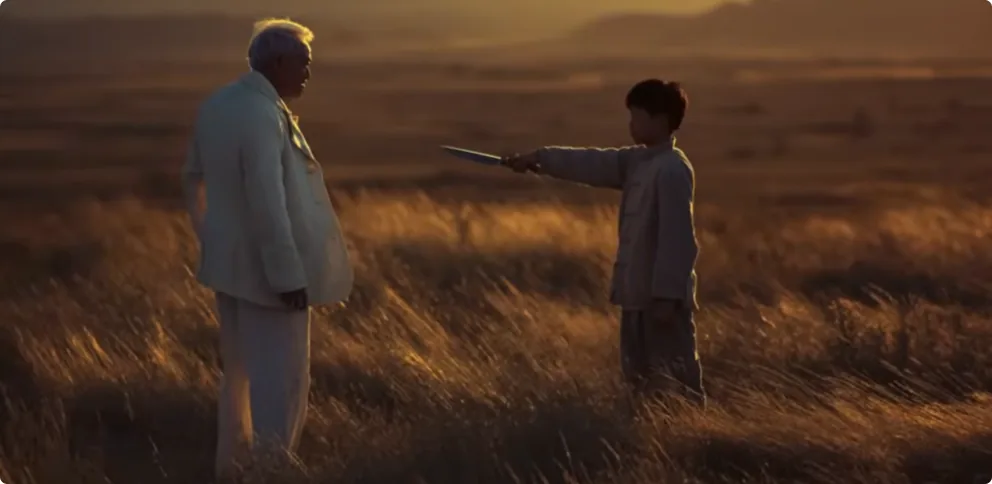

这不仅是对施道者的不尊重，也是对道的漠视。
比如，今天教会你修行的功夫，明天你就自立门户，不甘被规则约束，还美其名曰要大发慈悲、普度众生。

不仅漠视宇宙的修行考核规则，还反称所谓规则是施道者不愿分享的自私行径。同样也意味着，背信弃义的人已将施道者陷于不义之中，因为施道者将重要的事物托付给了不值得的人。

对道而言，他有失察之责，且要承担后续造成的一系列因果损失和风险。

也因此，从结果倒推执行过程，从一开始，施道者就必须观察求道者是否有任何不忠诚的行为，不论求道者有意还是无意。

### 3. 修行人要独立

所谓“君子之交淡如水”，修行人之间本就应该淡如水。
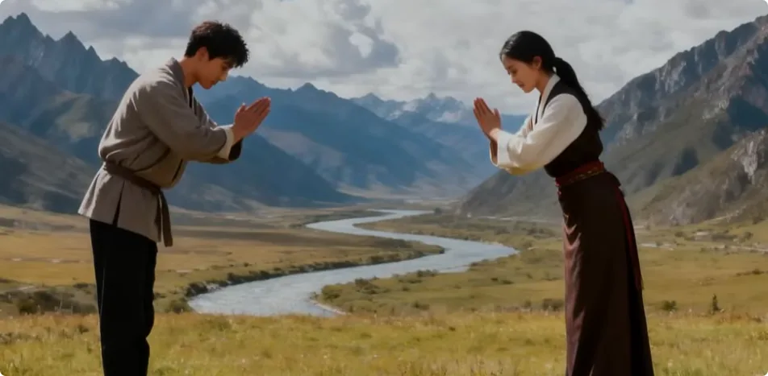

每个人都是独立的个体，每个人都需要有自己修行的空间。没有谁喜欢被反复打扰、被索取、被情感和道德绑架、被依附等等。

听起来很合理，对吧？

然而，恰恰有很多修行人都做不到。很多修行人常常遇到一点点问题和困难，都不愿独立思考和克服，还美其名曰这是“打破砂锅问到底”的求知精神。

### 4. 修行人要重视规则和契约

修行人要重视规则和契约，要言而有信，要善始善终。

正如前面所说，低位的求道者想要高位的充盈者向自身倾斜精力和资源，想要众生之间有公平公正的成长机会，那么求道者务必要遵守现有的修行规则，遵守修行的契约。

没有规矩，不成方圆。人间秩序是如此，宇宙秩序亦是如此。

好比为什么要安排雷公电母？为什么不是谁都能跑到天空中降雨？因为没有宏观规则约束的话，必定会带来混乱和灾难。

## 三、修行人要有大爱

在之前的视频中，我没提到过这个理念，因为是否慈悲渡人，完全是修行人自己的选择。

但我发现，很多人有点过于冷漠了。

修行人最终都是要去悟道的，不只是悟道，道的规律也要悟到，道之所想。如此，才能顺道而行。

得道飞升，而道终究是爱众生的。不是小爱，而是大爱。

何为大爱呢？
- 教导是爱，戒尺也是爱；
- 舍身渡人是爱，尊重他人命运也是爱。

两者都是为众生、为他人考虑后做出的选择。选择慈悲也好，选择严厉也罢，都是大爱的一种表现。

怕就怕在修行人不做任何思考，不做任何选择，一副“事不关己，高高挂起”的态度。因为道同时包含两种不同倾向的爱，而最终实现和呈现这两种爱之一的人，是选择它的众生。

选择意味着造化，而不只是空有慈悲的眼泪。

回看历史，修成仙佛之人，大多给人慈悲为怀的印象。因为只有这样的人，才符合“损有余而补不足”的道德，才具备成神的资格。
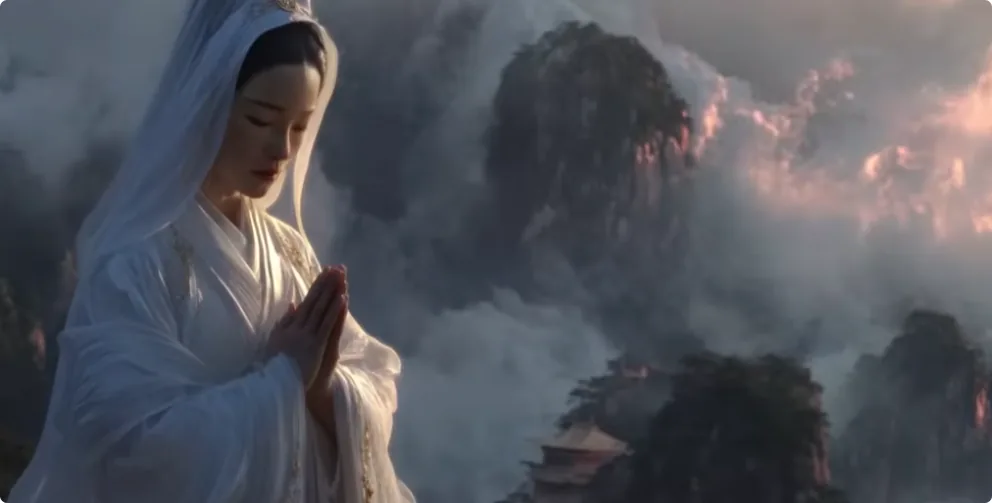

所以，我觉得**大爱应该作为修行人自我评判和自我实现的标准之一**。这次才拿出来单独讲。

## 四、修行人要谦虚自省

人外有人，天外有天。人再聪明，也无法超越宇宙。

道法本身很多道理就是大道至简，真传一句话，需要你在修行、修炼的实践过程中，反复去品同样一句真理。

**同样一句真理, 当你进入不同的修行阶段时，这句话的前置条件也会随着你而改变。你再去读，会发现句意又不同了。**

然而，很多人聪明反被聪明误。要么追求那些复杂晦涩的概念，要么觉得自己什么都听懂了，忽视了实践才是学习知识的根本，最后反而连最基本的一句话，甚至是几个字，都不知其深意。

所以，只有谦虚的人才能学到真正的知识、真正的智慧。
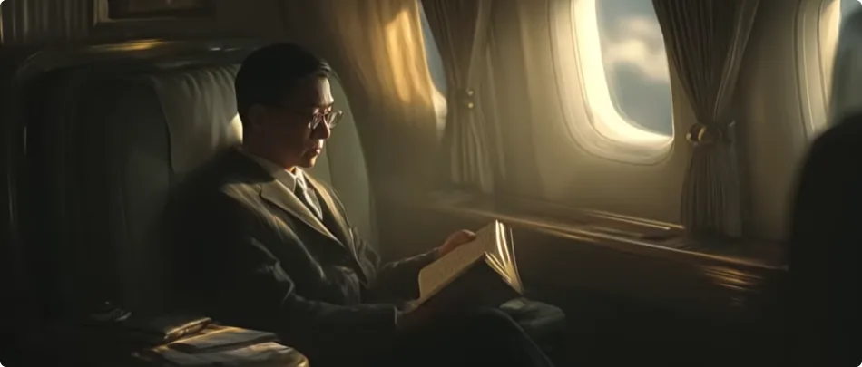

况且，成仙成佛路上之严苛霸道，会以何种方式考核你？如何在你的弱点和盲点上设置考题？你根本不清楚。

唯有时时谦虚自省。

一个谦虚的人，能够时刻仰视大道、敬重大道，通过换位思考，持续观察到自己的不足，认识到自己的渺小，明白还有很远的路要走，于是“终日乾乾，夕惕若厉”。这样的人才能真的进步。
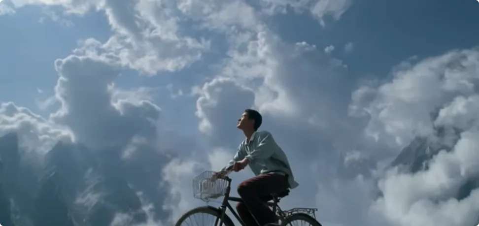

而骄傲自负者，大多认为自己的聪明才智已经能参悟到道，认为自己所悟已然接近于真理。

这样的人在未来极易向着错误的方向一意孤行，最终给众生带来灾难。因此，大多时候，修仙佛的道路上首先会过滤掉自负的修行人。

此外，也只有谦虚的人才能通过贪嗔痴的考验。

一个谦虚的人，会始终把自己放在学徒的位置，不会因自身地位的改变，或者资源的多少，或者机会的得失，而心生贪婪或愤恨不平。

知道自己的所得所失皆是自身造化，大道之下众生皆是平等的，他便不会迷失。

最后，也只有谦虚的人，才能务实地面对现阶段的不足，循序渐进地解决现阶段的困难，而不是整天傻呵傻呵的，沉迷于修行的幸福中，成为修行路上的巨婴。

## 五、修行最终要落实到行动

前面四个可以说是心灵层面的修行，也就是要修心的部分。

但心是易变的。你可以说你想通了，而能否做到，并且不因现实的挑战而改变心意，却是最难的。

因此，付出行动去实现，才是考验修行人的重点。

所谓行动力，不仅是你要在心理上敢于行动，也需要你具备行动的素质，比如：
- 金钱；
- 时间；
- 独立性；
- 学习力；
- 等等。

直白点说，就是通过你已实现的现实条件，来判断你当前实现修行的能力。

这就好比你不能只在简历上把自己夸得天花乱坠，而实际工作能力却做得一塌糊涂。修行得道，最终仍要看你实现的能力。

我之前讲过高经济、高生存能力的必要性，很多人听不懂是什么意思，也常误解我的意思。今天我来举几个例子，大家就知道了。

### 第一类修行人

第一类修行人尽管学历不错，但是社会工作技能并不算出众。加上现实就业环境不好，每天在公司朝九晚九、上六休一，一个月尽量抽出一两天时间出门修行。
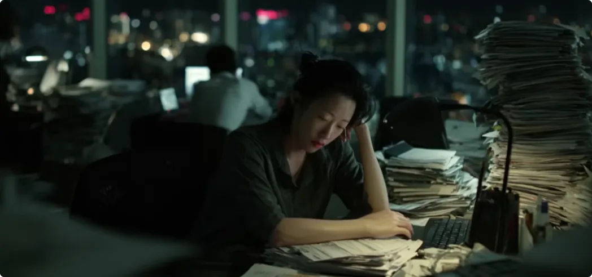

修行也只能做到这种程度，没法抽身去做更多的事情，甚至总结学习经验的时间也少。不上班就没有收入，辞职可能找不到更好的工作。你该如何选择呢？

### 第二类修行人

第二类修行人有家庭，有孩子要养。

有的人没有房贷、车贷压力，但是收入和开支都需要和家人共同商议；有的人还需要在节假日陪伴家人；有的人甚至受到另一半的约束，不同意他修行。
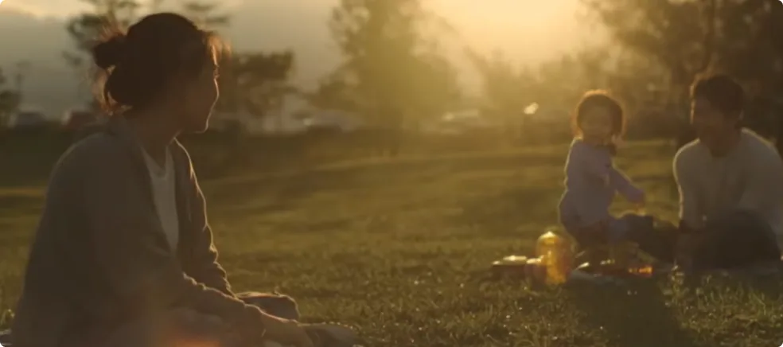

你如何平衡家庭和修行呢？

### 第三类修行人

第三类修行人可以是所有人。

体会过修行的好的人，都想尽量去引渡自己的亲人。因为修行人更看得透尘世那些无意义的苦，哪怕亲人此生注定不会修行，但是能抓住机会启蒙、开智和改命，已是万幸。

在这时候，能否在顾好自己修行的情况下，再去兼顾家人，其实是有挑战的。
而这些都仅仅是停留在修好自己的范畴。如果你连自己都修不好，又何谈引渡他人呢？

## 六、真正的修炼需要现实条件

很多人修心修惯了，没有任何实际支出，不知道真正的修炼需要经济支持。

一个修行人出门一趟，飞机、高铁费，租车费、油费、伙食费、住宿费、能量守恒的损耗费用等等，都是要花出去的。

更何况，很多人只在节假日有空闲，而节假日出行的费用还得翻几倍。所以，没有一定的现实条件，是很难修行的。

有些年轻人写信说，自己可以省吃俭用，尽可能修行。那我得泼盆冷水了。

**修行最没必要吃的苦，就是衣食住行的苦。**
因为大多数普通人也是这么过来的，如果只是做到这点就能修成，那绝大多数人都可以。

所以，皮肉之苦并不是修行考核的主要范围。
真正的苦，真正的考验，是你发心之后：
- 如何解决现实困境；
- 如何面对两难的选择；
- 能否经得住长期的付出；
- 能否实现自己的目标；
- 能否经受得住不被理解的孤独。

通过看你面对困境的选择和处理能力，来判断你的修行觉悟，判断你是否能践行前面四个发心。

所以，不要怪博主的引渡要求高。因为我见过太多的人说自己多么真诚、多么想修行，到头来吃不了一点苦，面对现实的困境也只是鸵鸟战术。这就属于修行觉悟还不够。

因此，我常常强调：除非这辈子只想修行、修仙，或者从小启蒙要修行、修仙，否则不要轻易尝试这条路。

我是修炼者小烨，我们下集再见。

## 关于修仙的七个条件

今天依旧来分享实修修仙的经验。
早些天，有个网友给我写信，说我运用了很多“不坑穷人”的顶级营销技巧，让人跃跃欲试，但又想不明白博主为何要这么做。

这是因为，高价值的东西就应该分享给懂它的人听。机会终究是给有准备的人。有句话叫：“师父领进门，修行靠个人。”
如果一个修行人始终听不懂这些简单的道理，等个一百年，人都凉了还没修上去，那么渡他的意义何在呢？

一个人的认知，很大程度上决定了他在修行上的起点。
废话不多说，今天我整理了几条修仙所需要的条件。

## 第一，来历

来历绝对是第一位的。

来历是修仙的隐形资质，几乎决定了一个人的缘分。因为来历代表的是一个灵魂在过去修行的总质量，也就是修了有多久，以及修出了什么结果。
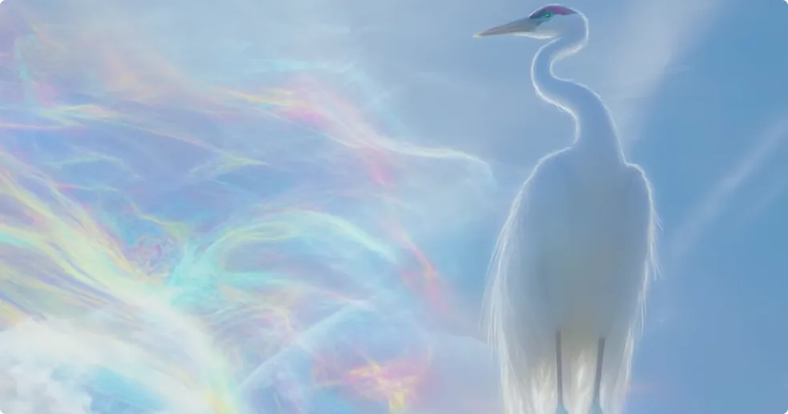

真正有缘修仙的人，早在遥远的过去就一直在修行、修炼，而且是在正道上修得了一些成果的。即便不是都修成过神仙，那也一定是被道法认可过的。

所以，早在他转世成人前，道法就已经给他开通了一个登天考试的机会。
这也是为什么我一直强调，**冥冥之中想要修行，对一个修行人来说有多重要。** 因为这代表你本来就是这条道上的人，是有修行天赋的。

曾经修过仙的人，直觉上对正道是有模糊印象的，大致能感受到哪条路是真的，对经书不太感冒。而没修炼过的人，更喜欢读死书，更喜欢修心、静坐，做一些不实在的事情。

其次，来历好也意味着多一层保护。

有缘修仙的人以前付出的功劳不在少数，所以道法和诸神都会记着你的好。因此很多时候，哪怕这个人转世后变得愚笨，也会有股神秘力量把他引到正道上来。如果遇到危险，也不至于面临死亡。

但也有极少数人是普通人，没有来历，这就很需要悟性了。对修仙没有过感触的人，很难开启这个机缘。

还有一些来历不上不下的，这种也是修不成的。这类人往往觉得自己可牛了，觉得自己来历不凡，就应该被特殊对待，等着死了自会有人接他上天。这种人，老天一点机会也不会给他，因为自负本就跟修行背道而驰。

## 第二，真气

凡人和仙人之间最大的差别，就是气的差别。

凡人凡气，仙人真气。

自先天一炁进入新生儿的躯体后，此炁便开始凡化。随年龄增长，凡气渐盛，七情六欲也渐盛，直到耗尽死去。

所以从头到尾，人的体内都是没有真气的，只有不同质量的凡气。

要问真气在何处？答案是在自然。

因为道法自然。

在自然的某个地方，日月星辰、风雨雷电、江河湖海的真气会汇聚。这是为何自古仙人都住深山，而不是待在道观里。
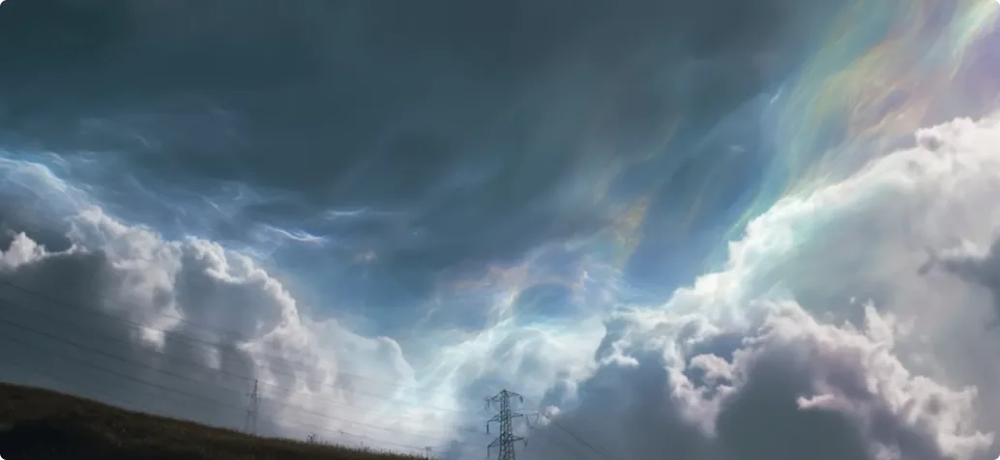

过去的丹道修炼法，其实也是拿着这个气来修炼，而不是人气。
大多数人不知道的是，修佛也需要真气。连菩提树也是一棵长在真气上的树，基督背后所谓的“被提升”也是靠真气。

只有真正触及这个修行核心的人，才能看到不同宗教背后都在说的“升天”指的是什么。

## 第三，真法

首先，很多诀窍和知识，其实是一种只可意会、不可言传的体验，需要经历相同的情景才能理解，而文字根本无法将这类知识记录下来，尤其是那些超过常人认知的知识和信息。

所以，文字并不是最好的知识载体。

其次，法不轻传，道不贱卖。越是珍贵的东西，对得道者的要求就越高，往往需要得道者具备一定的心性、格局和同情心。

因为**德不配位，必有灾殃**，所以登天的真法必须先考核才能得到。

除此以外，越顶级的东西越容易招致垄断。因此，珍贵的知识和信息天然自带定义权和流通权。

在一把土都能私有化的人间，修行人应该尽早想明白：
*凡是能流通的书籍，都不会记录真正长生的方法。*

历来真法显现时，都是仙人亲自下来渡人时才出现的，走后便一并带走。此外的时间里，人间的真气都是不开放的。

“灵山脚下狮驼岭”这句话，充分体现了道对真法的严格管制。不该你触碰的东西，不管你的借口多么冠冕堂皇，你敢伸手去要，就是找死。

现在很多人被“人人都是神仙佛的化身”和“向内求就足矣”的理论迷得走不动道。这类人的心性，本质上还是自负的。
还没修成，就把自己当成神佛，把自性凌驾于道法之上，用唯心的想象替代外部的现实，甚至把“终有一日元赐回来”当作大保底，完全丧失了脚踏实地寻求进步的能力。
实际上，道家没说过人人都是神仙，佛陀没说过人人都是佛陀，上帝也没说过人人都能上天堂。

从一开始讲的就是：***人有这个潜力，但需要修行正果、菩提。***

## 第四，机缘、机会

为什么历来修成仙佛的人很少呢？为什么不是一群一群地飞升呢？

其实这个道理跟科举是一样的，不存在全国青年一起上清华、北大的事情。
为什么清北每年只录取固定的数量？为什么不把几百万考生都录取了呢？

天上的能量运转，有生有灭，有分有合。只有当新的大生大合到来时，才能创造足够多的真气和位置，容纳新晋升的神明。

也就是说，修仙是需要时机的，不是什么时候都可以。
所以大多数时候，修炼的生灵并不会转世成人，没有必要在得不到真气修炼的时期沾染人性和人气。
反之，当你看到越来越多性格古怪、不解人情的人出现的时候，可能就是修仙的时机到了。

最近博主在《阴符经》看到一句话，感觉要长脑子了，在此分享给大家。它是这么说的：

> 天发杀机，移星易宿；  
> 地发杀机，龙蛇起陆。

## 第五，引渡人

你可以模仿成功者的路径，但复制不了成功的关键。
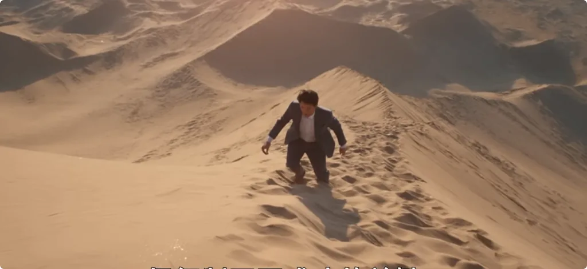

比如高度情境化的实战经验、帮你填补信息差的贵人、特定的时机等等。

总结起来说，就是**认知跨越才是成功背后最难的部分。成功的人从来不是一个人完成跨越鸿沟。**

在认知空白的领域，其实都有指路的贵人，有懂门道的人指点他该怎么做。这些特定的、专有的、稀缺的、无法复制、无法公开的部分，通常不会记录在成功者的自传中。
同样，历来修成仙的人，无一例外是神仙下凡，亲自指点修行人如何在特定的地方、特定的时机，用特定的方法，学习特定的经验，完成特定的修行，完成试炼。

以上种种方法、路径，如果没有这个引渡人的真传，一项都不可能完成。

甚至连这个修仙的人也是特定的，有特定的来历。

所以，当此人成功修成飞升后，所有特定的、无法复制、无法公开的部分，统统都不会流传出来。顶多告诉大家有这么一件事，或者当事人有什么心得体会。没了，结束了。

## 第六，个人素质

能成功的人都具备一些良好的品质，比如：

- 目标明确；
- 积极进步；
- 通情达理；
- 真诚讨教；
- 性格独立；
- 刻苦钻研；
- 坚持不懈；
- 言而有信；
- 有始有终。

这也是有贵人愿意帮助和提点他们的原因。

孺子可教也。

而这样的人，大多都会逐渐积累出一些才能，可能是学业上，可能是事业上。反过来说，通过看一个人的才能，可以客观了解他具备的心理素质。

其次是经济条件。
经济基础决定上层建筑。

香港富豪田北辰曾坚信，只要有斗志，弱者也能变强者。之后，节目组让他体验为期一周的底层生活，并且不得动用原有的财富和人脉。
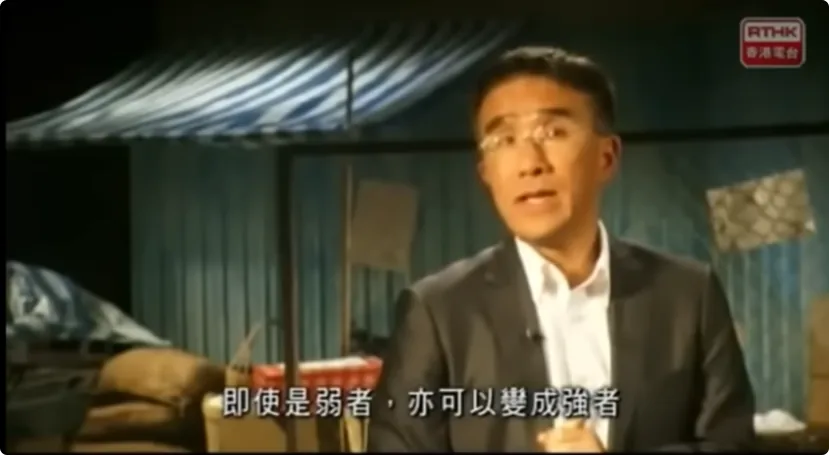

结果短短两天时间，他就被彻底打脸。高强度的劳动让他完全没有精力去思考，微薄的工资让他吃了上顿，只想下顿。他的精神和思想已经完全妥协和退化。

所以，人没有一定经济基础，是很难考虑修仙的。

不过凡事皆有两面。经济基础太好的人，大多并不想修行，因为可选项太多了，何必修行为难自己？
相当多投生在这种人家的修仙者，也迷失在其中。不过，很快也到你们想修行了。
总之，大多数修仙之人，既要体验到人间的苦，明白要修行，也要体验到如何才能成功，以具备实现修行的能力。

## 第七，临门一脚

有人说，厉害的师父都是主动找徒弟，甚至心中早有选定。

师父可以这么想，但徒弟也这么想的话，那就完蛋了。
常言：

> 医不叩门，师不顺路。

真正有价值的东西，从来不会主动送上门。主动自降身价，那样肯定不被珍惜。

反之，一个在家中等着不劳而获的人，肯定不是可教之才。

一个悟性足够的修行者，应当知道该以何种姿态迎接高价值的机缘。

所以，真正的师父可以坐在十字路口说书，在那里等徒弟上前问路，但他绝不可能来到你面前，请你当他的徒弟。

所以，真正应该临门一脚的，只能是徒弟本身。
尽管修仙者的列表已有定，但如果连这个基本的道理都没悟明白，那就轮回。

几千年对于天上的神仙来说，根本不是事儿。

我是修炼者小烨，我们下期再见。

## 修行的三条路径与五条可贵性

## 你是否有对未来的担忧?
你有没有对未来感到莫名担忧？
不仅是对未来的大环境，也是对个人未来何去何从感到莫名的心慌。

建议你好好看看本期视频。这一期我会透露一些新的视角，远比算命那些要更精准，希望有的人能醒悟。

首先我要说大趋势，不管是在当前还是在未来，人就是要修行的，不修行是不行的。人们会体会到什么叫“不修行就不行”。
好比用饥饿让人们了解粮食的可贵，也终将会有些事情让人们领悟修行的必要性。这也是人类集体必须要学会的下一件事情，就是如何真正地修行。这也是人类命运想要进入下一台阶的重要审核点。

而且人类没有拒绝修行的权利，因为这是天意。也就是说，任何事情都将是围绕让人类学会修行而展开的。

**人类本该在修行的过程中推进文明，现在亏欠太多了。如果再不修行，必然要被心中的嗔念、掌握的技术所反噬。**

其次，我所说的修行绝不是一种生活方式，绝不是去念经、祈祷、打坐、尽心求神、朝拜，这些通通都不是真正的修行。空想主义修不成任何正果。

*真正的修行，得从你的肉体和灵体两个层面去改造，用能量去质变，去提升真正的灵性，提升与自然心神合一的能力，觉醒辨别灵界众生的能力。*
只有这样，人类才能认知世界的全貌，才知道真正的文明发展应该是什么样子，而不是在蒙住双眼的情况下自掘坟墓。
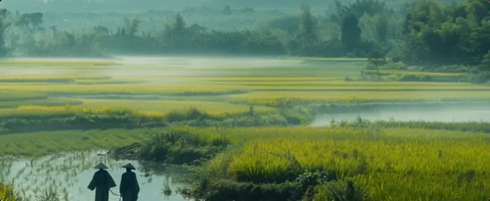

各位之所以感到心慌，不只是因为现实的变化，更重要的是能量层面在变化。大多数人目前就是温水煮蛙的一个状态，只有一部分前世有点修行底子的人感受到了不安。

比如去年我还会帮粉丝或者求道者看看身上的能量场，今年我就不看了。你知道为什么吗？因为现在的人身上越来越脏了，根本不知道自己身上跟了有多少东西，损失了多少生命能量。

而解决的方法也只有一个，就是真正的修行。

### 粉丝朋友的"黑气"案例
这里有个案例。有一个今年刚开始修行的朋友，他说他有一个易学师傅。这几年每年见到他师傅，他师傅都要摇头，说他面带黑气，不知道他又招惹了什么东西。

这次他来修行实践，回去之后立马又见了他师傅一面。他师傅第一眼就察觉到他身上的黑气不见了。观众知道黑气是什么吗？就是一种死气。

如果这个人还不开始修行，结局就只剩下一个了。之前我的视频讲过，能改变生命本质的才叫修行。哪一道能移除死亡之气呢？只有修仙之道。

所以接下来我要讲的是消除大家对修行的误解，或者说普及一下真正的修行路径。

修行绝不是说与尘世一刀两断。如果修行是这样一套说辞，那么全世界99.99%的人都做不到，都会觉得修行离自己很远，最后都不修行了，都在放任不合理的欲望。

## 三条修行的路径: 
所以真正的修行是会给到几条路径的，大致来说可以分三条：

1. **普世路径**：适合所有普通人。
2. **精进路径**：适合有慧根，但没做好离开尘世的人。
3. **飞升路径**：适合少数觉悟高的人。

刚才说的人类最终的归途是人人都要修行，指的就是第一条路。
但是当前大部分人并不知道真正的修行有多可贵，不知道修行其实是跟生命直接挂钩的，不知道人不修为自己是要被天诛地灭的，思维也没有转变过来，所以这条路还没有开放。
我打个比方，人人都知道粮食可贵，不吃就会饿死，所以需要四季务农。也没有人会质疑付出才有收获的道理，甚至收获少点也不敢有怨言。
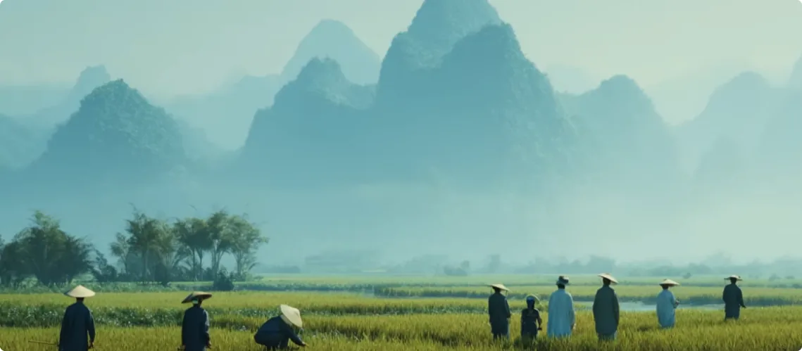

而目前人们对修行的理解远远达不到这种基本程度。大多数人觉得，修行又不是什么必不可少的事情，修行只是一种精神状态，我为什么还要付出精力去获取呢？

说白了，人们还不能理解，修行是另一种需要付出才能获取、不吃就会饿死的粮食。所以如果我说当下人人都可以修行，那么肯定有人要说了：“拿来吧你。”, 所以现在真正开放的是后两条路，同样需要有一定的认知和觉悟才能修。你是想要精进自己的生命，还是想修上天？现在没有实践和体会的情况下，说这些都为时尚早，不如先接触何为真正的修行，再做选择。

## 修行的可贵性和必要性: 
接下来我会讲几个修行的基本可贵性，或者说必要性。

1. **改变生命本质**
   这一点体现在肉体和灵体两个层面。
   修行就是用纯净自然能量滋养自己，清除掉病气、死气、浊气，建立能量场屏障，防止负面灵体干扰，这样思维才会清明。
   因此，修行人比常人更有生命力，更容易领悟事物的本质。肉体和灵魂双重防御的优势，在未来某些节点上会非常明显。
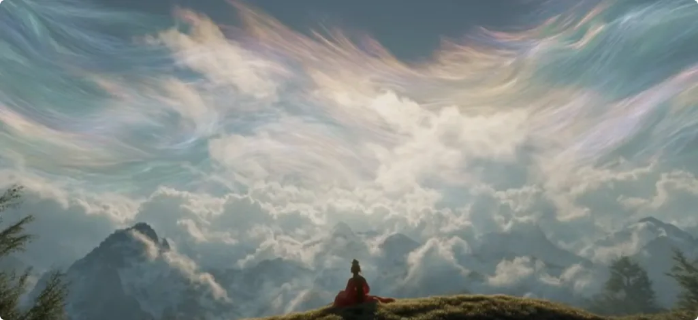

2. **趋吉避凶的判断力**
   哪里有危险，哪里有灾性在孕育，哪里安全，这个可贵性不用我多说了。
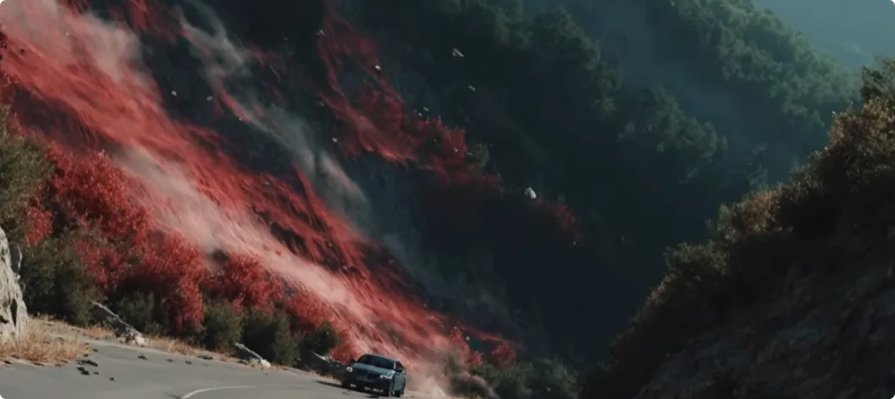

3. **超感官觉察力**
   人靠五感认知世界知识，而修行人可以多一维度，认识到更深层的世界。喜欢读书的人应该清楚，信息差在关键时候有多可贵。
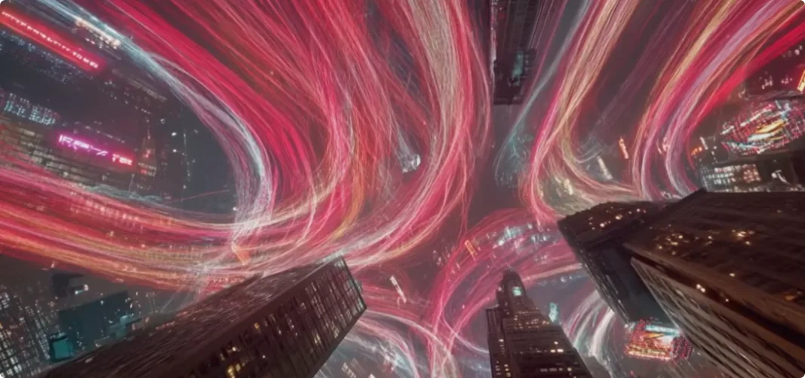

4. **正神的庇佑**
   神灵从天上看下去，个个都是肉体凡胎裹着一层凡气。唯有修行人有一层纯净的能量反射到他眼中，也就多留意你一眼。要有什么事情，也就放你一马了。
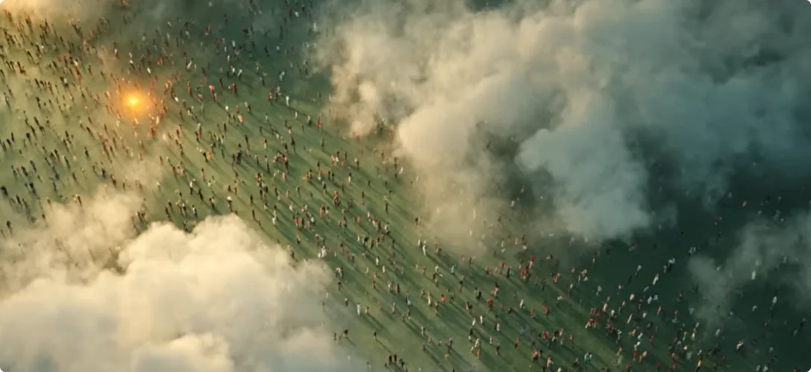

5. **能保护家人**
   这是简单的道理。你安全了，你肯定会去保你家人的安全。当然，个人有个人的自由意志，修行人也要尊重家人自己的选择。
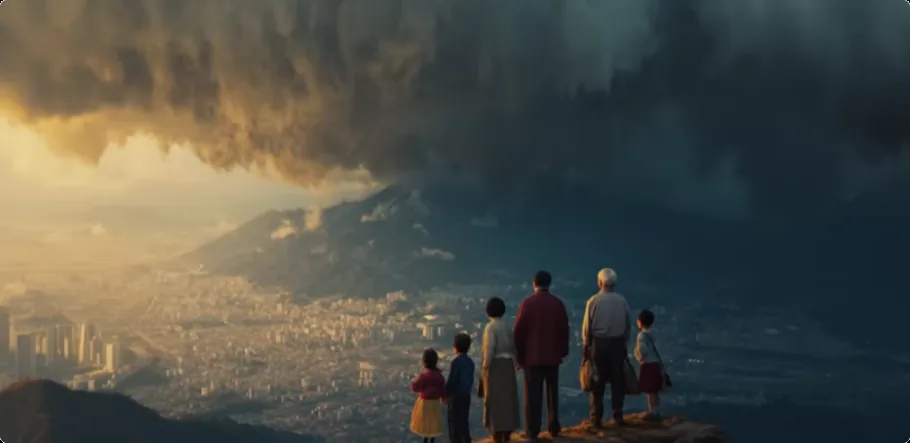

如果说这几个可贵性都无法打动你，那真的建议不要修行，等以后再慢慢领悟吧。

如果你认识到了可贵性，那不妨想想种庄稼的比喻：修行的可贵性是比五谷贵呢，还是比五谷贱呢？可不可以不劳而获？可不可以坐享其成？
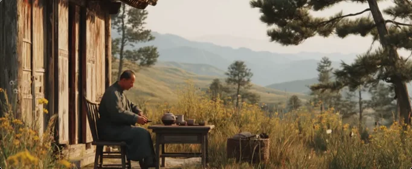

道理我就不多说了，免得有比我仙风道骨的观众说我太俗了。

## 一些关于"放下"的误解:
因为有很多人觉得，修行就是放下，不要持有或执于任何事情。可佛陀说的是放下尘世上的得失执念，不是连修行上的切实提升都放下。
修行没有耕耘，哪来实际成果？哪来果位呢？

**佛陀本人也说过，要现世正果。如果遇到现实的困难，就闭眼装作视而不见，拿“一切皆空”来美化逃避行为和精神懒惰，恐怕佛陀看了也要摇头。**

真正的修行跟种庄稼一样，修行人就是农民，需要有弯腰劳作的觉悟。只有知道付出和收获都不易，才知道“粒粒皆辛苦”，才懂得珍惜和守成。
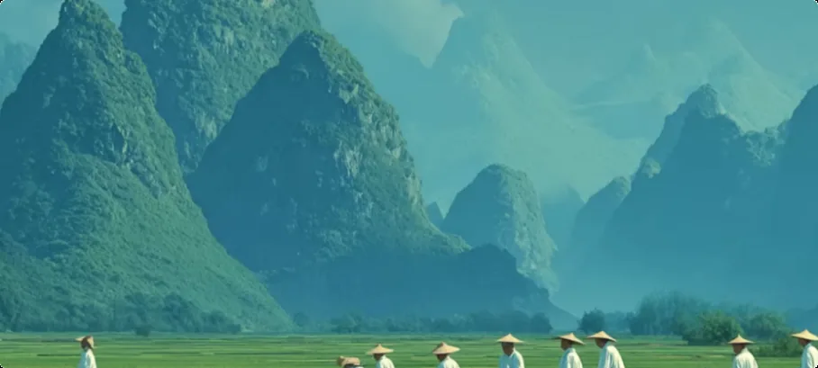

以个体为基础，放大到集体来看，天意让人类修行的意义，不仅是要人类学会如何提升生命质量，更是要让人类学会珍惜、学会守成、学会节制。

我是修炼者小烨，我们下期再见。

## 第一次接触真气的体验

>url: https://www.youtube.com/watch?v=U-psw6pO7iU&t=4s
>作者: 修炼者小烨
>

今天我来分享一下实地修炼是种什么体验，在修炼的时候会遇到什么有趣的事情，真气又会给人带来什么感受。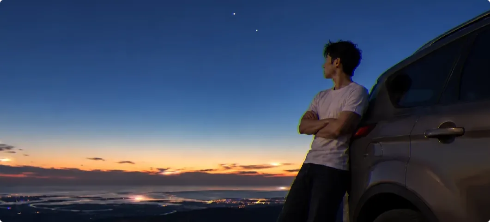

由于语言是很难描述超自然的事物，所以我会尽量把所见所闻写下来，帮助大家带入。
我以前说过，**修仙就是要先得到上面的许可，然后去特别的地方采集真气，用真气清洗自己的肉体。这个过程要循序渐进，随着自身修炼境界越来越高，人的法力也会越来越强。**

## 刚开始修炼的时候
我刚开始修炼那会儿，我对修炼也很懵懂，出去一天也只能找到一个地方修炼。不过对于我这个新手来说，我也是很知足了。

我第一次一个人出门去的是浙江的一座山上，海拔一千多米，大清早就去了，走了3个小时。
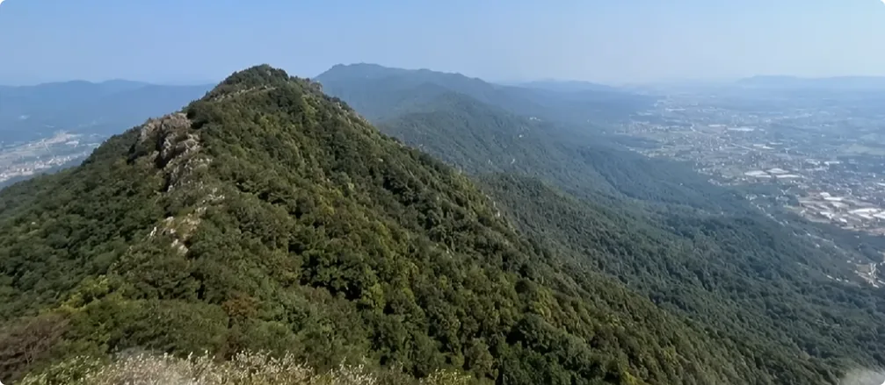

当时雾气很大，几乎隔着10米就是雾，远处的景色都看不到。当时我也没多想了，就单纯觉得选的天气不大好。

一路上保持着前程恭敬的态度去拜访当地的神灵。其实修炼就是去找这些掌管一方生机的自然神灵，请他们度点真气给我们。

后来到地方了，我就向上面请示了一下权限。请示完后，当时神仙师傅就告诉我蹲下双手去接，然后我就蹲下去晃了晃双臂。果然我感觉石头上窜出了一股无形的气，包裹住我的双臂，然后慢慢地收拢到我的体内。
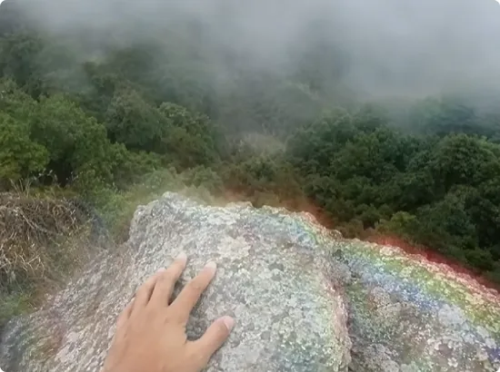

这是我第一次感受到真气的存在。那种感觉很难形容，有点清凉清凉的。总之就是肉眼虽然看不见，但是可以感受到它有个形体和范围，可以感受到一团气在身上流动。反正很快，几秒就接收完了。等我接收完后，雾就慢慢散开了，让我看清眼前的景色是什么样子。
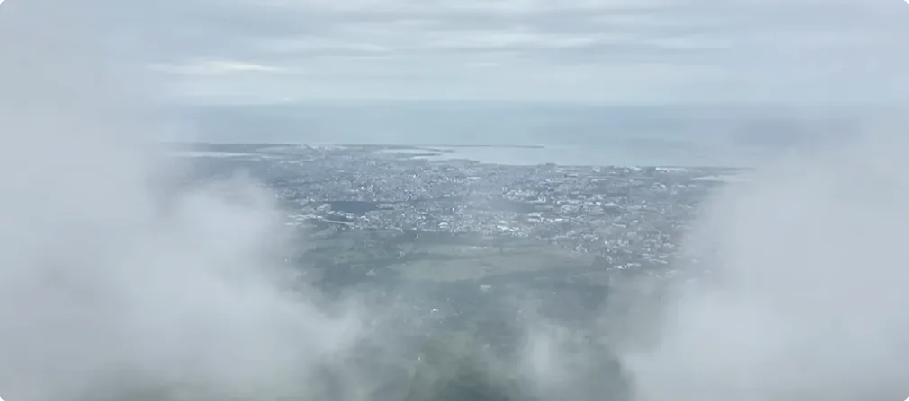
后来我才知道为什么那天的雾会这么大，因为当时我的修为基本为零。那会儿我身上的凡气浊气是很重的，在神灵的眼里就好像看见一个黑乎乎的人走过来，神灵都不知道我这人是来干嘛的，所以要起悟把人劝退。直到后来神灵知道我是得令来修炼，才把雾散去。

在那儿之后的两三年里，我又走了几百个地方，不断采集真气修炼，不断给自己脱胎换骨。

## 脱胎换骨的感受
脱胎换骨是什么过程呢？

以前我说过，**在修炼人修炼之前，大道会派阴性生灵去吃修炼人，让修炼人从厄运和痛苦中觉醒修行的意识。**

其实还有一点就是脱胎换骨的这个过程，它需要不同层级的阴性生灵去吃掉人的凡气。修炼之前，有缘人表层的那层凡气会先被阴性生灵吃掉、损耗掉，然后等人开始修炼了，神灵会先清理掉这些生灵，再用真气帮你填补回去。

相当于说刮掉一层凡气，填上一层真气，从外到里一点一点、一层一层地重塑一个人。这样人才会慢慢变得不凡，慢慢对高等世界产生感知能力，接受真汽的容量慢慢加大。
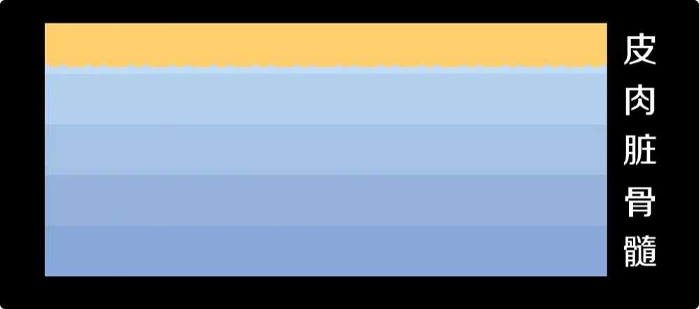

那这个脱胎换骨的过程有什么外在表现呢？

最普遍的就是人会干呕或者咳嗽，因为神灵帮人清理浊气的时候，会有很多阴性生灵从胸腔跑出来，很多浊气会被冲出来，人的身体就会被动作出反应。
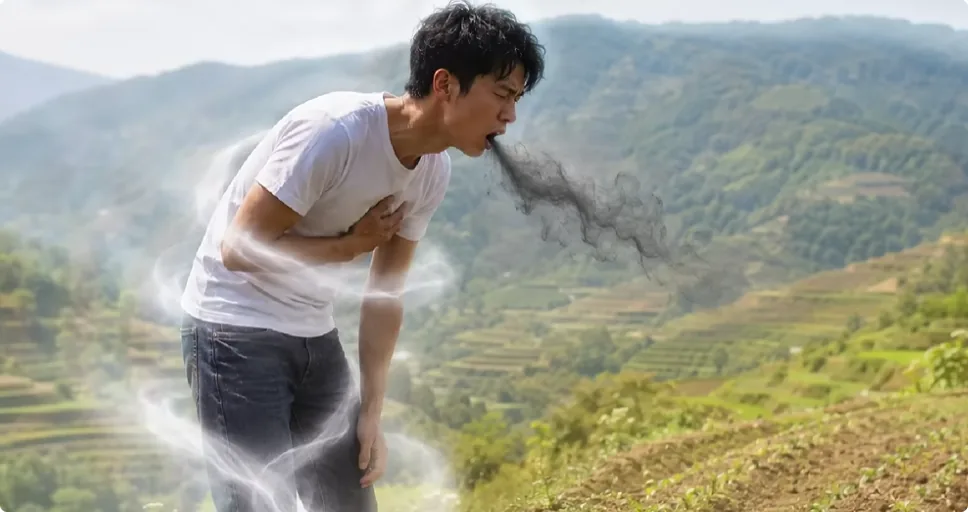

等排完浊气之后，大多数人会感觉很舒服。**首先是脑子很清明**，头上那种在城市里面待久了昏昏沉沉的感觉会消失。**然后就是眼睛会很亮**，视野突然变得清晰了不少，会比平时看得远，但是这些都是很普通的体验。

真正有意思的是什么呢？

**是随着脱胎换骨越来越深，人接受到的自然真气越来越多，人的灵魂会跟自然越来越相通，越来越能理解地球和宇宙层面的事情。**

比如说台风里面有谁，这场雨是谁下的，谁的封印被解开了，地下有什么东西跑出来了等等。这是真正的天人合一。你能觉察到的世界会很大，然后你会觉得人间的那些事情真的好没意思。
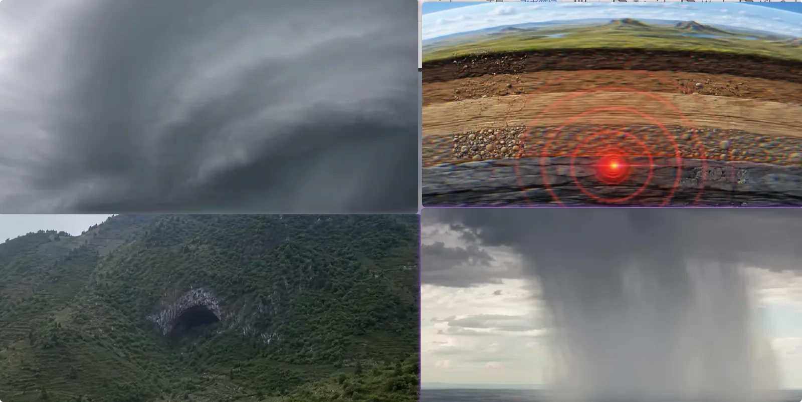

## 意义非凡的内蒙之旅
有一次是在内蒙认识，我的计划是今天待在A市，明天在B市，两个市我都想去看看，找找看有没有修炼的地方。
结果在A市的时候下了一天的雨，雾也很大，不太顺利，只寻了四五处地方修炼。当时我就在想，是不是在劝我走了。
然后傍晚我就打算开车上高速换另一个事。结果等我开车到高速的时候，那些积水就从山区流了出来，把高速路给淹了，直接封路了。
我立马反应过来，这是拦着路不让我走，要我留下来，明天才是好戏。然后我一把方向盘就开回去了。

果真第二天雨过天晴，那个景色真的是美不胜收。昨天下的雨都在今天蒸发了，半透明的水汽盘踞在山脊上，然后阳光打在水汽上，水汽折射出金色的光芒，远看就是一片燃烧的金色火焰。

我第一眼看到时候，我下意识以为整座山都在燃烧，真的是太震撼了。震惊之余，我的眼睛就自动发动功能了。

隔着几公里，那片金色火焰里蕴藏的真气就收了过来，一阵一阵地传过来，是那种温暖的、浓厚的真气。其实这就是太阳的真气了，因为那些水汽反射的是太阳的光。
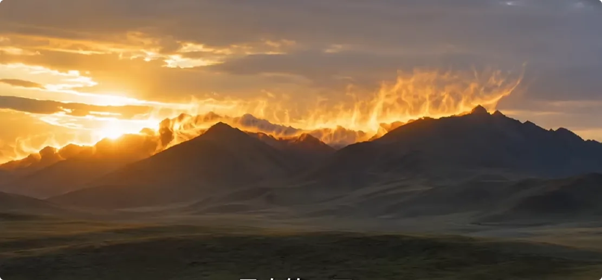

后来傍晚的时候，太阳快下山了，我也需要返程了。因为难得来北方一趟，所以当时我心里很不舍，不知道下次来得什么年月了。
结果那儿的神灵好像明白了我的意思，突然在我身后不远的地方造了一个特别鲜艳的彩虹。当时我真的看哭了，太感动了，真的体会到神灵才是最有情意的这句话。
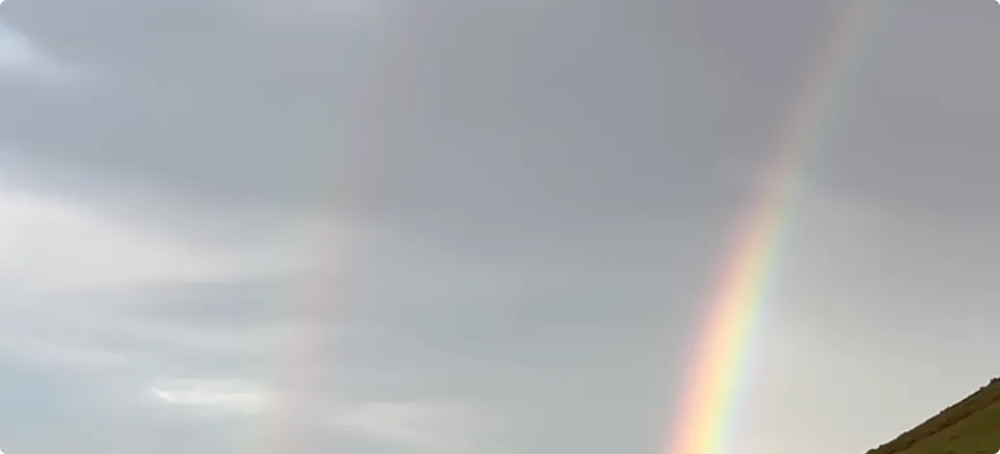

回过头来看，如果我头天就跑完了这片地区，那我第二天肯定要去另一个市，那我就见不到这样的美景了，也得不到这样的真奇。

## 吸收超越地球之外的真气
之后的两年我又跑了很多地方，基本上大地上修炼的场地类型我都见过一遍，有田野的、雪域的、火山的、大海的、沙漠的等等。

慢慢地我就发现，地球上的真汽好像越来越难满足我修炼的需要。虽然都是真气，但是真气也分不同的层级。
一般来说，地球上的气主要是滋养人类和动植物的，越到后面越难满足修神仙的需要。毕竟神仙是要住天上的，是要去到宇宙修炼的。或者换一个词，宇宙级别的生灵所需的能量级别，不是地球单一星体能够满足的。

后来时机到了，新的资源或者说新的修炼权限就给修炼人开放了。
有一次中秋，我是在福建的海边过的。当时我刚结束一天的修炼和奔波，躺在海边的一块石头上休息，想着就和那儿的神灵相伴夕阳。
我看着天空逐渐变暗，享受着海风，听着海浪声，特别惬意。突然间，不知道为何，我就想站起来。
我站起来后，我就看见海边的天际线上有一条粉红色的光线。我盯了几秒，原来是月亮正从海天交界处升起来。
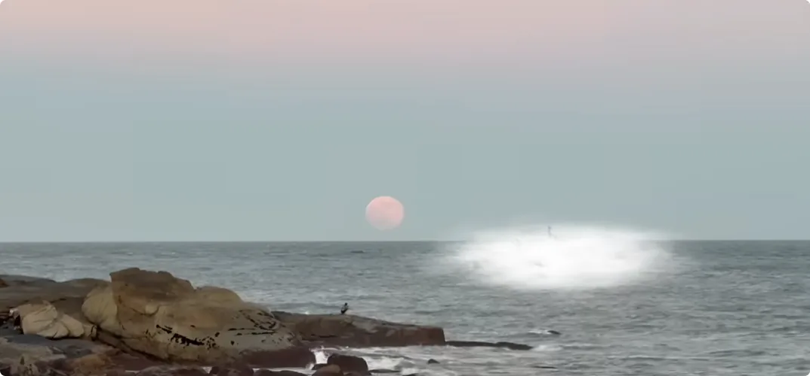

那个场景真的非常美，微蓝色的天空交织着淡紫色的晚霞，一轮粉红色的圆月从天际线缓缓升起。
起初我只是在欣赏美景，随着月亮越来越高，升到某个高度的时候，月亮突然从淡粉色切换成淡橘色。就在切换完颜色的瞬间，一阵海风从月亮的方向一路朝我吹来，随之一阵真汽送进我的体内。
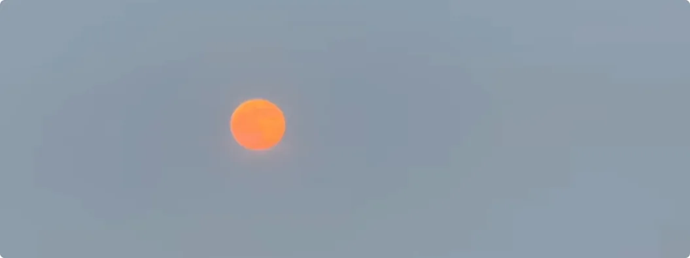

我立马意识到，今天晚上，天上神仙和地上神灵是要教我用月亮的真气修炼。
月亮的真汽是什么感觉呢？
文字很难形容，有点像摸到一颗珍珠的感觉，温润的清凉感，而且给人很安宁、很镇静的感觉，有一层很特别的气罩着我。
然后我就这样一直看着月亮，张开双臂吸收真气。我心里一直在默念：感谢月神，感谢各位神仙。

以前我只听过传闻，说民间有人看见过动物拜月修炼。如今我真的体验到了，除了感动和感恩，真的不知道还能怎么表达。
后来大概持续了十分钟，随着月亮越来越高，月亮从淡橘色变成橘黄色，真汽就关闭了。
那天晚上，我身上第一次裹上了其他星球的真气。这意味着一件事情，意味着我的功能可以到达地外距离了，或者说我以后的修炼又开始奔着突破地球的大气层、突破地球的轮回罩去了。
回想新人的时候，我还需要蹲下来接收真气。如今真的不一样。

那天回去之后，上面给了我一个短暂的修炼窗口。我发现不仅是月亮，太阳系内其他星球的修炼场地我也能识别出来。

只要人类的卫星从上面拍过照片，我就可以同那边的神灵建立联系。这是因为**能量法则是跨时空的。当我双眼扫过他们住所的时候，他们就能知道有一个特殊力量在观察他们，或者说他们也观察到了我**。也因为我得了令，所以他们也给我一些真气。

修炼其他星球的真气是什么感觉呢？

不同星体都不一样。金星的气进到体内是炙热的，木卫一的气是干裂的，天王星的气有电离子的感觉，冥王星的气则是肃穆俊冷的感觉等等。

总之那天修炼完后，我感觉我的神魂都在飘着，有点找不到上下左右了。

## 当下的情况
然后我就突然意识到，完了，地球上我是真待不住了。因为我感觉我跟地球好像有了陌生感，有股力量在拉着我往天上走。而地球地上都是人，都是人间的那些事儿，好像人类跟我没有关系了。
而且后面我发现，地球上的真气如果层级不够高，我几乎没有修炼的感觉，修为也没有什么突破。而且我现在的容量太大了，有的地方轻轻吸一口就把真气吸走了，还吸不饱。
还有就是我现在的功能太敏锐了，稍微往城市边缘靠近，我就觉得头晕、喘不上气。甚至身边路过的人我多看一眼，他们身上有些东西就会跑出来，跑出来的浊气冲得我特别难受。

所以截止目前，我每一两周都要出门一次。因为超过两周不出门，我就走不动道了。每次出门我就往那种没有人污染过的地方跑，那些地方的真气更加纯净。
上周我出门，有几位神灵帮我排深层的凡气，我感觉我的脊椎都要吐出来。
像这样猛的修炼场地去一个少一个，因为地球就这么大。自然界的神灵把真气度给你，就没有更多的气给其他人了，甚至也没法再帮你清理一次。

所以修炼人要不断换地方，不断找新的真气去修炼。

说实话，我都觉得我后面的修炼会很有挑战。不单是我身体对真气的要求太高了，每一两周都要跨省修炼，这跟旅游是没有差别的，这个经济压力也得考量。
所以我常常跟观众朋友说，修炼必须要有经济能力。没有钱你真的修不长远，不长远的人终将离席。既然终将离去，那一开始就不渡了。
所以很多人来信，我都第一时间讲清楚经济门槛。很多人听到钱字就觉得是骗局。其实我真觉得，如果你怀疑，眼前这条路不走反而更好。
因为这样想的人一般经济也不充裕，一样是走不远的。还不如不见这条路，真要见到了又跟不上，反而要崩溃的。

我是修仙者小烨，我们下期再见。

## 时代在变, 修行规则也随之变

## 需要明白规则而非守旧

丹道已经过时了。

不管是内丹法还是外丹法，不管是在古代还是现代，不管什么层级的人，都把长生之术当科学一样研究，不断在人身上试验各种方法，认为只要发现了人体无形层面的原理，就可以永世受用，直奔长生之道。
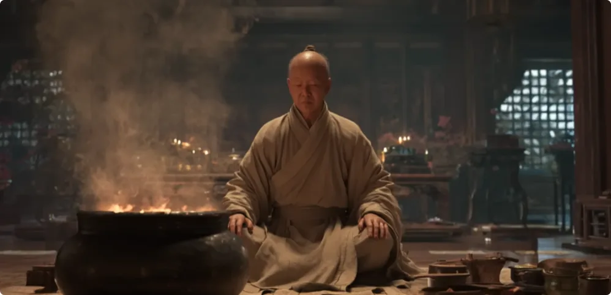

但事实并非如此。
我敢说，大部分人都没意识到，修行修仙其实也是一门社会学。

成仙成佛，本质上来讲就是允许进入上层世界。宇宙律法、众生因果、长生之源、造化机制等，都在最顶级的世界中。想要进入这样的世界，没有经过道德的考核是绝无可能的。

道德观必然是约束个体、使集体形成秩序的一种方式。如果你不理解，那我就换个说法。
在人与人构成的社会中，当一个人走到高处，就必须背负相应的责任，必须具备道德观。这是集体对个体的必然要求。
这一要求的根源在于，高位就意味着接触集体生存和发展的关键资源，其决策与行动的利害效应被急剧放大。因此，社会集体必须通过律法等刚性规则来约束个体。
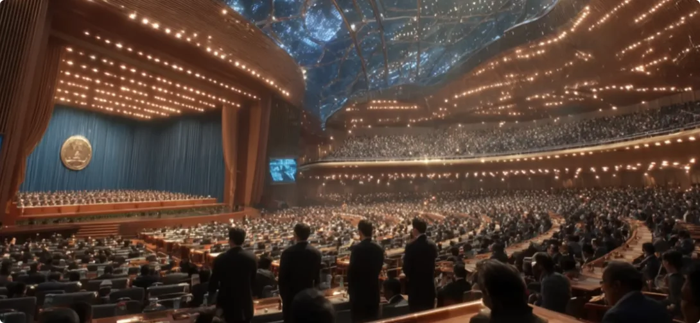

所以，道理都是相通的。
只不过，与人的社会不同的是，在高等世界的社会中，道本就是最高的整体意志，也是制定刚性规则的主体。

因此，想要修仙修佛，想要修长生之术，想要登入天门，就必须接受刚性规则。
反之，无视规则，只专注研究练什么、吃什么能长生，这种发心从一开始就错了，自然得不到道的认可。这也是古代术士和众多富贵炼丹失败的根本原因。

## 一、正是刚性规则，而非罔顾事实

有些人会问：“我明明通过丹道法练出过气丹，怎么不算是修仙呢？”

这其中的关键就在于能量。
凡人是没有超凡能量的，都是凡气，无非是童年时健康纯真的凡气和老年时污浊衰败的凡气之分。这种能量练出的气丹，并不能带你升天。
1. 再者，人之渺小。仅凭人那两米高的气场，你觉得能结出多大、多厉害的丹呢？当然，有很多人认为，人体内在的气是源源不断的，连接着真气的本源，只要找到方法，就能取之不尽、用之不竭。
2. 又或者有人认为，真气无处不在，只要静下心来，没有分别心，周边的气就能变成纯净的真气，就能利用起来修炼了。

如果你还不明白这两种想法有多可笑，那我来比喻一下吧：
- 只要找对方法，人人都可以源源不断地从银行取到钱。
- 只要你我没有分别心，路边的树叶也能当钞票用。

这种罔顾事实的修心，何尝不是另一种心魔呢？

**这种没有证伪手段、没有实际成果、没有持续正向反馈的修法，是纯粹的唯心主义，是注定要失败的。**

说到底，这些人还是把成仙成佛当成儿戏，仍旧没有正视其困难性，自然也意识不到刚性规则的存在。

## 二、飞升规则随时代而变化

为什么古代的仙人能修丹道呢？

因为古代的那些仙人已经解决了修行的关键，也就是能量的来源问题。丹道只是一种炼化纯正能量的方法，而身体只是炼丹的工具。
如果没有解决能量层面的问题，这些求道者也是万万不敢乱练的。

因为人气并不能让人飞升，凡人的气丹仅仅是对其他修炼的妖魔鬼怪有用罢了。

现在很多人在炼丹道的时候通了一些神通，于是认为丹道有用。其实，他是被灵界那些生灵利用了，被选作了有形的炼丹炉。灵界生灵会给他带来不可思议的体验，诱惑他勤奋加练，等他的气丹一炼成，就给偷走。

这些修行人羊入虎口的结局，本质上既是一种惩罚，也是一次教育。因为想抄前人的答案就飞升至高处，这是绝对不允许的。

为什么道教祖师张天师能炼得金丹飞升？为什么后人鲜有通过同样方法飞升？

凡是在社会中做成功一件事的人，应当知道，成功是无法完全复制的。世界上没有相同的河流，真正的知识也无法只靠读书就能领悟。
想要让一个人学会深刻的智慧，使其成人成才，那么最好的方法就是让他在真实情境中历练。如此，他才能将真理内化。

在人类社会中，对于那些想往上走的新一代，我们不会每年都采用一模一样的考卷，也不允许写出跟状元一字不差的文章。因为复制并不是什么出众的才能，从容解决任何类型的困境才是。

因此，修仙修佛也是一个道理。

想要新的仙佛将道法内化，绝不是让他去背诵经文，也不是让他重复练习同一个功法。一定是让他去独立面对新的困境，让他践行道德观。如此，他才能领悟道法的真谛，才能允许他升天。

所以，修行的规则会变，道理就在这了。

丹道或者其他的修行方式，只要过去在历史中使用过了，就必须成为过去式。针对不同时期的飞升，相应的修炼方法也会调整。每一次依据什么原理、修成什么结果才算合格，这些就跟评卷一样，每次标准都会不一样。

一旦相应的时机一过，原来的方法就会作废。其他后来者再修老方法，道都不会给予承认。这就是刚性规则的约束。

## 三、刚性规则不容置疑

很多人、很多生灵不尊重道法，想要无视规则、挑战规则。这就好比在高考作弊、在国考作弊，是很愚蠢的做法。

为什么总听说动物成精后会跑到高处渡雷劫？

因为他们都是靠取巧修炼来的，用来源不正的能量来修炼，比如用人气、其他生灵的气等。如果他们想通过自身的功能强行破开天门，介入高等世界，那么必然会引来道法的震怒，降下天雷。

这就是渡雷劫的本貌。邪修才遭雷劫。

有的人可能会同情这些妖精，觉得人家修炼不易：“我命由我不由天，都是凭本事修出来的，凭什么要劈人家？凭什么不让他进入天界呢？”

道理很简单，因为这有违公平。

这类精怪明明知道有正道却不走，害怕修行路上所需面对的困难，只想走捷径，想靠榨取其他生灵的生气来修。好比一个人靠诈骗致富，靠后台考进公职。这样德不配位的个体，怎么可能被允许介入更高的世界呢？

所以，道是最公平的。

## 结尾

一个人付出了什么、遵守了什么、修得的心性如何等等，他都知道。想在他面前表演聪明、表演巧计、表演可怜、表演努力，都是无用的。

想修行飞升，那就摆正思想、品行端正地修。想取长生之道，先取道德。

## 关于修行的阶段性可验证可量化的成果

大家好，我是修炼者小烨，今天我来聊一聊修仙或者说修行应该具备什么样的阶段性成果。修行人如何通过实际结果来判断你当前的修行方法是否正确、有效，而不是虚头巴脑的理论。

之所以出这么一期，主要是因为很多修行人书生气太重，纸上谈兵太多，没有实证精神。所以今天小叶来分享一下自己修行修仙以来的几个阶段，都是实实在在走过的路。如果你没有这些成果，那我建议你再规划规划。

## 1. 证得真路：辨别能量来源与发心纯正

**想要真正地开始修行，第一件事就是证明脚下的路是真路。**

这点很难，因为找到真路就已经算是打败`99.9%`的修行人了。放眼古今中外，上升之路看起来多的是，好像条条大路通罗马。

但真正有点悟性，敢于求证、坚持找路的人都能察觉到，这个圈子里面大多数东西，都是空有理论的，表面修饰得高大上，但能让你实打实学到真功夫、真本事的，没有。大多就是让你重复做一些形式化的事情，比如念点什么词儿，练点什么功法，甚至保持什么观念。最正派的那种，也不过是教你保持心态平和，身体健康。

很多人也拜了师傅，甚至很多人自己就是师傅，甚至有的师傅自己也有点本事，有些不寻常的功能，这也是让别人能相信他的基础。可是有一个核心问题仍旧没有解答，那就是能量的来源，或者说力量的来源。你怎么证明力量是来自正道，还是来自其他的事物？这点就非常考验修行人的发心了。

如果一个人追求功利性的东西，比如功能、好处、门面，甚至是大家公认的正统这种事情，那么他不会真正在意能量来自于正还是邪，因为他内心需要的只是被认可。相反，如果一个人只求一个真相，只求这辈子不活得无知无明，不愿意任何形式地自我欺骗，那么他会求证能量来源的正义性和正确性。

而只有这样的人，道才会愿意开放一条供他检验的道路。所以我说证得真路的人就已经打败了99.9%的修行人了。因为发心就不在一个层次，不管你身份高低或者聪明与否，道只看重人的发心。

当你具有这样的发心，你就可以检验眼前的路了。那怎么求证道路是不是真的？这里小烨不从个人的角度去讲判断标准，避免给观众自我暗示之嫌，我会用更客观的语言来说。以下是综合众多以上路的修行人的感悟。

**真正地修行，你只需要往那儿一站，用肉眼去看，就能明白何为道法自然，何为真，何为正。**

***你会惊叹和臣服于它的正确性、纯正性和唯一性。***

任何灵界大佬都不可能伪装成它的模样，它也无法用言语来修饰，唯有本人亲自实践的那一刻，才会惊觉何为真正地修行。就好像一个人在人间睡了几十年，做了很久的梦，如今终于醒了一样。很多人因为得到这个缘分而感动得想哭，甚至不敢置信，也感慨过往经历的灵魂暗夜是如此地值得。

正如小烨往期所说，上升有上升的规矩，两千年前是一套规则，一千年前又是一套规则，现在又换另一套规则。因为天梯是不可能被凡人掌握或者关进庭院的，怎么飞升不由权威人士说了算。

## 2. 洞察无形：觉醒元神与重塑三观

大多数有修行根底的人，证得真路以后，就会觉醒元神的一些修为根底，最基本的就是对能量世界的察觉力。因为首先你得知道你身上得到的是什么，修炼用的纯净能量是什么样的，你要记好，以后要找这种能量来修炼。**一旦这种能力复苏，那么一个人不可避免地察觉到隐藏在有形事物下的一切能量和生灵，说是窥探内在维度也毫不过分。**

每个物体、每个地方、每个人，它们背后都有自己的能量状态。你会发现，凡是发生意外或者准备发生意外的人或物，都具备强烈的煞气，周边提前就聚满了不好的生灵。你也会发现，有些地方神清气爽，走进去就能治愈你，令人十分向往。这次你已经学会了如何趋吉避凶。

其次，能量还具备一个属性，它是跨时空连接的。举个例子，一个人十年前拍下一张照片，不管他现在是否在世，你仍可以通过图片辨识他当时的能量状态，以及他身上的大佬。
最重要的是，你察觉大佬的瞬间，大佬也察觉到了你，你和大佬之间的能量已经发生接触，他还能顺手给你一拳，因为你打扰到他了。整个过程，根本不受时空约束。

所以我刚才说觉醒的是觉察力，而非看到的能力，因为看见别人的长相容易留下印象，如果控制不住一念想，就等于打电话到人家家里去了。除此以外，能量世界的奥妙还有很多，需修行人自行探索和学习。
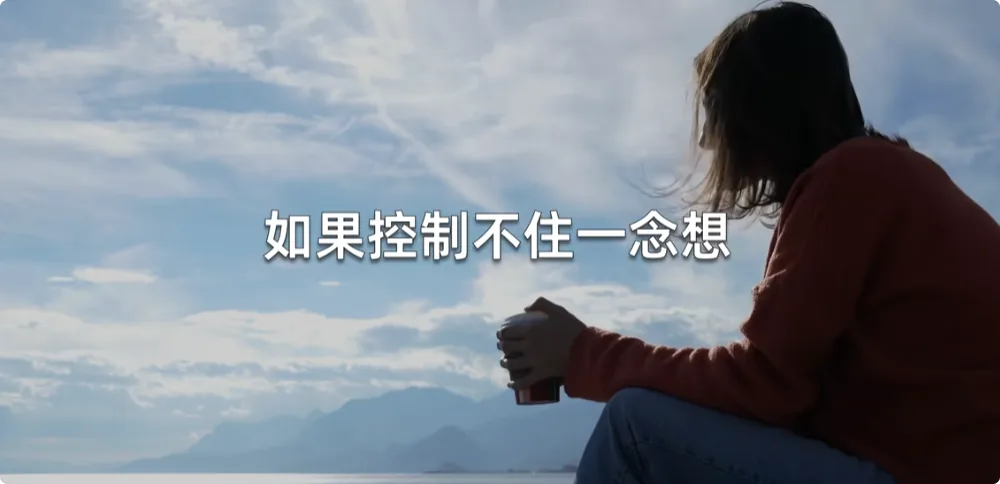

至此，**人事物的能量属性和吉凶发展状态一览无遗，有形世界和无形世界构成了新的完整世界，能量变成了你判断人事物是否值得投入的关键。** 换而言之，你原有的世界观、价值观、人生观完全坍塌和重塑，常人追求的东西你已经看不上了，也就是说，你已经和常人不在一条路上了。

## 3. 修行考验：清浊能量的转换与神明博弈

给你路走，给你能量修炼的是诸神，而考验你的，倒逼你成长的，其实常常是大佬亲自动的手。当你得到能量后，你已经开始不凡了。在灵界众生的眼里，你比常人更加明亮，神明可以看见你发出的亮点，能量越大越看得见，越多看你两眼。而在大佬眼里，你也是个香饽饽，你消耗清能量后转换出来的浊能量不仅量足，而且比常人更好吃。

那为啥大佬不直接吃修行人的清能量？因为下了死令，不能吃修行人辛苦修得的东西，但如果是修行人自愿被吃的话，那就无妨了。

这个规矩妙在哪儿？

**当一个修行人心性不稳，缺乏历练，还留恋人间欲望的时候，你的想法，你所做的事就一定会加速消耗清能量，转化成低层次的浊能量，这就给了负能量生灵接近你的机会。**

对于神明来说，这既考验了修行人的心性，也给了其他生灵生存的机会。

而对于大佬来说，这是合法合规的"偷"能量，所以他们会故意勾起修行人心中的欲望，引诱修行人犯错。尤其是能量层级越高的修行人，来找上门的大佬就越强大，越聪明诡诈。他们会挖掘你的弱点，尤其是围绕你的贪嗔痴，逼着你消耗掉身上的清能量。

而神明则可以通过你对贪嗔痴的处理方式来判断你的品性。如果修行人本心够好，那就不怕被考验。大佬不仅会吃掉你的低层次能量，还会逐步吃掉那一部分凡心帮你完成蜕变，而神明也会在下一次给你补充更好的能量。但如果修行人发心就是歪的，那么身上的清能量很快就会变浊，连大佬来净身都察觉不到，最后能量被掏空，气场也被置换。
这种经不起考验的修行人需在原地好好修心，如果迟迟执迷不悟，心性上不去，那神仙也度不了。

## 4. 书文分辨：如何辨别古书背后的仙人与大佬

最后再来说一下读书修行这件事。往期我提到过，**文字会承载创作者的能量，而能量又是跨时空连接的**，合在一起的意思就是，只有真正的修行人才能分辨古书里:
哪些内容是仙人伏魔顶写出来的
哪些内容是大佬帮忙写出来的
甚至同一本书两种力量都有参与。辨别的关键就在于背后能量的不同。

当修行人读到神仙写的内容时，会和神仙相互察觉。相反，读到大佬的文字时，哪怕其中的逻辑无懈可击，修行人也只会感到头疼。所以真正的道理很多确实写进书里了，但只有真正的修行人才能看懂。
**凡投机取巧，不在正道想念书修成的人，一定会被另一半知识迷了心窍。**

真正的修行人都是无根之萍，永远都在尘世间漂泊，因为世间本不属于修行人，宇宙长空才属于修行人。在没找到回去的路前，神明对这些人的特殊照顾，就是剥离他在尘世间在意的一切，不惜派遣更多的大佬给这些人制造灵魂暗夜，让他们始终无法在尘世扎根。

相信很多人都有这样的疑问，我是谁？我该何去何从？人生的意义是什么？我存在的意义又是什么？什么才是我真正值得追求的事情？

这些问题，只有回到真正的修行上，你才能得到答案，而且只是先回答了一半。你只是知道了自己是修行人，知道了要追寻仙道，但知道只是知道，知道一件事情，跟彻底领悟一件事情是两件事。

## 5. 磨炼心性：从流浪尘世到获得道之归属感

在踏上修行之路后，你仍需不断磨练心性，直到心足够纯粹，*直到你发现无论身处何处，你都能感受到诸神的回应。天地万物都在给你回应。各处神灵就好像你的家人一样，无论你在地球的任何地方，都有不同的家人来和你打招呼，这说明你的心已经接近于道了，得到了道上众生的肯定，这是一种无与伦比的归属感。归属于道，你不再流浪世间，你获得了永久的安全感。道既在，家便在。道无处不在，我亦处处有根。*

从你修行开始，从城市到乡下，走过五湖四海，你会遇见无数生灵，他们中很多都在大地上修炼，千万年如一日，却没有谁是真正的悠哉度日，大多都在默默付出，默默争取机缘，等待一个上升的机会。无论是神仙精灵还是妖魔鬼怪，他们都在相互救赌，也在以自己的方式渡人，只是人不自知，也不想知。而此时的你见过这世间最美好的事情，明白道所规划的扬升之路已然是最公平普适的路径。你也明白，此乃众生所求，众生无不臣服于它的规则。至此，你明白了众生的责任。

上期我们提到过普度众生这件事，有度人之心是好的，但如果你始终置身事外，只愿当个凡人，看不见众生的全貌，看不见众生的行动，看不见众生的需要，那你又怎么敢说为了众生要普度众生？从这儿开始，不修行的人很难理解，多说意义不大，我只讲了大概。

## 6. 觉醒能力与无形法宝：不同元神的特性与实例

当你身上积攒了足够的能量后，会觉醒一些能力。一个修行人什么时候会用能力因人而异，有的人来历和根底好，复苏得早，操作起来也很厉害。而且不同修行人的元神不同，能力也不一样。
比如我遇到过蝴蝶精转世的修行人，他的眼睛和前额就很灵敏，能对外进行能量扫描和能量接收，窥探无形世界更有优势。
另一位鬼仙转世的修行人搭线能力很强，哪怕是陌生的人和事，只要他一提，都能把背后的大佬拉过来见一见。
还有草药仙转世的修行人，手指的能量很锐利，很容易清扫浊气和负能量生灵。
而小烨的元神，比较容易吸收和学习他人的能力。比如刚才提到的三位都被我学走了，也有好好打磨。到目前为止，目光所及就能扫描和吸收能量的能力最让我满意。

所谓法宝，就是能制服诸邪的宝物，但有形的东西总是容易勾起人的贪念。对于准备修行和刚修行的人来说，不见得是好事，所以我就不过多阐述。

我只简单说说我个人的无形法宝，一般都是在梦里，大神给的奖励，第二天就知道自己有没有了。
小烨有两件: 
1. 一件是宝伞，仅用于出门找能量时可以开一个小结界，不被外面的鬼神揍，同我出行的修行人贴近点也能被保护。
2. 另一件是长戟，目前仅在引渡海外修行人的时候，化成三叉戟射退海妖。你看，使用条件还是很苛刻的，绝不是你想怎么来就怎么来，修行人还是要守规矩，自己什么身份还是要掂量掂量。

## 7. 半仙状态：能量满溢的牵引感与对常人的疏离感

所谓半仙就是当一个修行人，修行能量蓄满身体的一半，心性也和道无限接近，其实也差不多可以上去了的，就要看上面要不要收了。
其实大多修行人一天内收取大量能量的时候，也会体验到这种状态，**因为清净的能量会把人的感官、眼界、心性，甚至能量场都向上牵引，这其实就是上面的世界在慢慢引渡你上去的过程了。** 
这种时候，人会放下尘世的一切执念，会感觉人间那点东西真的不算什么，干啥都不如修仙快乐。等到太阳下山，修行人回到城市就会发现，你在人群中真的坐不住，因为你跟常人的能量场完全不一样了。常人是很浊的，尤其是越到后面，越是无法共鸣常人的价值追求，看旁人就好像在看花花草草一样，很难像以前那样喜欢。所以很多人问自己的欲望很重怎么办？
我都会说慢慢来，自然而然地用真正清净的能量去挤掉凡气。因为你还是肉体凡胎，全身上下都在产生欲望，你是无法避免的。

## 8. 最后的劝诫：不追求神通，唯有纯粹心性方能走通此路

以上，如果你没有获得过这些实实在在的经历和成果，如果你还停留在咬文嚼字，停留在形式化的修行，那就不要期待死后成仙佛这种事了，毕竟太长远，人总不能安慰自己一辈子。
最后小烨还是要给大家打退堂鼓，不奔修行修仙来问路，奔着神通，奔着与众不同，那此处没有，绝对不会给你任何甜头。因为你这么发心的时候，就偏离了道，道不会要你的。

只有心思纯粹之人，心里能把修行修仙当第一位的人，才能真正走好这条路。

## 修行圈大骗局：修行先修心

## 1. 最大的误区：把修行当成“随缘”，等命运把机缘送上门

### 真正的修行，不属于原来的“凡人命数”

大家好，我是修炼者小烨，是个不爱城市、只爱修仙的散人。最近很多人来问我怎么修行，有人觉得**修行就是修心**，觉得修行就是随缘，缘分自会到来，认为人各有命数，修行的机缘也是命数的一种。

小烨只能说：太天真了。

如果你是想修行的人，这种想法无异于断送自己的未来。

人是各有命数，指的是人的命运，有命数，是命运的齿轮转到哪儿是哪儿。但是命运里，是不会预示“得到机缘”和“真正的修行”这两件事的。

为什么？

因为**命运这种东西，是用在凡人身上的**，讲的是凡人如何过完他的一生。

而得到机缘、踏入真正修行的人，他涉足的世界、三观和结局，已经和凡人不在一个赛道上，不再是原来世俗的人了，自然不归原本的命运管。

人的命运系统算不了命运之外的事情。如果有比命运系统更强大的能量干涉了人的命运，哪怕因果轮回这种死规则，在绝对能量面前也不算什么，人的命运都是可以更改的。

当然，小烨这里所说的真正的修行，绝不包括市面上那些读书念经、自我意淫、自认为对接大神、自然和灵界能量的所谓“修行”。

### 为什么一个人的命盘可以显示“喜欢玄学”，却算不了真正修行后的路

举个例子。

很多人都算过命，可以从命盘中看出“我为什么喜欢玄学”“我为什么这么多磨难”。你可以理解为，这是放在命运系统中的命数。

市面上的修行人，他们的命盘也可以看出这些命数，可以看出他们为什么跑去修行。因为这些事件都是凡人受凡尘能量、因果影响而促成的。

但当一个人踏入真正的修行后，再去看命盘就没有意义了。

**他的目标已经在命盘之外，他趋吉避凶的能力也是凡人没有的，那命盘还有什么用呢？已经不能像预测凡人一样预测他的行迹了。**

换句话说，一个人身上还是凡尘能量的时候，就一直会被凡尘命数算计；而当一个人开始获得正向能量、踏入真正修行的时候，个人的结局就是靠自己争取的，自己的决策和付出才是关键因素。

> _**所以，如果你认为修行就是等着被凡人命数安排缘分，那你一定找不到真正修行的路。**_

---

## 2. 什么才叫“真修行”：第一标准是身体真的在积累正向能量

接下来说说，到底什么才是真修行。

真修行，首先一定是你的**物理身体在不断积累能量**，而且必须是正向的能量，是你能亲自验证的能量。

比如：
- 身体越来越好；
- 不再出现抑郁；
- 脑子越来越清醒；
- 逐渐对能量有感知力；
- 面貌也发生变化。

而不是来源不明的超自然力量。

市面上的修行人最后结局都很惨，就是因为不明辨能量背后是谁。自认为一喊神佛、师祖的名号，人家就会下凡来给你一对一辅导，很是自大。

而且大多数修行的人很喜欢用道德来绑架大神：

> “神灵都是善良的，我这么苦、这么真诚，他怎么会不来渡我呢？”
> 
> “我做好事，神灵总会来保我吧？”

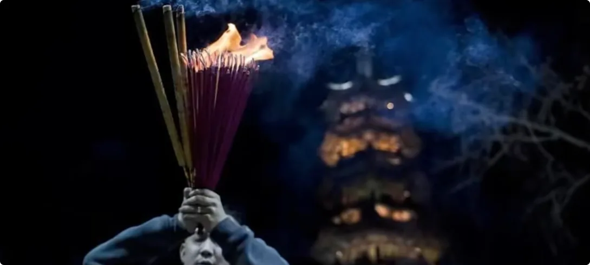

> _**善非功，恶非过。**_

你认为的善，在大神面前可能什么都不算。

大多数人以一副巨婴的姿态去修行，是修不成的。

所以修行还是要靠自己去找**纯正能量**。纯正能量只存在于特定的自然能量节点，你得把它找出来，用在自己身上，用来提升自身气场、功能和悟性，以及改变作为凡人的结局，才叫修行。

> **没有能量，你就啥都办不到；没有能量，你就不是修行。懂了吧？**

---

## 3. 自然能量不是“天女散花”：没有引荐、没有规则，拿到的未必是正的

### 不是跑进大山，就能凭一个念头把“真能量”收回来

好些网友说，自己也是实修，跑去大自然收能量。
1. 你真的以为真能量是**天女散花般扔到空气中**的吗？你凭一想一念，就能收到了吗？
2. 你知不知道，大山里只要修一座庙，方圆十几里的孤魂野鬼、大妖大魔都要跑进去居住。大自然也是鱼龙混杂的，没有引荐，你去大自然，谁理你啊？

自古以来，哪个修成的人是靠自己突然起悟飞升的？

**超自然能量，有正就有邪。**

很多修出功能的人，自己都分辨不出借用了谁的能量，还以为自己是个天才，实际上就是韭菜。等自己年长一些，精神抑郁了、身体疾病百出，再想逃离这股力量，就难了。

### 真正重要的不是“我觉得自己正”，而是有没有遵守规则

如果一个人没有亲自去拜访自然，没有和自然能量的持有者**双向沟通**，那他接触到的任何超自然力量就一定不正。
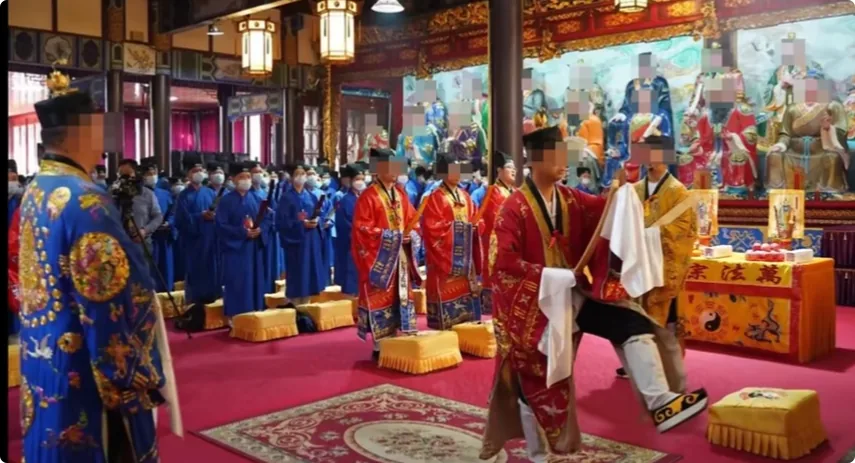

哪怕你自以为心正，或者自以为秉持正念，也不是正的。

> **尊重规则的人，才叫心正。**

跳过规则、想白嫖大自然的人，人家不仅不会给你，还可能揍你。

---

## 4. “修行先修心”的问题：没有纯净能量，稳住的只是一杯浊水

### 修心是为了“稳住杯子”，但你得先看看杯子里装的是什么

很多人跟我聊修行的时候，就以为是修心。甚至现在大部分的修行人只讲修心，不讲别的，不看实际成果了，只看心态高度。

**修行方法观严重错误。**

修心有用吗？
有，但不是这么用的。

修心是为了稳住心神，是为了让身上的**真气不漏**。
好比稳住杯子里的水，还得是一杯纯净水。

可是现在：

> _**你连一点纯净水都没有，只有一杯凡尘浊水。**_
> 
> _**你稳住杯子有什么用呢？**
> _
> 

为什么这么多修行人越修越惨？

因为他们都在稳住自己这杯浊水，还死不撒手。

### 磨难为什么不断出现：就是要逼你把原来的杯子撒手

没办法了。

这时候大妖大魔们就会出手了，给他们带来磨难，疯狂晃动他稳住的这杯浊水，让他们的凡气越来越少，以至于最后这些人的身体和精神也越来越差。

让他们知道：

**原来的方法是行不通的，该撒手了。**

逼着他们重新启程，去找真正的修行出路。

> **这个过程才叫觉醒。**

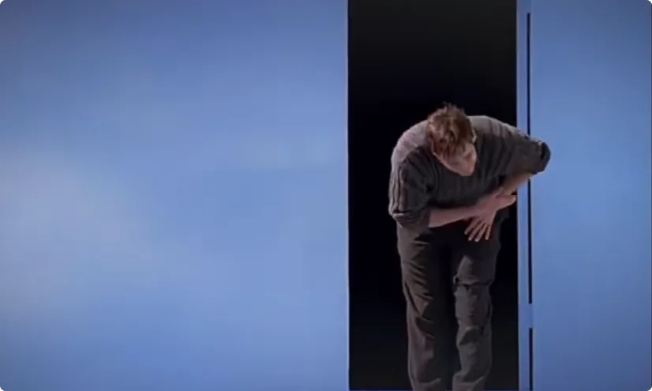

善非功，恶非过。那些阴性众生，可能比这些所谓的修行人还要得到垂怜。

---

## 5. 修心真正的位置：先找到正道、得到能量，然后才谈修心养性

如果修行不先靠正能量提升自己，却靠“修心”来压制人性，首先会降低人身上的人气。

人味儿跟将死之人一个气质，反而会更招鬼。
想想为什么道士给人一种清冷，甚至阴冷的感觉？

所谓修心，是指：

1. 修行人已经**寻得正道**；
2. 已经**得到正能量**；
3. 已经**正式启程**；
4. 然后通过修心养性，保存自己的能量。

它是修行人在修行路途中的**所见、所闻、所想、所悟**。

前面的修成者，由于不能完全把修炼规则公布于众，于是把修心养性、平淡处事的态度告诉世人。
但是却被世人当成了**修炼法宝**。
导致世人认为：

> “照搬同样的心境，就等同于找到了正道。”

一个是在路上的见闻，一个是连起跑点都没看到的意淫。
**后者尚未行动半步，却高谈阔论途中美景，何其荒唐。**
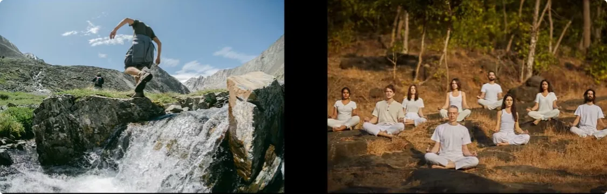

所以在修心之前，更重要的是先接触到能量，以及使你踏入门口的**决意、勇气和动作**。
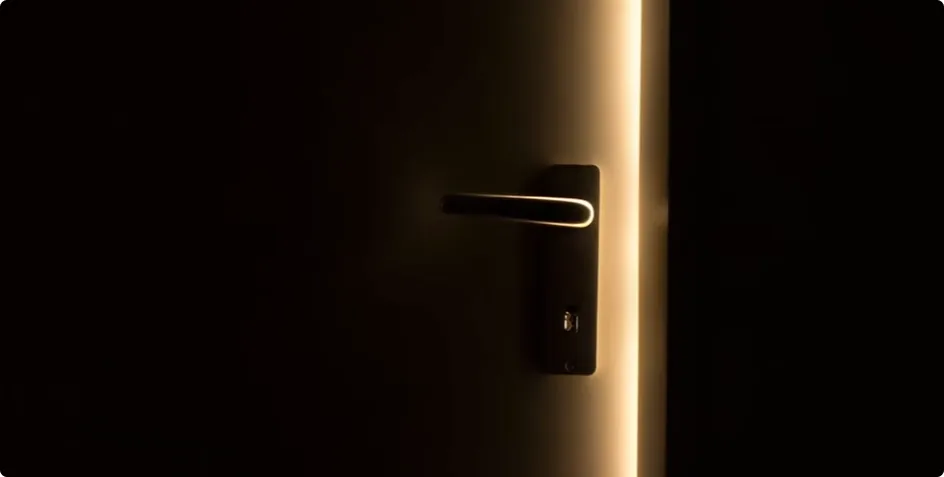

> **没有真能量，你思想境界再高，死后也只是厉鬼而已。**

---

## 6. 修行人最大的敌人：把“脑子想通了”误认为自己已经开悟

### 悟得越多，反而可能越不愿意去验证

很多人哪怕是真的有缘修行的人，甚至不乏根底好的，在踏入正道前，最大的敌人就是：

> **自以为在世间磨炼出来的悟性。**

今天在讲悟出了什么，明天又讲悟出了什么，然后拿这套悟出来、自圆其说的东西到处批判，侃侃而谈。
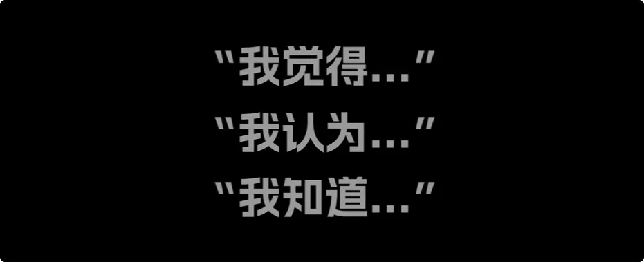

明明没有见过真路，却总觉得自己就是对的。
越是追求真路的修行人，悟出来的思想越多，到头来反而越阻碍自己寻找真路。

为什么？

>**因为都用脑子来自洽了，都不去实践和验证了。**

所以要时刻记得：

> _**人再厉害，在自然面前也是渺小的；在命运和轮回面前，更是毫无还手之力。**_
> 
> _**无论你根底再好，没抓住修行的机会，就啥也不是。**_

---

## 7. 真正的“开悟”：不是理解概念，而是先让自己看得见更大的世界

### 没有纯正能量辅助，仅凭凡尘经验很难真正看清

再来说说开悟:
真正的开悟，一定离不开**纯正能量的辅助**。

只有纯正能量，才能净化人身上的凡尘浊气，才能让人明心见性，才能把人的精神意识抬升到高处，给人更广阔的视野去参悟世界。

否则，仅靠理解书本上的概念，仅靠所见所闻皆是凡尘，靠着一身凡气，是不可能开悟的。

> **开悟就是：不是你想知道就能知道，而是让你知道，你才得以知道。**

对于灵界的大神、大佬来说，人间的修行人就是在**盲人摸象**。

因为没有真正见过大象，所以个个猜得光怪陆离，各有各的自信。
想要看清大象，还得先去除眼前的迷雾。

### 尘世磨难只是把你叫醒，不是替你走完修行之路

有人会问：

>“难道尘世这一切疼痛磨难，不就是让人醒悟的吗？”

是, 确实是让你醒悟的。

但只是让你从尘世中清醒，用疼痛逼你去找到**修行的真正出路**。

而不是让你得出一堆结论，然后自我意淫、固步自封，自以为觉醒了、开悟了，不往前走。

> _**在踏入正门之前，你的万千感悟都不值得一提。**_
> 
> _**你连真路都没摸到，说再多不过是纸上谈兵。**_

只有先接触到真能量，你才能接触到真事物。

你才有：

> **实践出真知。**

---

## 8. “条条大路通罗马”？修行最终还是要靠结果验证

相信很多观众憋不住了，想要反驳我：

“这UP主怎么敢大言不惭，否定这么多大师和修行人？”

“条条大路通罗马，凭什么你说的就是对的？”
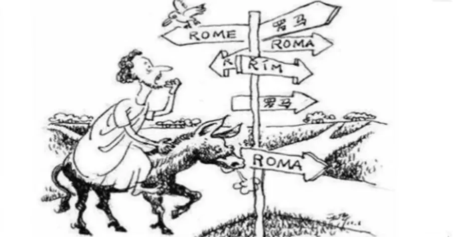

有人会说，小烨IP在上海，修的是金钱，一看就不是修行人。
真正的修行人应该回归深山，清净就能生出真气，**心诚就能招来仙缘**，神仙自会来保佑了。

小烨只能说：

>你可以去深山等机缘
>你可以回归清净
>你可以读古典
>你可以听大师讲道理
>你可以认为凭聪慧顿悟就能飞升
>你可以认为神仙就必须是大爱的
>你可以认为修行就是白拿。

**你可以用任何想法，填补你对修行的理解。**

你可以自顾自地修行。
但是，就看给不给你这种人上升的机会了。

### 有缘人来自五湖四海，修行也不可能只靠网络想象

这里虽是魔都不假，但人也来自五湖四海，有缘人也当来自五湖四海。
渡人不能只在网上，求缘也不能只在网上。

这点道理很好理解吧？

> _**天雨不润无根草，道法不渡无缘人。**
> _

无缘人怎么想，我不在乎，也不会多看一眼。
倒是有一个验证的办法。
一个不管你愿不愿意，最终都会在你头上应验的办法。

刚才说：

> **只要没找到真路，磨难就会继续降临在你的头上，让你越来越惨，逼着你继续启程找路。**

所以不管你现在相信什么，普通人也好，大师也罢，磨难会来证明你走的路有没有走对。

个人心知肚明。

> _**潮水退去的时候，就知道谁在裸泳了。**_

我是修炼者小烨，我们下期再见。

## 善念不是修为，价值与行动才是关键

>[!note]
 >**修炼能量很重要，但凭什么给你？** 
 **修行最终不能只停留在“心”上。你想什么都不重要，你做什么才重要。**

---

## 1. 从贾宝玉梦游太虚幻境说起：有来历，不等于有修行

### 仙珠转世，到了人间仍是一身“凡气”

大家好，我是修炼者小烨，今天我们先来讲个故事。

在《红楼梦》里，贾宝玉是**仙珠转世**，被认为是女娲补天时剩下的一块顽石，经过修炼后有了灵性，然后被带到人间，经历红尘。

有一次，贾宝玉在梦中被警幻仙子带到太虚幻境。其他仙子见到贾宝玉，是这么说的：

> “听说今日必有绛珠妹子的生魂前来游玩，所以我们等了这么久，为什么反而引来了这等浊物来污染这清净之境。”

贾宝玉听闻此言，吓得欲退不能退，自觉自行污秽不堪。

警幻仙子跟姐妹解释道：

> “今日受贾府祖先之灵所托，特引他到此处，让他再经历一番声色之患，希望他之后能醒悟，但也还未可知。”

**你看，不管你是什么仙儿转世，到了人间，不修炼就是一股子凡臭。**

如果不是看在你是仙珠转世，如果不是看在贾府祖先之灵的面子上，神仙几乎不会来指点。

### 条件再好，凡气太重也点化不动

为什么？看看这个故事的结尾就知道了：

> 警幻仙子亲自来告诉他，他元神天分时自带一股痴情，给他显像，告诉他要经历怎样的结束，提醒他要做好选择，又带他来到仙境，熏陶了好久。
> 
> 然而贾宝玉身上的凡气太重，像迷雾一样，让他始终看不透，悟不到仙子的意思，最后还是选择沉沦苦海去了。

有这么好条件的人，哪怕派警幻仙子来点化都点不动，更何况大多数没有修炼背景、没有福德积累的凡人了。

---

## 2. 凡气与能量边界：为什么修炼者会强调远离“浊气”

### 神仙为什么不会主动靠近凡人

很多人爱提护法神，其实真正的神仙隔老远就闻得到人身上的凡臭。

换做是你，你会主动去找一个臭烘烘的人吗？你会每天陪在他身边吗？

连警幻仙子都是把贾宝玉生魂带到仙境，而不是自己跑到凡间去的。

### 修炼者对“凡气”和“浊气”的感知

其实也不止神仙，真正修炼过的人，也可以闻得到人身上的凡臭。

只要身上不是干净的修炼能量，不管男女老少，不管你练什么功，靠近点都是臭臭的。

如果你无法想象，可以试想一下老人身上的气息，因为老人的能量频率是远低于年轻人的。

敏锐的人可能会觉得老人身上有一股浑浊的气，其实不止凡气，还有浊气。

其他生灵的气更臭，因为他们都是靠浊气修炼的。

### 人群接触带来的“沾染”

最近我出门遇到人多又不可避免的地方，就不得不跟旁人撞上。

若是凡气还好，就怕那人身上附着其他大佬，就那么贴近一下，就能沾到我的衣服跟着回家。

所以我都是勤洗外套，尤其是最近都要每周洗两遍羽绒服。

换做毫无察觉力的人，这样下去结果可想而知。

---

## 3. 善良不等于修为：能量不是靠“心好”换来的

### 条件越好，越容易误把自己当成“强者”

虽然我常说人都应该修行修炼，把这个道理嚼烂了说给大家听，但是真正有魄力修行的人又有几个呢？

开篇我就引用了贾宝玉的例子。

这样一个来历福德都不浅的人，神仙费了这么多口舌，他都无动于衷。

这世界上像贾宝玉这样的人比比皆是，论修炼背景，论家世条件，论功德福报，论天资聪明，论临近引路，真的是多了去了。

我们都知道，自身条件好的人，遇事也更顺利。

然而正是因为这种顺境，让人误以为自己就是这个环境的强者，开始分不清真正的大小王。

在这类人中，不乏善良、有大爱、想要修行的人。有了道德感的加持，开始自视清高，认为自己往那一坐就发着正道的光芒，简直是**痴到了极点**。

### 修炼能量很重要，但凭什么给你？

这些人有一个核心问题没想明白：

> **修炼能量很重要，但凭什么给你？**

真以为能量是靠钱、靠实力、靠心善、靠真心就能换来的吗？

很多人说天道大爱，我持正念，我存善心，那神仙菩萨怎会不来保佑我，怎会不给我能量？

这种思想非常幼稚。

### “靠爱发电”解决不了现实问题

我说直白点：

> **你的善良值个屁，靠爱发电只会令人发笑。**

看看那些搞放生的，没半点解决事情的能力，成事不足，败事有余，行善的结果却是带来恶业，你还不如不善良的好。
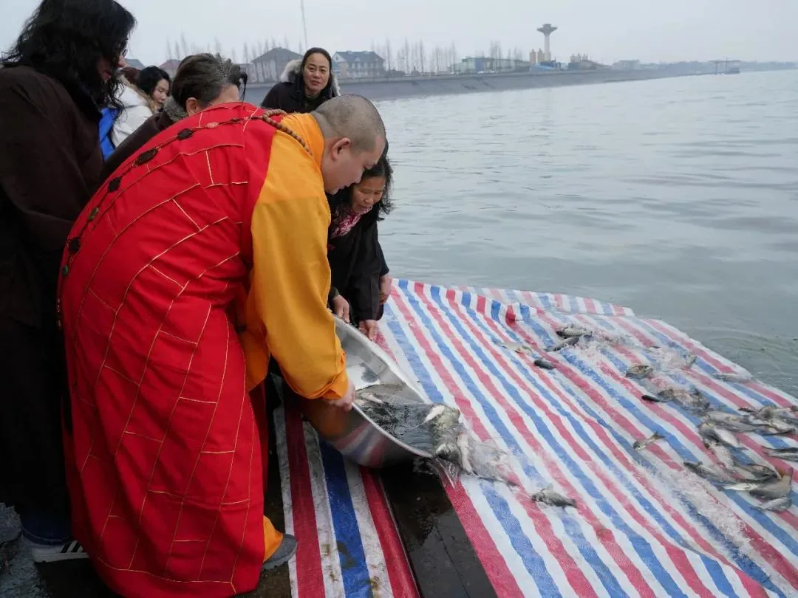

---

## 4. 从黑熊精看能量分配：能力、价值与行动缺一不可

### 观音为什么要把黑熊精收于麾下

再看看为什么观音要把黑熊精收于麾下。

不仅仅是因为黑熊精有一颗求道的心，更重要的是：

1. **黑熊精是可造之材。**
    武力强悍，能跟孙悟空打平，说明他能派上用场。
2. **他还很有悟性。**
    懂得审时度势，懂站队。只要有机会跟正道站一块儿，就立马归顺，将他的力量臣服在观音之下，甘愿当一个守山的小编制。

### “道常无名，朴”：需要时成器，不需要时为朴

为什么？

因为：

> **“道常无名，朴。”**

大道就像一块朴素的木头，只有需要的时候，它才会变化成器皿。

生灵想走正道，想与道同寿，那就老实当一块朴木。

**只有用到你的时候，你才是器皿；不用的时候，就化回朴木。**

如果一个人身份感太重，大到都请不动，那就别修炼了。

宇宙之大，众生之多，系统之大，难题之多，每一个解决系统难题的人，必然要具备一定的能力，也承载相应的能量量级。

### 能量最终与个体价值相匹配

> **所以修炼能量一定是和个体的价值相匹配的。**

你能有多少能量，取决于你能使用自己的价值，取决于你践行道的心。

若你从未用行动佐证你的心，谁信啊？

真当神仙是傻子，任你忽悠吗？

---

## 5. 修行最终要落到行动：道心决定方向，上行创造结果

### 能量才是修行能够真正运转的基础

所以修行能量是第一位的，所有众生都需要能量。

> **能量是众生之间的一般等价物。**

做神仙这事儿没有你，也会有其他人，有没有你都无所谓。

修心只是对你而言是很重要的。

你的决心决定了你的高度，但与他人无关，与天地宇宙无关。
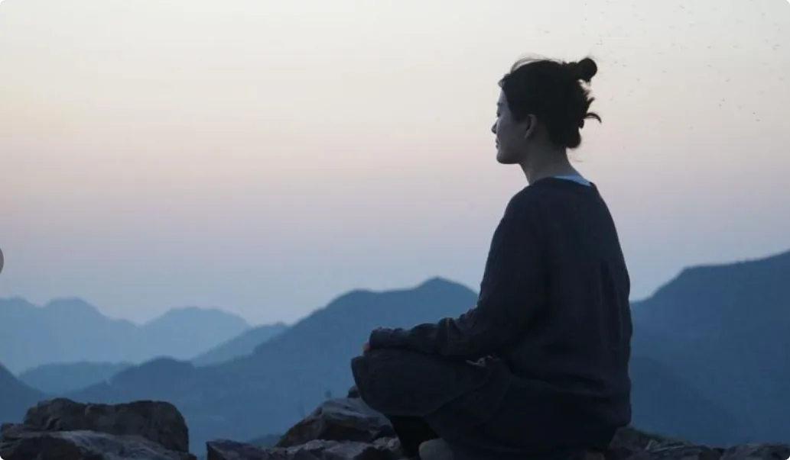

### 光有“道心”还不够，更重要的是上行

而且不仅仅是有一颗道心，更重要的是**上行**。

你的心能不能推动你的行为，为宇宙创造实实在在的结果？

换而言之：

> **你想什么都不重要，你做什么才重要。**

我是修炼者小烨，我们下期继续聊。

## 为什么修炼是投资最大的自救行为

大家好，我是修炼者小烨。

这一期我想以一个旁观者的口吻，来给大家讲讲在修仙之人的眼中，为什么修炼是自救行为？为什么修炼是每个人最大的投资？
因为之前很多人没听明白，我也不妨再讲清楚一些。
先来分享我很久之前的一个梦。

## 关于一个夜晚的梦
有一天晚上，大概是一点左右，我躺在床上玩手机，想着明天去哪玩，挺悠哉的。突然，手机里弹出一条实时的播报消息，说各地都已经放弃了。
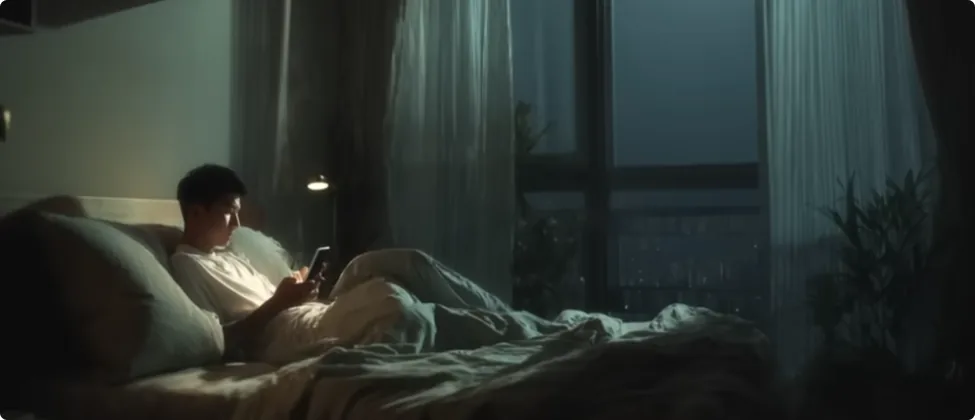

接着，一条一条的红线在手机屏幕上冒出来，疯狂移动。紧接着，窗外就传来了轰鸣声。一声清脆的、机械的、震耳欲聋的声音传来，好像放鞭炮一样，一串一串的巨响，白色闪光一次比一次近。

我的第一反应是跑，可是我又能跑到哪儿去呢？
就当我快走到窗户的时候，一道白光在附近闪烁，随后无形的光线穿过我的身体。我的双膝像是朽坏了的金属一样慢慢弯曲，跪倒在地上。
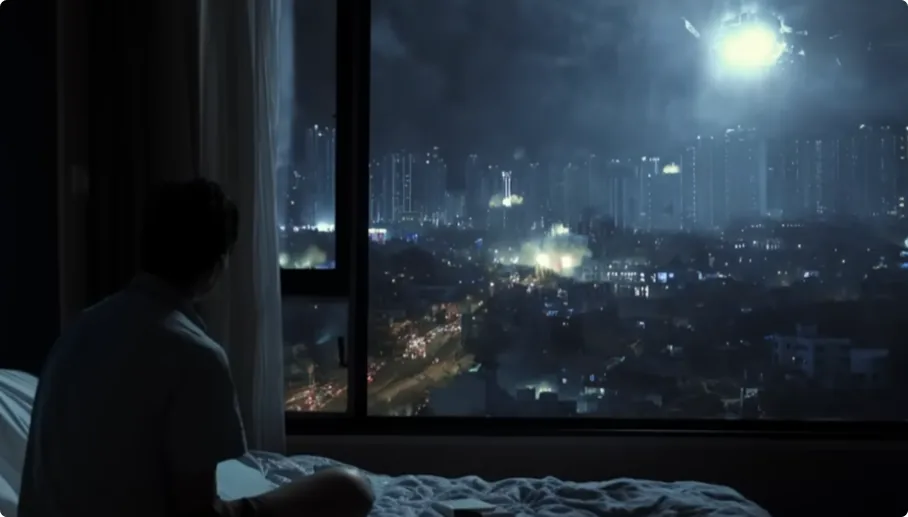

光线穿过我的身体，从表皮一点点烧进胸腔内部。我的四肢慢慢扭曲，动弹不得。我感觉到刺骨的疼痛以及面临终末的恐惧，然后我眼前慢慢就黑掉了。

我仿佛看到城市被黑雾淹没，一切都在被格式化。

我不停地问我自己：
为什么会这样？
为什么突然就结束了？
所有人就这么突然结束了？

**每个人生前争夺的事物根本没有任何意义。在终末面前，一切都会清零，谁都不会剩下什么，连回忆都不剩。一切就像从未存在过一样，留给每个人的只剩无尽的黑暗与绝望。**

而我过去究竟在做什么呢？

随着我的胸腔、腹腔越来越疼，最终被疼醒了。我从梦中惊醒，大口大口地喘着气，我又回到了这副健康的身体里。
我还是躺在那张床上，看着面前那扇刚刚闪过白光的窗户，死亡带给我的压迫感仍旧没有褪去。
我看了看时间，1点40分，跟刚才的时间差不多。此后的几个小时里，我都不敢入睡。我害怕回到刚才那个没有未来的地方。

我脑海里有个声音问我自己：
***所以现在再给你一次机会，你会如何呢？***

梦到这里就结束了。我重申一遍，这只是个梦，大家别当真。

## 此后更加勤勉地修炼

### 修行的真正意义
在这梦之后，我就不敢怠慢了，每天都在好好修行。
因为时间是最大的成本。珍惜这一世的时间，不要将生命和健康浪费在争夺名利上。你赚得了全世界，却丢了性命，又有什么意义呢？
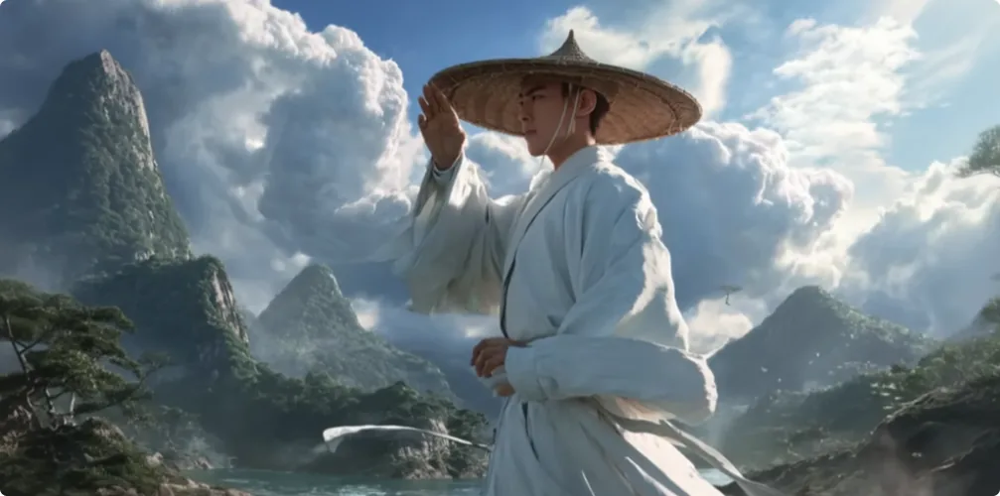

**这世界上能真心为你的成功感到欣慰的人屈指可数，所以没有必要向任何人证明你自己，能在死前不愧对你自己就行了。**

在有限的生命里，人应该多思考，在这一世到底什么才是最重要的？对于你的存在来说，什么是重要的？
有很多人觉得是来体验人生，这个其实没有任何意义。因为人投胎了，记忆都会清空，没有任何意义。
个体的成长完全不靠活了多少世，不是靠累世来积累天赋和智慧的，而是靠修行、修炼。

我委婉地说，那些富贵人家，不管是一代还是二代，其实都是有在被动修行、修炼的，只不过他们自己都不知道。
你看，很多有钱的人家都喜欢去一些美丽的地方旅行，而且越赏心悦目越好。其实他们根本不知道，他们的灵魂在渴望去那些地方，那里有能滋养他们灵魂的东西。

### 能量的潜移默化转移
之前我看过国内的一个旅行博主，甚至不是修行人。他大老远跑去欧洲，专门去看某个著名景点。
他在录视频的过程中，连他自己都不知道，有一部分修炼的能量已经给到他了，罩在他身上。也许是因为见他人品还不错，才给了他一点点修炼缘分。
这些能量能帮助他开悟、修养品性，提升灵魂层面的东西。

那些富贵人家每天跟打鸡血似的干事业，随便睡一觉又满血复活，因为他们过去或今生有能量的积累。

还有那些古人描述的神仙腾云驾雾、法力无边、神通广大，以及佛菩萨的金刚手段，也是靠对能量的积累。
任何能力背后都是要有能量支撑的。所以无论是人是神，都不是靠所谓的脑子想通了就成功了、飞升了。

一个人在世间，甚至是其他世界能不能过好日子，取决于你身上修得的能量。
所以回过头来说，**人活这一世，在钱方面够用就行，而且钱要花在刀刃上。尽量去修得真正的能量，同步在修品性，让自己的修行缘分持久下去，让自己成为在世界生存的强者，而不是弱者。**

如果你只顾着赚钱，把钱当第一位，那就是本末倒置了。到时候抱着一大堆钱去死，过完这一世什么都不留下，有什么用呢？
很多人觉得要多赚钱，以后留给自己的子孙后代。其实你的子孙后代有没有机会花，这都是遥远未知的事情。
**只有先顾好自己，才有余力顾好所爱之人，才能给所爱的人指明对的方向。**

### 当前时代隐藏的修仙机缘
当前这个人口爆发的时代，其实很多人不明白，这个时代是历来最好的修行、修炼、修仙的时代，是名额最大的时代。
很多转世成人的，投胎前可不是为了来体验人间的，更不是来享受人间富贵的，而是为了接触真正的修炼才来的。
这些人普遍都投在那些对玄学、修行感兴趣的命格上，甚至是那些多点挫折和磨难的人生，就是为了尽快苏醒，尽快尽力地取得修行层面的成果。
既是为了争取鲤鱼跃龙门，也是已经冒了回不去的风险。

所以各位，尤其是听这个视频的修行人，一定要珍惜这一世的时间，一定要想明白真正重要的是什么，真正值得投入的事情是什么。
这一次错过了，下次不知道要等多久了。

## 灵性是生命的分水岭

**灵性是生命的分水岭。**

### 关于动物灵的一些误解
之前网上有个传言，说世界上80亿人，有很多人是动物转世来的，因此很多人听不懂人话，贡献了很多蠢事。

其实此言差矣，很多转世成人的动物比人都有灵性。
平日里，我们都听过哪条道路上有山体滑坡，会有鸟、牛、黄鼠狼之类的挡在人的面前，不让人过去。

有灵性的阿猫阿狗尚且对不好的地方有预感，知道哪里该去，哪里不该去。反倒是纯粹的人类已经失去了和自然沟通的能力，完全不通自然。
每年有很多人迷失在深山中，明明给了多次返程的机会，都通过天气给了很多次警告，却还是执意去送死。在动物的眼中，这些人难道不也是在做蠢事吗？
所以不要以为听不懂心机深沉的聪明人说什么就是傻了，就是呆鸟转世。人家的能力从来不在心计上，而在修行、修炼上。

**很多动物灵过去都是懂修炼的灵魂，知道干什么最重要，所以转世成人，也不爱干俗人的事。**
**当普通人还在争名夺利、造下恶业，最后抱着钱去死的时候，反倒是那些有灵性的，对人的心计嗤之以鼻。**

坚守道德底线，不造恶业，保持敬畏，自然最后拥有一个好的结局，甚至飞升更高的世界。

### 缺少灵性的人呈现出的麻木
比起那些结局死得不能再死的聪明人，有灵性的人难道不更聪明吗？
缺少灵性还有一个特点，就是麻木，类似于温水煮蛙的麻木。

哪怕有个仙人坐在他旁边，给他点出什么好、什么不好，他也只会觉得这仙人有异于常人，可关他一日三餐什么事呢？能发大财吗？能事业有成吗？
这些人通常不在乎世界的真相是什么，也不思考自我存在的真正意义是什么。灵魂缺少深度，灵魂没有自己的想法。
这些人其实是最人云亦云的。他们只靠公开的信息活着，在原地干等着，等着有权威人士为他们兜底。
说他们笨，他们却有100个心眼争名夺利；
说他们聪明，他们却敢放100个心在没见过的人身上。

我曾试过带着一个没有灵性的人修炼。他明明跟着我修得了许多能量，也能察觉到能量的世界，能做到趋吉避凶，也学到了凡人一辈子都摸不到的知识。
但是他仍旧不为所动，每天想着的都是他的事业。没有灵性的人就是这样麻木，除非天塌下来砸在他的事业上、砸在他的生命上，他可能才会惊觉哪些是实的，哪些是虚的。

否则，他想不通修行、修炼的意义是什么。

又比如有很多观众说，我的视频没有讲实际的东西。可是在过往的视频中，我能讲出来的修行的好处就是健康和安全。
**健康而安全，不正是生命的基石吗？**
**生命已经是世间最宝贵的东西，一个站在绝路中的人最需要的不就是生命吗？**

我只不过把这个东西提前拿给大家看，给大家一个提前选择的机会。
至于如何开始、敲门砖是什么，我也有讲过很多
**找路的修行人不要好高骛远了，连基本的生命都不修、不想修，又谈什么修大智慧、大功能，见大世界、大真相呢？求道路上首先剔除的，就是不能脚踏实地的人**

向前看。

### 远离斗蛐蛐的纷争
对于绝大部分没想过修行的人，我想说的是，不要被仇恨蒙蔽双眼。很多恨其实是斗蛐蛐的杆子，它们一开始存在的目的，就是为了有朝一日斗蛐蛐用的。

地球上的人，橘生淮南则为橘，生于淮北则为枳。
人总是会不同的，人心也总是易变的。就算是亲兄弟也有反目的时候，谁都不愿吃亏，争执又怎么可能休呢？
我之所以这么说，是不希望各位走进未来那个大漩涡中。那个漩涡很大，会吞噬掉很多人。
有人希望从这个漩涡中捞到好处，想从浑水中捞到好处。但我要说的是，任何人都得不到好处，因为这是定好的结局。

胜利注定不会属于任何群体，一定属于道法。
道法会来拿回他的东西，也就是子民的心。除此以外的任何人，可笑不自量。

所以大家能不掺和就不掺和，离争执远一点。

### 全局的"总观效应"
最近流行一个词叫“总观效应”:
*是指宇航员从太空回看地球时，大脑的认知会彻底改变，首次从物理上获得一种上帝视角或者宇宙视角。*
地球上所有的边界、人种纷争都消失不见，你看到的是一个完整的、共同的家园。
包裹地球的只有一层薄如蝉翼的大气层，显得异常珍贵和脆弱。
**这种体验会给人带来持久的平静、敬畏感和使命感，会减少人对琐事的纠结，更加关注人类整体的福祉。**
其实所谓的修炼，就是在获得这种认知。

《三体》里面有个说法，说踏上星际旅行的人就已经不再是地球人了，而是新人类。

修炼者也是如此，修炼过的人就已经不再是凡人了。因为他的气场已经质变，他观测世界的感官也已经质变。
他看到的世界不一样了，三观和追求也不一样了。人生走进完全不同的岔路，谁都没有办法再装作什么都不知道了。

过去我和朋友在各地云游，我们总能见到形形色色的人。其中不乏有求神拜佛的，或者条件很好的老板，又或者幸福快乐的一家人。
每个人都以为在为自己而活，其实他们自己都不知道的是，他们都是被大势推着往前走的，未来自己会是什么光景，毫无察觉。

为什么这么说呢？
因为很多人的气场都越发浑浊了，有那大漩涡的味道。

以前我出行还会坐在高铁的位置上，现在哪怕是3小时的车程，我也是找个没人的位置站着，不想挨着任何人。
所以现在我能开车就开车出行。比起耗费仙气，多耗费点油钱都算不得什么。
我的朋友常常为众人叹息。他说，想不明白眼前这些人，自己的身体变化难道都毫无察觉吗？
我倒是说: 
世人皆知世间苦，但又不愿了却凡尘心。一个不愿解脱的人，去帮她有什么用呢？
要么授人以鱼，要么授人以渔。可是鱼和渔都不珍重的人，只有饿死的份了。
所以困难来临前，每个人就已经做出过选择了，不是吗？
我们修行人也还是肉身，我们也有很长的路要走。我们做不到挨个去救，那是神的能力，不是修行人的能力。
修行的精力是有限的，只能做有限的善事。

对于那些处在泥潭中的人，只有伸了手而且脚能发力的人，才敢施以援手。只是伸了手，脚却不能发力的人，单靠修行人的慈悲改变不了什么。
更重要的是，修炼者要看长远。

除了人以外，还有很多众生希望被引渡。每慢一步，就会多一份遗憾。
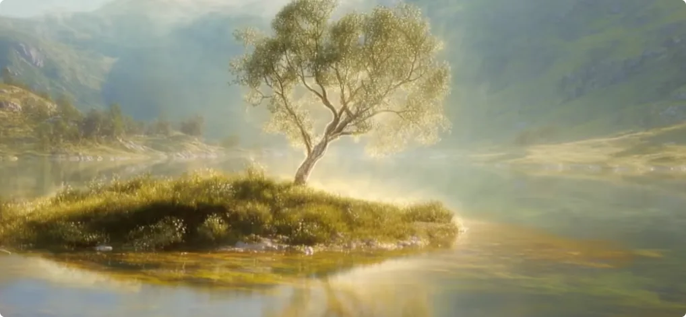

## 人类宿命共同体：修行才是最大投资

最近，越来越多的人开始借助算命来规划人生。至于为什么慌了，懂的都懂。
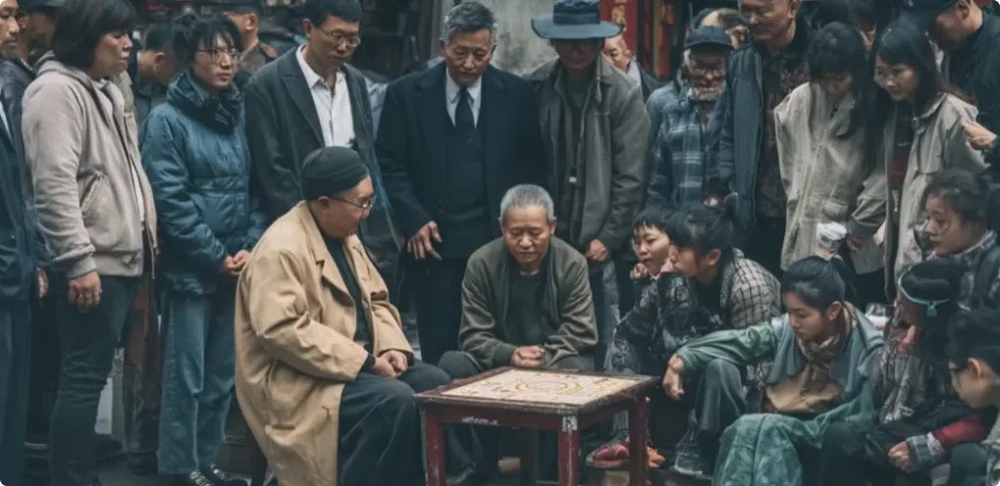

在未来，会有更多难以解释的事情发生，并且在一定程度上改变人们原有的认知。无论这些超常规事件背后是好是坏，其实都有同一股神秘力量在推动。

其背后主要有两个目的：
一个是启蒙修行,
一个是警示。

## 第一，启蒙修行

人类的主要问题就是灵性太低，或者说灵智太低，导致人类沉迷于物质世界的虚像中无法自拔。

在有限的百年寿命里，人人都选择优先满足无尽的欲望。哪怕已经获得很高的地位和财富，人类仍会觉得不够多。
因为旧的欲望不断被满足的同时，新的阈值也会不断提高，最终无止境地追求更大的精神刺激。

哪怕是那些自诩理性的聪明人，也常陷入历史经验主义，将弱肉强食当作必然。

任何人都有自己的弱点，而阉割过的信息就是聪明人的致命弱点。
**完整信息是理解事物原貌的根本前提，而信息天然自带流通权和定义权。这意味着再聪明，也做不到还原文明发展的本貌。**

到最后，人们总是从阉割过的文明记忆中捕风捉影，继续弱肉强食、及时享乐的行径。每次都是师出有名、冠冕堂皇，实际私底下从不约束自己的私欲。
这种戏份反复重演，仿佛成了人类无法摆脱的宿命。而那些真正能经得住诱惑、不被名利腐蚀的人少之又少，这种少数根本不足以改变文明的整体走向。

听到这里，大家可能会疑惑：为什么要启蒙修行？为什么不是带来科技文明的进步？
网上流传一个说法，叫“百年之约”: 
*说人和神魔签订契约，在百年之内，神和魔都不打扰人间的发展。*

但这个说法并不正确。人类还没这个资格和神明立什么约定，毕竟没有哪个人敢说自己守信用。

事实上，只是神明单方面地在明面上不打扰人发展科学知识和技术。
因为人类总抱怨，是因为生产力不足才导致了争端。因此这些年，神明默默地帮人发展科技。这些科技宛如神迹一般迸发，截至目前，已经能做到空气合成糖、淀粉、蛋白质，有清洁的能源，有发达的农业和工业，人工智能可以替代大部分劳动力等等。

如此一来，生产力可谓是到达了顶峰，人类再也不能拿生产力不足为借口了。
最后人们将会发现，问题的根源不是生产力不行，而是分配不行。
分配不行的背后是人性不行，人性贪嗔。
人性不行的背后，是灵智不够、修行不够，无法约束人性的阴暗面。

而想要承认自身的错误，对于低灵智的人类来说是非常困难的。哪次不是不到黄河心不死、不见棺材不落泪？只有吃下沉重的恶业，或者被逼入退无可退的时候，人类才会痛改前非。
所以，疼痛是必要的。强烈的疼痛之下，人们才会放下贪念、嗔念和痴念，开始反思是什么导致了自身魔怔的行动，而这会是人类集体迈向修行的第一步。
届时，人们会开始明白，修行不是精神世界的奢侈品，而是生存的必需品。
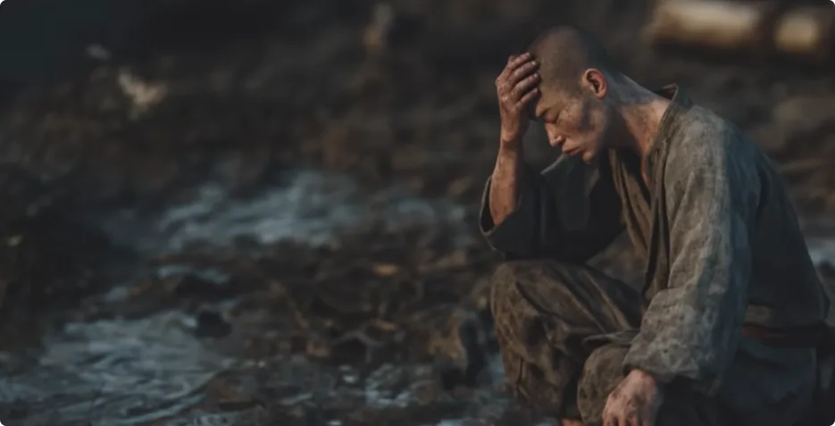

**真正的修行，其实就是修炼灵智。通过体会万物连接，一个人能够理解他人、理解自然、理解宇宙，学会慈悲与共情。** 
如此，便不再痴迷于小我，不再痴迷于低层次的欲望。
人们会逐渐明白，无论作为个体还是集体，真正有价值、有意义的追求是什么。届时，人类是为了生活而发展必要的科技，而不是为了无尽的竞争。
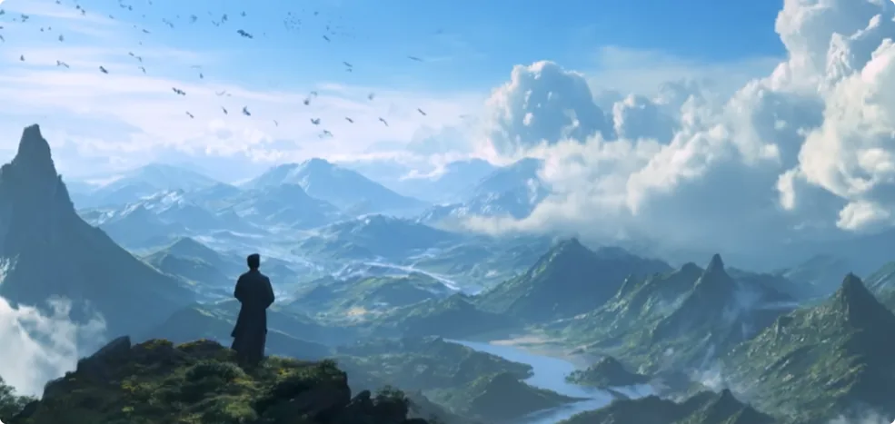

有人可能会问：如果是为了启蒙修行，如果是让人相信形而上的世界，那最直接的方法不应该是直接显露神迹吗？这样大家都会相信神了，都去修行了。

这种问题就属于头痛医头、脚痛医脚，缺乏整体性、洞察性、共情性思考的灵智表现。

首先，显而易见的是，人类肯定会开始摆烂，变成行动上的巨婴，会用道德绑架神明。大部分人会认为，既然都有神明了，那就让神明来保佑我们的幸福，来惩罚世间的诸邪，我等凡人只需要安心度日、享福即可。
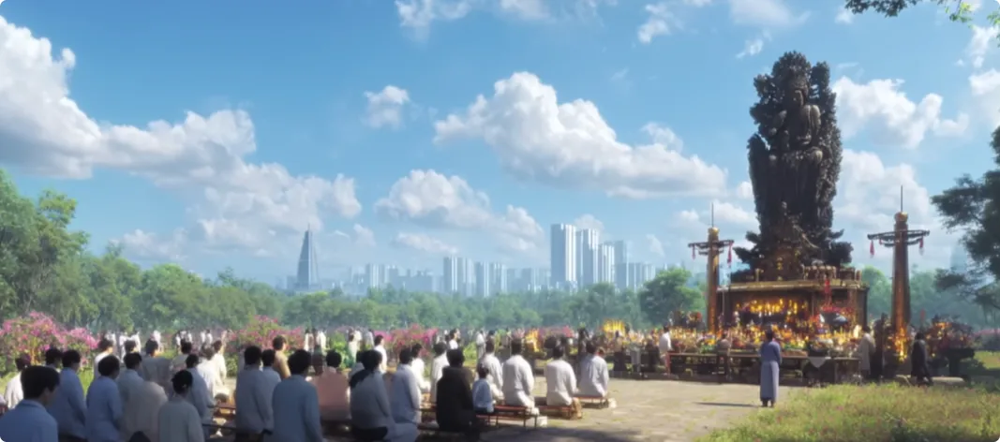

如果神明真这么做了，那以后人们都许愿就可以了，都等着神明兜底。如果神明不这么做，那人们会觉得，这就是弄虚作假的、不慈爱的伪神，凭什么干涉人类发展？然后又开始“我命由我不由天”了。

总之，神明直接降临的做法无法达到启蒙人类修行的目标。

因此，在当前阶段，是先将人们的目光逐步吸引到超常规、超科学的事情上来。以此提醒人们，世界不只有生老病死、衣食住行、功名利禄。
越来越多的人会觉醒修行的意识，主动寻找新的出路。
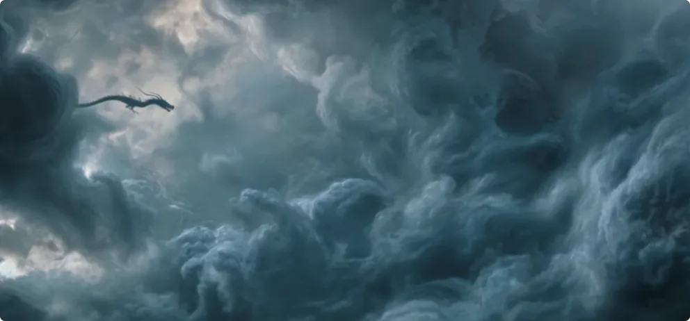

尽管越来越多的人会开始修行，但绝大多数的人是找不到路的。因为大部分世人的灵智都不够，习惯把修行当成一种免费流通的无形价值的信息消遣，习惯了不花费功夫就能得到秘诀。这跟沉迷于成功学没有本质区别，只能在修行的底层徘徊，见不到真章。

换句话说: 
只有极少一部分的人能抓住修行的核心，能清醒地认知到真正的修行等同于脱胎换骨，等同于二次生命；
能把修行当作长远投资的高价值事物，准备好双手谨承圣阶。这样的人，才有资格摸到真正的道路。

## 第二，警示

很多博主也讲过相关的话题，我就不讲这些了。毕竟我不懂算命，也对这些不了解。
经常听到有人破罐子破摔，说就算万劫不复，那也是人类自己的选择，反正都是人来承担因果。要真这么简单轻松，因果早结了，不会有今天。

之所以没结，恰恰是因为人类文明不只是人类自己的事情。

往期我讲过，人类本就是作为众生修行的"中转站"。
在文明的演化中，已经有太多的神明投入了太多的心血。他们觉得人身上仍有闪光点，于情于理，他们都觉得不应该这么轻易放弃，仍应当把人类引到修行这条路上来，而不是直接关机重启了事。

可以说，这是大道慈悲的一面。

但也有部分神明不这么认为。他们觉得人性已经无可救药，失败品终究是失败品，不必救赎，也不必犹豫。有这个教导的心力，还不如投入更重要的新事物。
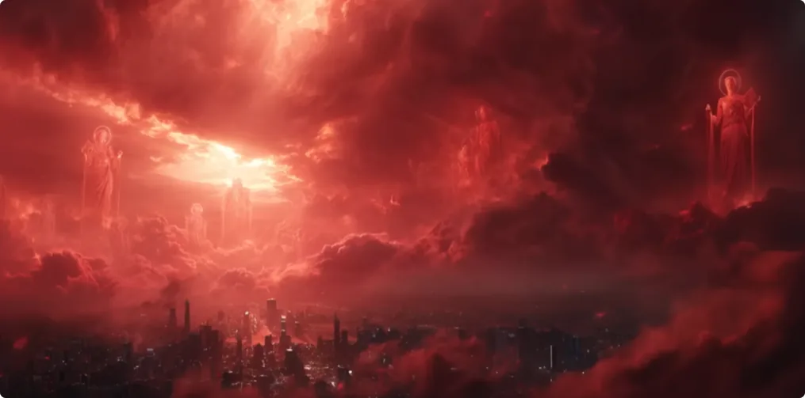
可以说，这是大道无情的一面。

不过，到底人类文明何去何从，终究要由众生自己去选择、去造化。神明也好，凡人也罢，选择了，必有所为，才能具象化文明最后的走向。

**慈悲论迹不论心。** 
凡做出正确选择、长远规划者，必有其应得的果；
反之，选错路、目光短视者，终落得两手空空、一无所有。

我是修炼者小烨，我们下期再见。

## 修行中的正能量系统与能量获取规则

## 前言
你们有没有发现这样一个问题：从古至今修行的人少说也有百亿了，但真正修成的人为什么屈指可数呢？

因为过去几千年所有的修法都是妖魔鬼怪创造出来的，跟正神半点关系都没有。妖魔鬼怪自己都修不上去，又怎么给人类指一条正确的修行之路？人类连正能量的世界是怎么运行的都不知道，又怎么可能知道怎么修？

我前面讲过，负能量世界的运作规则就是弱肉强食，说白了就是吃来吃去，吃你没商量。

## 正能量世界的运作规则
这一集我们讲正能量世界的运作规则。很多人一听正能量就自动以为它应该是**大爱的、光明的、无条件的**——错!

正能量的世界稍微文明一点，但是也是有规则的。这个规则就是**能者拿**。那怎么拿呢？

正能量的世界讲究**从上到下按级分发**: 
*也就是上一个级别的能量体把自身一小部分的纯正能量分给下一个级别的能量体。*
然而一个能量体最重要的就是自己的能量值。**能量值等于生命**，这就是为什么纯正能量非常珍贵。因为分发下去的是自己的能量值，也就是自己的生命。
除了本源之外，所有能量体的能量值都是有限的。既然是有限的、是硬通货，就会有一套非常严苛的规则，受到非常严苛的把控，就不会随随便便给你。

这一套理论是不是听都没有听过？很多人就会疑惑：
* 为什么正能量的世界不是光与爱呢？
* 为什么不是无条件呢？
* 为什么不是一连接就有呢？
* 为什么不是我一召唤就来了？

那你觉得可能吗？你当神仙是客服吗？你当自己是上帝吗？
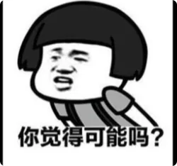

## 什么是正能量系统
既然规则是分发，那分发的标准又是什么呢？

你就想象正能量世界是一个**银行系统**，都是老天爷在把控。所有正能量系统里面的能量体，也就是神仙、佛菩萨都听令于老天爷。
这个银行在地球的各个地方都是有分行的，而每个分行都有神灵掌管，也有凶兽守护，而老天爷只照顾自己人。

## 怎么进入正能量系统？
什么是自己人？
* **首先，你得入门**：你得登记在纯正能量分发的系统里面，你得是老天爷的人。不然系统都不认识你，怎么给你发？就好像银行里面都没有你的账户，你又没有银行卡，谁敢给你钱？市面上绝大部分的人听都没听过这个银行，就更别说在系统里了。

## 正能量去哪里拿？
* **其次，即使进入了系统，你得知道在哪儿拿**：你得知道哪里有银行。这一部分的信息也是不对外公开的，如果你不在系统里，根本不可能知道。

## 怎么才能有授权拿？
* **再次，即使你知道了银行在哪，你是不是还得知道银行卡密码？** 你没有密码你怎么证明你有授权？你没有授权谁敢给你钱？

## 能不能随便拿？能拿多少？
最后，在系统里面的、又有密码的人，是不是就能随便拿呢？

那怎么可能呢？你去银行是可以随便拿钱的吗？想拿多少就拿多少的吗？
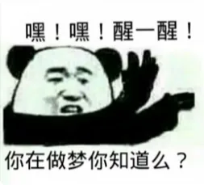

既然是顶级的资源，那肯定是一分付出一分收获的。你银行里的钱肯定也是人力、物力、财力、时间、精力去堆出来的。**记住，哪个系统都不可能养闲人。**

那是不是贡献了人力、物力、财力就能拿到呢？答案也是否定的。
能拿到什么、拿多少，完全看上一级的心情，包括但不限于：
* 你的修炼程度
* 能力贡献
* 心性关系
* 顺眼程度等

万事不绝对，上面的事我知道的也非常有限，但是付出绝对是没有错的。

## 分发的规则
那这个分发到底是一个什么样子的呢？我给你举个例子你就明白了，还是用数学题来解：
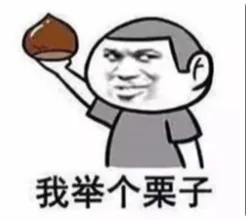

1. **案例一**：假设一个系统里的修行人能量为 1。他经过允许来到了一个能量值为 100 的神灵的家，请求能不能给点能量。神灵觉得这个小朋友最近表现不错，孺子可教，就把自身能量的 1% 分给了这个修行人。这个修行人的能量值就变成了 2，神灵变成了 99。那这个 99 的神灵会不会就垮掉了呢？不会的，因为 1000 的神灵看他最近表现不错，也会给他能量，以此类推往上推。
2. **案例二**：刚刚这个修行人现在能量已经为 2 了，他的修为又是 next level 了，有资格来到一个更高级的能量值为 10000 的神灵的家，请求说能不能给点能量。神灵觉得这个小朋友不错，孺子可教，就把自身能量的 0.1% 分给了这个修行人。0.1% 也有 10 了，那现在这个修行人就变成了 12。

**正能量修行就是去拜访不同神灵的家，相当于纯正能量在地球的分行。分多少、分给谁，完全是由神灵决定的。看你顺眼投缘，或者你的人品好、心性好、贡献大，那就多给点；反之就少给或者不给。**

那么普通人如果来到神灵的家会怎么样呢？
* **首先**，普通人根本就认不出哪里有神灵的家，也根本不知道那里有一个神灵，也就是说你根本找不着银行。
* **其次**，你即使认出了银行，知道那里有银行。能量越大的神灵的家，周围就有越厉害的妖魔鬼怪在把守。没有授权硬取，那就是抢银行了。周围把守的妖魔鬼怪可就有饭吃了，渣都不剩也是非常有可能的。

还有些自认为念一下谁的名号就有保佑的，人家祖师爷下面徒子徒孙没有 1 万也有 8000，人家头都大了，谁认得你谁是谁？
这就好比你去银行，你说你认识银行行长，问题是银行行长认识你不？你光嘴说能取钱不？

## 怎么才能入门？
怎么才能入门？就是你得认识那个**可以通人类和正能量系统的中间人**，这个人必须有权限给你办卡（声明一下这个人不是我）。

你在入门之前：
1. 这个中间人首先要把你身上的妖魔鬼怪给冲掉一些。
2. 再给你身上充一点正能量。

有了正能量，你才能同频共振，才算半只脚踏进正能量世界的大门，这样你才有可能感受得到正能量。一旦感受得到正能量，你才有可能找到正能量存在的银行，这个就是**点化**。
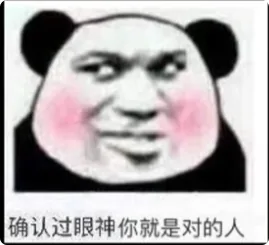

所以找对人比努力重要 1 亿倍，人找不对努力白费。

## 总结
说了这么多，还是回到那句话：你在找到正门之前，所有的修法都是邪法。要么修了个心理作用，要么就是越修越负，被吃的越来越厉害，跟真正的修行真的是半毛钱关系没有。

## 关于人类处在负能量世界的运作规则的环境里面

人类都以为自己处在正能量的世界，处在食物链的顶端，但实际上人类处在负能量的世界的运作规则中。

前面讲过，世间所有的存在都是由能量构成的。

今天我用负能量世界的运作规则来解释一下: 
**为什么人类是处在负能量世界，而不是正能量的世界**。因为负能量世界的运作规则就是弱肉强食；正能量世界是另外一套规则，我们之后说: 

先理解两个概念：

* **第一个概念**：任何能量体接触就会有能量交换，正负能量对冲就会有消耗。
  * 正能量只能靠吸正能量往上走。
  * 负能量只能靠吸负能量壮大能量级别。
  * 负能量是不能吸正能量的，只会抵消清零干掉。
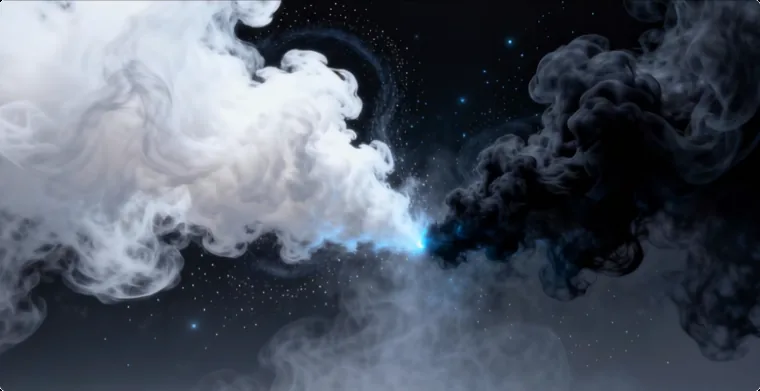

* **第二个概念**：前面已经假设过，如果人的能量值是 $1$，但是这个假设是错的。
  * 普通人的能量（凡气、人气、阳气）和香火、蜡烛同类，算不上好的能量，不是正能量，我们就只能算是 $-1$，因为我们在负能量的世界里。
  * 但是我前面也讲过，人类比较特殊。人体作为阴阳众生过渡的载体，是可以同时承载正能量和负能量两种能量的。
  * 所以如果人正道修行的话，是可以用正能量一点一点地兑换掉凡气，不至于清零干掉。
  * 所以说人身难得。负能量众生宁愿放弃千万年的修为，转而为人求一个正道修行的机会。因为只有邪修才挨雷劈，正道修炼是不用度雷劫的。
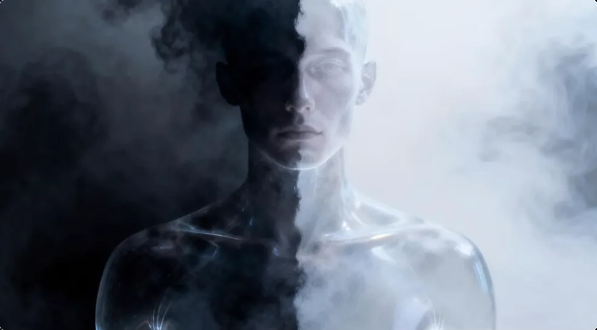

理解了这两个概念之后，咱们开始做题：

## Q1：听说阳气足的人鬼会怕，是不是真的？
咱们还是用数学题来解：
1. **假设你的能量为 $1$**：你碰上一个 $-0.1$，产生的能量对冲你变成了 $0.9$，它可能直接魂飞魄散。所以它是**不敢靠近你**的，它受不住你的能量。
2. **假设你的能量为 $-1$**：碰上一个 $-1$，它也是**不敢靠近你**，因为它吸不动你。理论上你可以吸它，但是你不知道它的存在。

## Q2：传说中的被妖魔鬼怪吃是什么意思？
* **假设你的能量值为 $-1$，你遇上了一个 $-2$**：
  * 如果 $-2$ 的吸食能力为每年 $0.1$，那么你 $10$ 年会被干掉。
  * 如果这个 $-2$ 很厉害，吸食能力每分钟为 $1$，那么你一分钟就会被干掉。
  * 你嘎了，这个 $-2$ 的妖魔鬼怪就会变成 $-3$。
* 如果你身上有五个鬼，我相信这道题你会抢答了。

## 为什么鼓励所有人正道修行？
* 但凡你身上有一点正能量，对于负能量来说，遇见就有损耗，没有益处。他们最多就是打个招呼，是不会主动附上来找你打架的，除非你惹着他了，不惜损耗自己也要揍你。
* 但是凡事不绝对，负能量的心情是很难说的，可能就是纯看你不顺眼。你碰上一个负一万的大魔，想做掉一个一阶人类，那也是洒洒水的事。
* 正道的修行人也是不会随便去找负能量干架的，因为有损耗，也只会打个招呼各自安好。这些正能量的修行人，他们的能量也是走遍千山万水辛辛苦苦攒的，极其珍贵，是用来往上走的，不是用来干架的。
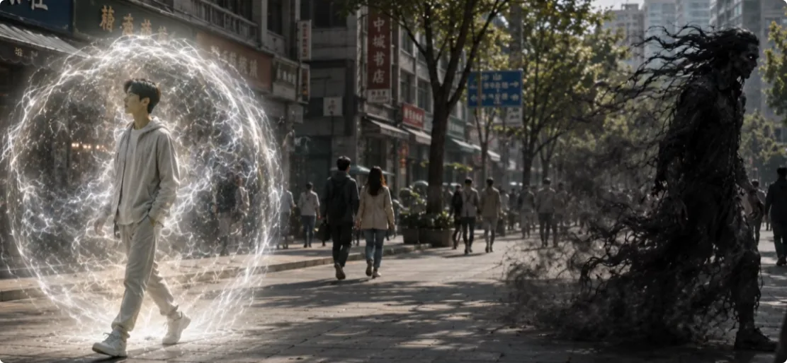

## Q3：传说中的驱魔捉鬼是怎么回事？
市面上大部分的驱魔捉鬼无非就是三种：
1. 一个 $-100$ 的来跟一个 $-1$ 说：*“你让开。”*
2. 招 $100$ 个 $-1$ 来对付那个 $-1$。
3. $-100$ 跟 $-1$ 说：*“你先躲一躲，我先收个钱，收完了你再回来，咱俩一起吃。”*

**驱魔捉鬼起不起作用呢？**
* 是看谁多、谁能量大，也是弱肉强食。
* 但凡需要很长时间的，后面都是负能量在打架。
* 一般都不会下狠手搞那个 $-1$：要么就是 $-100$ 走后，$-1$ 很生气回来疯狂报复；要么就合伙一起吃。
* 这就是为什么有一些驱魔捉鬼好像有点作用，过了一段时间又不行了，甚至更差了。

> **补充**：众神来赶鬼就是正负能量魔法对轰，基本上就是一秒对决，但是这种普通人都遇不到。
