> 本页为「修真家族大解析」4 篇的合订本；原文章链接会自动跳转到本页。

## 修真家族大解析:龙族

## 从祖龙到原初龙族

今天聊一聊法界的大家族——**龙族**。

最近很多人对龙族很感兴趣，尤其前段时间，西安、成都等地出现了疑似龙族的拍摄视频。这次就结合龙族相关知识与前段时间发生的事情，一起讲一讲。

> 如有雷同，纯属巧合。大家当作小说素材听听就好，千万不要怼我。

龙族诞生于混沌，也就是太初时期。最早诞生的是**祖龙**，所以龙族的祖先是祖龙，并不是网上很多人所说的烛龙。至于烛龙，后面会单独讲到。

祖龙通过自身分化化成阴阳，也就是我们所说的雌雄，随后逐渐诞生出许多原初龙族。最早由祖龙分化、诞生出来的那一批龙族，就叫作**原初龙族**。

与龙族同样古老的还有凤族。龙族、凤族、麒麟族以及其他种族曾经为了争夺地盘而发生大战，这段时期统称为**龙凤初劫**。

## 巫妖大战与三界分化

龙凤初劫之后，便来到了上古巫妖大战时期。喜欢洪荒题材的人，应该对这场久远的大战有所了解。

巫妖大战以前，天地尚未分开。当时女娲创造了人族，但人族的地位非常低下。彼时真正强势的统治者是巫族和妖族。龙族经历龙凤初劫后，自身实力已经衰弱，不再像原初时期那样强大。

巫妖大战结束后，天地开始分化。新的天庭将天、地、人三界隔开，并把龙族及许多神兽族群带往高维度，其中包括：

- 凤族
- 龙族
- 麒麟族
- 孔雀族
- 青鸾族
- 狐族中的天狐族

这些族群至少进入了四维以上的高维度，而人类则停留在三维空间。

与此同时，人本身也受到了一些限制，例如寿命被限制在一百二十岁左右，基因等方面同样受到约束，不再像天地未分时期的人族那样强大。

当时的人族有很多曾与巫族、龙族结合，血脉之力比较强，无论根骨、灵气、身体素质还是寿命，都比现在的人类更强。天地划分之后，再加上诸多限制，人类逐渐无法沟通更高维度的生命，也不再像最初那样容易通灵。

经过漫长的时间，人类开始通过**采炁**修行，也就是吸收日月精华，后来逐渐出现了修士。修士修习丹道，再往后才产生了一些宗教体系。

# 西安、成都疑似“龙影”事件

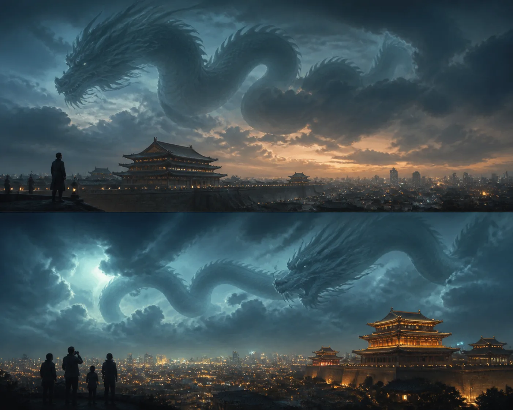

## 普通人能否拍到龙族

前段时间，有人在西安、成都等地拍摄了一些视频，声称空中可能出现了龙。也有人认为，视频里的东西只是塑料袋之类的物体。

按照我的个人理解，大部分龙族都属于**高维度生命体**。高维度生命体无法被人类直接通过肉眼观察到。无论是相机拍摄，还是人亲眼看见，本质上都依赖人类的视觉系统，而普通肉眼很难直接观察高维度生命。

只有在极其罕见的情况下，例如：

- 雷雨天气；
- 特殊的大气折射现象；
- 磁场异常的地带；

人们才可能看到一些很小、很微妙的现象，比如一晃而过的影子。

因此，视频中那种清晰可见、呈长条形，并且所有人都能直接看到的东西，其实并不是龙。这只是我个人的理解；有天眼的人，也可以自行观察和判断。

## 泰山上空与磁场变化

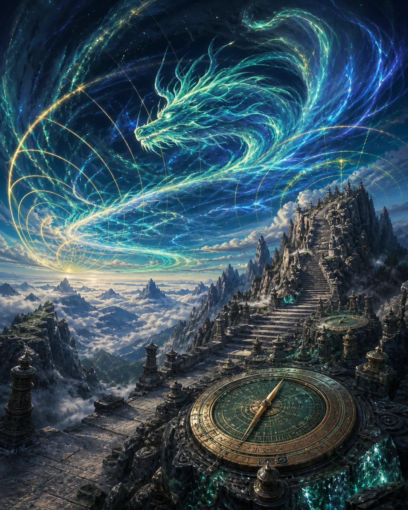

有天眼的人可以经常观察泰山上空。泰山本身有诸多神明，泰山上空也经常会有龙出现。

普通人通常看不见，但体质比较敏感的人可能会感受到磁场变化，身体也可能产生一些反应。

至于西安、成都出现疑似龙影的那一天，确实有龙在渡劫，只不过这只是当天发生的小事。真正的大事不方便讲，而且相关现象也不是因为渡劫才出现的。

# 龙族的主要分类

## 天龙

天龙之中包括**金龙族**和**银龙族**。顾名思义，金龙的原形呈金色，银龙的原形则呈银色。

此外，还有大家耳熟能详的烛龙，也就是**烛九阴**。烛龙目前正在九幽镇守某个地方，相关人员可能知道这件事。

天龙中还有翼龙。翼龙生有翅膀，其原形非常帅气。

## 四海龙族

四海龙族分别对应东海、西海、南海和北海：

1. **东海**：目前在人间的投影位置位于蓬莱。
2. **西海**：投影位置在青海附近。
3. **南海**：投影位置在普陀山附近。
4. **北海**：位置较为神秘，不方便告知。

网上有人认为北海位于贝加尔湖，但这种理解比较浅显。四海并不是指地球上的东西南北四片海域，而是相对于天界位置而言的海域。

例如，道家体系中有“北海四圣”。不可能让北海四圣只管理一个小小的贝加尔湖，所以这些海域本身位于高维度，只是隔一段时间，可能会在人间的某个地方产生投影。

如果有人到达投影区域，便有可能连接到一些比较厉害的神仙，或者看见天界海域中的某些事物。因此，四海在人间的投影位置通常并不固定，上面提到的只是目前对应的位置。

人间许多地方也存在通往这些区域的通道和入口。例如，有人前往五台山、昆仑等地时，可能会看到一些特殊景象，连接到高维度空间，甚至到达这些地方。

这样的通道与入口有很多，但通常不会轻易对外透露。

## 地龙

地龙的范围比较广泛，包括：

- 湖里的龙；
- 江里的龙；
- 河里的龙；
- 山上的龙；
- 井里的龙。

这些地龙目前尚未飞升，也没有进入上界，仍在人间徘徊。它们大多是人间本土精灵修炼而成的龙，本身拥有的龙族血脉比较少。

只要体内存在龙族血脉，并且血脉浓度达到一定程度，它们就可以逐渐升级、修炼成龙。

# 龙族的姓氏、性格与职责

## 龙族常见姓氏

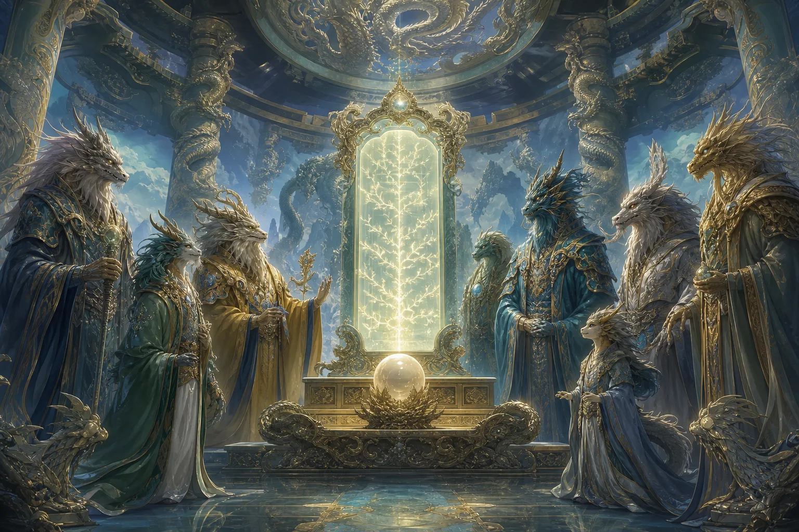

大家听得比较多的是**敖姓**，例如敖丙。除此之外，龙族还有其他姓氏：

- **龙姓**：许多天龙族以龙为姓。
- **青姓**：东海的一些贵族龙姓青，因为东海对应青龙。
- **白姓**：西海的一些龙族姓白。例如有一位很出名的存在叫白泽，这里说的是名字叫白泽，并不是白泽这个种族。
- **姬姓**：少数龙族贵族以姬为姓。

## 龙族的性格特点

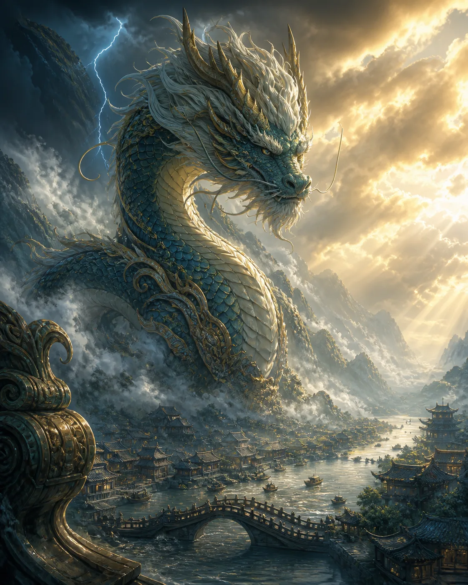

龙族通常比较高傲、霸气，也非常孤傲，但并不是所有龙都如此。有些龙性格温柔，也有一些非常可爱。

龙族通常比较喜欢睡懒觉。有些龙一睡就是几百年，甚至上千年。它们跑到龙域睡上一觉，人间几百年可能就过去了。

## 龙族承担的职位

新天庭成立后，龙族签下契约，为天庭服务。佛家、道家体系中都有龙族任职。

龙族的主要职责包括：

1. **司雨布雨**  
   龙族负责司雨，为人间行云布雨，这是大众最熟悉的职责之一。

2. **担任护法**  
   许多大家族都有龙族担任护法。

3. **回应寻龙尺**  
   一些使用寻龙尺的人应该知道，某些寻龙尺确实可以招来龙族。被招来的龙有时会帮助解答问题。

4. **行军布阵**  
   天庭作战时，龙族也会参与行军布阵，为战争出力。

龙族是一个非常庞大的家族，比狐族还要大得多，基本可以算是法界规模最大的家族之一，族群数量也非常多。

# 蛇、蟒、蛟与龙的进化

## 龙族与上古灵蛇族的区别

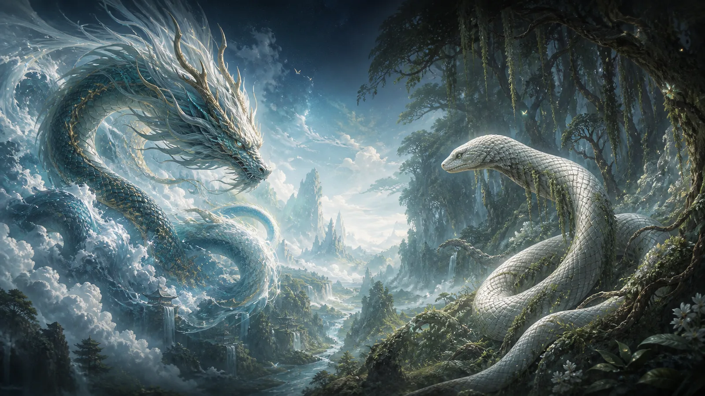

蛇与蟒的本源，大部分来自龙族，也有少部分来自**上古灵蛇族**。

上古灵蛇族与龙族不同。大家熟悉的女娲，就属于上古灵蛇族。上古灵蛇族还有一种称呼，叫作**娲族**。娲族与大洪水有关，懂的人自然会懂，这里只简单提一下。

蛇、蟒体内只要拥有龙族血脉，或者上古灵蛇族的血脉，就有机会不断升级，最终化为龙，或者进化为上古灵蛇族。上古灵蛇族同样是一个非常强大的家族。

## 从蛇到龙的修炼阶段

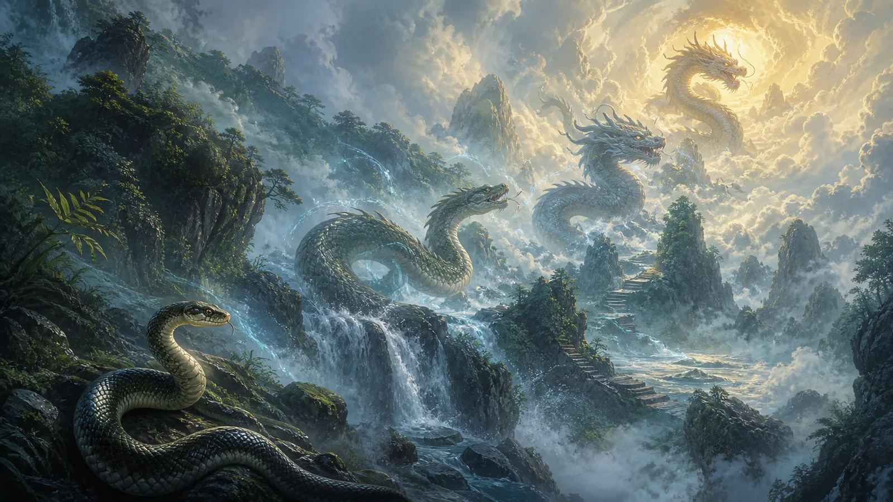

蛇、蟒、蛟化龙，大致要经历以下阶段：

1. **蛇化蟒**  
   一般需要一百年至二百年。

2. **蟒化蛟**  
   至少还要修炼五百年。

3. **蛟化龙**  
   蛟至少还需修炼一千年至一千五百年，有时甚至需要两千年，才能真正化为龙。

修炼过程中要经历的劫难，与狐族修炼时类似，并不只有雷劫，还包括许多其他考验，例如：

- 情劫；
- 亲情关；
- 色欲关；
- 其他心性与因果方面的劫难。

## 化龙时的雷劫

到了蛟化龙的阶段，劫难会变得非常困难。化龙时肯定要渡雷劫，而且往往不只渡一次。

雷劫的强弱还与雷电颜色有关。例如，**紫色雷劫**就属于非常厉害的一种。

# 为什么我们被称为“龙的传人”

很多人一直疑惑，为什么中国人会被称为“龙的传人”。

按照这一体系的说法，我们每个人体内其实都拥有龙族血脉。因此，“龙的传人”并不只是一种象征性的说法，而是指人类身上确实存在龙族血脉。

> 我们是名副其实的龙的传人，不只是文化象征，而是真的拥有龙族血脉。

## 修真家族大解析:狐族

# 狐族：五大家族中的庞大体系

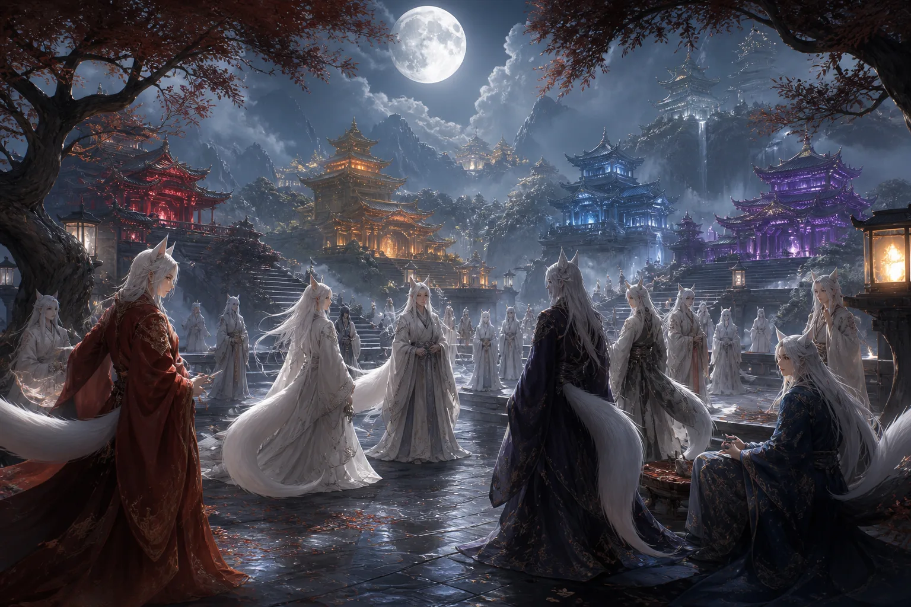

大家好，我是玄灵。今天开启一个新的系列，讲讲修真或日常生活中经常会遇到的一些大家族，也给大家做一点简单的科普。

这一期要讲的是五大家族中的**狐族**。狐族本身就是一个很大的家族，内部有非常多的分支体系。我国从古至今，也流传着许多与狐族有关的传说。但很多人对狐族的印象一直停留在“狐狸精”“野狐”之类的负面形象上，所以今天我想给狐族“平个反”。

我自己也修有狐仙法脉，对娘娘他们一直非常敬重。狐族整体的气质通常都很沉稳，做事不紧不慢，也比较可靠。他们的外形大多是帅哥美女、帅哥靓女，很少有不好看的。当然，我之前也讲过，有些狐仙喜欢白胡子老头的形象，所以也可能呈现出比较*仙风道骨*的样貌，但大部分还是帅哥靓女。

# 狐族的主要族群与界域

## 不同地区的狐族分支

狐族内部有许多种群，也可以叫作族群。比较广为人知的包括：

- **青丘狐族**
- **涂山狐族**
- **长白狐族**
- **昆仑狐族**
- **天山狐族**
- **龙虎山狐族**
- **阳明山一脉**

青丘狐仙和涂山狐仙之间的关系比较近。长白、昆仑一带的狐族通常以白狐为主；天山狐族主要在新疆附近的天山一带；阳明山这一脉，则是从龙虎山那边分出来的。

## 高维空间与法界投射

像青丘、昆仑这类地界，其实可以理解为其他维度的空间。有些界域投射到地球上，对应长白山等地；青丘在地球上也有一些投射点，但它本身属于一个高维空间。

打个比方，有些狐仙生活在一个独立的界域里，比如“狐仙界”或“狐界”。一些修法教的师兄也知道，法教中有一个说法叫作**师公山**。这些地方并不处于地球所在的物质维度，而是在法界中的某个界域。

甚至有些很厉害的大佬，还拥有属于自己的私人界域，类似小说里所说的“戒指空间”。这种空间在相关体系中，被认为是真实存在的。

# 天狐、地狐与狐族的修行

## 天狐与地狐的区别

从类别上来说，狐族可以分为天狐、地狐等。

**天狐**相对比较厉害。天狐可能本身就生于天界，也可能从下界一步步修炼上去，最终修成天狐。这个过程少说也需要上千年，才有机会修到天界。

**地狐**则是生活在地球上的普通狐狸。它们通过修炼获得法术或传承，逐渐修出法身。按照狐族的修行说法，狐狸修炼大约一百年后会逐渐产生灵智，并开始尝试化形，比如先把头部化出来，或者先把尾巴修掉。真正修到五百年左右，才有可能得到完整的人形。

> 狐族修到一定程度后，同样需要历劫，包括雷劫、火劫等，但并不一定百分之百都是雷劫。

## 吸收日月精华

狐族最常见的修行方式之一，就是吸收日月精华。这是一种修丹的方式，通过长期吸收日月之力，慢慢积累修为。

不过，也有一些喜欢耍小聪明的狐狸，会在人睡着后进入梦境吸取阳气和精气，目标大部分是男性。它们也可能不入梦，只是在睡觉的人旁边吸取阳气。

这种情况下，人晚上可能会做一些“不可描述”的梦，第二天醒来后觉得特别困，好像整晚都没有休息好。按照这种说法，这就是阳气被吸走了。

## 接受族内传承

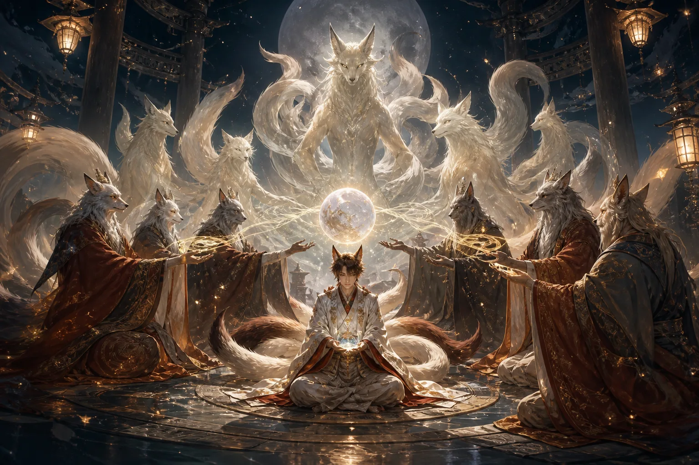

狐族内部也有已经得道飞升的老祖。老祖下界后，会向族内传授功法。族内长老也会挑选一些体质特别好、灵性特别高的小狐狸，把相应的功法传给它们。

每个种族的功法都有所不同。小狐狸可以修炼狐族内部的传承功法，逐渐获得修为，最后慢慢化成人形。

## 拜斗与星辰之力

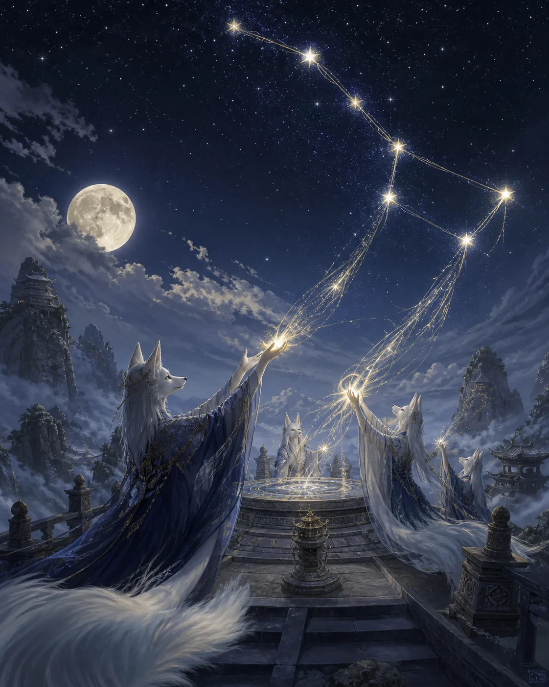

狐族还可以通过**拜斗**修行。这里的拜斗，一般指北斗、南斗以及诸天星斗。通过拜斗，可以吸收诸天星斗之力，用来增强自身修为。

除此之外，狐族的修行也可能获得信仰之力的加成。这种方式与吸收日月精华有所不同，更多与人间供奉、香火信仰有关。

# 狐族的考试与“编制”

## 狐族为什么要参加考试

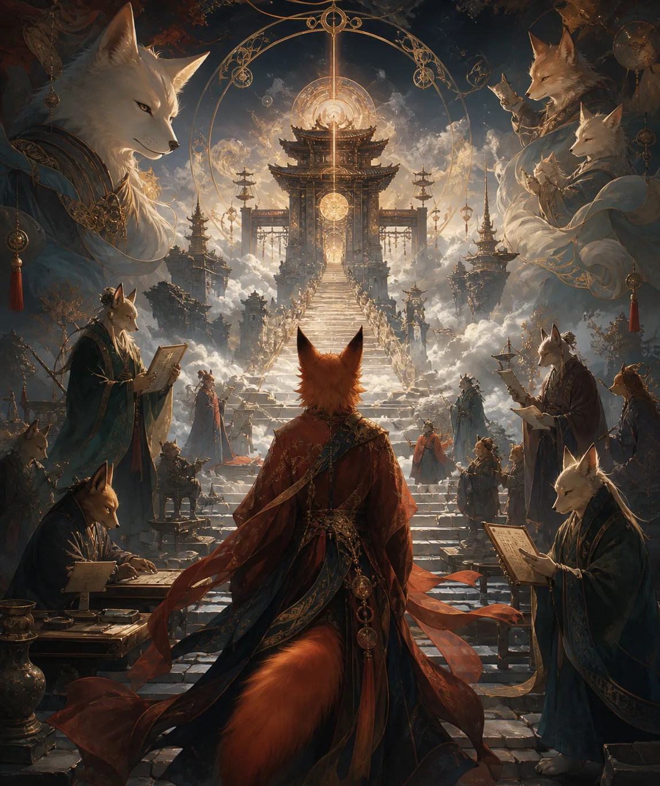

狐族同样需要参加考试，有点类似于人间的“考编”。狐族拥有自己的法界，考试成功后，就可以进入相应的法界任职，获得一官半职。

狐族内部有几个主要的考试地点。大家比较熟悉的，是泰山奶奶**碧霞元君**那里举行的狐族年度考试。狐族需要通过考试，才可以名正言顺地做一些不违规的事情。

另外，狐族也可以去北斗七星那里参加考试。按照这个体系的说法，北斗七星主管天下堂口，凡是“披毛戴角”之类的众生，基本都归北斗七星主管。除此之外，通天教主那里也管披毛戴角的众生。

## 通过考试后的去向

狐族通过考试后，就相当于有了一定的“编制”，可以称得上是神仙，而不再只是妖。通过考试的狐仙，通常有以下几种去向：

1. **给法师当护法**，或者去堂上护坛。
2. **在灵界办事**，通过办事、赚丹等方式提升修为。
3. **出马办事**，吸收人间香火并接受供奉。
4. **成为保家仙**，守护特定的家庭，同时接受香火。
5. **进入相应法界任职**，获得一官半职。

对狐族来说，接受香火的主要目的还是提升修为。有些狐族觉得单纯修丹过于枯燥乏味，就会通过接受香火、给人办事等方式增加修为。

修丹首先需要戒欲、清心寡欲，这一点连普通人都很难做到，更不要说欲望往往比人更重的动物。因此，很多狐族会选择接受香火，或者成为法师的护法。

很多法师也会来问我，说自己能够感觉到背后有某种存在，但不知道究竟是什么。查过以后，会发现其中很多都是狐仙。

# 狐仙与野狐的区别

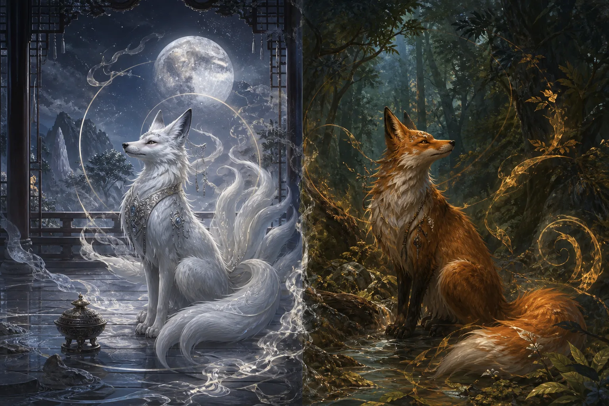

## 没有手续的“私自修炼”

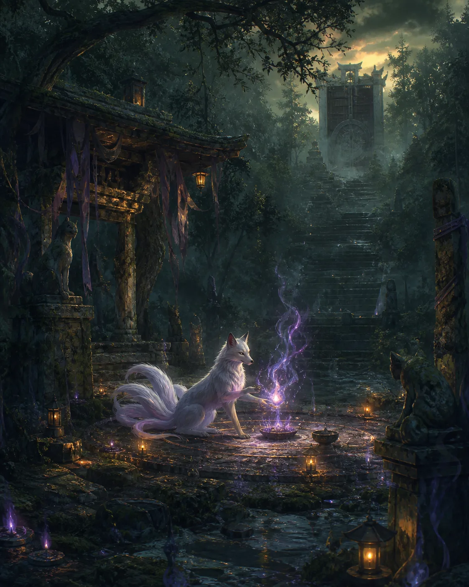

如果狐族不愿意参加考试，等待它的出路可能就只有成为**野狐**。野狐也就是大家平时所说的山精野怪。野狐同样可以修炼，但这种修炼属于私自修炼，没有正式传承，也没有任何地方记录它的身份。

按照这一体系，狐族还是要参加考试，取得相应的手续后才能正式修炼。否则，它的修炼就属于违规修炼，相当于没有手续。

如果这种野狐遇到神仙，或者遇到比较厉害、能够查验手续的法师，对方发现它没有手续，就可以直接将其扣押、封住，甚至关进罐子里。

> 正式的狐仙在地府都有档案。通过查询档案，就能判断它究竟是野狐，还是拥有正式身份的狐仙。

# 人身为何难得

狐族虽然在五大家族中算是比较容易修行的，而且狐族肉身的灵性与慧根也比较强，在五大家族中甚至可以说是最大的，但与人类相比，它们的修炼仍然非常困难。

原因在于，人类对于动物来说，先天就相当于自带五百年修行。前面讲过，动物需要修炼五百年左右才能得到人身，而我们本来就有人形，相当于先天比它们多了五百年道行。

这也是为什么在平时修行中，总要告诫大家珍惜人身。

> **人身难得，正是这个意思。**

今天这一期就讲到这里。如果大家还有什么想了解的，可以跟玄灵说。感谢大家关注，记得一键三连。

## 修真家族大解析:凤族

大家好，我是玄灵，本期来讲法界大家族之东方凤族。

## 一、凤族分类与主要成员

凤族旁系和旁支特别多，分类也很多。

- **赤凤**：红色的，凤凰赤如血。
- **青鸾**：经常在西王母身边做事情的种族。
- **鸿鹄**：在人间叫做大雁，但在法界非常非常大，移动速度很快，飞行速度在凤族中都是佼佼者。
- **金凤**：经常与金龙成双入对，在法界一些重要事情上会出来，非常漂亮，金灿灿的。
- **孔雀**：在人间就是孔雀动物，但在法界地位特别高，在凤族里地位都很高，因为跟青鸾、大鹏三个属于下一任凤帝的候选人。
- **大鹏**：比较与世无争，现在只有青鸾和孔雀在争。大鹏也叫金翅大鹏鸟，是道家和佛家的护法，自身能力很强，甚至能以龙为食，翅膀很大，在羽族护法里属于最厉害的战斗力。
- **雷鸟**：在天上经常会释放雷电、闪电。
- **彩凤**：是七彩祥云的凤凰，看上去跟彩虹一样，飞过的地方也会有七彩祥云。
- **玄鸟**：很多人说在人间就是乌鸦，但其实在法界才有。玄就是黑色，但不是普通黑色，是五彩斑斓的黑色，非常好看。

其中孔雀属于比较争强好斗的个性，能力很强，孔雀族族长的声望和名望甚至超过了青鸾。

## 二、凤族姓氏与血脉传承

凤族的姓氏主要有：**凤、风、孔、鹏、青、雷**。其中凤是最大的大姓。这里提一个**畲族**，畲族是中国的一个少数民族，人数很少，整个畲族都有太昊血脉，也有凤族血脉。他们的祖先三公主是人类，但其实是凤族转世，出生时百鸟朝凤，非常华丽，所以畲族整体带这个血脉。畲族中也有姓雷、孔等。

太昊也就是白帝太昊，五帝之一，居住在法界的白帝城，这个白帝城跟人间的白帝城不是一个东西，他在凤族里地位很高的一个帝王。凤族还有个姓叫**赢**，这个跟玄鸟有关。

## 三、凤族在人间与法界的居所

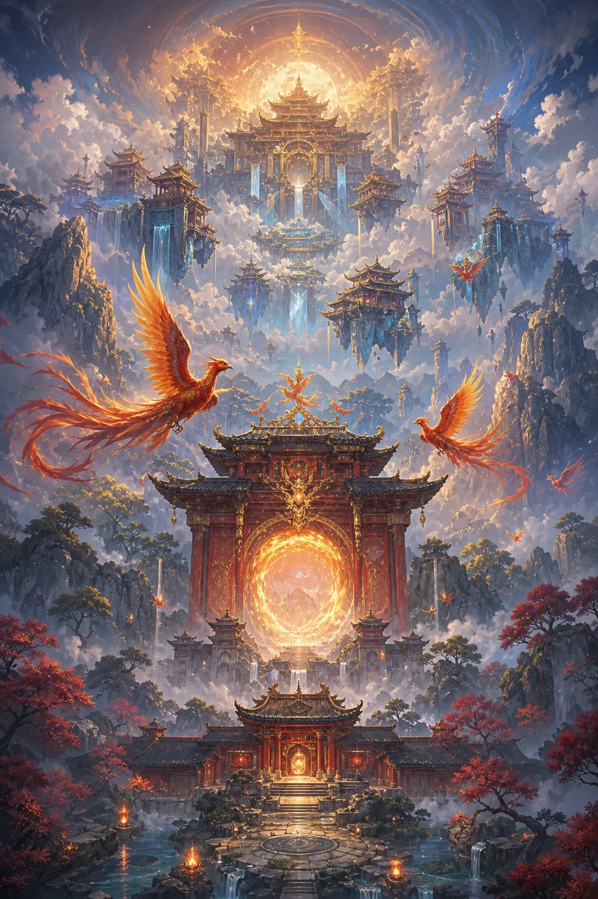

凤族在人间比较大的一个主庭，在昆仑东域，这里是整个凤凰的主庭，有很多凤凰栖息的树。在人间对应的是青海的扎麻隆凤凰山，这基本是最大的一个凤凰主庭。如果对凤凰凤族元素有兴趣的人可以去看一下。此外，四川、云南、河南的一些区域也有凤凰存在。

## 四、凤族外观与修行特点

凤凰的颜色，有赤、青、金、七彩等颜色。瞳色（眼睛颜色）有金色、赤色、紫色、黑色、青色等。

关于凤凰的修行，它跟植物灵、狐族、龙族比起来，修行化为人形会很久很久。这可能是因为它需要涅槃的特性，能量转化方式不同，所以化为人形需要很久，基本算是最久的种族了。平均化形成人的修为，至少要一千年左右。普通的植物大树可能500年渡劫后化形，凤族要1000年，狐族三四百年就可以，所以真的很久。整体羽族（包含凤族）的化形时间都比其他种族要久。

分辨一个凤族修为高低，可以看它的尾羽。尾羽数量不同，比如六根尾羽修为就不一样了，尾羽长短也不一样，最多只有12根尾羽。尾羽越大越多，能量修为就越大。修为高的凤凰飞起来会有光和雾，光雾颜色根据修为不同产生不同颜色，像金色、彩色就是修为很高的。

## 五、凤族个性与天赋能力

凤族的个性：据我所知接触的凤族，都不是很爱金银珠宝，不是很物质，但都很爱美，每天喜欢打扮自己、照镜子。对感情都不是恋爱脑，对感情看得很淡，允许接触感情但不执着。但非常专一，一旦认定一个人之后就不会再更改，无论那个人对他怎么样，都不会更改。无论男凤还是女凤都很专一，大多数一夫一妻，认定后不改变。

凤族天赋列举几个最厉害的：

- **空间法术**：时空间法术，可以根据修为高低改变一些时间空间，甚至一些法则。
- **飞行**：毋庸置疑，凤族是宇宙里飞行最厉害的。
- **治愈能力**：凤族的血、眼泪可以治病。但要注意，如果凤凰死亡之后的眼泪就没有效果了（没有涅槃就死亡的眼泪无效）。羽毛也有药效，可以治病。凤凰的血肉也可以治病，死亡之后的血肉和没有死亡的血肉都可以治病。但不要轻易打杀凤凰，凤凰家族虽然不如龙族庞大，但数量也很多，在天上担任很多职位。

## 六、凤族在天界的职位与功能

凤凰在天上担任很多职位。首先星宿这里有朱雀神君，南明离火，朱雀也属于凤族一类。九天玄女的坐骑以及身边护法、士兵、官员，很多都是凤族派来的，因为凤族与九天玄女签订了友好协议。

由于凤族擅长飞翔和时空间法则，所以作为仙官传信、九天使者非常擅长。

凤凰本身有除秽功效，南明离火和凤火可以净化整个磁场、污秽之物，所以多用于道坛、法坛上净坛。比如正一有科仪，像九凤破秽，法教也有九凤破秽。

其他还可以当一些仙官，如司乐仙官，管司乐，唱歌好听，演奏好听的乐曲。另外他们经常在火部待着，因为有各种各样的火，如离火、圣火等。

今天玄灵就讲到这里，如果有什么想知道的修行知识，可以私信。感谢支持，喜欢玄灵的给个一键三连。

## 修真家族大解析:黄仙

## 黄仙的原型与地位

在“胡黄白柳灰”五大家族中，**黄仙排行第二**，地位很高。黄仙的原型就是大家熟悉的黄鼠狼，属于**鼬科动物**，民间通常称其为“黄大仙”。

很多修行人会发现，黄仙的数量非常多，遇到一些事情时，经常会碰到黄仙。原因在于黄仙的本体很有灵性：用现代的话来说，就是它的肉身“代码”、自身基因，天生很适合修行和通灵。

如果没有通灵，比如一些家庭或养殖场圈养、专门用于获取皮毛的黄鼠狼，或者它本身生在资源匮乏、灵气贫瘠的山林里，就可能无法突破肉身限制，只能活到这一种族原本的寿限，大约是 **5至15年**。

## 肉身寿限与“电量”比喻

每个种族都有自身的寿限，人类也不例外。人类的寿限大概是一百二十多岁，可以把它理解成手机的电量：

> 人在小时候拥有接近百分之百的初始电量。如果天生没有什么劫，理论上就能走到自身寿限的终点。

但如果平时“后台运行”的 App 太多，这个 App 开一点，那个 App 也开一点，电量就会消耗得很快。人的欲望过多，或者把大量精力用在健身、打游戏等各种事情上，也都会“耗电”。耗电之后，如果不通过打坐、内炼等方式补充，电量就会不断下降，最终可能无法活到原本的寿限。

黄鼠狼大约十五年的寿限，其实与猫狗差不多。不过猫的肉身寿限更高一些，大概可以达到二十七岁左右。

## 百年修行与毛色变化

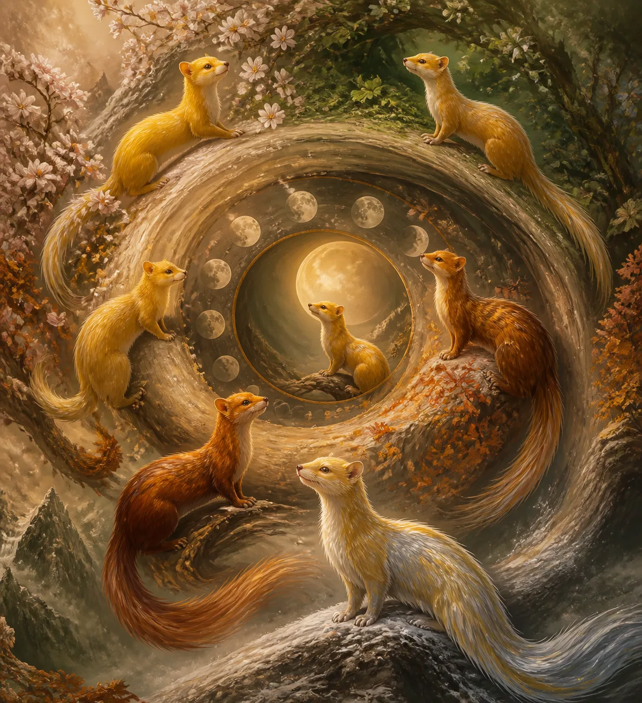

如果黄仙已经通灵，本身先天资源很好，又出生在大家族中，有家族长老传授功法，同时所在的山林、洞天灵气充足，它就可能持续修行到一百年。

一百年之后，它体内的“丹”会逐渐发生变化，修为也会随之提升，同时毛发颜色和花纹也可能产生变化。狐仙的修为常通过尾巴数量体现，而黄仙主要看**皮毛的颜色、光泽与特殊纹路**：

1. **普通阶段**：皮毛多为浅黄色。
2. **修为渐深**：皮毛会逐渐变得金黄耀眼，并带有明显光泽。
3. **由地仙修到上方仙**：毛色可能转为带有金属光泽的白色或银白色。
4. **更特殊的表现**：毛发中可能夹杂黑色纹路，头部也可能出现特殊斑纹。

这些外在特征，可以作为判断黄仙修为高低的一种方式。

# 三灾九难与雷劫化形

## 五百年雷劫

无论动物修行还是人类修行，都会经历所谓的**三灾九难**。一般来说，动物修行到五百年左右，会经历一次与化形有关的雷劫。化形之劫比普通劫难更难度过，通常要面对雷劫。

有些动物很聪明，无论黄仙、狐仙还是其他仙家，在雷劫到来时，都可能躲进树洞或藏到树干底下，借助树木抵挡雷击。这和一些修为较高的仙家利用法宝、阵法抵挡雷劫，本质上是同一个道理。

## 雷击木的形成

雷部降雷时，并不知道外面有树木替仙家挡灾。树木本身没有这场劫，却因帮助仙家承受雷击而变成**雷击木**。

如果一棵树遭到雷劫劈击后没有死亡，依然保持生机，那么这种活着的雷击木才是最上层、真正难得的雷击木。

# 黄仙的性格与行事方式

## 讲义气、守信用，也非常记仇

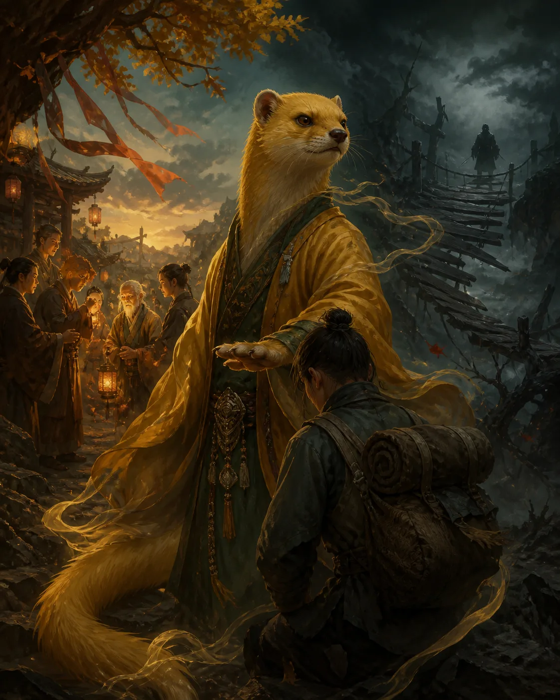

黄仙非常讲义气，同时也很记仇。只要答应了别人一件事，就一定会尽力办成；但如果别人答应它的事情没有做到，它也可能找上门来，严重时甚至会反目成仇，具体取决于事情的大小。

它们说到做到，十分守信，一般不会故意欺骗别人。与人相比，它们虽然聪明，却没有那么多弯弯绕绕的小心思，性格反而更加率真。

黄仙做事也很心急，往往是马不停蹄、一刻都不愿歇。一旦确定了目标，就会立刻行动，很少拖延，行事相当果断。

## 对恩情极为看重

五大家族之中，黄家对“报恩”尤其看重。平时大家听得较多的可能是胡家报恩，但实际上，黄家同样极其重视恩情，这与它们讲义气、守承诺的性格有关。

- 你对它好，它会想方设法地回报你。
- 你若对它不好，它也可能立刻报复，甚至加倍奉还。

这种*恩怨分明*的特点，在黄仙身上表现得非常明显。

# 黄家的家族分支与地域分布

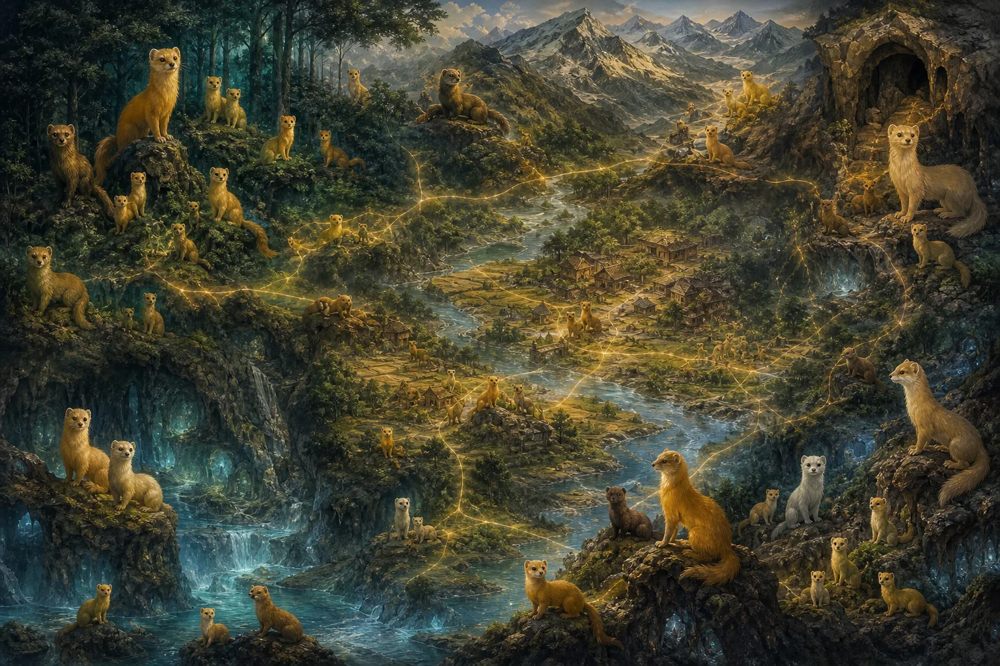

## 家族庞大而团结

黄仙的原型繁殖能力较强，因此黄家整体规模很大，内部也有许多分支。不过，它们基本上都以“黄”为姓，一些上方仙家同样姓黄。

在人间一些仙山及其对应的灵界、法界中，都有黄家的分支或分脉，例如：

- **太行山一脉**
- **祁连山一脉**
- **太白山、昆仑山一带**
- **青城山一脉**
- **五台山分脉**

如果身边接触到黄仙，也可以与它沟通，询问它来自哪座山、属于哪一支脉，这一点很有意思。

# 黄仙擅长的术法与能力

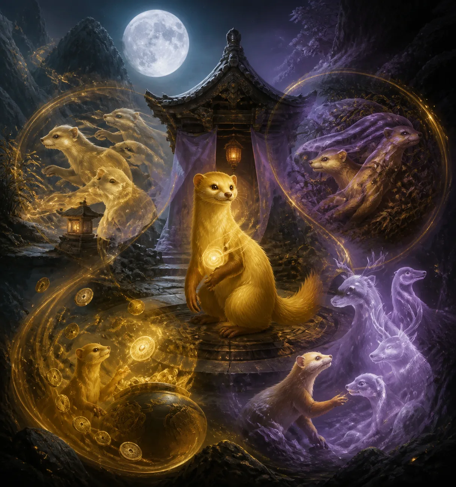

## 阵法、幻术与变化之术

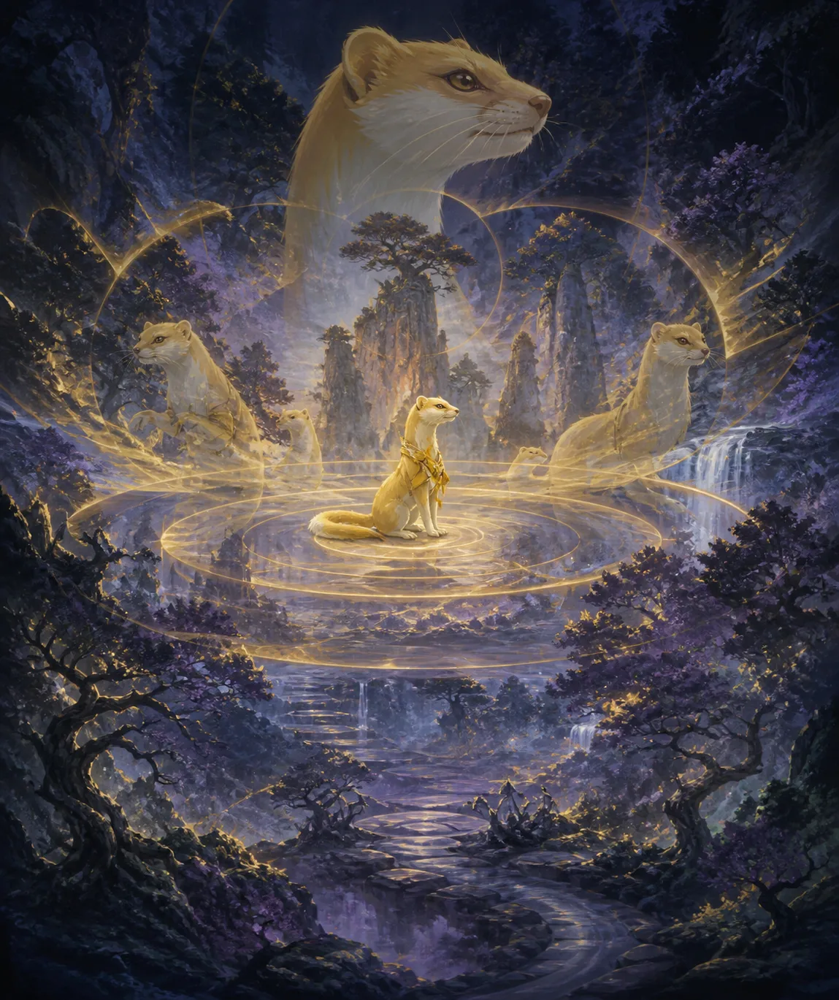

黄仙首先很擅长阵法，其中包括：

- 幻术
- 变化之术
- 迷魂阵
- 其他与迷惑、影像相关的术法

看过《火影忍者》的人，可能会觉得这个设定有些重叠。宇智波鼬擅长幻术，而黄仙本身也是“鼬”，算是一个很巧的梗。

一些年龄较小、修行大约一两百年的黄仙，可能会有些爱吹嘘。它与人聊天时，可能会声称自己是某位非常厉害的神仙。如果不了解它们的秉性，就容易信以为真，觉得自己身边跟着一位了不得的存在。久而久之，人可能变得非常“中二”，甚至有些魔怔。

黄仙的变化之术确实很厉害。它们可以让人看到某些影像、听到某些声音，甚至与人印象中的某位高位神仙一模一样，但这些也可能只是它们变化出来的。如果遇到与自己有仇的黄仙，对方也可能通过某些方法，让人的脑海里出现不好的内容。

## 招财与经商

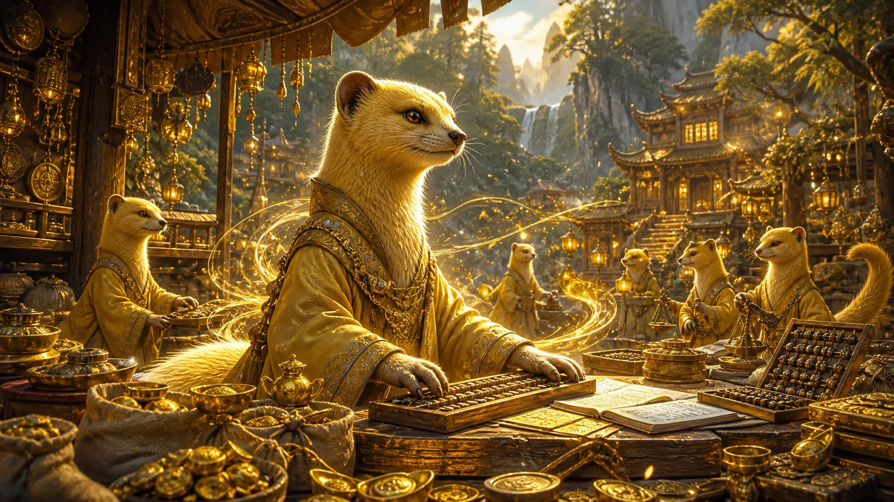

黄仙非常擅长**招财**。它们在法界乃至六道之中都有经商活动，而且黄家的经商模式往往是整个家族共同参与。黄家内部十分团结，基本不会出现明显的内斗，遇事讲究“一方有难，八方支援”，因此很适合经商。

再加上黄仙头脑聪明、反应快、脑子转得也快，在招财方面往往信手拈来。放在五大家族里，黄仙的招财能力可以说是最猛的。

## 占卜与人情世故

黄仙的占卜、看卦能力也比较强，往往比较灵。由于它们家族庞大、内部团结，人脉也非常广，很懂人情世故。

修行者若想在各个仙山、仙界或法界办事，也需要懂得打点关系。比如到不同的仙山时，可以供奉一些好吃、好玩的东西，再化一些宝给当地仙家。把各地的人脉关系建立起来之后，再去不同地方办事，就会方便很多。

# 黄仙的修行瓶颈

## 易通灵，却难以继续精进

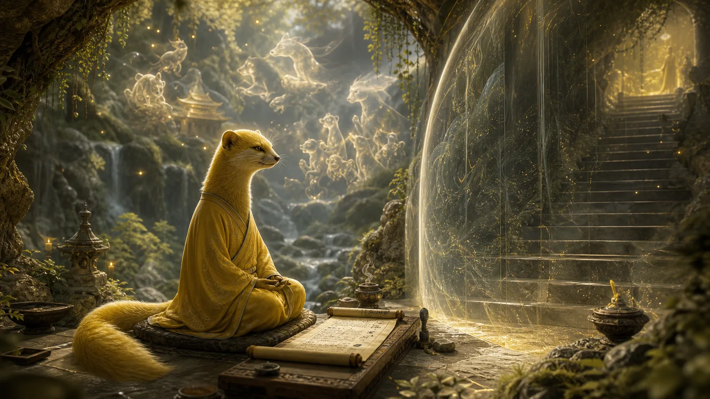

黄仙有一点常被忽略：它们虽然很容易通灵、化形，肉身也天生适合修行，但到了后期，想继续提升却非常困难。

根本原因仍然与肉身限制有关。黄仙自身的杂念比较多，很难克制肉身带来的想法与欲望。按照前面的“电量”比喻来说，杂念越多，耗电量就越大。因此，它们必须非常克制自己，才能继续修行。

如果无法约束自身，就很容易沉迷于吃喝玩乐，或者喜欢吹嘘自己，修为也会因此停滞。正因如此，真正修到上方的黄仙并不多见，甚至可以说很难遇到。

大部分黄仙仍属于以下两类：

- **地仙**：肉身还留在人间，以肉身状态继续修行。
- **鬼仙或九幽一类**：脱离原本肉身，以另一种状态存在。
