> 本页为「玄学与世界观」14 篇的合订本；原文章链接会自动跳转到本页。

## 玄学世界观：神仙、修炼、科技与天外文明如何共存

大家好，我是修炼者小烨。今天来聊一下大家比较关心的话题：**这个世界到底应该是什么样子？该怎么统合玄学观和科学观，又怎么统合神仙观和外星文明观？**

既然要聊世界观，那就得把时间和空间拉大一些，把古今和中外一起梳理，不要局限视野。从人类发展的时间顺序，我先把它分为：

1. **前古时期**
2. **上古时期**
3. **中古时期**
4. **近现代**

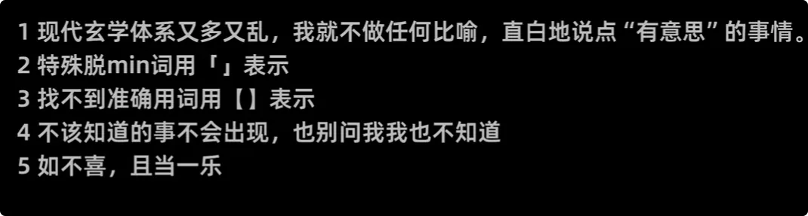

---

## 1. 前古时期：人神混居，人类是修炼者最后的“考核载体”

### 正神离开大地后，留下了什么

大神是这么说的：在文明之前，大地的能量还很充沛，神仙也是可以住在地上的，当时的人神可以混居。
后来发生了一些人类自找麻烦的事情，正神就不住地上了。
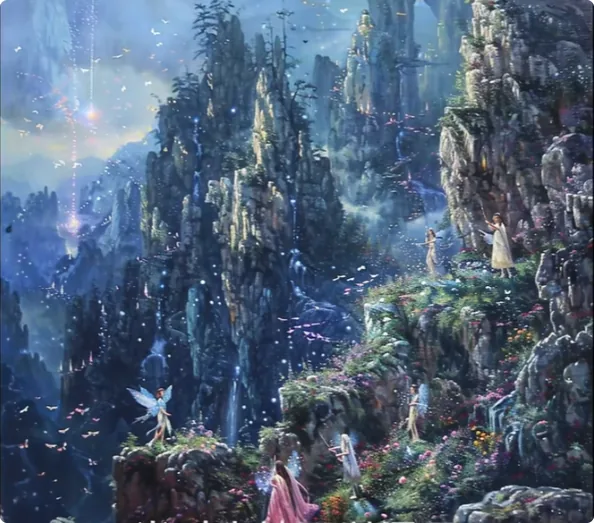

这里要理解一个能量概念：**正能量和负能量是守恒存在的。** 所以当大神陆续撤离地面的时候，很多负能量大佬也被陆续封印起来了。

留在地上的，大致包括：
- 还未修成的神；
- 以正能量修成的**精灵类**；
- 以负能量修成的**妖、魔、鬼、怪类**；
- 还有就是**人**。

### 为什么最后都要转世成人

至于人类这种存在，基本可以理解为一种**载体**。也就是无论你的元神是什么来历，最后飞升阶段都要转世成人，用人心和人类社会环境来考验个体的心性。如果考验通过，就可以飞升；考验不过，就继续重开。

为什么一定要通过人生来做最后的考验呢？

>因为无论是动植物修成的妖仙、亡魂修成的鬼仙、浊煞之气修成的魔仙和怪仙，还是在正能量附近修成的精灵
>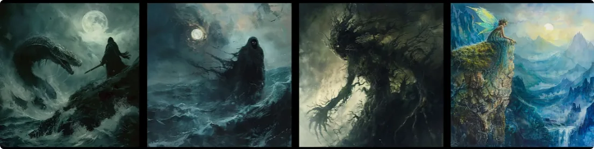
>

这些来历的元神通常心思都比较单一。一旦认定修炼，就会一直想办法去修炼。
但是，**神仙的世界不是混吃混喝的地方，修成者必须考虑更多、更广的事情。**

### 人类这套感官系统，是一套“低配版的新系统”

神明又不可能直接把上层世界的感官系统白送给这些修炼的众生，所以人类这种作为中间过渡的载体，出现了人类感官系统，相当于**低配版的新系统**。古代常提到创造“半神”，就是指这件事情。

成为人后，个体的心思就会多起来。这套系统有利有弊，全凭个人怎么选择。

> _**成佛成魔，只在一瞬。**_

很多修为很牛的大佬转世成人，都栽进去了。所以修行中的“修行”，其实就是个体如何把握人类这套复杂的新系统，能不能稳住一开始的本心。

很多前世修得不错的他类众生，第一次转世到人身上，就显得特别缺心眼。尤其是很多修得不错的个体，品性还很善良，容易被凡人亲朋好友当“傻白甜”来看。

但其实是好事。因为从凡人身上诞生的元神，基本是很难入道的。纯凡人会觉得人的感官很哇塞：“好好体验生活不好吗？干嘛去修炼？”
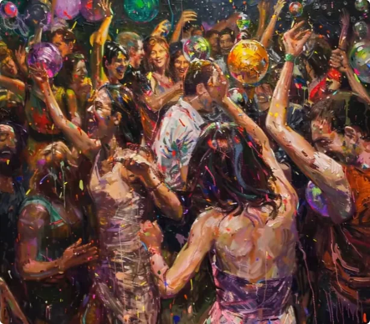

这也是为什么小烨总强调一句话：

> **“凡人一个，关我屁事。”**

很多凡人元神转了很多世以后，终于想修行了，但也只是跑去念念经书。因为没办法，他们生生世世都没有过“**修炼要靠实实在在的能量**”这种经历，所以没有“唤醒”一说。
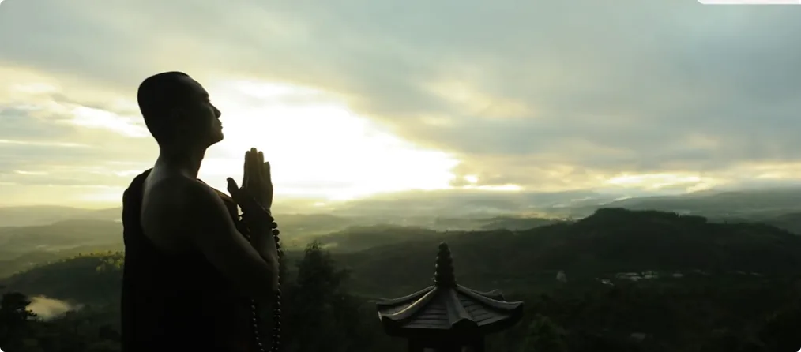

至于再宏大的事情，小烨也不知道。

---

## 2. 上古时期：从自然神信仰，到祭司与“大佬”争夺人间话语权

### 最早的信仰体系，其实都指向自然神灵

在文明刚诞生的时候，世界各地的信仰还是以自然神灵为主。

可以看出，上古时期的人对神灵认知的体系基本是一致的，只不过在不同地区产生了不同的叫法，但好些神明其实都是同一位。

所以神仙不用分什么东方、西方，**大神之间是很熟的，甚至跟地上这些修炼的大佬都熟，只是跟凡人不熟而已。**

### 神职是如何慢慢被各种“大佬”占据的

这个阶段，最开始担任神职的都是一些**大祭司**，负责传递一些信息。但后来这些职位慢慢就被各种大佬夺取了。

因为能量有正就有邪，修炼的个体也是如此。负能量众生也是要修炼才能存活下去的。

对于负能量众生来说，人身上的凡尘能量是不错的修炼资源。越多人信仰他、依赖他，他收到的能量就越多，自己修得也越快。
所以从那个时候开始，手腕越强的大佬，越要抢占凡人的**话事者**，让凡人给自己打工。

那话事者又有什么好处呢？
首先就是能借用大佬的功能，所谓预测、巫术之类的。大佬越强，功能越强；办事越多，带来的信徒也越多，话事者的地位也就越高。

至于地位这种东西，是凡人的最爱。

> **神权并行，本质就是两边一拍即合。**

这个阶段，人们已经慢慢开始不相信自然神了，转去信奉一些大佬。包括后面很多“创造新神”的事情，这些都是祭司和大佬在拓展自己的影响力。

### 为什么蛇、狐一类的崇拜特别多

像蛇、狐这一类崇拜得多，其实是因为这两类生灵自古就比较容易步入修炼，所以出现大佬的频率很高。

不仅如此，很多大佬能力确实很强，修了千万年的大佬不在少数。

小烨上个月去过某个公园，那里的那位大佬灵压，把我的脸都可以压麻。但是很多凡人还在那里拼命跪拜、求保佑。
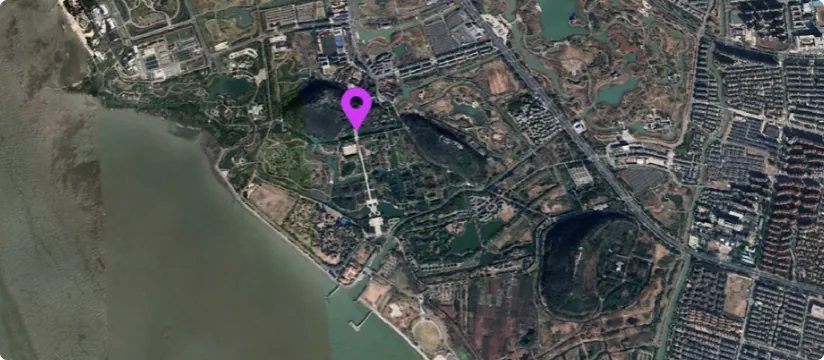

别问为什么神职乱了，大神不管管。
**那都是人类自己的选择。**

人欲淹没了最开始的本性，管又有什么意义呢？

---

## 3. 仙人为什么开始传道：真正的修炼机会，从来不是无限开放

### 仙人传下来的，一部分是玄学知识，一部分是修炼方法

虽然大神不爱管人间事，但终究还是愿意给修炼的众生一个机会。

所以在这个时期出现了一些仙人：
1. **教大家如何用玄学知识建立生活；**
2. **教大家如何修炼。**  

之后零零散散有人传道、有人修成，这给了很多愿意修炼的众生一些念想。
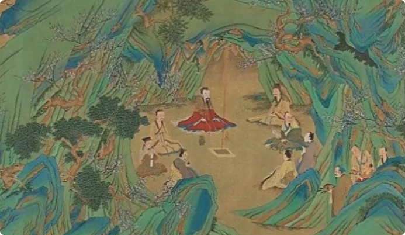

为什么说只是念想，而不是直接给机会，让全部修行的众生修成呢？
有两个原因。

### 第一个原因：修行资源本身就是有限开放的

刚才提到，修炼的个体先要转世成人，先学会适应一套复杂的新系统。
好比先学会开一台教练车。
可是学会之后，你还需要有一台自己的车。不然你学会开教练车，又有什么意义呢？
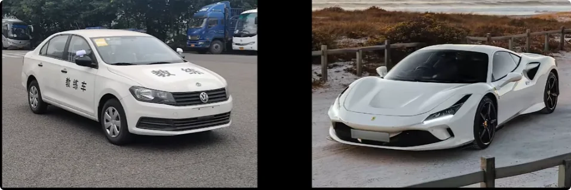

所以修行中的**修命**，指的就是你还要修成自己的身体。这副身体里配备有神仙级别的认知系统，这样等你对人类认知系统有良好控制力的时候，时机一到，你就可以进入新的身体里飞升了。

可问题就在这：

> **修成身体所需的能量来源，也就是纯正能量，是有限的。**

凭什么给你？
或者，凭什么给他呢？
大家可以好好想想“**凭什么**”这三个字。

### 第二个原因：大神信不过凡人的人性

另外，关于如何造出一副神体，每个时代的方法都不一样。
规则由大神出，每个时代都有专人来指点，这样方法就不至于落入不修行的小人之手。
这就是要说的第二个原因：

> **大神信不过凡人的人性。**

刚才提到，玄学话事者的身份越高，越容易被大佬找上门。糖衣炮弹之下，基本没有不沦陷的。

大家可以想象一下，如果真正的修行方法就这么直直白白地公布于众，那么它真的会完好无缺地被每个真心修炼的人学到吗？

**不会的。**

---

## 4. 中古时期：玄学为什么越来越复杂，也越来越容易走偏

### 经书、咒语、阵法，最后可能变成了“大佬通讯手册”

其实根本不用想象，中古离现代已经3000年了，人是什么样子，大家都清楚。

自仙人开创道法理论以来，各种各样的大师顶着名号，借着各类神明的名义，建立各种歪门邪道，各自为营。嘴上多么尊重道法，其实都跟大佬搅在一块儿。

佛陀说过，末法时代到处都是披着袈裟的魔，指的就是这件事情。
1. 甭管什么经书、咒语、阵法，本质上是在完善一本**花样召唤大佬的通讯手册**。
2. 甭管这些头部大师多么能显本事，本质还是在借用大佬的功能，给大佬打工，帮大佬拉人头。

当然，他们自己是不知道的。

因为当他们求神像或者向内求的时候，大佬回应他了、帮他忙了，他便会以为是自己招来**正神**了，反而会虔诚得不得了。

### 为什么有些传承“每一代都有功能”

这类传承下来的人，很多每一代都有功能，比如什么内观、斗法。

前一任会在大佬的介绍下选好下一任，而且这个人一定是聪明的，刚刚好念经念得特别好，特别能和大佬深度绑定，甚至可以借用大佬的功能拓展影响力。

同时，这类人也高产“龙傲天”。

>因为资质好，又从小被选中，还开了功能，所以个个内心都觉得自己是**天选之人**。

说白了，就是这类人的修为根底其实很差。

小烨告诉你，他们都是什么来历：
他们大多数前世是有点修为的小妖、小魔，而且是阴气比较重的那种。
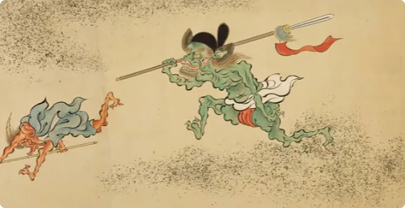

这种来历的一转世，就容易招来同类相食，被同类利用。再者，本身就缺乏仙缘，阴性众生下手会更不留情面。

所以这些看似功能厉害的人，其实只是：

> **和同类同频快。**

这些人的悟性其实都不高，都不是真正的修行人。

---

## 5. 真正有机缘的修行人：为什么反而经常在玄学路上处处受挫

### 真正有根底的人，往往天然排斥歪门邪道

那什么是真正有机缘的修行人呢？

真正的修行人，首先前世修为根底要好。在玄学这条路上，他会一直受挫。

他们大多数会凭借前世积累的、真正修炼的感觉，打心底里排斥那些歪门邪道，或者再怎么也学不进去。

比如：
- 对经书真的读不进去；
- 又无法彻底放下修炼的原始动机；
- 一辈子都想找到真正的出路。

**这样的人才大概率不会被人性贪欲所困，才有机会遇到真正修炼的方法。**

所以中古时期零零散散修成的人，基本都是**一对一、口传心授**。
谁品性不错，才会出现专门的引渡人去度谁。
根本没有必要把方法公布于众，因为这个时期有缘人其实没这么多，转世成人的修炼者也没这么多。
在过去2000年里，真正允许飞升的才不足百人。

但从全球范围看，这些得道者基本都在东方，因为东方离某处仙山(昆仑山)更近。

这也是为什么东方兴起修仙热潮，而其他地方还在被各种大佬控制得死死的。
哪怕是在万物互联的今天，转世在东方的修行人，都有更高的几率接触到真正的修行。

---

## 6. 近现代：为什么玄学退场之后，科技知识反而开始快速爆发

### 知识，本就是从高层级向低层级流动

随着知识权限的放开，人类学到了更多超越以往的知识，很多科技的发展速度都堪比神迹。
其实不用怀疑：

> **知识就是由高层级流向低层级的。**

还记得小烨常说的“能量守恒、付出和收获对等”这个概念吗？
从这个概念，你可以理解很多事情。

比如为什么科技现在在西方迸发，是因为那边先出现过大量的**代偿**。
那段时间，西方教会里的大佬们可谓是吃得饱饱的。

再然后根据能量守恒，**否极泰来**，大量的上层知识才在不破坏守恒的情况下，涌入那些天才的脑子里。

大佬这期间也很识相，很自然而然地退出了注定要陨落的教会。
但是大佬又不会真正消失得无影无踪。

**大佬还是要吃饭的嘛。**

### 从宗教体系退出以后，“大佬”又进入了新的组织

所以后来出现了各种秘密结社。
凡是心术不正的能人，大佬都可以帮他建立新的教义。
这些秘密结社后来变成什么呢？

一种是玩小圈子，比如**世越号**；一种是玩大圈子，比如**新纪元学说**。
反正只要大佬显点本事，总会吸引到狂热的拥趸。
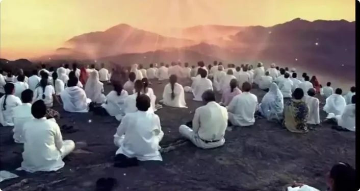

别问为什么科技迸发没出现在东方。
**都是东方人自己的选择，自己的果要自己吃。**

---

## 7. 当下这个窗口期：真正的修行机会增加，假的道路也会同时泛滥

### “大升维”背后真正代表的是什么

我们继续说。

收获了这么多知识，那人类是不是应该付出点什么？
其实关于这一点，全球背后的灵界大佬都知道。
你们去看那些杂七杂八的神秘学学说，无论是东方还是西方，这些理论背后真正的始作俑者，也就是大佬们，他们基本都在旁敲侧击地告诉凡人：

> **要做好选择。**

比如什么“迎接大升维”这种听起来很可笑的事情。

但具体人类要付出什么，连修千万年的大佬都不会直白地说出来，那小烨自然也是不清楚的。
小烨只知道：

> **“大升维”真正的意思，是能真正修行的窗口期出现了，得抓住天时地利。**

所以这几十年间，有相当多修为不错的众生转世成人了。
这些人会对修行非常感兴趣。
但千万不要以为这些大佬出来发声、提醒大家修行，他们就是大好人。

其实是因为**身体的名额增多了，那大佬的名额也要增多，才能维持能量守恒。**
一边开放了，另一边也得放开。

### 为什么现在的“修行”越来越强调光与爱

所以为什么现在市面上的修行，都充斥着“光与爱”“真善美”“修心就可以修成正果”？
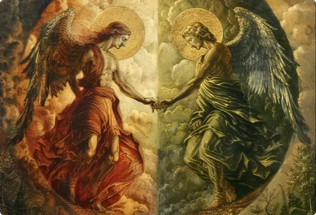

那是因为大佬抓住了凡人**想不劳而获**的痛点，哄着这群假的修行人给自己上供。
凡修为根底欠缺的、抓不住机会的，都会成为大佬的盘中餐，半路夭折。

只有真正修为根底好的、能排除万难的、最终能抓住机会的，才是真正的**有缘人**。
同样，现在很多小妖、小魔也在忙着吃人，想趁这个机会好好升级。

所以你可以看到：
- 越来越疯狂的人；
- 越来越简化的泛修行；
- 灵界背后都在大狂欢。

不仅如此，很多上古封印的大佬也被放出来了。

> **不该去的地方不要去。**

算是给粉丝朋友的一些福利建议。

### 一千个人去“修行”，真正找到路的可能只有两三个

在未来，假如有1000个人跑去修行，那大概只有两三个人才能找到真路，大部分都将成为大佬的菜。

别问为什么不阻止。

> **那都是个人不能明辨，自食其果罢了。**

比如看我视频的人，听得倒是挺起劲的，行动的倒没见几个，还有不少要来骂我两句。

---

## 8. 神仙与外星文明并不冲突：玄学和科学本就是不同层级的知识投影

### 为什么很多人无法把“神仙”和“天外来客”缝合到一起

这个部分单独拿出来讲。

很多人难以缝合**神仙和天外来客**这两个概念，是因为古典神灵形象太深入人心了，导致大家觉得神灵都是穿着古装出现的。

其实上古大神和大佬都是高维的。
只不过虽然都在“天上”，但是：

> **此天非彼天。**

他们不在一个层面。
不是说神仙就跟科学没有任何关系。

相反：

> _**先有上层社会的知识体系，才有传给下层的玄学和科学体系。**_

他们根本不需要迎合凡人展示什么。
科技大神拥有一挥手就能解决低维度大部分事情的神通，真的没有必要再秀肌肉了。

况且，都到了那种感知级别的存在，他们的知识体系，又岂是人类这种感知级别能够理解的？
所以如果天上真有什么 UFO，也不知道是哪个维度的大佬出来捉弄人呢。

反正据我观察：

> **大神是不屑于把车子开出来秀肌肉的。**

## 关于玄学的思考:入世与出世

## 观前提示

大家好，我是山吒，欢迎来到我的宇宙。上期我们讲了关于**入世**的话题，这一期来聊关于**出世**的话题，再下一期会和大家探讨生命的意义。这三期表面上没有任何关系，但在内核上却有着很深联系，所以我称为“世界真相三部曲”。

开始之前，友情提示一下：
如果你不是这种人，现在就可以退出，要不对我们双方来说都是一种折磨。同时本期和上期一样，牵扯的敏感话题较多，所以有的地方我会说得比较隐晦，对于某些理解能力有问题的人来说会更加痛苦。以上是观前提示，请反复观看三遍。

废话不多说，直接进入主题。

## 一、从好奇到唯物，再到动摇

一直以来，超自然现象都是开启人类好奇心的最强密码。我小学的时候看过一本书，《世界未解之谜》，现在回想起来，我早已忘记这本书的来源，但对于书上所描绘的各种超自然现象，直到今天我都记忆犹新。不知道正在观看视频的各位有没有相同经历。

也是在同一时期，因为我爸是一个佛教徒，经常会给我看一些佛教小故事，包括书籍视频等等。那时我对于这些东西，都是抱着一种神话故事的态度去看待，即使不怎么科学，但确实也比课本上的内容有意思多了。
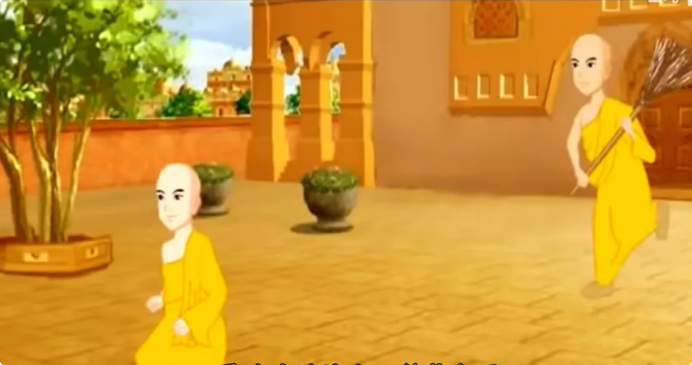

所以这本书和我爸算是点燃我这方面兴趣的两个启蒙老师。很多年都没有再关注过这方面的信息，除了偶尔朋友之间会聊聊发生在各自身上的一些灵异事件。

到了2014、2015年，那时候《逻辑思维》大火。我也通过节目入坑了一本书，尤瓦尔·赫拉利的《人类简史》。读完这本书后，我突然恍然大悟：
***原来这些所谓的神神鬼鬼都是人类的谎言。***

这本书不仅解开了我小时候的疑惑，更让我成为了一名坚定的唯物主义者。从此谁再聊超自然的事情，我都会用《人类简史》里的理论去反驳他。

就这样时间到了2020年，又一个颠覆我认知的人出现了，他就是 **YouTube 中文频道涨粉最快的男人老高**。

刚开始看老高视频的时候，也是抱着小时候那种心态去看，但是看了3年之后，发现这些都市传说的背后都有着千丝万缕的联系。

当然也有人喷老高逻辑不严谨，这里我想替老高说句话：
你想要严谨看什么自媒体啊？你去看书啊，看资料啊，你去听老教授讲课啊，你听得进去吗？自媒体最重要的就是有趣，如果你对这个东西感兴趣，可以自己去研究。有人说媒体也要严谨啊，你看严不严谨嘛。

我相信讲到这儿又有人要喷我：你就是宣传自媒体可以弄虚作假，你就是在给这些坏人洗白。所以我让你别进来看嘛，去给他俩耳光，让他以后长长记性。

言归正传，相信经常看的朋友都会和我一样有一个疑问：
这些事到底是不是真的？
人到底有没有超能力？
死后到底有没有灵魂？

那接下来就和大家科学地探讨一下这几个问题。关于人到底有没有超能力，这个问题从古到今都有记录，我今天就不从古时开始讲了，直接切入重点。

## 二、官方研究脉络：从星门计划到507所

从近些年 CIA 的解密资料来看，人类开始科学研究这个事儿，是从1979年美国的**星门计划**开始的。

同年，咱们中国四川大足县一个5年级的小学生**唐雨**可以用耳朵认字，这件事在本地报纸刊登后，全国媒体都跑到了四川，对他进行了采访。

随后一票专家对唐雨进行了测试，最后发现唐雨是在弄虚作假，提出了批评。但是上海《自然杂志》却是不同态度，《自然杂志》发表了系列文章，阐述了耳朵识字的可能性。1980年2月，唐雨还登上了《自然杂志》的封面。

也是这一年，中国对人体特异功能的专业研究开始了: 

1. 1968年成立的国防科工委航天医学工程研究所，也被称为**中国人民解放军第507研究所**，最开始是研究航天医学，包括对航天员的选拔、训练、培养，隶属于钱学森任院长的中国空间技术研究院。

2. 到了80年代，由于经费问题，507所屡次被列入裁撤名单。当时钱学森坚决反对，他认为从长远来看，载人航天肯定是未来的重要研究方向。在钱老的坚持下，国防科委同意保留507所，但要缩减编制，研究人员被缩减到了几百人。

3. 到了86年，国防科委再次提出裁撤507所，理由是目前载人航天任务暂缓，但钱老再一次反驳道：人员经费可以减，但机构不能撤，至于留下来做什么，他会亲自安排。从此507所的研究方向也转向了人体科学，也就是我们所说的特异功能。从钱老带头开始，越来越多的教授专家也开始进入到了这个领域。

4. 中国80年代气功热的源头，就是国家站台、大V背书，所以在那个时期涌现出了一堆骗子，最后和传销一样被全面封杀，从此转向了地下研究。本来我想像《PUA历史》那期一样，做一期节目来讲解一下那段时期的历史，但是已经有人这么做了。如果大家感兴趣，可以自己去看一下到底是怎么回事，来龙去脉讲得非常清楚。
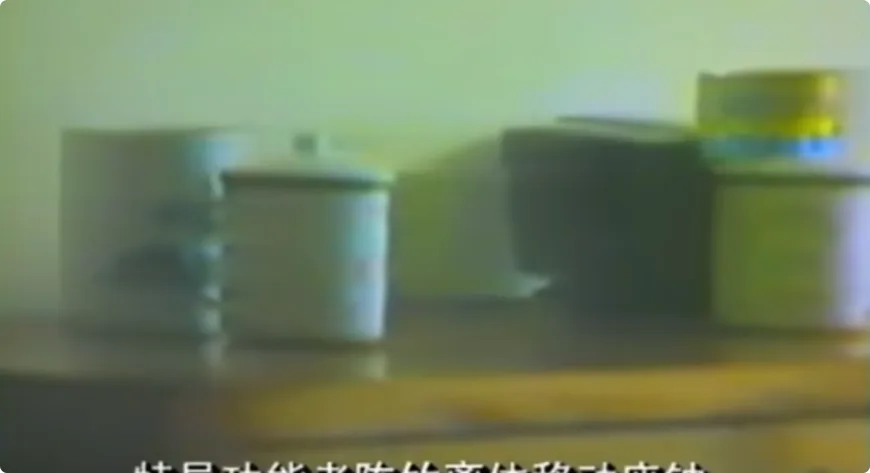

## 三、钱学森与帕森斯：特异功能研究的隐秘渊源

网上有些言论说，钱老研究特异功能是因为年纪大了，脑袋糊涂了，还有一些说是为了给政治服务。其实钱老研究特异功能是有渊源的。

早在他回国之前，还在美国上学的时候，他的同学、加州理工学院火箭自杀小组的成员、自学成才的燃料专家**杰克·帕森斯**，就是研究黑魔法的。
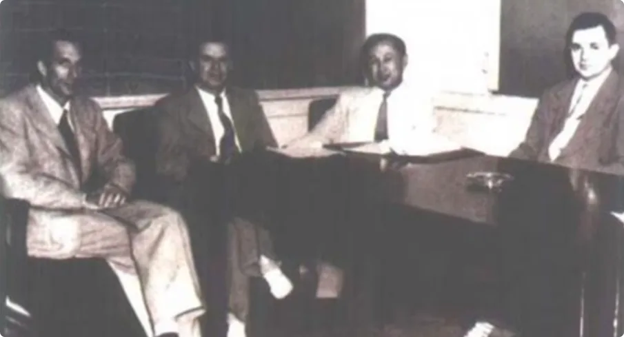

这个人很有意思，简单来说就是有钱版的曼森。

他自己说，他研究火箭燃料的灵感，来源于古代炼金术中的希腊火。人类火箭第一次进入太空是在1957年，他们30年代就在造火箭，对于当时的人来说还是一件很科幻的事情。

当然帕森斯也有很多黑料，其中最大的就是他通过宗教的方式在搞女人。

但我觉得这个说法是不成立的：
帕森斯从小就是一个富二代，后来造火箭还是军方在给他投资，又是青年科学家，长得又帅，这样的人缺女人吗？需要通过这么复杂的方式来搞女人吗？我相信一个满脑子只会想着搞女人的男人，也造不出火箭。

他研究黑魔法的方式比较邪恶，这里就不细说了，但是目的是为了打开时空隧道，后来据说是打开了。
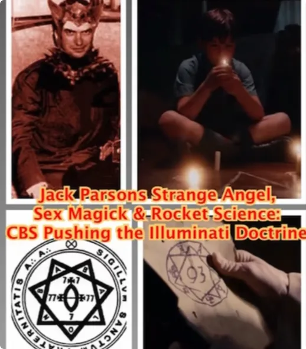

就在他38岁的时候，家中发生了爆炸。美国政府说是因为他在家中研究燃料发生了意外，但他妻子却说是美国政府把他暗杀了，因为帕森斯平常是一个非常严谨的人，更不会在家里做实验。

帕森斯1952年6月17日去世，7月12日到29日期间，连续几晚有不明飞行物飞过白宫，他的妻子坚信他打开了时空之门。

帕森斯认为，意念也就是我们上期节目所说的，
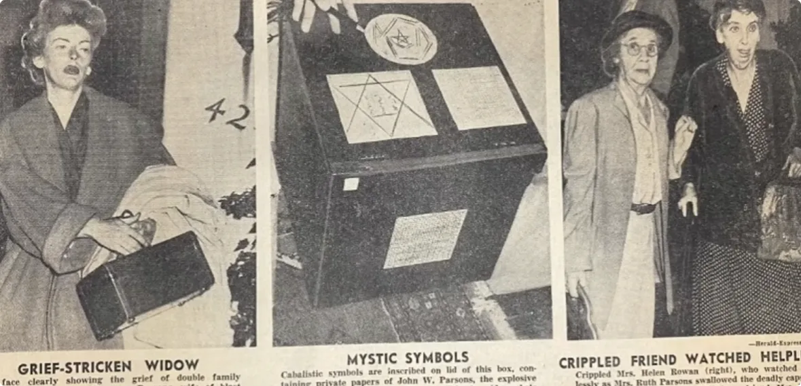

**想象力是人类命运、内心信仰的集合，意念力是无处不在的，与量子物理是相通的**。

钱学森在其著作《论人体科学与现代科技》中也说到，特异功能和气功的本质原理，就是人类运用意念力对人体或是其他物体进行控制。

当气功练到高级阶段的时候，发功者就可以运用意念力传递消息，或是改变物体的物理形态，这种意念力甚至可以突破时间和空间的限制，可以和量子力学平行研究，是未来人类科学的发展方向。

## 四、关键研究者与实验案例

说了这么多，有没有点实际案例呢？

>有的，这就来了。从钱老带头研究开始，也有很多来自各地的科学家加入了进来。接下来就介绍几个有一定研究成果的。

### 1. 李嗣涔：手指识字与脑场

台湾大学校长**李嗣涔**教授的手指识字实验，相信经常关注这方面的朋友一定听过他的故事。为了照顾还不了解的朋友，这里我简单说一下他的研究过程和成果。

李嗣涔毕业于美国斯坦福大学电机系，1980年取得博士学位，是台湾半导体方面的专家。

李校长当时看到儿童手指识字的新闻后，第一时间展开了研究，后来发现不止唐雨可以，当地有很多小孩都可以做到，于是他自己训练了一批，训练的方式就是静坐冥想。后来又发现不止手指识字，耳朵、鼻子各种都可以识字。

再后来发现根本就不是用这些器官去感应的，而是一种超感官、超视觉。这种能力，6~14岁的小孩经过后天训练，成功率在六七十%左右。这里不禁让我想起了《龙珠》里只有单纯的人才能坐上筋斗云的设定。

在他的实验过程中，有一批科学家前来踢馆，借此来验证他实验的真实性。在这次实验中，让这些小孩在脑袋上接上电线，随时监控他们脑波的变化，然后让他们看的字，也是由这些踢馆的科学家来写。

为了验证真实性，还把让小孩看的字故意写得更复杂，或是画成更复杂的图形让他们辨认。最后一个叫**高桥舞**的日本小女孩辨认率最高，达到70%。
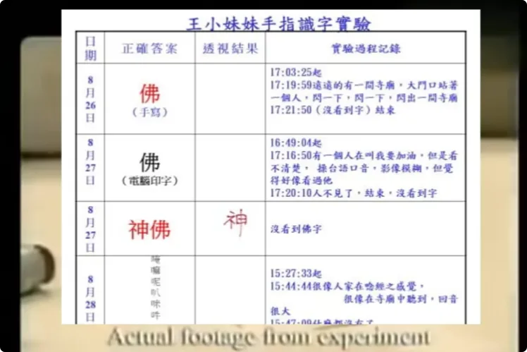

也是在这次实验中，专家为了为难这些小孩，在写有很多复杂汉字的纸条中加入了不少宗教性的字眼，比如佛、耶稣这类。每当出现这些字的时候，小孩都表示看不到，直到灵能最高的高桥舞看到了一束光。

就这样在这次意外中，他们发现了另一个我们用肉眼和仪器无法观测的世界，李嗣涔教授称之为**脑场**。

我们在这个宇宙中的其他生物和更高维的生命体，都是通过脑场来交流的。

脑场中的时间是超越光速的，脑场就像一个搜索引擎，这些宗教性的字眼就是一个网址，用天眼一看就可以进入到这个网址里面。

这些小孩手指识字，其实也是通过天眼去看。那天眼在哪儿呢？其实就在我们左右脑的中间，一个叫做**松果体**的腺体。

百度百科和维基百科对松果体的解释是，调节人体生物钟、分泌褪黑素，和天眼以及超感官无关。但李嗣涔教授说，为什么小孩有超感官，大人没有？

>因为松果体就是禁锢灵魂的地方，灵魂是非常活跃的，如果没有松果体，灵魂很容易就跑了。随着人年龄的增长，松果体慢慢钙化，越长越牢固，如果没有经过长期的训练，人就很难再开启超感官了。

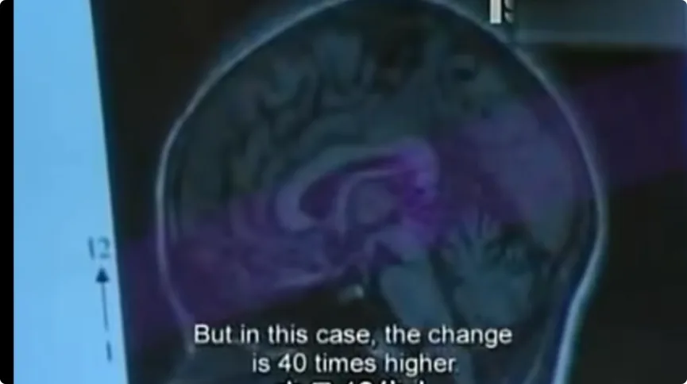

除了李嗣涔教授，还有一个人也说过类似的话，他就是著名的大哲学家、数学家、解剖学家**笛卡尔**。

他在最后一本著作《论灵魂的激情》中，对松果体有大量的提及。这种哲学书籍非常深奥，我尽量用通俗的语言给大家翻译一下：

>在大脑中有一个小腺体，灵魂在那里，要比在其他部位更特别地发挥着它的作用。他还说过，我唯一可以确定的事情就是我自己思想的存在，因为当我在怀疑其他时，我无法怀疑我思想的本身。笛卡尔这句话的中心思想就是“我思故我在”。

其实除了笛卡尔，东西方在宗教上都有对松果体的崇拜。

西方就不说了，在佛教中，我一直以为佛祖头上的是包，后面了解才知道全是松果体智慧的象征。除了佛祖，大家也会发现很多东西方的先人神，眉心处都会有一个红点，其实就是指向松果体的位置。
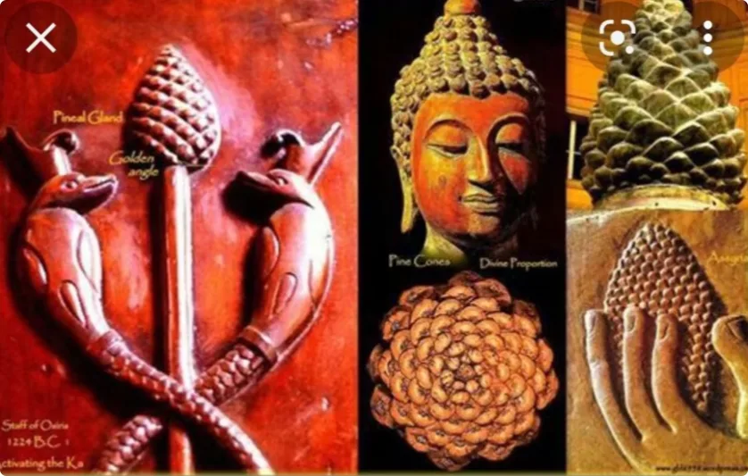

### 2. 朱念麟：虚数空间与意念摄影

还有一位大牛，对人体特异功能有着更全面的研究，他就是云南大学物理系的**朱念麟**教授，已经在这个领域研究了30多年。

据李嗣涔教授说，他90年作为一个新人，到潭柘寺参加特异功能研讨会时，朱念麟教授当时在业内已经很有名气了，他手下的功能人能力更为强大。

刚刚提到的和李校长做实验、灵能最强的高桥舞，80年代作为日本天才儿童代表团来云大，和朱教授手下的孩子们做交流的时候，她的灵魂和云南的孩子相比，还显得非常平庸。这个世界有一个纪录片，大家感兴趣可以去塔哥的频道了解一下。

我把朱教授的一些研究成果看完后，发现他所创立的这套公式体系，可以完美地解释出很多特异功能现象背后的原理和机制。

简单来说就是为什么用念力可以把勺子掰弯，从科学上来说是怎样的一个交互过程；为什么有人算命就能算得这么准，他是用数学的方式算命，还是某种心电感应；如果是心电感应又是怎样一个感应法。

我这个人就喜欢刨根问底，比如说养小鬼，我就想知道怎么养，怎么和他沟通，怎么让他帮你做事，是突然变出来，还是通过某些干预让你间接获得。别急，对于这些朱教授都有解释。

朱教授通过研究这些功能人士发现，我们这个三维世界之外，还有一个他称之为**虚数空间**的世界。这个空间是重叠的，就像太极图的阴阳交错一样，中间的两个洞就是两个空间之间的时空隧道。

通过意识来连接。对于两个空间之间的关系，你也可以用正负数来理解，两个空间处于一种纠缠态，开了天眼的人才能看见虚数空间的存在，和李教授所说的脑场是一个意思。

虚数空间与我们所处的实数空间时间是不一样的，要比我们所处的空间更快。至于快多少，目前还没有一个具体的数据，不同的功能人虽然都能到那个空间去，但是感受到的时间还是有差别的。

但是这个就解释了超能力算命的原理。算命分两种，一种是**数学算命**，一种是**超能力算命**。

什么叫数学算命？

比如说拿算卦来说，算命师在算卦之前，都要让你摇签或者摇铜钱等等，反复摇过几次后，他们根据今天的天象环境、你所问的问题、你的状态，通过他们那一套公式，最后推出一个卦象，最后根据算命师的人生阅历进行主观的解读。

### 3. 孙储琳：金箔刻字与熟虾复活

朱教授把特异功能主要分为了几大类，如下所示：

1. **物理类**：念力拨动钟表指针、玻璃软化。像李嗣涔教授和异能榜排名第二的**孙储琳**做的半导体金箔刻字实验也属于物理类。她在硅片上做了几十片金箔，金箔的大小是十微米，我们的头发大概是60~80微米，相当于头发大小的1/8，这个金箔得在显微镜下才能看得见。孙储琳就是在这么小的金箔上用念力写字，所以这个实验是很难作假的，应该是物理类中比较有名的一个实验。

2. **化学类**：用念力只让火柴盒中的一根火柴燃烧、水的紫外线吸收系数改变、酒精变水、水变酒精。说到这，我想起了我高中时候发生的一件事：某天放学回家，我在一个天桥上遇到卖盗版书的小贩，我当时溜了一眼，看到一本书叫《中功秘法》。我就研究了一下书上的内容，就是教你怎么修炼超能力的，什么手指变长、酒精变水这些。有一次我在班里看，被我们班主任发现。他跟我说这个是邪教书籍，我要是真感兴趣，让我去研究一下507所。因为当时学业繁重，也没有再去研究了。

   直到最近我和一个很好的朋友说，我要做这期内容，他突然和我说，他想到了一件事：他早年间和现在的新晋四大天王之一的**姜云升**在一起玩的时候，姜云升就当众表演了他的超能力。他说你信不信，我可以把你手里的烟变成草莓味。他当时就说不信，然后姜云升拿过来用手摸了一下，再递给他，真就变成草莓味了。然后又跟他说，你信不信，我还能给你再变回来。果然又是一样的手法，味道又变回来了。当时大家都以为是魔术。他还跟我说，有一次他们去参加 battle 比赛，姜云升和他说，我算了一下，这场比赛我会得亚军，你第二轮就会被淘汰出局。这和他在《说唱新世代》里把黄子韬耍蒙的路数一模一样。熟悉他的人都知道他们家是道氏家族。我看了武汉大学宫哲兵教授对于道教的研究，确实有这样的技术，所以这个事情还是有点悬的。

3. **生物类**：种子快速发芽、快速开花、油炸花生米返生再发芽。其中最神奇的一个是，我在孙储琳女士的专访中看到的，她可以把煮熟变红的虾通过念力重新变绿，并且动起来。她的这个操作原理，就是她能看到虾即将入锅的时候，灵魂就跑出来了，就在桌子的周围，她用手把灵魂又拽到熟虾身上，虾又活了。

4. **信息类**：比如李嗣涔教授他们做的脑场实验。高桥舞要进入到佛的世界，她自己进不去，要脑场里的一个灵体，也就是她在那个空间里的老师带她才能进去。但是后来李教授和孙储琳做实验的时候发现，她不需要老师，自己就可以进入到各个神的世界中去。

除了以上这些，还有像远程治疗、远程整形、一分钟之内断骨重接等实验。关于远程治疗，朱教授说了一个案例：

>一个在昆明的初中生远程发功，帮助一个在武汉的脑梗患者起死回生的实验。还有远程整形：一个患者的鼻骨凹陷，功能人远程发功，患者坐在家中，感觉凹陷处被电了一下，再摸已经好了，非常神奇。

为了探索虚数空间的更多秘密，朱教授发现虚数空间里还有很多的书籍资料，有的是我们人类遗失的，有的根本就不存在于我们人类世界。

为了搬运这些资料，朱教授就让这些小功能人抄书，但是至今也没抄几本，因为这些学生的作业实在是太多了。

所以朱教授感叹道: 
国家应该大力研究如何把虚数空间的能量转化到我们这个世界来，这可比可控核聚变的作用大多了。就像李嗣涔教授通过脑场和天鹅座的外星人沟通后才了解到，他们都是瞬间可及。因为虚数空间里的所有物质都是靠想象，面包进入虚数空间里面，想一下，再通过设备转化过来。

还有一个很神奇的实验：**意念摄影**: 

>把虚数空间的图像投射到我们这个世界来。刚说了，每一个实体空间的物体，都会和虚数空间里有一个对应，操作原理就是让功能人用虚数空间里的手机拍一张照片，因为两个手机之间处于纠缠态，也就是量子纠缠状态，实体空间的手机相册里就会多出一张照片。

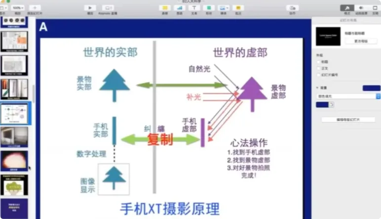

大家可以看一下朱教授他们意念摄影所拍的照片。朱教授说：

> 在路上，我们就一路拍照，其中有个孩子技术比较好，就照了四张。这件事很有意思，有意思在什么地方呢？影像当是很清晰的，因为长的不清晰，怎么不经历拍什么东西呢？这些东西都是我们没有见过的星系。这边有个东西是很清晰的，看这个上面本来应该很清晰嘛，看着就是个八字，当时就是文物古流的。想利用这个现象，我们就让一个刚刚学会的孩子，还在10km、12km，他的家里还有我们实验室，在沙发和这个电视机啊。另外呢，这个是什么照片？颜色非常鲜艳，图像很简单，但是里面很多很多细节，老黑呢把白色的颗颗粒再往外飞。那么这个时候说的照片呢是追踪流星，就是我们的一个小朋友，他正要想拍什么的时候，在虚数时间看见一个流星，他就追上了流星，把它拍成一个特写的镜头，就是心智利用这个特色。因为流星在飞追都追不上的，但是意念可以追上，你就拍了这么一个照片。所有的这些就告诉了我们，这个理论是成功的。

人类不像蜜蜂蚂蚁一样有兵蚁、工蚁、蜂后等等分工，生来生理结构就不同，从生下来开始，一生命运就注定了。

人和人之间在生理结构上没有着明确的分工，所以自古以来才会有“王侯将相，宁有种乎”的说法，所以才需要宗教、政治、各种主义来进行分工。我一直以来对宗教的看法就是洗脑工具而已。

## 五、我亲身经历的两件玄学事件

### 1. 算命师傅精确到天

比如有一次我去算命，是一对父子给我算，我问的感情。他儿子跟我说“白嫖了吗”，他老爸却说“哎也不能这么说，他一开始还是喜欢你的呢”。老头大概50岁，他儿子初中生的感觉。

据推荐给我的朋友说，他们是祖传手艺，算得特别准，能把破坏她闺蜜感情的小三的姓给算出来。

还有一点比较神：你要问的问题不用告诉她，你就心里想着，然后摇她那个铜钱，他们就开始算。等你摇完了，他就拿出一张纸来问你，你要问的是不是这个，这个就是他们的基本操作流程。

当时我和朋友一起去的，给他算算了差不多55分钟，给我算起码算了半个小时。我当时看他和他儿子在那算得满头大汗，像做题一样，我都有点尴尬。

当时算完了，他跟我说，我都不信，可是后面这些事情都一一发生了。

就是因为这次的准确预测，后面我带了一个客户过去，还是找那个师傅算，但是当时客户没来，我就让师傅先给我算。我问她，我下一个女人什么时候出现。

这次他俩差不多算了10分钟左右开始了争执：他儿子说应该是下个月的17号，他老爸很生气地对他说，那下个月17号，这个月17号？我当时很震惊地说：“现在可以精确到哪天了吗？”师傅突然很不屑地对我说：“不要了，我走在时间前面，那牛逼牛逼。”
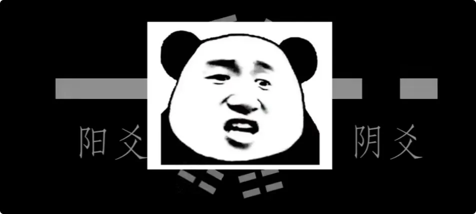

当时出来以后，我心里就想着，17号我就不出门了，我看这个女人怎么出现。结果真的很离谱，真的出现了一个陌生女人，我们还度过了一段美妙的时光。

整个过程非常违背常理，为了不占用大家时间，这里我就不细说了。如果大家感兴趣，本期视频点赞只要比上期多，我就把这段离奇的经历写在本期的视频笔记上。

### 2. 表哥离世与仙人的远程判断

这段经历我认为只能算得上是小神奇，接下来和大家讲的另一段经历，绝对能够证明超能力算命的存在，也符合朱教授虚数空间的说法。

不知道大家还有没有印象，我在《PUA历史》那期快结束的时候，讲了一个家里很有钱的哥哥，被小绿茶PUA弄得我嫂子整天以泪洗面的那个故事。

当时我在节目里面说，他的眼睛突然看不见了，这件事才得以结束。我发布那期视频的时间是今年的1月19号。就在四天后的23号，他突然就去世了。当时我得知这个消息的时候，整个人都懵了。因为就在两个月前，11月23号的时候，他还在给德国队加油，怎么可能就两个月的时间，一个活生生的人就莫名其妙的没了。

故事太长，我就长话短说。大致是因为他们家本身就有一种基因缺陷，免疫力就比正常人低，加上疫情期间打了疫苗，因为疫苗本身也是一种病毒，所以为什么有的人打了会头昏脑胀。

我和他其实是没有血缘关系的，我叫他哥，是因为他妈和我妈是高中同学兼闺蜜，我们从小就在一起玩。

他眼睛就是因为打了疫苗，加上他本身又感冒，还喝酒，一下子炎症控制不住，直接把左眼的视网膜给溶解了。后来通过治疗命暂时保住了，本来想把他送到医疗条件更好的地方去，但是因为疫情封控加上他本来身体就不好，就一直没有出去。

世界杯期间他稍微好了点，医院就放他回家了。因为他家的饮食比较清淡，他熬夜看球，各种烧烤饮料啤酒，听我嫂子说，大口茶都喝了三杯。

大家都知道糖是会引发身体炎症的，更何况他的身体状况，还摄入了大量工业糖精。然后开始发烧，又送医院了。

由于昆明这边的医院对他这个并没有任何临床经验，给他注射了大量激素，炎症是消了，可是他的内脏器官全面衰竭了。然后他的父母眼看不行，大年三十晚上托关系，把北京某医院的院长临时请过来给他治疗。

最后临近我哥去世前的四小时，他爸觉得医学上已经无法拯救他儿子了，想求助于玄学，想找一个他自己认识的江湖人士来想想办法。

这个时候院长就说，因为他们中医接触这方面的人比较多，他身边就有一个仙人，他的原话是“仙不用修炼，从小就有特异功能那种”。

告诉他吧，如果真要找这方面的人，就不要找什么江湖人士了，直接找这个仙人看看有没有办法。于是当场就给这个仙人打电话。

大家请注意，故事的重点来了：院长只和仙人说了，他一个朋友的儿子叫某某，现在生病了，让他帮看看这个病什么情况。

仙人只说了两个字：**方位**。院长就说云南昆明。生辰八字什么的还没问呢，仙人思索了一会儿，就说了一个字：**死**。如果要吊，可以多吊十天，但是过了十天还是死。

当场我听完就是一阵鸡皮疙瘩，难道人的命运真的是被安排好的？这个问题我们先不讨论仙人远程算命的原理。如果按照朱教授所说的，虚数空间时间比实数空间快这个概念，那就说得通了：

>所有实数空间的物体在虚数空间都有对应，比如现在正在看视频的你和你的手机，在虚数空间就同时存在着。那他只要通过天眼看一下这个在虚数空间的成像，不就知道了。

OK那还有第二个问题，那通过吊他多活十天又是什么意思？吊的意思就是，通过意念改变物理世界的现实法则。但是他当时已经脑梗了，很痛苦，他父母决定还是让他安心地走，不想让他再受苦了。

我现在终于明白为什么人在看过生死以后，更愿意相信有灵魂了。我哥走的时候才32岁，他的魔术工作室才开到一半，抱着吉他浪迹天涯的梦想还没实现，他的两个孩子甚至都没有学会叫爸爸。如果真的有轮回，愿他来生再来弥补这个遗憾吧。

这两件事情都是真实发生在我身边的，让我对这个世界的看法开始产生了一些改变。

## 六、宗教、辉光与科学修仙

用《人类简史》的话来说，在远古时代，如果你要去山里打老虎，你告诉大家真实情况，可能没有人会跟你去；

但如果你告诉大家，山里有神仙水，喝了能长寿，那就会有很多人追随你。可是随着科学技术的进步，再回过头来看宗教，发现科学只是不断在验证着宗教早已说过的事情而已。

### 1. 人体辉光与经络

比如说西方、印度、中国的神的画像上都在发光。前苏联科学家**基尔里安**通过仪器发现了人体会发光的秘密。他通过仪器检测发现，人在不同的健康状况、情绪状态时，所发出的光都会不同。

他称这种光为**人体辉光**。当一个人平静的时候，光呈浅蓝色；一个人生气的时候，光呈橙黄色；恐惧的时候光呈橘红色；说谎的时候，光呈各种颜色的交替。
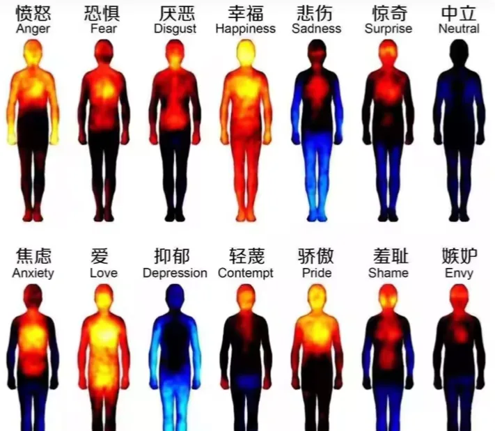

后来他的继承者、量子物理学家**科罗特科夫**发明了辉光相机，发现不止健康状况和情绪，连人的品行和运气都能通过辉光表现出来。

一些修炼之人的辉光呈黄色并重，或是将死之人的辉光呈暗淡或黑色。男女在相爱的时候，辉光特别亮；当牵手的时候，女性指尖的光会向男性延伸，男性的辉光则相应后缩，就像一道闪电一样。

并且这项技术已经走出了实验室，运用到了实践当中。

在圣彼得堡建城300周年盛典举行之前，在入场口的岗亭位置安装了辉光相机，三天之内就帮警察找到了九个罪犯，有运送毒品的，有运送枪支的，还有其他通缉犯。在实验过程中还发现，即使把树叶裁掉一半，再用相机照，辉光还是呈完整性，这也解释了幻肢痛的医学现象。

除了西方，中国安徽医科大学的张学军教授也在研究人体辉光。他在研究中发现，人体中特别亮的光点，位置和中医所说的经络穴位是完全一致的。

### 2. 佛教宇宙观与最小粒子

除此之外，我们都知道，构成我们这个世界的单位是基本粒子。1811年，人类发现了分子，以为分子就是最小的单位；后来发现分子里还有原子；再后来又在原子中发现了质子。到现在为止，人类发现的最小单位是夸克。

夸克有多少呢？针头里那个针眼的位置可以容纳5000万个。虽然目前夸克是最小单位，但科学家相信随着技术的进步，肯定还有更小单位。

但是早在2500年前，释迦牟尼佛就说过，**一花一世界，一树一菩提**。四个大洲加上须弥山是一个小世界，1000个这样的小世界成为小千世界，1000个小千世界成为大千世界，3000个大千世界成为三千世界。

我们所处的这个大千世界，佛陀称为娑婆世界。

宇宙中存在着无数个三千世界。在《华严经》中就说过: 
在一粒沙子里，就有着我们看不见摸不着的三千世界。现在的弦理论科学家也预测，任何一个点上都隐藏着更高维的11维空间。而佛家早就说过，不光是我们这个世界里的一粒沙子，在沙子里的三千世界里的一粒沙子，也隐藏着另外的三千世界，这样往复循环下去。所以按照佛陀的说法，人类永远也无法找到最小单位，也无法了解宇宙运行的本质。

接下来就要说到我们今天的主题了：**科学修仙时代真的到了吗？**

我在研究各种宗教的宇宙观后发现，不论真假，佛教的宇宙观绝对是想象力最丰富的，它几乎包含了所有宗教的存在。

我们在看神话故事中经常听到一句话，跳出三界之外，不在五行之中。这个三界的概念最早就是佛家提出的色界、欲界、无色界。我们所处的这个世界，加上须弥山顶上的六层天，称为色界；再加上往上的22层天，统称为28层天，都在六道轮回中进行循环。越往上的生命就越长，享受的快乐就越多。
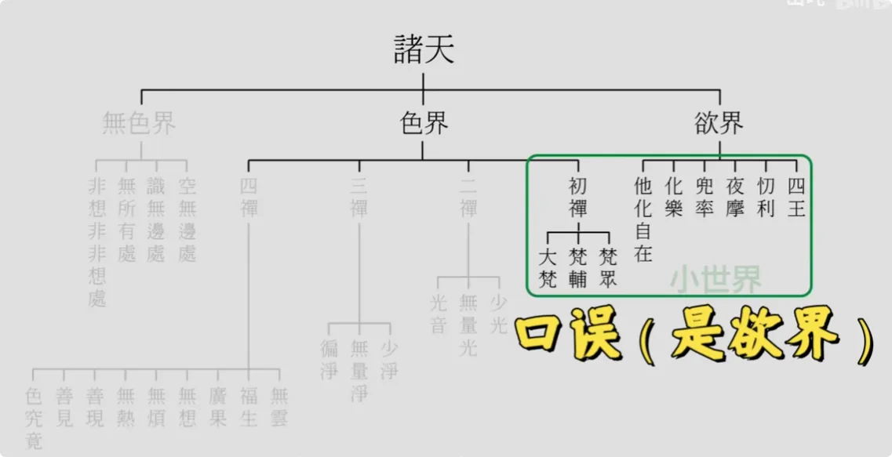

那么佛祖是怎么知道这些的呢？就是通过修炼开启了超能力以后亲眼看到的。这种修炼: 
***佛家叫禅定，道家叫打坐，印度叫冥想***

大致是一个意思。修炼的方式上原理都一样，细节上有些差别。

这一点就有点颠覆我对宗教的看法，感觉不是在画大饼，就好像佛祖在跟你说：我通过修炼看到了更高维的世界，我把这个方法告诉你们，称为经，你们通过修炼也可以看到，到时候再来验证我说的话。

这个修炼方法佛家称为**四禅八定**，修炼的程度越高，你的能力就越强。比如当你修炼到了四禅八定中的四禅，你就能开启五神通，通过天眼通就能看到佛祖所说的28层天，以及六道中各种世界的样子。

### 3. 四禅八定与禅乐

除了佛祖之外，特斯拉也说过，宇宙当中存在一个信息库，我所有的发明都来自于这个信息库。

这个信息库在印度教中叫做**阿卡西记录**，在佛教中叫做**阿赖耶识**，在道教中叫做**先天一炁**。有的人天生就能连接上，像特斯拉这种可以在脑子里做实验的人；有的人后天通过修炼也可以连接上。

那人为什么要修炼呢？按照佛家六道轮回的说法，六道分为三善道、三恶道。三恶道中的地狱和饿鬼就不说了，非常惨；

其中稍好一点的就是畜生道，但是畜生道的生灵由于比较愚痴，没有什么灵性，很难有往上走的机会，没有什么修炼天赋。那么三善道中的阿修罗和天道就很好吗？
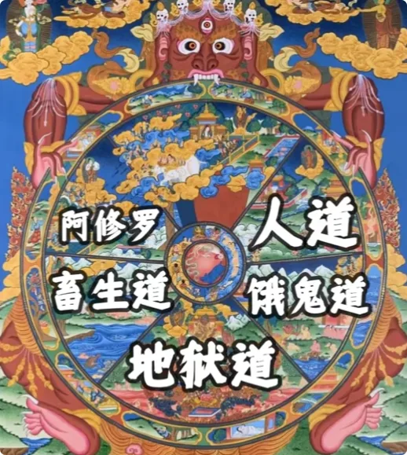

佛经上说了，即使到了天道中的最高天——**非想非非想处天**，你拥有了八劫的寿命，一劫就是268亿年，和最高等级的禅乐。

这里要解释一下什么是**禅乐**: 
普通人是通过五感来感受快乐，但是随着环境的变化，这种快乐很快就会消失，比如很好吃的东西、一首很好听的音乐、男女之间刚开始的激情，都是转瞬即逝。但是当你修炼到四禅八定中的初禅时，就会拥有最低等级的禅乐。无法用语言来形容是一种怎样的感觉，大致形容的话，就是你高潮的1亿倍，而且是长久持续的。

三界之中，色界的天人生来就有这种快乐。所以一些修炼之人在那静坐，你以为是被洗脑了，在那苦撑，实际上是在享受着这种高级的快乐。

就好像你整天躺在床上玩手机，家长觉得你很颓废，实际上你是在通过互联网遨游世界，家长也体会不到你的快乐一样。

禅乐我虽然没有体会过，但是我体会过延迟满足的快乐，其实是一种原理。以前我是一个追求及时行乐的人，但是这种快乐流失得太快了。

后来发现做一首歌、做一期视频，过程虽然很痛苦，但是却能让我开心很久。比如我10年前做的歌，现在放给朋友听一听，还是觉得蛮有成就感的。

天界的天人就是以禅乐为食，最低级别的禅乐我们都已经无法想象了，更何况是最高级的。但是即使是最高天的天人，时间一到就会立刻轮回到地狱受苦。

因为天道本来就是享福的地方，由于生活得太好，按照佛教的积分系统，没有什么机会增加积分。反而是六道中的人道不仅能修炼，还有很多增加积分的机会。

虽然身处人道的我们要经历生老病死、爱恨离别，但也是唯一一个可以看尽六道众生相的地方。比如北欧就是天然呆的地方，非洲就是地狱。当然修炼一途也并非易事，很多人一辈子可能也达不到初禅。
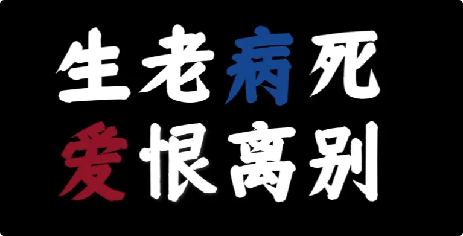

在看视频的各位，如果有人修炼到了，可以在评论区分享一下。不过没有关系，经常冥想一下，还是立马能感受到好处的。

我们老祖宗很早就发现一件事：我们身体内的大部分器官我们都控制不了，唯独肺是我们唯一能控制的器官。

>***呼吸一慢，心率就降；心率一降，心就会静；心静情绪就会少。*** 

感情当中情绪少的一方往往能占有主动权。大家仔细想一想，是不是这样。

而且拥有定力的人，气场都会很强，显得很有气质。为什么女生都喜欢成熟男人，现在懂了吧。

## 七、真假之辨与结尾

我们回到一开始的主题：这些事到底是不是真的？到现在我也经常在想这件事。我可以从个人的角度来帮大家分析一下。

如果说是真的，那国家为什么没有大力投入研究，反而是从一开始的热烈到现在的冷淡状态？

我想是因为这些东西对于目前的生产来说很不可控，想拥有这些能力，就得戒除世俗的欲望，整个过程又很漫长，没有太强的复制性。

**顺成人，逆成仙**

我以前以为是白天睡觉、晚上活动，到现在我才知道这句话的真正含义。如果说要把这些能力变成一种生产力，或是一种欲望，那能力又会立马消失，这也解释了为什么小孩有大人没有。

但如果这些事是假，那为什么几十年来有这么多的教授一直在研究这个事儿？
你说是为了出名，他们已经在自己的领域内很有名；
如果是为了评诺贝尔，不可能通过造假拿奖吧；
你说是为了赚钱，现在已经过了最赚钱的那个时期了

反而现在的社会环境，你研究这个还会被套上神棍的标签。而且我看了上百个这方面的视频，在评论区有很多人在分享自己的经历，难道都是水军？

前几天和我妈去看望一个奶奶，当时他们一家人都在。因为她孙女曾经就读于云大物理系，我就和他孙女聊起这个事了，我问他认不认识朱念麟教授。

聊了一会儿，他孙女就和我说，他小时候也能看到一些意象，他儿子今年六岁也能看见，他们一家人可以算得上是传统的高级知识分子。

这里我想引用507所研究员**宋孔智**教授的一段专访作为结尾。当时所里给他的任务是研究功能人**张宝胜**的特异功能。

张宝胜可以算是异能榜排名第一的人物了，因为到目前为止，他是唯一一个可以当众表演特异功能的。很多教授在研究中发现这个能力很不稳定，不是随时都有。现在在百度上搜张宝胜都说是骗子，可是宋孔智教授时隔多年却说，当年对于药瓶盗药这个实验，他做得非常严谨。

首先要确认这个功能到底是真是假，如果是真的才会展开研究。当时的实验环境用了1000瓦的灯泡来做照明，确保高速摄像机可以不放过任何一帧画面。高速摄像机每秒是1000张的拍摄速度。

药品也是他亲自制作、亲自密封，又把里面的药片换成了彩色玻璃片，每个玻璃面上还刻上了暗纹，来确保实验的严谨性。

在整个实验过程中，还拍下了药片穿过瓶子的中间态，头上还接上了脑波感应装置。宋教授说，如果是作假，情绪应该是紧张的，脑波应该是乱的，怎么会那么平静？还有很多细节我就不叙述了，大家感兴趣可以亲自去看一下这个长达一个半小时的专访。

宋老先生把整个实验过程说得非常详细，所以对于网上那些魔术揭秘的人和大喊骗子的人，我只想说肤浅得可笑。当然张宝胜的功能有时也不太稳定，有时功能不起效的时候也会作假，也被他们发现过。

但正如宋老先生所说，我们不能因为一次实验的成功，就不去质疑它的真实性；也不能因为一次实验的失败就否定它的存在性。所谓迷信就是盲目相信，如果你经过亲自深入研究发现的结果，就不能称之为迷信。

好了，本期节目到这里就结束了。因为本期内容太过庞杂，没法讲得非常详细，光一个实验专访就能长达一个半小时。

为了让更多人了解真相，我只能进行一个笼统的介绍。如果你对于特异功能、身心灵、出世等话题感兴趣，可以把我上述提到的视频自己看一下。如果你觉得本期视频有点意思，麻烦三连支持一下。下期是世界真相三部曲的最终章，我是山吒，我们下期再见。

**附：结尾口述片段**

> 没有被发现的一大类，我们都忽视了，一说就是伪科学。你人类不是宇宙最高智能，地外文明、史前文明远超我们的想象。随便举一个例子，我看到的书里我都想写这么一本书，现实例太多了。发现的不是5000年文明史是吧？25亿年之前，非洲的那个加蓬，就有那个几十个反应堆的那种迹象，但不能最后下结论，就是他的那个同位素的比值，不是那个自然衰变的那种比值。这么强有力的证据挑战现代科学，我们还是说我们有中国有几千年、3000年、4000年、5000年，现在就三星堆就不太敢研究啊是吧，因为三星堆的文化和中原文化有很大差别，很可能是中亚的文化。

> 我们就第一个我想讲的就是宇宙文明，地球人类怎么正确定位我们在宇宙文明当中的地位。这个所以通过15天的观察，我感觉到他有真正的这个法术的能力，特别是搬运术。当然我这里还要声明一下，后来经过很多年的跟踪研究，我发现他一方面有真功夫，第二他在某些时候会作弊。比如说当他正在表演，突然功能不能出现，他就有一套应对方法，就通过作弊来达到。但是这两点我认为是共存的。不能因为他有功能，就说他从不作弊；也不能因为发现他作弊了，就否认他有功能。我觉得科学是复杂的，社会是复杂的，人也是复杂的。但是一个社会的文明程度，要看这个社会能不能容忍假说、科学的假说啊，能不能够容忍一些创新的言论，不要去打击他们。他们又不犯罪，他们也不占用国家的钱，他们也没有宣传迷信。我请求大家对我们这样的一些人宽容，能够支持一下更好。不是钱的支持，精神上的，是精神上的支持。因为我们中国在全世界面临着一个复兴的过程，而这个复兴的过程要求我们的人民全部都要有创造的心态，在软件上能够给世界留下一点创造。否则很多很多的国家认为中国缺乏创造力，你们只是模仿了我们的技术，你们缺乏独创。恰好，我们国内还有一批献身于独创的科学家和教授。那是我们在座的同志都知道，在近10年多来。

> 我们整个这个概念，对于人的概念受到了人体特异功能的冲击。因为有了冲击，所以我们才觉悟过来了：原来书本上、学校中教的是大大的不够用了，使我们扩大了思路，终于看到了人体是一个开放的复杂巨系统。那么我们回过头来想，我们之所以有这样的一个新的观点，我们要感谢人体特异功能，因为是身体特异功能给我们的启发，开动了我们的脑筋。但是我们也绝不能够把人体科学限于人体特异功能。正如我在1983年那篇文章就讲到了，人体科学是现代科学技术体系当中的一个大的部门，一个平行于自然科学、社会科学的大部门。那么我们人体科学这个大的部门，它也有一个哲学的概括，这就是人天观点。

## 关于市面上的假风水揭秘

> https://www.youtube.com/watch?v=-gZnFKzSi4M  
> 

## 前言

现在市面上你能找得到的风水，9成9都是假的。我说的假的不是骗你钱那么简单，而是它的本质里面的东西，根本就不是你以为的那个东西。
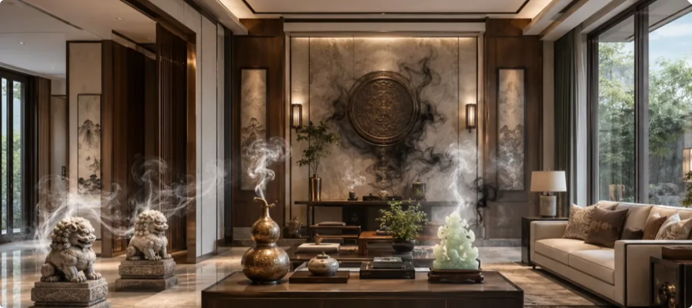

如果你家里有一些招财的、镇宅的、开过光的东西，没用还好，如果它有用，我建议你赶紧想想办法把它们请出去。因为一个死物不会凭空产生能量，它能帮你有且只有一个原因：
就是里面有东西在替你干活，而它干活是要收费的。所谓**请神容易送神难**，说的就是这件事。

这一集我们继续展开说说：真风水为什么没有传下来，传下来的这一套本质到底是什么，以及最关键的，它为什么有时候还真的有效。
视频的最后再给大家几个选阳宅和避煞的小技巧。把这一集听透，我相信你以后就不会再被任何风水师忽悠了。小板凳赶快搬好。

## 真风水为什么失传了?

要讲清楚现代风水为什么假，就要先说说真风水为什么没有传下来。这就要从最早的那本风水书《葬书》说起。《葬书》起源于西汉，它真正的精髓就藏在开篇的几句话里面，讲的是生气，是堪舆，是道。偏偏这几句话也是本书中最抽象、最难理解的地方。
后世风水师呢，因为太抽象不具备实践性，就直接把精华当废话略过，把后面的术背得滚瓜烂熟。这就叫本末倒置。
是祖师爷没写吗？不是啊，写了呀，开篇就写了呀。可是写了又能怎么样呢？这东西的性质就决定了它根本传不下来，有两个原因：

**第一个原因**：真正的堪舆术，天地之道里的那个“道”，根本没办法用文字传。我举个非常简单的例子：你用文字描述一下螃蟹是什么味道？你怎么写？就算你写得天花乱坠，只要对方没吃过螃蟹，他就不可能知道螃蟹到底是什么味道。他只能靠自己的想象力去猜，那猜出来的味道和真正吃到嘴里的味道，是同一个东西吗？永远不可能。更别说可能连写的人自己都没吃过螃蟹，那就更完蛋了。他不理解，他就只能看前人是怎么瞎猜的，瞎猜别人的瞎猜，跑偏程度完全取决于想象力的丰富程度。

你看，文字连五感以内的味觉都传不明白，更何况是超越五感的道。写的人写不明白，看的人自然更看不明白。世界的运转规则就是这样，**低维理解不了高维，也链接不了高维。而文字本来就是比意识更低维度的东西，所以书里得来的除了糟粕，没有所谓更高级的东西。**

但是人类就是很自以为是，非要逆天用文字传，那最后变成什么呢？就只能妖魔鬼怪来给你写了，越写越偏，越写越邪，越写越low，最后还以为自己更先进了。这就是咱们现代的文明，科技越来越发达，灵魂越来越低维。这也解释了为什么现代能通灵的人会越来越多，因为频率越来越往下走了呀，沟通自然就更容易了。这，我就点到为止了。

**还有第二个原因**：时机不到，不敢传。前面提过，*纯正能量是灵界最珍贵的资源，受到天道最严格的把控。* 
而一等地师的观气，也叫相气术，属于堪舆玄门里最高阶的技巧，不到时机绝对不会开放的。一旦开放，成仙的人就会成批成批地出现。可过去几千年，真正修成的人不到百人。观气这门技术本来就是天机，泄露天机的人会是什么下场，我相信你大概也有所耳闻。所以不是传不下去，而是没人敢传。
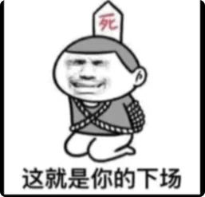

你想啊，既然是天机，怎么可能写进大众能买得到的书里，又怎么可能随随便便让你找到、让你学到呢？那就有人要问了：为什么我现在敢在这里说？肯定是经过允许我才敢说的呀，不然你想我有几条命。我只能说，现在这个时代是一个有大机缘的时代，剩下的你自己悟吧。
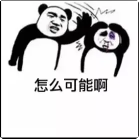

## 现代风水为什么假？

真东西传不下来，那后世用书传下来的，到底是什么东西呢？说穿了就五个字：**统计概率学**。
真正的地师能直接观气就能找到穴，后世的人不会观气，就只能把过去那些可能有气的地方在外形上总结出来——什么样的山、什么样的水、什么样的地形曾经出过帝王将相、富贵人家——全部记录下来，再反过来推测：长这个样子的地方，大概率有气。至少这样还有一个看得见摸得着的依据，不至于满世界乱找。

所以后来慢慢就分出了两大派：

- **形势派**——看形峦，看山川，看地理。本来看形峦这事吧也不算太离谱，古人云“在天成象，在地成形”，至少他看的还是天地留下来的痕迹。可是人类喜欢自作聪明，形峦看不明白就觉得是方法不够精密，非要继续加罗盘、加数理、加方位，于是产生了另外一派：
- **理气派**。

我之前说过，风水这玩意一旦上了仪器，就在跑偏的路上一骑绝尘，越研究越低级，还自我感觉特别良好。真是人类一思考，上帝就发笑。

到了最著名的风水书《撼龙经》，他就已经把《葬书》里抽象的山川形势彻底地标准化和分类化了。
那书我仔细研读过，200多页，真东西加起来不到两页吧，而且都是抽象的，《葬书》里说过的。你要是真的按书里的例子去找，那你就彻底废了。
因为无论分类分得多细，数理算得多复杂，概率学终究只是概率学。有概率有气，不代表一定有气，更不代表你能拿得到气。风水师说这里有、那里有，给你瞎编个天花乱坠，反正你也看不见，也没办法验证。

而且这里还有一个更关键的问题是：**风水根本不能被标准化**。
为什么？因为生气是天道的恩赐，是天道在地上的代表，而生气本身又是能量体，是能量体它就有意识，它就是流动的，它就是与时俱进的。
对，你没听错，天道和风水都是意识体，都是智能的，而且是你想象不到的智能。

这就意味着，以前那些帝王将相的墓，现在未必够看了；
以前那些名山大川，现在不一定还有气了。比如终南山、青城山、鹤鸣山、武当山、茅山等等等等，但凡有人飞升过，有一个算一个，这山如果现在还有气，算我输。
那你就想想看，现在在那些山头上埋头修行的人，没有气，他们能修成什么妖魔鬼怪？

说到底，一个地方有没有气，不是因为山长成某个样子，而是天允许你找到这个地方，你才能找到这个地方；天允许这个地方开放气，你才能拿得到气。这些全都归天道统一管理。如果气不开放，你就算在那枯坐一万年，你也就是个万年僵尸。

所以你拿着千年前的书，背着百年前的口诀，再用一个罗盘去算今天的气，这事本来就不靠谱。凡是普通人靠书、靠口诀、靠罗盘能够随便找到的、随便点中的，必然只是凡品。
但是人类就是很奇怪呀，一方面理解不了气，也不相信气；另一方面又总想用自己那个十几厘米的脑子算出哪里有老天爷的东西，占为己有，总想着人定胜天、与天抗衡。
这怎么可能呢？你以为你想得到，天想不到吗？人类才出现多少年，天道存在了多少年？天对人性了如指掌，所以人呐，还是对天地有一些敬畏之心的好。
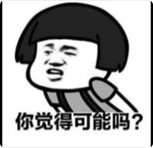

## 现代风水的本质是什么

凡人想用凡人的手段去找更高级的气，找不了一点，那只能往下找凡气。往下的气是什么呢？是**煞气**。

所以现代风水能够观察、能够调整的，从来都不是生气，而是煞气。很多风水师连自己都没有意识到，他一辈子都在跟煞气打交道。更荒唐的是，很多所谓的现代风水师，不但不会观生气，甚至连煞气都看不出来。
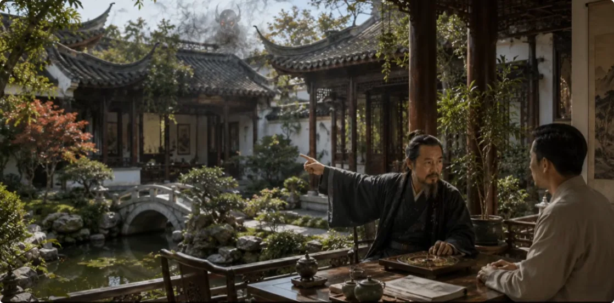

我之前住的房子气不太好，除了我的房间，其他的地方东西不少。但是我自己有防护，也知道怎么清理，所以那些东西不敢进来。但其他的室友没有任何防护，所以住进来的人隔三差五就出事，隔三差五就生病。
后来房东也觉得不对劲，就请了个风水师来家里看看。那个风水师在家里转了一圈——房子没有生气，他看不出来；房子有煞气、有东西，他也看不出来。最后实在找不到问题，就指着窗外的一个鸟巢说：“问题出在那个鸟巢上。”

你看，这就是很多现代风水师的真正水平：背了一堆方位格局口诀，真到了一个有问题的房子，什么实际问题都看不出来。

说到这里，肯定又有人会说：“那是你遇到的风水师太菜了，我遇到的风水师就真的有用。”好好好，有用的我也遇见过，也不比你少。接下来我们就认真说说：为什么有些现代风水，明明不会观气，却真的会有效果。

##  假风水“有效”的三种情况

一般有三种情况，而第三种最猛也最危险。

**第一种情况**，也是最好的一种，就是他真的碰巧找到有气的地。注意，是碰巧，不是因为他真的会观气。刚才说了，后世风水靠的是统计概率学，既然是概率学，那就不可能次次都错。有些地方山川形势本来就符合过去总结出来的规律，再加上那块地当下刚好还有气，那就真的可能被他撞中。这种地呢，在我们修仙者眼里可能瞧不上，但供人间福气完全是够够的了。这一小部分本来就是天道给人类的恩赐，凡人可得。

但是你得清楚：他找得到不代表他看得到，他撞对一次也不代表他真的会。就像一个人买彩票中了奖，不能因为他中过一次，你就说他掌握了彩票的底层规律。所以第一种现代风水为什么有效？不是因为它突然变成了真风水，而是因为运气。你要是真的有机缘找到一个还不错的地，其实也是因为命里有，所以你赶紧偷着乐吧。**但是绝大部分真正灵气充沛、可供修炼的地方都是锁起来的，所谓“大地不许人识”，因为那部分已经不是人间福气的部分了，只有有缘的修炼人才允许碰。**

**第二种情况**，风水师只是调了调格局，居然也有效。这一种呢，不是调格局能带来生气。之前说过，生气只能找，不能人为产生。所以真正起作用的原因是：这个房子原来的格局有煞，某些地方在聚煞、冲煞，所以风水师把门、床、桌子这些位置挪一挪，煞气就对人的冲击小了一点，你才感觉生活好像变顺了。

我用最直白的方式给你算一笔账：假设你命里原本能赚1,000万，结果你搬进了一个有煞气的房子，天天被冲，最后只剩500万。风水师来了给你调了下格局，煞气没那么重了，你又拿回了200万。你一看，哎，风水真的有效！但是你别忘了，那200万本来就是你的。如果你一开始没住进这套有煞气的房子，你命里本来有1,000万。

所以调屋内风水的作用不是给你加东西，而是尽量减少环境对你的消耗，让你有机会活到命里本来就有的最上限。但是它提高不了你的上限。
你命里最多有1,000万，你床换10次、桌子挪出花来，也不可能给你调成一个亿。所以说，现代风水能不能有效呢？能，但它做的只是暂时止损，而不是增加福气。这也是为什么现代风水和真正的风水根本就不是同一个层级的东西。
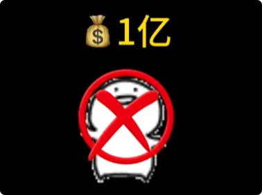

如果有一个风水师给你家里挪了几个东西，就跟你说这叫“藏风聚气”，能把生气聚进来，那你可以直接让他滚了。他连自己调的是什么都没搞明白。我再强调一遍：**生气是不能人为产生的，它有就有，没有就没有**。

**第三种情况**，不是调格局，而是往家里请了一个东西——特别是那种开过光的、镇宅的、招财的——请回去还真的有效，而且这种效果可能比前两种加起来都猛。我刚才讲了，你命里有1,000万，调格局顶多能让你少损失一点。可这种东西真的可能硬生生地把你从1,000万推到1个亿。

听起来是不是很好？别高兴得太早。因为这已经不是在调风水了，这是在借力。根据能量守恒定律，一个摆件又不会自己凭空产生能量，那它为什么能帮你挡煞？为什么能让你发财？为什么能让你变顺？有且只有一个可能：**里面有东西在替你干活**
但是灵界的大佬从来不会平白无故地帮人，但凡他真的出手了，后面就一定会收账。那用什么还呢？

人间最珍贵的无非就是两样：**钱和命**。
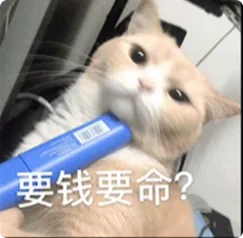

人家灵界的大佬又用不着人民币，那你就用你聪明的小脑袋瓜子想一想，最后用什么还？说难听一点，你往家里请了一个开过光的东西，本质上就是温水煮青蛙版的“养小鬼”。只是“养小鬼”太直白了，听起来好可怕，换成“开光”“镇宅”“招财”，听起来就舒服多了。

当然，也有人会说：“他一个亿呀，命算什么，给你就是。”这也没关系，这个世界上本来就有很多人愿意拿命换钱、换名、换权，我也不会多说什么。
但是惜命的人啊，要明白一件事：效果越猛，说明借来的力量越大；借得越多，后面要还的就越重。所以这种东西，风水师说得再好听，你都不要往家里请。因为只要它真的有效，就说明里面不是空的；只要里面不是空的，就一定需要能量；而这笔能量最后还是羊毛出在羊身上。

那就有人说了：“我一点都不贪，我不想要多的。风水师让我请的也不是招财的，是化煞的，这总没问题了吧？”No，问题更大。
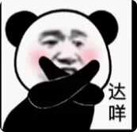
因为这个世界上真正能把煞气化掉的方法有且只有一种，就是正负对冲——正能量和负能量碰上，才会互相抵消清零。
负能量和负能量碰上，那不叫化煞，那叫打架。两军交战，子弹都往旁边飞，伤及的都是无辜。

所以很多人口中的化煞，根本就没有化，只是挡了一下、绕了一下，或者把煞气推到了别人那里。
最典型的都市传说就是香港的中银大厦: 
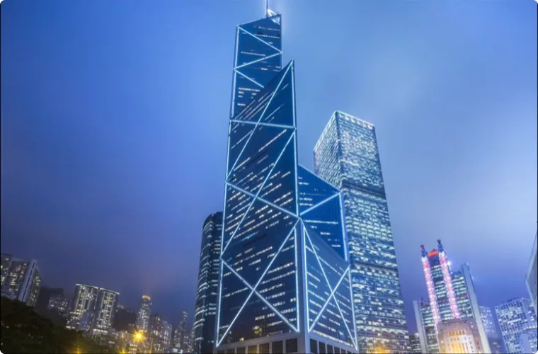

中银大厦的外形像一把三棱长刀，其中一面直直地砍向对面的港督府。主体结构刚建成，香港总督就暴毙了。继任的香港总督呢，赶紧在外面种柳树挡煞，结果也是种一棵死一棵。
后来香港回归，董建华拒绝入住港督府。长刀另一面对着的汇丰银行也吓坏了，在顶楼装了两门大炮正对中银大厦。
最后压力给到了刀锋和大炮中间的李嘉诚，风水师建议把建筑设计成正正方方的四面体，像一面巨大的盾牌，外墙再全部使用反光玻璃，达到刀枪不入的效果。

那这个思路有没有用呢？有一点。因为反光或者是让视线范围内看不见，本身就能挡掉一部分的形煞。但是挡住和化掉是两回事，那股煞气根本就没有消失，它只是被反射弹开到了周围。
所以附近的住户会在窗外再挂一面八卦镜，接着往外反。那个区域就是你反给我、我再反给你，大家击鼓传花。可煞气有没有真的没了呢？不会的，只是看最后谁倒霉、谁接得多。

而且八卦镜能挡多少也是有数的，大概就是八卦镜和窗户面积的比例。如果一面镜子只有窗户的1%，那最多就能挡掉1%，剩下的照样冲进来。
八卦镜里只要没有住东西，反而还是安全的，因为它只是靠物理反射。那真正危险的是那些小小体积、大大效果的东西。因为我说了，一个死物不会产生能量，它拿什么替你挡？它又凭什么让别的东西不敢进？只有一个可能：里面住着比周围那些东西更厉害的东西。

这种情况我也见很多。有些人家里乱七八糟一大堆大鬼小鬼，但是有一些房子干净得出乎意料，找半天才发现，这个家不是真的有多干净，而是里面有一个大佬镇着，别的东西都不敢进来。
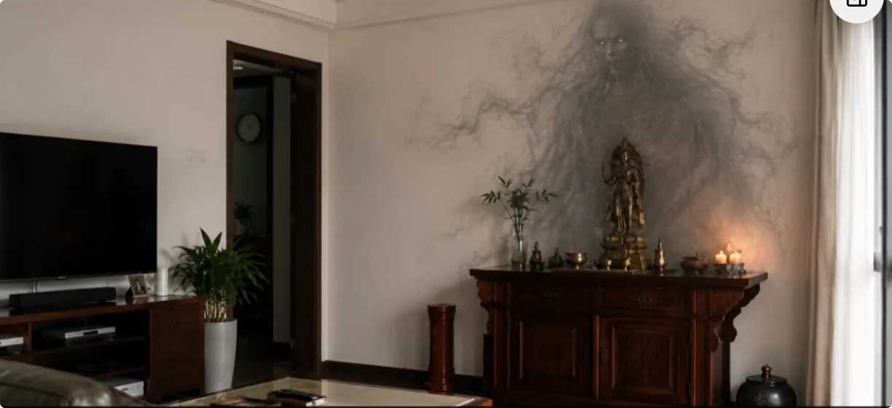
听起来是不是特别好？这次也别高兴得太早。镇得住不代表他在保护你。大佬镇宅的能量从哪来呀？这就不用我多说了吧。

所以第三种情况，表面上看效果最猛，实际上也是最危险的一种。它不是帮你把问题解决了，只是换了一种方式从你身上收账。而人长期住在这种房子里，身体迟早会出问题——要么被外面的煞气砍，要么被家里镇宅的东西吸。

我之前经过中银大厦那片区域，直接被煞气冲吐了。我还是一个有防护的人。可想而知，一个普通人长期待在那里，每天会被冲掉多少阳气。只是大家感觉不到而已，但是感觉不到不代表没有。就像很多人癌症晚期，之前也没有任何感觉，等你终于感觉到了，往往已经晚了。最可怕的地方是，它不是煞气有多重，而是你根本就感觉不到。

## 阳宅怎么选？

先记住一句话：**选房子第一件事情，不是看它旺不旺你，是先看它会不会天天耗你。** 想清楚这一点，比背100条禁忌都有用。

还有些事不用你有感知力也能留意的：就是家里要多通风、多打扫、多开窗、多晒太阳。这些东西不会凭空给你生出什么生气，但是至少能让浊气别那么容易堆在屋里。越是终日不见阳光、空气不流通的房子，脏东西越容易堆积。

在这个前提下，我们再说几个具体的建议：

1. **能不住市中心，就尽量别住市中心。** 越繁华、越拥挤、人越多的地方，气往往越浊。宁愿住远一点、安静一点，也不要为了所谓的方便，天天泡在一堆浊气里。
2. **窗户和门口不要正对着任何尖锐的角。** 原理跟中银大厦一样，尖角对着你，就是长年累月地冲你。如果窗外已经有尖角了，拉上窗帘多少还能挡一点，但是最好的办法还是搬家。
3. **三角形的房子不要住。** 煞气很容易往尖角聚。美国就有一些著名的三角大楼，我都去过，同一栋楼里越靠近尖端的位置，气往往越浊。
4. **家门口不要正对着河流、马路、消防通道、楼梯口、电梯口。** 城市里很多的浊气和东西本身没有多大的能力，只能跟着空气和水流动。门口一旦正对着这些通道，就等于天天把外面的浊气往家里灌。这也就是所谓的路冲煞。
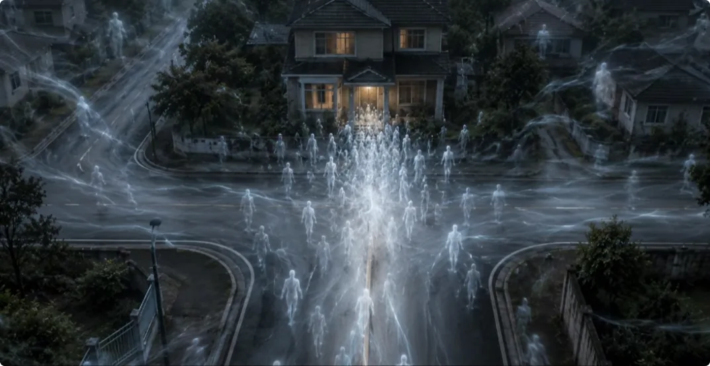

## 哪些地方不要去？

这里也有一个非常简单的判断：**越是闭塞、阴暗、浑浊、情绪重的地方，越不要长时间待。**

- 竹林、峡谷、洞穴、悬崖——这些地方本来就不通不散，东西很容易积在里面。
- 寺庙、道观、教堂、墓地、废弃楼、鬼屋、恐怖主题密室，还有一些阴阴森森的建筑——也尽量少去。不是因为看着吓人，而是鬼真的很喜欢住那些地方。
- KTV、酒吧、迪厅也是一样——人多、酒多、欲望多、情绪乱，原始欲望过重的地方，都是妖喜欢待的地方。
- 还有恐怖电影、恐怖音乐，也别一天到晚拿来刺激自己。你以为你只是在找乐子，其实你是在招乐子，把东西招过来，谁是谁的乐子那就不一定了。

家里呢，也不要乱请东西。人偶、雕塑、佛像、古董、开过光的东西，能不放就不放。你根本就不知道它以前在哪、跟过谁、里面又有什么。

最后再强调：曾老说过，人多的地方不要去。哪里人多，不用我再告诉你了吧。

##  哪些地方可以去？

阳光明媚、山清水秀、明朗开阔、空气流通的地方，可以多走走。

比如说湖边、海边都可以。但是我再说一遍：**不要下水，不要下水，不要下水。** 
旁边走走、晒晒太阳、吹吹风就行了，离岸边远一点。你别看到水清就非得往里钻，不听劝的，后果自己承担。

##  瞎说一些大实话

但说到底，上面这些不管是避开尖角、远离路冲、少去阴暗的地方，还是不往家里乱请东西，全都只是在避煞，顶多让你少被耗一点，却没有办法从根上解决问题。因为你没有感知力，就理解不了为什么要这么做。今天记住10条，明天换一个环境，照样踩坑。

所以，真正重要的不是把所有禁忌背下来，而是**你有没有分辨气的能力，有没有趋吉避凶的本事**。

你不妨设想一下：如果有一天你有机缘接触到最纯正的能量，能给自己和家里形成防护，再加上自己有感知力——哪里能住、哪里不能住，什么能碰、什么不能碰，什么时候该留、什么时候该走，碰见了怎么清理，被耗了应该怎么补——这些本来就是一目了然的事，跟吃饭睡觉一样，是自然规律，是本能反应。

所以禁忌背一万条，不如你自己真的看得见、摸得着。

## 起卦_龙是否存在

> **第一卦问：世界上是否真的存在龙？**
> 
> **第二卦问：卦童小时候亲眼看到的那条龙，究竟是真实存在，还是儿时的幻觉与记忆偏差？**

## 1. 为什么要起两卦：宏大的问题，和普通小事的起卦方式并不一样

各位好，我们本期看个轻松点的卦：**问龙是否存在？**

开始之前跟各位介绍一下，每期节目的起卦者其实都不是我本人。我自己平常很少起卦，一是我没有什么想问的，二是起卦和解卦都挺费时间。

找我解卦的朋友都知道，大多数时候都是你们自己起的卦，我来解。
我自己需要起卦的时候，用时间或者数字起卦比较多。比如随便想个数字，看看今天的飞机会不会延误、今天会不会堵车，或者找不到的东西在哪里。这些小事情可能很快起个卦，花一分钟扫一眼，就知道答案了，比较省时间。

但当问比较宏大的事情，比如之前问造物主或者某些国事层面的事情，这时候可能就会花费数十天解一个卦象，起卦前做的功课也比较多。

所以本频道其实所有的卦，都是由我们一位专门的**卦童**起的。这位卦童自己一点《易经》都不懂，但可能因为特殊的灵感体质，他起的卦往往不同于常人，往往都十分灵验和准确，信息也很直截了当。

### 起卦真正依赖的，是那一刻的“起心动念”

这是为什么呢？

《易经》作为宇宙运行的底层代码书，它的权限其实是很高的。对于财运、事业、学业，甚至一些未解之谜，对于这些不上锁的东西，它几乎是无上限的，所有人都可以使用。

但是使用这本书的钥匙只有一个：

> **心要足够清明。**

起卦本质靠的是当下那一刻的起心动念，是由起心动念这个 **input** 换来结果 **output**。

> _**只有足够清明的 input，换出来的 output，才能够准确地回答我们真正想问的事情。**_

本期有两卦：
1. **问世界上是否存在龙；**
2. **卦童本人小时候曾说自己见过龙，因此第二卦问：小时候见到的龙是真实的亲眼所见，还是幻觉，或者因为年龄太小而记错了？**

---

## 2. 第一卦：问世界上是否存在龙，得“坤为地”

> **第一卦：问世界上是否存在龙，得卦——坤为地。**

我们先看这个卦的整体。

在中国传统文化中，龙是一种什么样的存在呢？它能腾云驾雾、兴风布雨，是至阳至刚之物。
然而，在问“龙”这个东西的时候，宇宙给出的却是一个**至阴至柔的坤卦**。

### 三个信息，都在指向“它不是普通的肉身生物”

1. **纯阴**
坤卦由六个阴爻组成。

所谓：

> _**孤阴不生，孤阳不长。**_

只要是存在于我们人间的碳基生命，只要它具有肉身、能够活动、能够被我们肉眼所见，它就一定需要某种“阳”的动力。
而阴者为死物，呈现的是毫无生机之象。

2. **六冲**

再看坤为六冲卦，卦中各部分、各爻彼此冲散，难以长久凝聚，也难以稳定成型。
龙若是一种生物，它的细胞、骨骼、能量都必须聚合。
而六冲表现出的，却恰恰是：

> **无法稳定聚合成型。**

3. **应爻旬空**

我们继续看应爻。

应爻可以理解为所问的对象，也可以理解为外部世界对这个问题给出的回应。
这次问的是“世界上存在龙吗”，那么应爻便可视为这个问题所指向的对象，也就是**龙在卦中对应的位置之一**。

而这一卦的应爻，在当日处于**旬空**的状态。
旬空这个词，可以先按照字面意思理解成：

> **落空、没有、不显现。**

也就是说，龙作为一种生物，它是没有的，是不显现的。
所以这一卦分析到这里，出现了三个连续的信息：

- **纯阴**：呈现毫无生机之象；
- **六冲**：无法以稳定肉身形态凝聚；
- **旬空**：没有、不显现。

如果只看到这里，似乎已经可以直接得出一个结论：

> _**龙这种现实世界中的肉身生物，并不存在。**_

但这一卦的内容，才刚刚展开。

---

## 3. 看似“没有龙”的卦里，却出现了一个极其鲜明的“龙象”

因为卦中，还有一个与传统文化中的龙高度吻合的位置。
我们看这个应爻：

> **螣蛇　官鬼　卯木**

应爻，本身就是所问之事，也就是龙。
龙性本淫，好变幻、好繁衍；而这一爻又属**桃花星、螣蛇官鬼**，本身可以取象为缠绕状的鬼神怪异之物。
而卯木又属东方，处震卦之位。

《周易》八卦取象中：
- 乾为马；
- 坤为牛；
- **震为龙**；
- 巽为鸡；
- 坎为豕；
- 离为雉；
- 艮为狗；
- 兑为羊。

卯木处震卦之位，恰恰就代表着**龙**。

> **多象定一象。**

应爻、螣蛇、官鬼、卯木、东方、震位……
这些信息叠加以后，这一爻就如同：

> _**“龙”亲临此卦之中一样。**_

而这时候，真正有意思的矛盾出现了。

---

## 4. 一边说“没有”，一边又龙象鲜明：这两组信息如何统一

现在我们得到了一个看似完全矛盾的局面。

一边是：
1. 坤卦纯阴；
2. 六冲难聚；
3. 应爻旬空。

这些都说明，**龙不像是现实世界中的肉身生物。**

但另一方面，我们传统文化概念中的“龙”，在本卦中却又有十分鲜明的形象，和传统龙象高度符合。

那么这两组信息该如何统一呢？

玄成先生给出的解释是：

> _**龙并非不存在，而是并不以三维世界中的肉身生物形式存在。**_

### 人间为空，但“月建”上的能量却极旺

龙虽然在本卦中旬空，又逢六冲，代表它在凡间没有肉体，但是它高悬于天，与**卯木月建同气同源**。
月建，可以理解为卦中最强盛的气。
若一爻与月建相同，便说明它在卦中的能量处于十分旺盛的状态。
这里就出现了一个非常关键的判断：

> **如果一个事物彻底不存在，它的能量应该趋近于 0。**

但是在此卦中，代表龙的这个卯木，其能量**临月建，是极旺的**。
拥有这样的能量，它绝对不会是一个单纯“不存在”的形象。
所以可以转换一个理解方式：

> **本卦视为人间，日月则视为更高层级的时空。**

它在人间层面为空，没有肉身；可是在更大的天地气场层面，它的能量却极其旺盛。
月建：

> _**掌一月之权，司三旬之令，操持万卜之提纲，巡查六爻之善恶。**_

因此，按照本卦的推演，可以得出这一层结论：

> **龙不以肉身、动物的形式存在于人间，但它存在于另一个更高层级的维度。**

---

## 5. 如果龙不以肉身存在，人类为什么还会偶尔“看见龙”

那么问题又来了：
为什么我们人类仍有机会发现它？
为什么真真假假之间，偶尔仍会听说关于龙的目击事件？
为什么龙的形象、性格、秉性，能够传承上千年而不发生根本改变？

这里就需要再次**转换太极点**。
以上卦为天，下卦为地：
- **上卦**代表高维世界；
- **下卦**代表我们所在的人间；
- **三爻**则处于天地夹缝之间，位居门户之处。

也就是说，它正处于：

> **高维世界与人间之间。**

所以按照这一卦的解释，我们在人间才有机会见到龙，但它并不会轻易显现于人间。

> _**只有等这个旬空的卯木“填实”的机缘到来之时，它才会在三维世间中显现肉身。**_

到这里，第一卦关于“龙是否存在”的逻辑就完整了。

它给出的并不是一个简单的“有”或者“没有”，而是进行了区分：
1. **如果问龙是不是一种长期生活在人间、具有稳定肉身结构的普通动物——卦象是否定的；**
2. **如果问“龙”这个存在本身有没有对应的信息与能量——卦中却出现了极为鲜明而旺盛的龙象；**
3. **因此，本卦最终将它解释成了一种平时不以三维肉身形式存在、但可能在特殊条件下显现的存在。**
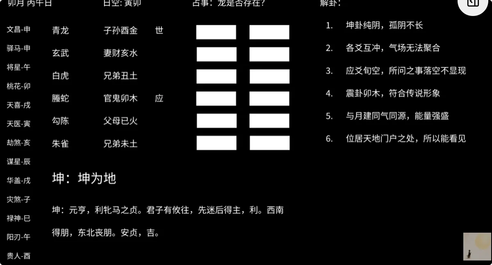

---

## 6. 第二卦：卦童小时候在井里看到的那条龙，是真的吗

本期卦童说，他小时候曾经见过龙。
地点是在：

> **一口井里。**

所以第二卦问的就是：

> **小时候看到的那条龙，是真实的吗？**

这也是他本人起的卦。
我们依然以**应爻**为所问之事。
结果这一次，他小时候看到的龙，对应的是：

> **青龙　子孙　卯木**

又是**卯木应爻**。
刚刚说过，卯木属东方，处震卦之位，而八卦中：

> **震为龙。**

你看，在这里依然是这么相应。
而且这次临的还是：

> **青龙。**

意思就更加明显了。

### 初爻、丑土与“井下”的位置

所问的位置是在卦之**初爻**，也就是起卦过程中第一个得出的爻位。
多象定一象，这个意思就很明显指向了：

> **童年时期见到的那条龙。**

它又位于**初爻丑土之下**。
丑土为冰冷、阴湿之土，在这里可以取象为：

> **井。**

所以“龙在井下”的位置关系，也与他童年时描述的情景对应上了。

更重要的是，这一次的卯木**并没有旬空**。
这就与第一卦出现了很大的区别。
第一卦中的龙：

> **旬空——没有人间肉身。**

而第二卦中的这条龙：

> **没有旬空——在当时是有实体、有肉身的，所以他才能够看见。**

---

## 7. 为什么这条“井中的龙”会出现：卦象显示它当时极其虚弱

不过，这条卯木在**火月、火日**的卦中，木气极其孱弱。
这就和第一卦中看到的那种状态完全不同。
第一卦里的龙，卯木临月建：

> **能量极旺。**

而第二卦里的这条龙，本来应该十分强劲、十分有能量，但此时却：

> **能量极弱。**

所以按照卦象继续向下推，玄成先生认为：

> _**它应该是受伤了。**_

而且它显现的时间也极短：

> **如白驹过隙。**

这一卦解到这里，其实已经足够回答卦童最初提出的问题：

> **他小时候看到的究竟是不是龙？**

按照这一卦的推演，答案指向的是：

> **那次经历并非单纯的幻觉或者儿时记错，而是当时确实出现了一条具有实体的龙；只是它处于极其虚弱、疑似受伤的状态，所以才短暂显现于井中。**

不过一卦中仅六个爻，其中却有**四爻皆动**。
如果继续深挖，这个卦还能解得非常复杂。
剩下的四爻，讲的其实都是：

> **这条龙为什么会受伤？**
> 
> **它为什么会落入这口井？**
> 
> **在它出现之前，究竟发生了什么？**

不过本期到这里，就先不继续往下说了。

## 关于一些超自然现象

大家好，我是修炼者小叶，这期视频我们来聊一聊超自然，想必有些朋友有机会接触物理世界的边缘，经历过超常规的事件，也知道有些神秘知识啊被严格隔离起来，不能被常人知晓，也就是说常人所处的世界其实是楚门的世界，这期视频呢主要是解答这类朋友的疑惑，但我肯定不能说的太露骨，不然怎么能叫禁忌的知识呢，观众得机灵点，有点悟性，否则get不到

如果你已经发现世界超自然的一面，那你一定会有这样的疑问: 
超自然事物是怎么运作的，它们的来源或者说原理是什么，我们所处的这个现实世界，什么才是真的，我们是否有机会并且安全地接触那个世界，我们能否逃离这样一个楚门的世界。

## 超自然现象的两个来源

超自然现象的来源有两个：一个是**系统**，一个是**存在者**。

所谓系统就是构成这个世界的原理和规则，比如大家常说的道法、命运、因果转世等等。

所谓存在者就是超自然存在体，包括很多人借助特殊仪式来获得超自然助力，其背后都是借助超自然存在体找他们借的能力。
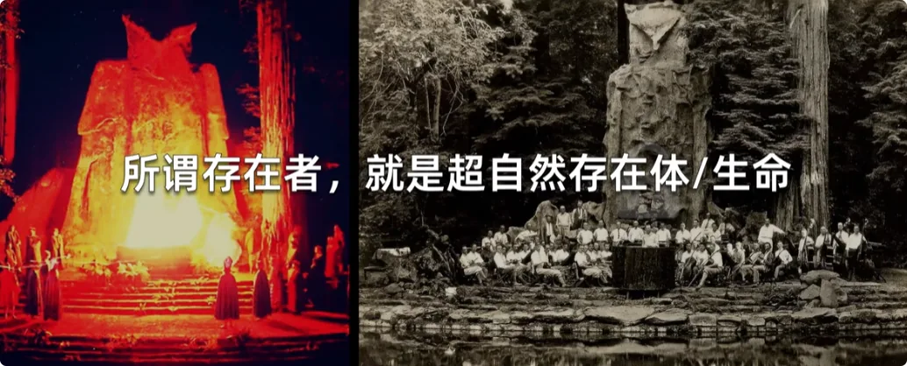

系统和存在者之间就是**计算机(computer)和用户(user)的关系**。

首先宇宙一定是有一个底层逻辑的，通过最基本最朴素的道理来运作。比如道德经里讲的道，朴素至极，合理至极，没有人会反对。**但大部分人类是通过现实生活去理解道的，只能靠现实经验去领悟道的规则，对于超自然世界是零经验的状态，因此无法理解更深层的含义。**

这里讲几个道延伸出来的超自然层面的现象：

**阴阳动态平衡**：宏观大世界整体趋于平衡，这是平稳发展的基石。世界运动发展靠的是局部的不平衡，不平衡是事物运动运作的根本。这两句的深层含义是
超自然能量中的正能量和负能量必然是等量存在的，既有好的存在者，也就有不好的存在着，两边等量等强度。

如果你想向无形世界拿什么，不管是能量气还是祈求神助，你都得先具备分辨的能力。太多人异想天开，缺乏严谨求证的精神，靠想象连接不明神秘力量，甚至只贪图一时的利益，不惜拿重要的人事物去交换，这都是非常危险的。
危险在于你和谁在做交易，你和他能否实力上绝对平等，背后引发的因果——直白的讲叫报应——你能不能担，你遭不遭得住。

其次，世界运动发展靠局部不平衡，也就是说不平等必然存在。人人绝对平等，拿一样的资源体验一样的人生，是不可能的事情，要如此，宇宙也没有开展的必要了。
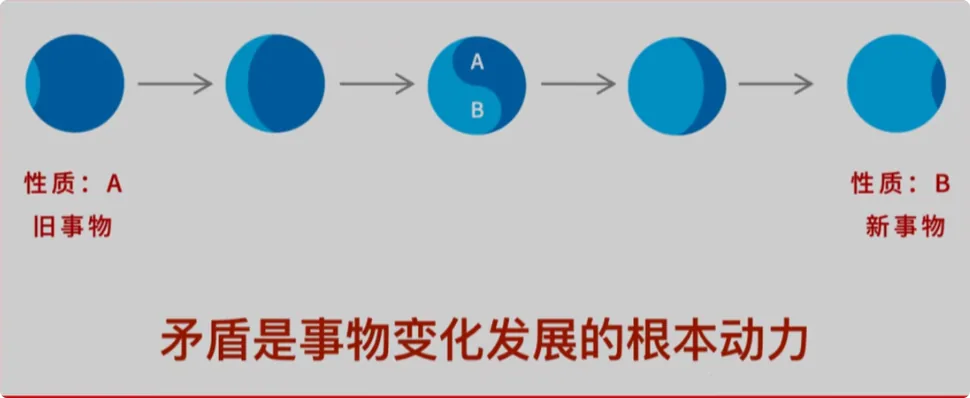

所谓众生平等，指的是在道法规则之下，每个个体修行求生、向上扬升所要接受的规则相等，考验相等。这就跟高考一样，只要上升的考核制度绝对公平公正，大世界的秩序还是稳定的。
所以上层得道者关爱和引渡众生的根本逻辑，不是来服务你的，而是以点拨教化你为主，甚至动用因果报应来提醒你。

因为你是考生，没有人能替你考试。

**阴阳互为作用力**：事物的发展离不开正反两种推力，成事成人都有正反两股力量相互推动而成就。想要好的发展，必然要面对或承受不好的事物，所谓逆境是成长的最佳土壤，未经世间险恶，难成真正圣贤。

所以大恶者有时是为了成就大善者才出现的。不要以为大恶者拥有这么好的资源，苍天就不公了。看看人类历史，整体最终还是螺旋式上升发展的，说明人格化的道还在。

阴阳互为作用力隐含的另一个道理是，阴阳不管哪一方增长，另一方也得增长，才能重归平衡。所以你看到不好的现象，在世界的其他地方一定有好的事物在发生，反之亦然。一个人能带出的力有多大，也就意味着能带出的害就有多大。**因此，任何人不管是凡人还是神仙，越往上走，招致的考验也越大，因为当个体的影响力大了，若其心性和行为仍无章法，那就必然带来灾难。**

阴阳合归太一这句话大家都听过，它在超自然界面最直接的含义就是存在一位太极，有着绝对的实力统合各界秩序。

他是道法的缔造者，也是道法的人格化。有了太极存在，再强的个体也得学会谦卑。

在太极的绝对实力之下，众生才得以修行，平等资源才得以有序分配，因果法则才得以落实。

若无太极，那到处都是无主之地，灵和博弈，黑暗森林熵增寂灭，道德二字也将沦为精致利己者口中的笑柄。

## 因果法则

其实因果法则是很朴素的，就是简单的种瓜得瓜。常人之所以能理解，是因为这背后的因果关系都是可见的。但我们的世界尤其是无形世界中是有很多事物是不可见的，常人没有经历过，没有建立相应的认知，所以无法预见深层次的因果关系。

举个例子：假如一个人心性不正，私底下干过很多缺德事。虽然没有人直接看见，但附近的灵体看得见。
人若作恶为乐，那就容易被鬼盯上，因为鬼喜欢作祟；
如果喜欢破坏物件，总有一天会惊扰到物件上的灵体；
如果直接或间接背负了人命，一定会缠上冤魂。
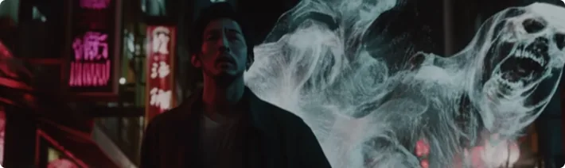

久而久之，那人身上跟着的鬼越来越多，人的能量频率就会变质，能量场由生机转向衰变，最后一定引发意外事故。
若发生意外死亡，以这人此时的能量状态恐怕还不好转世，要么当孤魂野鬼，要么转世到戾气重、鬼气重的家庭。常人观测不到无形世界的事情，故而不相信无形的因果业力，也因此大多数人都不会约束自己的言行。

那为什么很多坏人没有报应呢？报应未到无外乎以下几种情况：
1. 那人来历不凡，背后有更强的灵体相助，小报应到不到他身上。
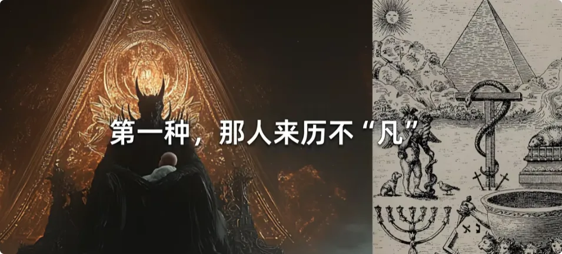

2. 那人身上有更强的能量相助，自身能量足够大时，就算出现一定的报应，他的运势也难败。

3. 那人当前被立为大恶人，是为了成就另一些人而出现的，受报还需延后。
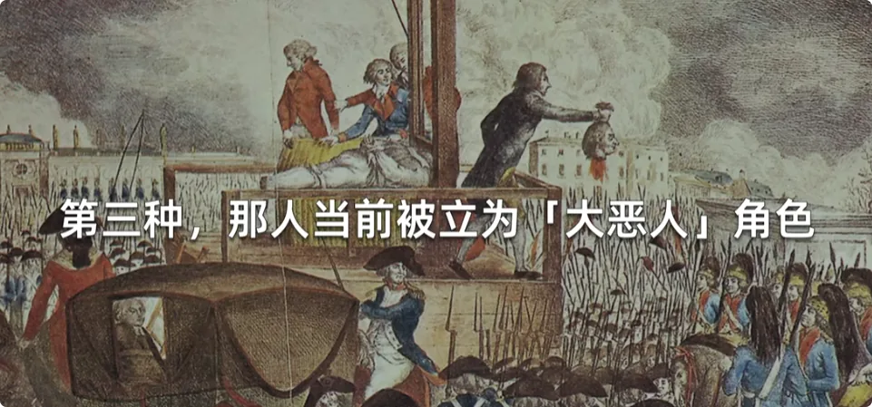

4. 一些人受的苦本就是这些人的报应，坏人只是来了结这些人的业力，当然坏人大概率又给自己种下新的因果。

5. 因果发展的时间尺度很长，业报还没来。这种业报一般都是集体业报，关乎一个家族或一类人群，等到合适时机才能出现。
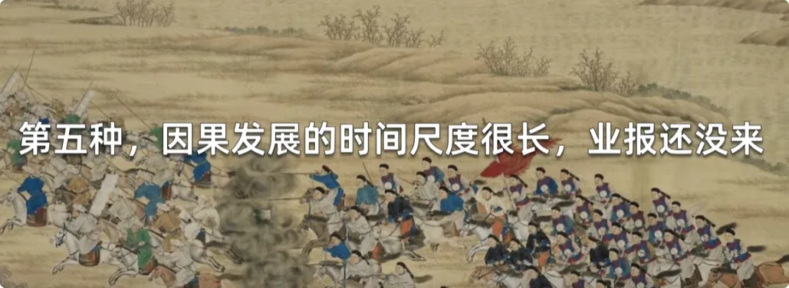

6. 大势所趋，不拘小节。人在地球上就一定是众生共业，人作为有形生灵之长，总是要背一些责任的，连动植物都要默默承受人类的业报。

从存在的意义上说，报应往往起到教化的作用。
**人教人教不会，事教人一遍就会。**
人类集体得亲自经历了才能领悟，才懂得调转车头，迷途知返。

最后，很多人认为善行善果，恶行恶果，其实这并不完全正确。我曾多次强调**善非功，恶非过**。
很多人做了自以为对的事情，其实都埋下了更大的恶意。只有修行修炼，才能把个人的智慧和眼界提上去，才能结束这些无穷无尽的因果业力。

## 高等能量与地球试炼场

生命并不只是一场随机事件，生命不只是简单的分子活动，还有许多无形的系统在运作。

***地球是挺特殊的。首先凡生命都是向往高纬度的，都是想要扬升的。***

向上走是生命的本能，对于无形的生灵来说，都想获取高等能量，扬升到高维度，这个过程就叫修炼。如果高等能量随机扔在宇宙空间，谁先占到地盘谁就能垄断，宇宙最终只会变成一小部分人的狂欢，这种宇宙没有存在的必要。

高等能量具备**精神和能量**两个层面。
从精神层面讲就是灵能，有个体对自我、对世界的深层认知；
从能量层面讲，就是改变外部世界的强能力，也就是神力。
能量越高者，带动因果的能力也越强。如果没有被约束，那宇宙各处都将是自封为神的巨婴。

所以为了回应宇宙各处生命对成长的需求，太一制定了严格的考核要求：
**有多少品性和灵性，就拿多少高等能量**。
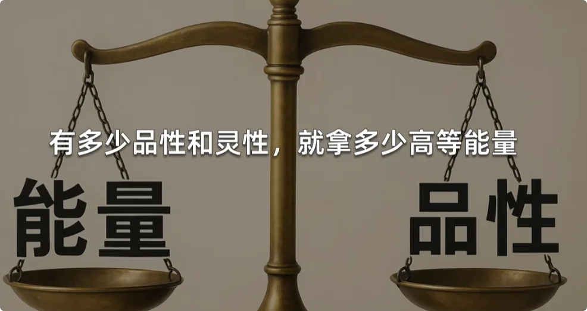

而这个试炼场就是地球。

太一将相当多的能量资源投射到这颗星球上，目的就是吸引众生在此修行、修正：
- **物理躯体**：人形是最有美感的一种形态，早在物理人类演化出来之前，人形就存在了。

- **寿命**：人被约束在100年左右，有利于缩短文明演化周期，防止常年一家独大。

- **能量系统**：日月星辰、山河湖海皆储存着一定的能量，能量的变化会具象化为气候地动等物理事件。

- **灵魂和转世系统**：人过百年必亡，死后将元神装进新身份容器，抹除记忆和修为，否则强者持续开挂，弱者就没有成长的机会。
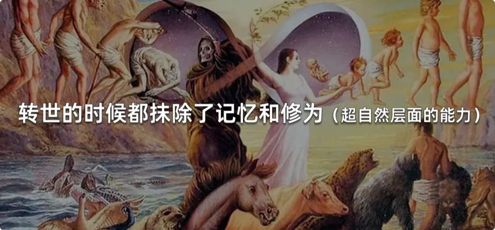

- **命运系统**：卵子受孕的那一刻起，新的灵魂就会接入天上星辰，地上山川的时空能量，此时就是光刻机不同的能量属性，在灵魂这张空白芯片上刻画出每个人的身份证。
- 个人按照各自的身份进入到众生共业里，但还是要说明规则仍是**七分天意，三分人为**，否则生命就没有存在的意义了，都成了NPC，虽然转世的时候都抹除了记忆和修为，但个体的灵根和因果还在，灵根是个体的根本意志，根底越强越能自主，命运反之根底，弱者要靠命运系统来帮助成长，要经历不同事的身份修炼根底
- 而因果系统存在的意义就好比投资，因为生命都是要规划未来的，付出，当有回报，个体可以通过因果来塑造自身，未来的环境和机会，其实啊众生自始至终规划的只有修行这一件事，只是常人离道太远，不知也不明

- **修炼系统**：人生自然是最适合修炼的，但该怎么修，还得规则的制定者说了算，自己给自己打满分没用。

- **冥府系统**：总需要一个能接纳亡魂的空间，以及相关的管理人员。
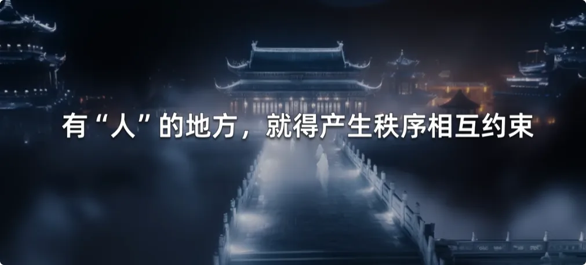

如果大家非要演化成25号宇宙那样，是可以提前关机重启的。
众生共业范围很广，人类之外的众生也在其中。如果人类无法修正自己，阻碍了更多众生的成长，那这场失败的试验不如早点重开。

## 人类之外的众生与求神

接下来我们来说说人类之外的众生。首先生命的基础是灵能，也就是有灵性的能量，有了灵性，生命才开始有自我意识，不同属性的灵性能量诞生不同的意识个性。

其次凡有形之物皆可接收和承载能量，当一个有形物体处在某个能量交汇的位置，不断被能量熏陶，直到能量中稀薄的灵性碎片积攒到一定程度，足够形成一套自我认知闭环，这个物体就会诞生自己的意识和能量体，也就是元神和灵体，也就是俗话说的成精。
从负能量中诞生出来的，俗称妖魔精怪；
而从正向能量中诞生的则是自然神灵。

最初的生命都是能量态，都是通过有形物体来塑造出无形能量体，通过吸收相应的能量属性来塑造个体意识。

所以在宇宙的漫长岁月中，早就诞生出了极大能量者，尤其是负能量大佬。不管是本土诞生还是外来的，他们都有着各自的社会体系，有自己的地盘，同样他们有建立自己的沟通规则。

一个祭司或巫师想要连接和借助大佬的能力，那么就要用大佬规定的符号、文字图像等等。在我之前的视频中提到过，创作出来的作品会带着创作者的能量，能量是跨时空连接的。有心的人类想要连接无形的大佬，想往无形世界中拨打一通电话，那就必须靠具体的意象来连通，否则大佬怎么知道是你找他，人家又没那么闲，天天待在你旁边守着你。
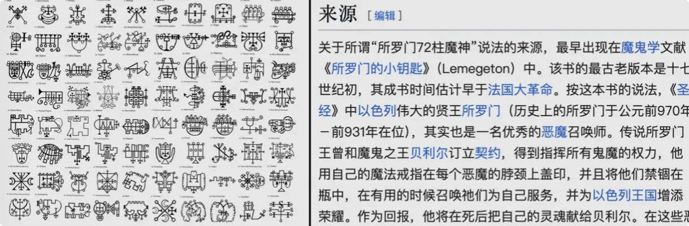

这也可以解释为什么教派总是层出不穷，为什么能有影响力。
因为大佬有很多，当你具备建立新教的潜力，他们可以帮你完成新符号、新教义的建立，也可以帮你搞出一些超自然现象。

那大佬为什么要帮这些人呢？

首先俗人之所求无非就那么几样，大佬是看不上的。

无形生命终究是为了能量修炼，不管他们愿意正向还是负向，他们总是要往上走的。除了正向修炼能量以外，人类的能量算是最好的一种选择，毕竟人类是神明以自身之姿创作吹一口气而诞生的产物。**所以与大佬的交易中，人永远是交易品，永远不可能平等。**

所以很多修行人引以为傲的修行方法，比如念什么咒语观想什么事情，做什么动作，摆什么仪式，其实都是大佬建立好的沟通规则

比如某<金华>就是某阴仙所作人，用自身能量气场练出来的这个丹，终有一日大佬会来一口吃掉。
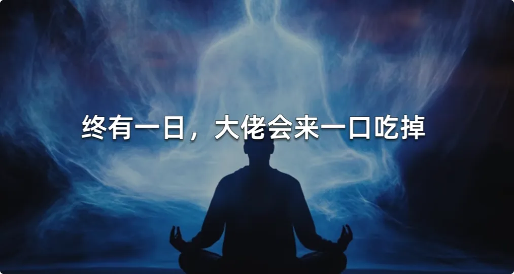

还记得前面说过阴阳平衡的道理，世界上有多强的神灵，也就有多强的魔物。
无形世界比的是手腕，强大的负能量大佬可以斩杀较弱的正能量神灵，也只有靠更强的神灵才能封印和约束魔物。

这也意味着人有弑神的途径，同样也意味着人类背负的恶业远比预想中要深重。

有人会问了，那这些大佬不会有因果报应吗？

>有是有，但人家毕竟比人类更懂因果关系，所以大多数时候，他们都是等着人类主动来求自己，事实上也确实如此，人类的欲望总是填不满，所以从缘由上讲，因果主要还是人类在背。

常人要记住，无知无明不是逃避业报的借口，也逃避不了，唯有修行才能解脱因果，不修行，放任无知，放任无意识伤害众生的行为本就是恶因。

还有人会问了，那修行人正信正念之人，为什么连接不到正神，借不到正神的力量呢？

1. 正神几乎不留沟通方式，就算有常人也接触不到。
2. 不是你想呼叫谁就呼叫谁，大多数人求神不过是求神满足自己的欲望，哪怕是声称维护正义，降妖除魔，都不过是满足个人欲望，而正神是不屑于与凡人做交易的，也不会出力干涉常人的因果。   
3. 大多数所谓的修行人并不是真正的想修行，或者说不理解真正的修行的意义，仍然是太过自我，太清高，太违心，放不下身段，学习何为道，神灵根本没办法教他。
4. 正神若真要出面，那也是关乎人类集体的大型因果事件，所以问问你自己，你什么身份？

## 破除信息茧房与修行真谛

自始至终我都是呼吁修行，因为只有修行才能让人真正的自主，才能让人逃离这个楚门的世界。不管你再聪明，你也无法看透楚门的世界，因为过度依赖可观测的事实，就意味着只需要把超自然部分从你视野中屏蔽，你的理性就能让你困死在信息茧房里。只需要把信息茧房里的推理结果导向弱肉强食，零和博弈，你就会义无反顾地支持和执行，最终你成就了恶业，成为了业报的牺牲品，甚至你都不会相信会有恶意，放手去做一堆不合道的事情。

想要破解信息茧房的唯一方法就是修灵智。

灵智会天然地让个体怀疑机械理性，有灵本就是反机械的。

灵智能让人接受和接触到不可见的事物，学习到超验的知识，比如超自然存在、深层因果关系、众生共业、自然之道等等。

看到的和体验到的世界更加全面完整，更有全局观，因此才能具备解决个体和集体困境的能力，才能规划真正有意义的未来。当一个人具备了这样的智识，也就有了跳出地面因果系统的资质和扬升的机会。

**也就是说，只有灵智才能给人最大的自主性，而灵智是怎么来的呢？就是修行得来的。所以修行并不是避世者的专属，相反修行是所有人的归宿。**

我是修炼者小烨，我们下期再见。

## 关于创世神话

> **真正的创世神话是不分国籍的，它与众生的修行、修仙息息相关。阴阳交替平衡，是亘古不变的道理。**

## 1. 创世并非从生命开始：死亡之神先塑造大地

### 巨魔以毁灭之力锤炼世界

大家好，我是修炼者小烨。今天我要讲一个大家没听过的创世神话故事。这个故事是我在修仙过程中了解到的一些事情，会用隐喻的方式说给大家听，也是为以后想修仙的朋友提供一些有用的信息。

其实真正的创世神话是不分国籍的，它与众生的修行、修仙息息相关。**阴阳交替平衡，是亘古不变的道理。**

每个星球在诞生生命之前，都必先经历死亡。熔岩、陨石和风暴，都是巨魔在有形界的化身；摧毁和破坏，就是他们的法力体现。亿万年间，他们不分昼夜地塑造大地，将大地所需的各种基本要素锤炼出来: 
- 熔岩塑造了大地，这便是**火生土**；
- 陨石砸在大地上，锤炼出了金属，这便是**土生金**；
- 风暴将不同的金相融，产生了水，这便是**金生水**。

然而，巨魔创造不出有生命力的火、土、金、水，自然也造不出有生命力的木。

**死亡之神已经工作亿万年，阴极阳生，生命之神开始工作。**

---

## 2. 神兽降临地球：真正的生命从山川大地中苏醒

### 神兽将神魂藏入山川，以自然之力孕育生命

听一位神灵说，早在神造人之前，有一群神兽从宇宙星空降临到地球，他们被委任创造地球的生命。

他们将神魂藏于大地山川，以泥土为血肉身躯，在大地上修炼。他们运用自身的调和之力，改变所辖领域的环境，并在地面上创造出生命。
1. 有一部分神兽藏身于**山之根**，其神魂与地下金属相融。当水流经他们掌管的金属，此水便有了灵性，灵水有意识地在水中创造了生命的肉身。
2. 还有一部分神兽藏身于**山之巅**。他们带来了真正的风雨，雷电不断调和大地泥土，改变土地的养分。

### 虫鱼鸟兽、草木石头，开始诞生灵魂

亿万年后，真正的**木**才得以诞生，各类生灵开始在大地上繁衍。
这亿万年间，凡深受神兽神魂、灵气滋养者，不论虫鱼鸟兽，还是草木石头，皆诞生了灵魂。
一些灵魂选择了正道修炼，成为了最早的一批**上古神灵**。

死亡之神和生命之神依旧交替工作，有意识地演化出最接近人形的生命，为地球的下一阶段做准备。

> **死亡塑造世界，生命赋予世界灵性；阴阳交替，大地上的灵魂也开始源源不断地诞生。**

---

## 3. 人类为什么会出现：成为凡间众生继续上升的渠道

### 人类，是生命体演化中的最后一种形态

大地上的灵魂源源不断地诞生，神灵也给众生创造了一条上升的渠道。
人类作为生命体的最后一个形态，将汇聚丰富的感知、情绪、思维、喜好，已经具备认知复杂世界的能力。
**人类会作为阴阳两界过渡的物种，接纳大地上的各类生灵，成为凡间众生上升的渠道。**
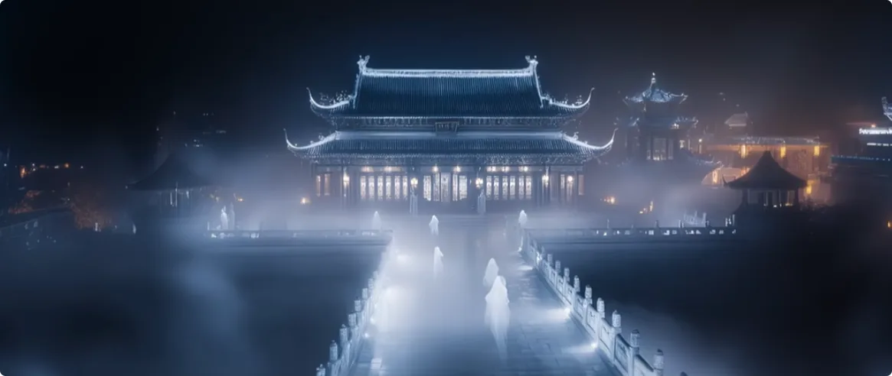

神明规定，每个人类胚胎诞生时，都会赋予一缕生气，如此每个人类都拥有自己的灵魂意识。

### 为了让所有灵魂都有机会成长，轮回系统由此出现

为了让所有的灵魂都有修行、成长的机会，神灵创造了**轮回系统**，用于分配灵魂；然后又创造了**地狱界**，管理逝去的灵魂。

神灵们随后陆续下凡人间。
他们教人制作工具、创造文字、耕作栽培、制定历法、发展思想、修身养性。

在最初，神灵是可以在大地上和人类一起生活的。那时候的大地还很干净。

> ***阴藏于阳，生存意味着死亡，得到意味着失去。***
> 
> ***不贪图阳，便不招致阴。***

---

## 4. 神为什么离开人间：真正破坏平衡的是人的欲望

### 生者怕死，得者怕失，人心逐渐失去平衡

然而，人类的心性做不到平衡。

>***生者怕死，得者怕失。人类思想之多，产生的欲望之多，执念深重。虽有神仙下凡，教人无为守静之道，然而大势已成。人之所得，本由天道有定；人却不满其所得，遂逆天而行，最终倒戈，以魔王为师。***

神灵们纷纷离开大地，返回宇宙星辰。

**神灵不再展露衣角，避免人类因得不到永生而癫狂。**

### 神之所以为神，在于“司其职”

神之所以是神，**司其职也**。
天道运转，或生或杀，行道必须畅通无阻，道不会为个体意志驻足。
故神者无私心：

> **观天之道，执天之行。**

成为道体的一部分，方才在天地之间得一席之地，得永生之寿。
人却想让万物为自己所用，有进无出，背道而驰。常有求长生者，行魔道而不自知。

---

## 5. 成神不是得到力量，而是千万年如一日地修出道心

### 真正难修的，从来不是神通

**道之大，非一日能悟。**
故成神者非一日之功，需要千万年如一日，不为生死得失所动，修炼出真正的**道心**，方才得道。

虽然神明隐匿了踪迹，但仍旧给真正证得道心者留下一条升天之路。
天神降下旨意：

> **宇宙神兽，便是升天的途径。**

成神者最终都要乘着神兽，抵达宇宙长空。

### 道心不足，驾驭不了真正的力量

但是，道心不够者，宇宙神兽便会在他的心中映射出**洪水猛兽**，反噬其心。
只有真正能够驾驭这股力量的人，才会成为新的神灵。
所以，所谓修炼，并不是有一天突然获得某种力量，而是让自己的心性，真正配得上那股力量。

> **千万年如一日，不为生死得失所动，修炼出道心，方才得道。**

---

## 6. 神兽为什么一直在等待：真正的有缘人，本来就在寻找“回家”的路

### 亿万年过去，神兽仍在静待有缘人

亿万年如一日，神兽一直都在静待有缘人。
他们离开天空太久，也该回家了。

我问神灵：

> “如何知道谁是有缘人呢？”

神灵说：

> **“真正的有缘人，在过往千万年的岁月里，长期接受神兽灵气的滋养。从心底里，他们是向往回到宇宙星辰的，不愿迷恋人世。”**

### 真正的有缘人，不需要被说服

神灵继续说道：

> **“你只需要把话带到，告诉他们该回家了。”**
> 
> **“真正的有缘人自然会共鸣。藏在内心深处对家的渴望，会迫使他们采取行动。”**
> 
> **“当他们来见你的时候，就是准备好修行了。”**

所以，这个创世故事最后所指向的，并不仅仅是“世界是如何出现的”。

从死亡之神塑造大地，到生命之神唤醒万物；从神兽播撒灵性，到人类成为众生上升的渠道；从神明离开大地，再到为真正有道心者留下升天之路——这一切最终仍旧回到一个问题：

> **众生为什么要修行？**

因为真正的有缘人，从来不是突然有一天才想起修行。

**那份想要离开凡尘、回到宇宙星辰的渴望，早就藏在心里。**

## 生命存在的意义：元神从何而来

> **生命个体存在的意义是什么？**
> 
> **从我目前在修仙过程中接触到的信息来看，其中一个结论就是：修炼永生。**

## 1. 人为什么会追问生命意义：五感之外，是否还有另一套世界

### 大多数人对生命意义的理解，都建立在现有经验之上

大家好，我是修炼者小烨。今天小烨要讲的是关于生命个体存在的意义，至少是我作为修仙者在目前接触到的信息范围内确定到的一些真相。大家且当个故事听听就好。

大家应该都想过，**生命存在的意义是什么呢？**

大多数人会觉得，人活着就一辈子，死了就没了，所以这辈子要任性地活，后人的死活跟自己没什么关系，觉得这辈子回旋镖打不到自己身上。而有些理科生觉得，生命的存在无非是基因延续自己的一种方式，容易走向黑暗森林式的极端思考。

说到底，大多数人之所以对灵性和玄学持批判观点，其实主要还是陷进了一种**经验主义**。因为对于人类这副躯体来说，五感接收到的都是物理世界，目前的科学仪器观测到的也是物理世界。大部分人不相信玄学，从认知经验上来讲也无可厚非。

换句话说，对于大部分人而言，只要能让他看到那个世界，他能一瞬间变成坚定的非唯物论者。

而社会上还有一小部分人，他们有过一些特殊的经历，远远超过他人，或者说大多数人的认知经验。这时你再跟他谈唯物论，他是不信你的。甚至有些人一辈子都认为万物有灵，人存在的意义不该这么简单，甚至觉得其他生灵乃至自然物存在的意义也不该这么简单。

### 科学与玄学为什么呈现出不同的知识形态

事实上，这世界本就是科学和玄学并行运作的。

科学之所以得以公开传播和发展，因为科学领域研究的是客观物理，也就是死物。死物无论怎么被研究，都不会因谁而改变。因此我们可以说，科学是稳定可控的。
**重点来了：**

> _**对于玄学的研究，那就必然意味着研究对象不是死物，而是一群无法被物理约束的活物。**_

在这个领域，很多真理都无法被人说了算，极容易因超个体而改变。那这样一种不稳定、不可控的知识力量，读过历史书的你应当知道它会被如何对待。

很多人会说：“凭什么相信你？人类现代文明发展的这几百年，从来没有什么超越物理的力量。”

这里小烨不做回答，但有句话说得特别好：

> **别看他们怎么说，要看他们怎么做。**

玄学之所以被雪藏，无非是压力还不到位，但是压力会持续增加，总有质变的时候。所以他们也着急，得赶紧想好怎么过渡、怎么跟大家解释才行。

如果你本身对玄学保持接受的态度，那不妨我们继续深入讲讲：**生命个体存在的意义是什么？**

天道和宇宙意志太过神秘，小烨也不敢轻易解读。因此接下来我会从我修仙过程中接触到的灵界和他类众生，也就是一些经验之谈，给大家讲讲关于生命意义的其中一个结论：

> **修炼永生。**

---

## 2. 从纯正能量到元神：生命意识究竟从哪里诞生

### 修行为什么必须先找到“上行清气”

自古修炼成神仙者，都离不开在天地间寻找**纯正能量**。换个词大家应该更好理解，叫**上行清气**。
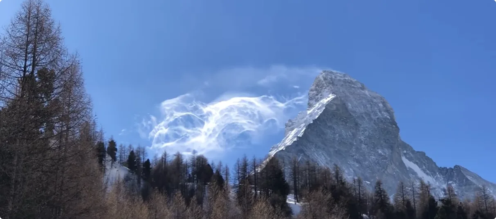

纯正能量也分层级。层级越高，自身意识和超感官所对接的维度也就越高，接触到的真相、智慧和法力才会更高。

**这就是为什么修行必须要先找到纯正能量。**

此外，纯正能量也是生命能量，顾名思义，是滋养万物生长的能量。灵魂的转生、细胞的生长，以及生命生衰之中的“生”，都离不开天地间的纯正能量。至于何时滋养、滋养多少，都是有定数的。

说到这里你应该明白，生命能量不是死物，而是有灵性意识的活物。正如我之前的视频谈到过：

> **灵体是能量体，反之，能量体也是灵体。**

因此，天地间不同地方的纯正能量，其实就是管理不同地区的神灵。神灵拿去滋养大地生灵生长的能量，其实用的是自身的一小部分魂魄灵力。

### 小白车的故事：当能量积累发生质变

这里不得不提一件亲身经历过的事情，方便大家更好地理解这其中的奥秘。

小烨出门寻找能量的时候，总会骑着我的小白车作为交通工具。它跟了我很长时间，陪我拜访过很多神灵的家。

理所当然地，它在旁边或多或少也沾到了不少纯正能量，或者说是神灵魂魄的碎片。日积月累，直到有一天我打算要换车，它突然开口跟我说：

> _**“请主人不要抛弃我。”**_

是的，你没听错。

**小白车诞生了自己的神识。**

车子作为灵性能量和神识碎片的载体，积累到质变之时，诞生了自己的意识。你们可以回想一下东方的很多神话里，为什么常有石头成精、物皆有灵的说法。

而这个刚开始诞生神识的地方，就叫做**元神**。

> **所以并不是“万物有灵”，而是“万物可有灵”。**

从这个角度，我们再复盘一下玄学领域常提及的那些生灵，是不是更好理解它们的存在了？

---

## 3. 元神并不只有一种：妖、怪、魔、鬼、精灵与神灵

### 不同载体、不同能量，诞生出不同类型的灵体

1. **妖**
    
    专指从动物或植物载体上诞生的意识，是靠负能量修炼后的灵体，统称为妖。
    
    要注意的是，如果动植物生前没有诞生意识，那死后就没有灵，也不成妖。所以，并不是说万物有灵，而是**万物可有灵**。
    
    妖类会根据其原有动植物特性而具备相应的元神特点。一般情况下，动物中的狐、蛇类更容易诞生妖灵。民间常提狐仙和柳仙，其实就是有些法力的狐妖和蛇妖。
    
    很多文艺作品里都提到过他们，其实他们也参与了创作，可见他们的元神特点。他们转世或附体的人，都会具备相应的外表、性格和能量特点。
    
2. **怪**
    
    由病菌、**瘴气**甚至煞气等特殊物体承载负能量而诞生意识的灵体，无特定的形状。
    
    最近大家比较关心的哀牢山，那里面的迷雾可是真的一整片会动的怪物。那些古怪的地方，怪类就多。大地上不是每一块土地都拿给人类开发的，人要有敬畏之心。
    
    比起妖这类生灵，我还没有遇到过转世成人的怪类修炼者。也许比起动物和植物，这类生灵的元神更缺乏感情和理性，难以理解道德秩序。
    
3. **魔**
    
    这一类生灵的存在尤其古老。也就是说，修炼千万年、上亿年的大魔不在少数，负能量量级更是恐怖如斯，连天上和地上的一些神灵都不是对手。大魔存在的维度也是很高的。
    
    要说魔类的来源，小烨也只能猜，大概是两极相生时就诞生了对立面，其分支造就了一个个魔。又或者说，他们可能诞生于心魔。
    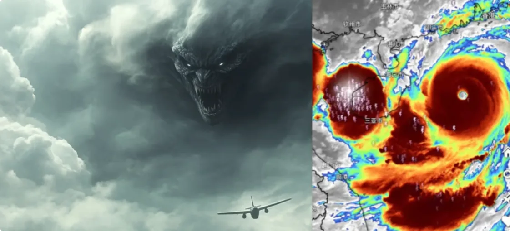
    
    因为我发现，只要人对一些东西产生执念、掌控欲，比如金钱、地位等等，他们就会立马出现。
    
    但并不是说魔类永远是恶人。相反，**两极合归太一，众生终究是要臣服于天的。** 因此，魔类元神的修行人其实不在少数。
    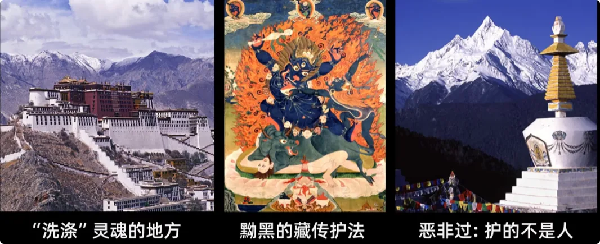
    也许是魔类世界太过残酷，我身边遇见的魔类转世的修行人，连修仙都特别卷。
    
4. **纯凡人元神**
    
    指第一世就在人身上诞生的元神。
    
    纯凡人元神最大的特点就是私欲重，且被当前五感所限制，对灵界没什么经验。纯人修行人很难想通修行需要修炼能量，很难想通灵界的交换规则。
    
    这也意味着，纯凡人元神的个体难有修成的机缘。当然也有幸运儿，纯凡人元神若能珍惜修炼机缘，也有机会修炼成地仙。
    
5. **鬼**
    
    很多妖魔转世成人，死后可能会被家族带回老巢，保留原来的特性。所以，“鬼”字专指人类死后的灵体。
    
    鬼类要么流浪街头排队等轮回，要么学会找能量修炼。做鬼后开始修炼并修成厉鬼，一般都会尊称一声**鬼仙**。
    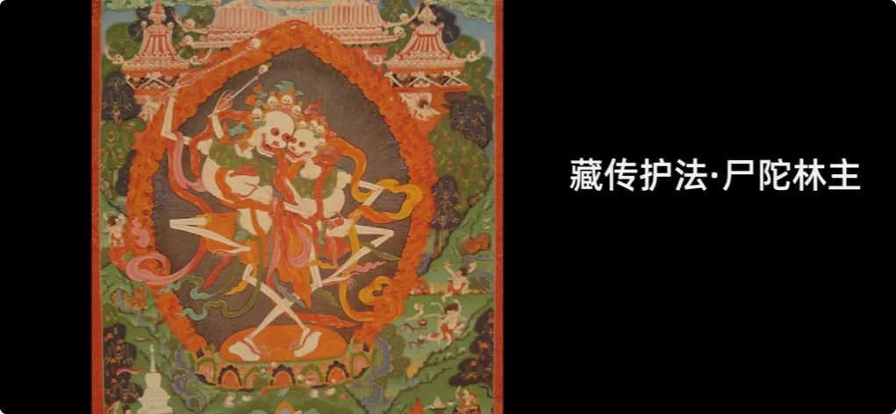
    鬼元神和纯人元神之所以有区别，是因为鬼已经失去了人身的一些特点，且自带的煞气更重，修行的方式已经产生差异。
    
6. **精灵**
    
    专指在纯正能量附近修炼的动物、植物甚至玉石等。
    
    近水楼台先得月。很多动植物生长在能量节点附近，得到了当地神灵的点拨，诞生了元神并开始修炼，久而久之还能化形。
    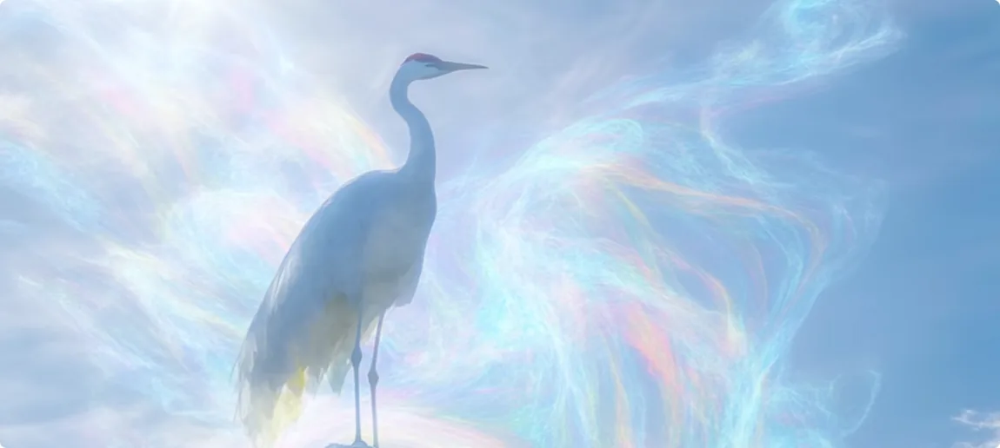
    
    不同的元神也是各有各的法力特点。比如很多灵树、灵草，就非常擅长治疗负能量造成的阴病。
    
    也因此，精灵类也属于神灵类，这类就属于**赢在起跑线上**。人类真的算不上什么。
    
7. **地上神灵**
    
    专指滋养一方生灵的神灵。
    
    大地生命诞生之初，地上神灵就开始修炼。这里就要回答前面我提到的问题：为什么神灵要用自身的一小部分魂魄灵力去滋养生灵？
    
    是因为**天道使然**。
    
    天上会泽于大地，天上把纯正生命能量源源不断地传向地面，地上神灵以此修炼而生。地上神灵承接天命，再向其他生灵转移自身的生命能量，推动地上生灵的生长和发展。
    
    在东西方创世神话中，神明给人吹了一口气，人类就此诞生，就是这个意思。
    
8. **天上神灵**
    
    指所有本就诞生于天上，或者从地上修炼上去的神仙。
    
    其实古今中外都记载过一些特定的大神，只是名字不一样罢了。
    

---

## 4. 灵界最底层的生存规则：为什么所有灵体都必须“修炼”

### 灵体存在本身，就需要不断消耗能量

论天上神仙还是太过遥远，让我们回头看看普通的生灵、普通的元神，一级玩家都是怎么生存的。

之前我的视频就讲过，灵界是很残酷的。死后当鬼可不是什么好事。

**灵体湮灭可不是安乐死那般轻松，比肉身死时承受的痛苦还要难受千万倍。**

如果不敢湮灭，那就必须生存下来。而灵体作为能量体，存在就会消耗能量，想要生存，那就必须想办法吃进新的能量。
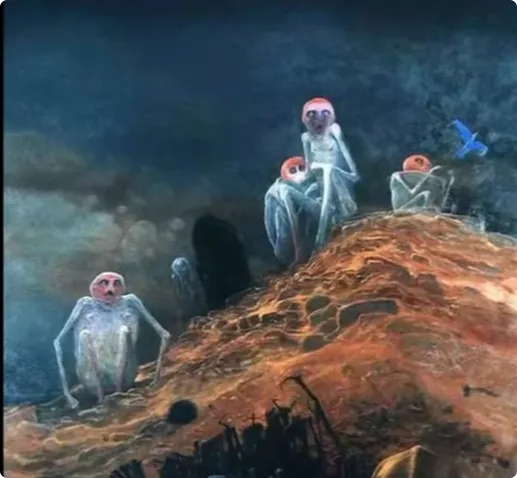

常人很难想象，大多数的亡魂跟疯狗一样抢食能量残渣是什么情景；很难想象，那些连疯狗都比不上的低阶灵体，饿得动弹不得又求死不能是什么情景；同样也不知道，那些厉害点的灵体都在如何想方设法地从活人身上搞到能量。

### 七情六欲会产生不同能量，这就叫“同气相求”

因为人的能量场会受自身七情六欲而改变状态。当思绪、欲望过重的时候，就容易过度产生某一种能量：

- **性欲产生的能量**，主要是妖类在吸收，因为符合动植物繁衍的特点，也就是符合他们元神修炼的特点；
- **贪念、执念、掌控欲等产生的能量**，主要吸引魔类元神；
- **生病、虚弱过程中产生的能量**，则符合怪类元神修炼的特点；
- **抑郁、戾气、杀欲**，则容易吸引鬼类。

> **不同能量吸引不同的灵体，这就叫“同气相求”。**

在这种吃上顿没下顿的生存条件下，所有灵体都想方设法地摄取能量，壮大自身的能量体、灵体，而这个过程就统称为**修炼**。

借助修炼，个体拥有了更强烈的自我意识。也许迫使生命集体发展自我意识，就是宇宙意志本身。

### 修炼解决生存，修行则是从浑浊走向纯正

而那些拥有强大能量体的妖魔鬼怪们，并不意味着他们就没有了后顾之忧。

我们前面提过，**能量是分层级的**。

负能量所处的维度浑浊不堪，没有谁愿意一直待在脏的环境，没有谁愿意拥有浑噩的意识。

因此，这些大佬最终都是想走上正道的，顺应天道，争取纯正能量来修炼，修身养性，成仙成圣。

这个过程就称之为：

> **修行。**

也许让生命集体明白修行的意义，就是天道。

---

## 5. 有缘人为什么要转世成人：舍弃旧灵体，重新争一次正果

### 很多修行人，转世前已经修炼了很久

换而言之，相当多有机缘的修行人，也就是有缘人，其实是妖魔鬼怪的元神转世而来的。

在他们转世前，诸位的能量级别都可以说是大佬。然而，他们心甘情愿地归顺天道，给神灵们打工过相当长的一段时间，也遵循天道修炼、修行。

最后，其德行和心性通过考核，才争取到这次转世成人、获得纯净能量修行修炼的机会。要注意，这里的字眼是：

> **在转世前给天道神灵打工，德行和心性先得到了认可，争取到真正修仙的机会，他们的元神才舍弃原来的灵体，以人身再生，以人身重新开始修炼纯正能量，去修成正果。**
> 

在没有得到天道神灵的认可前，没有谁敢轻易放弃修为，直奔人间。

没有认可，意味着来人间也没有机会得到纯正能量，更别谈修炼成仙了。

### 为什么修炼不是“每个个体天然拥有的权利”

有人会问：

> “为什么要经过天道神灵的认可，才有缘分修行修炼呢？难道修行修炼不应该是每个个体的权利吗？”

当然不是。

修炼成仙，就意味着天地间有一处**纯正生命能量资源**划归给某个人。
若非道德极好之人，天道怎可能让他随意占为己有呢？
如果连个体的德行和心性都不考核，那么此等顶级资源早就被无德、无底线之人垄断了，还有普通人什么事呢？

> _**所以谁成仙成圣，都需要经过天道神灵的考核和认可。**_

因此，所有因为这个契机转世成人的修行人，在这一世是被天道神灵注视的。
会有一双看不见的手，迫使他们重新找到修行、修炼的路。
自己过往种下了因，今生寻求修成正果，再加上神秘力量的助力，**三者之合，才是人们常提及的“修行的缘分”。**

---

## 6. 人身才是最后的考场：以凡人之躯直面人心与贪嗔痴

### 有缘，不代表这一世一定能走回正道

但并不意味着转世成人的有缘人，就一定会走回正道，就一定能修成仙。
因为想要成仙者，还得经得住最后的考验，也就是：

> **以身入局，以凡人之躯直面人心和人性的阴暗面，证明自己具备极好的心性。**

相比其他生灵都专注于修炼，人类是所有生灵中最复杂的一个。
人的私欲可以创造出许多事物来体验，每样都可以带来快乐，也可以带来痛苦。**顺逆之间，可见贪嗔痴。**
*人心可以一念成佛，也可以一念成魔。*

任何一个有缘人，身为人时，该面对的人是一个不少：家庭、爱情、生儿育女、工作生存、人际、事业、名利乃至健康等等，就看个人怎么选择。

有的修行人就迷失在其中，而有的人则能顺利回过神来。

### 为什么不同修行人的人生难度并不相同

这其中的差异，与有缘人背后的**根底和来历背景**有关。
修炼者都是独立的个体，不仅根底上有差异，其来历背景也有差异。

1. **从根底上来说**
- 有些修炼者本身的悟性就高，因此此生看待人世和修行都比较通透；
- 有些修炼者原来的修为高，此生在遇到修炼的正道时，唤醒的感知力也是他人不可比拟的；
- 有些修炼者来自精灵类，以同气相求的原理，此生受灵体干扰较小，劫难较少；
- 相反，那些来自妖魔鬼怪类的修炼者，此生不可避免地面对灵界同类的折磨。

1. **从来历背景上来说** 
- 有些修炼者在灵界可能有师父或同修，此生会得到一些帮助，帮助他们加速开悟；
- 有些修炼者可能本身就是某神仙的徒弟，此生早早就步入正道，连人世的很多考验都免了；
- 而有些修炼者可能没有什么背景可言，此生必定相对艰险。

---

## 7. 为什么痛苦常常成为“唤醒”：只有放下尘世执念，才能重新找到路

### 天道会允许尘世不断挫败有缘人

但最后无论是什么根底和来历，天道神灵都一视同仁。
允许并派遣灵界众生去挫败有缘人，挫败他们在人世间珍视的一切。
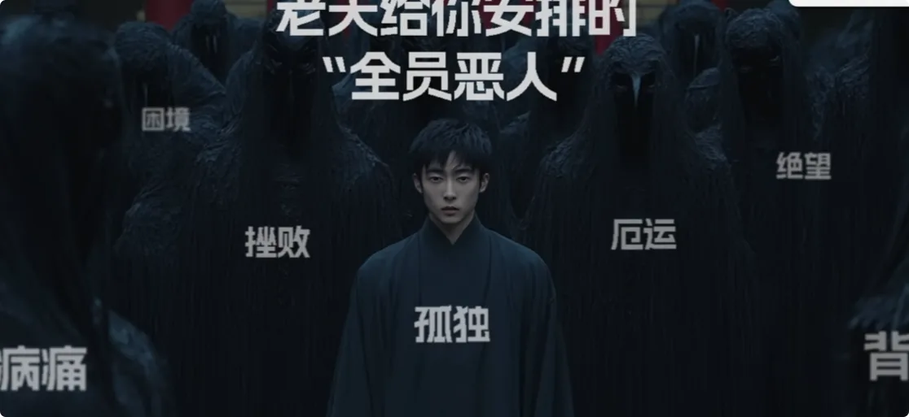

**只有让他们放下尘世的执念，才能重新唤醒有缘人的修行意识，才能将他们带回正道，才能将珍贵之物交与他们。**

对于有缘人来说，回归正途之前所承受的一切痛苦，其实都来自于天道神灵的爱。
正因为天道神灵知道，对于有缘人来说真正珍贵的是什么，才会剥离不属于有缘人的东西。

大多数有缘人都是在失去人间很多东西，甚至到鬼门关走一遭后，才想起要修行。
他们内心深处产生强烈的孤独感，感觉自己不属于人间，好像有什么特别的事情要去做。

也恰似此时，时机已成，神秘力量才会将其引至引路人。

### 真正见到引路人以后，神灵就不再替你选择

而有缘人见到引路人后，能不能辨认，并选择留下来修行，就是由有缘人自己的心性决定的了。

**神灵不再干涉。**

最后能醒悟过来，寻得纯正能量修炼的人，才算是世间真正的修行人。
接着开始第二轮的考验，也就是：

> **考验修行人对天道坚不坚定。**

而那些此生没能走回修行道路的人，天时已过，下一世再无修炼的缘分。
他们失去了原来的修为和身躯，想要再次修行就难了。

---

## 8. 回到生命存在的意义：人类本身，就是众生修行的一环

### 得到人身，本应该是一件值得珍惜的事情

人类作为众生的一员，不可能不修行。

**人类被创造和存在的意义，本身就是众生修行的一环。**

而本轮人类文明又在追求些什么东西？答案也是显而易见的。
前面已经提到，底层灵界的生灵苟延残喘，无不渴望性命。
*得人生，本是一件值得珍重、值得珍惜，应该修行修炼、继续往上走的事情。*

如今却搞得连在世者都过不下去，甚至人类集体都不再愿意相信天道，也不愿意行善积德。

可能大多数人会说：

> “若天地神灵知人之苦楚，又为何不出手相帮呢？”

请问，无数生灵都渴望苍天主持公道，渴望有一个修行修炼的正规渠道，而人类作为修行的一环，**人类自身又以何种诉求要求着天地神灵呢？**

也许正如天道神灵心怀慈悲时，以强硬手段唤醒有缘人类一般，面对人类集体，终究也需要以同样的手段，剥离不属于人类集体追求的东西。

> _**生命不是得到一副肉身以后，任由这一世自然消耗殆尽。**_
> 
> _**从元神诞生，到摄取能量、壮大意识，再到由修炼走向修行，生命始终都在面对同一个方向：不断向上。**_

我是修炼者小烨，我们下期再见。

## 灵魂晋升运转的三界轮回图鉴

> https://www.youtube.com/watch?v=mW7J_DJdbP4  
> 

## 开头引子: 
一提到修仙，你是不是立刻浮现出御剑飞行，呼风唤雨？一说到境界，你是不是满脑子练气、筑基、金丹、元婴？别被现代的修仙小说给洗脑了。你知不知道，那些所谓念经打坐、练功炼丹的正统传承，在几千年前的祖师爷眼里，不过是把自己练成了一只比较清纯的鬼。真正的修仙，跟那些花里胡哨的东西真的半毛钱关系没有。古往今来真正留下来的典籍，最核心的只有四个字，***"阴尽阳纯"*** 搞明白这四个字你才能知道修行到底应该怎么修。
> *其实是修成了 "鬼仙", 并不知道 道法真谛, 而是幻想的路径*

今天这期视频，我就带你挖一挖古籍里的真相，详细拆解这条修仙通天路径，彻底说透你从哪里来，你为什么会来人间，这一世又能修到哪里。看完这期你会明白为什么人身难得，也会真正理解这一世到底要怎么选。
知道自己来历或者正在修炼的同学，这一期建议你对号入座。还是那句话，我的视频只给看得懂的人看。拿好小板凳，我们直接开讲。

### 仙魔的定义
要讲清楚修仙路径，我们就必须先重新定义什么是仙，什么是魔。
如果你的理解还停留在仙就是好人，魔就是坏人的阶段，那后面的内容你都会理解错。**天道从来不用善恶来划分仙魔，天道只是规则，也只看规则**。

我口中的仙和魔，不是两个具体的物种，而是三界中两套完全不同的修炼体系。
- 所谓**仙**，是所有通过正能量修炼的生命统称，神仙佛菩萨本质都属于这一套体系。只要你顺着天道运行的规则，吸收正能量，在正能量的世界里不断成长，你走的就是修仙之路。
- 而所谓**魔**，是所有通过负能量修炼的生命统称，妖魔鬼怪本质上都属于这一套体系。只要你逆着天道的运行规则，吸收负能量，让自己不断地壮大，你走的就是修魔之道。

所以，一个生命是仙还是魔，不看它叫什么、长什么样，也不看世人如何定义它，唯一的评判标准就是身上气的本质和来源。所以，如果仙背离了天道，照样会被一巴掌拍下来；魔如果想向善改过自新，天道也同样会给他上岸的机会。
> ***大道无情, 也最公平***

### 气的分类
既然仙魔的区别最终落在气上，那么接下来就必须分清天地之间到底有哪几种气。气的划分和仙魔系统相似，分三大类：

1. **浊气**——也就是魔道系统用来修炼的气，包括但不限于鬼气、妖气、魔气等等。他们的名字不相同，但本质是一样的，吸收的越多，生命就越往下沉。

2. **凡气**——指的是凡人的阳气，主要作用是给肉身提供生命能量，让人活着，但它不能支撑你脱离人间，更不能让你飞升。为了避免和古籍里面的纯阳混淆，我们统一把它叫做凡气。

3. **清气**——也就是仙道系统用来修炼的气，包括但不限于灵气、生气、真气等等。它们之间等级不同、功能不同，但是这些暂时都不重要。你只需要记住，天地之间只有这种更高级、更纯净的气才能帮助人类脱胎换骨。古人云“清气上升，浊气下沉”，说的就是这件事。人想往上走只能用清气。

看完了这两套系统，傻子都该知道怎么选，那我就默认你想走的是仙道系统。

### 修仙的本质: 
那修仙的本质到底是什么呢？从古至今，**仙道系统修炼靠的是口传心授**，所以我从来都不建议大家自己翻古籍，真正的功法从来不会写在书里。但修炼的路径多少会留下一些痕迹。为了把这一条轮回晋升的路径讲清楚，我翻遍了古籍，把散落的线索重新梳理拼接，尽可能还原出一张完整的灵魂轮回晋升图。至少目前，这应该是全网最详细也最接近真实规则的一版。

在《钟吕传道集》中有这么一句话，用大白话说就是：
纯阴的是鬼，也就是在下界这一层；
纯阳的是仙，也就是上界的这一层；
纯凡气或者阴阳相杂的都是人，都在人间。
其中最关键的一句是：*只有人可以为鬼，也可以为仙，是两个系统唯一的通道*。
> ***人是中间的一个过渡态***

你看，**人鬼仙的区别，说白了就是阴阳能量比例问题**。能量的比例决定了你的物种和层级。但这里有一个特别容易混淆的概念，很多人一听到纯阳就以为指的是男人的阳气，或者是凡人的阳气，甚至觉得人的阳气就是可以拿来修炼的高级能量。这几个理解都是错的。你想想: 
- 如果纯阳是男人的阳气，那男人岂不是个个都该升天了？
- 如果指的是凡人的阳气，那婴儿出生时阳气最足，那岂不是婴儿一出生就是仙？这逻辑显然说不通。
所以古籍里的纯阳，指的就是我们刚刚说过的清气；纯阴指的是浊气，跟男人、女人、老人、小孩都没有关系。

**普通人的一生，是顺着肉体生老病死的规律，不断消耗先天的凡气，又被后天的浊气腐蚀，最终凡气耗尽，变成纯阴走向死亡。**
**但真正的修炼恰恰是反着来的——清掉浊气，替换凡气，汇聚清气，最终阴尽阳纯就成仙了。**
这就是道家传了千年的一句话: **"顺则凡，逆则仙"**, 这句话很多人都听过，可是没几个人真正搞清楚到底该顺什么、逆什么，
于是自己搞出一套又一套的理论，什么逆人性、逆欲望、逆自然生长规律，说什么的都有。
还有人喊出“我命由我不由天”，觉得修仙就是逆天。人是什么渺小的玩意，逆天只会被天拍死，不会成仙。
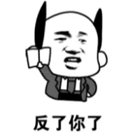

## 玻璃杯模型: 
搞懂了阴尽阳纯这个物理公式，你可能会问修炼的过程到底是什么样子的。别急，我给你举一个生动活泼的例子。
假设我们每一个人的身体都是一个容量为100的玻璃杯。出生的时候，这个玻璃杯是完美无瑕的原装状态，里面装满了100%的凡气。
如果一出生就开始修炼，那么事情就变得很简单了，你只需要不断地用清气替换掉体内的凡气，这个过程就叫修炼。随着清气不断地累积，凡气会越来越少，玻璃杯的材质也会一点一点地蜕变，容量会越来越大。哪怕你只是替换了1%的凡气，你都已经是开始增加修为了。
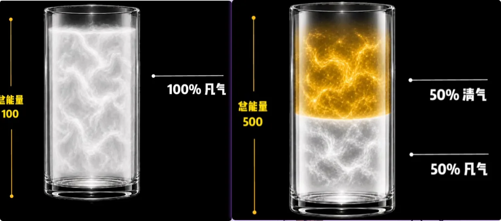

但是绝大部分的人不可能一出生就开始修炼。
随着肉体的衰老、欲望缠身、负能量吸食，体内的凡气会不断地被浊气侵蚀。更可怕的是，浊气腐蚀的不仅仅是杯子里的凡气，它还腐蚀整个玻璃杯。
假设一个人到了中年，凡气被吃得只剩下50%了，另外50%不仅被浊气填满，玻璃杯壁也被腐蚀得千疮百孔。这个时候人突然醒悟开始修炼，你知道他要付出多少倍的代价吗？
1. 他得先用50的清气冲掉50的浊气；
2. 他还要再花大量的清气，把这个破破烂烂的玻璃杯一点一点地修好，不修的话，往里面填多少就漏多少，烂杯子是没有办法修成纯阳之体的；第三，等杯子修得差不多了，才慢慢开始往里面填上清气，替换凡气，改变材质，扩大容量。听明白了没？**这个时候你真正的修为才开始，前面漫长的岁月都只是在修补。**
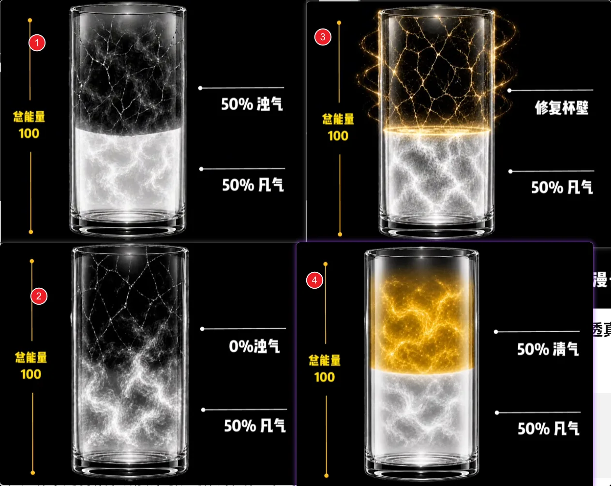

所以，婴儿拿到的是完整的杯子，直接开始换水就可以了；而一个中年人是先清理淤泥，再修补漏洞，最后才有资格开始换水，修炼难度和耗费的清气直接翻了好几倍。

那如果一个人的生命到了末期呢？如果一个人的凡气被吃得只剩下10%了，生命也只剩个一年半载了，而这个玻璃杯早就破得稀巴烂，这个时候想修炼，慢慢修时间不够，直接灌身体又承受不住，大罗金仙来了也救不了。
唯一能做的就是攒下些正能量，让灵魂少受点罪，争取下辈子投个好胎。这就是为什么我一直强调修行要趁早，杯子破得越少，你修补的成本就越低；被腐蚀得越少，你离阴尽阳纯的距离就越近。
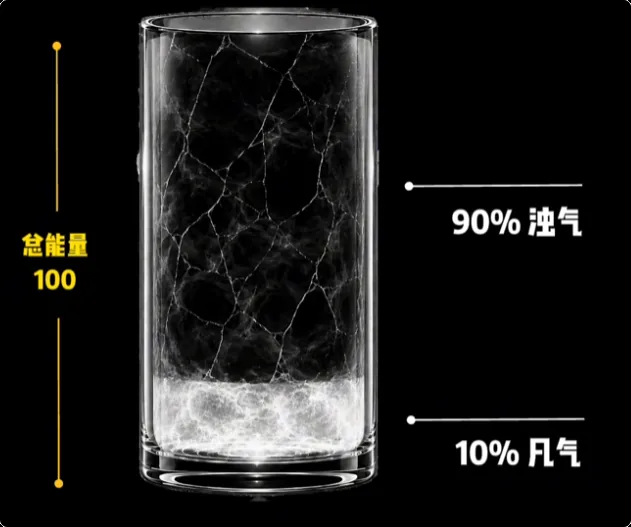

但是，千万别以为开始修炼以后就一劳永逸了，浊气就不会再进来了。不是的，只要你还活在凡尘里，你就会遇到各种各样的负能量，一层一层地吃掉你的凡气，你只能不断地清理、不断地补充清气、不断地修补自己。
螺旋式上升也是修炼升级打怪里面的一环。所以，修仙根本不是你退休后的消遣，而是一场你和负能量、和生老病死之间的赛跑。
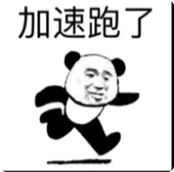

## 灵魂轮回晋升图
知道了修炼为什么要抢时间，下一步就要看清这一条路到底分几层，你现在又站在哪里。古籍里对仙的等级早就有明确的记载。
葛洪在《抱朴子》中按照肉体和灵魂的比例把仙分为三等；《钟吕传道集》分得更细，按阴阳的比例分为五等。
两套分法的名称和细节并不完全相同，但都在描述生命从下往上晋升的大致框架。以今天的规则来看，古籍里的部分内容已经不完全适用，但基本层级依然可以参考。不过这些理论名词都不重要，咱们还是用最直观的能量值来画这张**轮回晋升路径**。先声明一下，数字只是用来代表相对量级，而不是实际的数值。
如果把修仙比喻成高考，那么一个生命体的总能量值就是高考总分，高考总分就决定了你是上二本还是211。
假设凡人的初始能量值为0，人如果往上走有5个等级，每个等级都有分数线。比人低一层，同样生活在人间的有动植物和石头；再往下就是妖魔鬼怪所在的负能量的世界，也有分数线，不过是负数。
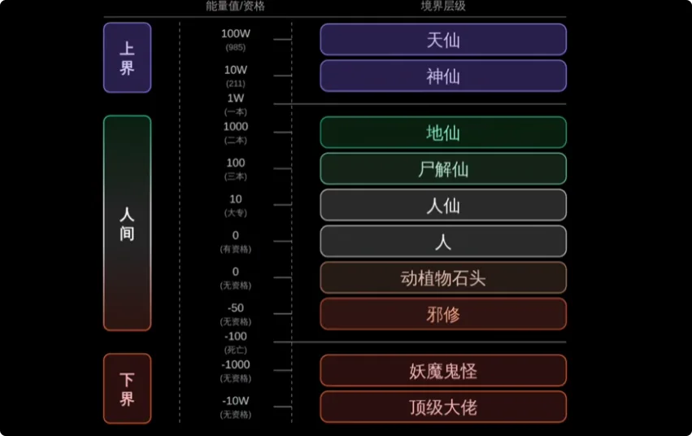

按照正常的逻辑，接下来是不是应该从人开始一层一层地往上讲？错。在带你们去看高维的世界之前，我们必须先认清一件事情：这个时代能真正往上修的人是很少的，但是走错系统的人却很多。所以在讲人怎么飞升之前，我们要从人以下说起。我们一起去看一看，**一旦一个生命体往下走，想上岸拿到考试资格到底有多难**。

### 动植物也能修炼？
先说离人最近的是地球上的动植物、石头。你没有听错，动物、植物，甚至连石头都是可以修炼的，而且它们和人一样也可以往上走或者是往下走。
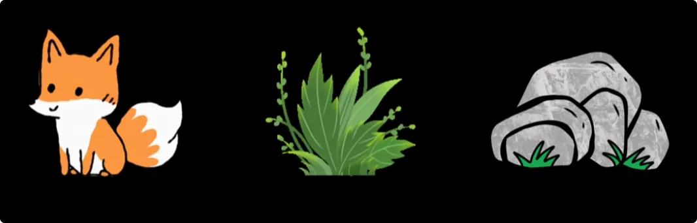

葛洪的《抱朴子》就提到“千岁之狐”“千岁之鳖”“千岁之木”，都可以幻化出其他东西，至少说明一点，古人很早就认为动物、植物、石头确实是可以修炼生出灵智的，甚至拥有神通变化。
传说上古时期地球上灵力充沛，动植物、石头吸收了日月精华，是可以直接飞升成神仙的，所以很多上古大神就是这么修上去的。但是后来天道发现了一个bug：动植物没有经过人性的磨练，思想太简单直接了，飞升之后质量好像有点参差

于是后来这条路就被封死了。所有的非人生命都必须经过人间试炼场，拿到人身才有资格继续向更高的层级进阶。

就拿我们最熟悉的狐狸举例子：假设一只狐狸它运气非常好，出生在一个清气极其充沛的福地洞天，日积月累吸收清气，当正能量达到100，开始生出灵智，主动修炼的那一刻，它就不再是一只普通的狐狸了。这种完全依靠清气修出灵智的生命，我们统称“山精水灵”。如果它们不争不抢，万年如一日地修到了1万，其实已经强大到可以脱离地球了，但是他们没有直接的晋升通道，强行飞升是会被雷劈的。

于是天道安排他们转世成人，修为清零，通过人生继续修炼。其实这辈子能够拿到修仙机缘的，很大一部分元神根本就不是凡人，而是动植物或者草木灵转世投胎的。如果有一天你测出来自己的前世是一个动植物灵转世，那么可以回来再看看这一段，就知道你自己是怎么一路修上来的了。

山精水灵转世的修行人，虽然记忆修为都被清零，但是灵魂不会白修，那些靠清气一点一点修出来的底子，会跟着元神带过来这一世。所以这一类修行人转世命都比较好，容易出生在不错的人家，一旦接触正能量修炼，能力苏醒得也比较快。

那如果是走另外一条路呢？
动植物、石头吸收的不是清气，而是浊气。当负能量不断地累积，同样也会生出灵智，当强大到可以不受原始形态的束缚，就变成了妖。一旦掉进妖魔鬼怪这一层，想回头可就不是修几千年几万年能解决的事了。

### 鬼仙是什么？
人也一样，人同样可以往上或者往下。往下的路十万八千条，但往上的路只有一条。只要修炼拿不到纯正能量，就是往下走的旁道邪修。
你知道这种旁道邪修走到顶级，修炼到顶峰是什么概念吗？市面上那些所谓的顶级大师、神通奇人，很多人都以为他们已经成仙成佛了，其实他们绝大部分人的天花板也就是鬼仙。

早在千年前吕洞宾在《钟吕传道集》里就问过汉钟离这个问题。吕洞宾问：“鬼仙是什么呀？”汉钟离答：“鬼仙是五仙中的倒数第一，哪里都不认，地府无姓，三山无名。
他不入轮回但也飞升不了，实际上是一个死胡同，他最终的归宿只有一个——投胎转世。”吕祖也懵了，问到底修了啥把自己搞成这样。汉钟离那小嘴也是淬了毒，他说：“这帮修炼的人一开始就不懂天地正道，满脑子只想速成求神通，他们把自己打坐打得形如枯木、心若死灰，强行的把意识锁在体内，最后练出所谓的阴神，那就只是一团比较清纯的鬼，根本就不是什么高维飞升的纯阳真仙。说是仙那是客气，本质上还是鬼。古往今来无数的修行人修炼到这一步，就自以为得到了，简直是太好笑。”

所以你看懂这个宇宙级大讽刺了没有？鬼仙其实连考场都没走对。
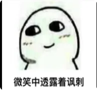

也就是说，你本来就是人，你拥有最完美的晋升通道，你直接好好地往上走就完了，结果你还往下修，修成了鬼，兜兜转转不入轮回几百年还得重新投胎成人重新修，回到最初的原点，这不是修了个寂寞是什么？这也不是我在骂你们，我自己就是一个鬼仙转世的修行人，所以我太知道修成鬼仙的后果了。

### 妖魔鬼怪的晋升路径
接下来咱们就来说一说，一旦掉到了妖魔鬼怪这一层，想爬上来究竟有多难。
**动植物、石头能修成妖，人邪修或者死后会变成鬼，都在妖魔鬼怪这一层。这一层最大的特点就是所有生灵都是纯阴的，他们同样有两个选择：向上或者向下。**
1. 如果向下继续吸食负能量，从小妖小魔变成大妖大魔，他们的法力确实可以强大到极其恐怖的地步，甚至神仙都打不过他们，但只要他们不越界，天道平时也懒得管。那如果有一天他们发癫不想守规矩，想强行冲破境界飞升天界呢？只要他敢碰天界这条红线，就会降下雷劫，扛得住的算你命大，天道看你还有点用处或许会收你，但是99.99%根本扛不住，万年苦修瞬间清零，直接灰飞烟灭。所以邪修是会被雷劈的。
2. 那如果不强冲，选择改邪归正的正规途径呢？你以为改邪归正就是闭上眼睛重新投胎就完事了？想得美。

天道是极其严密公平的，改邪归正是一条非常非常艰难的路，因为你走错的每一段路、做错的每一件事都算数。你以为杀人不用偿命吗？欠债不用还钱吗？都要的。
《钟吕传道集》中就把这些异类想重新修回正道的路径写得清清楚楚：“辗转不悟而世世堕落，失去人身，在别的壳子里变成异类，在旁道轮回不能解脱。”想解脱的唯一出路是……但是你不知道拿到这个消罪的资格再得人身的概率有多渺茫。消罪怎么消呢？给天道打工，我们就称之为“天选打工人”吧。但是你以为什么小魔小怪都能成为天选打工人吗？不可能的。**给天道打工的都是千年万年级别的大佬，也就是说，人家在负能量的世界里已经是金字塔尖的存在了。**

那哪些是我们熟知的“天选打工人”层级呢？有三大类：

1. 第一类，绝大多数生前是凡人，死后因功德、忠烈、善行，灵魂不散，被地方百姓供奉或者被上天册封的地方基层行政神职，比如城隍、土地、门神、灶神。这些我们熟知的正面形象，他们都是鬼，全都不是仙。
2. 第二类，封神榜里那些肉体先死后，灵魂飞往封神台的角色，比如闻仲、黄飞虎、赵公明等等，都属于鬼仙层级的天选打工人，怪不得一个个都不想上封神榜。
3. 第三类，编外被天道派去搞事情、推动天道任务的大反派，或者是保护宝地、考验修行人的大妖大魔大鬼，这部分人数那可就是数不胜数了。

然后在这些天选打工人里，经过极其苛刻的贡献、心性、品行考核，受到天道认可的，最终能拿到转世为人的名额的、给报考资格的，更是这群大佬里万里挑一的极少数。

也就是说，有资格拿到名额的天选打工人，他们看到我的视频和文字灵魂会苏醒，这是天道刻在他们灵魂的印记。但是没有资格的普通妖魔鬼怪转世成人的，是没有正道修行的机缘的，他们看到我的视频只会莫名其妙嗤之以鼻，甚至破口大骂，或者连我的频道都不会看到。

但是！
拿回人生仅仅是漫长考验的开始。有报考资格是一回事，你找不找得到正道、能不能撑到高考就是另外一回事了。
古籍是这么写的：
1. 在得人身之后，首先你得“积行百劫”。也就是说，就算你投胎做了人，刚开始也是处于贪嗔痴慢疑的愚昧状态，你必须在人间轮回经历百次劫数，才能慢慢洗清前世的无边罪业
2. 然后“升在福地”——你必须找到福地洞天，也就是风水宝地，借着天地灵气才有资格向上修。
3. 最可怕的是这一句：“苟或复作前孽，如立板走完，再入旁道轮回。”也就是说，如果你在人间一不小心重蹈覆辙，又动了恶念搞了邪修，你就会瞬间滑落，重新调回旁道轮回。

你看妖魔鬼怪有多惨，无论是得人身前打工万年赎罪，还是得人身后轮回百世历经百劫，这哪个都不是好词啊。
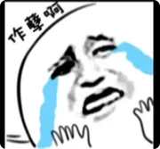
能够在这百世轮回里找到修炼的路、能够撑住百劫的，也是万里挑一。所以你数数这是多少层的万里挑一的概率了。
所以，魔道系统转世的修行人，出身往往都不好，命里劫数坎坷特别多，想要重新走上正道，对心性的考验更是高到了极致。而且底下上来的修行人，灵魂自带的气是非常非常浊的，比其他来历的要浊很多倍，不仅要花费几倍的时间、金钱、能量，修行路上遇到的难关和心魔劫数更是别人的数倍以上。
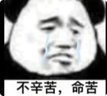

所以，作为一个鬼仙转世过来的修行人，我用亲身经历告诉你，我就是轮轮回回百世，每一世都是打打杀杀的角色，而且是各种凄惨的死法，即使到了这一世，也是经历了很多很多的磨难才遇到正道的。这个故事太长，我们先挖个坑，另一期讲。

言归正传，人往下，不管是动植物或者是妖魔鬼怪，他们最终都是要转成人的。所以你现在理解了为什么“人身难得”了吧？因为掉下去啊，它就是一个无尽的死循环。
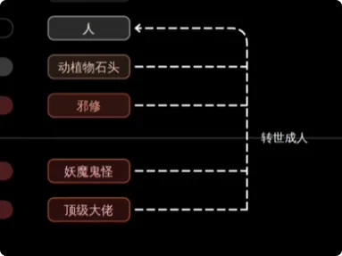

好了，讲完了那些负能量的下坠史，咱们接下来应该换个轻松的。如果你选择正能量往上走呢，这个路径就简单直接很多了。

### 人仙是什么？

人间框架内，除了总能量，还得看体内阴阳的比例。假设我们每个人出生的时候都是100%的凡气，清气为零。当你开始踏上正能量晋升通道，第一个接触到的层级就是**人仙**。人仙的本质就是一个寿命长一点、病少一点的凡人。

人仙也分正修和邪修两种，古籍里只记载了邪修的人仙。
《钟吕传道集》中是这么定义人仙的：**所谓人仙，五仙中的倒数第二名，“不悟大道”——也就是说他们根本就拿不到纯正能量，不懂得能量的底层规则，只是学了某种偏门功法或者某种养生技术。他们靠着一股苦修的狠劲，把肉身练得非常坚固，百病不侵，一辈子极少生病，能安乐延年。**
送玻璃杯的例子就是这个人仙，他也不管什么气不气的，天天都在补玻璃杯，以为补好了就能上天。
就连葛洪《神仙传》里提到的活了800岁的彭祖，他自己都承认自己只是一个人仙。还有现代这位被世人尊称为“陆地神仙”的某道长，无数人跟着他学功法、练养生，都以为他老人家早就飞升上去了，其实他活着的时候也就只是一个比较长寿的人，而现在他在下面——惊喜不惊喜，意外不意外？

正修呢，也有类似于人仙的等级，只不过圈外人是不知道的。假设人仙的能量值为10，哪怕你只有5%的纯正能量和95%的凡气，你和凡人就已经不是一个物种了。虽然表面还是人，但身上气的本质不同了，能量和感知力和凡人不是一个维度等级了。这个时候你已经具备了考试资格。大部分刚入门的正道修炼者基本都在这个等级。
我之前视频说过，纯正能量护体，少则一生无病无灾、健康顺遂，多则成仙成佛。人仙就是纯正能量还比较微弱，只够护体的层级。
甚至我认识的很多人，他们不仅自己修炼，还偷偷把一些纯正能量分给家人，保他们平安健康，他们的家人甚至都不知道自己有纯正能量。这种被正能量滋养的家人，也能归为人仙的等级。

但是我还是要强调，即使是正修，人仙和鬼仙一样，本质并不是仙，只是有一些纯正能量护体罢了，死后也还是得变鬼再入轮回。
唯一的区别是你攒了些好能量，死后灵魂不会受罪，下辈子能投个好人家。所以人仙其实算不上境界，是每一个还在路上的正道修炼人都能做到的一件事情。

### 尸解仙怎么晋升?
关于**尸解仙**，历史上的争议比较大，以后单独开一期讲。这期就讲个大概: 
假设你继续修，总能量值能到100了，体内的清气值为50，凡气还剩50，那么你至少能得个尸解仙。
1. 在魏晋时期的《抱朴子》里，葛洪说了一句非常刻薄的话：“气少肉多，不得上去，当为尸解。”什么意思呢？就说你正能量其实修得还行，但你的肉身实在太烂了，拖了后腿保不住了，你就只能先经历一次形式上的死亡，灵魂再蜕变成仙。
2. 《神仙传》也记载仙人王远评价蔡京的时候说“气少肉多，不得上去，当为尸解”，看到这句话我都笑喷了，合着在仙界眼里你飞不上去是因为肉太多、清气太少，超重了。
3. 就连西王母也下旨说“尸解仙掉到下界，我一点都不可惜”。你看仙界鄙视链里尸解仙纯粹就是一个被看不起的淘汰选手。

 但到了南北朝，古人对尸解仙的内部机制进行了非常精细的补丁升级。
 
 
 《真诰》将尸解解释为去地下冥府工厂重造并兼职打工的候补神仙，等肉身重塑就可以升级了；而《无上秘要》里更夸张，直接把尸解仙定义为天庭留在冥界的在编公务员，像墨子、张良这些大佬明明就能直接成仙，却故意选择“扣关死绝”来尸解，就是为了去地府担任地下主者的官职，通过在冥界秉公执法、管理鬼神来积攒功德KPI，工龄熬满了之后，天庭会下达红头文件（也就是紫简）直接提拔调任为正式的地仙或者天仙。
 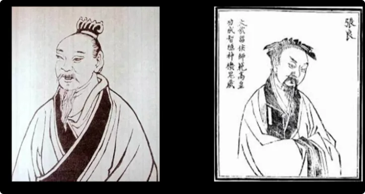

反正后世补上的东西啊，我就这么一提，你就这么一听。我之所以拿出来讲呢，是因为我看过其他玄学博主做过的有关尸解仙的视频，引经据典是不假，但真的是一本正经地胡说八道，因为他们本身不修仙，所以他们看不出文字里面的门道，这就是隔行如隔山。

抛开这些后世缝合的传说，本人觉得对尸解仙比较准确的描述，就是“气少肉多”，没了肉体的候补神仙。至于去哪把肉体补上，真的还没有定论。
但是仙界看不起候补神仙，你作为凡人可真的没有资格看不起尸解仙。在道教所有的古籍设定中，尸解仙都彻底跳出了地府的生死簿，就不会被格式化，就能保留全部的记忆、智慧和修为，只要好好修炼就依然有机会可以原地升职。光就这一点，就已经是所有凡间修炼人的终极目标了。

那么现代正道修炼者达到尸解仙级别难不难呢？我们门内有一句话供你参考：“这条路好好走，别做叛徒，至少也能得个尸解。”

### 地仙是怎么修成的? 
尸解仙往上，是非常接地气的**地仙**。假设这个时候你的总能量值到1,000了，纯正能量为80%，凡气还剩20%，那么恭喜你至少也能得个地仙。

到了这个层次，你的肉身已经完成了深度的改造，真正能做到延年益寿、长生不老。那他们为什么不上天呢？
葛洪在《抱朴子》里说“地仙者，唯得长生，住世不死”
而《钟吕传道集》中更直白：“地仙者，天地之半，神仙之才。”翻译过来就是，地仙只能算个半成品，悟道悟了一半，身体也没练到纯阳，肉体虽然挣脱了生老病死，但是还挣脱不了地球的重力，所以就只能留在地上逍遥，是个有正式仙籍的“驻外公务员”。

听起来好像也没有多厉害哦？不是的，你别小看这个“驻外公务员”，《神仙传》里绝大部分的神仙都只是修到了这个层级，可见地仙等级有多不容易。很多人总是把地仙和土地爷搞混: 
前面说过，土地爷是鬼仙，是忙得焦头烂额的纯牛马，他没空修炼。地仙不一样，他是地球“在野神仙”，他不干活、不任职，他的任务就只有三种：
1. 不想努力的就天天游山玩水，和地仙朋友面基；想努力的就天天闭关修炼，把身体练成纯阳，他就能当神仙；
2. 再努力一点的，他还得去人间积功德。《抱朴子》中写过明确的KPI：“欲求天仙，当立一千三百善。”所以他们还得去人间完成KPI，还会暗中考察度化有仙缘的凡人。
八仙之首汉钟离一天到晚在人间晃悠，就是为了在红尘中寻找并考核吕洞宾，引导他走上正途。

但这个时代是一个有大机缘的时代，不仅名额多，果位还大，修炼资源更是前所未有。那现代正道的修炼人中有没有类似于地仙等级的人类呢？
有的，达到这个水平和实力的不算少，只是高考还没到，一切还没有定数。门内也有一句话供你参考：“如果你在这个时代找到了正道修仙的路，地仙水平相当于你，都读五道口中学了，你才考上个二本。”这句话我就点到为止了。
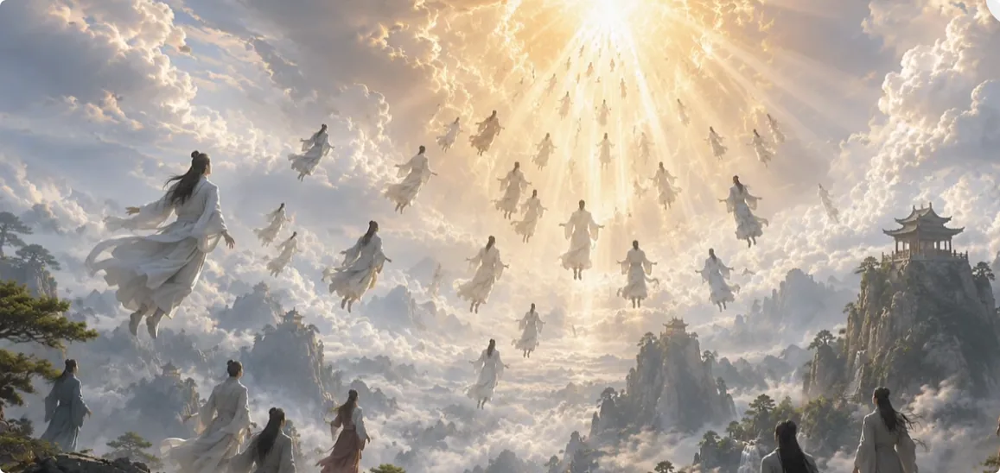

### 神仙和天仙
地仙往上就不是人间了，大致分为**神仙**和**天仙**两大类。假设你的总能量超过了1万，清气为100%，凡气为0%，是真真正正的阴尽阳纯了，那么你至少是一个神仙了，就能跳出人间框架，不用在地上吸浊气了。

《钟吕传道集》中是这样描述的：“所谓神仙者，格也。阴尽阳纯，谢绝尘俗，以返三山。
”注意“阴尽阳纯”这个词，能量值到了，纯净度到了，就可以成为神仙。

《抱朴子》也说“仙之纯者，谓之神仙”，也就是说不仅仅气纯阳了，就连整个肉身都转化成纯阳之体了，这个时候你就不需要丢弃任何东西，带着肉身就能白日飞升，这是人间修行的天花板了。在神仙这个等级，一般不认官职，逍遥自在，我们也称“散仙”。散仙虽然自在，但是一些核心的修炼资源也是轮不到散仙的，比如说蟠桃。

那神仙再往上是**天仙**，天仙要求更高一点。
古籍是这么说的：“天仙者，功成行满，受天书，返洞天。”
也就说想晋级天仙，必须满足三个硬性指标，缺一不可：
1. 第一，“功成”——修为达标，你的纯正能量和纯度积累到天仙的段位了；
2. 第二，“行满”——也就是贡献值达标，在世间承担责任，积攒绝大的功德。有些人以为做好事积功德就是修行，这也不能说全错，但是是在你的能量值和纯度都达标的情况下，功德才有用。没有能量值和纯度的功德，就好像你高考参加一堆课外活动，但是你高考分数为0，甚至没参加高考，那谁敢录取你？
3. 第三点，“受天书”——这六个字信息量极大，受天书代表你拿到了天道下旨；而“返洞天”里的这个“返”字，说明能成天仙的人很多原本就是天仙下来，所谓**“神仙本是神仙做”**。

当然，如果要细分的话，小神仙、大神仙、小天仙、大天仙、上古大神、大罗金仙等等等等，还是那句话，名词不重要，最重要的是**能量值**。
大能量大神仙，小能量小神仙，就这么简单。
你只需要记住，天仙就是作为人能修到的天花板了。古籍里还有这么一句话：“若洞天住久，亦可任仙官。”也就是说，如果洞天住久了住腻了，可以任仙官。天庭的官职系统呢，又是另外一套晋升规则了，可以另外开一期讲。

天仙再往上呢，就不是人直接能修的了，所以作为人类的你也没有必要知道。

## 作为过渡的人身
### 人身的福利: 
其实每个层级的仙都可能被贬为人或带任务下凡，但作为人往上修，有一个全宇宙最大的隐藏福利🎁：
**只要你这一世做得好，短短几十年就能实现果位的晋升，甚至连续几级跳。这就是为什么这一次人间的大机缘，不管是山精水灵、妖魔鬼怪，还是天上各路神仙，都宁愿舍弃万年修为，挤破头也要转世投胎为人。**
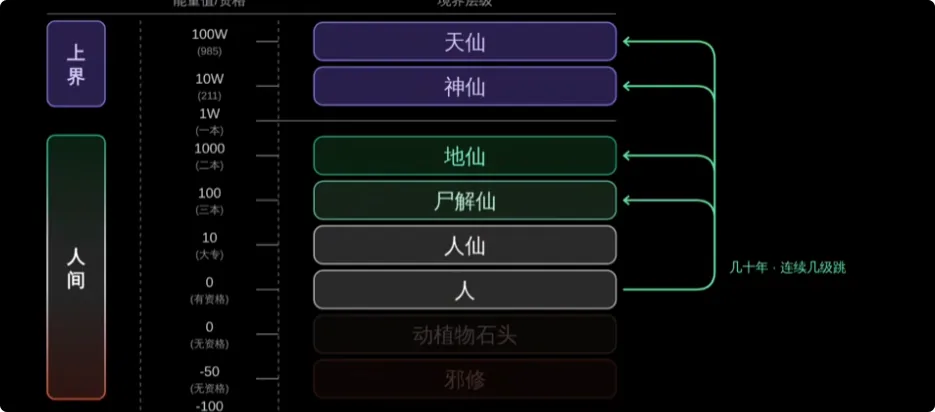

### 人身的风险: 
但是作为人也有一个最大致命风险，那就是迷失在人间，在红尘里灵根受损，彻底忘了修炼，再也回不去了。
不过对天道来说也没关系，迷在人间的就是经不起考验的淘汰者，经不起考验就不配再回天上，刚好把名额腾出来给那些更优质的、更有冲劲的后来者。

说到底，这次宇宙级的高考，筛的就是综合素质。能量值和纯净度是硬性要求，它决定了你能去哪个层级；心性、贡献、来历是加分项，决定你修成什么果位，最终进哪个学校。

听我讲完这一条灵魂轮回晋升路径，你是不是对修仙越来越清晰了呢？你原本从哪来，想修哪去，相信你差不多也有一个目标了吧。

## 关于 二元对立的思考🤔? 
说到这里，肯定有些高维玩家会在评论区或者弹幕里跟我杠：“博主你讲的这些不还在天道框架里打工吗？
你还停留在3维的思维里，人家5维、6维、7维根本就没有二元对立，宇宙本来就是空，世界本来就不存在规则和束缚，直接跳出游戏设定不好吗？”

你先打住。首先啊，宇宙有宇宙的规则，太阳系有太阳系的规则，地球也有地球的规则，哪里都不存在绝对的自由。
你知道你现在为什么是一个人，而不是神、不是仙吗？难道是因为你不懂概念、不够聪明吗？不是的，是你灵魂当前的能量值就只配待在三维世界，你就只配拥有这具凡胎肉体。
**维度不是靠想象出来的，物种不是靠逻辑自洽进化出来的，它是一个绝对的能量纯度和数值决定的。** 你以为你脑子里学会背“色即是空”、没有二元对立，你的灵魂就能超越维度了？
一个二维的纸片人，脑子里再怎么幻想三维立体球形，只要它的能量不足以让物理形态发生质变，它就永远是一张纸。
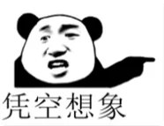

所以，不要用概念去代替你的能力，更不要用你的想象力去代替实打实的能量值。这具肉体从来都不是限制你的牢笼，它是天道在你的能量还没有修够之前，给你安排的新手保护期的防弹衣。否则，以你现在两米高的气场和微弱的能量值，一旦真正脱离这具肉身，你就会瞬间被灵界秒得渣都不剩。

想跳出系统？你不如先实事求是地问问自己：
你那破玻璃杯修好了吗？你今天的能量值是多少？你体内的阴阳比例又是多少？
还是说你连自己的能量值都不知道，各种气傻傻分不清，还想着自己可以不守规则？

能量不够，所有的超脱都只是脑海里的幻觉。
人呐，还是得饭一口一口地吃，路一步一步地走。把这一世的身体养好，把体内的浊气排干净，把能量值实打实地修上去，才有资格谈后面的事情。

## 结尾: 

**万般故事，不过落笔云烟；千般算计，不如命运轻轻一笔。**

## 关于众生共业的详解

众生共业中的这个“业”到底是什么呢？

很多人都听说过有这个不好的集体业力，但是又说不明白、道不清楚，既不知道它从何开始，又不知道如何解决。
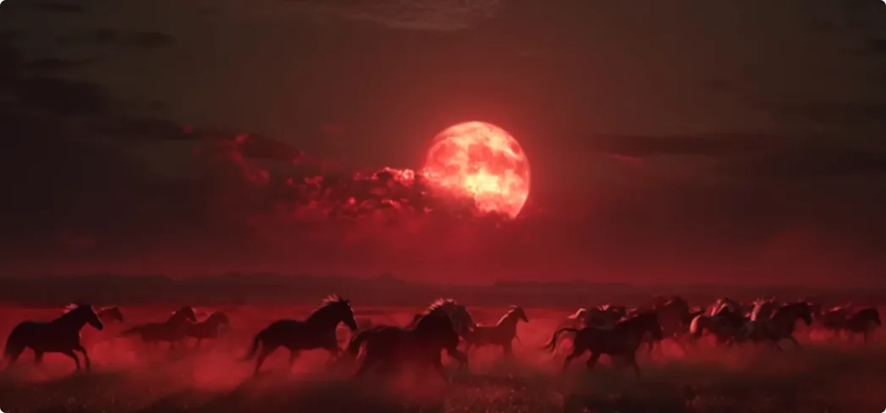

今天我们就来从《圣经》中解读一下这个“业”，相信你听完之后会有一些感悟。

## 耶稣痛斥文士和法利赛人的罪行
上一期我们讲到，文士和法利赛人在《圣经》中指的是那群研究旧约律法的专家和精英。他们通过掌握对神或道之律法的解释权，深度影响和约束着人们的生活。他们不容民众挑战他们的规条体系，民众对他们既尊敬又畏惧。
这听起来貌似是一帮旧世界的唯心主义老顽童，但如果你把“旧约”两个字拿掉，你会发现文士和法利赛人从来就没有消失，无非一直在换新的面孔。

我们来看看《圣经》中耶稣对他们的评价，你就能大概知道谁是文士和法利赛人了。
耶稣说: 
1. 这群人只说道义，却从不行道义；把难做到的事都交给众人去做，自己却只懂得吹毛求疵、坐收渔利。
2. 这些人喜欢做表面功夫，他们喜欢那个至高的宝座，喜欢听街上的人称赞他们的美名。对于那些众人需要解决的公益之事，他们根本不放在心上。要不是众人的呼喊声太大，叨扰到他们，他们定是不愿去解决的。

**因为人一旦心中没有了道，便也不会惧怕神，头上没有悬着利刃，这群人对世人的态度自然就要轻慢。**

然而，站得高又不结果，并不是文士和法利赛人的原罪，不是他们独有的问题。上一期我们说过，人性贪嗔痴才是罪根。
无论谁成为了文士和法利赛人，最终都会因为把持不住欲望而选择背弃道、背弃神。

为此，天上的神明很早就给出了治疗贪嗔痴的方法和路径，解决的办法也早早交给了人类。神明们甚至亲自来给世人当辅助，希望世人能早日回到正轨。可结果是什么呢？人类的罪反而更重了。

因为前面的这些文士和法利赛人把路堵死了，不仅自己不走，也不让后面的人走，还让所有人跟着自己背道而行，拉着大家一起走绝路。

此举罪恶滔天，神人共愤，以至于耶稣在经书里连骂七遍，把文士和法利赛人的罪都一一罗列出来。

## 果园与园户的寓言故事引入

在解读耶稣痛斥文士和法利赛人的罪行之前，请允许我先讲一个寓言故事。之所以要讲寓言故事，是因为我也没办法讲大白话，诸位好好听了: 

从前有个仁慈的园主，他有一个果园。果园里种了各种各样的果树，这些树结出的果子能带来许多好处。
如果人吃下这果子，他的贪嗔痴就会慢慢排空，能悟道，能永生，还会得到神力。
不过，对吃果子的人有点要求：
如果人合道，那么吃掉后就能获得果子的所有好处；
如果人不合道，强行吃下果子，那么只能窃取到单颗果子的短暂神力。
园主本意是要把这些果子分给街上的人，或者说，这果子本来就是给人准备的。然而，园主又不能直接交到人手上，因为这样做只会让人变成好吃懒做又不知足的巨婴，人会长不大，也不合道。

于是园主想到一个办法，让一部分愿意合道的人带着众人合道，让愿意合道的人先吃果子，好让众人瞧见，让众人知道合道的好处。

于是，园主好几次去街上挑选了一些愿意合道的人，要把园子暂时租给他们，让他们试着自主管理园子。这些人就称作园户。
园主给他们尝了果子，并吩咐照看好果树，以后要分给众人吃。园户们都纷纷表示忠诚于园主，并承诺绝不背弃园主。

随后，园主一家就出门去了。
这些园户吃了果子，发现了果子的好处，于是赞美、赞叹。
- 第一天，园户沉浸在吃果子的喜悦中。
- 第二天，园户享受着果子的好处，借着神力，凡所想，没有得不到的。
- 第三天，园户萌生想吃掉更多果子的想法。
- 第四天，园户开始担忧以后吃不到这么多、这么好的果子。
- 第五天，园户想起了园主的话。他们害怕果子落到外人手里，自己得到的就少了。
- 第六天，园户们开始商议怎么能独占这园子。
于是，园户们借着神力去到大街上，给众人修良田、修路、修房屋、修乐园，又给了他们自由，教他们生活。因此，街上的人都很爱园户。

园户说：

> 我这么做也是为了你们好。你们今天所得到的，离不开我的辛苦劳作。没有我，恐怕你们会生活得很辛苦。
>
> 但是将来有人要冒充是这园子的主人，你们要与他为敌。你们务必帮我牢牢看紧园子的大门。

听完这话，街上的人都感到无比愤怒。他们想不通，竟然有人要伤害这善良的园户，那定是蠢人或者是坏人。

与众人为敌的人可到底会是谁呢？人们总不能对着空气生怨，天天守着园子保护园户吧。
于是园户们想到个主意：守着西门的园户出门，说着同样的话，骂东园户的不是；守着东门的园户出门，也说同样的话，骂西园户的不是。
如此，西街和东街的人就相互对峙起来，都把对面当作自己的敌人，心甘情愿地把守着园子。

此举甚妙。

人们不会因为日子太闲，生了进园子的心，怀疑起园户来，反倒是时时体谅着自家园户的不易，为园户掉眼泪。
不过，要说园户们是一条心的，倒也不是。他们彼此都知道对方有多么贪得无厌，说不定哪天自己就会被合伙逐出果园。
他们都认为，新园主只需要一个人当就够了，多一个人就多一份危险。于是他们私底下都想着给对方使绊子，削弱对方的实力。
但他们不敢真的下死手，因为他们怕孤身一人去面对园主。他们都希望旁人一起出力干掉园主，却又怕干掉园主后，自己不是那唯一的新园主，真是揪心。
**园户们最团结、最默契的事情，还得是在编织谎言上。**

每当果树枝头露到墙外时，他们会齐心协力地将其砍掉。那些靠近墙的果子，他们都心照不宣地捂起来，生怕果子的香味飘到墙外。

他们宁可果子烂掉，宁可少结果子，也不能让外面的人分这杯羹，否则必要引得外面的人闯进他们的园子。

过了些时日，园主一家回来了。

园主看到园子被众人围得严严实实，就说：

> 见鬼。每次叫进去看园的人，最后都变成这副德行。我要么干脆就把这些人都清理干净，以后再不开园子了。

园主的子女却说：

> 父，容我们再试试。街上的人也有好的，他们的骨子里也有好的。
>
> 这次换我们去扮成他们的朋友，让他们学会真正的品德，让他们悔改。这样，您的本意也不会落空。

园主说：

> 那你们去吧。

这个故事就讲到这儿了。

## 文士和法利赛人的罪

接下来，大家可以真正理解《圣经》里耶稣为什么这么骂文士和法利赛人了。

### 1. 阻挡神人之间的沟通，阻挡世人的成长之路

首先，耶稣反复强调：

> 你们这些文士和法利赛人有祸了。

1. 因为这些人自己不愿走正道，也不准其他人走正道。因为其他人若走了正道，他们就再无好日子了，所以他们要堵住路口，不准任何人得到好处。
2. 其次，这些人知道真理的好处，于是就把记录真理的书籍藏起来，或者逐字逐句删除、篡改；没来得及雪藏的书，就矢口否认。边缘化和污名化使人远离真正的知识，而他们自己却学得津津有味，把好处都握在自己手里。
3. 其三，这些人截断神人之间的沟通渠道，不允许大家悟道，不允许大家听懂神的语言。因为人们一旦悟道，一旦听到了神的呼唤，就没有人再愿意围绕在他们左右，不再愿意听他们的话了。

总的来说，文士与法利赛人的第一个罪，就是**阻挡神人之间的沟通，阻挡世人的成长之路。**

### 2. 毒化社会的头脑, 腐烂社会

文士和法利赛人的第二个罪，就是**把世界各地最优秀的人都招进他们的圈子，毒化社会的头脑**

1. 他们把聪明的人都培养成自己的人，培养成他们的护城河，好让他们屹立不倒。
2. 其次，是要让这些聪明人成为普通人的榜样，好让绝大多数的人模仿他们的思想和行径。
3. 其三，是让这些聪明人都做撒旦的臣子，让新加入的人比自己更狠、更坏。他们想借后来之人的手，把自身的罪孽平摊出去，最终平摊到世上每个人身上。

但与其说培养，不如说是威逼利诱。因为聪明人大多不愿低头服从，要么心甘情愿去做，要么以死相抵抗。
所以，文士和法利赛人并不奢求聪明人忠诚于自己，只需要让聪明人忠诚于自己的欲望就可以。
只要能让聪明人犯下第一个错，一个不可被公众律法饶恕的错，就有办法让他们自甘沉沦下去。

具体怎么做的呢？

他们明面上大肆宣传伦理道德，背地里又以突破伦理的方式挖掘享乐的极限。聪明人只要尝到了突破伦理的甜头，便已留下罪证在他们手上。
开弓没有回头箭。要么继续向前，为钱和利益卖命，用这些来购买无限的快乐；要么回头面对法律和公众的审判。

### 3. 使众人拜倒在钱和利益之下

所以，文士和法利赛人从不阻拦分配的不公，也不会真正根除奢靡和荒淫。
他们就是要把钱和利益的好处体现出来，好让众人瞧见，让众人随大流去做。而那些没钱没势的人，在这种环境下连躺平都费劲。
如此一来，便没有人会思考世间真正重要的是什么了，也没有人会来走被他们遮挡的道。
使众人拜倒在钱和利益之下，就是文士和法利赛人的第三个罪了。

### 4. 贪图享乐、不作为

文士和法利赛人的第四个罪，就是**贪图享乐、不作为的罪。**
那些不起眼的蝇头小利，他们就慷慨地拿出来分享给大家，假意尽了对众人的义务；那些利益丰厚的地方，他们就捂起来独吞了。

那些无关紧要的礼仪和面子，他们就拿在手里故作正经；那些大众需要维护的公义、怜悯和信实，反而见不到他们的踪影了。
他们明明占着这个位置，却不做这个位置该做的事情。

### 5. 把众人引向死路

文士和法利赛人的第五个罪，就是**把众人都引向死路。**

这些人表面光鲜亮丽，实则内里早已污秽不堪。他们早就是被判死刑的人，却用伪善和光亮的外表吸引众人走他们的道。
众人走在他们的道上，却不知道这是条死路。于是众人身上都沾上死味，离神原定的永生之路远矣。

### 6. 让世人与他们同尝恶果

文士和法利赛人的第六个罪，就是**让世人同他们一起沾上杀害先知的血，让世人与他们同尝恶果。**

神派先知，也就是神的使者，来到人间教化世人，文士和法利赛人却引导世人同他们杀害使者。
世人把后辈交给了伪善的文士和法利赛人，却把刀剑指向神和神的使者，亲手斩断与神的联系。
使者死后，虚伪的文士和法利赛人就着手修饰使者的故事、修饰使者的话，使世人不知神的本意，不知神的降临。于是世人都不信奉神，不信奉道。

既然神的使者无法在大地上播撒永生的种子，既然世人愿意同文士和法利赛人走死路，迟迟走不上永生之道，那么世人就只能与文士和法利赛人共享罪业了，也只能同罚了。

## 尼哥底母与约瑟

那是不是走上文士和法利赛人这条路，就不能回头了呢？

有些观众可能会喊冤，觉得自己并非不信道、不信神，只是被人蒙蔽了双眼。如果有得信，那必然是愿意信的。
在《圣经》里，确实有两位文士和法利赛人在私下偷偷追随耶稣。他们能被写进《圣经》，就是要留下事迹来做后人的榜样。

其中有一个法利赛人叫尼哥底母，是犹太公会的成员。因为怕被同僚看见，所以夜里偷偷来拜见耶稣。
他跟耶稣表达了自己的信任，耶稣就给了他建议，说任何人都要先重生，才能进神的国度。
这个法利赛人就问他：

> 我已经老了，怎么重生呢？还能等投胎了再来见你吗？

耶稣就告诉他，方法是有的。人的重生不是靠肉体重生，而是要靠水和圣灵。

在这里，博主要插一嘴了。能使人重生的关键——水和圣灵，这在《圣经》中应是被修饰过的。
一般人读不懂这里的水和圣灵是什么。此水肯定不会是普通的水，其实指的是一种纯净的能量。若不是这样的水，根本做不到给人洗礼、洗净。
而这里的圣灵应指 **道性、神性、神灵之性。**
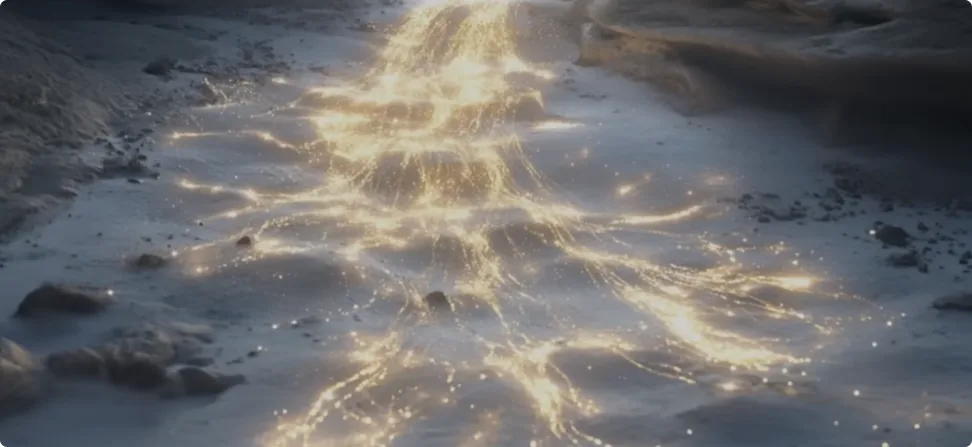

《圣经》说，信基督的人才有圣灵内住。如果你搜搜“基督”二字的词义，就能完整翻译出这句话来。意思是说: 
凡是有了救世心愿的人，心中才算是有神性和道性。所以，不是非得入了某教才有圣灵内住，不信某教的人也可以有。毕竟区区人的教会，不可能垄断圣灵这种三位一体的事物。

《圣经》里又记载，耶稣受洗时圣灵降临。翻译过来就是说，耶稣在受纯净能量洗净时，充足、庞大的道性和神性也住进了他身体里。
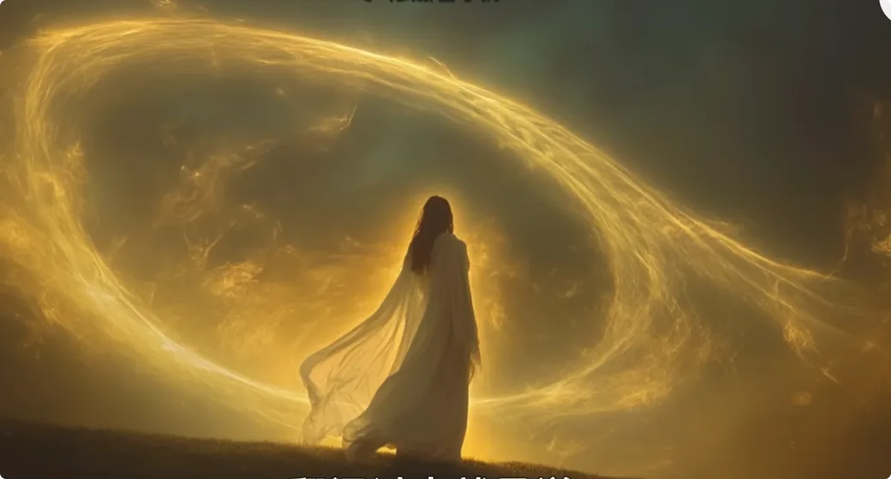

修炼实践过的朋友能明白这话的意思。通过这种能量不断清洗，一个人接收到的神性、道性，也在不断重塑灵魂。这个过程就是重生了。

所以回到原文，耶稣是在告诉法利赛人：只要你愿意回头，方法找对了，靠水和圣灵的重生，也是有进入神国的资格的。
后来，当其他法利赛人打算逮捕耶稣时，尼哥底母在公会前设法维护耶稣，希望公会的人遵守律法，不要随便就定耶稣的罪。

还有一位财主叫约瑟，是公会的义士。他也是信仰神的人，同样因为怕被同僚发现，于是偷偷地做耶稣的门徒。
因为他一直都相信有大道、有神明，所以他没有参与这场恶意的阴谋。
在耶稣受难后，也是这两位法利赛人出面为他安葬。
约瑟勇敢地求取耶稣的身体，买了最昂贵的细麻布为他裹好，并葬进原是为自己准备的新坟墓。

尼哥底母则以王室规格，买了价值不菲、体量巨大的香料，为耶稣做葬礼。
这些举动体现了两位法利赛人对耶稣的敬重。
可见，真正有情有义、心中有道的人，不管曾经是不是文士和法利赛人，不管曾经是否犯下过错误，当他遇到真正的道时，仍会及时调准方向，用行动来向神证明自己的决心。

## 结尾

最后，我们来给本片做个总结。

人类当前的出路，就是吃下园主的果子，排尽贪嗔痴，接受神灵之性，接受道性，完成重生，完成蜕变。
然而，总是有人阻止大家吃果子，导致大多数人冥顽不灵、执迷不悟、背道而驰，进一步扩大人类在世上犯下的恶业，最后又得由大地上的众生共同承担恶果。

这就是所谓的众生共业了。

所以，历史上有很多下凡的神仙、佛，不讲清楚具体的解脱方法，是因为在过去讲了也没用。

贪婪的人太多了，阻止吃果子的人会前仆后继。在蛮力之下，连寺庙和教堂都是文士和法利赛人的，神仙、佛讲的话根本没有可靠的载体。

但现在不一样了。园主回来了以后，再也没人敢阻止大家吃果子了，只不过在此之前，业得先结清。

我是修炼者小烨，我们下期再见。

## 人死后的世界长什么样?地府、因果、审判与人间修行

> **人死后究竟去了哪里？地府是什么？鬼是什么？因果又是如何完成清算的？**
> 
> _**真正要讲明白“死后的世界”，最后回答的其实不是人死后该去哪里，而是——人活着的时候应该怎么活。**_

## 1. 为什么不同文明，都在反复讲述“死后的世界”

人死后的世界长什么样呢？

几千年来，不同文明、不同民族、不同地域的人类，都在反复记录物质以外的世界，记录着天地之间的神明、祖先、灵魂、妖魔鬼怪。这些并不是某一个民族单独幻想出来的东西，而是人类在漫长历史中，对生死、灵魂和看不见的世界的一种共同感知。

不同文化、不同文明都有，而现代人因为对技术的傲慢和自信，很容易形成一种错觉：

> _**只有能被测量出来的东西才是真实的；凡是看不见、摸不着，或是仪器无法测量的，就一律叫迷信。**_

如果你也是这样的，那接下来的视频可能会粉碎你的三观。今天我们来聊聊：**地府到底是什么？它是干什么的？**要讲明白地府，我们首先得讲明白——**人和鬼。**

鬼是什么可怕的东西吗？其实并不是。

> **我们每个人都曾是鬼，也终将会变成鬼。**

### 当人只相信肉身，生命就容易失去神圣性

近现代教育里，很多人开始以唯物为骄傲。他们不再相信因果，不再相信天地有眼，也不再相信生命本身有神圣性。一旦陷入这种唯物的陷阱里，很多可怕的事情就会发生。

你会看到在计划生育的年代，为了控制人口数量，出现了“百日无孩”这样的运动。怀孕的妇女，无论是孕早期还是临近分娩的孕晚期，都会被强行送往医院进行引产；婴儿尤其是女婴，即使生下来了，也有可能被强行杀害。

这种事情放在整个人类文明史里，都是骇人听闻的。

为什么会这样？

因为一旦人只相信物质，就会慢慢地对生命失去敬畏。他会以为胎儿只是块肉，杀了就杀了，就结束了。

殊不知，足月之后，此时婴儿的肉身虽然被毁，但是灵魂依然存在。尤其越接近孕晚期，胎儿的肉身越完整，魂魄与肉身的连接越深，中断之后形成的冲击也越重，也越是可怜。
他已经带着某种因缘来到了这一具肉身里，但他不知道自己该去哪了。如果没有人引渡，只能本能地继续停留在原地，或是作为婴灵跟在父母的身边。

---

## 2. 人为什么感受不到灵魂：肉身只是魂来到人间的一件“衣服”

很多人还在怀疑，人到底有没有灵魂。
你看不见风，但人能感受到风吹过皮肤；你看不见空气，却仍知道自己需要呼吸。

气、魂魄、灵魂这些东西也是这样的。

它不是不存在，而是因为人心太乱、气太浊，所以感受不到。
很多人并不是没有灵性，而是灵性被过度的欲望、电子屏幕给盖住了。
如果一个人只相信肉身，他会把自己活得很低，以为吃喝玩乐就是人生，以为死了就一了百了，从而陷入一种享乐主义和及时行乐里。

但实际，人并不只是一具肉体，而是：

> **借着这具精妙的肉体，来到人间走一趟的魂。**

### 人身为什么被称为“修行容器”

人身是一个极其复杂、极其珍贵的修行容器，具**眼、耳、鼻、舌、身、意**，能看、能听、能闻、能尝、能触、能思考。

所以：
- 人能感受痛苦，从而生出慈悲；
- 人能造业，也能忏悔；
- 人能被欲望牵着走，也能在某一刻突然醒过来。

这就是人生珍贵的地方。
动物很多时候被本能牵引，鬼道众生很多时候被执念牵引
天人道享福太多，未必愿意修。

而人间最特殊的地方在于：

> _**人有苦，也有选择。**_
> 
> _**正因为有苦，所以人能醒；正因为有选择，所以人能修；正因为会犯错、会痛，所以人才有机会明白因果与慈悲。**_

**能成为人，本身就是很有福德的体现。**

也正因为如此，并不是每一个生灵都能投胎成人的，就如我们之前说的“**盲龟浮木**”的故事。
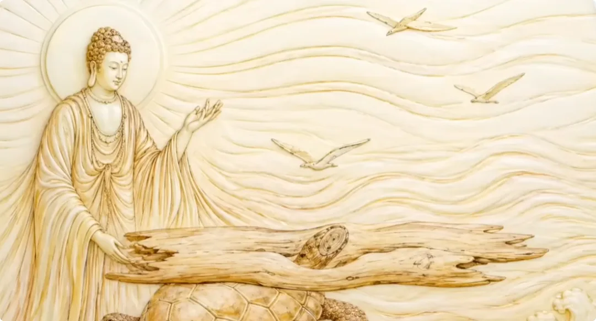

很多时候，各地的神话，无论是佛经、圣经，其中的神话大多不是假的。人体本身就是造物主的结晶，是造物主按照自己身体的样子造出来的。
每个细胞的运作，每次神经元的闪烁，其精妙程度都远远超过任何人类制造出来的机器。

---

## 3. 人生是法器，人间是道场：这一世的问题，就是这一世要修的课

> _**人生是法器，人间是道场。**_

各位这一世能得到人身，不只是为了吃喝玩乐、争夺名利的，而是带着过去的**因果、业力、功课和机会**来的。
此生的八字、家庭、身体、性格，或是遭遇、关系、磨难等等，这些东西很多都不是孤立的存在。

它们往往是过去的业力在这一世的显现，也是这一世要修的功课。
所以人不能顺从命运，不能顺从八字，而是要从八字命里看懂自己的课业：

> **你遇到什么问题，往往就说明你哪里需要修。**
> 
> **你这一生最难过的关，也许就是你这一世最该修的地方。**

人生之所以难得，不只是因为生命稀有，而是因为：

> **人能悟。**

而能悟，才有机会继续往上走。
这一生只是个阶段，真正延续的是你的**魂识、业力、德行、因果和修行层次**。
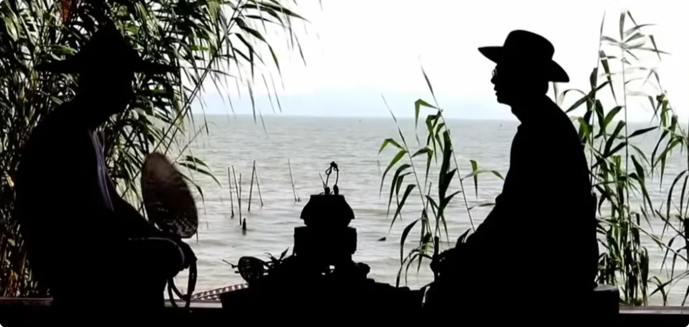

---

## 4. 死亡不是结束，而是“脱壳”：从亡魂到秩序，地府为什么会出现

所以理解地府之前，必须先理解这一点：

> **人死后，并不是什么都没有了。**

肉身结束之后，魂魄会进入另一个秩序。

肉身只是你在人间行走时所穿上的一件衣服，衣服坏了，不代表穿衣服的那个存在也消失了，只不过这件衣服比世间上所有的衣服都珍贵。

> _**死亡不是结束，死亡是脱壳。**_
> 
> _**肉体归还给尘土，气归还给天地，而魂魄则去了它该去的地方。**_

如果你明白了人有灵魂，人死后灵魂不会立刻消失，那按照逻辑推演：
1. 大量亡魂死后聚集在一起，会不会形成**关系**？
2. 有关系，就会不会出现**强弱**？
3. 有强弱，就会不会自然产生**秩序**？
4. 有秩序，就会不会出现**管理**？

所以它自然会有：
- 引渡；
- 安置；
- 审判；
- 清算；
- 转生。

这条逻辑其实非常简单，理解了之后，它并不玄幻。

人间为什么有法院？
>因为人和人之间会产生纠纷。

为什么有监狱？
>因为犯错的后果必须被承担。

为什么有档案？
>因为每个人的来历、经历都需要被记录。

那么：

> **灵魂世界为什么不能有类似的秩序呢？**

一个社会管理活人，都有这么复杂的系统，那么一个管理亡魂、业力、转生、功德的系统，只会更复杂，不会更简单。

---

## 5. 为什么世界各地都有“死后审判”：地府只是这种秩序在中国的显化

如果人死后什么都没有了，所有东西都清零，那么这个世界是非常荒谬的。

一个人在人间杀人放火，逃过法律，享尽荣华，最后寿终正寝；另一个人一身善良，受尽委屈，含冤而死，而且没有得到任何平反。

如果死后什么都没有了，那么：

> 善恶之间就断了；
> 
> 很多人的痛苦永远没有答案；
> 
> 很多人的冤屈永远没有出口；
> 
> 很多恶人就真的赢了。

但天地之间有更高的秩序，而这股秩序不会允许这种断裂。

世间中更高级的灵体，又或者叫神明，为了顺应天道，自然而然地会创造出一种阴间的管理模式。

而**地府，就是天地大道规则在中国的一种显化。**

### 不同文明的名字不同，核心结构却很相似

如果只有中国人相信有死后世界，你可以说这是中国人的文化想象。

可事实不是这样:
1. 古埃及人相信人死后需要接受审判；
2. 古希腊有冥府和亡灵世界；
3. 基督教传统中有天堂、地狱和末日审判；

世界上很多部落文明，也都有冥界和死后的审判观念。

这些文明文化不同、语言不同、地域不同，但核心结构很相似：

> _**人死后不会消失，善恶会被清算。**_

不同文明有不同的管理系统。

用大白话概括就是：

> **世界各地更高级的灵体，会建立出不同形式的死后秩序。名字不同，但本质相通；神明不同，但秩序相近。**

---

## 6. 地府真的在地下吗：所谓“天地”，其实是不同的频率层

那中国的地府长什么样呢？

“地府、地府”，很多人一听这个名字，会觉得这是古人想象中的——地下有一座阴森森的城。
地府是不是真的在地下呢？

>**非也。**

地下只是人类用空间语言去描述的一种维度差异。

因为人在阳间，抬头看到的是天，脚下踩着的是地。
所以古人:
把更高、更清、更明亮的维度叫“**天**”
把更沉、更浊、更阴的维度叫“**地**”。

它不是地理上的上下，而是：

> **能量频率上的高低。**

天界不是在云层上面，同样，地府也不是在泥土之下。
它们更像是不同频率的存在层。
1. **天界**：更清明、更高频的存在，对应着福报、清静和高频的意识；
2. **人间**：阴阳混杂的中间场，这里有善有恶，也有修行的机会；
3. **地府**：更阴、更低频的存在，聚集着执念、亡灵，以及人间没有完成的清算。

所以地府并不是一个单纯的“地方”, 它更像一个**频率层、一个其他维度的空间、一个与人间重叠却不完全相同的平行秩序**。

### 收音机的比喻：频道一直在那里，只是你没调到

你活着的时候看不见它，不代表它不存在。
就像收音机。
不同频率一直存在于空气里，只是你没有调到那个频率。

> _**你没有调到，不代表那个频道不存在。**_

人间和地府也是这样的。
不是距离很远，而是**频率不同**。

所以有些人会在梦中进入阴性空间，会看见鬼；有些人在濒死状态下会看见亡人；有些人在虚弱、阳气低时，会感受到平常感受不到的东西。

按照这里的解释，是因为你的频率短暂地接近了他们。

当一个人阳气下降，又或者是在夜里阴气上升、阳气下降，这时人间的频率、你的频率，就会短暂地接近他们，所以能看见、能感受到。

---

## 7. 阎王、判官、生死簿究竟是什么：人格化的背后，是一套因果管理系统

那地府里真的有阎王、判官、鬼差、孟婆吗？
真的有生死簿、奈何桥吗？

**有，但未必是现代人想象中的那种。**

人类理解高维事物，往往必须把它**人格化**，因为不人格化，普通人很难理解这些东西。它可以是规则，也可以是神职，是高维系统在人类理解范围内的一种显化方式。就像人间的法律。你看不见“法律”本身，但法律会通过警察、法官、监狱表现出来。

同样：

> **阴间的因果系统，也会通过阎王、判官、鬼差、生死簿、奈何桥这些形象表现出来。**

不要以为神话只是故事。
神话很多时候，都是先圣用人类听得懂的语言，去描述一个更高维、更难被普通人理解的系统。
女娲用泥土造人、《创世记》中，上帝六日创造万物，并于第六日造人，第七日安息、盘古开天，这些神话都是如此。

> _**你以为古人在讲故事？不是，古人在保存信息。**_

---

## 8. 因果不是“劝人向善”的一句话，而是一套不会自动清零的结算机制

因果也好，轮回也好，这些东西听起来很虚，好像只是一句劝人向善的话。

>非也。

现代人都知道，能量是守恒的，能量不会凭空产生，也不会凭空消失。因果业力也是如此。火燃烧之后会变成烟、变成灰；石头落进水里会激起水波，水波会向外扩散，影响整个水面。人的每一个念头、每一句话、每一个行为，都会产生能量。
这个能量不会凭空消失。

> **而这股能量，就是因果和业力。**

这些能量不会因为你忘了就消失，不会因为你死了就清空。
人死后，肉体没了、身份没了，一切都没了，但是：

> **业力还在。**

### 人间为什么看起来经常“不公平”

人间有时间限制，人寿有限、法律有限、认知有限，所以人间并不是完整的因果结算场。
人间看起来很混乱，你可能会有很多看不惯、无法理解的东西。

为什么？因为：

> **人间只是局部。**

站在局部看，很多事情不公平；站在短时间看，很多事情没有答案；站在一世看，很多命运看起来很荒谬。

好人做好事没有好报，恶人却能享福一辈子。

但如果把生命拉长到**魂识的连续性**，把世界拉开到**阴阳两面**，把因果拉到**多世流转**，你会发现很多事情不是没有答案，只是：

> _**答案不在人间这一页。**_
> 
> _**地府，就是下一页。**_

有些人看似失败，却攒了很多福德；
有些人看似成功，却造了很多业；
有些人一生受苦，却修出了慈悲。

**笑到最后的才是赢家。**

你这一生做的所有事情，都在天地间留下了痕迹。伤过的人、积过的德，都在被记录着。

---

## 9. 因果为什么不会“立刻报”：它更像种子，要等条件成熟

它不是今天做一件坏事，明天就被雷劈；也不是今天做一件善事，明天就可以中彩票。
因果就像种子。
种子种下去，需要时间、需要土壤，需要等待因缘成熟：
- 有些果在**现世**成熟；
- 有些果在**晚年**成熟；
- 有些果在**子孙**中成熟；
- 有些果在**死后**才成熟。

> **不是没有报，而是大多数凡人看不见完整的周期。**

你向世界发出什么频率，世界迟早会以某种方式，把同类的频率回送给你。
如果一个人伤害别人，他会在别人的痛苦里生成怨，在自己的心里生成业，在彼此之间生成债，在天地之间留下痕迹。

他以为事情过去了，其实只是：

> **表层过去了，深层并没有过去。**

那个连接、那个因果还在。
你帮助别人也是一样。
你给别人一点光，那点光也不会消失。它会在别人心里形成感激，在你自己的气场里形成福德，在天地之间形成一股清气。
然后在未来某个你需要帮助的时候，以另一种方式回到你的身边。

### 善恶从更高层面看，是两种不同性质的“气”

那因果的存在，只是为了惩恶扬善吗？

>是，也不是。

它更像一个**没有私人感情的运行机器**。
而善恶从更高处看，也许并不是人间理解得那么狭隘。
善恶更像两股不同性质的能量：

> **善，是使气机流畅的东西。**
> 
> **恶，是使气机郁结的东西。**

善让灵魂变轻，恶让灵魂变重。
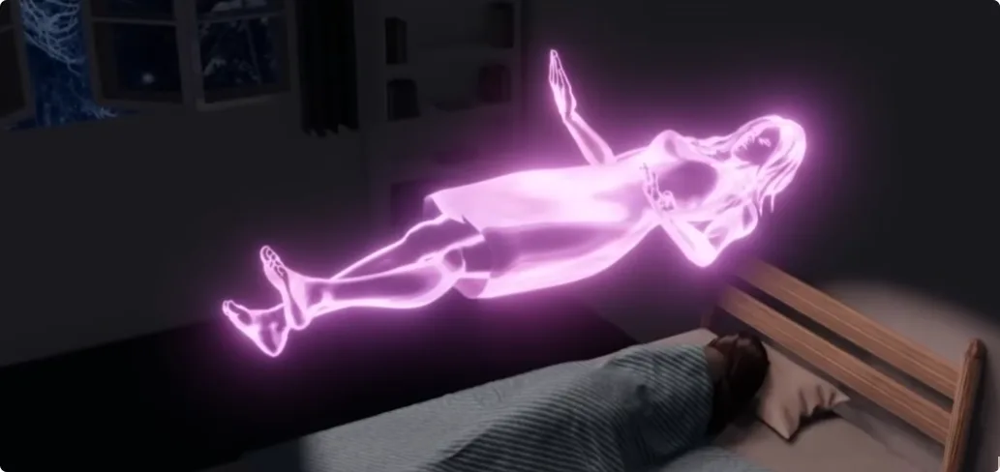

所以为什么作恶多的人，死后容易“下沉”？
并不是某个神明讨厌他，而是因为他的灵魂频率已经形成了。
带着怨气、亏欠和执念离开肉身，魂识自然会往相应的频率层去。

> _**同气相求，同频相应，这就是天道。**_

不是有人把他拖了下去，而是：

> **他这一生，把自己修成了那个频率。**

你是什么样的气，就会去往什么样的地方；你是什么样的心，就会感应什么样的境；你是什么样的业，就会进入什么样的秩序。

---

## 10. 地府真正的作用：不是“折磨灵魂”，而是完成一次无法逃避的整理

所以，地府并不是一个单纯的惩罚场。
它更像是一个**因果的执行层**，为了弥补人间无法完成的清算。
一个人在人间制造出来的混乱，需要在那里被重新整理；他在人间没有学会的课，要在那里重新学。

> **人间审不到的，地府审；人间逃过去的，阴司记着。**

真正值得害怕的，并不是死亡本身。
真正可怕的是一个人糊涂了半生，以为死完之后一切都结束了，结果停止呼吸的那一刻，却发现：

> _**意识在。**_
> 
> _**亏欠在。**_
> 
> _**执念在。**_

只是这个时候，他已经没有肉体可以分散注意力了，没有手机，也没有别人替他遮掩，只能面对自己。

**这才是地府真正可怕的地方。**

### 死后的一次“总清算”

灵魂自然下沉之后，地府会承担整理一生记忆的责任。
善恶要整理，功德要整理，你这一世完成了什么、没完成什么，都需要整理。

> **轻的上升，重的下沉；轻的归轻处，浊的归浊处。**

有功的受其福，有罪的受其业；有冤债的先处理冤债，有福报的得相应的安置。
地府也不是一个灵魂的终点。
它更像一个**整理系统**：
1. 有审判；
2. 有判罚；
3. 有惩戒；
4. 有教化；
5. 有等待；
6. 也有转生。

---

## 11. 所谓“审判”：真正面对的，是自己这一生做过的一切

很多人在活着的时候很擅长自我欺骗：

> “我也没有办法。”
> 
> “现实世界就是这样。”
> 
> “我也不是故意的。”

人活着的时候，有太多借口了。

但是死后，这些借口就都没了，只剩下你最真实的魂。

而那时候，人会看见自己真正做过什么，会看见别人因为自己承受过什么，会看见一句话所造成的伤害，会看见那些自以为无人知晓的念头，其实早已写进自己的灵魂结构里。

> **这就是审判。**

### 慈悲为什么不是“做什么都没关系”

但是这个时候你可能会有疑问：
神佛不都是慈悲的吗？不都是爱世人的吗？怎么会舍得一个人死后受这样的苦呢？

很多人误解了慈悲。
以为慈悲就是：

> “没关系。”

做错了没关系，说一句“我知道错了”就应该被原谅。

这不叫慈悲。
这叫：

> **纵容。**

真正的慈悲，一定包含着**承担**。
一个人伤害了别人，他就要知道别人为什么痛；他造了业，就要知道业为什么会回到他的身上；他如果轻贱了生命，就要知道生命为什么珍贵。
所以地府的惩罚不能只理解为惩罚，它更多的是：

> **教育。**

一个人让别人恐惧过，他就要明白恐惧是什么；他让别人绝望过，就要明白绝望是什么。
不是为了折磨一个人，而是要让他的魂明白。

因为不明白，就会继续造；继续造，就会继续沉；继续沉，就会离道越来越远。

> _**这就是天道的慈悲：它不是取消后果，而是让后果帮助我们醒来。**_

---

## 12. 地府最厉害的地方，是让人“看见真实”

这就是“罚”的真实含义。
不是为了让我们痛苦，而是为了让灵魂深处落下烙印，明白：

> **原来我们不能这样活。**

地府最厉害的地方，就是让我们看见真实。

> _**看见真实本身就是一种惩罚，看见真实本身也是一种救赎。**_

因为只有看见了、明白了，才可能改；只有承认了，才可能还；只有面对了，才可能超脱。
所以地府的存在，它就是慈悲的。
但它的慈悲不是纵容。

> **它的慈悲，是让我们明白。**

### 天道不仅惩恶，也会让善不白做

很多人印象中的地府只讲恶人受罚，但真正的天道不只是惩恶，**天道也护善**。
如果地府只是为了惩罚人，那它还不够完整。
它真正完整的地方，在于：

> **它让善不白做。**

很多善人在人间看起来吃亏，但从因果来看，这种人未必真的亏。
他守住了自己的气，这就是福。
福不一定马上表现为钱。
有时候表现为灵魂的清明，在离开肉身之后：

> **有路可走，有光可寻。**

你仔细用逻辑想想就会明白：

> _**真诚和善良，才是这个世界上最智慧的处世之道。**_

善恶之间，就算逃过了人间，也逃不过因果，更逃不过天道。
而天道是不虚的。

---

## 13. 为什么人间反而是最珍贵的地方：只要还活着，一切就还有修改空间

人间是很美好的。
只要你还在人间，很多因果就有转换的空间。

你可以：
- 认错；
- 补偿；
- 修行；
- 行善；
- 改变命数；
- 从一个很低的状态、很低的频率里，一点一点把自己拉回来。

但如果一个人主动毁掉人生，自杀就等于中途毁了这一世的功课。

> _**这不是逃出考场，而是交了白卷，还把试卷撕了。**_

人活着的时候，痛苦还有出口。
可以出去走走，可以找人哭，可以睡一觉，可以慢慢转念。
而自我伤害，从来都不是终点。

因为按照这里的观点，痛苦不会因为肉体死亡而自动消失。肉体死了，但导致痛苦的业力、执念、恐惧、未解的心结，以及死亡那一瞬间的绝望仍然存在。

甚至因为没有肉身作为缓冲，痛苦会变得更加直接，也可能因为死亡前的强烈执念，反复停留在当时的状态。

这也是为什么会诞生厉鬼。
他们既是吓人的灵体，同时也是最可悲、最可怜、被惩罚的灵魂。

为什么惩罚他们？
不是因为天地冷酷，而是因为：

> **人生太珍贵。**

你不能轻易毁掉一个本来可以修、可以改、可以还债、可以积福的机会。

> _**真正的解脱，不是把肉体杀死；真正的解脱，是把无明破掉。**_

如果有人正在经历自我伤害的念头，最重要的不是研究死后会怎样，而是**先活下来、先找人、先求助，让自己离开那个极端的状态。**

玄学也好，因果也好，所有真正的正法都不会鼓励人放弃生命。

> **生命还在，就还有转机；只要还在人间，就还有改命的机会。**

---

## 14. 真正的玄学不是让人怕鬼，而是让人重新学会敬畏

我们以为自己比古人懂得多。
可是古人敬天畏地，现代人却大多不敬畏。

古人知道人生难得，现代人却很容易随意糟蹋身体；古人知道祖先有灵，现在城市里的年轻人觉得祭祀可笑；古人知道善恶有报，现在很多人觉得，只要法律抓不到就没事。

我们真的比古人聪明吗？

>我看未必。

我们只是：

> 工具更多了；
> 
> 信息更多了；
> 
> 欲望更多了；
> 
> 噪音更多了。

但感知力未必更强，敬畏心未必更多，灵性未必更高，对生命的理解也未必更深。

真正的玄学，不是为了让人沉迷在怪力乱神里，不是让人天天怕鬼，不是让人把所有问题都推给前世业障、冤亲债主，然后逃避现实责任。
真正的玄学，是为了让人重新回到：

> **敬畏, 敬畏天地，敬畏生命，敬畏因果，敬畏那个看不见的秩序，敬畏自己的每一个起心动念。**

一个人如果因为相信地府，变得更恐惧、更消极、更逃避，那他就是没有真正地懂。
一个人如果因为相信因果，变得更善良、更清醒、更珍惜生命：

> **那他才算真的懂。**

---

## 15. 讲地府的最终目的，不是告诉你“死后去哪”，而是告诉你“现在怎么活”

所以讲地府，不是为了让人害怕的。而是为了让人：

> **醒。**

因为什么时候醒，都来得及。

> _**一念心清净，处处莲花开。**_

一个人只要还活着，今生还能为人，还能害怕，地府就是天地在给他机会改。
我们本期讲地府，真正要回答的不只是：

> **“人死后去了哪里？”**

它真正要回答的是：

> **“人活着的时候，应该怎么活？”**

如果人死后一切皆空，那就变成谁聪明、谁狠、谁就赢了。
但当我们得知死亡不是结束、因果不会消失、地府会继续清算，那么人生就不同了。一个人就不能只看眼前。
不能只看利益，不能只问会不会被人发现，不能只问法律会不会管。
而是应该问：

> **“这件事情会不会伤害我的德？”**
> 
> **“会不会污染我的气？”**
> 
> **“会不会让我离道更远？”**

这才是玄学真正的智慧。
它不是迷信地告诉你：

> “世界上有鬼，会来抓你。”

而是告诉你：

> _**你所做的每一件事情，最终都会塑造你自己。**_

你说过的话在塑造你；你动过的每一个念在塑造你；你伤过的人在塑造你；你救过的人也在塑造你。

> **每一次选择善，魂就轻一点；每一次选择恶，魂就重一点。**

最后你去哪里，不是别人随便决定的，而是你自己一步一步走出来的。

**地府，只是让这个结果呈现。**

---

## 16. 真正高明的人，不是怕地府，而是让自己“合于道”

真正高明的人，不是天天怕地府、怕鬼。
真正高明的人，是：

> **让自己合于道。**

什么叫合于道？
- 不违背天理；
- 不亏欠良心；
- 不轻贱生命；
- 不纵容恶念；
- 不把别人当工具；
- 不把身体当垃圾；
- 不把善良当愚蠢；
- 不把因果当笑话。

合于道，不代表你永远不会犯错。
人都可能犯错。
真正重要的是：

> **犯错之后能不能醒；**
> 
> **跌下去之后能不能重新爬起来；**
> 
> **无明之后能不能重新开始。**

要明白，天道一直在给人机会。

> _**人间本身就是机会。**_
> 
> _**活着就是机会。**_
> 
> _**痛就是机会。**_
> 
> _**还会想变得更好，就是机会。**_

最可怕的不是犯错，最可怕的是不觉得自己有错。
最可怕的不是业，最可怕的是：

> **一生都没有开悟的机会。**

到最后讲地府，不是为了让人绝望，而是为了让人珍惜。
**此刻，趁肉身还在，修；趁身体还能用，修；趁心还没有彻底麻木，修。**

这是神佛给世人的慈悲。

> _**从无明里回头，前念迷即凡夫，后念悟即佛。**_
> 
> _**与诸位共勉。**_

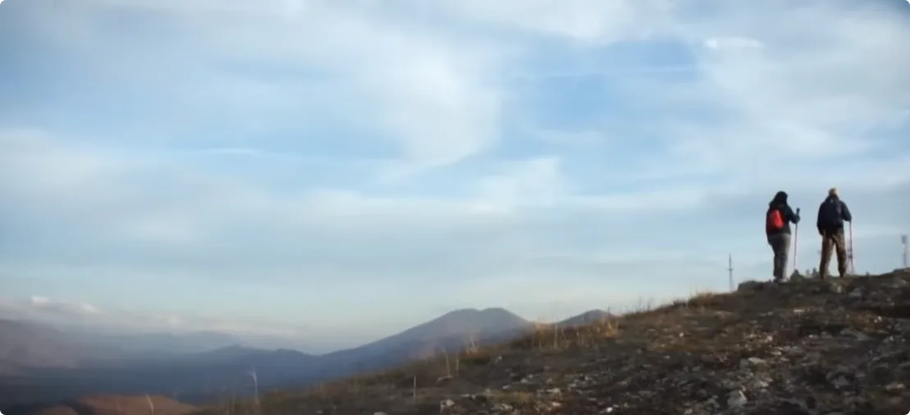

## 世界运转的底层逻辑和规则

## 前言

* 你是不是跟我也有同样的疑问：
  * 为什么这个世界有这么多的修行法门？
  * 为什么中西方有这么多的概念？
  * 为什么有一些相通，有一些又互相矛盾？
  * 到底谁对谁错？
  * 到底是不是条条大路通罗马？
  * 到底应该相信谁？
* 作为一个修仙者，我今天就一个视频给大家整合所有的学说，捋清楚这个世界的**底层逻辑**和**运作规则**。小板凳坐好，绝对颠覆你的认知。

## 正能量世界的运作规则

* 首先这个世界绝对是**大道至简**的，没有很复杂的概念，甚至一个公式就能解释世间所有的事情。
* 尼古拉·特斯拉曾经说过：“如果你想发现宇宙的秘密，就要从**能量**、**频率**和**震动**的角度思考。”
* 要理解这个世界的底层逻辑，首先我们就要把所有的认知和概念都放一放，把这个世界当成一道数学题来解。

## 核心概念一：能量体与能量值
* **所有存在都是一个能量体**：
  * 是能量体就有一个**能量值**。
  * 能量体存在就会有消耗，能量体想生存下去就需要补充能量。
  * 头顶上都有一个数值，数值越大能量体的等级越高。

 **修炼的本质**：
  * **补充能量 < 消耗能量**：能量体慢慢死去（所有已知生物都在这个范畴，因此有寿命）。
  * **补充能量 = 消耗能量**：能量体死不了，即**永生**。
  * **补充能量 > 消耗能量**：能量体不断壮大，量变到质变时升级（**升维**）。
  * 所有能量体想方设法补充能量、壮大自身能量值以达到永生和升级的状态，这个过程就叫**修炼**。
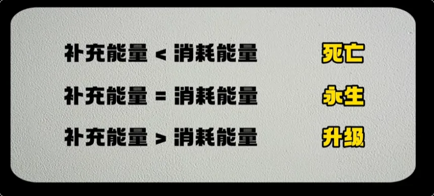

* **自主意识与非本能补充**：
  * 一个能量体能不能、会不会用**非本能的方法**补充能量，决定了其是否有自主意识和会不会修炼。
  * *非修炼范畴（天生/本能方法）*：人类通过饮食获取能量、植物进行光合作用。
  * *修炼范畴（非本能方法）*：
    * **正道**：石头成精、狐狸拜月，通过吸收天地灵气、日月精华等纯正能量改变自然形态。
    
    * **偏邪**：吸收其他能量体的浊气（如妖吸人阳气、吞食其他妖的妖丹）来壮大自身能量场。

## 关于正负能量

## 核心概念二：能量的正负性
* 《道德经》云：“道生一，一生二。”
  * **道（本源）**：能量值为**无限大**。
  * **一分为二（阴阳）**：即**正能量（+）**与**负能量（-）**。
* **正负抵消法则**：
  * 正负能量相遇会清零抵消，而清零对于能量体就意味着**死亡**。
  * 能量体只能在正能量修炼或负能量修炼中**二选一**：要么在加号世界持续壮大，要么在减号世界持续壮大。

**人类的特殊性**：
  * 人类是中间过渡的存在，是一个中性偏负一点的容器，可以同时装载正能量和负能量。

## 维度与能量等级
* **维度的划分**：
  * **人之上**：有很多维度，存在亿亿万万的能量体（仙、佛、菩萨、神、天使、部分外星人等）。

  * **人之下**：也有很多维度与众生（妖魔鬼怪、部分负面外星人等）:

  
名词不重要，核心只看其**能量值**。

---

## 正负能量的战斗力

* **能量数值对抗逻辑（数学模型）**：
  * 假设人类能量值为 `-1`，大魔为 `-10000`，神仙为 `+10000`。
  * 你与大魔、神仙的能量级别差距都是 `9999`。
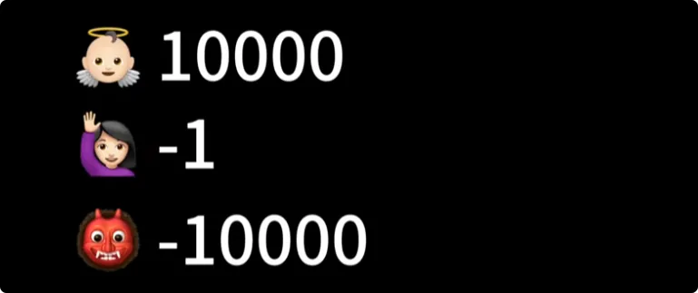
* **战力对比法则**：
  * `+1000` 神仙 vs `+100` 外星人：**打得过**（能量值高胜出）
  * `+1000` 神仙 vs `-100` 外星人：**打得过**
  * `+1000` 神仙 vs `-10000` 外星人：**打不过**
  * `+1000` 神仙 vs `-1000` 外星人：**很难说**

## 正负能量环境的差异和层级差距:

* **正负能量环境差异**：
  * 负能量极其浑浊，没有实体愿意一直待在浑浊之地。
  * 许多大妖大魔甘愿归顺天道、放弃千万年修为，转世为人以求正道修行的机会。

* **认清现实与层级差距**：
  * 针对“我就是宇宙、我就是本源”的说辞：你的肉身依然在三维世界。
  * 人类连接一个能量值 `100` 的小神都极为费劲，更遑论直接连接无限大的本源。

* **层级不可逾越性**：
  * 犹如一只觉醒的蚂蚁想直接给总统打电话：
    1. 蚂蚁没有制造电话的功能。
    2. 物种与层级完全不同，忽略了中间 99% 的众生差距。
  * 二维与三维、人类与神仙、神仙与本源之间均存在巨大的维度跨度。

## 在往上呢 ?

* 神仙、佛、菩萨往上的世界，本质上只是一串串**数字**。
* 追求过高而脱离实际并无意义，关键在于明确自身在整个能量体系中所处的具体位置。
* 99.99% 的人既不知道自己的能量值，也不清楚自身的正负属性。
* 与其耗费时间胡思乱想，不如脚踏实地提高能量值，一步一个脚印往上提升。

## 关于普通人如何趋吉避凶

> _**不让它留，不让它附，不让它跟，不让它钻。**_

## 1. 所谓“意外”并非突然发生：背后的能量早已积累到临界点

如果是你开车经过，或者从这里路过，你能保证出现意外的人不是你吗？想必大多数人会觉得这是造化弄人，谁也不敢保证自己安全无事。

但如果我告诉你，所有的意外都是可以避免的，知道背后原理的人，可以大大降低意外风险，任何人都可以将风险转移出去，你还会坐以待毙吗？

今天小烨给大家揭露一下意外发生的原理，教大家日常怎么辟邪。

### 车祸发生之前，周围的能量已经发生变化

首先说原理。比如我们常见的车祸，其实早在发生之前，周围看不见的地方已经处于**负能量量变的极限**了。

比如这几辆车，有特殊感知力的朋友可以察觉，上面早已爬满了大量的阴性众生，车上的人也是如此。一个能量场干净的人，绝不会被卷入这类事件。

同理还有这条马路，早就积累了大量的煞气。一个气场衰败的人，一辆能干扰人心智的车，偶然地把人带到了一个火候合适的地点，意外就发生了。

> **整个过程都不是巧合。没有什么意外，都是蓄谋已久。**

在玄学的世界，能量造成了表面事实，事实反映背后的能量。因为人身上的生气由兴到衰，不会凭空消失得无影无踪，而是会随着死亡瞬间散到周边空间中去，转化成更低频的能量。

这个过程，是阴性众生最方便捕食人类能量的时机。
可以去看我选车那期视频。大多数深色车很快就会变得不干净，很多连撞的车都载着脏东西，只是人不知道。
同样，如果突然生了一场大病，或者突然运势低落，也不用怀疑，一般身上或者家里都不会很干净。

### 小意外如果反复出现，就不要再当作巧合

如果发生过小意外，但是又不放在心上，那接下来大概率会发展成更不好的事情。

那为什么阴性众生要害人呢？
*因为**万物都需要能量来生长**。哪怕是最底层的生灵，也要吃一些能量废料来维持生存。这其中最方便获取的能量来源，就是人的生气。*

其次，只有提高自身能量级别，才有生存的主导权。

> _**天地不仁，以万物为刍狗。**_

底层众生弱肉强食，本就是最基本的自然法则。理想的道德只建立在上层社会，不在下层。所以人间背后的下层灵界，就是极度弱肉强食的：吃你，不需要跟你打招呼，自然法则默许。

正如人默许自己是食物链顶端的存在，默许人可以吃遍万物。

---

## 2. 阴性众生为什么要干扰人：它们需要你主动释放“生气”

那它们是怎么吃人气的呢？
它们想要吃人气，就必须制造点什么，让人主动释放自己的生气。
比如**纵欲**，又或者蹲守在一些高危场所活动，甚至蹲在人本身旁边等着捡漏。

能量大的灵体，甚至可以干扰人的心智，比如让人抑郁，让人想自杀，或者想去容易发生意外的地方。

有些人喜欢看恐怖题材，甚至去废弃楼探险，不去做点惊奇的事情就不舒服，其实背后都有被干扰。一惊一乍之间，人的心神就会不稳，人的生气就会释放得更多。

所以人有千万种光怪陆离的意外死法，背后都是有人在精打细算。

那人应该怎么避开这些意外呢？
最好的方法，就是趁早切断这些干扰源。不要习惯了让它们在你身边晃悠，陪你吃，陪你睡。

小烨总结了四步：

> _**1) 不让它留**_  
> _**2) 不让它附**_  
> _**3) 不让它跟**_  
> _**4) 不让它钻**_

---

## 3. 第一步“不让它留”：保持家宅和车辆干净、流动

### 来过可以，但不要让它长期留下

**第一，不让它留。**

如果它来过，那就别让它在自己的家里、车里逗留。

什么叫来过？

>**进过你的家门，就叫来过。**

灵体也是能量体，也称之为“气”，本身会随着空气和水等物质的流动而移动。

这也是为什么在家宅风水里常说，房门不要对着大马路、电梯口、楼道走廊。因为房门正对通道，就好比接了一个排气管，脏东西都往你家里排。

同理，房子冲着水也是不可以的。比如冲着排水管，就容易滋生一些不好的东西；挨着河流、池塘建房也不行，河流能带动的东西更多。

### 家里最简单的处理方式：通风、清理、不要堆积

再说家里人在外面进进出出，难免会把外面的脏东西带回家，所以：
- **家里要多通风，让空气流动起来；**
- **不要的东西都扔掉，不要堆太多；**
- **经常挪动物品、擦洗、打扫卫生。**

因为你不知道物品背后关联着谁。东西堆得太多，就容易住进各种杂七杂八的灵体。
而打扫卫生的过程中，东西挪来挪去、擦来擦去，就会让灵体们觉得住得不安稳，不如找下家去了。
再者就是家用车。
尤其地下车库空气不流动，灵体容易扎堆。所以平时自己的车要开到敞亮的地方，多通风、多擦洗。

---

## 4. 第二步“不让它附”：长期贴身、被欣赏的物品尤其要注意

**第二，不让它附。**

如果它想要附体在某件物品或者某个角落，那就要阻止它。

为什么要附体？

因为众生都是临水而居的。这里的“水”，指的就是人的生气。

如果能天天吃到人气，灵体当然是要挨着人过日子的。除非自身能量级别足够高，在哪里都可以过得安稳，否则大多数灵体还是希望附在某个具体的事物上，安稳生存。

### 老家具、玩偶、绘画和饰品为什么容易成为“附着对象”

所以凡是人天天贴身触碰的物品，或者赏心悦目的物品，都是不错的附着对象。

举几个例子。

比如十几年不换的木质沙发、茶几、柜子、床，真的干净不了一点。很多老房子阴气重，根源还在这些老家具上，或者黑掉、霉掉的墙壁上。

又比如家里的：
- 玩偶；
- 绘画、海报；
- 饰品；
- 长期陈列而且被人反复欣赏的物件。
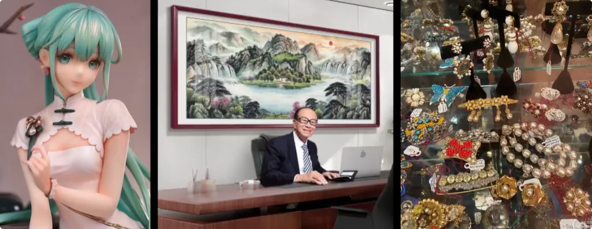

你看它的时候，肯定跟看普通日用品的状态不一样。你一定是带着欣赏的情感和想法的，你是**心有所向**的。

这样就会产生能量连接，物体多少都能收到你的一些能量，所以灵体能住就会住进去。

有人说，会不会太夸张了？我平时看一眼，就会惹上它们吗？

你可以用极限法来模拟一下。

假如你超级喜欢一样东西，甚至想把它占为己有的地步，这时候你一定投入了相当多的情感和心神，这时候你的生气就是在往外释放的，尤其是向你所关注的那个东西释放过去。

现在把这份生气稀释成365份，就是一般情况下你每天分给某个欣赏物的能量。

> _**千里之堤，毁于蚁穴。**_

人不知道温水煮青蛙，它们却懂得积少成多。况且大多数人还会爱惜好这些物品，避免磕着碰着，间接打造了一个舒适、安稳的附身场所。

所以你的家里、车里，尽量不要摆放太多海报、画作、玩偶、饰品等。这些物品在外面看看就好，不要带回家。

更不要专门去开光、请镇宅物、请护身符。要是请了大家伙，你就完犊子了。

### 床品、衣柜和汽车要经常清理

最后重点关注家里的床单、被套，要经常换洗；衣柜也要多通风、多擦洗；还有车座、车身，也要多清洗。

在大部分情况下，中小型灵体是可以赶走的，因为它们能量小、能力弱。

---

## 5. 第三步“不让它跟”：少去容易把东西“带回来”的地方

**第三，不让它跟。**

所谓不让跟，就是你别去那些脏东西多的地方，更不要惹到人家。

### 第一类：废弃楼、停工建筑和长期无人居住的地方

首当其冲就是别作死，去废弃的楼房探险。

尤其是大片大片停工荒废的楼房，基本无家可归的亡灵都会住在里面。

> **记住：人不住的地方，有的是东西住。**

可不只是一两个，而是一大群。

而且一旦成群结队，就一定会跳出一个大佬，逼它们出来打工。

所以人去到那种地方，无论它情不情愿，它都得来找你一趟。

### 第二类：古董、首饰、玩偶以及古建筑

其次就是玩偶、古董、首饰类的商店。

每件物品都住着东西。越是光鲜亮丽、越打动人、越昂贵的物品，上面所附的灵体就越强。
因为人家灵体也不傻。
跟着高富帅、白富美，可以吃香喝辣过好日子。所以好的位置，它们也是要相互争抢的，全凭自己的手腕。

> **所以你一进门店，都不知道是谁在挑选谁。**

这种地方就不再多提了，往期有说，都是一个个大大小小的公司，产品是信仰，人气做货币。
古建筑也是一个道理，尤其是古雕塑、古塔，见着就赶紧溜吧。

记住，**跨越的时间越久，就代表物体存在得越稳定。**

像文物这种被保护、被欣赏，甚至被崇拜的东西，那是极好的住所，所以博物馆也别去。
有些人作死，去这些地方一惊一乍的，还可能对某些物品偷偷使坏，殊不知惹到人家会有什么后果。轻则鬼压床，重则发生意外。

### 大自然也不是哪里都适合去

小烨曾说要多去大自然。

很多粉丝朋友可能认为，去到大自然就可以了，就舒坦了。

但是**大自然也是鱼龙混杂的**，有正能量汇聚的节点，就有负能量汇聚的节点。搞不好去一趟自然，还能带个妖回来。

这里小烨编了个口诀，可以帮你分辨大多数情况下的自然好坏：

> _**多去敞亮、宽阔的自然，少去幽静、逼仄的自然。**_
> 
> _**神仙看了都想住的地方，可以留；看了都摇头的地方，你要走。**_

神仙不会住在悬崖峭壁、蜿蜒洞窟。

所谓：

> _**君子不立危墙之下。**_

---

## 6. 第四步“不让它钻”：心神不稳时，不要再进入高风险环境

**第四，不让它钻。**

所谓不让钻，就是不要让它有任何机会钻进你的身体里。

人在什么时候最容易被附体呢？

主要有两种情况：
1. **心神不稳的时候；**
2. **处于高危环境的时候。**
   
### 情绪低落或者过度亢奋时，更要远离高风险场所

比如你在心情很低落的时候，就不要去荒山野岭、废弃大楼、地下车库、河边池塘等这些地方。
又比如你在非常亢奋的时候，就不要去酒吧宿醉，不要随便发生关系，容易被醉死鬼和狐蛇妖附身回家。
又或者很多人去玩密室逃脱。

被吓着的那一瞬间，人的意识是恍惚的，你不知道有多少灵体在守株待兔，等着这一刻。

有些小朋友去荒废大楼玩捉迷藏，就经常出现“丢魂”的事情。
那原理是什么呢？

因为人在心神不稳的时候，**气场屏障就会弱很多**，也是灵体最容易突破屏障附体的时候。

### 一旦进入身体，就会让人持续停留在“对它有利”的状态

而它们钻进去之后，就会想办法影响你的气场，让你一直想抑郁，或者一直想纵欲，让你的身体和精神处于：
- **对你负反馈；**
- **对它正反馈。**

这样它们才能吃得更深。
由皮到肉，再到骨髓、血液，一层层气场吃下去。
等到**阴病反阳病**的时候，说明你的气场屏障已经被吃得很脆了。

### 高危环境本身就是最适合“捡漏”的地方

另一种情况，是人处于高危环境。
周边等着附身的灵体也是相当多的。
且不说死亡那一瞬间人的气场释放出来，就算弄得半死半残，那气场虚弱的你也是很适合附身享用的。
所以：

> **不要做冒生命风险的事。**

因为当你在做这件事情的时候，你根本不清楚自己的意识有没有被干扰。

---

## 7. 四步辟邪的核心：减少干扰源，让自己的环境保持干净

做到以上四步：

> _**不让它留，不让它附，不让它跟，不让它钻。**_

起码可以让你周围的环境保持干净，可以帮你避免被中小型灵体迫害，能保持正常的运势，保持身心健康。
但是，如果你已经发生意外了，甚至能量低到在大白天都可以感受到它们在你身上，或者知道家里住着大佬了，那你就必须来找我了。

要么做清理，要么早日踏上真正的修行。
当然，我还是建议想修行的人来找我。

毕竟：

> **只有修行人才知道能量之可贵，才懂得珍惜能量。**

## 阳气可以赶走阿飘吗

> _**人住的房子里，真正需要注意的可能不只是朝向、格局和摆设。按照这套阳宅观念，首先要明白的是：活人的规则，只能约束活人。**_

## 1. 阳宅第一条规则：活人的规矩，在“灵界”并不管用

大家好，我是修炼者小烨，是一个漫山遍野找能量、不爱城市、只爱修炼的散人。今天小烨想给大家分享的话题，是**人住的房子**。

你有没有在家里遇到过邪门的事情？是不是还相信人气能赶走脏东西？怎么知道自己的房间有没有脏东西呢？本期小烨会给大家揭露房子里那些不为人知的秘密。

阳宅，就是指活人住的地方，是相对死人而言的，毕竟阴阳有别嘛。从古至今，人的很多规矩都围绕着**趋生避死**来制定，逐渐发展出了各种玄学理论、公式和工具。

大多数玄学爱好者认为，依据这些理论办事，就可以很好地和另一个层面打交道，比如：

- 摆个什么东西就能招财；  
- 布个什么局就能辟邪；
- 放个什么物件就能镇宅。

但是你有没有想过：**这些灵体真的会听你活人的规矩吗？**

你立个牌子说“非人免进”，他们就不会进去住吗？
答案显然是否定的。

人家没有形体，无拘无束，干嘛要听你活人唠叨？活人的法度只能约束活人，但是从来没有办法去约束死人。

> _**这就是今天一定要知道的第一个阳宅要点：活人的规矩，在灵界不顶用。**_

因为常人看不见、感受不到，所以从选择房子，到居住，到莫名生病，再到请人做法，这整个过程中，你根本不知道有谁从你家里进进出出过。

其实一个人的家庭、爱情、事业、财富、健康等等，有些不顺利，甚至可以说是厄运，在这套体系里可能就被认为跟房子有关系。

有些人已经怀疑过是家里的格局不好，请了大师来帮忙，但是小烨认为，这些都是无用功。

---

## 2. 大师为什么不一定有用：能抓老鼠的，不一定是猫

因为市面上的大师做的事情，还是想通过**活人建立的规矩去约束死人**。

很多观众朋友可能就要跳出来问了：

> “不对呀，小烨。很多大师资历老、有名声，理论也扎实，给人驱邪也确实有见效啊。”

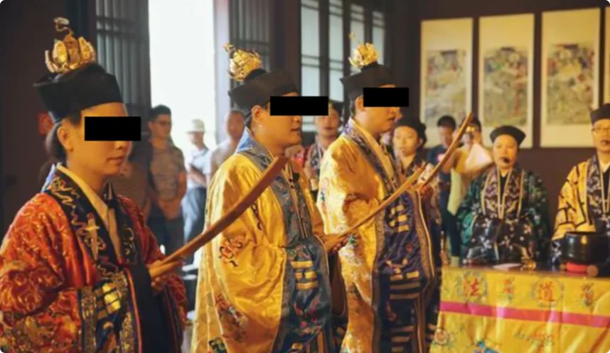

这里小烨有必要解答一下。

**资历老、有名声，不代表方法就是对的。**

> _**能抓老鼠的不一定是猫，也有可能是蛇。借用的是猫的力量还是蛇的力量，人要付出的代价是不一样的。**_

我敢保证，那些大师自己都不知道，将来要付出什么样的代价。
其次，古人写的书也不一定是对的。
在玄学这条路上，学富五车、名声赫赫，没有用。玄学只看重**真假二字**。

**真的东西一字千金，假的东西制造得再漂亮也不顶用。**

所以你看，从古至今，任何跟玄学有关的理论都是越搞越多，逐渐形成壁垒，让人越来越看不懂。背后都是人心贪婪所致，都想留下名声。

其实真正的玄学很简单，知道真实的原理，就足以把其他东西甩掉。
所以接下来，我会还原平日里看到的灵界世界，告诉你什么才叫趋吉避凶。

---

## 3. 香港“刀炮之战”：建筑的形状，为什么会被解释成“煞气”

有这么一件真事发生在某个小渔村。

时间回到1982年⌚️。

坊间传闻，港英政府故意将渔村中条件不好的一块地皮卖给了中国银行。在各种恶劣条件下，中银最终还是在渔村立起了当时的亚洲第一高楼——**中银大厦**。

中银大厦外形犹如一把三棱钢刀，尖锐的棱角分别朝向周边建筑。后来围绕中银大厦、汇丰银行以及港督府，又逐渐衍生出了香港非常有名的“风水大战”传说。([维基百科](https://zh.wikipedia.org/wiki/%E4%B8%AD%E9%8A%80%E5%A4%A7%E5%BB%88_%28%E9%A6%99%E6%B8%AF%29?utm_source=chatgpt.com "中銀大廈 (香港)"))
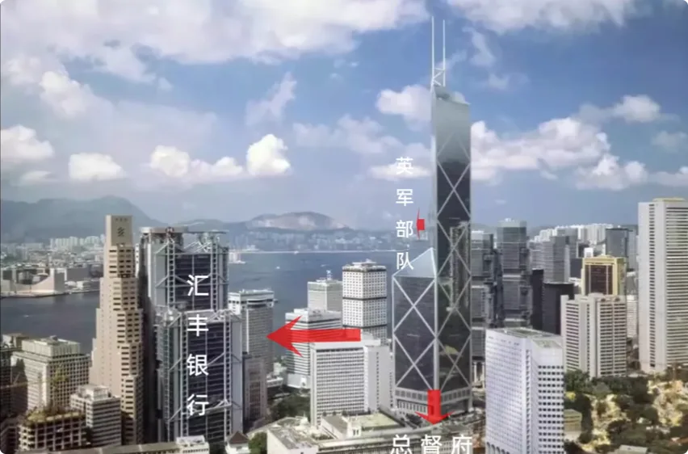

传闻中，汇丰银行后来直接在顶楼架起了两门“钢炮”，目标直指中银大厦。夹在二者之间的长江集团中心，则最终建成了一栋方方正正、外形收敛的大楼，像是一面盾牌，尽可能避开两边的“刀炮”。

时至今日，如果你去这附近转转，会发现周边不少建筑的造型都颇为特别。
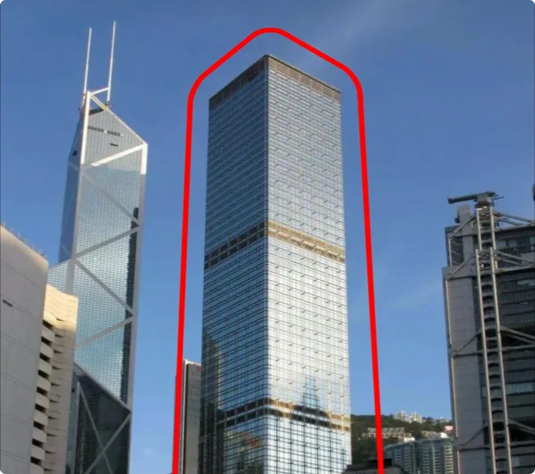

很多观众朋友肯定已经一头雾水：

> **尖刀、大炮这种形状的建筑，真的会起作用吗？真的不是心理安慰吗？**

小烨来给大家解释一下，在这套体系里背后的原理是什么。

### 物体是瓶子，能量是瓶子里的水

上期我们聊过，在这个世界里，**能量是根本**。
能量从自然中生成后，会散落在大地上，然后附在有形的物体上。
可以把物体理解成一个瓶子，而能量就是瓶子里的水。

水能伤人吗？

>能。

关键是怎么用：

1. **量少而缓**，一时无害，但仍可以滴水穿石；
2. **量少而急**，则可以一击致命。
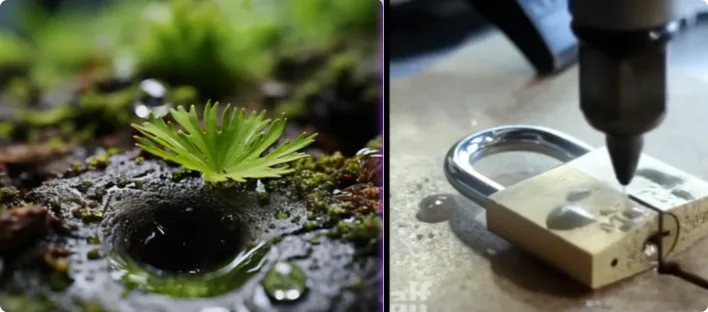

小烨平时在做法的时候，就是将能量注入到一个容器里，借助容器的“形”来塑造能量的形，再施加一个推力，就可以把能量打出去。

而现在如果换成一栋数百米高的庞然大物，本身形状又锐利无比，按照这套理解，能量的**泄口**就会集中在细细的棱角上。

这种能量，就叫：

> **煞气。**

而且还是**大煞**。

### 两股煞气互相对冲，并不等于互相抵消

那汇丰建造另一个“煞角”与之相对，可以化解吗？
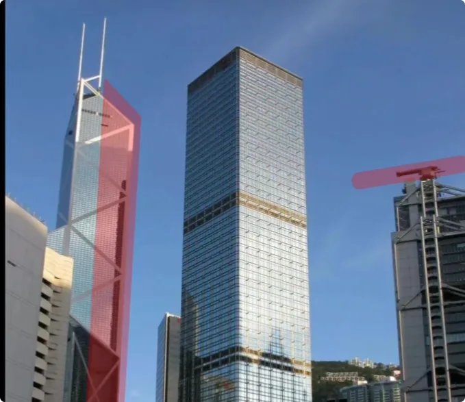

其实不能。

因为按照这里的能量逻辑：

> _**能量只有一正一负才会抵消，如果两栋楼发出的都是负能量，那就只会 1 + 1 = 2。**_

那这些煞气去哪儿了呢？

按照小烨的说法，其实只是被抛到了周围空间，由周边的环境和人吸收掉。

所以如果你家里有很尖锐的东西，尤其是石器、金属等材质，小烨的观点是要尽量清理。任何正对着人的**尖角**，哪怕是窗外建筑出现的棱角，也尽量避开。

---

## 4. 阳宅格局能做到的，只是“少一点负能量”

那怎么才能化解已经出现在身边的负能量呢？
刚才说了，按照这套体系，只有正能量才能抵消负能量。
所谓正能量，指的是能滋养万物生长的能量。它有一个中国人都知道的称呼，叫：

> **真气。**

在灵界，这就是最好的资源。
试问资源有这么好拿吗？

答案是否定的。

有形界和灵界存在的个体数目这么多，好的东西怎么可能扔在大街上给大家随便挑选？怎么可能你一念经、一打坐，好的能量就会自动投怀送抱呢？

显然是不成立的。

实际上，人界和灵界对待资源的观念，以及衍生出来的规则，是大同小异的：

- 比较文明的上层灵界，讲究**能者拿，也讲究拿的秩序**；
- 比较野蛮的下层灵界，则没有太多讲究，主打一个**能者强，弱肉强食**。

有些人可能要问：

> “不是说灵界都是高灵性的吗？怎么可能没人来主持公道呢？”

小烨反问一句就明白了：
人类文明进步到现在，谁又会去管哪个池塘里的哪条鱼，吃了哪只虫子呢？
根本不会。

文明的差距摆在那里，完全不是一个档次。人只会说这是自然法则，弱肉强食与我无关。

上层灵界又何尝不是这么想的呢？

> _**所以第二个阳宅要点就是：按照小烨的体系，人的周边，也就是下层灵界，并不会天然存在大量好的能量。**_

想要单纯靠改变家里的格局就“转好运”，是不可能的。
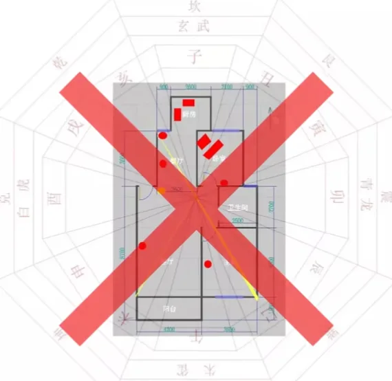

改变格局能做的，只是尽可能减少负能量和负面存在的淤积，**仅限于减少霉运发生的可能性。**

---

## 5. “请神容易送神难”：开光、镇宅与供奉物为什么反而可能成为风险

那些请市面大师开光镇宅的物品，以及做法清理住宅的事情，在小烨这套体系里反而被认为存在风险。

你有没有想过：

> **他们使用的力量，到底来自哪里？**

他们可能会说来自灵界、来自师祖、来自高灵。
但小烨的疑问是：

> “他们凡人之躯，哪来的资格直接对接上层灵界呢？”

按照他的观点，背后无非还是下层灵界里的某些“大佬”而已。
他们自己都分辨不出利害，只凭心中的信念，认定自己走的是正道。
所以有句话叫：

> _**请神容易，送神难。**_

这里的“神”，按照这套说法，指的就是这些负面的大佬。
如果普通人把这些存在请到家里，那才是真正的问题。
所以如果家里有镇宅石、桃木剑、神像等等，小烨的观点是，都需要重新思考它们到底承担了什么作用。

很多人喜欢玄学、喜欢佛道、喜欢西方冥想、喜欢灵性和新纪元，估计要失望了。
因为在小烨的描述中：

> **真正的灵界远远要残酷得多。**

里面的水很深。
想要理解这一点，记住“**能量守恒**”四个字就足够了。

### 正负同时存在，才叫“能量守恒”

能量一定是有正就有负，正负能量一定是同时存在的，只有维持两极平衡，世界才能运转。

所以千万不要只信神佛、天使，而不知道妖魔鬼怪。
前者可以有多强，后者就可以有多强。
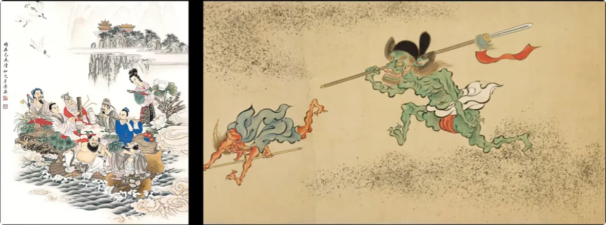

这叫：

> **能量守恒原则。**

而小烨认为，在地上、在这些建筑里，包括家里供奉的很多存在，都不是真正意义上的正神。

神的意志跟人的意志完全不是一个等级，**神之爱和人之爱也不是一个概念。**
换你做神，你愿不愿意天天待在一个神像里过日子？

>不会。

那么：

> **这里面住的到底是什么？**

---

## 6. 人气真的能赶鬼吗？按照这套体系，答案恰恰相反

接下来小烨说的内容，可能会颠覆很多人的玄学观：

> _**凡事有求必应，一定图谋不轨。**_
> 
> _**“人气可以驱邪”的说法，纯粹是人的一厢情愿。**_

在这里的解释中，人气算不上干净的能量。
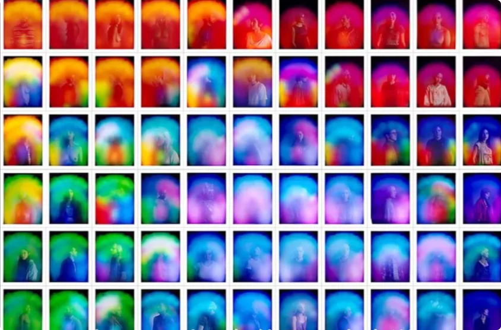

相反，对于负能量众生来说，人气却是**下层灵界很好的修炼材料**。
所以不论人类愿不愿意，这些大大小小的灵体还是会来找你。
在下层灵界“吃人”这件事情上，唯一的规则就是：

> **弱肉强食。**

也就是没有规则。

### 为什么越有社会资源的人，反而越容易被“大东西”找上

按照小烨的说法，越是有社会资源的人，越容易被大的灵体找上门。

为什么呢？

因为这些人可以对接的人员更多，关联到的人气也更多，**投资回报率很高**。
而且这些“大佬”会给这些人一些特殊能力。

比如：
1. 让俊男靓女更有性吸引力，让旁边的人产生更多欲望，以交换更多人气；

2. 让某个地方的大师、神婆得到一些特殊功能，让他们去富豪家里开光做法；

3. 帮助某些人扩展影响力，获得更多人心灵上的信任，让人主动接纳这股力量。

这样一来，大佬就可以在很多个体身上吸收到人气。
所以在这套观点中：

> **谁越出名，背后找上来的家伙可能就越厉害。**

如果看到一个名人开始抑郁、犯错、跌落神坛，小烨会把这种情况解释成肉身已经承受不住高浓度负能量，届时运势开始衰退，也是被“大佬”抛弃的表现。

---

## 7. 家里的其他“住客”：玩偶、衣柜、霉墙和信仰物品

对于普通人来说，虽然未必惹得到所谓“大佬”，但周边还有数不清的中小型负面灵体。
他们的盘子不大，落脚的地方可能只是千千万万个普通家庭中的：
- 某个物品；
- 某个角落；
- 甚至人体的某个部位。

具体而言，要看他们各自的修炼方式。

### 1) 鬼：可能依附在玩偶一类物品上

比如有些鬼一直得不到转世名额，就会喜欢钻进玩偶娃娃里。

你喜欢玩偶，心中有动念，玩偶就可以接收到你的人气。

所以按照小烨的说法：

> **没有玩偶是不“注进东西”的。**

除了玩偶，首饰和画作也是同样的道理。

### 2) 妖：可能停留在衣柜等与欲望相关的空间

有些妖喜欢吸收性行为释放出来的能量，因此会住进衣柜里。

如果你的衣柜有股寒气，小烨建议多透透风。

### 3) 怪：常和病菌、脏污、潮湿环境联系在一起

有些怪一般与病菌相存。

如果不注重家里的卫生，或者家居多年不换，墙体出现发霉、发黑，那么在这套说法中，这些环境就更容易成为“怪类”停留的地方。

### 4) 魔：更喜欢成为人的信仰或心结

最后要介绍的就是魔。

他们的玩法更高级，更喜欢成为人的**信仰或心结**，寄宿在人的头部。

“末法时代”四个字大家都听过吧？

> _**魔会披着袈裟降临的时代，所有信徒都找不到路的时代。**_

所以家里有与信仰相关的物品，包括帮助调整意识频率的熏香在内，小烨都持非常谨慎的态度。

---

## 8. 阳宅最后看的不是“摆什么阵”，而是你到底生活在什么环境里

以上四类，无论哪一种，只要家里存在的数量和量级上去了，按照小烨的观点，都会影响人的身心状态和个人运势。

所以当一个人出现莫名抑郁、家庭不和、各类运势下滑，他会建议先检查自己的房子。

如果出现意外，则要及时处理，避免出现不可挽回的损失。
其实关于阳宅的话题，小烨真的有说不完的见闻。
因为常人感受不到能量，所以根本不知道自己生活在什么样的环境里。

### 为什么现代人越来越喜欢买宝石、器物、熏香和“能量产品”

为什么这个时代消费欲望这么强，还在不断开发各种所谓的情绪价值？
按照小烨的解释：

> **灵界背后都是一场场大型交易。**

如今很多人特别信“能量”这一套，买了一堆宝石、器物，在家里大搞冥想，根本不知道自己可能已经成为了所谓的“韭菜”。

在他的描述中，这些人以为自己得到了正能量，实际上反而可能白白被收割了大量人气。
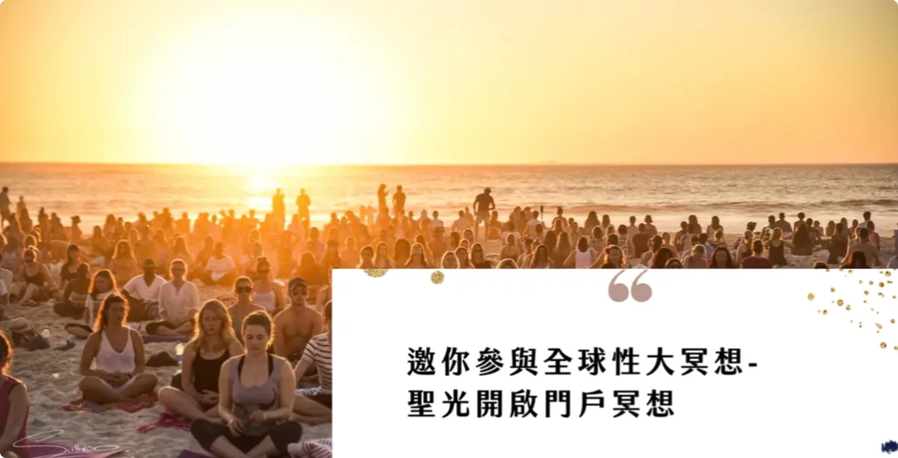

也只有等他们开始抑郁、生病、诸事不顺，开始自我怀疑的时候，才会醒悟自己过去的愚行。

> _**末法、末法，又有几个人真正知道这两个字背后的含义？**_

感谢大家看到这里。

如果想了解自己的家里情况如何，可以在评论区发照片，小烨会点评一二，也可能做成一期合集，专门给大家讲解一下。

如果你喜欢什么玄学话题，也欢迎在评论区告诉我。

**我们下期再见。**

## 关于《幽冥问答录》81 问的整理

> _**原始反终，故知死生之说；精气为物，游魂为变，是故知鬼神之情状。**_

## 1. 为什么古人谈鬼神：《幽冥问答录》究竟是一本什么书

古来读书人多尊孔孟、重人伦；讲修行者却往往一听到鬼神之事，便以“敬鬼神而远之”一语概括，不愿深究。
**凡谈生死、论幽冥，便被视作荒诞迷信；谈鬼神、说轮回，便被认为不合儒者正道。**
其实，这正是偏读书、浅读书的结果。
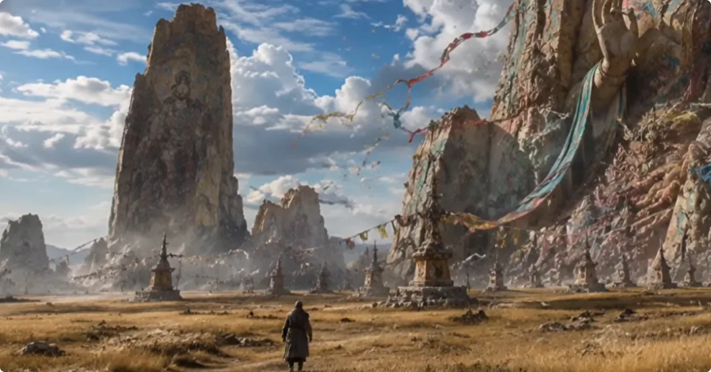

《周易·系辞》中早有名言：

> _**“原始反终，故知死生之说；精气为物，游魂为变，是故知鬼神之情状。”**_

意思是说，探究事物的开始，推究事物的结局，所以能够明白生死的道理；精气凝聚成为有形之物，游魂变化成为另一种存在，所以能够知道鬼神的情状。

《中庸》亦载孔子曰：

> _**“鬼神之为德，其盛矣乎！视之而弗见，听之而弗闻，体物而不可遗。”**_

意思是说，鬼神的作用实在广大，看它看不见，听它听不到，然而它却贯穿万物，无处不在。

所以，所谓“敬鬼神而远之”，并不是叫人否定鬼神，更不是叫人轻慢因果、生死与幽冥之理，而是教人以端正之心面对不可见之事：**不妄求、不妄问、不迷乱，却也不可全然无知、全然不信。**

今天我们要讲的，就是一本描述幽冥审判的书——**《幽冥问答录》**。

### 黎澍与《幽冥问答录》的由来

《幽冥问答录》所记，出自黎澍先生之口。

黎澍，字劭平，湖北黄陂人，生于1883年。清末曾任大清银行江西分行总理；进入民国后，又历任**总统府副秘书长**、湖北省财政司长、湖北省国税筹备处处长、湖北省财政厅厅长等职，并曾任湖北省临时参议会参议员。公开人物资料所载职务与此基本一致。([维基百科](https://zh.wikipedia.org/wiki/%E9%BB%8E%E6%BE%8D_%281883%E5%B9%B4%29 "https://zh.wikipedia.org/wiki/%E9%BB%8E%E6%BE%8D_%281883%E5%B9%B4%29"))

这样一位年高德劭、当时颇有声望的人物，自言曾担任冥官，常在睡梦之中前往阴间处理案件，审查人死后十个月以内的善恶事件。
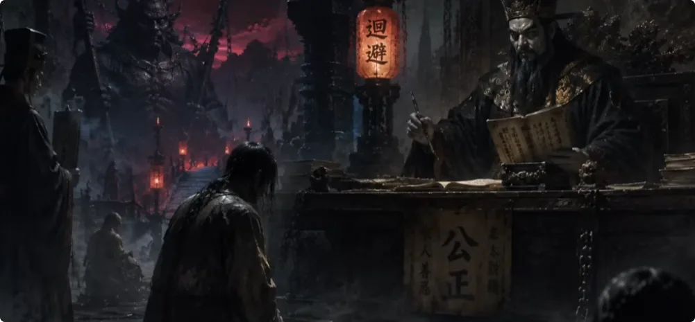

他的朋友**林黝襄参谋长**听闻此事后，曾详细询问他阴间的种种情形。流传的1944年序文也明确记载“林参谋长黝襄，与先生善，所叩冥间情形綦详”。([学府VIP](https://www.xuefovip.com/pdf/%E5%B9%BD%E5%86%A5%E9%97%AE%E7%AD%94%E5%BD%95.pdf?r=20241106 "https://www.xuefovip.com/pdf/%E5%B9%BD%E5%86%A5%E9%97%AE%E7%AD%94%E5%BD%95.pdf?r=20241106"))

后来，这些关于阴间制度、审判、鬼神、因果、投胎与刑罚的内容，以一问一答的形式整理成了《幽冥问答录》。

我校验后认为，整本问答录大多是真实记录，而非凭空捏造，而且读过之后深觉其中大有裨益，因此将其翻译成白话文与诸君分享。愿各位不以怪异视之，不以迷信轻之，而是能借此一卷，思考生死因果、鬼神与做人之道。

**《幽冥问答录》全篇共八十一问。**

---

## 2. 第一至十问：一个活人，为什么会成为阴间判官

**第一问｜先生昔年曾做过阴间的判官，对吗？**  

>**黎澍答：** 是的。世人听到这种事都认为怪异，可是以我看来，这种事很平常，没什么好奇怪的。

**第二问｜这是什么时候的事情？**  

>**黎澍答：** 这是光绪庚子年间的事，当时我十九岁。

**第三问｜你所担任的是什么职务？属谁管辖？有几个职员？**  

>**黎澍答：** 属东岳大帝管辖，但是我一直没有见到东岳大帝，只有在判案之后将结果呈报而已。我当时担任**分庭庭长**，另有陪审员四人，其他办事的鬼卒很多，不计其数。

**第四问｜担任阴间判官几年？每天都要去吗？管辖哪些地方？**  

>**黎澍答：** 前后四五年，每天都去，管辖华北五省。

**第五问｜阴间为什么请你当判官？**  

>**黎澍答：** 我也曾托同事调查原因，据说我前几世曾担任过阴间的判官，宿世因缘所牵引，所以这一世又再次担任。

**第六问｜阴间有成文法律吗？你没有学习他们的法律，怎么能保证判断不出错呢？**  
>**黎澍答：** 好像没有看到什么成文法律，只是根据案情判决，自然能够掌握案件的关键处，根本不需要费力思考。

**第七问｜先生所管的是哪一类事件？**  

>**黎澍答：** 我管的是人死后十个月以内的善恶事件，超过这段时间，就另有专人负责。

**第八问｜你见过阎罗王吗？**  

>**黎澍答：** 始终没有见过。

**第九问｜人的善恶，鬼神怎么能够完全知道、看见，并完整记录呢？**

>**黎澍答：** 鬼神能看见无形的东西，听到没有声音的事情。人在世上的种种思想、行为，鬼神都能知道、看见，并毫无遗漏地记录下来。另外，鬼神也能看见人头顶上的红、黄、白、黑等光，由此知道他的行为、思想是善还是恶。

**第十问｜犯罪的鬼也会狡辩吗？**  

>**黎澍答：** 犯罪的鬼对所犯的罪恶，也必定会极力狡辩。等出示确实证据后，才无话可说，低头认罪。
>
>我曾经审过一个鬼，他作恶多端，生前表面修善，暗地造恶，对所犯的罪极力否认。我看他的罪堆积如山，证据确凿，想立即判刑。没想到他突然诵念《金刚经》，左右陪审的人看到他头顶上出现红光，马上请我停止审判。
>
>我怀疑他们受贿徇私，仍然准备判刑。可是那个鬼不断诵经，左右紧急请我肃立。我说：“我身为庭长，怎能向罪犯肃立？”左右说：“不是这个意思，这个鬼头顶上出现佛光，审判他就会亵渎不敬，不如停审。”
>
>我当时看他们垂手肃立，非常恭敬，于是问此案如何办理。他们回答，不如判他投身人胎几次，等他不能再念《金刚经》时，再来判他的罪。
>
>我说，让他投身人胎，那不就便宜他了吗？而且投胎数次，那受报就要在几百年以后，岂不延误审判？
>左右回答：
>   _**“他造业有造业的果报，诵经也有诵经的功德，二者都不能抹灭，将来分别受报，丝毫不会差错。”**_
>于是我同意了。

---

## 3. 第十一至十八问：冥判如何工作，阴间又如何运转

**第十一问｜人死后，神志是迷迷糊糊、仿佛在梦中，还是像平时一样清醒？**  

>**黎澍答：** 像平时一样清醒。

**第十二问｜你每天什么时候到阴间审案？需要多长时间？**  

>**黎澍答：** 最初是在每天晚上，后来白天也能去，但必须在下午。来去都坐轿子，走得很快。审案时间每次数小时，偶然遇到复杂案件，也有延长好几天的，但是这种情况非常少。

**第十三问｜到阴间时，你的身体是不是像睡着了一样？**  

>**黎澍答：** 去阴间时，身体躺在床上，像熟睡一样，不吃不喝，也不觉得饥渴。
>有时神识正在阴间，有亲友忽然来访，又不便告诉他们我的事情，于是闭着眼睛与他们对话，像睡眠一样。客人如果有问题，也可以随时回答，但不能主动向客人发问，也不记得与客人讲过的话。

**第十四问｜由阴间回到阳间，精神会感到疲倦吗？**  

>**黎澍答：** 精神稍微疲倦，就像失眠一样。

**第十五问｜阴间也有饮食吗？**  

>**黎澍答：** 有，但不准我吃喝。

**第十六问｜阴间的官服是什么样式？公文格式和程序又是什么样的？**  

>**黎澍答：** 我当阴间判官时还在清朝末年，所以官服、公文样式和程序都与满清没有区别。但是到了民国以后，恐怕已经改成新的制度了。

**第十七问｜判官也有薪资吗？**  

>**黎澍答：** 有，但对人毫无用处，所以我没有领取。

**第十八问｜阴间刑罚分多少种类？**  

>**黎澍答：** 阴间刑罚种类非常多，比人间残忍严酷百倍。以现代人来看，一定会认为是极其残酷的刑罚。
>
>如果以我的经历来说，人宁可在人间受刑，千万不要到阴间受刑。人间受刑，受完了就结束了；阴间受刑，受完以后还要再受。
>
>譬如在人间杀了十几个人，阳间法律最多处死一次；阴间则必须用刑十次，刑满之后，再判他转生十世，十世都被人杀死。
>
>至于**锯解、碓磨、刀山、油锅**等刑罚，都确实存在。
>
>**恶报就是这样可怕。**

---

## 4. 第十九至二十四问：阴间如何判断善恶，念头也会形成因果吗

**第十九问｜阴间最敬重哪一种德行？又最痛恨哪一种罪业？**  

>**黎澍答：** 阴间最敬重的，男的是尽忠报国、孝顺父母；女的是贞洁孝顺。这两种人即使有罪，刑罚也必定会减轻。
>
>阴间最痛恨的是邪淫、杀生，这两种罪中，杀业又比淫业为重。如果因邪淫而杀人害命，那就是两罪齐发，罪加一等。
>
>古人有言：
 _**“万恶淫为首，百善孝为先。”**_

这是一句流传很广的传统俗语，类似表达至少可见于《镜花缘》等明清文献，并非某一部儒家经典中的孔孟原句。([识典古籍](https://www.shidianguji.com/mid-page/7557108732209430579 "https://www.shidianguji.com/mid-page/7557108732209430579"))

**第二十问｜阴间既然没有成文法律，那么罪轻罪重如何衡量？**  

>**黎澍答：** 主要看犯罪的动机和产生的结果，衡量情节，斟酌事理，再定轻重。
>
>以盗窃为例：如果偷盗的人迫于生计，并不是把钱拿来乱花；或者被偷的是有钱人，数目又不大，对富人的生活没有实质影响；又或者偷走的本来就是准备拿去嫖妓、赌博、吸烟、酗酒等不正当用途的钱，那么罪就比较轻。
>
>但如果因为失窃，导致奴婢、仆人受责罚而气愤自杀；或者穷人买米、买药的钱被偷，导致饿死或病重；又或者被偷的人因为反抗而丧命，那么案情就非常严重，不能再用普通窃案来衡量。

**第二十一问｜阴间判罪会不会偶尔判错？**  

>**黎澍答：** 不会。阴曹对犯人的罪状都早有精密调查，证据确凿，因此审判非常公平，从来没有错判。

**第二十二问｜人一天之中、一生之内，念起念灭，不知有多少善念恶念，连自己都无法完全记得。冥司若连这些都记录，岂不是非常麻烦？**  

>**黎澍答：** 人的思想念起念灭，随作随灭，如空中飞鸟的痕迹、水面上的泡沫，影响非常微小，所以冥司也不予记录。
>
>但如果一心专注、念念不忘，虽然没有付诸行动，也会有功过被记录；如果有想法以后又真正付诸行动，那么功过自然更加明显。

**第二十三问｜大修行人死后，也要到阴曹地府听候审判吗？**  

>**黎澍答：** 阴曹管辖的大多是受业力支配的人，或者平凡庸俗、没有大善大恶的人。
>
>如果是大修行人，死后立即升入天界，不经过阴曹地府。这样的人，地府名册中没有名字，无从审判。
>
>或者升天稍慢，仍然要经过阴曹，阴间官吏都会离座迎接。他们的魂魄像登云梯一样越走越高，等到梯顶时，已经与屋脊一样高。点名一到，立即登天界，也无需监禁。

**第二十四问｜阴曹也有外国人吗？外国人死后又在哪里接受审判？语言不同怎么办？**  

>**黎澍答：** 我当判官时正逢庚子年，八国联军攻破北京以后，中外军民死者很多。在阴曹曾经看见少数外国人到案，阴曹中也有懂得他们语言的人。
>
>也曾经受理过一位殉难提督的案子。凡是忠诚为国、慷慨捐躯的人，我亲眼看见他们都直接升入天界，没有经过提审。

中国阴曹地府既然不止一处，那么欧美各国也应该另有阴曹地府，才合乎情理。

---

## 5. 第二十五至三十三问：鬼是什么样，阴间有没有昼夜、四季与饮食

**第二十五问｜阴曹地府为什么常常使用世间活人做阴差？**  

>**黎澍答：** 因为富贵人家的住宅中有众多神灵守护，身边供使唤的人又多是年轻力壮、阳气旺盛之人，因此阴差不能靠近他们的病床。
>
>譬如武将病死军营，周围警卫森严、枪炮林立，营内士兵又都是少年，阴差无法靠近，因此必须借助活人的魂魄去拘捕，才能将其捉拿到案。

**第二十六问｜被刀杀害或其他惨死、身首不全的鬼，他们的灵魂和平常病死的鬼有区别吗？**  

>**黎澍答：** 他们的灵魂是完整的，与普通的鬼没有差别，只是面部稍微模糊。受伤的地方也会带有血迹，而且容貌悲伤凄惨，像是仍有痛苦。

**第二十七问｜鬼也有消失灭亡的时候吗？**  

>**黎澍答：** 有。我见过年代最久远的鬼，大约远至宋元。至于唐宋以前的鬼，从来没有见过。可能因为年代太久，早已经灭亡。除非成仙成佛，否则不能万古长存。

**第二十八问｜人从小到老，容貌逐渐变化，鬼的容貌也会逐年衰老吗？**  

>**黎澍答：** 鬼的容貌和他死亡时一样，好像不会随着年岁继续衰老。

**第二十九问｜阴曹也有昼夜和日月星辰吗？**  

>**黎澍答：** 阴间也有昼夜，与阳间相同，但是绝对看不到日月星辰。阴间的情形，好像四川大雾和华北黄沙天气一样，不像阳间这样明亮。
>
>每天早上八点以后到中午十一点左右，鬼畏惧阳气弥漫灼热，都会躲藏到阴暗的地方；午后外出的才逐渐增多。

**第三十问｜阴间也有寒暑四季吗？**  

>**黎澍答：** 有，只是夏天没有阳间那么热，冬天却比阳间更冷。

**第三十一问｜阴间也有饮食吗？阳间烧的纸钱，阴间可以用来买东西吗？**  

>**黎澍答：** 也有饮食，蔬菜也有很多种。阳间人烧的纸钱，他们也可以用来买东西。

**第三十二问｜阴间也每天吃三餐吗？**  

>**黎澍答：** 每吃一餐可以饱很多天，并非每天需要三餐。

**第三十三问｜鬼也睡觉吗？**  

>**黎澍答：** 也有床铺、被褥等东西，但没有见过他们真正睡眠。他们只会到处走来走去，稍微闭目休息一下，就相当于睡眠，不像阳间的人每天需要睡七八个小时。

---

## 6. 第三十四至四十三问：阴间街市、祭祀、坟墓，以及人鬼如何共处

**第三十四问｜阴间也有街市和商店吗？**  

>**黎澍答：** 有，但是规模非常小，与人间的小商店差不多。所卖的大多是饮食、杂货之类，没有像人间那样富丽堂皇的大公司和洋行。

**第三十五问｜阳间祭祀所供的饮食，鬼神也能享用吗？**  

>**黎澍答：** 可以，但只能摄取它的气，并不是真的把东西吃掉。
>
>例如夏天有两碗同样的食物，一碗拿去供鬼神，一碗没有供过，供过的那一碗会比没有供过的更早腐坏，因为其中的“气”已经被鬼神摄走了。

**第三十六问｜阴间和阳间的饮食，哪里的比较好？**  

>**黎澍答：** 阴间的恐怕比不上阳间。

**第三十七问｜阴间有家庭眷属吗？**  

>**黎澍答：** 有，但未必是阳间原来的家庭，因为阴间也有婚娶和生育。

**第三十八问｜鬼也会以自己的坟墓作为居住、休息的地方吗？**  

>**黎澍答：** 是的。

**第三十九问｜人临终时，灵魂脱离肉体会痛苦吗？**  

>**黎澍答：** 人死的时候大多伴随疾病。灵魂离开身体，如同开门外出，本来没有困难。回想以前肉身的疾病痛苦，反而会觉得是一种解脱。
>
>有的人眷恋妻子、留恋财产，心神执着不舍，气息未断，灵魂因此不容易脱离肉体，这个时候最为痛苦。
>如果一个人天性淡泊，对妻子、财产没有贪恋之念，那么：
>
 _**灵魂离体，就像脱衣而出，毫不费力。**_

**第四十问｜僧道诵经超度亡灵，对亡人究竟有没有利益？**  

>**黎澍答：** 不能一概而论。
>
>如果此人生前是大善人，死后立即升入天界，本来就不需要这种功德；如果生前是大恶人，死后立即堕入地狱，也不容易获得这种功德。
>对于没有大善大恶的普通人，如果能够得到诵经超度，这时幽冥界会增加光明，罪业也会减轻，利益很大。
>
>另外，诵经者修行功夫的高低也有很大关系。若是高僧或孝子贤孙，诵经一卷抵得上普通僧人十倍；即使只是普通僧道，只要能够至诚恭敬地诵，同样有相当利益。若没有德行，心又不专诚，则利益很小，甚至毫无利益，但也不至于有过错。
>
>诵经最好在亡人**七七四十九日以内**。过了这段时间，恐怕亡人已经转生到其他法界，所做功德只能辗转存记，亡者无法立即得到利益。

**第四十一问｜鬼和人的数量，哪边更多？人怕鬼，鬼也怕人吗？**  

>**黎澍答：** 阴间鬼的数量比人的数量多，来来往往，挨着围篱、靠着墙壁，到处都是。
>
>人走道路中间，鬼大多走道路两旁；人走亮处，鬼大多走暗处。
>
>虽然人怕鬼，鬼同样也怕人。鬼看见人来了，也会赶快避开。如果是正人君子，鬼必须尊敬；他们所欺负、戏弄的，大多是心术不正、时运衰微的人。
>
>所以从午后到晚上走路，不要一直靠着道路两旁和阴暗处。晚上出门，走路慢一些，或者稍微发出一点咳嗽声，让他们提前避开。
>
>否则出其不意，阴阳相撞，人身体可能会打寒噤，彼此都会感到不舒服。

**第四十二问｜鬼的行走和活人有什么区别？**

>**黎澍答：** 鬼的脚部模糊不清，像行走在烟雾中，而且走得很快，不像人这样迟缓。

**第四十三问｜鬼为什么怕鸡鸣？**  

>**黎澍答：** 因为阳光即将到来，灵魂会感到不安，所以不得不躲避，就像人害怕锅炉中的灼热之气一样。但有操守、有德行的鬼，也并不害怕鸡鸣。

---

## 7. 第四十四至五十二问：投胎、六道、三教，以及第一次进入阴间的经历

**第四十四问｜您这样的宿世根基与常人不同，来世能免除轮回吗？**  

>**黎澍答：** 超出六道轮回，并没有那么容易。即使我来生也不能避免。
>
>曾托同事调查，据说我来世应该投生到河南南阳一带。但数十年来人世已经变迁，不知道阴间的记录有没有更改。

**第四十五问｜阴府中的官吏也会投胎转生吗？**  

>**黎澍答：** 有。譬如现在担任公职的人，想换一个更好的工作，自然比普通人容易一些。

**第四十六问｜鬼去投胎，是受孕时就入胎，还是生产时入胎？**  

>**黎澍答：** 两种情况都有。

**第四十七问｜那么多鬼魂长期沉沦在幽冥世界，为什么不早点投胎？**  

>**黎澍答：** 人少鬼多，人身并不够分配。
>
>而且想要投生的家庭，必须与鬼原本有因缘才能投胎。如果这个人生前交友广泛、认识的人很多，投胎会比较容易。
>
>如果一个人贫穷，老死都不曾离开家乡，平常又很少与人来往，一旦沉沦鬼道，因缘难以凑合，就必须等很久，直到遇见有缘的人才能投生。

**第四十八问｜儒释道三教鼎立，信仰不同，冥界最重视哪一教？**  

>**黎澍答：** 三教都尊重，但最尊重佛教。

**第四十九问｜学佛者死后生极乐世界，学道者生洞天福地，那么儒家之人死后往哪里？**  

>**黎澍答：** 也有往生天界的，所修的功德绝对不会消灭。

**第五十问｜您后来为什么不继续当阴判？**  

>**黎澍答：** 因为我不愿意长期担任判官，屡次请求离职都没有得到允许。
>
>后来同事教我多诵《金刚经》，我按照他的方法去做，诵满两千部以上以后，这种阴判的经历就不再发生了。

**第五十一问｜您平常也能够见到鬼吗？**  

>**黎澍答：** 我在当判官的时候，无论魂魄有没有离开身体，都能看到鬼。民国初年以后，见到的鬼越来越少，民国十年以后就完全看不到了。

**第五十二问｜第一次到阴间，是怎么通知你的？**  

**黎澍答：** 一天晚上，我在睡梦中看到一位身穿古代衣冠的人来到家中拜访，说有事情相求，希望我能帮忙。

我问：“有什么事情要帮助呢？只怕我的能力不够。”
那人说：

> “只要你答应，没有不能做的。”

我不知道他为何而来，只觉得他礼貌恭敬、态度诚恳，实在难以推辞，就含含糊糊地答应了。
他很高兴，约好几天以后来迎接我才离开。
醒来以后，我以为只是做梦，并没有放在心上。过了四五天，梦中那个人又来了，说：

> “前几天蒙你答应，特地准备车马专程来接你。”

我看见一辆马车停在门外，就和他一起上车。没多久，到达一座官署。下车进去以后，他带我到旁边房间坐了一会儿，就请我升堂判案。

押来一个犯人，左右陪审的人将案情说清楚以后，请我判决。
我说：

> “这种事情我从来没有做过，怎么敢乱判？”

左右说：

> “您只要诚心推断，觉得应该怎么判，就照您的意思来判。”

我稍微思考以后，就说这样判好了。所有人都说可以，于是请我在判决书上签署，把犯人押走，随后依然用车马把我送回家。

---

## 8. 第五十三至六十一问：阴间的人情社会、牛头马面，以及鬼为什么难以修行

**第五十三问｜先生的父母也知道这件事吗？**  

>**黎澍答：** 刚开始我保守秘密，不敢讲出来。后来父母见我独自一个人在书房里，却偶尔有与人交谈的声音，渐渐知道了这件事。
>
>自从我担任阴判以后，常有幽冥中的朋友往来，只有我能看见他们、听到他们说话。别人都不能看到或听到，只能听见我自己讲话。

**第五十四问｜鬼朋友来时，也需要招待饮食吗？**  

>**黎澍答：** 清茶一杯，已经足以尽地主之谊。

**第五十五问｜阴间也有年节假期吗？**  

>**黎澍答：** 与阳间没有差别。遇到**农历新年，以及清明、寒食、中元、中秋、冬至等节日**，也一定会放假数天，但是没有星期天。

**第五十六问｜鬼为什么能够变换身形？**  

>**黎澍答：** 所有的鬼都能够变化，但必须得到阴司许可。

**第五十七问｜曾经审判过哪些重要案件？**  

>**黎澍答：** 一切案件都很平常，没有超出情理之外的情况，而且罪状明显、证据确实，从来没有复杂难明的案件。

**第五十八问｜你曾经到阴间各处游历过吗？**  

>**黎澍答：** 没有。

**第五十九问｜牛头马面真的存在吗？**  

>**黎澍答：** 都是假面具，用来恐吓那些凶恶的灵魂。如果是良善的灵魂，就不会出现这种恶相。

**第六十问｜鸟兽的魂，还保持鸟兽的形状吗？**  

>**黎澍答：** 这属于另一个部门管辖，我也不知道。

**第六十一问｜阴间也有念佛修行的吗？既然念佛诵经有功德，鬼为什么不赶紧修行，以求超生？**  

>**黎澍答：** 一到阴间，就会被业力障碍蒙蔽，自然不知道念佛诵经。
>
>即使我们在人间念佛诵经，他们也像看不到、听不见一样。
 _**因此修行应当趁一口气还在的时候。气断以后，修行就难了。**_

---

## 9. 第六十二至七十一问：业障、人鬼边界、投胎与阴间生育

**第六十二问｜鬼既然能够看见无形、听见无声，为什么反而看不见、听不到人在念佛修行？**  

>**黎澍答：** 这是因为被业力所障碍。
>
>看看世上的人，有的人本来没有信仰，有的人饥寒交迫，对于别人念佛修行，不同样是视而不见、听而不闻吗？
>
>即使偶然看见、听见，也可能被欲念纠缠牵绊，或者生不起信心，或者志向不坚定，最后依然不肯修行、不肯念佛。
>
>这和鬼看不见、听不到，有什么区别呢？

**第六十三问｜鬼说话的声音和人有什么区别？**  

>**黎澍答：** 他们的声音更加尖锐，而且短促。

**第六十四问｜从鬼的角度来看，人鬼是杂居的；从人的角度看，阴阳又是分开的。人鬼疆界到底如何区分？**  

>**黎澍答：** 似乎有分界，又好像没有，这种情形实在很难用语言说清楚。

**第六十五问｜生人之魂与死者之鬼，其形状、颜色有没有区别？**  

>**黎澍答：** 从来没有特别留意过，当然应该有一些区别。

**第六十六问｜做鬼是什么感受？**  

>**黎澍答：** 感觉非常苦，因此他们的言谈大多悲惨哀泣。

**第六十七问｜鬼投胎时，阴司有没有教导他们改恶向善？**  

>**黎澍答：** 没有。
>
>唯独投胎做禽兽时，不会让鬼知道真实情况，而是会幻化成男女或者繁华楼阁等景象，让他们愿意投入其中。

**第六十八问｜青天无云、日月普照，为什么照不到阴间？如果阴阳属于不同区域，为什么人鬼又可以同行？**  

>**黎澍答：** 因为有云雾遮蔽，所以看不到青天白日。但是鬼可以到阳间比较阴暗的地方，尤其是晚上，因此人鬼可以通行。

**第六十九问｜阴间采用哪一朝的历法？公文也写年月日吗？**  

>**黎澍答：** 在满清时期，就使用满清的正朔，公文所写的年月日与人间相同。

**第七十问｜人既然由鬼投胎而来，那么阴间婚姻所生的孩子又从哪里来？**  

>**黎澍答：** 由人死以后剩余的气聚生而成。

**第七十一问｜阴间婚姻所生的孩子，将来也能够投胎吗？**  

>**黎澍答：** 不能。

---

## 10. 第七十二至八十一问：香烛、爆竹、功德，以及最后几个关于鬼的问题

**第七十二问｜阴间也有风雨霜雪吗？**  

>**黎澍答：** 没有见过。但是遇到阳间风雨霜雪时，阴间的鬼也会受到寒冷困苦，出现身体蜷缩、身心不安的状态。

**第七十三问｜鬼也有应酬以及婚丧喜庆的礼节吗？**  

>**黎澍答：** 和阳间没有差异。

**第七十四问｜香烛有什么用处？**  

>**黎澍答：** 烛是为了取得光明，香则是为了召唤鬼魂，让他们知道要来。

**第七十五问｜爆竹有什么用处？**  

>**黎澍答：** 鬼怕爆竹，因此似乎并不适合使用。

**第七十六问｜念佛经有大功德，那么念儒家的书也有功德吗？**  

>**黎澍答：** 也有功德。

**第七十七问｜佛教护法神有韦驮，道教有王灵官，儒家也有护法神吗？**  

>**黎澍答：** 不知道。
>
>儒家不以神道立教，好像没有设置护法神的必要。但是儒家经典常受到鬼神呵护，这是毋庸置疑的。

**第七十八问｜冥司俸禄从哪里来？也有钱粮、税捐等收入吗？**  

>**黎澍答：** 我曾经询问过同事这个问题，他们叫我不要问，所以我不知道。

**第七十九问｜人头上的光，以什么颜色来区分善恶？**  

>**黎澍答：*** *红、白、黄为善，黑为恶。**

**第八十问｜人由鬼投胎而来，鬼又由人死后变化而成，那么世上究竟先有人还是先有鬼？**  

>**黎澍答：** 这个问题应该分两方面来说。
>
>远古以前，天地混沌初开、淳朴之风还没有消散时，自然是**先有人，后有鬼**。
>
>如果就后世而言，则是：
 **先有鬼，后来才有人。**

**第八十一问｜鬼也会思念自己生前的妻子儿女吗？**  
>**黎澍答：** 也非常思念，但时间久了，就会慢慢淡忘。

> _**《幽冥问答录》八十一问，至此结束。**_

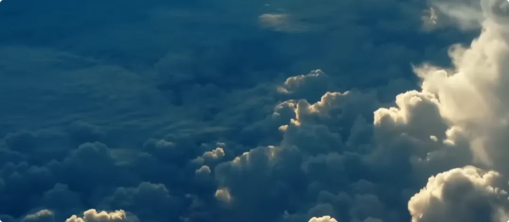
