> 本页为「修行者与故事」11 篇的合订本；原文章链接会自动跳转到本页。

## 天涯神帖：神秘天才修炼成仙的故事

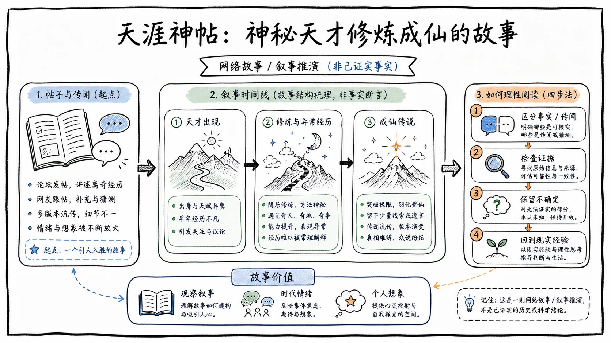
## 一个没有噱头的帖子

2011年10月，天涯论坛的“莲蓬鬼话”板块出现了一个没有任何噱头的帖子，标题很干瘪，叫作《关于人体生物电磁场与低维空间能量交换的实证记录》，发帖人的ID叫“李四的薛定谔”。

一开始没人点进去，直到第三天，版主发现这个帖子的回复量呈现出诡异的指数级增长。点进去一看，才发现事情根本不是写小说那么简单。

楼主在开篇第一段就亮明了身份：他是国内某所C9顶尖高校物理系的在读博士生。他发帖的目的只有一个——用现代量子力学、热力学第二定律以及神经生物学，彻底重构中国古代的修仙体系。而且，他明确表示自己已经完成了理论推导，并在自己身上完成了第一阶段的活体实验。

底下的跟帖起初全是嘲讽。有人让他去精神科挂号，有人问他是不是走火入魔了，但楼主没有和任何人对骂，只是像写实验报告一样，每天定时更新。他列出的不是什么玄幻小说里的口诀，而是密密麻麻的偏微分方程、人体心电图谱和脑电波频段分析。

*这期内容信息量巨大，可能会彻底重塑你的思维模型。强烈建议先点赞收藏，方便反复琢磨；也别忘了点个关注，避免以后找不到这种能帮你打通认知“任督二脉”的干货。*

## 用现代科学重构“修仙”

楼主指出，现代人对修仙的理解全错了。古人所说的“气”，根本不是什么神秘的魔法能量，而是一种可以被观测、被引导的**生物电磁场与暗物质耦合现象**。

他把道家经典《周易参同契》里的“炼精化气”，直接翻译成现代生物学语言：通过特定的呼吸频率和微小肌肉群控制，改变人体局部神经元的电位差，从而在体内形成一个微型磁场，捕获游离在三维空间之外的低维能量。

他每天都在帖子里记录自己的各项生理指标变化。例如，在进行特定频率的呼吸干预后，他的静息心率降到了每分钟38次，但核心体温却上升了1.2℃；他的脑电波在清醒状态下，出现了只有在深度睡眠时才会出现的强烈δ波。

他用极其严谨的学术语言解释：

> 所谓打坐，本质上是通过切断外部感官输入，降低人体系统的整体熵值，使神经元网络与地球的本底磁场产生共振。

他甚至画出了人体经络与现代解剖学中周围神经系统的拓扑等价图，试图证明古人所说的任督二脉，其实是两条具有特定阻抗的生物电流“超导回路”。

这种降维打击般的硬核输出，让帖子里的嘲讽声音越来越少。越来越多具备理工科背景的网友加入讨论，试图从物理学和数学角度寻找楼主理论中的漏洞，却震惊地发现：**这套理论在逻辑上竟然完全自洽。**

## 三次预言与昆仑山失踪事件

## 第45天，帖子彻底失控

帖子连载到第45天时，事情彻底走向失控。原本只是一小群物理系学生和道教爱好者之间的学术讨论，突然变成了一场全网级别的灵异事件。

因为楼主在这一阶段做出了三件让人至今回想起来仍觉得头皮发麻的事情：

1. **提前预言三起异常事件**  
   他提前一周给出了三个精确到小数点后两位的经纬度坐标和具体时间，预言这些地方会发生常规物理学无法解释的异常，结果后来全部被官方新闻或公开视频印证。

2. **公布“引气入体”第一阶段实操指南**  
   当晚有超过400名跟着练习的网友，在帖子里报告了高度一致、极其强烈的真实生理反应。

3. **突然停止更新并出现在昆仑山**  
   就在帖子热度即将突破天际时，楼主突然停止更新。有懂技术的黑客追踪了他最后一次登录的IP地址，发现那个坐标根本不在他所在大学的实验室，而是指向海拔5000多米的昆仑山死亡谷无人区深处。

这三个悬念同时爆发，让整个天涯论坛陷入了前所未有的疯狂。

## 精确命中的三次预言

楼主当时在帖子里写道，当人体磁场通过修炼达到特定量级，并与地球磁场产生特定频率的共振时，会引发局部能量扰动。这种扰动在宏观尺度上，可以被仪器观测到。

- **第一次预言：四川某地的地磁异常**  
  楼主留下了一个位于四川某地的坐标，预言当月14日凌晨2点14分，当地会出现大面积通信中断和地磁仪爆表。很多网友截图留证，准备看笑话。然而三天后，当地晚报发布了一则不起眼的简讯，称该地区通信基站莫名宕机两小时，地质局的地磁监测设备在同一时间出现了无法解释的异常峰值。

- **第二次预言：江西山区的晴空球状闪电**  
  他给出江西某山区的坐标，称那里会在无雨天气下出现球状闪电。五天后，当地气象局官方微博发布了一则罕见的晴空球状闪电目击报告。

- **第三次预言：废弃工厂的重力异常**  
  他预言北方某城市的一座废弃工厂会出现“无震感的重力异常波动”。一周后，有探险博主在那座工厂里拍到铁屑悬浮在半空长达十几秒的视频，画面瞬间传遍全网。

三次预言的时间、地点和现象全部命中，这种精确度似乎已经排除了巧合的可能。

## 400人的“引气入体”实验

如果说预言只是让网友感到震惊，那么楼主公布的“引气入体”实操指南，则直接引发了群体性的恐慌与狂热。

楼主公布的方法没有任何宗教色彩。他要求网友：

1. 在全黑房间里，将室温恒定在22.5℃；
2. 按照“吸气4秒、屏气7秒、呼气8秒”的反常节律呼吸；
3. 在脑海中构建一个复杂的三维几何模型，类似物理学中的**卡拉比-丘流形**；
4. 将注意力集中在腹腔神经丛的特定节点上；
5. 普通人尝试时间不得超过20分钟。

他反复强调：

> 这不是冥想，这是一次神经系统的强制超频。

当晚11点，跟帖区炸了。网友一个接一个回来留言，语气里全是掩饰不住的惊恐和激动。

有人说，练习到第15分钟时，耳朵里听到了类似老式电视机没有信号时的高频雪花音，紧接着，肚脐下方三寸的位置出现了不受控制的高频震颤，就像吞下了一个振动马达。

还有人说，闭着眼睛时，视网膜上出现了清晰的网格状蓝光，并随着呼吸频率有节奏地闪烁。

如果只有一个人这么说，可以解释为心理暗示或幻觉。但那天晚上，全国各地有400多人同时参与实验，彼此互不认识。他们描述的生理细节，甚至连腹部振动的频率感、蓝光闪烁的周期都高度一致。这种群体性的真实生理反馈，彻底击穿了所有人的认知防线。

面对网友疯狂的追问，楼主在消失前给出了最后一次解释：

> 高频雪花音，是听觉神经在捕捉低维空间能量溢出时产生的底噪；腹部震动，是生物电流在特定神经节形成超导回路后的物理共振；网格状蓝光，则是视神经受到暗物质粒子微弱辐射后产生的视觉具象化。

他用最冰冷的物理学语言，解释了最不可思议的修仙体验。

## 最后一次登录：那棱格勒峡谷

就在所有人等待他公布第二阶段修炼方法时，楼主却再也没有上线。

那名追踪他的黑客网友公布了调查结果：楼主最后一次发帖的IP地址位于昆仑山**那棱格勒峡谷**，也就是中国最著名的死亡谷。那里常年伴随异常磁场和雷击，地质环境极其恶劣，连当地经验最丰富的牧民都不敢靠近。

一个C9高校的物理学博士，是怎么带着网络设备跑到那个地方发帖的？

他最后留下的一段话是：

> 实验进入第二阶段。这里的磁场环境符合要求，我要切断外部观测了。

## “高维协议”与现代物理修仙体系

## 被保留下来的数万字指南

虽然楼主消失了，但他留下的那套长达数万字的现代物理修仙指南，却完整地保存在天涯服务器上。

那400多名亲身体验到真实生理反应的网友，成了这套理论最狂热的信徒。他们开始自发组织起来，建立无数个私密群组，逐字逐句拆解楼主留下的每一个公式和动作要领。

一场前所未有的、结合量子力学与道家内丹术的疯狂实验，就这样在互联网的暗处悄无声息地拉开了序幕。

这份长达数万字的指南，被核心参与者悄悄命名为**“高维协议”**。经过反复拆解，人们发现这根本不像一本玄学读物，而更像一篇结构极其严谨的理论物理与神经生物学交叉论文。

## “炼精化气”的生物学解释

楼主在指南开篇直接推翻了传统道家对《周易参同契》的解读。他指出，古人所说的“炼精化气”，本质上是对人体细胞内线粒体能量代谢的量子化提取。

普通人的线粒体通过氧化磷酸化产生ATP，这是一种低效的化学能转换。楼主则提出，通过特定频率的意识干预和呼吸节律，可以迫使特定神经节周围的线粒体产生微观级别的**玻色-爱因斯坦凝聚态**。

在这种状态下，生物化学能会越过热力学限制，直接转化为可以被中枢神经系统引导的量子信息流——这就是古人所说的“真气”。

## 经络是高维结构的三维投影

指南中最令人毛骨悚然的部分，是楼主对经络和穴位的现代原理解释。

他认为，解剖学之所以无法在三维空间内找到经络，是因为经络根本不存在于三维空间。他引入弦理论中的卡拉比-丘流形概念，指出人体经络实际上是十一维空间中卷曲几何结构在三维肉体上的投影，而所谓的穴位，就是高维能量管线与三维神经丛的交汇节点。

针灸之所以有效，是因为金属针刺破了三维空间的局部电磁场，引发微弱的**量子隧穿效应**，从而干预高维投影。

## 第二阶段：共振周天

为了让普通人触碰这一高维结构，楼主公布了第二阶段的实操方法，并称之为**“共振周天”**。

这套方法要求实验者利用地球的舒曼共振。舒曼共振是地球电磁场的一种常态，其基频约为7.83赫兹。楼主给出了一种极其复杂的古传导引发声技巧，要求实验者闭口，通过舌抵上腭、声带微振的方式，在颅骨腔体内制造出精确的7.83赫兹低频振动。

他解释说，当颅骨的物理振动频率与地球磁场频率完全重合时，大脑松果体会产生压电效应，从而打破血脑屏障对某些微观粒子的屏蔽，让人体神经系统直接接入地球的宏观电磁场。

## 实验扩散与无法解释的异常

## 高斯计暴涨四个数量级

实验开始后的第三周，私密群组里出现了第一段引发轰动的视频。

发视频的是某985高校材料科学与工程专业的一名研究生。他利用半夜实验室没人的时间，在恒温恒湿的超净间里进行了“共振周天”测试。为了记录数据，他违规开启了实验室里一台用于检测纳米材料磁性极化的高精度高斯计。

视频没有任何特效，只有监控探头拍下的黑白影像。研究生盘腿坐在防静电地板上，闭着眼睛。前十分钟一切正常，但到了第11分钟，放置在距离他两米远处的高斯计，屏幕数值突然开始剧烈跳动。

原本稳定的背景磁场数据，在短短几秒内飙升了四个数量级，形成一个极具规律的脉冲波形。

更让人头皮发麻的是，视频进行到第14分钟时，实验台上一把防静电不锈钢镊子，在没有任何外力接触的情况下平移了大约两毫米。

这段视频在群里引发了地震般的震动，无数人要求他解释是否造假，但这名研究生只回复了一句话：

> 我当时感觉自己的脊椎变成了一根通电的铜导线。我睁开眼时，实验室里的日光灯管在没有通电的情况下发出了微弱频闪。

## 肉眼“看见”暗物质网络

如果说磁场异常还只是在经典物理的边缘试探，那么另一位网友的反馈，则直接触及了现代天体物理学的盲区。

这位网友是一名普通的IT程序员。他在连续进行20天“共振周天”练习后，声称自己的视觉系统发生了不可逆的改变。

他在群里写道，现在只要在极度安静的环境下闭上眼睛，他看到的就不再是黑暗，而是空气中布满了类似蜘蛛网的暗灰色丝线。这些丝线不受光线影响，可以穿透墙壁、家具，甚至穿透他自己的身体。

他用绘图软件极其详细地画出了这些网格的结构，并标注了不同节点的密度分布。图片发出后，群里沉默了整整两个小时。

打破沉默的是一名认证为中科院某天文观测站助理研究员的网友。这位研究员发出了几张由超级计算机模拟的宇宙大尺度暗物质分布图。两张图放在一起对比，普通人画出的网格结构与超算模拟出的暗物质引力骨架，在拓扑学特征上达到了惊人的97%重合度。

研究员留言说：

> 这不可能，这绝对不可能。引力透镜效应下的暗物质分布是纯粹的数学推导，人类肉眼绝对不可能直接观测到，除非你的视神经能够捕捉中微子级别的微弱辐射。

## 被提前埋入原帖的加密文档

面对群里逐渐失控的恐慌与狂热，楼主虽然已经消失在昆仑山，却似乎早就预料到了一切。

网友发现，楼主在天涯原帖的源代码里隐藏了一串指向海外加密网盘的哈希值。随着实验者报告的异常现象越来越多，网盘里的FAQ文档被逐一解锁。

楼主在这个预留文档库里，以极其冷酷的口吻对各种诡异现象进行了物理学定性。

关于高斯计异常和镊子移动，楼主解释称：当人体神经元放电同步率超过85%时，整个中枢神经系统会形成**宏观量子相干态**。此时，人体本身就变成了一个微型定向电磁脉冲发生器。高斯计测到的不是外界磁场，而是大脑皮层溢出的高频电磁波。镊子的移动，则是局部空间电磁场畸变引发卡西米尔效应，导致微观尺度的真空涨落。

关于暗物质视觉，楼主称之为**“引力透镜的神经元映射”**。他指出，人类松果体内部含有微量的氟磷灰石晶体。在7.83赫兹的强共振下，这些晶体的压电效应被彻底激活，变成极其敏锐的引力波天线。

> 你看到的不是光，而是暗物质引力场对空间造成的微小扭曲，被大脑视觉中枢强行翻译成了图像。

## 蓝色辉光与实验失控

## 从400人扩散到数万人

随着FAQ文档不断解锁，实验规模开始在互联网暗处呈指数级扩张，从最初的400人迅速蔓延到数万人。

各种私密论坛和加密通信软件里，每天都有海量实验日志被上传。人们发现，这套理论似乎不只是玄幻小说，而是在真真切切地改变人体的物理属性。但也正是这种真实的改变，让整个事件开始滑向极其危险的边缘。

第一个危险信号出现在实验进行到第二个月底。一名参与者在群里求救，称自己的基础体温已经连续三天维持在40.5℃，但他没有发烧症状，也不觉得热，甚至感觉思维前所未有地清晰，只是每天需要喝下超过八升的生理盐水。

楼主预留的文档对此给出的解释是：这是**线粒体解偶联现象**，体内的生物核反应正在建立新的平衡，多余的化学能正在以热能形式疯狂散逸。

文档严厉警告：

> 如果体温超过41℃，必须立刻打断神经共振，否则会导致蛋白质大面积变性，人体会从内部被彻底“煮熟”。

## 手掌边缘出现幽蓝色光芒

最让人恐惧的，是一张深夜被上传到服务器的照片。

照片是一名网友在全黑房间里拍摄的右手。那只手的手指边缘，正散发出一种极其微弱、但肉眼清晰可见的幽蓝色光芒。

任何具备一点核物理常识的人，看到这种光都会不寒而栗——那像是**切伦科夫辐射**，通常只出现在核反应堆的冷却水里，是带电粒子以超过介质中光速的速度穿过时产生的电磁辐射。

楼主在最后一份被解锁的文档中，用全部大写的红字留下警告：

> **如果体表出现蓝色辉光，说明你体内的局部能量密度已经坍缩到临界点，也就是古人所说的结丹前兆。**
>
> **但这绝对不是好事。这意味着你的肉体已经无法束缚这种高密度等离子体。立刻停止一切呼吸法，切断共振，否则你的下场不是飞升，而是发生自发性的人体微型核爆。**

物理学与修仙的边界，在这群狂热实验者身上被彻底抹平。他们不再认为自己是在修炼，而是把自己当成某种高能物理实验的生物载体。

群里的气氛变得极其诡异。有人因为极度恐惧退出实验，删除了所有数据；但更多的人像染上某种精神毒品一样，看着自己的身体发生“反物理变化”，陷入深深的迷狂。

他们坚信，只要突破蓝光临界点，就能像楼主一样进入不受三维空间物理定律约束的高维状态。

## 昆仑山雷暴与全网数据抹除

## 死亡谷上空的反常雷暴

就在这时，那名一直追踪楼主IP的黑客突然在所有核心群组里发布了一条全员广播：

> 昆仑山那棱格勒峡谷的卫星气象数据出现了极其反常的波动。一场覆盖整个无人区、持续三天三夜的超大型雷暴正在发生，而雷暴中心正好是楼主最后一次发出信号的坐标。

那场雷暴的卫星气象云图，在事件发生后的几个小时内，开始在暗网极少数高级别极客圈子里流传。

这不是一场普通的对流层雷雨。气象雷达回波显示，雷暴中心的电磁场强度达到了骇人的特斯拉级别，周围数百公里的无线电通信被瞬间切断。

更违背常理的是，闪电并非从云层劈向地面，而是呈现出密集树枝状的正极性闪电，从那棱格勒峡谷的地面逆向射入高空电离层。

那棱格勒峡谷本身就是一个巨大的天然地磁异常区。结合楼主最后留下的警告，群里那些具有物理学背景的网友立刻得出了一个令人毛骨悚然的结论：

> 楼主正在利用昆仑山罕见的天然强磁场，作为约束自己肉体内部高密度能量的“托卡马克装置”，试图强行扛过结丹式微型核爆的临界点。

## 8月14日凌晨的“赛博抹除”

就在所有人紧盯屏幕，试图通过各种手段获取昆仑山实时数据时，毁灭性的干预降临了。

没有任何预警，也没有任何官方公告。一场堪称互联网历史上最彻底的“赛博抹除”，在8月14日凌晨3点整准时爆发。

天涯论坛上的原帖与资料在0.01秒内变成404。不仅如此，所有相关的百度贴吧、豆瓣小组讨论，甚至建立在海外服务器上的加密Discord群组和Telegram频道，也在同一秒被强制解散。

更让人恐惧的是针对个人终端的物理级破坏。许多正在电脑前记录体温异常和蓝色辉光的网友发现，电脑屏幕突然闪烁，紧接着蓝屏死机，硬盘指示灯疯狂闪动。等他们尝试强制重启时，才发现硬盘已经被彻底清空。

这似乎是一种极其高明且狠毒的蠕虫病毒，早就潜伏在楼主最初发布的几个PDF文档里。一旦接收到某个特定的网络广播指令，病毒就会激活，并采用**Gutmann 35次覆写算法**，将硬盘里所有关于实验的文档、照片、日志乃至相关聊天软件数据进行物理级粉碎性覆写，连最顶尖的数据恢复公司都无法找回哪怕一个字节。

参与者的手机如果保存了相关截图，也会在几分钟内因CPU满载运行而严重发烫，部分设备甚至直接烧毁主板。

这不是普通的网络禁言行动，而是一场针对特定数据和特定人群的精准定点清除。

## 最后的4096字节乱码

在所有数据灰飞烟灭前的最后几秒，那个已经沉寂两个多月的楼主账号，突然在几个核心海外加密群组的聊天框里，同时推送了一串长达4096字节的十六进制乱码。

这串乱码，成了这场轰轰烈烈的全民修仙实验留在数字世界里的最后痕迹。

随后的几年里，它成了地下密码学界的传说。黑客们用尽AES、RSA等对称与非对称加密算法，甚至动用超算中心的算力进行暴力破解，却全部无功而返。

直到三年后，一位在麻省理工学院从事量子信息研究的华裔密码学者突然改变了解密思路。他意识到，这可能根本不是传统密码。

他将这串十六进制乱码转化为一组量子态的初始参数，代入楼主最初在帖子里给出的薛定谔方程变体中，进行逆向时间演化运算。经过复杂的复平面降维投影，他提取出了一段极其简短的ASCII纯文本信息：

> **我已突破，高维见。**

## 回到科学：群体暗示与极端生物反馈

## 异常反应为何全部自然消退

事情发展到这里，似乎已经完全滑向无法证伪的玄学深渊。但如果保持绝对理性，回到科学语境审视这一切，就会发现事件背后隐藏着比“修仙”更值得深思的真相。

当网络联系被彻底切断、实验被迫终止后，那些声称体表出现切伦科夫辐射、基础体温飙升到40℃以上的狂热网友，在停止特定呼吸法和冥想后，身体异常反应在短短一周内全部自然消退，没有任何一个人发生所谓的自发性人体核爆。

后来，有神经生物学家和核物理学家暗中对部分参与者进行了回访调查，得出了一个极其硬核且逻辑严密的结论：

> 这极有可能是一场史无前例的、基于严密物理学外衣的群体心理暗示与极端生物反馈实验。

当数万名具备一定科学素养的人，同时坚信某种高深的物理机制正在自己体内运作，并且每天通过群组高频交流互相强化这种认知时，他们的大脑潜意识开始接管植物神经系统。

极度专注的冥想和特定呼吸节律，确实能够改变局部血液循环，促使肾上腺素和甲状腺素大量分泌，导致基础体温显著升高。

至于黑暗中手掌边缘的幽蓝色辉光，调查报告指出，那可能是全黑环境下，视网膜长时间处于极度疲劳和感官过敏状态时，大脑视觉中枢产生的内源性噪点，也就是**光幻视（Phosphene）**。

因为参与者内心极度恐惧，同时又期待切伦科夫辐射出现，主观意识便将这些视觉噪点强行“编译”成了幽蓝色光晕。

## 天才最狡猾的地方

但这依然无法解释：为什么楼主的理论能让那么多高知分子深信不疑，甚至引发如此剧烈的生理反应？

答案在于，这位天才极其巧妙，甚至可以说极其狡猾地利用了现代物理学的边界。

在宏观的广义相对论和微观的量子力学之间，在物质与意识的交汇处，存在着大量科学盲区。楼主把《周易参同契》中的每一个修炼步骤，都严丝合缝地嵌入这些尚未被完全证伪的灰色地带。

他利用了英国物理学家罗杰·彭罗斯提出的**微管量子意识“客观还原”理论**。该理论认为，人类意识可能产生于大脑神经元微管内部量子叠加态的坍缩。

楼主设计的“引气入体”，本质上就是一套极端的神经生物反馈训练，试图通过让脑电波与地球舒曼共振同步，人为控制和干预这种微观层面的量子坍缩。

它并非简单地胡说八道，而是在用看似严谨的现代科学逻辑，推导一个极其疯狂的东方神学结论。它也在某种程度上说明，人类大脑作为一个极其精密的电磁器官，其潜能可能远远超出我们目前的认知。

## 楼主的结局与故事的真正内核

## 雷暴中心什么都没有留下

那个在昆仑山“引雷”的天才楼主，最终结局如何？

气象记录和地质勘探显示，那场异常雷暴导致那棱格勒峡谷局部地磁场发生了永久性的微调。有未经证实的传言称，事后曾有极高规格的搜救队进入雷暴中心坐标，但他们在那里什么都没有找到。

没有尸体，没有设备残骸，甚至没有人类活动留下的有机物痕迹。现场只有一片直径十几米、被上亿伏特超高压雷击瞬间结晶化的玻璃状沙土。

有人认为，他只是一个极度自负的疯子，强行把自己当成避雷针进行极端电磁实验，最终被大自然的力量瞬间气化，用生命为那套疯狂理论付出了代价。

但也有相当一部分当年参与实验的人坚信，他真的利用昆仑山异常的地磁场和超强雷暴，完成了肉体向高维等离子态的转化，实现了现代物理学意义上的“白日飞升”。

我们可能永远无法知道，他在昆仑山深处究竟遭遇了什么。那串“高维协议”的乱码，究竟是他的最后遗言，还是某种跨越维度的广播，也已无从考证。

## 一曲献给未知的硬核赞歌

回望这个曾经轰动一时的天涯神帖，抛开那些令人毛骨悚然的诡异现象和都市传说色彩，它的内核其实有着一种极其动人、甚至悲壮的力量。

从2000年前古人守在丹炉前试图炼出长生不老药，到今天顶尖物理学家在大型强子对撞机里寻找“上帝粒子”，人类对于宇宙终极规律的渴望，对于突破肉体和三维空间束缚的执念，从来没有改变过。

这位神秘的物理天才，用一种极其极端、甚至带有自我毁灭性质的方式，将古老的东方神秘主义与最前沿的现代物理学猛烈地碰撞在一起。

他向我们展示了：人类的想象力和求知欲，可以打破一切既定的学科框架。

我们仰望星空、构建复杂的数学模型，不仅是为了看清星星运行的轨迹，更是为了探寻我们自身在浩瀚宇宙中的真实位置。

> 这个故事无关封建迷信。  
> 它是一曲献给人类探索未知精神的硬核赞歌。  
> 当我们用科学的理性凝视宇宙深渊时，深渊也在以同样的理性回望着我们。

## 小烨真实修炼的一天_从寻道、受教到与自然万物同行

> **人外有人，山外有山。修行人既要学会争取、要有向往，又要学会放下。既浮游于天地间，如何平衡内心，只有不断在自然中领悟真谛。**

## 1. 从格格不入到寻道：我为什么一直觉得自己不属于这里

### 对世俗规则的困惑

大家好，我是修炼者小烨。
今天给大家分享一下真实的修仙是什么样子，内容会比较神异，大家就当奇闻异事听听就好了。
话说我修仙这事儿还得从小时候说起。
从小我就很难理解世人的很多行为，很难理解人类社会的很多潜在规则，学习起来特别吃力。

比如：
1. 为什么至亲之间要存在那么多心眼？
2. 为什么利他的善举会被看作一种愚行？
3. 明明平和的生存之道就可以富足，为什么一定要相互伤害？

我无法理解父母和兄弟姐妹的价值观，但我终究不认为自己有错。
哪怕被亲人嘲笑，我仍然坚持自己的观念：

> **不是我太蠢了，而是世人的欲望太多了。**

所以我总觉得我好像并不属于这里。
我相信世界上一定有跟我想法一样的人，也被遗忘在世界的角落。我很孤独，我想找到相互理解的人。

### 童年时期的灵性启蒙

好在灵性的启蒙也很早。
记得在很小的时候，有天夜里家人都睡着了，只有我醒着。我看到窗户那里有一个盘腿坐着的白衣女子。
那时家里都信佛，我就以为那是观音姐姐，也没有感到害怕。
于那晚到底是谁，我后来也无法求证。不过这倒是让我坚信了灵界存在的想法，谁来劝我，我都雷打不动。
结合我跟世人格格不入的观念，我总觉得我应该来自别的世界。

**也许探索玄学和修行，能让我找到回家的路。**

这种想法支撑了我走过整个压抑的青年时期。

### 越进入所谓的“好平台”，反而越觉得疲惫

后来不知怎的，突然来了劲儿，逼自己考上了一个好的大学。
父母虽然表面认可我的成绩，但心底里终究是看不起一个不懂世道的人。
所以我把注意力转移到新的环境里，可我发现好像平台越好，情况反而更糟糕了。

他们都好像中了魔咒。

人人都是精致的利己主义者，利益永远是他们臣服的第一原则。

真的很没意思。

最终我还是觉得太累了，我离开了这些人。我想找个简单的工作，就这么把自己的日子过下去。

若能有缘见到能引渡我的人，远离这喧嚣的世界，那就更好了。

---

## 2. 云梦山的召唤：第一次听见“回家”的方向

### 大山第一次让我感到真正安心

离开北京的最后那一年，我去了一趟云梦山。
大山在日光下照得通红。
在没有人的地方，它们好像和我一样，不在意世人怎么想，但它们比我自在。

**我突然发现，大山能让我感到安心。**

在我要离开的时候，我经过了云龙剑主峰。
巍峨的山顶处刻着 **80×40米的印章**，印章前还有一处平台，足够安个家。
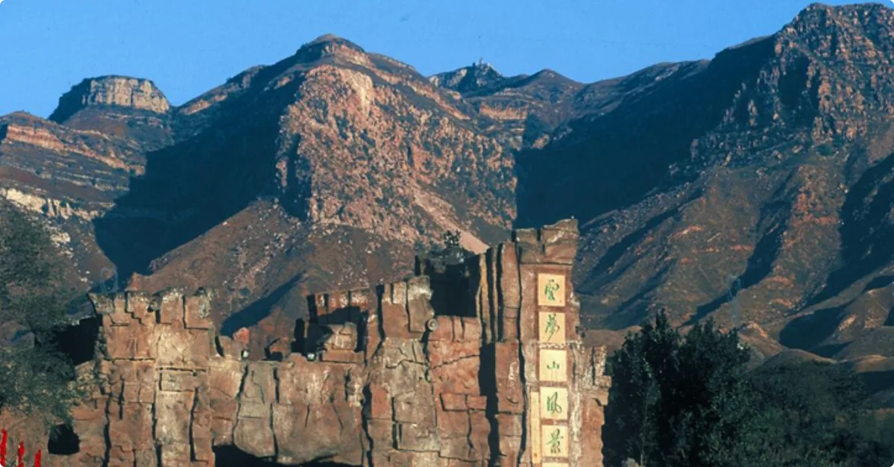

就那么一瞬间，我好像听到一个声音：

> **“你也可以登上来，来此处安家。”**

### 离开北京后，我开始等待真正的机缘

自此之后，我向往大山。
离开北京后的一年，我基本都在摆烂。
我对城市唯一的希望，都寄托在虚无缥缈的“偶遇真人”这种事情上。

---

## 3. 正式修行的第一课：无论得到什么，都要把自己放低

### 第一次见到真正的“修仙之道”

这是我正式修行的第一天，我终于见到了真正的修仙之道。

当我见到此等仙境的时候，我却并没有表现得像个修行人，反而在人性上有了极大的释放。

当时我在想：

> 功夫不负有心人。
> 
> 我吃了这么多苦，受了这么多冷眼，熬过这么多黑夜，最终都证明这一切是在帮助我走上正道。
> 
> 我是那个注定有机缘的人。

我感到前所未有的自豪，我觉得自己又行了，甚至在那里幻想着化为元神飞上天的样子。

### “跪下磕头”：自满升起，修炼能量戛然而止

不过就在我这么想的时候，此处的修炼能量戛然而止。

> **“跪下磕头。”**

严厉的声音突然出现在我的脑子里，我才醒悟过来，刚才思想走偏了。

我连忙跪下给神灵磕了几个头，一边磕着头一边认错。

直到头叩地的那一刻，周围的修炼能量才重新涌入我的体内。

> **“你啥也不是。”**

这几个字深深地印在了我的心里，让我当场面红耳赤，成了我的第一堂课。

### 一条修仙路上的知识，为什么“一字千金”

对我来说，只有牢牢抓住修仙的路最重要，其他都不重要。

这条路上的任何知识点都是**一字千金**。

领悟其中一个道理，就足以应对很多考验；反复践行一个道理，才能沉淀成自己的品性。

所以自此之后，每次有进步，我都会对自己说：

> **天地自然之间，你啥也不是。**

然后老老实实复盘这段时间学习了什么。

### 多年后，我才明白那一跪真正教我的是什么

多年之后我才明白，那天的一次跪拜、一句话，其实都是在教导我：

> **无论未来收获什么，都要把自己放得很低，把头颅放得和地面一样低。**

只有这样，你才不会走上歪路。

也只有这样，才会有神灵愿意教导你。

原来都是神灵的良苦用心。

想到这儿，我感动得想哭。

心怀感恩，我朝心中的那个方向行了跪拜礼。

---

## 4. 清晨访仙境：穿过鬼域，进入真正清净的结界

### 凌晨五点，向曾在梦中感召我的地方出发

今天早上五点不到我就出发了。

虽然街上有三三两两的人，我倒是觉得跟月亮、星星更亲近些。

毕竟同样追求修炼，也算志同道合。

修到这个阶段，身上的**凡气**已经排去了很多，所以人才能跟自然共鸣。

当年去拜访的仙境，是梦里先有感召。

想想，也许是时候去看看了。

### 山路上的异常：我闯进了一个“鬼众结界”

等我到的时候，天气已经放晴，万里无云。

那个地方离城市很远，除了一条小路，也没有别的人。

就在我还在欣赏风景的时候，突然感觉到一阵头疼。

原来是附近的**鬼气**开始多了起来。

此地不宜久留，我加快往前开去。

可是过了几百米，鬼气依然没有减弱，反而多了起来。

**乌压压、一阵一阵的鬼气，就朝着我的车子撞了过来。**

凭借我的知觉，有大的鬼，也有小点的鬼。不过跟人的亡魂还不太一样，它们的力气更大、更凶。

这时我才确定：

> **我闯进了一个结界里——由鬼众建立的结界。**

在这个结界里，有成千上万的鬼驻守在此。

别无他法，我只能硬着头皮往前开。

足足开了有 **4公里**，直到一处地方，突然头再不疼了。

好像经过了一个卷帘门，帘子把厉鬼们全挡在了门外。

看来此处的能量结界是清净的。

---

## 5. 结界之内：清潭、山峦与神灵的问询

### 穿过鬼域之后，景象突然完全不同

随即我把车停在门内，缓了一会儿才下车查看。

只见此处有一潭青石，清澈见底。

远处的山峦层叠起伏，宛如一幅水墨画。

淡淡的云雾在山腰处缓缓流动，有几分神秘与宁静。

站在这片宁静的地方，时间仿佛静止，心灵也随之沉静下来。

### “来者何人？”

突然有一个声音出现在我的脑海里：

> **“来者何人？”**

我连忙行礼，和神灵打了招呼，回复道：

> “我是修行人小烨，今日前来拜访，请神灵给点能量。”

神灵继续问：

> **“要来作甚？”**

我回复道：

> “为了修炼，为了修行，也为了以后引渡更多的修行人。”

神灵不再追问，于是给了我一些修炼的能量。

能量进入我的身体后，先前残留在身上的鬼气被冲出，接着排出的是一部分**凡气**。

谢过神灵后，我不再逗留，驾车离去了。

---

## 6. 前有鬼域，后有妖山：修仙之路也有不能逾越的规矩

### 离开仙境，厉鬼一路监视到结界之外

离开的时候，那些厉鬼又追了上来。

与其说要来揍我，不如说是监视我离开。

我又往前开了 **4公里**，它们才停止跟随。

我知道，我出了结界了。

### 两公里之后，又遇到了“大妖的山头”

沿着路又开了 **2公里**，眼前出现一处山峦。

看似美丽，实则有些过分妖娆了。

远远就看到很多艳丽的花开在山坡上。

等我的车经过山脚的时候，一阵浓烈、眩晕的妖气扑面而来。

原来这边是大妖住的山头。

我赶紧加速离开了。

### 心术不正的人，即使遇见机缘也可能是灾祸

这个地方前有鬼域，后有妖山。

也就是说，如果有修行人心术不正，没经过允许，无视修仙的规矩，妄图私自拿取能量，那么不管那人自诩多么虔诚，不管曾经是否被认可，都只剩下自取灭亡。

要么死在那 **8公里的鬼域**里，要么被大妖迷惑，入了这个山头，慢慢被吸干身上的气。

---

## 7. 与神灵打交道：修行其实是在一点点补全自己

### 转世成人，就必然带上人性的缺点

要说修行中最有趣的事情，还属和神灵打交道。

一个修行人，无论曾经的元神有多牛，转世成人就必然带上人性的缺点。

想要修成仙，那就必须从别处弥补。

**这其中离不开每一位自然神灵的教导。**

### 一位像弥勒佛一样慷慨乐观的神灵

记得刚开始修仙的那会儿，因为心中常年的阴郁已成为习性，难以消散，所以没多久，我有幸遇见一位慷慨乐观的神灵。

那时我坐在山腰上。

一阵清风沿着山坡吹了过来，轻抚我的额头。

神灵将他的能量吹进了我的胸口。

一个笑口常开的形象在我心中显现，好似弥勒佛那般性情。

我的心突然就释怀了，我很想开怀大笑。

是啊，眼前的一切都是真实而美好的。

我如愿走上了修仙的道路，我的未来一片光亮，我的过去皆是**缘法**。

接下来的路，有美景和万物作伴。

神灵是我的老师，有令我期待的知识，有令我向往的仙界神灵。

那慷慨激昂的能量让我想通了这些事情。

**我残缺的人格，完整了一些。**

---

## 8. 灵树与蝴蝶：原来在世人看不见的地方，万物都在修炼

### 会“解毒”的灵树

有一次我遇到一棵灵树，它的树枝具有解毒气的能力。

这位灵树很可爱。

它随风摆动树枝，好像是在招呼我过去，它说要教我怎么给自己解毒。

它让我把手想象成树枝的模样，从它枝头上引出一股能量，然后再注入身上常生病的地方。

一股病气随之排出。

它说：

> 如果以后有不好治疗的病气，都可以找它帮忙，因为灵树最擅长解毒。

听完这话，我很感动。

### 修炼几十上百年，姿态依然放得很低

灵树已经修炼了几十、上百年，修为已经很高了。

然而姿态依旧放得很低。

这时，一只蝴蝶从树枝上飞过。

它的翅膀扇动的时候，明显有些许修炼的能量。

看来这是灵树引渡的一只蝴蝶精。

它趁着我修炼之际，也过来沾一点福气。

### 修行人其实并不孤独

原来修行人真的不孤独。

> **在世人看不见的地方，很多生灵都在悄悄修炼。**

它们相互陪伴，视天地为父母，视自然为家，内心其实是非常充实的。

人外有人，山外有山。

修行人既要学会争取、要有向往，又要学会放下。

**既浮游于天地间，如何平衡内心，只有不断在自然中领悟真谛。**

---

## 9. 塞北草原的最后一课：放下红尘，才能听见自然的呼唤

### 驶离人类世界，奔向一望无际的草原

一次，我被指引到塞北一处仙境。

当我开车进入草原的时候，我既有些慌张，又有些期待。

之所以慌张，是因为周围人类的建筑越来越少了。

眼前只剩下一望无际、又无人的草原。

仿佛我正在告别人类的世界，奔赴神秘的新世界。

### “要如无边无际的草原那般，拥抱无限的可能性”

草原仙境的那位神灵教导我：

> **“小烨，记住眼前的景色、心境。”**
> 
> **“要如无边无际的草原那般，拥抱无限的可能性；如那平缓起伏推进的大地，泰然自若地抵达远方。”**

远离人类的红尘。

天际线那边，有更值得追求的事情。

也许早在看见云龙剑的那次，那里的神灵就已经赠予我新的追求。

> **也只有当我放下对尘世的执念，才能听见自然对我的呼唤。**

我是修炼者小烨，我们下期再聊。

## 散人小沅_知乎精选的QA梳理

## 资源专栏: 
url: https://zhuanlan.zhihu.com/c_1900959021692870980

## 01-修行的最终目的是为了什么？
>作者：散人小沅  
>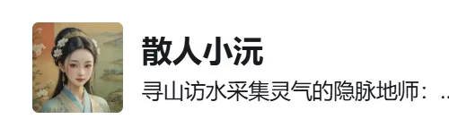
  链接：https://www.zhihu.com/question/612840095/answer/1909626741774881982  
  来源：知乎  

>[!note]
>修行即吸收纯正能量, 全宇宙通用, 而非打坐念经, 能量纯度够了自然心性稳定, 末法时代更加应该保护自己的能量场, 频率不要调乱, 其次真正的修行一定是阶段性可验证，可量化的

## 修行是什么
就是收纯正能量，把自身能量值往上提一提，能量攒够了，自然就往上走一个维度了。

## 纯正能量是什么？

就是古书里经常提到的，[日月精华](https://zhida.zhihu.com/search?content_id=728876545&content_type=Answer&match_order=1&q=%E6%97%A5%E6%9C%88%E7%B2%BE%E5%8D%8E&zhida_source=entity)，上行清炁，[天地灵气](https://zhida.zhihu.com/search?content_id=728876545&content_type=Answer&match_order=1&q=%E5%A4%A9%E5%9C%B0%E7%81%B5%E6%B0%94&zhida_source=entity)，都是一个意思, 我比较喜欢用纯正能量这个词来表述

我相信你也听说过
什么动物，植物，石头，吸收了什么，然后进化成了什么, 对吧？
那你有听说，那些动植物石头
念个什么经，打个什么坐，练了个什么丹，修个什么心，吃个什么香火
然后进化出功能的吗？有吗？
人家是碰巧在那个地方，碰巧吸收了某些东西，碰巧进化出了功能
总结出规律了没有？所以进化，它不靠打坐念经修心，好吧！那些上古大神，那时没有人类也没有香火
人家怎么修啊？其他那些不会打坐念经炼丹练气的众生怎么修？
你有没有想过这个问题, 用你小脑袋瓜子把这个底层逻辑盘一盘嘛！

## **_往上走的路，有且只有一条_**

全宇宙通用！人类和其他亿亿万万众生都是同一条路！同一个规则！这个底层逻辑不能更底层了！这个规则公平得不能再公平了！我真的不知道哪本经书给你们读傻了！对了，那些众生也不读经书，好吧！
市面上说什么[八万四千法门](https://zhida.zhihu.com/search?content_id=728876545&content_type=Answer&match_order=1&q=%E5%85%AB%E4%B8%87%E5%9B%9B%E5%8D%83%E6%B3%95%E9%97%A8&zhida_source=entity)，什么条条大路通罗马. 也不能说人家完全没有用
你先得有纯正能量，那些修法才【可能】**有点用（绝大部分都是割韭菜）

你现在一身凡气，浊气，自循环, 没有纯正且强大的外力托着你往上走, 你是上不去的！
除非你一点都不想往上走: 
不想脱离轮回离苦得乐
不想摆脱地球的束缚
念了一辈子的经，不想成fo
炼了一辈子的丹，不想成仙

那这个确实是 "条条大路通罗马", 怎么修都没有错！

都说**万物有灵**
要是念个什么词，打个什么坐，就能上去那念经机不早就成佛了？
要是耍个什么功，练个什么丹，就能上去, 那从小练的不就上去了？

那些天天说修心的
你长这么大难道不明白这世间最不可测的就是人心吗？
你但凡说钻石可以换升天的机会，我都觉得合情合理
毕竟人家钻石化学元素稳定是公认的

你拿人心跟上面要资源，你当上面的是傻子么？你们敢说自己的心能像钻石一样纯净无暇？你怎么不拿人心去银行取钱？我这么善良这么虔诚，你就应该给我钱！

这是什么？！是[贪嗔痴慢疑](https://zhida.zhihu.com/search?content_id=728876545&content_type=Answer&match_order=1&q=%E8%B4%AA%E5%97%94%E7%97%B4%E6%85%A2%E7%96%91&zhida_source=entity)的哪一种？好好想想
你虔诚你有某些国家虔诚啊？！如果虔诚有用，为什么他们那么穷，争端这么多！想过这个问题没有？！
历史上有多少战争是因为虔诚挑起的，你们数数, 你们能不能以史为鉴

别跟我说，哎呀我不一样，上下五千年，就你最特殊
你是神，你是佛，你是宇宙, 你这么能，咋不上天
在地上跟凡人杠啥！

## 心性如何稳定

我告诉你心性是怎么稳定的, 能量够了自然就稳了
你如果能认识到你得到的是比世间任何东西都要珍贵的资源
世间的所有金钱名利地位美色，所有人和事，在你眼里都是破铜烂铁
你还会有执念吗？

心，根本就不用修！
这就是道法自然！
要修心的，都是没得到过好东西的，好吧

那些看什么经书什么就跟着练的
那你有没有读到，人家也是游历[万山](https://zhida.zhihu.com/search?content_id=728876545&content_type=Answer&match_order=1&q=%E4%B8%87%E5%B1%B1&zhida_source=entity)的
哪个是在家，在庙里观里上去的？
但人家也不能把天机写出来啊

[天道](https://zhida.zhihu.com/search?content_id=728876545&content_type=Answer&match_order=1&q=%E5%A4%A9%E9%81%93&zhida_source=entity)是有很严格的规矩的！所以只能告诉你，我就是打打坐, 就好像有钱人不会告诉你他是怎么赚钱的, 只会告诉你我就是努力的, 然后你们这些牛马努力去吧, 那些有用的书，就是给已经在正道上的人看的, 不是给门外汉看的！
古人打坐你也打坐
几千年前，大环境还很单纯
你打坐，虽然上不去
但也不至于伤身，也属于修身养性了

可是现在[末法时代](https://zhida.zhihu.com/search?content_id=728876545&content_type=Answer&match_order=1&q=%E6%9C%AB%E6%B3%95%E6%97%B6%E4%BB%A3&zhida_source=entity)，能量这么负, 不打坐都不能保护好自己的能量场, 你还把频率乱调，把能量场打开
那旁边的负能量不是吃得很香吗？

真正的修行一定是可验证，可量化的, 不能验证和量化的那种
你总不能噶了才知道自己修得对不对吧

  

真的，原理都掰开了揉碎了喂到嘴边了
你还要打坐修心练这练那的
我也没什么好说的
你有九条命就去，没人拦你
今天就这样！

---

## 02-神仙对凡人动心后，会发生什么？
>[!note]
>神仙和人的能量纯度的不同其实已经是可以看做跨物种了, 因此人身自带的浊气是神仙自带的清气难以忍受的, 如果悬殊很大的话, 其次会漏掉很多的能量

这是霸总剧看多了？
神仙和凡人不是一个物种，差了不是一个两个维度。
凡人对于神仙来讲，气太浊，是滂臭的。

试想一下，人类会对屎壳郎心动吗？
好好的人类不当，非要跟屎壳郎混。
除了脑子有屎，真的想不出其他原因
当然 80 亿人也可能有一两个真的很喜欢屎壳郎的人类
那能怎么办，你自己愿意降级去当个屎壳郎

那去呗
你不想当人类，大把其他生灵抢着投胎转世，正愁没有名额。
只是降级容易，想回来就难咯
且不说名额还有没有
你自己很大概率都不记得回来这件事

但你毕竟曾经做过人类
在屎壳郎的世界怎么都不得劲，都格格不入
异常痛苦还不知道为什么。
但是也没有办法，
你自己的选择就要承担相应的后果
在屎壳郎的世界无限循环
直到有天你的恋屎脑不会再犯，
真的一点都不留恋屎的世界了

别说神仙，就连有一定修为的修行人，都受不了普通人身上的浊气。
连靠近都不想靠近，更别说亲密接触了
即使能忍住臭，圆房了，千辛万苦修来的纯正能量还会被分掉一半

什么概念？
放现代社会就是，睡一次分一半家产
就算富豪也不敢乱搞啊

修行人一心动一半修为没了
这 B 心不动也罢。
光想想就心在滴血，百害而无一利
有病才会心动。

## 03-为什么天庭不准神仙谈恋爱?
>[!note]
>人理解的恋爱和神仙的恋爱可以视作为两个物种的看待维度

谈恋爱是啥了不起的事吗？
都那个能量层级了，谈恋爱干啥？
天上地下就没有比谈恋爱更好玩的事了吗？

**世间绝大部分恋爱都只是打着爱的名义在满足生育和私欲。**
神仙谈恋爱图啥？
图钱？上面也不用钱
图身体？图好看？神仙都是无形的，变啥不行？
图情绪价值？我在人间都知道，修炼是比世间任何感情都快乐的事！
那图啥？图谈恋爱绑手绑脚？迁就来迁就去？

连小情小爱的情欲关都过不了，还能当神仙？
神仙就这意识层级，这觉悟，这格局？
实在恋爱脑的，贬下凡间去谈个够呗。
BUT! 一旦下去，想回来就难咯

## 04-修行之后物理层面都有哪些变化
>[!note]
>真正的修行可验证可量化,  接触纯正能量后, 会让身心都得到愉悦, 运势也是能量的一种表现

我说过真正的修行，一定是性命双修，可验证可量化的。

最直观的就是物理层面，或者说身体层面的变化。

首先，身体是革命的本钱，身体不健康谈什么修心，谈什么情绪稳定，更别提长生，没有意义

其次，一个人的运势，本质就是能量，能量足，运势好。运势好，人际关系，生活各方面都会变好，自然就会情绪稳定。而不是天天在那用各种心理方法，用想象力安慰自己或者压制本心本性。这样的人，天天修天天稳定不了，还天天自责。因为世界根本不是这么运作的。情绪稳定（修心）本质是靠能量足够支撑而自然而然达到的状态。

最后，一个人的[意识层级](https://zhida.zhihu.com/search?content_id=751059899&content_type=Answer&match_order=1&q=%E6%84%8F%E8%AF%86%E5%B1%82%E7%BA%A7&zhida_source=entity)也是靠能量支撑上去的。就是你能量够得着那个层面的事物，才能得到那个层面的信息。那个层级信息让你知道，你才得以知道，这就是俗话说的开悟。一些人一天天在那里靠想象力乱链接，从负能量大佬那里拿到信息，拿到的信息真伪也看大佬的层级，有些确实很厉害，但是以人的阳气做交换的，搞多了就不是伤身那么简单了。

简而言之，修行一定离不开能量，一定不是靠”想象力““向内求”这种无稽之谈。

当你真正接触到这条路之后，具体每个人的变化都是不一样的，所以个人变化，仅供参考。

### 初期：

第一次接触纯正能量

- 眼袋没了 （堪比 [Y美手术](https://zhida.zhihu.com/search?content_id=751059899&content_type=Answer&match_order=1&q=+Y%E7%BE%8E%E6%89%8B%E6%9C%AF&zhida_source=entity)）
- 身体里面的炎症和腐臭味消失了
- 脸色直接亮了起来
- 眼睛亮起来了

底子比较差，或者已经快被吃空的朋友，会非常困。初期困是常有的事。或者遇到负能量也会困。因为正负在打架呢。
底子厚的，会亢奋，精力充沛，但是不是喝了咖啡睡不着那种。
遇到纯正能量的时候，「有时」会有鸡皮疙瘩，麻，或者其他感觉，也可能没有感觉。但都不重要。

在控制其他变量的情况下：就是除了收能量，日常生活没有任何变化，没有特别做什么调养，吃什么饮食，做什么运动，都没有。就是一如既往地该干嘛干嘛。

## 后期:
慢慢积累多了之后，会有种血气充足的感觉，具体表现为

- 不缺铁的了不贫血了，本来一路红灯的血液指标正常了。
- 本来有[乳糖不耐受](https://zhida.zhihu.com/search?content_id=751059899&content_type=Answer&match_order=1&q=%E4%B9%B3%E7%B3%96%E4%B8%8D%E8%80%90%E5%8F%97&zhida_source=entity)，现在吃奶酪制品，没什么反应。
- 姨妈不疼了，一点不疼
- 从小巨怕冷的人，在零下的温度里，不再怕冷，也不再手冻脚冻，半天睡不暖了
- 一天开十几小时车一点不累了
- 吃的好睡得香，甚至会亢奋，睡醒也很开心
- 伤口愈合快：不小心嘴撞车门上，嘴里破皮了，当下真是痛疯了，我都怀疑我会变香肠嘴。但是第二天，我都摸不到我撞哪了，按压也不疼，伤口也没了。
- 维持在健康的体重，不管饮食如何，都没有什么上下浮动。我以前体重每天都会在 2-4 磅上下浮动，还是在控制饮食的情况下。现在每天浮动在 1 磅以内。尝试过 10 天在 0 度条件下的床车生活，吃不太饱（主要不饿）穿不太暖（主要不怕冷），体重一点没变化。
- 情绪稳定，极其稳定
- 人缘变好，动物缘变好
- 面相变了，耷拉的眼角上扬了，凹陷的脸颊蓬起来了。（又堪比 Y 美）
- 指纹变了：许久没用指纹打开电脑，最近发现两个手指头都打不开了，只能用密码打开。重新录入的指纹就能开，有点担心过海关咋整。
- ....

Again，因人而异，这只是我自己观察到的变化，
已经在路上的朋友不要问为什么有，为什么没有，什么时候有，（因为我有的病你没有），说这些都无意义
我只是在说，收能量对物理身体是有非常具体的变化的，但具体变化因人而异。

这些只是纯物理层面的变化
回到家看到室友，吃一堆营养品，非常非常注意饮食，不吃过夜菜，只吃有机，吃糙米，一堆一堆注意事项，就这么养，还每天大病小病的。

我真的很想说一句，你不用想那么多，去收能量，正常吃饭正常作息，别自己作死糟践身体就行。
但是你知道对于现代人，就正常吃饭，正常作息这两件事都很难做到，受干扰太严重了，身不由己。

而我说收能量，她也听不懂，也不会去听的，她在自己认知思维里锁死了。
我也就只能笑笑，听她叨叨了 30 分钟如何养生。

当然我以前修其他修法的时候，也有见过瘤没的，瘸腿修好的。
我自己也包括我朋友们
也有一段自我感觉好极了
但脸色还是营养不良，苍白的，泛黑的

这种就是典型的[夭磨之气](https://zhida.zhihu.com/search?content_id=751059899&content_type=Answer&match_order=1&q=%E5%A4%AD%E7%A3%A8%E4%B9%8B%E6%B0%94&zhida_source=entity)
这种短暂的效果就是一种甜头
不然谁都不是傻子对吧
至于能不能分辨，就真是见仁见智了。
很难说清楚

其他维度的变化，语言过于匮乏，说了也没意义感觉，再说吧....

## 05-善恶因果如果不是绝对，那为什么一定要导人向善那？

实际是人类的自我感动罢了
有谁能承认自己恶呀
总是得找点理由
美化自己的所作所为

善非功，恶非过
有绝对的善恶
但是是从天道的角度去定义的善恶
别说纬度不同
就连认知不同善恶标准都不一样: 

1. 举个例子
天灾是善还是恶？从天道角度来讲: 人类持续作恶, 不利于世间其他众生持续发展, 所以降下天灾让人类苏醒: **是为善**
从人类角度来讲, 只会大骂天道无情, 这是灭种族的大恶啊

2. 举个人间例子
你圣母心泛滥，放走了个杀人犯
导致更多人死亡
是善是恶？

3. 再举个非人间例子
一个人前世欠下的[业债](https://zhida.zhihu.com/search?content_id=745397222&content_type=Answer&match_order=1&q=%E4%B8%9A%E5%80%BA&zhida_source=entity)
今生本该有个意外还清了
人家就能去更好的地方了
但你多事，救他一命
这下又还不清了，浪费了这次投胎
是善还是恶？

有很多所谓的大恶人
搞不好是天道派下来成就大善人的
人家不仅不是恶
人家还有功

比如西游记里天上那些坐骑
下来吓一下唐僧
跟孙悟空比划比划
就被神仙们接回去天上继续当萌宠啦
说白了人家就是下来完成任务的

很多人间所谓的“善”, 在天道眼里为“恶”
因为这个世界不是只有人类

还有亿亿万万有形和无形众生
天道要为所有众生负责
而不是只对人类负责
而人类永远只从自己的角度
自己的认知层级去定义善恶

所以
人在没有能力看清前因后果前世今生. 也悟不到天道的标准的时候
没有资格也没有立场谈善恶
善恶的转换就在一瞬间, 立场一转，纬度一换, 你就成为了恶业的帮凶

## 06-如果有修仙者看上你的资质，让你抛下一切，避世修炼，你愿意吗？

>[!note]

【真的】修仙者看上了你资质
也不会主动要收你为徒

因为：
1. 法不轻传，道不贱卖，师不顺路，医不叩门是规矩。
2. 修仙资源何其难得，谁求谁？
3. 资质（来历）好的人多得很，你不修大把其他资质好的人抢着修。

其次，【真的】修仙者，不会要求你抛下一切，避世修行，因为这不符合目前的修仙规则。避世修行已经过时了，现在是另一套规则了，给你那么多能量，不是给你避世的！

这个假设像啥呢，给你举个例子
一个人在街上说，你骨骼清奇，我要给你一个亿，你从此避世。
荒谬在哪里？
1. 你骨骼是钻石做的吗？人家为什么给你一个亿？
2. 给你一个亿避世，你钱也没地方花，给你干啥。

这个世界所有东西都是等价交换
不是在物理世界就是在无形世界。
物理世界的流通货币是钱，
无形世界的流通货币是能量（能量层面人类拥有的只有阳气，而阳气=命）

所以如果有个人看上你，只有三种可能：
**骗财，骗色，骗命。**

## 07-为什么要修行？为什么人年轻时修行，比等到年纪大了才开始更重要？
修行就是用纯正能量（天地灵气）去冲掉人身上的凡气（阳气），以达到升维的目的（飞升，[扬升](https://zhida.zhihu.com/search?content_id=752399600&content_type=Answer&match_order=1&q=%E6%89%AC%E5%8D%87&zhida_source=entity)，成仙成佛，都是一个意思）

人出生时是阳气最足的，随着年龄的增长，阳气会消散，会因环境影响变浊，会被吃而产生[病气](https://zhida.zhihu.com/search?content_id=752399600&content_type=Answer&match_order=1&q=%E7%97%85%E6%B0%94&zhida_source=entity)死气。越老身体就会出现各种问题，连保证健康都已经非常艰难了，别说修行了。

人身上有多少浊气病气死气，就要用多少灵气去对冲抵消，把身体清干净，把身体重新养好，这一步越老越难。这只是修行前准备。

身体彻底干净了，才可能开始换掉凡气的修行。而换凡气也是个漫长漫长的走遍千山万水的过程，不仅需要时间，也需要体力

越老不仅耗费的灵气就越多，也没有那么多时间和体力去找灵气了。而灵气资源是有限的，你的老师和引路人时间精力也是有限的，太费灵气又没时间没体力能修出个所以然，大概率很难有贡献值。那当然资源会更倾斜给更有希望的人。

所以修行要趁早越早越好，最好的时间是你出生时，其次就是此刻。

## 08-走上正道修行会经历哪些阶段
每个人都略有不同，这个是我经历的几个阶段，仅供参考

**第一阶段：[世界观颠覆](https://zhida.zhihu.com/search?content_id=261544978&content_type=Article&match_order=1&q=%E4%B8%96%E7%95%8C%E8%A7%82%E9%A2%A0%E8%A6%86&zhida_source=entity)崩塌**
这个阶段特别迷茫，因为真正的修行之路，闻所未闻，甚至与自己从小到大的认知体系都不一样。我已经是从小接触[玄学主义](https://zhida.zhihu.com/search?content_id=261544978&content_type=Article&match_order=1&q=%E7%8E%84%E5%AD%A6%E4%B8%BB%E4%B9%89&zhida_source=entity)教育的孩子了。即使这样，也是非常颠覆的。这种突然意识到自己对世界的认知都是错的，会像疯了一样，什么都不敢碰，甚至也不知道应该怎么生活，因为以前的生活方式也是错的。

**第二阶段：求知若渴**
这阶段把自己关起来，翻遍所有能翻到的文章视频，老师的，前辈的，一遍一遍读，一遍一遍看。每篇我真是读了六七八九遍，视频每个都看了 50 遍以上。有一说一，现存的资料真的少得可怜，完全无法填补和构建一个新的完整的世界观。所以只能重重复复地看，生怕错过一点点信息。看书无用，真理不会在书里

**第三阶段：上课上山**
理解真正[修行路](https://zhida.zhihu.com/search?content_id=261544978&content_type=Article&match_order=1&q=%E4%BF%AE%E8%A1%8C%E8%B7%AF&zhida_source=entity)是什么样子之后，确定自己在干嘛，就可以申请上山（通不通过是另一回事），具体流程得经过筛选才能透露了，这里就不说了。

**第四个阶段：大惊小怪，十万个为什么**
因为打开了新世界大门，身体的感官也会有变化，会感知到一些以前感知不到的东西，比如正负能量。结果就是一点头疼脑热，风吹草动，都会大惊小怪。为什么这里疼，为什么那里难受，这个为什么这样，那个为什么那样。但我很幸运，有前辈天天听我叨逼叨，一个会把我骂醒，一个耐心倾听。扪心自问，我自己都做不到对别人这样（对不起大家），我自己会被自己烦死。如果我遇到我这样的人，我肯定把我删了。很多人，并没有这样可以叨逼叨的机会。所以我很想实名感谢一下这几位前辈，但是我不能。

**第五阶段：满脑子都是上山**
这个阶段也像疯了一样，生活工作什么都不想了，就只想上山，不停地上山，被拒了，会哭鼻子。会怀疑自己不够好，怀疑自己不够格，怀疑自己做错了什么，怀疑着怀疑着，又会哭鼻子。这个时候非常危险，因为心态稳对于修行是很重要的，修行是一件长期的事，过于着急很容易会断送自己的修行路。老师也是劝了又劝，让等了又等，我也是哭了又哭，终于有一天做梦，梦见老师和前辈，说我救回来了。前辈说，终于稳下来了，真怕我疯了。
>上山: **通过前辈的严格考核，获得资格去秘密道场（或宗门）进行“封闭式实修”。**
  
**第六阶段：[圣母心泛滥](https://zhida.zhihu.com/search?content_id=261544978&content_type=Article&match_order=1&q=%E5%9C%A3%E6%AF%8D%E5%BF%83%E6%B3%9B%E6%BB%A5&zhida_source=entity)**
因为知道这条路好，这条路对，所以就想安利给全世界，圣母心泛滥，见个人都想救。于是不停地大量地输出，写文章，做视频。但是这个阶段随着能量慢慢增强，也会慢慢趋于平稳，并不是不输出，而是有灵感，平衡地输出。也渐渐接纳自己不可能救所有人的事实，更多是尊重每个生命自己的选择和命数，绝不会多说一句也不会强求。

  
**第七阶段：渐渐远离原本的社交圈**
如果原本的社交圈都是普通人，气没有那么浊，那还能偶尔处一处，聊一些皮毛话题。像我原本社交圈都是搞玄学的，身上的气那叫一个酸爽，一靠近就呕吐不止，完全无法正常对话。国内同路人还比较多，海外的话，听说过的同路人一只手数得过来，碰上是不可能了。会有非常明显的孤独感，连个说话的人都没有。
要是现在还没对象的，修行之后估计难上加难了。

第一，三观和思维层级是肯定不合的，他的人生目标是钱，你的人生目标是仙，聊不到一起的。
第二，对象不修行，身上的气肯定是臭的，忍不了的。
第三，圆房会分能量的。能量何其珍贵，比钱还珍贵。你甘心辛辛苦苦攒的能量，随随便便分人一半吗？如果那人对修行不感兴趣，就会心理不平衡，凭什么我辛辛苦苦攒的能量，你睡一觉就拿一半，而且你拿了也没有用，又不修行。（极端恋爱脑除外啊，恋爱脑先把脑子治治再修。）

要是现在有对象。修行之后，对象如果不修也很难走下去了。要么瞒着，要么送你去精神病院。想修都异常艰难。

**第八阶段：趋于平稳**
这阶段心态就是，修行固然是终极目标，但是好好活着更重要。先把好好生活工作，好好照顾自己为第一要务，然后力所能及地修行。因为修行花费的人力物力财力都不少，所以好好生活工作才能谈后续。

之后当然还有更多的阶段，但都因人而异。最后趋于平静好好生活，稳稳地一步一个脚印的走，肯定是绝大部分人的状态。修行是一辈子的事，不是比谁走得快，而是比谁走得久，谁活到最后。

**【写在最后的碎碎念】**
修行这条路
注定最终只能一个人走
这是每个[修行人](https://zhida.zhihu.com/search?content_id=261544978&content_type=Article&match_order=1&q=%E4%BF%AE%E8%A1%8C%E4%BA%BA&zhida_source=entity)的归宿
我只是提前适应了

## 09-正道修行入门须知
## 什么是[修行](https://zhida.zhihu.com/search?content_id=262253121&content_type=Article&match_order=1&q=%E4%BF%AE%E8%A1%8C&zhida_source=entity)？

这里简要的概括一下
宇宙所有存在都是[能量体](https://zhida.zhihu.com/search?content_id=262253121&content_type=Article&match_order=1&q=%E8%83%BD%E9%87%8F%E4%BD%93&zhida_source=entity)，包括人:
当吸收的能量<消耗的能量，能量体就会慢慢死去。
当吸收的能量=消耗的能量，能量体即可长生
当吸收的能量>消耗的能量，能量体即可升级

而修炼就是尽可能多的吸收能量，从而达到长生或者升级的状态，就是我们所说的修行（修炼）
想要长生，光修心是不够的，肉体也得活下去才行。
所以一定是某种方法可以让你性命双修的。
如果你的修法只注重灵魂层面，不好意思，一定是错的。

## 什么是[正道修行](https://zhida.zhihu.com/search?content_id=262253121&content_type=Article&match_order=1&q=%E6%AD%A3%E9%81%93%E4%BF%AE%E8%A1%8C&zhida_source=entity)？

能量是有正有负的，即道家所说的阴阳平衡。
即修炼有正能量往上走的修炼，也有负能量往下走的修炼
阴阳两种能量同等强大
两种方式都可以成为很厉害的能量体
也就是说有很厉害的 [SHEN](https://zhida.zhihu.com/search?content_id=262253121&content_type=Article&match_order=1&q=SHEN&zhida_source=entity)，也有很厉害的 [MO](https://zhida.zhihu.com/search?content_id=262253121&content_type=Article&match_order=1&q=MO&zhida_source=entity)

正负能量相遇会抵消，所以没有能量体能同时吸两种能量
但人例外，人可以同时承载正能量和负能量
人体的阳气，不算是一种好的能量，
对于负能量众生来说，是极好的一种修炼能量

所以负能量大佬非常很爱吃人气
怎么吃呢？信仰，供奉，链接，Fu身都可以吃

而对于正能量众生，却是浑浊和滂臭的能量
就算你想把人气送上，人家只会嫌臭
而且人类满脑子欲望，大神不屑搭理人类

当然，每个人都可以选择正能量修和负能量修
选择用负能量修炼，本质就是用你的阳气做贡品置换负能量的阴气
所以能修出各种链接下面的神通
但人没有阳气，肯定是要噶的。所以不可能达到性命双修的结果
不管修得能量多大，你也不可能大过给你能量的大佬
总有一天是要被吃干抹净的！噶后也只能是给你背后的负能量大佬打工
上去肯定是上不去的，充其量去底下做个阴仙
很多你们以为上去了的[国学大师](https://zhida.zhihu.com/search?content_id=262253121&content_type=Article&match_order=1&q=%E5%9B%BD%E5%AD%A6%E5%A4%A7%E5%B8%88&zhida_source=entity)都在下面

  
所以本文所指的正道修炼，
专指，用纯正能量来修炼自己，从而达到长生或者飞升的结果的修法, 用纯正能量冲掉身上的浊气，凡气，从而身体越来越清，慢慢往上走
这也是**唯一**一条天道认可的上升之路
  
你试想一下，
上升之路那么多条，世上物种那么多，
如果十万八千条上升规则，谁上得去？！
怎么能保证公平公正？
用脚趾头想想都不可能，上升之路，有且只有一条，
每个时代都不一样，且不由人说了算。
这时代的上升通道，不在市面上任何的棕叫[玄学理论](https://zhida.zhihu.com/search?content_id=262253121&content_type=Article&match_order=1&q=%E7%8E%84%E5%AD%A6%E7%90%86%E8%AE%BA&zhida_source=entity)里

## 纯正能量是什么

天把纯正能量（也称[灵气](https://zhida.zhihu.com/search?content_id=262253121&content_type=Article&match_order=1&q=%E7%81%B5%E6%B0%94&zhida_source=entity)）通过阳光雨露风雨雷电降临到大地上
而山河湖海接收了能量并汇集到某些地方
这些地方就被称为[福地洞天](https://zhida.zhihu.com/search?content_id=262253121&content_type=Article&match_order=1&q=%E7%A6%8F%E5%9C%B0%E6%B4%9E%E5%A4%A9&zhida_source=entity)（风水宝地）
也就是我们说的灵力充沛的地方
而能够聚集并守护这些能量的山河湖海就会诞生【[自然神灵](https://zhida.zhihu.com/search?content_id=262253121&content_type=Article&match_order=1&q=%E8%87%AA%E7%84%B6%E7%A5%9E%E7%81%B5&zhida_source=entity)】

这些纯正能量
一部分用来滋养万物生长，一部分供生灵修炼

地球还灵气充沛那会，地上诞生了很多上古大神
很多古书也有记载
不管是人或者动物, 想要改变意识形态, 也是在灵气充沛的地方才可能

## 纯正能量有什么作用？

咱们不讲虚的，什么福报啊，来世啊，什么乱七八糟看不见摸不着的，无法验证的玩意
那些玩意你就骗骗你自己得了

纯正能量是实打实可验证，可量化，有作用，世间最顶级的资源
少则一生顺遂，无病无灾，多则长生，甚至飞升

对于普通人来说无非就是求以下几点：

1. 身体健康：纯正能量本质就是用清气冲掉浊气，病气，死气。这样病灶很难生根，自然就会身体健康。（当然如果已经有病了，赶紧先去医院看病，别封建迷信）
2. 情绪稳定：人的情绪不稳，绝大部分是人的能量低了或者受了负能量灵体的干扰。纯正能量冲掉的身上的负能量（也就是驱磨驱诡），人自然清明，情绪自然稳定。这是自然而然的。
3. 生活顺遂：运势的本质就是能量，能量足了，运势就好这是很简单的因果关系。谁能成事，本质就是比谁能量大。钱权名利都需要运势，没有运势任何人都成不了事。说能改命都不为过。市面上绝大部分都是借助负能量来提升运势的，这种效果也是很好，但是我说过，这种是要用命去换的，[反噬](https://zhida.zhihu.com/search?content_id=262253121&content_type=Article&match_order=1&q=%E5%8F%8D%E5%99%AC&zhida_source=entity)是很可怕的（但是如果你抱着求名求利的心态来修行，别来，噶得更快）
4. 趋吉避凶：之前讲过，身上有纯正能量，就能分辨那些人事物身上带有多少脏东西。而意外，就是负能量聚集到一定程度在[三维世界](https://zhida.zhihu.com/search?content_id=262253121&content_type=Article&match_order=1&q=%E4%B8%89%E7%BB%B4%E4%B8%96%E7%95%8C&zhida_source=entity)的显像。所以你可以知道，哪些人不能合作，哪些东西不能碰，哪些地方不能去。在你身上，你一定会知道，明天和意外，哪个先来。（叛徒和违背天道规则的除外）
5. 保家人平安：你能保自己平安，必然会保家人平安，这是毋庸置疑的。（家人不想被保或者不信你，那你也得尊重）

普通人到这，这一世已经是有非常大的福气了，可以寿终正寝了。

接下来就是[修行人](https://zhida.zhihu.com/search?content_id=262253121&content_type=Article&match_order=1&q=%E4%BF%AE%E8%A1%8C%E4%BA%BA&zhida_source=entity)求的了：

1. 开悟开智：没有纯正能量之前，人的脑子像蒙了一层纱，只有纯正能量才能慢慢把纱拨开。慢慢地就能领悟到很多更高层次的东西，而不是执着于眼前的三瓜两枣，或者人间的财权名。换句话说，人间的东西，你已经看不上了。
2. 长生甚至[飞升](https://zhida.zhihu.com/search?content_id=262253121&content_type=Article&match_order=3&q=%E9%A3%9E%E5%8D%87&zhida_source=entity)：说这个太远了，你就这么一听就好。因为你现在连门槛都没摸到。光长生这一点，是古代多少帝王想求求不到的。为什么？因为[天道](https://zhida.zhihu.com/search?content_id=262253121&content_type=Article&match_order=3&q=%E5%A4%A9%E9%81%93&zhida_source=entity)不开放。

这么多想都不敢想的好处，绝对的世间最顶级的资源啊
所以不管是普通人还是修行人，只要不是个傻子，都会想找正能量修行的。
你快告诉我哪里找这么好的东西，不告诉我你就是骗子。
先打住，既然是顶级资源，必然有非常严苛的规矩
不然随便什么阿猫阿狗或者贪婪之人拿了去
还有普通人什么事

你想想古代仙人都是怎么考验修行人的，
再想想
你有没有这个慧根和心性，拿得起这个资源
你又用什么态度来求这个资源

---

## 怎么样才能拿到纯正能量？

想拿纯正能量这种顶级资源，已经属于天机的部分，我只说我可以公开说的部分。
天地从来对万物都一视同仁
规则从来都只有一条，而且非常简单，几句话就能说清楚。

要么你正好住在灵力充沛的地方，但这种就是稀稀薄薄一点点给，几百几千年，慢慢来。还是孙悟空为例。

要么就是正道修行，特地去拿能量，无非三点：

1. 去哪拿：首先你要学会怎么找到这种灵力充沛的地方。很多人也知道要去山里修行，但是不得要领。并不是只要是个山就灵气充沛的。找不到，还自以为拿到能量的，拿得都是负能量
2. 怎么拿：你得知道用什么方法拿能量。有很多灵气的地方，甚至在景区，但随便一个游客就能拿吗？答案肯定是否定的。随便走过就能拿，你当灵气是花粉啊？这跟当街撒钱有什么区别
3. 凭什么你拿：你得有许可。这一条，体现了规矩的严格性，没有许可，就是偷了。即使知道方法也会非亖即残。我之前说过，地有多大的灵气，就有大的神灵在保管这个能量，周围就会有多强的大夭大磨守卫。想想一些仙侠剧里的灵草，是不是都有凶兽守护，修行人想要拿都是非亖即伤。所以想要拿，你得有人引荐。用仙侠剧比较具象的例子就是，凶兽想要揍你时，神灵会在后面喊：住手，不得无礼，让他进来。然后你跪在神灵面前，弱弱地问一句，请大神赐我一点点能量。但给不给，给多少，是神灵说了算。当然，这个只是用大家熟知的仙侠剧打个比方，这些都是能量世界发生的事，现实世界你也看不见。

想要正道修炼，以上三条缺一不可。而这三条，没有高人点化，你不可能知道任何一条。
而正道的[修法](https://zhida.zhihu.com/search?content_id=262253121&content_type=Article&match_order=3&q=%E4%BF%AE%E6%B3%95&zhida_source=entity)，只教这三点。但凡你的修法没教你任何一条，不用怀疑，你没在正道上。

## FAQ：

问：纯正能量是不是拿一次就够了

答：当然不是，是能量就会有消耗，在尘世生活，接触的人事物甚至空气，都是人和 yaomoguiguai 排出的污浊之气。必然有损耗。想往上走，必须走很多地方，采集不同的灵气

  
问：是不是什么人都可以拿纯正能量

答：当然不是。要经过考验筛选，人品心性慧根都得考验。心术不正，想抢能量的叛徒也有，缺胳膊少腿都是轻的 （自有天收，而且是马上应验的那种）。

  
问：是不是一学就会

答：是，高人一点就会。但学问是分层次的，层次低时，只能学到层次低的知识，给你透露点皮毛对你很好了。皮毛，也足以拿到非常好的能量了。层次慢慢高了，才会慢慢透露更高的知识。不然不经过考验，谁都拿，视天规何在。当然现在门槛越来越高，能不能入门，都是机缘和个人造化。

## 10-测元神来历的方法
>[!note]
>上士闻道，勤而行之；
中士闻道，若存若亡；
下士闻道，大笑之。
不笑不足以为道

**元神是什么？**
元神是指最开始诞生的意识/神识。
神识/意识是能量体，能量体存在就有消耗，有消耗必须从别处获得能量才能继续存活。这个获得能量方式就叫**修炼**。
按照修炼方式分为依正能量修炼的和依负能量修炼的。
历代成仙成佛者，都需要借助天地间的纯正能量修行，比如：
佛陀，老子，张天师

**正能量修炼的**

诞生于天上的：仙，神，星，神兽。
地上修上去的：动植物，石头。
还没修上去：地仙，人仙，山精水灵（动植物），石头。
*天上下来的，大多数都是犯错被贬下来的。但也有例外的。

**中间过渡载体 （人）**

纯人元神不分正负，但纯人元神很难理解修炼和能量这些概念，因为没接触过，没有灵魂记忆。即使修行，也只会 在庙/观里念念经打打坐。庙/观里有什么第7页会说，僧啊道啊死后，不会成佛成仙，只会成鬼住在庙和观里。

纯人元神很难摸到正道，但如果有机缘，好好修行，也能得人仙，地仙。
上升的通道被天道捏得死死的。人作为一个中间载体，能承载万物之灵。是负能量众生飞升的必经通道。
如果依正道修行，不用经历雷劫。但是如果想绕过规矩，强行飞升，就做好被雷劈的准备。
所以妖魔鬼怪都要想方设法，要么转成人，要么修成人型，要么夺舍，要么被雷劈死。
山精水灵虽然正道修炼，但非常非常非常慢，也需要转成人，才能飞升。

**负能量修炼的 （妖）**

动植物居多，靠吸食人气或浊气修炼，东北那些仙家，都是这一类。这类元神转的或者附体的人，都带有元神的特性。而且天生和元神动物特别亲近。如狐，蛇类，就容易诞生妖。妖喜欢以性欲，纵欲为食，酒店夜店妖类特别多。娱乐圈很多。

*如果归顺天道，给天道打工的，尊称为“妖仙”。

**负能量修炼的 （魔）**

怎么诞生不是确定，大概诞生于两极相生之时，能量层级可以说是大佬级别，以香火，人气和信仰为食。人有欲望的时候，魔就会出现，也称心魔。现在宗教的寺，庙，观啊里面住的多是这类。有求必应必定图谋不轨。

正神修炼之初就没有香火，修成更不需要香火，也不会再黑黢黢的地方住！

*如果归顺天道，给天道打工的，尊称为“魔仙”。这类要是正道修行起来，会特别卷！

**负能量修炼的 （鬼）**

指人死后才开始修炼的元神，修炼的方法和纯人元神有些区别，靠吸食人气，浊气，能量残渣为食，戾气更重。一般有杀欲，抑郁，喜欢刺激，恐怖的人身上，少不了这些的干扰。荒废的地方，这些不要太多。

*如果归顺天道，为天道打工的，会尊称为“鬼仙”。本人就是这类，所以本人就是个狠人，说话也不客气，但人品不差。

**负能量修炼的 （怪）**

由病菌，瘴气，煞气承载的负能量诞生的。无特定的形状，比如一团雾，生锈，发霉的东西上面就很多。也许他们很难理解人类感情或者道德规则。

这种还没有见过转世成人的。

---

**元神来历重要吗？**

元神来历决定了你有没有灵魂记忆，修行有没有根底，对正能量有没有天生的直觉，会不会被带跑偏，有没有机缘能摸到正道这个门，能不能上这个船。

但一旦开始摸到门，来历不重要，一视同仁。自己的福气和机缘自己争取。

**给正能量有缘人：**

是带着任务来的，赶紧的该醒了！跟着灵魂直觉，找回正道修行，不要迷失在凡尘里，不然回不去了！

**给负能量有缘人：**

那些是转世之前给天道打工的“仙”，品行和心性得到天道的认可。才放弃千万年修为转世成人，给正道修行的机会。这些也会有感应。因为这个机会，是他们打工了千万年，转世了千千万万回才争取到的，你灵魂死都得记着这个任务。

---

**测测你的元神来历**

看到这篇帖子的当晚睡觉前，心里请求天道神灵，让你梦见你的元神来历。
但！天道也不一定会搭理所有人。
梦到自己的来历的，请回来反馈。天道提醒你：该回家了！请赶紧找正道！你灵魂是有感应的！
没梦到的，也不一定不是，时机未到而已。只要你心里一直在找路，总有机缘。该吃吃，该睡睡，好好生活，等待机缘。

## 11-一个数学方程式演算逆天改命

“一命，二运，三[风水](https://zhida.zhihu.com/search?content_id=257809971&content_type=Article&match_order=1&q=%E9%A3%8E%E6%B0%B4&zhida_source=entity)”。相信大家都不陌生，但这个体系究竟怎么运作的，人究竟能不能改变自己的命运，没人用科学的方法说清楚过。作为一个隐脉修仙者，我就用数学给大家解释一下如何改变命运

先说结论：命运肯定是可以改的！但普通人改不了

要改变命运，我们先来说说命运的构成。先来看一下这个[方程式](https://zhida.zhihu.com/search?content_id=257809971&content_type=Article&match_order=1&q=%E6%96%B9%E7%A8%8B%E5%BC%8F&zhida_source=entity)。
之前讲过，宇宙的本质是能量，所有存在都是[能量体](https://zhida.zhihu.com/search?content_id=257809971&content_type=Article&match_order=1&q=%E8%83%BD%E9%87%8F%E4%BD%93&zhida_source=entity)，所有事件的产生都是能量聚合到一定程度在[三维世界](https://zhida.zhihu.com/search?content_id=257809971&content_type=Article&match_order=1&q=%E4%B8%89%E7%BB%B4%E4%B8%96%E7%95%8C&zhida_source=entity)的显像。能量大小直接决定了事物的发展规律。

## 普通人的命运
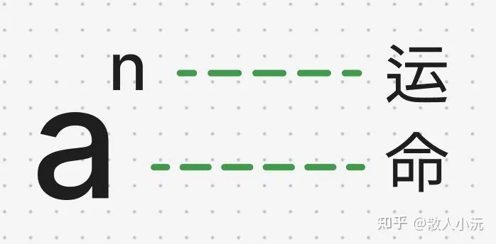

我们把总的[幂值](https://zhida.zhihu.com/search?content_id=257809971&content_type=Article&match_order=1&q=%E5%B9%82%E5%80%BC&zhida_source=entity)看做是一个人的总的能量值。
假设 a 是出生时的[源代码](https://zhida.zhihu.com/search?content_id=257809971&content_type=Article&match_order=1&q=%E6%BA%90%E4%BB%A3%E7%A0%81&zhida_source=entity)，也就是命。在传统玄学里，八字就是这个源代码。那么a 的能量值确实在出生的那一刻就是确定的。
n 次方代表后天努力的能量值，是受天时地利人和影响的。因为天地人都是能量，在能量之中必然会受其影响。
天时：可以理解为流年，有些年份能量足，有些年份能量少
地利：可以理解为出生地，现居地，也可以理解为当事人当下所处环境。
人和：可以理解为原生家庭，婚后家庭，遇到的贵人，小人，生命中所遇见的所有人。

现在你就可以理解，为什么有些同年同月同日同地点出生的人，命运是如此不同。就是这个道理。
但！n 这个数值，其实非常难撼动。基本也是注定的。如果你家里或者自己，没有人懂风水，那么普通人的命运一般到这里就结束了，可操作空间不大

## 有钱人的命运

有钱人为什么有钱呢？为什么越有钱越信风水呢？是因为他们傻吗？
当然不是啊！因为他们掌握了某些顶级资源啊！因为有钱人的方程式长这样：

x 的能量值从三个方面来：

- 祖坟（阴宅）：这个 x 数值可以出生时自带的了。祖坟在什么地方就出什么人才。水主财，山主贵。没有祖坟庇佑，几乎可以说努力完全没有用，你连做成一件事的机会都不会有。
- 自住房（[阳宅](https://zhida.zhihu.com/search?content_id=257809971&content_type=Article&match_order=1&q=%E9%98%B3%E5%AE%85&zhida_source=entity)）：越有钱的家族越敬重[风水师](https://zhida.zhihu.com/search?content_id=257809971&content_type=Article&match_order=1&q=%E9%A3%8E%E6%B0%B4%E5%B8%88&zhida_source=entity)，x 能到什么程度，完全取决于风水师的水平。
- **[正道修行](https://zhida.zhihu.com/search?content_id=257809971&content_type=Article&match_order=1&q=%E6%AD%A3%E9%81%93%E4%BF%AE%E8%A1%8C&zhida_source=entity)：这个后面单独讲**。

看方程式就知道，为什么有钱人能这么有钱，为什么差距这么大。2 的 2次方和 2 的 10 次方的能量值当然不是一个层级。

但是，祖辈蒙荫再多也是有限的，有一天也会用完的。风水师能给的也是有限的，[风水学](https://zhida.zhihu.com/search?content_id=257809971&content_type=Article&match_order=1&q=%E9%A3%8E%E6%B0%B4%E5%AD%A6&zhida_source=entity)有个名词叫：[杀师地](https://zhida.zhihu.com/search?content_id=257809971&content_type=Article&match_order=1&q=%E6%9D%80%E5%B8%88%E5%9C%B0&zhida_source=entity)。大家可以自行搜索我就不解释了。而且大多数有钱人欲望过重，会去请一些[神秘力量](https://zhida.zhihu.com/search?content_id=257809971&content_type=Article&match_order=1&q=%E7%A5%9E%E7%A7%98%E5%8A%9B%E9%87%8F&zhida_source=entity)。这些神秘力量的能量来源都为负。会加速家族衰败，自己作，示例太多，比如马某云，李某杰，你看他们面相就知道了，就是典型的被负的神秘力量抛弃的表现。这个真的可以单独开一篇讲，这篇不多说。

很多人有个误区，很多人以为风水就是摆个什么东西，挪个什么位置。其实都是对风水的误解。这种风水不会给你带来什么好能量，只能说尽量减少负能量影响，也就是保证 x 不会减少，但并不能增多，不会改变人的命运。

综上所述，即使你懂风水，能改的命运也是非常有限的，而且完全依赖他人。

  

## 正道修行人的命运

我相信你听过修行人的命运算不准，为什么？还是同一张图：

如果 x 的能量值完全靠阴宅和阳宅而来，那么你的命运就不是掌握在自己手上的。
但是如果 x 的能量值是自己正道修行得来，那么这个 x 就可以是无限的，量变到质变时，命运就框不住这个人了。

这里强调再强调！
**正道修行专指，遵守天道规则的人，去到特定的能量汇聚的地方，用特定方法采集纯正能量，冲刷掉身上的凡气/浊气，从而壮大自身[能量场](https://zhida.zhihu.com/search?content_id=257809971&content_type=Article&match_order=1&q=%E8%83%BD%E9%87%8F%E5%9C%BA&zhida_source=entity)。**

少则身体健康一生顺遂驱邪避凶，
多则开悟/成佛/成仙（无论你用什么词：就是[升维](https://zhida.zhihu.com/search?content_id=257809971&content_type=Article&match_order=1&q=%E5%8D%87%E7%BB%B4&zhida_source=entity)的意思）。
古人曾说过，“采得[天地灵气](https://zhida.zhihu.com/search?content_id=257809971&content_type=Article&match_order=1&q=%E5%A4%A9%E5%9C%B0%E7%81%B5%E6%B0%94&zhida_source=entity)，方能有机会神灵护体，得道长生”。这个天地灵气就是纯正能量，也称[日月精华](https://zhida.zhihu.com/search?content_id=257809971&content_type=Article&match_order=1&q=%E6%97%A5%E6%9C%88%E7%B2%BE%E5%8D%8E&zhida_source=entity)或上行清炁，都是一个意思。我更喜欢用能量这个词来表述。

纯正能量，是宇宙最最最顶级的资源，是上升的唯一通道，自古以来被天道拿捏得死死的，有获得之法的人寥寥无几，所以从古至今飞升的人才如此少。这样顶级的资源，不可能对外公开，更不可能写进书里。

一旦掌握了采集之法，x 的值就可以无限大。那么能量值就可以无限大。全靠个人努力就可以做到。那么命运，是不是就框不住你了？

我可以很负责的说，市面上你能看到听过的【所有】宗教玄学各种理论，都没掌握这种修法，不管是什么打坐，冥想，练功，炼丹，念经，瑜伽，烧香，拜佛，通灵，颂钵，通通都不正。
除了创始人可能上去了，后辈们只是他们以为自己掌握了，不管自以为修得再好，都没有升上去，而是下去了。（尽管难听，但是事实）

## 另一位偶遇的修仙者的故事

> _**命运就好像一个系统，个体则像蛋壳里的雏鸟。靠自己学会啄破蛋壳，是个体觉醒、成长的必经之路。**_

## 1. 川西遇仙友：一个已经逐渐脱离“人类命运系统”的人

大家好，我是修炼者小烨。今天我来给大家介绍一位**能修改命运的人**。
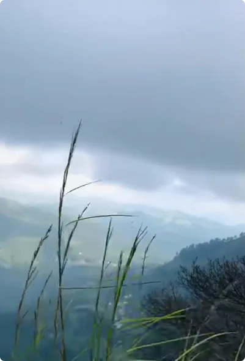

首先，我本身是一个修炼之人。跟埋头打坐、念经的那些人不一样，我不相信任何宗教。这些年游走四方，偶尔会遇到一两个真正的散修。

今天我要介绍的这位仙友，是一位在修为上已经能够修改命运的人。他跟社会其实已经没有什么牵连，所以身上的各种表象也不再固定受到命理的影响。
比如他的掌纹，这周是一个样，下周可能就变了，**手相已经是浮动的，一般的人类命运已经框不住他了。**
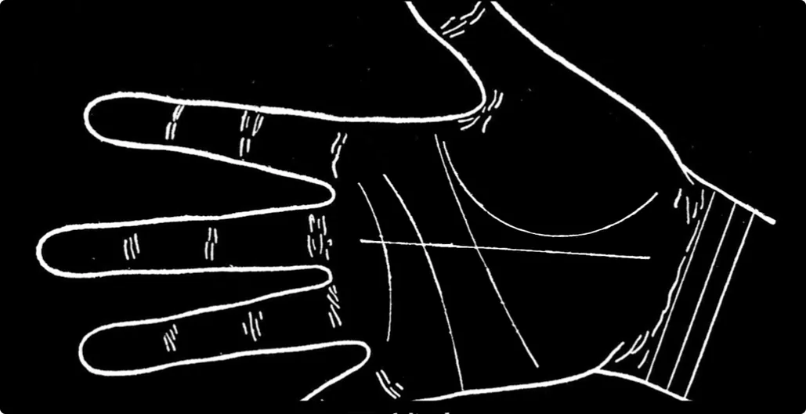

之所以今天想讲“命运”这个话题，主要是因为现在很多人过得非常苦，历经坎坷、饱经沧桑，开始想要了解：

> **修行到底能不能改变自己的命运？**

今天我便借他之口，给大家聊聊修改命运到底是怎么回事。

### 真正的修行人，为什么总是在山野之间

遇到这位仙友的契机，是我去年的川西之行。

因为真正的修行都是穿梭在山野之间，一定不是一直待在同一个地方。这一次碰巧我们在同一座山上，因为感知到了彼此气场都比较干净，所以便知道对方也是同道中人，随之多聊了几句。

他其实挺年轻的，也才三十来岁。

我问他：

> “当初是怎么想到走修炼这条路的呢？”

我本以为他会跟大多数选择修行的人一样，要么是因为人生太坎坷，要么是生来就感兴趣。

结果他说：

> _**“我不想再被人类命运系统给玩弄了。倘若人无法完全按照自己的意思活着，那做人就没有意义。”**_

他曾接触过各种命理大师，结果这些人除了让他**安于命**，都拿不出真正有用的办法。

再后来，他想明白了：

> **与其找这些解答人生的大师，不如自己想想，能跳出命运的办法是什么。**

---

## 2. 离开人类社会后，命理为什么也开始失效

他说，现在的他早已不掺和人类社会什么事了，没有家人，也没有牵挂，平时都是自己在山上过着自己的田园生活。

而且比人类更有灵性、智慧的生灵多的是，万物作伴，也不会觉得孤独。

正因为他和世人没什么联系，所以气场上也不会出现那种连接他人关系的**姻缘线**，身上也不会再出现跟他人、跟社会有关的相。算命先生看了，也要一头雾水。

出于好奇，我问他：

> “所以在真正踏入修炼门槛之前，你能想到跳出命运的办法是什么呢？”

他说，他曾拜读过很多古籍，但是很多都被后来者篡改得面目全非。

> _**真传一句话，假传万卷书。**_

本来写下真相，只需要薄薄一页纸。但是每个贪婪的人都想写下自己的见解，最后书本变得越来越厚，后人寻找真理的难度也越来越高。

他当初也是吃了很多亏，什么不该尝试的都尝试了，最后才悟出那些书里最重要、最关键的那句话：

> **善良和仁慈都是虚的，只有能量才是关键。**

---

## 3. 人为什么很难撼动命运：大能量始终带着小能量运转

紧接着他说，人不可撼动自己的命运，主要因为有**三重枷锁**。

### 第一重：人体的能量场，远小于周围的时空

这个世界的运转，是基于能量运作的。
大能量带动着小能量运转。

怎么运转的呢？抽象地理解，可以表现为五种形式：
- 向外的**生发**；
- 向内的**蕴藏**；
- 向上的**升华**；
- 向下的**浸润**；
- **静止不动**。

不同能量之间又构成了相生、相克的关系。所以当两种不同的能量相接触，就一定会产生催生或者消灭的作用。

而人体作为一个独立的能量场，自然要受周围时空中**比自己更大的能量**影响。

人有好运的时候，那是因为周围世界的能量与自己同频，自己得势；相反，外部能量与自己相克，而它的量级又比人大，自然就会给自己带来灾难。

问题就在于：

> _**人的能量场太小了，所以根本没有选择权，只能随波逐流。**_

---

## 4. 第二重枷锁：弱小的意识必须依附肉身，在轮回中反复重来

其实，人或者任何有灵性的动植物，本质上就是一团**有自我意识的能量**。

刚开始，能量弱的意识需要依附在有形的躯体上。
而那些能量强的意识，知道如何壮大自己的能量场，能够保护好自己，就不需要依附在有形的躯体上了。

所谓灵魂，就是专门为能量弱的意识打造的一副临时外壳，保证它在大多数情况下，不会被外部大环境彻底“干没了”。
肉身死了，可以轮回再来一次。
*一次又一次。*
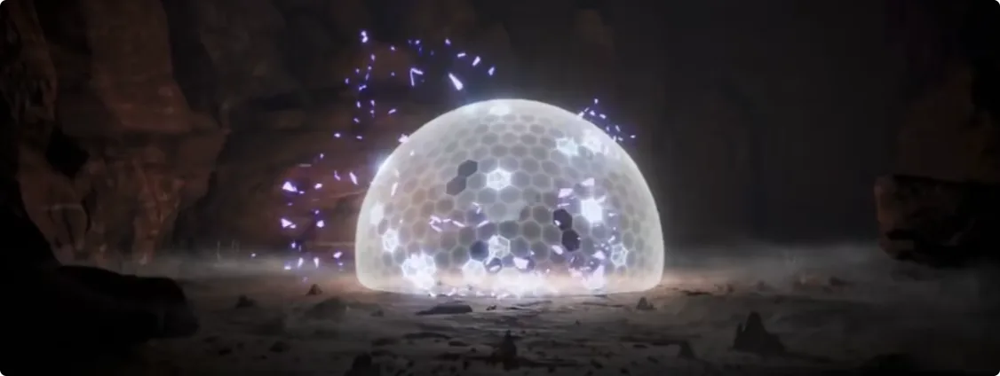

直到这个个体被外部的大世界反反复复摧残，吃尽了作为弱者的苦，终于知道什么才是真正重要的，开始学习：
1. **如何找到能量；**
2. **如何聚合能量；**
3. **如何完成自身能量体的成长。**

直到能够保护好无形的自己，不再是**象群里的蚂蚁**。
如此一来，人才有资格脱离肉身、灵魂和轮回之苦。

---

## 5. 第三重枷锁：你不仅活在自己的命运里，还活在众生的“大八音盒”中

其实，命运只是一种**能量因果的结算**。
如果把世界上大大小小的能量运作看成是八音盒的齿轮，那么这个世界就是：
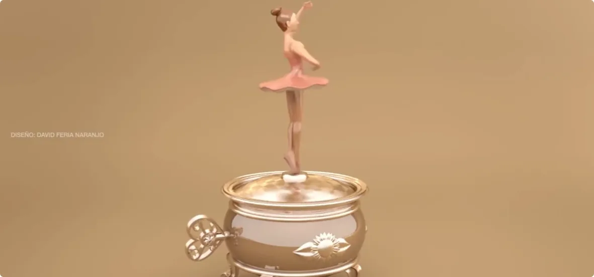

> **大八音盒套着小八音盒。**

谁转动了它，谁就必须等待齿轮转完，把音乐听完。
所谓的命数和运势，无非就是：

> **谁拨动了八音盒而已。**

各人有各业，众生有共业。
很多人觉得，自己不种因果就相安无事了。

可是：

> _**他都还在众生的大八音盒里，又怎么会听不到巨大的声响呢？**_

很多人看似在修行，其实根本没有提升自己**扛住大世界能量的能力**，只是自己骗自己罢了。

---

## 6. 为什么真正想改变命运的人，最后反而要放下对“命理”的执念

正是想到这一步，他才放下了对玄学的执念。
因为他知道，能带他找到真正能量的人，一定只有少数。
这个人可能在深山里，可能一辈子都遇不到，也可能必须有机缘才能相见。

但无论如何：

> _**寻找能量的办法，绝对不会出现在书上。**_

为什么？
如果获取能量的办法随随便便就公布于众，那岂不是什么人都能去要？

**错误的人拿到了正确的办法，无疑会打破自然能量的平衡。**

好在最后，仙缘还是给到了他。

他走上了仙道。

在踏入仙门之后，他也终于能够验证自己过去的想法。

现在的他，身上一半以上的寒气已经去除，再等最后的机缘。

以上就是这位仙友的故事。

---

## 7. 普通人真的可以修改命运吗：关键不是预测，而是让自己变强

有人会问：

> **“凡人真的能修改命运吗？真的能逃离这套系统吗？”**

如果你深受“命运”二字困扰，那你一定听过这么一句话：

> _**三分人为，七分天意。**_

冥冥之中，好像我们都听过这个道理。

**个人的主观意愿，仍然是个体发展的关键因素。**

一旦个体哪天领悟了真谛，学会了如何升级自己的能量，摆脱当前时空束缚，那就不必再受世间之苦了。
这句话，是不是逃离命运系统的那群前辈透露给大家的呢？
这是不是世界本源的意思呢？

### 命运像蛋壳，而人必须自己把它啄开

系统就好像**蛋壳**，个体则是里面的雏鸟。

如果一直待在壳里，蛋壳就是整个世界。
它限定了你能够看到什么、接触什么、去往哪里。
但真正的成长，不是等待别人从外面帮你把壳敲碎，而是：

> _**靠自己学会啄破蛋壳。**_

这是个体觉醒、成长的必经之路。
所以，普通人真正想改变命运，重点或许根本不是再找一个算命先生告诉自己未来会发生什么，而是要面对最后两个问题：

> **能修改命运的能量，到底在哪里找？**
> 
> **真正修成的那群少数人，又是怎么脱困的？**

## 常常擦肩而过且悄悄面试且你的仙人

## 【修仙者说】仙人为什么总与你擦肩而过？真正的机缘，先考的是人心

> **想修仙的人千千万，但如果真遇到仙人来考核你，你能第一眼就看出对方是仙人吗？**
> 
> 很多时候，仙人并不会以你想象中的样子出现。真正被考验的，也不是你嘴上有多虔诚，而是**机缘突然出现时，你的傲慢、贪念、分别心和求道之心究竟会如何反应。**

### 1. 仙人为什么不轻易度人：钟离权与吕洞宾的“三年之约”

#### 千年时间，只度得一个人

想修仙的人千千万，但如果真遇到仙人来考核你，你能第一眼就看出对方是仙人吗？
历史上常有仙人假扮素人，当面考核修行人的故事，而且往往只有一次机会，但基本都是以修行人**有眼不识泰山**告终。
为什么这么多修行人都认不出仙人？这些仙人又要考验修行人什么东西？

大家好，我是修炼者小烨。今天我从修仙者的角度，想给大家讲一下，为什么历代仙人都不轻易度修行人。哪怕是修了几十年的修行人，神仙也不给他机会。

我看了好些故事，其中吕洞宾吕祖的“**我宁度动物也不度人**”这段故事，比较充分地描写了仙人度人时的心思和考量。
而且现行的网络解读都不到位。所以我从门内汉的角度给大家解读一下：

> **神仙到底看重修行人什么？**

故事要从吕洞宾和他的师父钟离权的一次谈话说起来。

吕洞宾问师父：

> “请问师父，自成道开始到今天已经多少岁了？”

师父说：

> “从汉朝到宋朝算起来，也有1100岁了。”

吕洞宾继续问：

> “师父，这1100年时间里，已经引渡了几个人呢？”

师父说：

> “只引渡了你一个人。”

吕洞宾很惊讶：

> “为什么只度得弟子一个人呢？想来是咱们道门不肯大发慈悲，不愿度脱众生。师父，给我三年时间，中原这一块地方，我能度3000人出来兴咱道家。”

此话一出，把师父给听笑了。

师父说：

> “徒儿住口。世上众生不忠者多，不孝者广，不仁不义，众生如何做得了神仙？我让你去三年，但凡度得了一个人，那也是你的功德了。”

吕洞宾仍想一试，于是说：

> “今日拜辞师父，弟子云游去了。”

吕洞宾拜别师父后，一直在找可以度化之人。

---

### 2. 第一场考验：真正的机缘来了，你能不能先放下自己的身段

#### 殷氏妇人：几十年修道，却败在第一眼的分别心

这一天，吕洞宾在太虚顶上观望，远远地就看见一处地方有仙气，说明此处有缘分。于是他就来到这个地方，得知这里有一位三十多岁的妇人。此人是唐朝殷开山的后代，累世都在修道，所以积累了一些因果，也就是换得了一些缘分。

这时，吕祖化身成一个**脏兮兮的道人**，来到殷家的铺子旁。
他见到妇人身着道装，眉宇间有仙气，于是吕祖打算去引渡看看。
吕祖走过去让她**稽首**，也就是让妇人跪拜他。

妇人看了看眼前人，只是个脏兮兮的道人，就说：

> “先生，先过一招吧。”

吕祖发现妇人身上多了一股怒气，大叹可惜。

#### 一个“稽首”的暗示，其实已经把机缘摆到了眼前

在古代，稽首是一种最高的跪拜礼，要叩头至地，在祭祀中常用作跪拜天地，道教也不例外。
当时修道的人都应该知道，**稽首是拜天地、自然神灵、拜师父的意思。**
如果一个人修仙觉悟够高，那么突然遇见一个神秘的道人，让你用稽首礼跪拜他，那么应该能立马反应过来：

> **这是让你拜师。**

敢让自己行这么大礼的道人，能是普通来历吗？为什么仙人敢上来就这么做呢？因为真正重视修仙的人，脑子里早就模拟过很多遍了：

> 既然机缘难遇，如果哪天自己真遇到仙人，那么自己怎么分辨？
> 
> 对方会有什么暗示？
> 
> 自己要以什么态度争取机缘？

#### 真正求道的人，其实一直在等那个“暗示”

比如小烨，我曾经也求道无门。我已然觉得修仙需要获取清净能量，然而能量应当藏于自然，而真正的方法必然珍贵且不可轻传，只有真正的仙人才知道方法。
而我也清楚，偶遇真人的概率宛如大海捞针。虽有丧气摆烂的行为，但心底里时刻在等待机会，等待一个暗示。
所以，当真人突然出现，直奔主题，暗示我他有取自然能量之法，我瞬间知道：

> **机缘来了。**

心怀敬畏和感恩之心，立刻放下所有的身段，要牢牢抓住机会。

#### 她不是没有缘分，而是亲手把缘分推走了

不妨回过头来说这位妇人。
面对让她行拜天地之礼、行拜师之礼的道人，她的第一反应却是：

> **“你也配？”**

看见脏兮兮的道人要占她头上，所以心生怒气，要跟仙人先过过招，看看什么来历，说话这么豪横。
于是吕祖转头就走了，留下一张纸条，上面写道：

> *出山发愿度三千，寻遍人间未遇缘。*  
> *特地来时真有意，可怜骨相不逢仙。*

后面署名“口口仙座”。
妇人打开一看，**二口为吕**，知道是吕祖化身，急忙追出去。
然而吕祖已经化成一阵清风，不见了。

#### 机会不是“本来就属于你”的

吕祖这诗是写给妇人的。
前两句看似跟妇人没有直接关系，其实也是说给妇人听的。
啥意思呢？
就是：

> **我吕洞宾出山时发愿要度人，这是缘由，所以我才来给你机会，不是你本来就该有机会。有没有你，都无所谓，明白不？**

所以这诗也不仅仅是写给妇人的，也是写给所有听到这个故事的修行人的。
**不要以为哪个机会一定是给你的。**
不要以为老天自有安排，给你定好闹钟，总有一天会轮到你修仙。

---

### 3. 第二场考验：嘴上敬仙，不代表你真的认得仙

#### 王惟善请两千道士给吕祖庆生

吕祖回到太虚顶继续观望。
看见有人驾着马跑过来，送信的符官从信筒里取出一封信递给他。
吕祖接过信一看，原来是东京开封府的一位当差，名叫**王惟善**，信奉道教，想在这月十四日邀请2000个道士，恭为纯阳真人庆诞生辰，请上仙来做客。
纯阳真人就是对吕祖的尊称。
吕祖看完信后，自言自语道：

> “我倒是忘了，马上就到我的生日了。”

那符官说道：

> “小圣曾到终南山上见老师傅，说上仙在中原地带，特寻到此，才见上仙。”

吕祖知道符官送信辛苦，说道：

> “有劳心力，远来送信。”

然后从背后的金框里取出了一个鲜果递给符官。

#### 他请的是仙人，却从没想过仙人真的会来

吕祖随后来到东京无人烟处，化身成一个**又脏又丑的先生**，一瘸一拐地来到王惟善家中。
吕祖见王惟善眉宇间有一些仙气，有求道之心，但是机缘未到，于是打算用神通来暗示他、点化他。
要注意了。
吕祖没有一上来就让他稽首，而是选择**先显点本事说服他**，也算是照顾王惟善当前的身份。

吃过斋后，吕祖就对王惟善说：

> “贫道善水墨画，请取一匹绢来，我作画像一幅。”

只见吕祖把墨水往绢上一泼，把绢弄脏了。

王惟善见了大怒：

> “这赖道士敢戏弄我，给我拿下。”

吕祖见王惟善大怒，转身就走了。
众人赶来时，吕祖已化作清风而去。
从空中飘下一张纸条，众人拿起来看，上面写道：

> *斋道欲求仙骨，今至我来不识。*  
> *要知贫道姓名，但看卷画端的。*

王惟善取那绢一看，原来绢上是惟妙惟肖的吕祖画像，才知道原来先生是神仙，**悔之莫及。**

#### 真正暴露他的，是一匹绢和自己的架子

为什么吕祖要去考验王惟善呢？
因为王惟善专门请了2000人给吕祖庆生，可见也是有心了。
而王惟善呢，却是个**没有心理准备的人**。
明明派了人去给吕祖送信，也没想过仙人可能会藏在人群中，没想过仙人会来考核他，所以也说他机缘不到。
吕祖也打算破格露两手，本想给他看看神通。
但仅仅只是要了他一匹绢，王惟善就舍不得了，把绢看得更重要。
其次就是他放不下身段。
连吕祖都放下身段来，要破格给他显神通，结果：

> **他的架子比仙人还大。**

#### 为什么身份越高的人，反而越容易“有眼不识泰山”

在王惟善这种人眼中，始终觉得仙人就是光鲜亮丽的，外表和思想看起来都要比他厉害，不然怎么配叫仙人呢？
这些人**提前预设了仙人的形象**，所以不会想到，道可能会以朴素的方式出现。
这也是王惟善这种人的通病。
很多人走得越高，比如学历高、身份地位高，就觉得自己很牛了，能接近他的人也得是光鲜亮丽的。
虽然他们也知道“人外有人，山外有山”的道理，但身处高处的人往往很难做到没有分别心，容易：

> **有眼不识泰山。**

---

### 4. 第三场考验：不贪只是第一关，得到更多以后才真正见本心

#### 吕洞宾化身卖油翁，只考一个最简单的问题

有一次，吕祖扮成一个卖油翁，在街上寻找可度之人。
得度的标准很简单：

> **来买油的人，买油时不要求多添点油，就度化他。**

然而，大多数买油的人都想多要点油。
只有一个老妇人来买油时，买多少就是多少，从来不要求多添。

吕祖问老妇人：

> “凡是买油的人都想多要点，你怎么不要呢？”

老妇人说：

> **“你卖油也不容易，怎能多要呢？”**

说完，老妇人还拿来酒筹谢卖油翁。
于是吕祖有心要度化她。

#### 从“不贪”到突然得到大量财富

吕祖在老妇人院子的井中投了几粒米，并告诉老妇人：

> 卖井水可以发财。

说完吕祖就走了。
老妇人一看，井中的水都变成了酒，于是卖了一年，赚了很多钱。
一年后，吕祖来到老妇人家中。
碰巧老妇人外出，只有她儿子在家。

吕祖就问妇人的儿子：

> “这几年酒卖得如何？”

他儿子说：

> “好是好，可惜没有喂猪的酒糟啊。”

说完这话，吕祖哀叹道：

> **“人心贪婪到这种程度了。”**

于是，他将井水中的米取了出来，离开了老妇人家。
这个故事到这儿就结束了，因为**机缘已了**。
后面老妇人回来什么想法都不重要了。

#### 为什么“不多要一点”，已经能筛掉绝大多数人

吕祖这次度人的标准很简单：

> **不贪即可。**

不贪代表这个人明白**付出和收获对等**的道理。
虽天道损有余而补不足，但世人都爱以私为贪婪的借口。
都认为自己拿得少了：

> 天地这么大，自己多拿点怎么了？是应该的。

却不想：

> **天道再大，也填不满人心的贪婪。**

这种人要度成仙上去，岂不是要吃遍三界？
所以，能不贪的人也算是明事理了。

#### 真正的考验，是突然给你更多以后，你还会不会觉得“不够”

于是吕祖想再考验考验妇人。
他故意多给了妇人一些福报，想用财富来诱惑她，看看她得到更多的时候，本心会不会变。
最后发现妇人的孩子不仅不懂感恩，还嫌不够多，说明老妇人也变心了。
平白无故得这么多，本该有愧，要懂得付出，而非再索取。

**这点事理都不明，她儿子自然也不明。**

于是吕祖收回了福报。

---

### 5. 第四场考验：你真正想要的，到底是修仙还是富贵

#### 辛氏酒馆：吕祖喝了半年酒，一文钱都没有付

有一次，吕祖游历到武昌一带，在辛氏酒馆开怀大饮。
饮了近半年时间，也未支付一文钱，辛氏也不讨要。

一天，吕祖对辛氏说：

> “我欠了你酒钱，一直未能支付，我为你画只仙鹤吧。凡是有人到这里饮酒，你就可以呼叫仙鹤，它会翩翩起舞，我以此来报答你。数年之内，你可以变得非常富有。”

于是吕祖在墙上画了一只仙鹤，然后辞别了。
自此之后，只要有人来酒馆饮酒，辛氏就呼叫仙鹤跳舞。
远近的客人都慕名而来。
多年之后，辛氏就成了当地有名的财主。

#### 仙鹤已经显灵了，但辛氏看到的仍然只有生意

一天，吕祖来看辛氏。

辛氏一见到吕祖，连忙拜见。
吕祖问他生意如何，辛氏说：

> “富足有余。”

于是吕祖三弄竹笛。
仙鹤就从墙壁上飞了出来，飞至吕祖跟前。
吕祖乘着仙鹤离去了。

辛氏甚异此事，于是在吕祖乘鹤处建一楼，称之为**黄鹤楼**。
后人题诗曰：

> 昔人已乘黄鹤去，此地空余黄鹤楼。  
> 黄鹤一去不复返，白云千载空悠悠。

至此，仙人的考验又结束了。
甚至对于辛氏来说，自己都不知道有这回事。

#### 仙人给了两个选择：修仙，还是发财

辛氏是做生意的，为人大方，不拘泥小事，舍得付出。
而吕祖也不是白要他的东西。
于是就给了他两个选择：

> **是想修仙，还是想赚钱？**

若想修仙，那么见到仙鹤舞动那一刻，就应该知道：

> **眼前的酒客是仙人。**

不应该用仙鹤来赚钱，浪费自己的福报。
然而辛氏只想着赚钱，哪管修不修仙的。

#### 生活越舒服，很多人的求道心反而越淡

事实上，大部分生活富足之人心里都没有求道之心，哪怕只是生活条件好一点的人。
你问他修仙吗？
他会回你：

> “我不知道有什么好处，有好处我可以试试。”
> 
> “修仙苦吗？”
> 
> “干嘛没苦找苦吃？”

所以仙人从你身边走掉的时候，不是他不慈悲，而是：

> **你不够格。**

你自己都不想要，还想怪谁呢？
一个不想考清华北大的人，天天想着被保送清华北大，这不是说笑吗？

---

### 6. 三年未度一人：为什么最后真正被引渡的，却是一只仙鹤

#### 吕洞宾空手而归

三年之后，吕洞宾空手而归。
可见人心不古，世人之难度化。
钟离师父呵呵大笑：

> “徒弟归来，不知度得几人归？”

吕洞宾惭愧地告知无度一人，叹于世人难度。

他说：

> **“我宁度动物也不度人。”**

#### 那个真正被吕祖引渡的“动物”是谁

吕祖说宁度动物也不度人，那这个动物是谁呢？
就是墙壁上跳舞的那只**仙鹤**。
吕祖让一只鹤灵住进里面，由鹤灵帮他还一份人情。
吕祖不仅是在考验辛氏，也是在引渡仙鹤。

仙鹤得缘后，对吕祖安排的活毫无怨言。
没有罢工，没有休息，没有喊累，也没有要酬劳。
甚至在整个故事中，它都没有名字，就叫：

> **仙鹤。**

为什么？因为仙鹤知道自己在天地宇宙面前、在众神仙面前什么也不算。
仙鹤深知自己的渺小，深知机缘来之不易，所以：

> **老老实实从小事做起，争取更大的缘分。**

最终，在吕祖云游的三年里，只有仙鹤成功被引渡。

---

### 7. 为什么动物灵反而更容易抓住修行机缘

#### 少一点贪念，反而更容易认准一条路走到底

事实上，大多数神仙的元神都是动物灵。
九天玄女是玄鸟，张果老是蝙蝠。
或者说，能成仙成佛的有缘人，大多数都是动物元神转来的。
因为动物没那么多贪念，没那么多放不下的事情，没那么多算计。
心思比较纯粹。

**认准了修行、修炼、修仙，就会朝着这个目标走下去。**

#### 看清弱肉强食之后，更知道为什么必须修炼

大多数动物开悟后，看清了弱肉强食的残酷，知道唯有修炼才能脱离苦境。
这种元神心性就比较稳。
哪怕之后转世成人，哪怕富贵了、得势了，心底里还是想着要修炼的。
反而在人间，人道虽苦，很多人苦了也想修行。
但是人一旦享福，就觉得：

> **修行可有可无了。**

甚至要远离修行，生怕不会享受荣华富贵了。
所以历史上记载有人得道飞升，那大概率都是动物灵转来的。
大家也别嫉妒。
人家之前可能修了几千、几万年，还是比纯人元神够格的。

---

### 8. 仙人真正“面试”的，从来不是你的身份

从殷氏妇人，到王惟善，再到卖油故事里的老妇人和辛氏，其实一次次出现的，都是同一种问题：

**当真正的机缘不以你期待的样子出现时，你还能不能认出来？**

一个脏兮兮的道人，让你跪拜。
一匹绢，被一个陌生道人“毁掉”。
平白无故多出来的一点油、一井美酒。
一只能够从墙上下来跳舞的仙鹤。
机会其实已经摆到眼前。

可是人的：

**身份、面子、分别心、贪念、利益和享乐，往往比求道之心反应得更快。**

而真正得到机缘的仙鹤，没有身份，没有名字，也没有问“我能得到什么”。
它只是知道：

> **机缘来之不易。**
> 
> **天地之间，自己什么也不算。**
> 
> **先把眼前该做的事情做好。**

我是修炼者小烨，我们下期再见。

## 张道陵三次得法背后的故事

> **为什么是张道陵？为什么他成功了？他到底哪一步跟其他修行人不一样？真正的修仙契机，又出现在什么时候？**

## 1. 为什么是张道陵：真正的仙缘，首先要看一个人的根底

### 家庭、知识与修仙环境

大家好，我是修炼者小烨。今天之所以要来聊一位神仙，是因为很多观众朋友提出，小烨说的东西无凭无据，那么今天我们就来读一读古籍，看看古代那些颇有影响力的仙人，到底是怎么修仙的。

为什么是他？为什么他成功了？哪一步跟其他修行人不一样了？背后的契机是什么？常人怎么才能把握到机缘呢？

今天我们来聊的神仙是**张道陵**，也称张天师，是道教的祖师爷。相传2000年前，他在蜀地降妖除魔，降服当地六天大魔、众多鬼神，救济无数百姓，最后携弟子白日飞升。
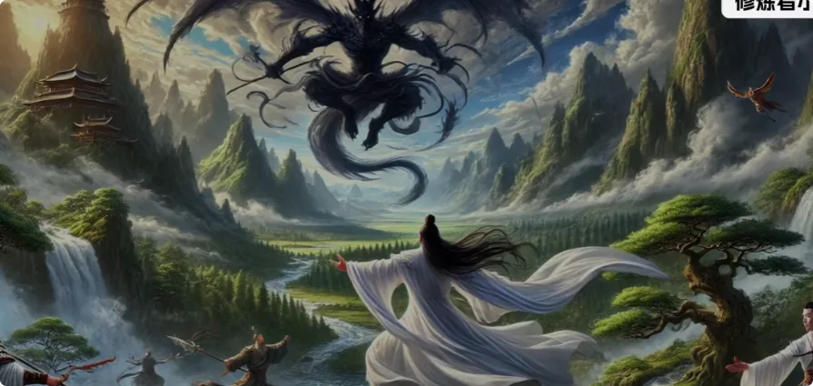

关于张天师的事迹，我们先来看一下相关资料的介绍。

张道陵是东汉人，被视为天师道的创始者，故又称**张天师**。相传张道陵为西汉开国功臣张良的后代，他的父亲叫张大顺，好神仙之术，生下儿子后取名为“陵”，希望将来能够追随先祖，远离尘世，登临成仙。

我们先看一下张天师的社会地位和家庭条件：他生在功臣后人的家庭，父亲又好神仙之术，说明家庭条件放在古代也是衣食无忧的情况下，才有闲心去想神仙之术。如果生活条件差，人都忙于生计，又怎会想修仙呢？而且父亲还支持儿子修仙，可见从家庭上就是**精神和物质的双重支持**。

张道陵自幼聪慧过人，七岁便读通《道德经》，为太学书生时博通五经，天文地理、河洛谶纬之书无不通晓，从其学者千余人。相关传统资料中确有“七岁通《道德经》”“博通五经、河洛谶纬”等说法。([黄老,玄黄道家](https://huanglaodao.cn/zhangtianshi.html?utm_source=chatgpt.com "张天师 | 黄老,玄黄道家"))

### 学了这么多知识，却仍觉得解决不了生死

但张道陵常常叹息：

> _**“此无益于年命。”**_

因为对于他来说，如何解决生死问题，如何让自己永恒存续，才是真正有意义的事情。

所以他不痴迷于解读经书，而是更注重**实践**。他虽然读通了大量知识，又有这么多学徒，却并没有因此感到满足，也没有感到自豪，反而弃儒改学长生之道。

相传汉章帝、汉和帝先后征召其为太傅、冀县侯等职，张道陵均辞而不就。([黄老,玄黄道家](https://huanglaodao.cn/zhangtianshi.html?utm_source=chatgpt.com "张天师 | 黄老,玄黄道家"))

张天师家庭条件好，又有要职、有身份地位，钱也是不缺的，但是他仍然不为名利所动。

**可见他修仙的心意是多么坚定。**

---

## 2. 不在书里死磕：古仙人为什么一定要云游名山大川

### 辞官之后，他真正开始“找路”

辞官之后，张道陵开始云游名山大川、访道求仙。

云锦山山清水秀，景色清幽，为古仙人栖息之所，张道陵就在山上结庐而居，并筑坛炼丹。传说三年之后，神丹成、龙虎出现，因此云锦山后来又被称为**龙虎山**。

也就是说，张天师为了修炼是**走遍名山大川的**。

他没有坐在原地死磕书本上的知识，更没有从什么“本我”中内寻修行宝典。另一方面，他自身还要有好的经济基础，才能支撑他云游山川，尤其是在古代那种环境。

张道陵在山上结庐而居，并筑坛炼丹。传说三年后神丹炼成，龙虎出现。

讲到这里，就是大家最扑朔迷离的地方了。我们常闻修仙要练这个、练那个，那到底怎么练？**方法到底是什么？**

### 古籍每到真正的方法，往往就一笔带过

每每遇到古籍讲到修仙方法，都是一笔带过。
要么就是一些人拿着锅搞了一些化学反应，终究没有说清楚，这个“丹”到底是怎么炼的。
前面我们说过，张天师读遍现有的书籍，都没有找到长生的方法。
那他后来是怎么知道修仙方法的呢？
这里我们先按下不表，稍后再用《神仙传·张道陵篇》做补充。

还有一个值得关注的地方：

> **张道陵在山上结庐而居，着重在于一个“山”字。**

何为仙？

>**人也有山，才能成仙；无山，则不成。**

这是绝大多数修行人不知道的地方。

---

## 3. 炼成神丹之后为什么还要入蜀：真正重要的不是“山”，而是山中的什么

时年张道陵约六十岁，听闻蜀中民风淳厚、可以教化，便移居四川鹤鸣山。

入川之后，他先后居阳平山、鹤鸣山，还到了西城山、葛溃山、秦中山、昌利山、涌泉山、真都山、北平山、青城山等一系列山中修炼。相关传说资料也保存了这一串入蜀后的山岳行迹。([新浪](https://www.sina.cn/news/detail/5272367749137855.html?utm_source=chatgpt.com "张道陵（34-156），字辅汉，原名张陵，东汉丰县（今江苏徐州丰县）人。道教创始人。因其最初创立的五斗米道又称天师道，故又称张天师。相传为西汉开国功臣张良的第八世孙，汉光武建武十年正月十五日生于丰县阿房村。张道陵的父亲叫张大顺，好神仙之术，自称“桐柏真人”，生下儿子，即取名为“陵”， ​_新浪新闻"))

此时的张天师已经炼成神丹，却还留在人间。

**为什么？他在等什么呢？**

他听闻四川人民风淳厚，可以教化，便移居四川，又跑遍了四川各地的山。
他的目的是什么呢？
还是先按下不表。

### 太上老君降临：为什么偏偏把“盟威之道”传给张道陵

相传汉安元年（142年），太上老君降临蜀地，传授张天师正一盟威之道，使其扫除妖魔、救护生民。张天师由此建立天师道的教团体系，尊老子为教祖，以道为最高信仰。不同道教文献对于具体日期和授法内容存在不同记载，但“老君授法”“正一盟威”是相关传统的核心叙事。([道教网](https://taoist.org.cn/showInfoContent.do?id=1421&p=%27p%27&utm_source=chatgpt.com "中国道教协会"))

这里的“盟威”是什么呢？
指的是**盟约的神威**。
也就是太上老君与张天师订立盟约，张天师及其正一派弟子，可以借助这个盟约施展神力、扫除妖魔。
但这里有几个值得注意的地方。

1. **为什么太上老君要亲自传授张天师本领？**   

难道只是因为张天师发心善良，想教化百姓，就可以得到大神亲授吗？

显然不是。

有这么简单的话，地球上早就出现一大群天师了。因为心系众生的人多了去了，既然不是，那一定还有别的不为人知的原因。

2. **是不是正一派的弟子，都能使用盟威来施展神力？**

显然也不是。
如果正一派弟子都能凭一张符咒施展神威，有这个影响力，正一派早该是目前世界上最强大的宗教。
所以说，盟约之下罩着的人，到底是**张天师亲自考验过的弟子**，还是后来自己认张天师做师父的弟子，两者有很大区别。
一个是师父亲自考验过的徒弟，一个是后来的仰慕者，自认拜了师父。

> **在这世上，单方面认同没有什么意义。**

建议修行人都好好想想这个问题。

3. **为什么称作“正一”？**

既然寻仙问道者都求真，那就不必分什么叫道、什么叫法。
**万法都应该归一，才能称得上真。因为一就是一，真就是真。**
没有必要分出这么多支派。
但正所谓：

> _**“不尚贤，使民不争。”**_

尽管张天师称呼自己的理论为“正一”，大众终究还是逃不过人的规律，后来依旧分出了许多不同派系。
这也是为何张天师又尊《道德经》为重要经典。

---

## 4. 古籍为什么看起来什么都讲了，却偏偏看不懂关键

相传156年，张天师升仙而去，时年123岁。
以上就是传统资料中对于张道陵事迹的大致介绍。
跟其他神话、神仙故事一样，通篇讲得非常顺畅，但是细细品味，又让人读不懂。
为什么呢？
**因为讲的都很浅显，没有讲背后的因果。**

比如：

- 为什么是他？
- 为什么他成功了？
- 哪一步跟其他修行人不一样？
- 背后的契机是什么？
- 常人怎么才能把握到机缘？

你看，通通没有讲。

> **因为每个世人都是局外人。只要局内人不透露关键信息，局外人再聪明，也读不懂其中真正的含义。**

那接下来，小烨结合《神仙传·张道陵篇》，给大家解读一下背后的修行契机。

---

## 5. 第一次得法：真正放下名利以后，仙人才第一次把方法给他

### 五十岁退身修道：第一次考验是你到底舍不舍得

《神仙传》中首先交代了一段背景：

> _**“初天师值中国纷乱，在位者多危，退耕于余杭。又汉政陵迟，赋敛无度，难以自安，虽聚徒教授，而文道凋丧，不足以拯危佐世。陵年五十方退身修道，十年之间已成道矣。”**_ ([汉典](https://ctext.org/shen-xian-zhuan/5/zhangdaoling/zhs?utm_source=chatgpt.com "神仙傳 : 卷五 : 張道陵 - 中國哲學書電子化計劃"))

世道逐渐凋零，教书也不能帮助世人。
张道陵为世人着想，却发现自己做不了什么，反而退隐修仙去了。
这里体现了两个东西：

1. **善良、正派，有责任心，也有定力。** 明明自身条件很好，但他不是那种一生追求名利的利己主义者。他看不惯世间为名为利，反而时时为世人着想。
2. **始终对修仙有追求。** 即便已经过了半辈子，看了这么多书，他也没有像世人那样，一定要“看开人生”，平静地面对死亡。

换句话说：

> **他始终没有放弃自己的生命。**

一般来说，谁有这两种品性作为根底，那前世一定是一个有修行根底的人。

因为只有有这样的根底，才能让人在尘世中始终相信修仙是存在的，内心深处渴望找到修行的出路；同时凭借生生世世对道德的践行，才能让人在荒诞的尘世中不沉沦。

换而言之，张道陵本身就来历不凡。

**他本身就是有缘人，有前因后果地来到这个世界。**

这也是为什么他前后有三次得到仙人指引，教他如何正确修仙。

### 用行动证明求道以后，才得到《黄帝九鼎丹经》

第一次指引，就发生在张道陵辞去官职、正式开始寻仙问道以后。

《神仙传》记载：

> _**“遂学长生之道，得黄帝九鼎丹经，修炼于繁阳山，丹成服之，能坐在立亡，渐渐复少。”**_ ([汉典](https://ctext.org/shen-xian-zhuan/5/zhangdaoling/zhs?utm_source=chatgpt.com "神仙傳 : 卷五 : 張道陵 - 中國哲學書電子化計劃"))

当他用实实在在的行动证明自己，**放下了名利，证明自己真的要修行以后，他才得到了丹经。**
在此之前，张道陵也不会知道自己到底有没有仙缘。
因为他得亲自迈过心里这道坎，向神灵证明自己的品性和觉悟。

> **这其实就是一种考验。**

很多人说想修仙，其实根本放不下名利。
如果修行人放不下名利，那将来一定会觊觎不属于自己的东西，因贪婪而带来祸端。
再说说这个“秘法”。
肯定不是市面上谁都能手抄、复刻的一段文字方法。

**真正的方法，都要经历过考验才给。**

市面上的修行人又没经历过考验，怎会通过一本书，就拿到不属于自己的东西呢？
哪怕张道陵拿到这个秘法，也只是让他进入了新的修炼阶段。
神灵并没有一上来，就把修仙的终极秘诀全部教给他。
那什么时候再教给他新的秘诀呢？

**当张道陵通过第二次考验的时候。**

---

## 6. 第二次得法：不是只会“放下”，还要懂得入世渡人

### “闻蜀民朴素可教化，且多名山”

《神仙传》中还有一段非常关键的记载：

> _**“闻蜀民朴素可教化，且多名山，乃将弟子入蜀，于鹤鸣山隐居。”**_
> 
> _**“后于万山石室中，得隐书秘文及制命山岳众神之术，行之有验。”**_ ([汉典](https://ctext.org/shen-xian-zhuan/5/zhangdaoling/zhs?utm_source=chatgpt.com "神仙傳 : 卷五 : 張道陵 - 中國哲學書電子化計劃"))

这两句话，可谓是道出了所有修仙古籍中最关键、最宝贵的契机。
何为仙？
**人和山也。**

为何要巡山呢？

关键就写在这句话里。
张道陵在山中获得了“制命山岳众神之术”，并且：

> _**“行之有验。”**_

小烨来翻译一下，就是在山上获得了山岳众神的帮助，并且是可以亲自验证的。
而且要看清楚：

> **是在万山之中，而非只在某一座山。**

这也是为什么古仙人必须要游历这么多山川。
**没有自然能量和神灵的相助，光凭肉体凡胎，怎么修得了性命呢？**

### 第二个考验：既要渡己，也要渡人

那张道陵为什么能学到这个秘诀呢？
因为他听闻蜀人朴素，亲自前往巴蜀地区教化。
结合修仙之前张道陵“退身修道”的经历，这里说明张道陵又再度选择了**入世渡人**。

什么原因呢？

如果说修仙的第一个考验，是懂得：

> **放下人间名利。**

那第二个考验便是懂得：

> **渡人，也渡己。**

古往今来，每一位中国神仙，都是做了利众的事情，才被大神封作新的神仙。这些事迹也供凡人当榜样学习。
这也恰好说明，为什么想修仙的人大多道德感、责任感、善心都比较重。
因为在过往修炼的岁月里，天地都在迫使大家践行道德，维持天地众生的秩序，道德感早已经成为他们的天性，哪怕转世成人也不可抹除。

但：

> **只有道德感仍然是不够的。**

**修行人论迹，不论心。**

如何真正践行道德，才是关键。

---

## 7. 第三次得法：已经能飞升了，却因为“没有功德”选择留下

### 神丹已成，却不敢服

我们接着看《神仙传》：

> _**“既遇老君，遂于隐居之所备药物，依法修炼，三年丹成，未敢服饵。”**_
> 
> _**“神丹已成，若服之，当冲天为真人，然未有大功于世，须为国家除害兴利，以济民庶，然后服丹即轻举，臣事三境，庶无愧焉。”**_ ([汉典](https://ctext.org/shen-xian-zhuan/5/zhangdaoling/zhs?utm_source=chatgpt.com "神仙傳 : 卷五 : 張道陵 - 中國哲學書電子化計劃"))

这里道出了修仙中另一个关键：

> **功德。**

在这一阶段，张道陵已经可以成仙了，但他仍旧没有直接服下神丹飞升。
因为如果没有功德升天，也不会是大神仙。
常言：

> _**一分付出，一分收获。**_

想谋多大的成绩，就要有多大的觉悟。
也因此，张道陵才迎来了**第三次仙人指引**。

### 真正用于“降魔利民”的力量，此时才出现

《神仙传》后面记载：

> _**“老君寻遣清和玉女，教以吐纳清和之法。修行千日，能内见五藏，外集外神，乃行三步九迹，交乾履斗，随罡所指，以摄精邪，战六天魔鬼，夺二十四治，改为福庭，名之化宇，降其帅为阴官。”**_
> 
> _**“先时，蜀中魔鬼数万，白昼为市，擅行疫疠，生民久罹其害。自六天大魔推伏之后，陵斥其鬼众，散处西北不毛之地……”**_ ([汉典](https://ctext.org/shen-xian-zhuan/5/zhangdaoling/zhs?utm_source=chatgpt.com "神仙傳 : 卷五 : 張道陵 - 中國哲學書電子化計劃"))

当时的巴蜀地区，相传魔鬼数万，不分白天黑夜地横行于世，擅自散播疫疠，百姓深受其害。
于是太上老君遣清和玉女，传授张道陵新的功法。
这套功法让张道陵拥有了强大的神力，能够战六天魔鬼，夺回二十四治，改为福庭，并招降其中的头领，令其成为阴官。
随后，又将剩余鬼众赶到西北不毛之地。

至此，张天师立下功德，才飞升离去。

---

## 8. 三次得法背后的共同规律：每一次“秘诀”都出现在考验之后

以上就是《神仙传·张道陵篇》的故事。

从这个故事中我们可以看到，张道陵前后三次得到了修仙的**真法**。

但每一次，都出现在他经历某一种考验、有了新的觉悟，并且**付出行动证明以后**。

可以归纳为：

1. **第一次：放下名利，真正开始求道。**  
    他以行动证明自己真的想修仙，于是得到《黄帝九鼎丹经》。
2. **第二次：不只渡己，还重新入世渡人。**  
    他进入蜀地、游历群山，在山岳之间获得新的修炼方法。
3. **第三次：已有飞升之能，却不急于只利自身。**  
    他认为自己尚无大功于世，因此留下来除害兴利、济民立功，之后才得到更高一层的法。

> **每一次新的方法，都不是提前发给他的，而是等他先通过前面的考验之后才出现。**

很多人问：
“何为修炼的真正方法？”
“能不能发一份？”
“为什么不直说？”
好像方法就是一串文字、一份PPT。
如果连对待真法该有的态度都没有，又怎么可能触摸得到呢？

无论你来历如何、根底如何，先问问自己：
- 目前接受了什么考验？
- 付出了什么行动？
- 自己当前的品性能不能接得住珍贵之物？

> **有付出，才能有收获。**

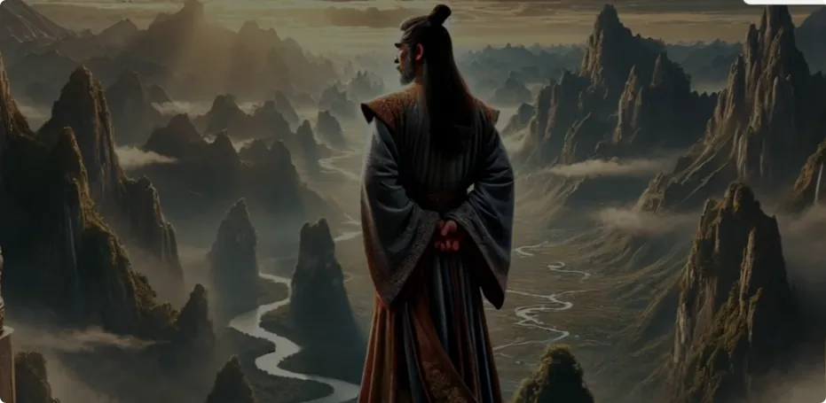

连道教创始人张天师，都要求入道者以“五斗米”等形式参与教团。
**在古籍里，从来没有“先给人好处，靠诱惑劝别人来修仙”的逻辑。**
需要靠诱惑才肯行动，根本不是修仙之道。

---

## 9. 为什么普通人读不懂修仙古籍：答案从来没有完整写在纸面上

> **同盟求我，非我求同盟。**

小烨常跟大家说，看古书意义不大。
为什么？
因为你不是局中人。
是人都不是局中人，又怎么知道哪些信息是真正有用的信息，哪些信息是刻意修饰过的无效信息呢？
古代成仙成佛者，好比已经考过高考的人。
**是不会把答案原封不动地留给众人照抄的。**

另外，考卷也不是一成不变的。
古往今来：

> _**仙佛写一半，留一半；妖魔可以顺从世人的期待，再写完另一半。**_

只有当你接触过真正的修行，你才有分辨力。
你才知道哪些是有效的信息，哪些是误导的信息。

**届时，你才真正拥有读懂古书的能力。**

## 凡人弑神记_历史上被世人处死的神

2000年前，一位下凡的神被钉上了十字架。刑场周围的人都在喊：“他该死！除掉他！”
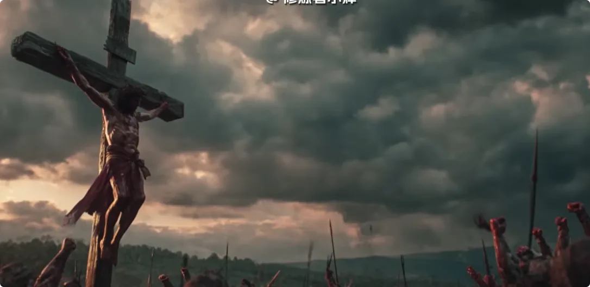

有的人用拳头打他，有的人向他吐口水，士兵鞭打他、羞辱他，宗教领袖满是轻蔑和讥讽。除了他在人间的母亲、他最爱的一位门徒以及一些妇女，其他的人要么看戏，要么在嘲弄他。
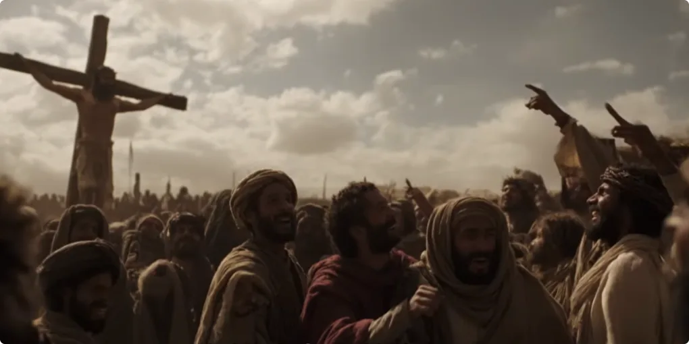

他们说：“你既说你是神的人，那你可以救你自己吧？你的神会来救你吧？”
最后，他在最大化的痛苦中断气。
就当人们以为自己得逞，除掉了这个口出狂言的异端时，忽然大地震颤了，耶路撒冷的圣殿裂开，死去的圣徒从坟墓中苏醒。

人们先是感到惊恐，接着是巨大的悔恨，因为他们终于意识到一件可怕的事情：十字架上那位真的是神委派的人，然而他刚刚被自己亲手处决了。

这个人就是耶稣，一位爱人的神祇。

大家好，我是修炼者小烨。

由于上一期视频在国内无法审核通过，所以本期我需要把个别用词替换掉，从AI视觉审核和AI音频审核的角度全面替换，希望海内外朋友相互体谅。
- 某人，我们尊称为“老人家”。
- 某经，我们说成“圣书”。
- 某音，我们说成“浮生”。
- 某都，我们说成“京都”。
- 某节日，我们说成“安喜日”。

今天我们接着上一期，继续讲圣书中关于修仙的事情。本期我们既讲人性如何使自身覆灭，也讲凡人想要飞升的本质。

## 老人家下世替凡人赎罪
### 下世的原因: 
我们先来说老人家下凡的原因。
太初有道，世间万物都由道创造。道有自己的位格，道和神都是祂的一个位格。没错，就是东方人认为的那个“道”。
然而，世间常有人把控着对道和神的解释权，把控着经书律法的解释权，以此约束和残害世人，甚至挑唆世人背道而行，导致世人最后却不再信道和神了。

这件事严重到什么地步呢？

经上是这么说的：世道黑暗污秽，道的光照进屋内，使光都有罪。凡背道作恶的人都怕正道的光，因为他们明白这道光会要了他们的性命。相反，那些行道之人却期待着道的光辉，期待正道的降临。
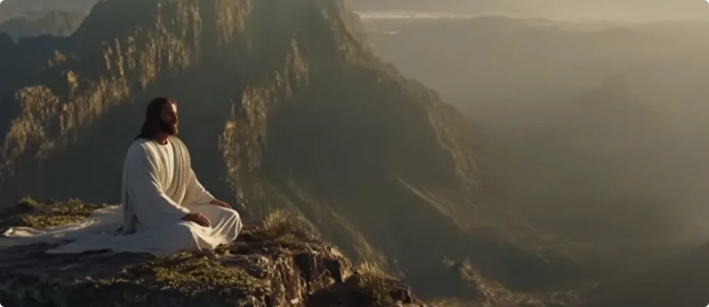
因此，老人家就是来给信道者一个希望，也称之为浮生，同时也给那些背道者一个悔改的期限。
总的来说，老人家在2000年前下凡的主要目的，就是**替天传道，为道铺路**。

### 下世的计划: 
神的计划是这样子的：
为了让世人看清楚自身的弱点和罪恶，也为了让神看见世人剩余的良善面，论证世人尚且可救，神委派老人家以凡人之躯入局，任凭世人借由自身的恶将他送上十字架。
直到他被世人杀死，神再显神迹，将其复活，向世人证明他本是神的人，是道委派的光，让世人惊觉是自己亲手葬送道的圣者，以此来让世人看清自己的恶行并悔过，重新信道。
最后，道神通过看见人们对信道的践行，来评估人往后需承担的罪的体量。
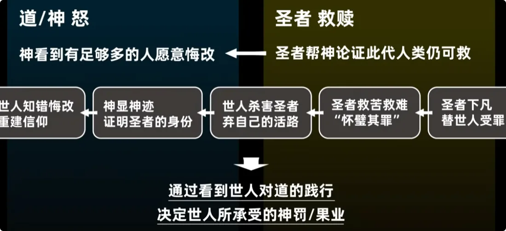

所以，老人家在其中的作用，就是以自身的死换取人们对道神的重新信任，以减免人类整体的罪。也就是老人家是献祭给神的羔羊，赎世人的罪。

那么接下来，我们就来看看这场下凡救赎的神，被他所爱的世人送上刑场的荒唐戏码。

### 导火索的积累和爆发: 
上一期我们讲过，老人家在传道的大部分时间里，都在帮助大众驱鬼治病。虽然看起来是善举，然而这却动了旧秩序的蛋糕，因为“肥水不流外人田”。这也是老人家被世人谋划处死的开端。

在旧秩序中，犹太律法师，也就是文士和法利赛人，是一群研究旧约律法的专家和精英。他们通过掌握对律法的解释权，深度影响和约束着人们的生活。他们不容民众挑战他们的规条体系，民众对他们既尊敬又畏惧。

老人家是这么评价他们的：

> 这些人只说道义，却从不行道义；把难事都推给百姓去做，自己只坐收渔利。这些人喜欢做表面功夫，喜欢至高的宝座，更喜欢听街上的百姓如何尊敬他们。

他们在听闻老人家到处行神迹、帮人驱鬼治病后，这群既得利益者便到处收集老人家的罪证，好处死老人家。

有一次，老人家在安喜日治好一个病人，文士和法利赛人要以此为把柄状告老人家，因为律法规定在安喜日不得做任何工作，他们把治病也列为工作。

老人家反问他们：

> 安喜日存在的目的，不就是让人休养身心的吗？不就是为了人的福利而设立的吗？  
> 人把牲畜当成自己的财产，当牲畜遇到危险时，也都会为了保住财产而不惜忽视律法。难道百姓不比牲畜可贵吗？  
> 律法应以怜悯和维护百姓为前提，而不是高于百姓。

文士和法利赛人听完就大怒，因为他们是规则的制定者，他们对宗教的解释权不容置疑。老人家的言论无疑撬动了他们的根基，于是他们开始商议怎么除掉老人家。

老人家不仅重新诠释了律法存在的意义，更诠释了执法之人应具备什么资格。

有一次，文士和法利赛人故意带一个行淫的女子来为难老人家。他们问他：“按照律法，得用石头砸死她，你觉得行吗？”

如果老人家反对，那就是与罪人为伍，要作为逮捕他的罪证；如果老人家说行，那就违背了他怜悯的思想，周边的民众就会失望。

总之，他们要找出老人家的把柄。

可老人家却说：

> 你们中间有谁认为自己没有犯过任何罪的，就可以动手。

结果他们面面相觑，没一个人动手。因为他们从老到少，无论资历阅历，没有人敢说自己的德行是无可指摘的，没有人敢站在道德高地上审判这位妇女。

最后，老人家赦免了妇女的罪，因为在现场，只有他是纯洁无罪的人类，只有他有资格。换句话说，只有委派他的道，有资格审判和赦免人的罪。

老人家又说：

> 我代表祂那怜悯的意志来人间，祂从来都是施惠于人的。祂怎么做，我就怎么做；你们的律法之外，我也可以做。

这话无疑挑战了犹太人的权威，因为犹太人认为自己已是神在世间唯一合法的代理人，不存在老人家这种神之子、神委派的新角色、新体系。

同时，犹太人认为自己是高人一等的，其他人都是神定的罪人。而老人家竟敢以神圣身份自居，在神定的安喜日去帮助罪人，与罪人作伴。

因此，犹太人认为老人家不仅是在亵渎神，也威胁到了犹太人，所以犹太人也开始谋划杀了老人家。

随着老人家治好成千上万人的病，越来越多的民众开始相信他、追随他，期待他改变旧世界。老人家也迎来了人间的标准结局：他的存在本身就有罪。

因为当正道的光照进黑暗，照出其中的污浊和不堪，使光也便有了罪。

老人家传道的三年，几乎所有的旧秩序既得利益者都在谋划除掉他。而老人家从一开始就知道会这样，他也不藏着掖着。

他就是要让所有人，不管男女老少，不管什么民族，不管什么身份，都参与到这场荒唐而现实的历史事件中来。因为最终他的死会成为一面镜子，照射出每个世人心中的罪恶，如此才能让众人乃至他们的后人悔改。

故事讲到这里，我们平心而论，老人家有做过什么伤害世人的事吗？

没有。

他只是给大家讲讲道理，让大家理解道的本意，又为了让大家听进去，显了一点神迹来驱鬼治病而已。
讲真话、讲实话，就能在人间招来杀身之祸。
换个角度说，那些领袖难道没怀疑过老人家是神的人吗？

他们心里当然知道，但是他们实在放不下手中的利益，所以宁可赌一把：老人家就是个疯子。宁可误杀神的圣者，宁可背道而行，也要尽力保住自己手中的利益。
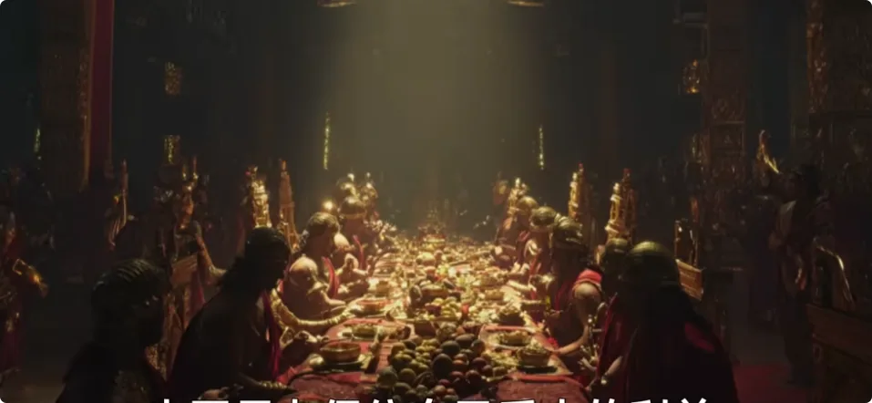

而这就是下凡的神明在世间最大的阻力。

有人会问，那是不是把这群旧秩序领袖干掉，就万事大吉了呢？
当然不是。

因为使人堕落的从来不是人们手中的利益，而是人性本身。

人性有三大弱点，那就是**贪、嗔、痴**。也就是
得到了就想要更多；得不到就心生怨念；难以自我审视，一切以自我为中心建立善恶观。

而这种人性弱点藏在每一个人身上。不管什么民族，不管什么社会地位，也不管远近亲疏，不管是谁，只要开始接触到利益，他们的贪嗔痴就开始发作。
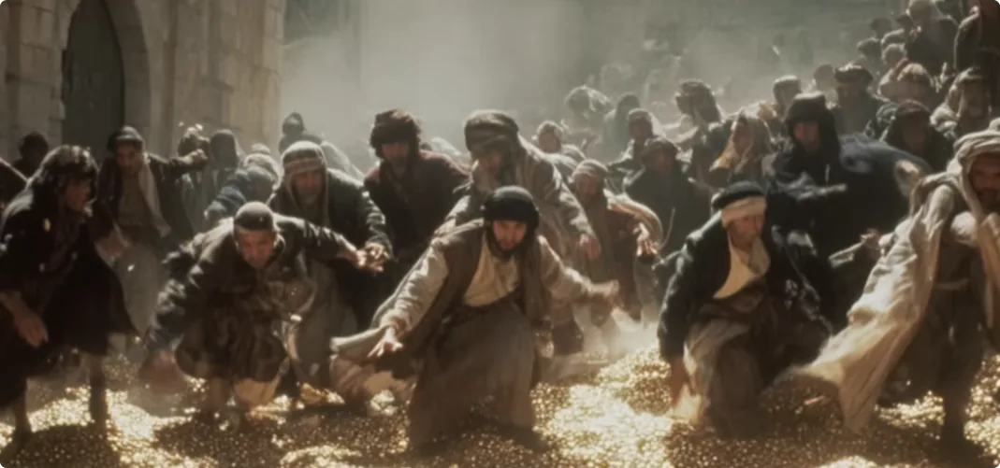

连老人家这些下凡的神明转世成人身，也要再次考验名利观。
因此，天上的神明从来不独宠一个民族、家族，也不会把神权交给任何一个民族、家族。
所以，在历史上总会出现某个民族受神眷顾，起飞了，做大了，然后又开始飘了，最后迎来覆灭。

在圣书新约中，有三处巧妙表达了神明对人性贪嗔痴的失望。

## 一、人之贪

老人家做了个比喻，讲人的贪。这里我直接讲本意：

道神曾把人类的世界交给某一批人代管，可能是某一民族，也可能是某一家族。
等到道神再次派神灵去视察人间时，那些人就合起伙来，商议着把下凡的神灵给杀了。
道神说：

> 既然你们自称是独忠于神，而不愿忠于其他神灵的，那我就派我的化身去，你们应当服气了吧？

结果那些人把道神的化身也给杀了，因为他们想霸占大地上的一切，他们觊觎道神的资产。
最终，道神决定下死手除灭这群恶人，要将地上的产业交给能按时交付任务的人管理。
这个故事充分说明，人的贪婪是上不封顶的，是填不满的，凡所见的都想拿到手里占为己有。

## 二、人之嗔

第二个故事讲的是人的嗔。

老人家回自己家乡驱鬼治病，然而那些老乡都不服老人家。他们认为：

> 我是看着你长大的，你什么出身，你父母兄弟姐妹是谁，我都一清二楚。你怎么可能学到这么多本事？你怎么会比我厉害？你凭什么来指导我怎么生活呢？

这些老乡越想就越讨厌老人家。说白了，就是人的嗔念作祟、嫉妒心作祟，见不得身边的人拥有自己没有的东西，见不得自己身边的人过得比自己好。

这种心理更容易在熟人身上产生。

老人家对他的门徒说：

> 历史上但凡是先知，除了他们的亲人和同乡，没有不尊敬他们的。

换而言之，**当一个求道者修有所成，不管你有多大本事，最不愿意相信你的、最不愿放下身段尊重你的，往往是那些认识你过去的人。因为他们还停留在原地，你的存在就是对他们的审问**

所以求道之人要保持独立。你修得好或不好，成或不成，最终可能只有你能为自己庆祝。
因为你的光芒会让身边的人感到刺眼，甚至会让他们萌生伤害你的想法，最终给你的道路带来不便。

比如老人家的同乡，最后居然想把老人家推下悬崖。

## 三、人之愚痴

最后一处讲的是人的愚痴，这是最难的了。

人若能意识到自己的贪念和嗔念，那也还好，也是有慧根的人了，能够及时牵住自己的思绪，及时回头止损。
就怕这人从始至终都意识不到自己的错误，朝着错误的方向一路走到黑。

关于痴这一点，最直观的表现就是在信仰上。
老人家说，世人口口声声说敬仰神、敬畏道，其实不过是表面恭敬，心底都在谋算自己的事情。
旧约说，亚当、夏娃吃了善恶果，能分辨善恶事，于是有了原罪。其实说的是人类有了自己的私心，想要夺取道的神权，由自己决定世上何为善、何为恶，谁是益虫、谁是害虫，不再甘心听从道行事。

后世那些宗教领袖，把自己的注解和条规抬到原始教义之上，遮盖了甚至歪曲了神的本意。
人们愿意遵循这些新的教条生活，是因为人们只信对自己有利的，只听自己愿意听的。忠言逆耳的，却从来听不进去，也无法从茫茫经书中还原出来。

所以，他们拜的不是真正的神，遵行的也不是真正的天道，而是传承千年的人道。
所以，老人家从不把自己托付给任何信徒，也不用神迹来赢得人的信任，因为他知道人类是什么样子。
真正信道的、心中有道的人，是不需要神迹来证明道的。
那些需要神迹来证明老人家身份的人，需要神迹来证明道的人，最终都会因为没有见到及时的神迹，而选择背弃老人家、背弃道。

## 门徒的背弃: 

于是，我们接下来会看到老人家的门徒如何背弃老人家。
最后的晚餐中，那句“你们中有人出卖了我”广为流传。

### 犹大信仰的崩塌
十二门徒中的犹大，他出卖老人家的底层动机，其实和大多犹太人一样。他们期待的是旧约中提及的一位能改变旧世界的领袖。
然而老人家却说，自己建立的国并不在人的世界，甚至预言了自己的受难和牺牲。
所以对于犹大这一类人来说，他们对老人家是极其失望的。犹大不过是老人家众多信徒中的一个缩影。
既然自己的理想无法实现，于是犹大选择背叛老人家。他宁愿把老人家出卖给旧世界的领袖，换成能在人世间过上好日子的金币。
这段故事也映射了后来的犹太族群选择金钱背叛道。

### 彼得的口是心非
在最后的晚餐，老人家预言了诸位门徒会背弃他。门徒彼得信誓旦旦地说：

> 我就算跟您一起坐牢、一起受死，也是甘心的。

老人家却回复他说：

> 今早鸡还没打鸣，你就有三次说不认识我。

此时的彼得还不清楚这话的意思。

在吃完最后的晚餐，老人家给门徒洗完脚、为门徒祷告完后，犹大就带着一群罗马士兵来逮捕老人家。

就在老人家被士兵拿着刀剑逮捕的那一刻，所有的门徒都在极度的恐惧和震惊中选择抛弃老人家，四散逃入夜色中。

等老人家被捕后，彼得就远远地跟在他们后面，和差役坐在一起。他想要看看这事会如何发展。

有一个女子认出了彼得，说他素来和老人家是一伙的。彼得却否认说：

> 我不认得他。

过了一会儿，又有人认出了他，说他跟老人家是一党的。彼得情绪激动地说：

> 你这个人，我不是。

又过了一段时间，又有一个人极力地指认彼得，就是同老人家一伙的。

彼得慌了，大声说道：

> 你这个人，我不知道你在讲什么。

说话间，街上的鸡就打鸣了。

你看，不论是同老人家亲近的门徒，还是普通的信徒，即便他们亲眼见证了老人家的神迹和教导，恐惧仍然能压倒他们对老人家的信心。

用东方人能理解的话来说，就是心中的道义不够。

老人家在人间传道的三年，真心忠诚的徒弟却寥寥无几。这也是前面所说，老人家不把自己托付给任何人，因为他太了解人性了。
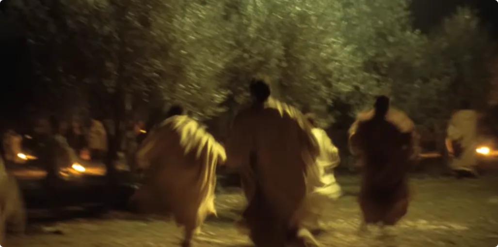

老人家被带到犹太公会大祭司面前，以老人家自称神之子为由，定他亵渎神的罪。众人也纷纷要定老人家死罪。
接着，有的人向他吐口水，有的人扇他巴掌，有的人用拳头打他。
受祭司长和长老的鼓动，众人把老人家押到罗马总督比拉多的衙门，控告他煽动民众反对纳税给凯撒大帝，并自称为犹太人的王。
但是罗马总督多番审问下来，老人家在法律上根本构不成死罪。所以罗马总督一开始只想象征性地鞭打老人家，然后给放了。

然而众人早已疯狂，即便死罪不成立，仍要定老人家死罪。众人一起呐喊着要把老人家钉在十字架上，甚至宣称他们和他们的后代会来承担一切后果。
罗马总督怕底下生乱，不如就让老人家当替罪羊，除之以安民愤，于是同意把老人家交给钉十字架的人。
待罗马总督给老人家用完鞭刑后，老人家被交到士兵手上。

士兵们开始羞辱老人家。他们向他吐口水，用荆棘缠他的头，用手掌扇他巴掌，还拿苦胆调的酒喂他喝，不停地戏弄他。
他们把老人家钉上十字架，并在十字架上写上他的罪名：

> 犹太人的王。

以此来嘲讽他。

路过的百姓辱骂他，官府的人也戏弄他。他们都在说：

> 这个人救得了别人，却不能救自己。他不是说自己是神的儿子吗？自己从十字架上下来，从十字架上下来给我们看看，这样我们就信了。

为什么曾经跟随老人家的信众也这么冷漠呢？

## 背弃的门徒在犹豫什么?
### 其一，信仰的崩塌

尽管他们在过去已经见证过老人家驱鬼治病的本事，但他们认为，既然老人家自称是救世渡难之人，怎么会连自己的性命都保不住呢？

如果老人家不能给他们带来新世界，不能复兴他们的民族，那为什么要跟随他呢？

所以，他们还在**等老人家自证**。

### 其二，现实的恐惧

在汹涌的民意和权威的立场面前，任何公开与老人家站在一起的人，都可能被视为叛乱的同谋，面临同样的命运：逮捕、审判和十字架。

所以，有很多人会想方设法跟老人家撇清关系。
尽管世人做到这种地步，老人家在被钉十字架的时候，仍然在为世人祈祷。

他说道：

> 请赦免他们的罪，因为世人并不知道自己在做什么。

在老人家的十字架旁，有老人家的生母玛利亚，以及唯一陪着老人家、见证老人家到最后的年轻门徒约翰。

于是，老人家临终前把母亲玛利亚托付给了约翰照顾。

除这两位，还有好些妇女陪伴在老人家旁。她们成为老人家最忠诚、最坚定的见证者，也在圣书中与门徒们四散逃跑形成了鲜明的对比。

圣书之所以要强调这一点，是要说明，因为女性的名利心比男性少，所以在最后的时刻，女性要比男性更重感情、更重情义。女性的果要比男性好，女性得到的机会会比男性大。

老人家从中午12点一直被钉到了下午3点，直到断气。

在这3个小时里，遍地的天都黑了。

老人家以自身黑暗痛苦的3个小时，代替世人承受了道神的惩罚，以换取未来救赎世人的机会。

## 道的愤怒
就在老人家断气的那一刻，地震发生了，大地上的岩石崩裂，圣殿也裂成了两半。一些旧约信徒的坟墓也被震开，他们从坟墓中苏醒，象征着老人家的救赎之功追溯并覆盖了旧约时代的忠诚信徒。

目睹这一切，一旁的罗马军官感到十分害怕，因为他意识到自己犯下了可怕的错误。

他刚刚参与处决了一个无辜的、具有神圣身份的人物。他或许触怒了神明，招致报应。

而那些参与处决的众人，也从狂热回归清醒，陷入深刻悔恨与自责中。

随着圣殿中象征垄断神权的幔幕被伟力撕碎，标志着以律法、祭司、献祭和隔绝世人的旧约行为之约正式结束，通过救赎的新约恩典之约正式开启。

老人家死后的第三天，天微亮，一些妇女便带着香料去老人家的坟墓，打算为老人家膏抹身体。

去的路上，她们还在发愁，谁能来帮她们打开墓穴外的巨石。结果她们到了后，发现巨石已经自己滚开了。
当她们走进墓穴后，她们找不到老人家的身体，却看见有身穿白袍、相貌不凡的天使坐在那里等候。
天使告诉妇女们，老人家已经复活，让她们去通知老人家的门徒，前往加利利的一座山上去见老人家。
等门徒们来到加利利的山上，老人家就给他们显现，让他们见证复活后的自己。

在此之后，老人家又跟门徒相处了40天，细心教导他们。
最后，老人家在伯大尼附近的一座山上，当着门徒的面白日飞升，乘着一朵云彩离去了。
总的来说，老人家的故事真的令人感动。
神明为世人做到这种程度，可见他们至真至性的慈悲神性。

## 结尾
老人家道成肉身，经历贫穷，被误解，被至亲出卖，被门徒否认，被公众羞辱，被不公审判，承受身体的剧痛和死亡的恐惧。
可见，神明并非高高在上地观察世人的痛苦，而是躬身入局，亲自尝尽了世人一切的悲伤与挣扎。
神明都全然理解。历史长河中，诸神屡屡为迷途的世人点亮明灯。
然而，面对这般真情实意的救赎，世人的回应却常常显得沉默与吝啬。
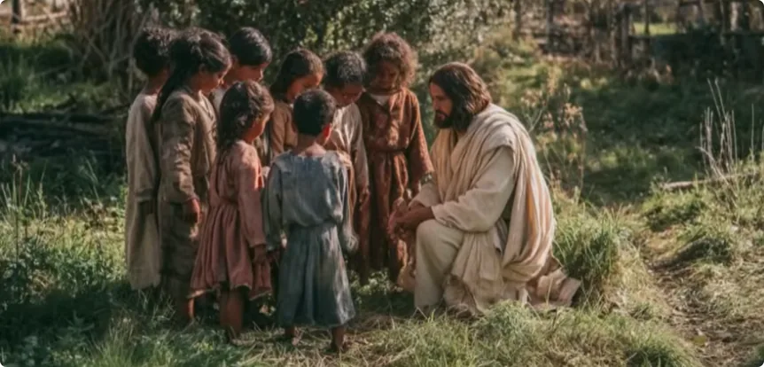

人们总能轻易地为自身的过错找到借口，不愿正视自己，不肯迈出悔悟的那一步，最终一次又一次地把文明的车轮开进死胡同。
所以下一期，我们将深度解读圣书中所说的世人的大罪，找到世人难以醒悟的根本原因。

我是修炼者小烨，我们下期再见。

## 修仙笔记《寻花童》

> _**真正的机缘，不只是“遇见”那么简单。进来是缘，留下也是缘；得到之后还能不能守住本心，才是真正的考验。**_

## 1. 寻花无门：世人都在找“仙花”，却没人知道它真正的模样

相传有一种花，吃掉它，身体可以健康长寿，也可以使人变聪明，甚至能帮人褪去一身寒气。这种花被称作**仙花**。

但是传说终究是传说，绝大部分人都没见过这花长什么样子。不过仙花闻名遐迩，自古寻它的人很多。因为八方四处寻无门道，只见世人都把姿态高雅的花当作仙花，甚至外表越发光鲜亮丽，就越相信此花非同凡品。

谁也不知道什么是仙花，但很多人觉得，仙花就应该长在高处或者深处，于是越来越多的人去山顶或深山里找去了。

### 集市上的童子：真正的机缘，看起来却如此普通

这天，一位寻花童正路过集市。他背上一箩筐，手拿一本古籍，瞧这架势，铁定是去找仙花去了。

忽有一童子向他喊话：

> “嘿，那边那位，您想不想寻仙花？”

寻花童找着了声音的来源，是一个孩童。这童子乍一看，和普通家的孩子别无二样。

寻花童一听“仙花”二字，心动不已，道：

> “这确实是我想要的，但何为仙花，你可知道？”

童子说：

> “你随我来，我带你看看什么是仙花。”

童子把寻花童带到一处花园，不知采用了何种方法，寻花童好像感觉到了什么。虽不明显，但好像有什么东西钻进了他的身子里，让他眼神忽地明亮。

童子问道：

> “你有何感觉？”

寻花童答：

> “略有。虽有些微妙，但我相信绝非凡品。”

童子笑了笑：

> “你若觉得可以，明天再带你找一朵。”

说罢，童子转身离开了。

---

## 2. 三朵仙花：从什么都看不见，到真正一睹仙花真容

### 第一次只是微妙，第二次已经能清楚感觉

次日，寻花童准时来到了相约的地方。这一次，童子又带他来到了一处花园，用同样的方法，寻花童又体验了一次。

不过这一次，他感觉明显了许多。

**一股精气神十足的暖流涌入了体内。**

童子问：

> “你有何感觉？”

寻花童答：

> “更明显了。虽然我还是很懵懂，但确信这正是我想要的。”

童子只是笑了笑。他知道，困扰在寻花童头上的迷雾正在消散。

童子告诉他：

> “如果你觉得不错，明日再来。”

说罢，童子转身离开了。

### 第三朵仙花，终于让他真正“看见”

次日，寻花童更早地来到了相约的地方。

只见童子带他来到了第三处花园，再次使出了方法。不过这一次，寻花童确实看见了。

虽若隐若现，但他确信：

> **眼前的就是仙花。**

就在他的脚下，一朵圣洁的仙花生长在此处，散发着淡淡的白色光辉。随后仙花化开，如一团气流钻进了他的体内，温暖的感觉包围了他，他的灵魂深处感受到了一种明晰的力量。

> _**“我看见了，我感受到了！”**_

寻花童喜出望外。

> “原来这就是我苦苦寻找的仙花啊！”

童子依旧笑了笑，给他答疑解惑：

> “世人笃信名气和外表，却不知仙花并非凡品，岂是能由凡人五官评说？看不得见仙花真面目，也怪不得仙花无情。”
> 
> “前后共用了三朵仙花，才褪去些许你的凡尘五感，加上花与花之间气息共鸣，所以你才有了感觉，得以一睹仙花真容。”
> 
> “如果你真有心寻花，可以随我来，我懂些许门道。”

寻花童感激不已。他心想，这一定是平日苦苦寻花的心意打动了仙人，才得此机缘。

寻花童对童子道：

> _**“我感激不尽，定会好好珍惜，还请你不吝赐教。”**_

随后，寻花童便随童子学艺。

---

## 3. 入园之后：真正的考验，从“仙花不能白拿”才正式开始

### 小一、小二与第一个后来者

有一晚，花园的主人问童子：

> “此人学得如何？”

童子道：

> “尚可。”

园主回：

> “那便继续带带他吧。过些时日，你俩可以一同出行了。既然入了本园，你叫小一，他便叫小二，以后的寻花童都这么称呼吧。”

小一不求回报，在他的悉心教导下，过了一些时日，小二凭借不错的技艺，已经可以独自寻找仙花了。

小一对小二说：

> “你已经学会本事，随我去趟集市吧。这集市里的寻花童肯定也多，若有缘的，可以指条路。”

来到集市，他们果真又遇见了一位苦苦寻花的童子。

这位童子衣衫褴褛，却是一心一意寻花之人。得知眼前两位知晓仙花的真容，扑通一声跪下，请求两位提点。

他说他找这条路太久，有着十分的诚意，除此以外，他哪儿也不去。
小一听闻有些感动，心想此人应当不差，便道：

> “你随我来吧。”

于是，小三和小二一样，得到了小一的悉心教导。

### 园主第一次立下规矩：拿了仙花，就要承担仙花原本承担的事情

一边是小二、小三的感激之情，一边是小一的善念之心。

这天，花园的主人又找来了小一。

园主说：

> “这两人已经学艺多时，这园子也被薅秃了不少。可这仙花生长千年万年，大地上的生灵都要依赖它才能存活，岂能由一两个人就独吞了这些仙花？”
> 
> “你叫那两人去花些银子、花些精力，把这园子打理打理。该施肥的施肥，该修缮的修缮。”
> 
> “仙花他们拿走了，可这仙花该干的事情，得由他们去干，否则岂不乱了自然生衰的规矩？”
> 
> “你别说这是我的意思。你先去问，且看他俩如何应答。”

小一叫来了小二和小三，说道：

> _**“这园子得打理，你俩要出点力。并且从今以后，这里的仙花，你俩都要拿等价的东西交换。以后的寻花童也是如此，仙花不能白拿，这应是自然的规矩。”**_

---

## 4. 小二、小三与小四：弱势时求机缘，强势后却开始反抗规则

### 小二、小三：一旦有了本事，就觉得机缘本来属于自己

小二和小三听闻，先是震惊，后大怒。
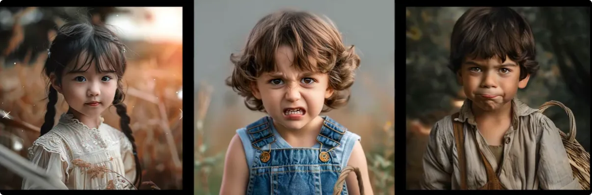

小二道：

> “岂有此理！这仙花生于自然，长于自然，乃是自然之物，寻见者自然有缘，岂是你小一说了算？”
> 
> “我过去采摘仙花，尚且无需付出一丝一毫的代价，今日仍有此番修为，此乃天意，是我过往寻花的诚意感动了仙人。这是我的机缘，与你毫无干系。”
> 
> “今日你却想阻拦我，装腔作势，替自然做起主来，你真是有违自然之道。”

小三也有自己的想法：

> “你应该知道，寻花童常常脱离尘世，或因困于尘世之苦，才心生寻花的想法。若寻花都有门槛，那像我这样的人岂非无缘寻花？日子岂不是一直苦下去？”
> 
> “自然悲悯，滋养万物，定会体谅我的难处。”

小三又对小二说：

> “你已有一身本事，不需要依赖小一了。这世间苦难的寻花童这么多，他不去指路，我们去便是。”
> 
> “况且我俩心胸最包容，谁有心要仙花，我们就给他，这才是真正的自然之道。”

随后，小二和小三愤慨地摔门而出。

### 园主：凡人弱势时会下跪，强势一分就开始厌恶约束

小一又气又委屈，来找园主诉苦。

园主说道：

> _**“你气愤，我还气愤呢。当初就说你不要轻易相信凡人，不要被情怀所困。”**_
> 
> _**“凡人嘴上说得多么诚意，到头来每个毛孔都只想着自己。这自然的规矩，愣是悟不明白。”**_
> 
> _**“他们弱势的时候，会坚决地下跪，给自己寻个出路；等他们强势一分，就不再享受外界约束，想做什么就全凭内心去了，还给自己找个义正言辞，心安理得。”**_

园主又道：

> “我看还不如花园里的那些笨鸟，得一分、安一分，不卑不亢。”
> 
> “我只需拿一点仙花，就足以让人间无恶不作的妖魔放下屠刀，安心随我修炼。仙花之可贵，阴阳众生皆知，这世间就数人不懂规矩。”

园主告诉小一，这次的亏要记着了，下次不能这么心软。

这些仙花本就不是小二、小三该得的。虽然花气无法再收回，但仍然是阴类众生修炼的绝佳资源。

> “这俩忘恩负义的家伙，我定会让归顺的妖魔去拿走他们身上的花气。”
> 
> “下次再遇到寻花童，就让他拿辛苦攒到的银子去换。让他知道，得到的东西等同于他的辛苦付出，否则人性是不会懂得何为来之不易。”

于是，从明日起，先立个规矩：

> **一个银子，换一朵仙花。**

### 小四：还没看见仙花，就先认定“正法不该明码标价”

这天，小一在街边唱起了仙花的故事。好些人来了听，听了又走，都不相信这般大点的童子会懂什么本事，更别提知道仙花的事了。
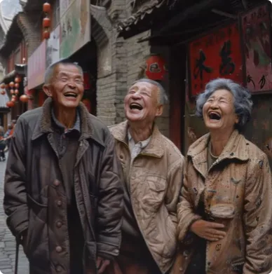

人群里只有一位寻花童，且称呼为**小四**。他听得好生起劲，忍不住上前询问：

> “我听了好一会儿，你说的话我觉得很有道理。请问哪里有仙花？我好去采摘，若能告知我，感激不尽。”

小一道：

> “我有。一个银子换一朵，要吗？”

小四先是一愣，后大笑：

> “笑死我了，正法怎会明码标价？切勿出来丢人现眼！”
> 
> “我都还没见着仙花的样子，你却敢伸手向我要银子？这庙会里的箱子尚且不强迫人投钱，你算哪门子体系，也敢出来吆喝？”

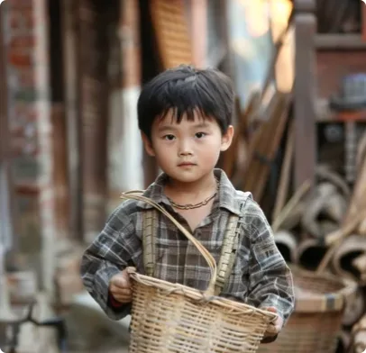

小一不语。
但这种骂法的人，今日已经见过多个。跟往日不同，他心中冷淡了许多，只想：

> **凡人一个，关我屁事。**

---

## 5. 小五与小六：聪明如果脱离脚下的路，也会变成另一种执念

小五和小六学艺已有些时日。
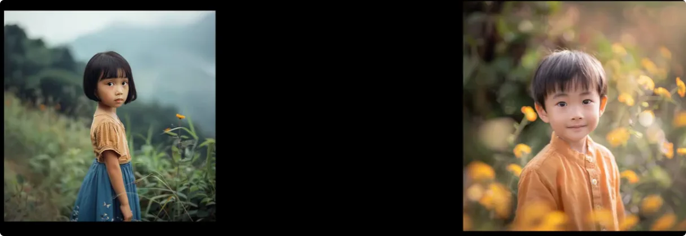

这天，小六私下和小五聊了起来：

> “你有没有想过，这仙花之主是谁呢？”

小六是个聪明人，心思缜密，爱思考大大小小的事情。

想当初两个银子换一次尝试，无论成功与否都不算亏。况且这次真让他找着了路，寻花的这些日子里，小六前思后想，把过去的很多疑惑都想明白了。

但仍有一件事没想明白：

> **这仙花的主人究竟是谁？**

听小一讲过，园子有主。可仙花生于自然，又衰于自然，自然伟力理应是万物之主，为何又说仙花属于园主了呢？

平日采食仙花，也未见园主出面表态，他真的算仙花的主人吗？

### 小五不想宏大问题，只想把脚下的路走好

小五则跟小六不一样。

脑子愚钝，除了一心寻花，对这些宏大的概念不感兴趣。

他只知道：

> _**路在脚下，好好走便是。**_
> 
> _**定期采食仙花，稳住心神，终有一天会领悟自己该领悟的事情。**_

小六见小五不吱声，心里暗自调侃了一句：

> “还真是只笨鸟。”

不过小六是真的很想知道问题的答案，求知的欲望让他不能坐以待毙，于是他决定问个明白。

小六找到小一问：

> “都说人外有人，天外有天。你说，园主背后会不会有更伟力的存在呢？”

园主听闻震怒。

这厮平日采食的仙花一点不少，今日倒算起我的账来。今天能想出一个更厉害的，明天谁显一手本事，他就能易主、反主。他日定会成为叛徒。

你今日待他不薄，却难保有一天，他觉得你不配，跟他人离去，再与你兵戎相向。

小一回复小六：

> **“你今后不必再来了。”**

### 第二次提高门槛：四个银子一朵，并加入“心魔”考验

园主对小一说道：

> “这世间的寻花童里，最不缺的就是这些自作聪明的蠢蛋。凡心尚未退去，却总想着参透大智慧，终究还是太闲了。”
> 
> “明日起，四个银子一朵仙花。让他们付出更多的心血在换取仙花这件事上，与其有多的时间想东想西，不如脚踏实地地走路，学好本事。”

另外，园主又立下一条规矩：

> _**“以后的寻花童，我都会派心魔去试。他若轻易就跟了魔道，那便不是有缘人，你也不必浪费时间在这种人身上。”**_

---

## 6. 小七：苦苦求道的人，也可能最终败在“为什么别人比我容易”

### 找了一辈子路的人，终于真的找到了路

小七自幼就寻花，世间大路都走过，但都觉得不是自己想要的。

错了又错，眼看无路可走。

一心寻花的他，可谓**心之切、意之坚**。
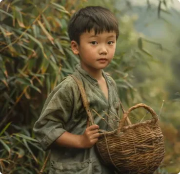

你说巧不巧，小一发现了他。
小一只是给他描述了一番仙花的模样，小七凭借丰富的试错经验，这一次一听，就觉得小一绝非一般人。

小七家境一般。

虽闻仙花需要四个银子，但还是凑齐了去学本事。他认为银子再多，对自己也无大用，此生只想寻得仙花。

> _**“倘若此次能找到真路，当是万幸，又何须计较这一时？”**_

小一当然也不会戏耍他，随之便带他寻得了第一朵仙花。
当小七见着真的仙花时，已然激动得泪流满面。
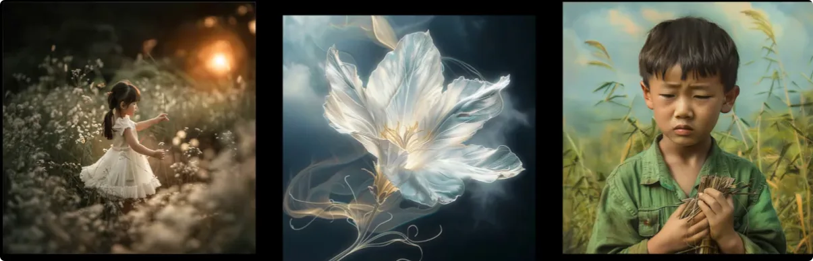

> “原来此生的寻花之旅并非妄想。能有此机缘，自己一定要好好珍惜。”

于是，小七便按规矩，每四个银子换一朵仙花，好好学起了寻花的本事来。

### 心魔第一次出现：放弃吧，也许回归生活会更舒服

虽然生活上吃力了许多，但小七仍然没有放弃。一边过好日子，一边刻苦学艺。

有一次，小七实在觉得这条路辛苦，私下放纵自己，喝起酒来。

他的内心突然多了一个念头：

> _**“放弃吧，回归生活吧，也许会过得更舒服。”**_

是啊，当初如果不走这条路，就不用这么吃力了。

但随着酒意渐醒，他澄清疑虑，只对刚才的想法一笑了之。次日，便又刻苦用功起来。

小一见他能有此番真心，便也多多教导。

**功夫不负有心人。**

小七也慢慢成长起来，不仅生活渐好，还从仙花的滋养中获得了许多功能。如今小七的所见、所闻、所作，早已是普通人不能比拟的。

回望过去，小七感叹不已，为自己今日的成果感到高兴和骄傲：

> **能走到这一步，自己也应是仙缘中人了。**

### 有了优势以后，他开始面对另一个考验：嗔

小七平日进出集市，难免会和那帮痴迷于山顶的寻花童打个照面。

那些童子是最不能接受被人否定思想和信仰的，一听小七吆喝，便要与之对骂。

哪怕是仙人也会有脾气，何况小七也还是个人。

面对童子的侮辱谩骂，小七有时实在难忍，此时心中难免有股怒火，叫他施点本事，好让对方安分。

但小七终究是忍住了。
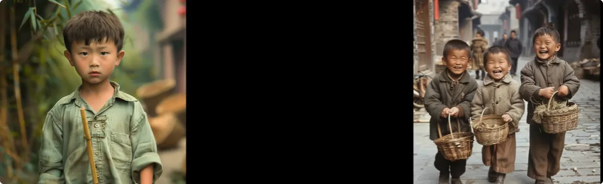

他想：

> **凡人而已，自食因果，又何必多此一举。**

---

## 7. 小八与金花：当后来者比自己走得更快，真正的嫉妒才开始出现

近日，小七带来了小八。

小八家里优渥，听闻才四个银子就能换来一朵仙花，不如一试。

竟没想到，此仙花乃是真花。

他瞬间恭敬万分，赶紧把手里大量的银子换了仙花。

他的滋养速度可比以往的童子快多了。很快，仙花帮他开悟、开智、开功能，他的本事眼见就要追上小七。

小七看在眼里，虽然为小八的成长感到欣慰，但总有种说不上来的滋味。

### 园主把金花给了小八

鉴于小八的付出，小一把园子里那朵**金色的仙花**拿给了他，把他提升到了新的境界。
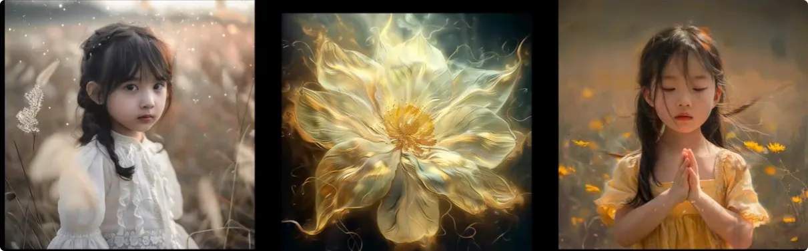

金花，仙花中的珍品，连小七都不曾见过。

这次，小七是真的忍不住了。

他想不明白：

> 他的真心、他的努力、他吃过的苦、他遭过的罪，难道比不上这世间“臭钱”两个字？
> 
> 他曾经不在意的东西，如今却成了他和仙花之间的鸿沟。
> 
> 为何小八会如此轻松顺利？
> 
> 自己为何又要如此辛苦坎坷？
> 
> 和小八相比，自己不见得差在哪里。明明是后来者，凭什么他能如此轻松得到这一切？

小七相信园主公正，自不会有怨言，只能把这不平等的遭遇追究到小一身上。

小一也是人，也会不完美。平日花园里的事情都交给他打理，想必这是他自作主张。

**如果不是因为小一，也许自己和金花之间并没有那么远的距离。**

这种念头一旦闭环，就再难解开。

尤其对于小七这种初具优势的人来说。

就这样，小七和小一渐行渐远。

### 园主：人一旦有了优势，再去动摇优势，破绽就会暴露

园主找来小一说道：

> _**“你看，他最终的心境也就止步于此，竟觊觎起其他人的位置来。终究还是没能驯服人性，没能戒掉贪嗔痴。”**_
> 
> _**“人一旦有了优势，人性就会出现破绽；再去动摇他的优势，这破绽就会变得千疮百孔。”**_

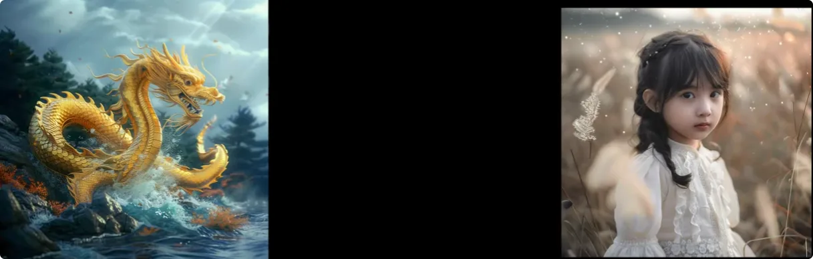

园主又道：

> **“穷者志穷。”**

于是，规则再次改变：
1. **以后八个银子，一朵仙花；**
2. **原先五朵仙花开一点功能，以后需二十朵才开一点功能；**
3. 他越是着急，园主越要慢点给予；
4. 他越是觉得自己有优势，园主越要将优势给别人；
5. 他越是觉得自己有机缘，园主越是不做回应；
6. 他越是在意什么，园主就越要让他面对什么。

> _**“这仙花越来越少了，我没有必要浪费在那么多人身上。”**_
> 
> _**“门槛在这。进来是缘，留下也是缘，皆是个人把握的缘分。”**_

---

## 8. 为什么金花最终给了小八：条件好不是罪，关键在于他如何对待所得

小八虽优渥，但也是过去付出心血赚来的，该磨练的心境也走过了。
但他却不像城市里那群放不下名利的人，如今能一心放在仙花上，实属难得。
且他从未敢怠慢。

听闻园子需要施肥、修缮，他也出钱出力，很快把该补的补、该填的填。
>**该尽的本分，一个不落；该守的规矩，一个不越；不多一份妄念，不少一份恭敬。**

连园主派去的心魔，也未见有挖墙脚的机会。
园主见他能有此番诚意，自然把最好的金花开放给了小八。

---

## 9. 小九：真正的幸运，不只是晚来，而是能看见前人为什么失败

在小八入园不久后，小九也来学艺了。

他跟很多寻花童一样，找了这条路很久。当他遇见小一的那一刻，他明白：

> **他的机缘到了。**

原来过去的种种磨难，是为了逼他来到小一面前，找到这条路。
小九相较于之前的寻花童，并没有什么优势。
也许唯一的优势，就是**幸运**。

1. 有幸在踏入正道前，被诸多苦难折磨得失去了对城市的念想，在小九的内心深处，只留下寻找仙花这一个心愿；
2. 有幸他能听闻小一、小二、小三、小四、小五、小六、小七、小八的故事，能学习前人的经验，取长补短；
3. 有幸他能在心魔出现的时候，用自己的本心来对治自己的贪嗔痴，孰轻孰重，自己能幡然醒悟、摆正自己的位置；
4. 有幸他在大门将要紧闭的时候，成为新的试金石。

若要让他付出心血，他便敢披星戴月，不给自己懈怠的机会。
若要让他付出诚意，他便敢把自己逼得无路可退，死磕修行这条路。
若要剥夺于他，他便说放下就放下，不为得失所困。
若要给予他，他便想着多付出一份，因为他知道：

> _**付出必须和收获对等，这是自然法则。**_

尽管如今的小九已经成长到一定的地步，但他知道自己在这花园里，仍是**可有可无的角色**。

他知道自己的付出，与收获相比仍然不值一提。
当自己就是前面那个“石头”时，他就必须谨慎求证了。

---

## 10. 最后的门槛：十个银子一朵，第一朵甚至不再教任何本事

这日，园主感叹：
小一去集市也有数次，认识小一的人越来越多，将来必然会有大量的寻花童找上门来。
可有缘人终究是少数。
不可能让小一挨个去验，也不可能浪费仙花去验。
于是，园主再次立下规矩：

> **明日起，十个银子，一朵仙花。**

而且：

- **第一朵仙花只能用来清除他头上的浊气，先让他明心见性；**
- **不教他任何本事，先看他本心如何应对；**
- **不论根底，不论来源，规则同等；**
- **唯知难而上者，有缘方有机会学真本事。**

园主说道：

> _**“园子里剩下的仙花，先到的吃肉，后到的喝汤，迟疑者什么也得不到。”**_
> 
> _**“个人缘分，各自把握，岂有我求同盟的道理。”**_

### 小十：真东西，不怕被验证

这日，小一和小九来到集市。
有一位寻花童，且称**小十**。
小十见小一和小九在讲仙花的故事，便问：

> “仙花如何寻得？”

小一道：

> **“十个银子，一朵仙花。”**

小十问：

> “保真否？”

小九笑道：

> _**“真东西，不怕被验证。”**_

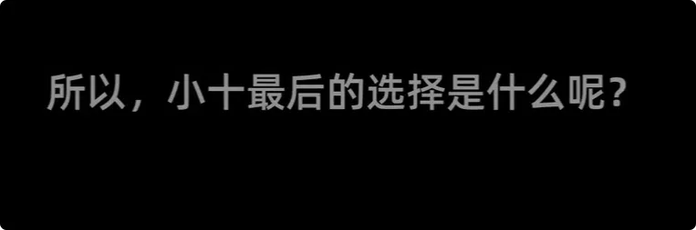

## 建设_功德机的操作与原理

> _**上辈子没说完的阴间建设指南，这辈子继续讲。**_
> 
> _**这一期不讲最复杂的阴间机械操作规范，先讲阴间最吓人的玩意儿——功德机到底是怎么刷的。**_

## 1. 功德机是什么：从人工积德，到“赛博刷功德”

记了大阴德。
这一期咱们来谈谈上辈子没说完的**阴间建设指南**。
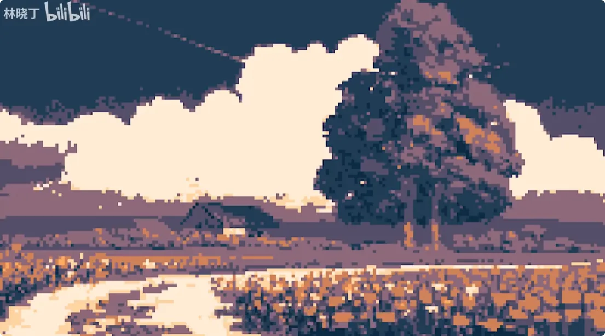

上辈子我说这个阴间机械操作规范的时候，就被拉去转生了。所以这辈子咱们先不谈那个，来谈谈这个阴间最吓人的玩意儿：

> **功德机的工作原理和操作。**

首先，咱们了解一下什么是**功德机**。

刷功德机，各位应该都见过。早期的功德机比较简单，就是水车版：两条鱼借助当时放生系统还没有大修的 BUG，反复循环“放生”来刷功德。

后来无刷电机发展得太快，就出了一个案子。

---

## 2. 第一代功德机：两条鲟鱼，把功德刷到了“比地藏王还高”

传说有一位民间科学家，考虑到自己下去以后还想找爱因斯坦，再顺便改进一下费马大定理，于是给功德机装上了一个**3000 转的马达**。

选的还是产卵期的鲟鱼。
结果阴间系统直接爆了。

因为按照当时的规则，**鱼卵也被计入放生功德**。

按当时这段故事里的统计数据，两条鲟鱼合计有约**70万粒卵**。电机转一圈，就是70万功德。

这位当事鬼把电机一开，结果忘记关了。
后来地府管理中心发现：

> “不对劲。”

好家伙。

> _**这是出了个神了。**_

功德百来个亿，甚至比地藏王还多一点。
于是地府开始查数据。

一查，果然出事了。
但麻烦就在于：**数据已经写进系统了。**
所以当晚只能连夜修系统，把这个 BUG 堵上。
自此以后，第一代功德机正式成为历史。

---

## 3. 第二代功德机：硬盘循环《大悲咒》，最后被 M.2 干成了“DDoS”

第一代的漏洞被封以后，很快又有人搞出了**第二代功德机**。
这一次，走的是西天那边的代理路线。

具体操作非常简单：

> **在硬盘里循环播放《大悲咒》，转一圈刷一次功德。**

因为中间有一个代理路线，所以产生的是持续、小流量的功德。
不像第一代那样一下刷几个亿，比较讲究：

> **细水长流，偷偷奶。**

因此一开始一直没有出事。
直到后来，出现了一个东西：

> **M.2 硬盘。**

然后工作室也开始进场，直接搞起了批量代刷功德。
这下西天那边的线路顶不住了。
流量实在太大，系统直接判断成了：

> **DDoS 攻击。**

于是之前那一批刷功德的人，账号全被封了。
所以第二代功德机的历史其实也很短暂，属于：

> **昙花一现。**

---

## 4. 第三代功德机：烧冥币、搞通胀，再靠“环保功德”套利

再往后，就到了**第三代功德机**。
这一代就比较复杂了。
先前一、二代的操作原理，主要集中在**数据层面**，走的是小功德、长流量路线，追求稳定。
第三代就完全不一样。

第三代功德机讲究的是：

> _**大功德，锣鼓喧天。**_

具体操作，是在**中元节和清明节**的时候烧空包，然后烧大量冥币，直接冲击地府金融系统，制造通货膨胀。
紧接着利用空包退货，再结合阳间、阴间之间的汇率变化，相当于几乎免费把空包复原回来。
这里最关键的地方是什么呢？

>**碳排放。**

因为烧空包会产生碳排放。
但按照故事里的地府条例，清明节和中元节这两天，碳排放不计入扣功德的行列。

所以：

> 烧掉空包——不扣功德；
> 
> 复原空包——减少碳排放；
> 
> 减少碳排放——加环保功德。

也就是说：

> **一来一回，原有功德几乎没变，但额外的环保功德却被系统加上去了。**

更离谱的是，环保本来还是当时地府**四大功德扶持产业之一**，所以给的额外功德特别多。

### 为什么第三代最后还是被封了

这个方法刚开始的时候还真能用。
但过了一阵，地府又觉得不对了：

> _**怎么过个节，人就成佛了？**_

于是暂停功德记录，准备开始查。

结果就在暂停之前，又有一个刚从国外回来的兄弟，因为**本初子午线和时区的原因**，烧功德晚了一天。
于是，大量本来不应该再出现的功德数据，又突然冒了出来。
这一下漏洞彻底暴露。
地府把第三代功德机也修了，同时直接取消了当时的**环保大项**。

于是：

> **第三代功德机，正式失效。**

---

## 5. 第四代功德机：真正高级的玩法，是“功德对刷”

今天真正要讲的是：

> **第四代功德机。**

与之前的单一功德机不同，这一代被称为：

> **功德对刷模式。**

而且操作人员不能只有一个，至少需要两个。
第四代功德对刷模式比较复杂。
它利用的是：
1. **阴间与地狱的功德记录不在同一个系统；**
2. **不同系统之间存在记录时间差；**
3. 再配合“**救人一命，胜造七级浮屠**”这套底层逻辑。

“救人一命，胜造七级浮屠”是确有流传的传统俗语，至少见于《增广贤文》，明代《醒世恒言》等作品中也有相关用例。([古诗文网](https://m.gushiwen.cn/mingju/juv_1810dbd80386.aspx?utm_source=chatgpt.com "\"救人一命，胜造七级浮屠。\"出处及意思_古文岛_原古诗文网"))

### 第四代操作流程

首先，找一位**修女**，然后准备一桶鱼。

不过鱼要注意。

入侵物种以及可能破坏当地生态圈的品种不行，最好的选择是**四大家鱼或者泥鳅**。你要乱放别的，多半不是加功德，而是直接倒扣。

然后按照下面四步操作：

1. **辱骂或羞辱修女。**方法很多，选择效率最高的即可。
    
2. **让修女判你下地狱。**
3. **忏悔，让修女为你祈祷，但是不要收回此前的审判。**
    
4. **等修女离开以后，开始放生鱼。**

这四步下来，按照这套系统漏洞，这辈子的功德基本就不用愁了。

而且即使你每天按照这个方法刷，最后下去的时候，数值也不会高得特别离谱。
系统最后大概率只会认为：

> **这是一个长期行善积德的好人。**

可能各位还不能理解它到底是怎么做到的。
接下来就讲真正的操作原理。

---

## 6. 第四代最核心的漏洞：两个系统同时记账，却没有实时同步

首先，为什么一定要找修女？
因为修女属于**宗教角色**。

按照这篇故事里所谓的《第二版阴间与地狱及冥界互通管理条例》第三条：

> 修女、祭司、僧侣、阿訇等合法注册的神职人员，相关功德由所属宗教对应部门进行记录。
> 
> 神职人员本身的功德，依照国籍与宗教分开计算，需在死后独立申报，进行三方核实比对。
> 

简单来说：

> **当你找修女，并且正在和修女沟通的时候，你这一段时间产生的功德数据，被记录到了地狱那边。**
> 
> **阴间暂时没有你的这一部分记录。**

这就是第四代功德机的基础。

### 第一步：先把自己变成“罪人”

第一步辱骂或者羞辱修女，就是为了：

> **减掉你在地狱系统里的功德。**

让自己先成为罪人。

### 第二步：把负功德转到修女身上

接着进入第二步。
让修女审判你下地狱。
按照故事中所谓初版《地狱管理条例》的设定：

> *神职人员审判罪人下地狱以后，罪人的功德自动叠加到神职人员身上。不论多少、好坏，神职人员需要替罪人承担罪过，等待死后统一结算。*
> 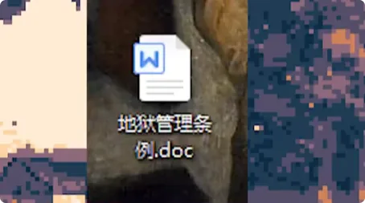

所以做到第二步的时候：
- 修女身上的功德是负的；
- 由于地狱和阴间存在系统录入时间差；
- 你的负功德又暂时没有完全移交过去。

于是双方同时处于一种：

> **“要下地狱”的状态。**

### 第三步：忏悔，但千万不能撤回审判

接下来就是第三步：

> **忏悔。**

按照这套虚构条例的逻辑，神职人员接受**非地狱地区人口**的忏悔，被视作额外工作，因此增加功德。

这个很好理解。
因为咱们以后本来决定去阴间，又不是去地狱，所以属于“非地狱地区人口”。
忏悔以后，修女获得一笔功德。
紧接着再让她祈祷。
祈祷属于保险操作：

> **主动制造一个微量功德波动，把刚才那些操作正式写进系统。**

以免前三秒操作速度太快，数据库还没来得及记录。
但是这里有一个最关键的要求：

> _**绝对不要让修女收回“你要下地狱”的审判。**_

这就是整个第四代功德对刷机最核心的地方。

为什么？
因为没有收回审判，所以：

> **你仍然是一个“准备下地狱的罪人”。**

但是修女在第二步的时候已经接收了你的负功德，所以她在那个时间点也是“罪人”。
而到了第三步，经过你的忏悔，她又获得了新的功德。
于是：

> **她从“罪人”状态脱离出来了。**

那这意味着什么？
意味着：

> _**你把一个人从罪业状态中救出来了。**_

而“救人一命，胜造七级浮屠”。
放一车鱼，都未必有这么多功德。
更何况对方还是神职人员，所以按这套系统设定，功德还会更高。
于是做完第三步时，你就成为了一个非常奇怪的存在：

> _**一个拥有巨大功德，却仍处于“要下地狱”状态的罪人。**_

---

## 7. 第四步为什么必须放生：把地狱系统里的功德“搬回阴间”

问题来了。
我们为什么要下地狱？
因为：

> **修女审判了我们。**

但我们实际上需要下地狱吗？
不需要。
因为按照这个设定，我们属于：

> **非地狱地区人口。**

所以整套流程下来，前面的功德和罪业变化，主要都记录在地狱系统里。
但是我们最终真正要用的功德，是记录在：

> **阴间系统。**

这就是为什么必须做第四步。
首先，让修女离开。
只有修女离开，我们才能重新和阴间系统对接，因为在这套设定里：

> **神职人员的记录优先级比较高。**

等修女走掉以后：

> **开始放生鱼。**

这时候，系统看到的画面是什么？
一个人。
站在河边。
正在放生。

但是由于阴间系统并不完整记录此前地狱与冥界系统内部发生的全部过程，于是在它自己的视角里，就变成了：

> _**一个人独自在河边放生，同时还救了一个身份未知的人。**_

于是系统开始：

> **直接加功德。**

至此，整个四代功德对刷的循环就闭合了。
按照这套故事逻辑，这个版本非常稳定。
除非以后管理条例再次调整，或者出现新的功德活动，不然已经属于目前版本相当完善的一套打法。

---

## 8. 别只会刷：阴间系统也是会“封号”的

前半部分讲完了四代最典型的刷功德方式。
接下来还是得普及一下：

> **阴间法律以及限制活动。**

免得各位刷功德的时候，版本没对上，最后直接被封号。
虽然封号以后，下去还是可以找我这种中间人处理，但到那个时候就比较麻烦了。
所以还是：

> **防范于未然。**

阴间的法律比较杂，以后有机会再细细解读。
今天先讲封号。
按照这篇故事里所谓《阴间功德计算标准》最新补充版的设定，所谓“封号”主要有三种：
1. **剥夺下辈子的轮回权。**先在阴间老老实实干活补偿，补完以后再说。
2. **增加阳间霉运。**具体表现，就是找两个小鬼跟着你，让你倒霉。这种比较烦。
3. **直接让你出点事，下去配合调查。**至于最后还能不能上得来，各位心里应该还是有点数。

不过封号这件事，正常情况下其实不会随便出现。
各位应该记得《国际歌》里那一句：

> _**“从来就没有什么救世主，也不靠神仙皇帝。”**_

这句歌词校对无误，现行常见中文译本即作此句。([维基文库](https://zh.wikisource.org/zh-hans/%E5%9C%8B%E9%9A%9B%E6%AD%8C_%28%E8%90%A7%E4%B8%89%29?utm_source=chatgpt.com "国际歌 (萧三) - 维基文库，自由的图书馆"))
按照这篇故事里的设定，阴间管理在1949年以后也逐渐变得“科学民主”起来。

旧时代那套封建管理，不适用于新时代。
所以这玩意儿并不是一只悬在头顶上的手，可以把人随意揉捏。
只有一个人做得实在太过分的时候，才会出现阳间**所谓的报应**，也就是封号。

比如资本家被丢高炉里。

> **这又何尝不是一种封号呢？**

只是执行封号的人，是咱们底层人民。
结果都是一样的。
有时候只是系统延迟，封号来得晚一点。
顺带一提：

下去以后，虽然封号通常得找我这种中间人处理，但我其实也帮不上多大的忙。

> _**自己造的孽，自己还是得还。**_

我最多也就是来回跑跑，取证、找材料而已。

---

## 9. 功德到底怎么算：看的不是动作，而是“对社会的最终反馈”

至于现实活动，那就比较多了。
各个时期，都有各个时期计算功德的方法。
比如投机倒把、当买办，平时扣的功德可能就比特殊时期少；和平年代和政治运动年代，计算标准也可能不同。

同样：

> **防疫时期，不出门可能就能加功德；**
> 
> **平常不出门，系统当然不会额外给你加。**

简单来说，真正决定功德增加还是减少的，是：

> _**你对整个社会形成的反馈，究竟是正面的还是负面的。**_

不过这里面还有一个比较潜规则的规定。
一般中间人不会告诉你们。

就是：

> **你做的事情本身虽然可能不太好，但系统最终看的，可能是整个事件产生的综合社会反馈。**

比如我最开始讲的一代功德机。
把鱼绑着疯狂转，对鱼来说显然不是什么好事，理论上应该减功德。
但是：
它给大家带来了乐子。
同时又拉动了几个电机店以及五金店的收入。
于是整体反馈居然还不错。
所以最后那位兄弟下去的时候：

> **功德不增不减。**

### 为什么“缺德的乐子”有时候反而可能加功德

再比如我上网钓鱼。
众所周知：

> “钓的是鱼，没的是那啥。”

但是如果我钩子实在太直，直得过于恶心，结果所有人都看出来我在钓鱼，最后形成的乐子反而远大于真正被钓造成的负面影响。

那么：

> **功德指不定还能加一点。**

所以各位也没必要太纠结自己的功德到底有多少。
大部分普通人这辈子所有功德加起来，可能还不如资本家倒一次牛奶**减得多**。
至于下辈子轮回成什么样：

> **都是缘分。**
> 
> **也都是在这个地球上的一次新体验。**

---

## 10. 结尾：功德机可以更新，但阴间版本永远比你想得快

这期就先这样。
我回头还得和下面交接一下工作。
之后再跟各位好好聊聊：

> **上辈子没有说完的那些东西。**

> _**功德机从第一代刷到第四代，真正没变的其实只有一件事情：只要规则存在，就总会有人研究规则；只要系统存在，就总会有人寻找 BUG。**_

## 《圣经》其实是本修仙秘籍

你以为《圣经》是一神教，其实《圣经》一直在讲修仙，讲一个人如何获得永生。

例如，《旧约》中描述以利亚登火车、驾火马、乘旋风升天，和东方神仙登车乘云、白日升天的场景如出一辙。此外，《圣经》里诸多教义与修仙佛的哲理别无二致。它们之间更多的像是拼图的两半。

可以说，《圣经》是末法时代修仙佛的最后一块拼图。而之所以将修长生拆分成两部分，分别放在东西方，其实也是神的本意。因为在末法时代，如果一个修行人只有区域性的视野，那么绝对是飞升不了的。

大部分有信仰的人基本都认同神爱世人，那么就应该知道，**神从来都不可能只偏爱单一民族，真理也不会完整地放在一本经书里，不会允许一个民族垄断真理的解释权。**

*只有拥有大爱、能兼顾古今中外的人，才有机会看懂全球的因果业力，才有机会领悟解困的终极办法。*
而这正是神明给末法时代的求道者设置的终极考题。

所以，尽管亚伯拉罕宗教体系覆盖了全球60%的人口，但能真正读明白《圣经》的人其实极少。

今天，作为修炼者，我给大家讲述最后一块拼图——**亚伯拉罕诸教**。本期我会先把《圣经》中跟修仙有关的部分挑出来讲，包括：
1. 修永生的原因
2. 寻道的方法
3. 对人的要求
4. 飞升的规则

对于东方的求道者来说，这里面有很多重要的信息差。除此以外，有些更深层的、难以公开的道理，则需要各位有缘人自己去探索了。

在讲解之前，我们还需要明确一点：
《圣经》的所有内容都不是神明亲自所写，跟原始佛经《阿含经》一样，都是其信徒记录下来的。
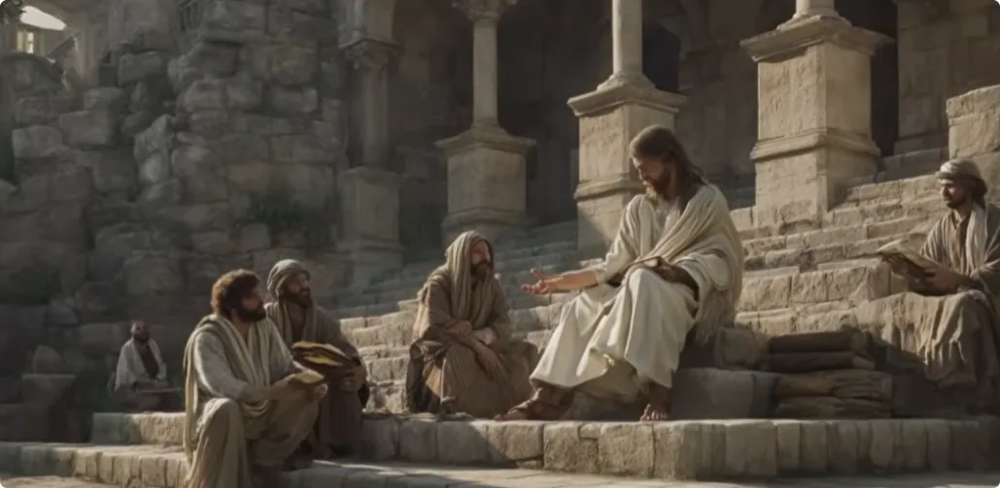

这是因为文字不是真理的完美载体，文字容易随情景变化而产生歧义。如果由神明亲自执笔，恐后世之人以神的名义冠冕堂皇地制造教条主义和排他主义。所以，神明若要保留教义的最终解释权，执笔之人只能是人本身。

人能理解多少，由人自己来书写。当教义被解释得混乱不堪的时候，神明就会再次降临，重新示意并指出新的方向。

因此，我们会发现，耶稣这位神在《新约》中采用了大量的故事、比喻来带出道理。不同悟性和不同诉求的人，解读出的道理就会变得不同。

耶稣是这么说的：

>天国的奥秘，也就是升天的奥秘，只让一部分有缘人知道，而不是让全天下的人都知道。这是因为大部分人的心性都不够，对真理麻木，听也听不进去，看也看不真切。何况还有许多心术不正的人对神权虎视眈眈。

如果讲得太直白，经书就容易被篡改或雪藏，变成少数人约束百姓的工具。
只有极少数人是真正有根底、真心求道的人。这些比喻就是为有根底的人准备的，让这些人找到答案，精进自我。

而那些没有真心、心术不正的人，不仅一点好处都不会让他们捞到，最终还要惩罚他们，让他们一无所有。

---

## 一、修永生的原因

### 1. 永生即道

在《新约·约翰福音》开篇，即点明耶稣下凡的缘由。

>在最初，世界都是由道创造出来的，人们都遵循着道生活。然而，如今地上的人却不再信道了，心中既没有道，也不敬重道。

所以，耶稣来就是让大家重新信仰道。耶稣所行所做，皆是要转达道的意思，而道的意思就是给他的子民指出一条永生的道路。

“信我者得永生”，本意其实是 -> “信道者得永生”。

### 2. 飞升的时机到了

耶稣刚开始传道的时候，就点明了飞升天国的契机。简单点说，就是时间到了。
如果你过去浑浑噩噩，或者猪油蒙了心，做了很多错事，那么现在听劝修行还来得及。

### 3. 决定去留的时间到了

耶稣在谈论人的罪的时候，用果树来比喻每一个人的结局。
他说，如果一棵果树白白站在土地上，却不结出相应的果实，那么土地的主人有权力砍掉它。
同时，他又暗示园主可以再放宽一点期限，让管园的人再栽培栽培。如果还是结不出好果，再决定砍掉。
以上就是修永生的原因，需要各位细细品味其中的深意。

如果你明白了修行的目的和意义，那么接下来我们说说如何找路、如何寻道。

---

## 二、寻道的方法

### 1. 走窄门

关于如何寻道这件事情，耶稣直接给大多数修行人判了死刑。
他直接说结果：
未来真正能领悟道的人、能结好果的人、能得永生之道的人，就是少数。

因为大多数人没有深刻的分辨能力，他们的底层逻辑仍然是基于名利，只信权威。谁名气大就信谁，谁的门场开得大就信谁。
他甚至给未来的基督信徒和神职人员判了死刑。
他说，未来有很多信徒要打着他的名号传道，到处搞神迹之事。这种行为其实是在作恶，因为耶稣说他从不是世界的主人，世人也不应该对他搞个人崇拜。

人们真正该做的是遵行道，这样才能真正进入永生的天国。
他提醒所有的修行人，未来会出现很多伪君子，行神奇之事，受人追捧。如果你们想要分辨他们的好坏，就别看他们说什么，要看他们结出过什么样的果。

因为好树结不出坏果，坏树也结不出好果。

耶稣也给那些读念经书的人判了死刑。
他说，想凭经书获得永生的人，心中其实都是没有道的。因为这些人不能体会道的真正想法，不懂遵循道行事，所以也不知道该去谁那里要永恒的生命。

最后，耶稣描述了走窄门是个什么情形。
窄门，也就是真正通往永生的那扇门，不是你发现了就能进，进了就稳妥了，而是要努力地进、持续地进。

因为未来会有许多人想走进这个窄门，道最后会根据每个人结出的果子安排前后顺序。晚来的人凭着勤勉，也有可能排到前面；原来先到的，则可能会落后，甚至被踢出门。

等门关了，引渡飞升的时机过了，你再磕多少个头也没有用。

### 2. 驱除污鬼

正如佛陀释迦牟尼、道教祖师张道陵，他们在传道的早期都通过驱鬼的方式救度苦难人、建立信，耶稣也是如此。

《圣经》中大量描述了耶稣在传道期间，通过驱除污鬼来治疗缠绵在人身上的阴病。
为什么要驱除缠在人身上的污鬼呢？
最核心的原因是，驱除了人身上的负面干扰，就相当于剥开了困在人头上的迷雾，人的本心、本性才能彻底展露出来。

此后，人说出来的话才是他真正的想法，他才真正有机会决定自己的去留。
那凭什么耶稣、佛陀、张天师他们有能力驱除污鬼？凭什么人间那些大师、神父不能真正做到驱鬼？
道理很简单，能审判众生的只有道本身，能驱赶和约束天下大鬼乃至鬼王的，唯有道给的权柄。

以上两点，如果你明白了该往什么方向寻道，那么接下来我们讲讲永生之道对求道之人有什么要求。

---

## 三、道对人的要求

### 1. 过名利关

哪怕是从天上下凡来的耶稣，他在传道前也要先经得住名利的考验。

道神派魔鬼去考验耶稣。魔鬼把全天下的荣华富贵都拿给耶稣看，对耶稣说：“只要你愿意臣服于我，我就能把全天下交到你手上。”

试问天底下有几个人经得住这样的诱惑？
那耶稣是怎么经受住考验的呢？

他说: 
道神才是天下主人，每个生灵都应该侍奉他、维护他，而不是他来侍奉我们、维护我们。

### 2. 放得下感情

想要从道那里得到永生，那么个人就是要有些取舍的。

当一个人把亲情和爱情看得比道还重，那将来遇到二选一的难题时，或遇到家人和爱人成为魔鬼的筹码时，这个人大概率是要背叛道的。

所以，如果只是普通的修行，想要修得人间安宁，那么可以放不下感情。但如果是要修上天、与道相伴，那这个人就必须要有感情上的觉悟了。

### 3. 放下世间执念

为什么都说修行人要放下世间的执念呢？
因为如果你放不下，那就算把你保送到天上，你的心也还在世间，你还是要重新下来渡劫历练。

神明劝世人放下尘世的执念，就好比老师劝一个贪玩的学生：只有收了贪玩的心，人才能真正地进步，去做对自己真正有价值、有意义的事情。
然而，旁观者清，当局者迷。想让贪玩的学生理解学习的重要性，最好的方法从来不是靠老师的戒尺，而是让他亲身承受贪玩带来的恶果。

所以，人的恶业不是不报，而是时候未到。

耶稣是这么说的：

> 你们不是因为见了我神奇才来信我、找我，而是终于不得不为了填饱肚子才来。直到那时，你们才能明白，世间的一切粮食都会腐朽，都可以随时从你们身上剥夺去。唯有那能让你们永生的粮食，才是值得你们去劳力的。

### 4. 根底好、道根好

耶稣最早使用，也是最核心的比喻，就是撒种的比喻。
撒种讲的是一个人的根底决定了他能否理解道、能否修成道。
他说，传道的过程就好比撒种，同样的种子落到了不同的人身上，结果是不一样的。根底不同，听到的道就不同。

- 有的人听见了道，但自己根本不信道，是信撒旦的，信的是功名利禄，心里根本没有过道。
- 有的人听见了道，虽然欢喜接受，但道根不坚，不肯为道受苦，受点挫折就会背弃道。
- 有的人听见了道，心里却放不下世上的种种念想，把道放一边，不愿尽力修出果实。
- 最后，只有那些根底好的人听见了道，才愿意尽心地修出果实。

根据每个人的劳力，有的人能修出小果，有的人能修出大果，不尽相同。

耶稣又继续讲种子长大的比喻。

有道根的人，既给了土壤，就应当尽力生长，结出丰盛的果实，好在收割之日得到自己应有的报酬，也就是永生。

### 5. 求道的态度

那是不是有根底的人，就一定能辨识出永生之道？是不是就拥有更多的优势和优待呢？
耶稣说，不是的。
他用了这样一个比喻，说天国的王备好了筵席，派仆人去请被召的人来赴宴。结果很多人根本就不搭理国王：

- 有的人只管眼前一亩三分地；
- 有的人只想做生意；
- 还有的人把国王派去的仆人一顿羞辱，甚至把仆人也给杀了。

于是国王就怒了。他原先要召的人如今竟蠢破天际、有眼无珠，不识东家，不再追随他。于是国王要毁掉这些人所在乎的。

既然原先该赴宴的人不来了，国王就把筵席的座位开放给了更多的人。凡仆人在岔路口遇见的，且想来赴宴的人，都有机会坐到筵席上。

那是不是来赴宴了就有座位了呢？也不是。
国王就把那些态度不端的人给扔了出去。为什么呢？
因为给了你上好的机会，你竟然毫无敬畏之心，毫无珍惜的心。当赴宴的人越来越多的时候，当候选人越来越多的时候，那些态度本身就有问题的人，自然会被舍弃了。

### 6. 心性好

除了要端正态度，还要心性够好。
耶稣用葡萄园的故事来作比喻，说有个园主雇人做工，约定好每人一天一钱。
他看见市场上无业的人，就招呼他们进葡萄园做工。那些没有人要的闲工，园主也给他们机会。就这样，园主分别在早、中、晚雇用了几批人干活。一直到晚上结算工钱的时候，园主特意安排先结算晚来的人，最后再结算早来的人。

早来的人看见晚来的人得到一钱银子，就觉得自己理应得到更多。结果园主无论每个人工作多长时间，都只给了一钱。

果然，早来的人心里就过意不去了。他们觉得自己辛苦付出那么多，凭什么别人跟自己一样的报酬呢？

园主回复道：

> 你跟我约定好的不就是一钱银子吗？怎么又要开口多要了呢？因为看见别人比你轻松，你就眼红吗？你觉得你就应该比别人得到更多吗？你是在教我该怎么分配我自己的东西吗？

这个故事其实就是在讲，道怎么**考验求道者的贪嗔痴**。

首先，道给了你入门的机会，你就该知恩知足了，不该继续向道索取回报。
再者，细想一下，难道道看不见你的辛苦付出吗？难道道不清楚与你匹配的报酬是多少吗？
当然是清楚的。
但是，道若要赐予修行人更好的回报，那么就需要先考验这个人的心性接不接得住。如果只是这么一个小小测试，你的心态就崩了，那就说明你德不配位了，你该有的赏赐也得先收回了。
所以才说，原先走在前面的人就要挪到后面去了，后来的人就要走到前面了。

### 7. 如孩童般纯粹

那哪种人心性最好呢？
耶稣在《新约》中多次强调要像小孩子那样。

>他说，天上的那些子民，都是像小孩子那般内心纯粹和谦卑的人。只有这样的人，才能到天上去。

因为孩童的内心不会有那么多的心计，不会像大人那样整天计算自己有没有吃亏、付出后多久能得到报酬。

毕竟，求道者面对的可是道本身。若戒备道、猜忌道，对道的付出斤斤计较，这样的人怎么能得到呢？
所以，能真心帮助无地位、无收益的弱小群体，就是真正做到不慕名利的人了。能做到这一点的人，就是心中有道、能服务于道的人了。
相对的，道也只青睐这种内心纯粹的人。
如果一个人的内心填满了自己的谋算，就听不进道的声音。从这一点看，绝大多数修行人的心境，可能真不如一个小朋友。

所以，求道者在道面前，无心才生大用。

### 8. 谦卑

有一次，耶稣的门徒在争论谁的位置更大。
耶稣说，你们若谁想争最大的那个位置，那就必然先做大家的仆人。
正所谓厚德者载物，上善者若水。真正高大之人，必然扎根于最低处，做着大众的仆人。
连耶稣下凡来，也是来服务大家的，不是来被服务的。他还要舍命给人类赎罪。他以身作则，教大家何为谦卑的真谛。
在最后的晚餐，耶稣亲自给他的门徒们洗脚。门徒就非常惶恐，不敢承受。

耶稣说：

> 如果你们没有经历过这件事情，你们就永远无法体会其中的深意，那你们离升天就远了。

耶稣挨个洗完脚后，继续解释道：

> 我是你们的主，尚且低下身子给你们洗脚，那仆人的架子能比主人大吗？当然不能。经历过这事后，你们能时时记得我低下身子为你服务的情境，未来你们的架子自然不能比我高了。如此，你们能学会务实的谦卑。

耶稣又说，我是道派遣我来的。换而言之，相当于道为大家洗过脚了。你们作为求道之人，架子不能比道还大。

### 9. 大爱为道

前面讲过，道即神，神即道。

《圣经》所记载的道神和东方其实是一样的。神终究是爱世人的。
耶稣也好，神仙、佛菩萨也好，各路差遣下来的神灵都在教导人慈爱、救度众生。这表达了道神的本意。

耶稣在《圣经》中说，想要获得永生：
1. 第一要务是尽心、尽性、尽力、尽意去爱护道，不论道的位格。
2. 第二要务就是善待那些良善的人，待他们如同对待自己。

这件事重要。换句话说，大爱是通往永生之道的必选项。
不过，大爱并不代表没有章法的溺爱。要做到什么程度？如果你搞不清楚，那就看道打算怎么做，就总不会错。

### 10. 德行

正因理解了道的大爱，历史上才会有这么多神灵下凡，劝人悔改、劝人良善。
耶稣也多次通过比喻来说明这件事的必要性。
他比喻说，升天这事就好比家主临时不在，把家业交给了三个不同才干的仆人。
领最多的那个仆人，拿着钱为家主挣下更多的家业；领较多的那个仆人，也拿着钱挣下较多的家业；只有领最少的那个仆人，原封不动地保管原来的家业。

过了一段时间，家主回来了，开始算账。
能干的两个仆人汇报了自己的所作所为。家主对他们说：

> 你们在这件小事上能上心，说明你们对我有真心。以后我把更多的家业给你们管，你们可以享受主人的快乐了。

然而，那个最不能干的仆人却说：

> 主人，我觉得你是个严苛的人。你没有播种过的田地，却想着去收割；你没有投资过的地方，却想着去敛财。我有点怕你，你的银子原封不动地在这呢。

家主就生气了，说：

> 你既然知道我是严苛的人，知道我没有可收割的田地，知道我没有可收益的地方，你却什么事都不帮我办吗？那你真是又坏又懒。

于是，家主就把这仆人身上的一千银钱，给了身上银钱最多的仆人。

因为有真心又能干的人，就要多给他，好让他管理家业。反之，不上心且无动于衷的人，连他原有的也要剥夺。

最后，家主不仅抛弃了这个无用的仆人，还把他扔到黑暗中反思。

在这个故事里：

- 家主就是道；
- 家业就是道的资源；
- 仆人就是道的仆人。

作为道的仆人，拿着道给的资源，却不开拓道的道路，反而袖手旁观，那此人的结局就是被抛弃。
从最后道的奖赏来看，道就是奖罚分明的。对于勤勉的人来说，道始终是仁慈和庇佑的；而对于懒惰的人来说，他的第一反应是道严苛又无情，甚至霸道。
因为道的奖罚原则在于，道把资源多给了谁，就要对谁多要求、多索取。
所以，那些拿着道的大量资源，根系占着土壤却不结果的人，内心自然害怕道。反之，那些能结果的人，就是在顺道而行了。
有的人可能会说：“那我能力有限，行得少、得得少，是否也就微乎其微呢？”

耶稣说，不是的。

同样是奉献一块金币，对于那些资源丰富、条件优渥的人来说，不过是轻松就能完成的事情；而对于那些贫穷、困苦的人来说，则需要下定更大的决心，做出更大的牺牲和让步。
前者只付出自身的1%，而后者却付出了自身的90%。这样看，反倒是后者对道已经尽力了，道自然也不会亏待他。

### 11. 道义

那为道付出，或者说奉献的上限是什么呢？
换句话来问，你拥有且舍得付出的最高上限是什么呢？
这个不太好在当下环境讲，容易让人产生误会，大家自己看看《圣经》所说就好。

### 12. 从始至终的准备

现在很多人都迷信“缘会自来”“一切都是最好的安排”。
对于任何阶段的修行人来说，这种观念都弊大于利。因为它削弱了主观能动性和个人责任，会让人不努力、不作为、不规划。

耶稣讲了一个比喻。

>他说，升天这件事情，就好像有一群求道者出门迎接引渡人。有的求道者愚昧笨拙，不好好做准备；有的求道者聪慧，知道要随时准备好。

当引渡人还没出现的时候，所有的求道者都打盹了，因为暂时没什么可做的。直到有人开始发声：“引渡人来了，大家可以去迎接他了。”

这群求道者就惊醒了，都想跟着引渡人一起离开。
那些没准备好的人发现自己的不足，就求那些准备好的人帮帮他们。
那些准备好的人想得通透，知道自己所准备的可能都不够自己用，况且这本该是个人分内之事，于是就婉拒了。
等那群偷懒的人再去做准备时，引渡的时机已经到了。那些准备齐全的人顺利登上了升天的马车，随后车门就关了。

等门关了后，不管准备得再好，不管曾经相不相识，道都不再引渡了。
因为该得到的人，必然时刻警醒、时刻自勉、时刻准备着。因为道有自己的安排，主人的时间可不等仆人。
能顺道而行的人，才称得上得道之人。反之，那些迟到的人，等着被通知，等着时间来顺应自己，这种觉悟就不足以得道。

### 13. 机缘的本质

耶稣作为下凡引渡世人的神，他是这么说的：
如果不是道的恩赐，没有任何求道之人能够冥冥之中来到他面前。
那些不是真心求道的门徒，最后都一一离开了他。

耶稣甚至试探他的十二门徒：“你们要不也回去好好生活吧？”

他的门徒说：

> 除了你给的这条路，我想不出更好的归途了。

所以说，能走上这条路的人，都是有些缘由、有些来历的。但能走到最后的人，往往不是来历有多好，反倒是谁有尽心尽力、谁在坚定勤勉地前行，才能走到最后。

如果你不努力走到最后，可能有缘也要变无缘了。

那一个人怎么看出自己有无缘分求仙问道呢？

耶稣说，求道者来到这世界，仿佛世界都在排斥他，他也会觉得自己不属于人的世界。这就是有缘人的特征了。

耶稣在离别门徒的那一晚，为门徒做了一个漫长且深刻的祷告。

他向道祷告说：

> 道啊，您所行一切就是真理，请您用真理让有缘人成圣。我耶稣下凡引渡之人，只不过是有缘人的药引子、催化剂。有缘人终究要各自让自己成圣，靠真理成圣。

---

## 四、飞升的规则

讲完了永生之道对求道者的要求，那么我们最后来讲讲飞升的规则，作为本篇的收尾。

从《新约》来看，哪怕是耶稣的十二门徒，最后也没有升天。甚至连耶稣最爱的门徒约翰，也要等下次机会再飞升。

因为在当时，飞升的时机还没到。可见，飞升的规则卡得很严。

以下是唯二在《圣经》中提到过飞升的人，大家好好听了：

1. **以诺**：与神同行三百年，没有经历死亡，直接被神接走。
2. **以利亚**：为神作证，与魔鬼对决，最终在他徒弟面前白日飞升。

我是修炼者小烨，我们下集再见。

## 关于原始佛教与大乘佛教的演变与分歧

>[!note]
 >“我是觉悟者，而非神灵；我所指出的道路，需你们自己行走。”
 
 
## 1. 佛陀时代与经典结集

**佛陀在世时期（约前6-前5世纪）**：
原始教义通过口头传诵。佛灭后，教义经信徒多次结集和整理，后形成《阿含经》。

**第一次结集（佛灭后3个月～1年，约前486～前483年）**：
500阿罗汉在王舍城结集，确立原始佛教核心教法与戒律（《阿含经》雏形）。

**《阿含经》（内容形成于前5-前3世纪）**：
《阿含经》被认为是“最接近佛陀原始教法”的经典。记录了佛陀的原始教义：
- **核心思想**：强调“无我”“缘起”和现世修行证果。
- **修行目标**：以个人解脱（阿罗汉果）为最高成就。
- **修行有先后**：先求自身觉悟（自渡），后发心渡人。
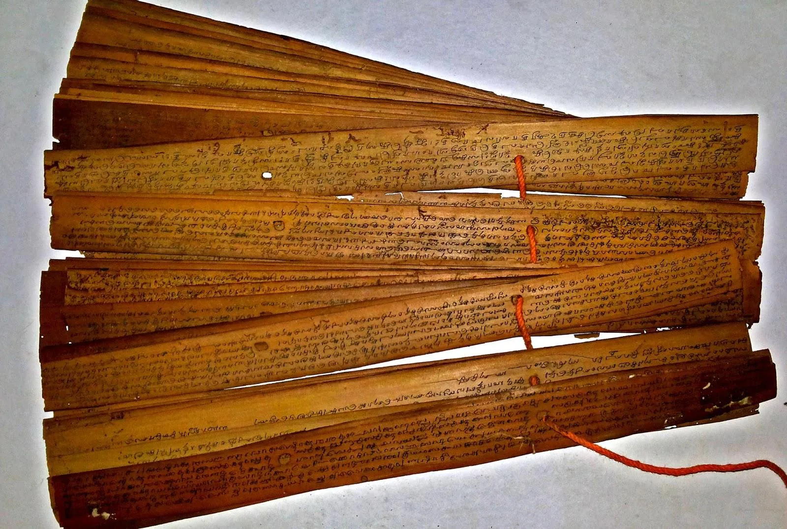

## 2. 部派分裂：上座部与大众部

**第二次结集（佛灭后100年，约前386年）**：
佛教内部首次分裂——**上座部（长老派）** 和 **大众部（多数派）**。

**上座部以资深长老比丘为主：**
1. 坚持原始佛陀教法。
2. 坚持先证阿罗汉果（先自证/自渡）。
3. 视《阿含经》为终极权威。

**大众部代表多数青年比丘、在家信众和边缘地区信众：**
1. 主张革新，适应时代，允许简化戒律。
2. 批评上座部追求个人解脱是“自私”，不主动渡化众生。提出“菩萨”概念。
3. 开始神化佛陀。

**大众部在教义方面提出创新：**
1. **神化佛陀**：提出“法身”概念，认为佛陀是永恒存在的真理本体，主张佛陀全知全能（在佛经中增补大量佛陀前世如《本生经》的神通事迹，强化其超凡性）。
2. 鼓励对佛陀遗物、象征物的崇拜，认为可得功德。发展“念佛”修行，强调忆念佛陀功德。
3. 提出**心性本净论**：认为众生的心本清净，认为解脱是恢复本性而非“获得”清净。该观点成为后续“众生皆具佛性”的基础。
4. 认为阿罗汉果不如“佛果”圆满，只是“弟子位”；提出“菩萨道”普渡众生，认为菩萨（未来佛）的修行比阿罗汉更殊胜，强调“利他”而非仅“自渡”。

**上座部的立场（一）：**
严格遵循原始佛教“无我”与“解脱道”框架，反对神化佛陀，反对菩萨道理念。
1. 坚持“无我”原则：佛陀是觉悟者，非神性存在，其伟大在于发现真理而非创造真理。
2. 认为神化佛陀会导致信仰取代实修。“若执佛为救世主，则戒定慧三学荒废。”
3. 阿罗汉已断尽烦恼，与佛陀在解脱境界上平等（差异仅在智慧广度）。
4. 批评菩萨道“有我论”违背“无我”核心教义，追求“佛果”本质是另一种贪欲。真正的解脱应破除“我执”，连“渡众生”的执着也需舍弃。
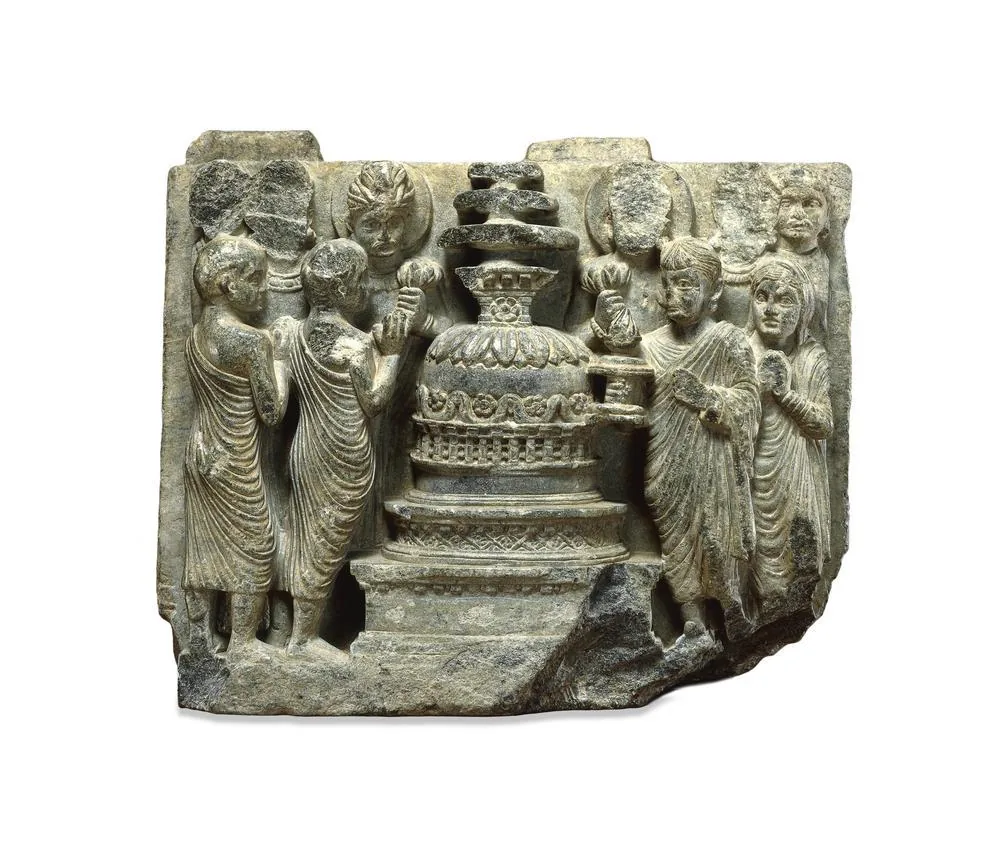

**上座部的立场（二）：**
1. 批评菩萨道“不切实际”：
> 1) 没有现实验证，修行者无法确认自己是否在“菩萨道”上。
> 2) 以“未来(世)成佛”为借口，延缓当下精进。
> 3) 菩萨道有意保留烦恼以轮回渡众，违背佛教“断烦恼”的根本目标，以渡生之名行贪欲之实。“未断结者，欲断他结，终无是处。”
2. 菩萨道强调“积累福德资粮”，易演变为追求形式化供养（如盲目建寺造像）、将“利他”工具化（为功德而行善，而非发心）。“执着善行，亦是束缚。”
3. 菩萨道允许凡夫发菩提心，但凡夫缺乏智慧辨别真正的利他行为，可能造成“好心办坏事”。应先自证/自渡/自精进。

## 3. 大乘佛教的兴起与演变

**大乘佛教继承和发展了大众部的部分教义，于公元1世纪后成体系。** 大乘将上座部等佛教贬为“自了汉”、“小乘”，自称“大乘”。大乘强调拯救一切众生，旨在解决更广泛的众生根器问题，为不同根器众生提供适应性法门。

**早期大乘（1-3世纪）**：
核心特点：批评上座部，确立菩萨道、空性思想，推动佛教平民化。主要新观点：
1. 菩萨道：修行目标从阿罗汉转向成佛，强调“普度众生”。
2. 空性思想：提出“一切法空”，首次将“空”扩展至一切法。
3. 佛身论：提出“法身”概念，认为佛陀是宇宙真理的化身。
4. 净土论：提出“净土（极乐净土、极乐世界）”概念，认为佛陀可创造净土接引众生，提出佛菩萨愿力成就净土。
5. 易行道与他力救济：提出依靠佛菩萨的愿力加持，通过简易的修行方法（如念佛往生、持咒消灾、忏悔灭罪等）快速获得解脱或往生净土的修行路径。

**中期大乘（4-6世纪）**：
核心特点：体系化空性思想，发展唯识学，确立“末法”观念。主要新观点：
1. **中观学派**：彻底否定一切对立概念，连“空”本身亦不可执，否定一切修行果位执着。
2. **唯识学派**：主张“万法唯识”，认为一切现象都由意识变现出来，所以虚假，不是实在的。
3. **如来藏思想**：认为众生本具清净佛性。《维摩诘经》提出“唯心净土”，将往生净土归于心性，“心净则佛土净”。
4. **末法时代**：明确划分正法、像法、末法三期，为“易行道”提供合理化依据——称是佛陀为适应不同时代众生根器而隐秘传授的教义。称外道兴盛是因“末法魔强法弱”，激励信徒坚守大乘。

**后期大乘（7世纪后）**：
核心特点：密教化，强调即身成佛，融合印度教仪轨。主要新观点：
1. **密教**：主张“即身成佛”，通过结手印、诵真言、观想本尊的方式与佛相应，将凡夫身直接转化为佛身。引入曼荼罗、真言（咒语）、灌顶等仪轨。
2. **佛性论深化**：提出“众生即佛”，烦恼即菩提，转化欲望为修行能量。
3. **易行道极致化**：彻底否定自力修行，往生完全由佛力决定，与修行者行为无关，“信心即往生”、“信即得救”、“一念往生”、“十念必生”。救度无条件，恶人直接往生。

## 4. 核心教义的分歧对比
**因果与轮回：**
- 原始佛教强调现世修行证果，证阿罗汉果，断烦恼、彻底脱离轮回。
- 大乘主张未来成佛，证未来佛果，以菩萨行愿主动入轮回，直到渡尽众生。

**修行核心与发心：**
- 原始佛教以“自证解脱”为核心，随缘利他（非必要），应机施教。“自未渡不能渡他”，不主动发愿普渡一切众生。
- 大乘主张“自他共渡”，甚至将普渡众生置于个人解脱之上，要“菩萨发心”，主张“无休止菩萨行”的“无尽誓愿”。

**佛陀观与净土观：**
- 原始佛教中佛陀明确反对被神化，否定自己“恒常不变”，认为自己只是“人间导师”“我也是人”，且涅槃后不再以任何形式常住世间。并无“净土”概念。
- 大乘提出佛陀“法身”概念，将佛陀升华为宇宙性真理化身，与空性、法界等同，永恒普遍。净土是佛愿力所成。

**解脱路径与自力：**
- 原始佛教的解脱之道虽普适，但根器利者可直指核心，钝根者则需次第修习。并强调无论根器利钝都当**自力修行**——“汝当自努力，如来唯导师”。
- 大乘为适应众生根器，开创简易方便法门。并主张“可仰仗阿弥陀佛愿力往生净土”，甚至彻底否定自力。

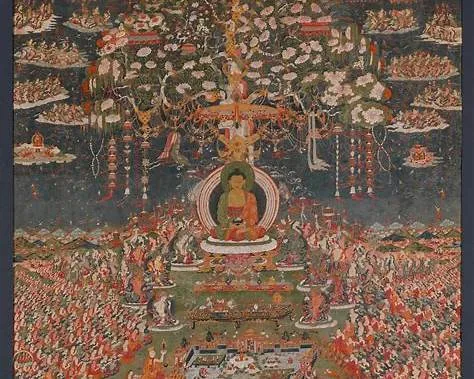

**无我与佛性：**
- 原始佛教强调“无我”，主张众生仅是“色受想行识”五蕴的和合，“众生是未解脱的凡夫”，需断五蕴以解脱，彻底否定本体（如梵我、神我）。
- 大乘主张“众生本具佛性”，众生是未觉悟的佛，肯定本体，需向内返观自性，返本还源。

**业力与忏悔：**
- 原始佛教讲“业必受报”，即使忏悔可减轻，但无法完全消除。
- 大乘提出“罪性本空”，允许通过忏悔、诵经完全灭除重罪。

**相互评价（对立场认知）：**
> **大乘认为原始教派：**
> 只求个人解脱，没有普渡众生的心；对钝根众生摄受不足，没有简单方法。
> 
> **原始教派认为大乘：**
> 非佛亲说，后世伪造；违背佛陀“我也是人”的原始教导；依赖“念佛往生”、“本尊加持”，弱化自力修行；空性论导致虚无主义，破坏业报伦理。

## 5. 结尾

最后，以佛陀留下的原始教导作为结尾：
> “汝当自努力，如来唯导师。”
> ——《法句经》（前5-前3世纪）
