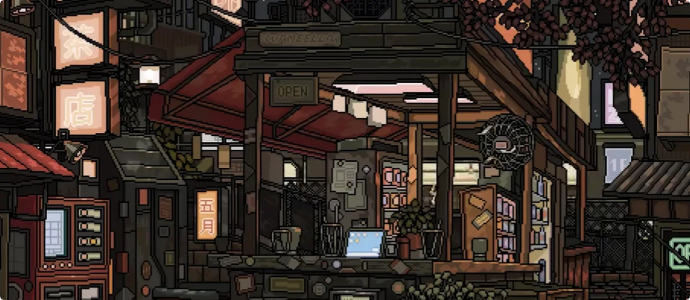
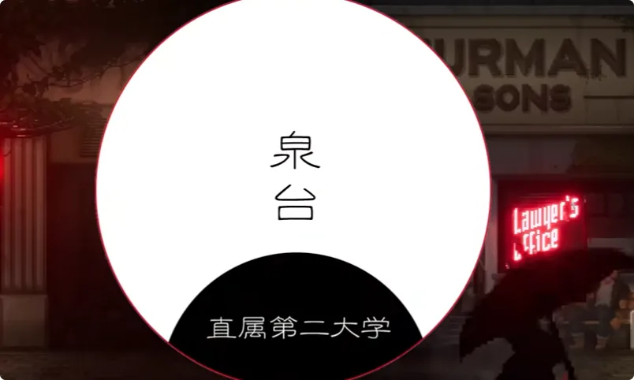
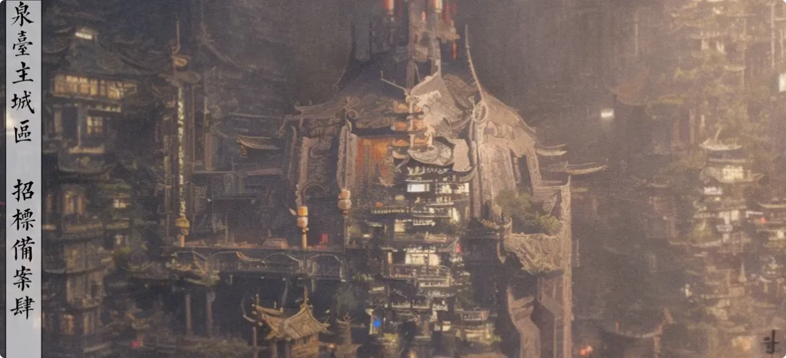
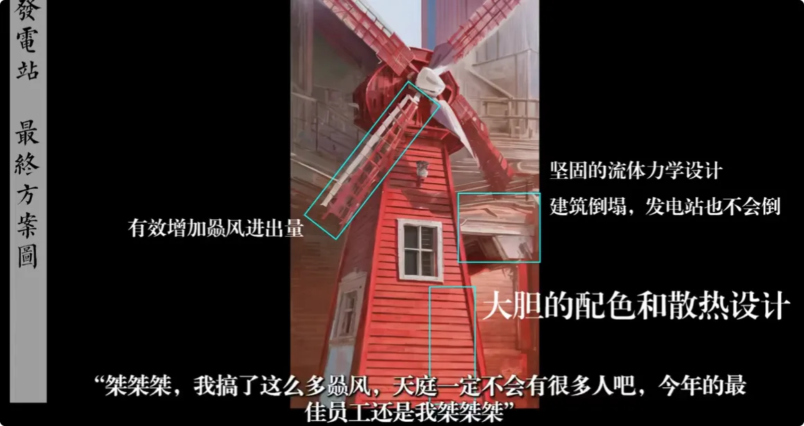
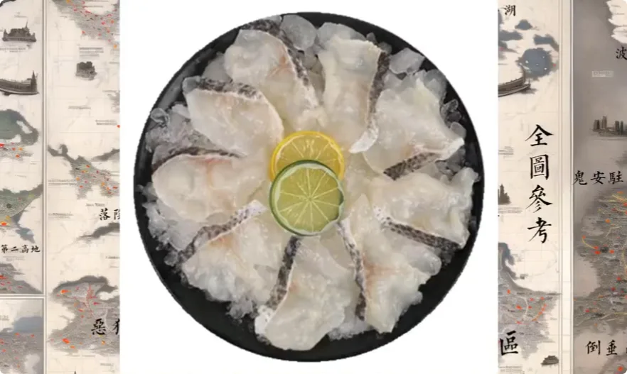
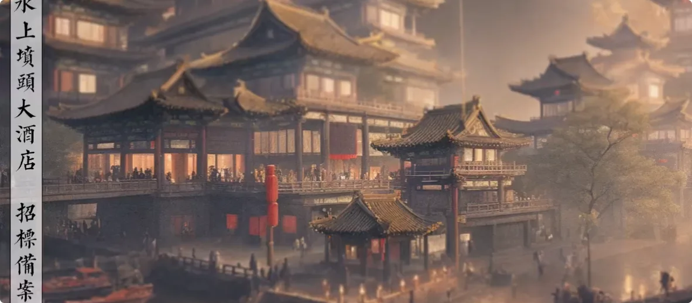
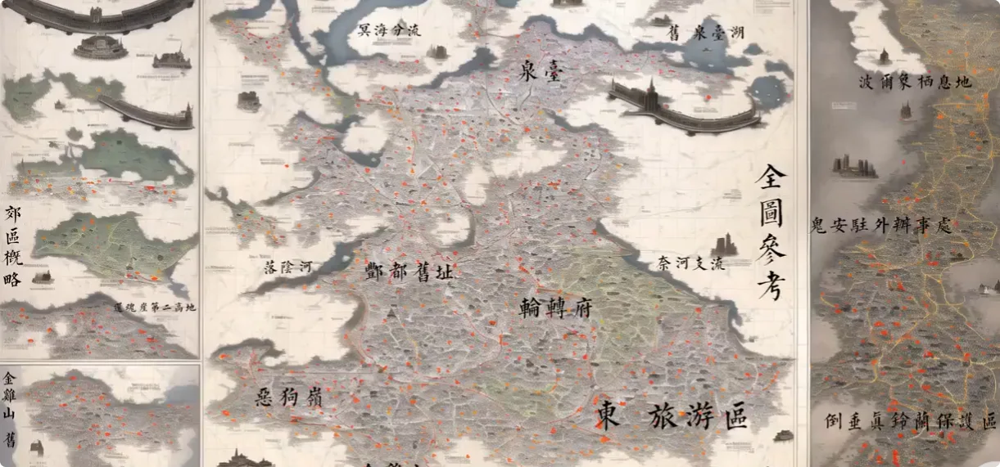
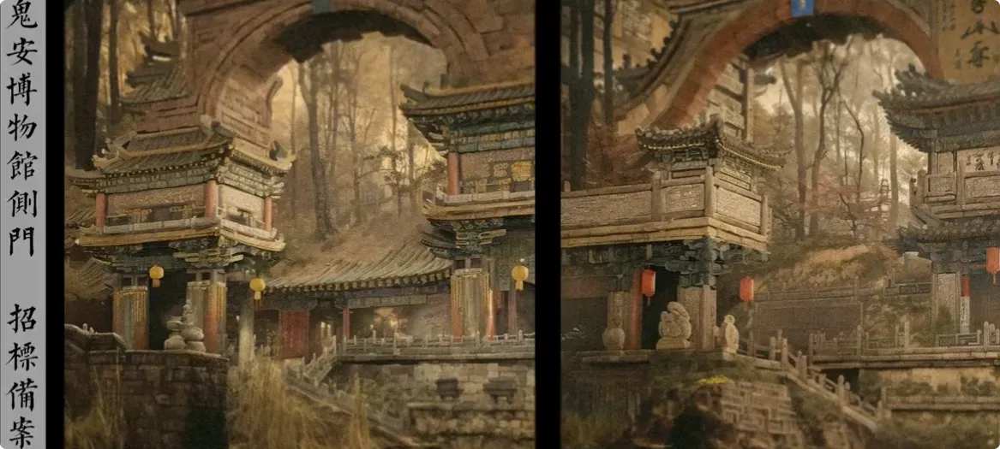
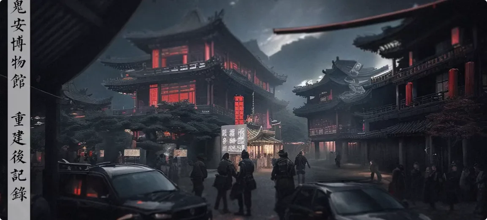

> 本页为「阴间社会观察」6 篇的合订本；原文章链接会自动跳转到本页。

## 节庆:阴间人不过阳节

## 公司查封与轮岗缘由

我之前提过公司有个同事，叫安安，是个前台鬼，挺漂亮，就是脑子不太行。好在家里还有点钱撑场面，十岁来就做坟头，相当于就在我们公司养老了。

七夕前几天，我们老板说这样下去不行，公司开的旅游业务怎么可能有生意。他想了一个办法，要在公司大堂悬挂我们公司的优秀案例和业绩。

我寻思这也简单，无非拍点客户合影，挂几个坟头的改造图之类的；实在不行，去阳间拍点照片，骗一下底下鬼也可以。很简单的事情交给前台了。

她思来想去，也想出一个很天才的方案：

>*把公司的档案室给撬了，把优质客户的档案贴门口了。*

我们公司之前不是被一个游客举报食品安全问题，那个游客出院了又给我们举报了，说我们涉嫌走私阴间鬼口，甚至还要明目张胆地拿出来做菜，实在太嚣张。

所以我们公司第二次被查封。

我还以为能再摸几天鱼，结果查封之后，公司说我们这群出外勤的闲着也是闲着，刚好去轮岗。累得我回来才敢和你们聊聊阴间过节那些事儿。

## 阴间节日总述

阴间有一些节日我不能说，因为那些词我在阳间读不出来，内容也不太适合给阳间人听。能说的节日，首先是阴间和阳间有相同的节日。

但像元旦、春节之类是没有的，太吉利了。按照阴间人那个体质，挂个红灯笼底下都得死一片。

而且早些时候年兽是躲在底下的，过年多少有点挑衅人家。

基本上大节就是中元、七夕，清明在底下叫清寂，中秋在底下叫拜月，还有一个上巳节。我国上巳这几十年很少有大活动了，基本上看各个片区心情。

有些小节基本上就是各地区的保留民俗或者小活动，像川罗湖附近的百花祭、漳河游船、北冥海地区拜地腔、中部地区长河日躲大喜。我只能说见识过，但玩法太抽象，就不喜欢参加。

## 长河日与地区小节

比如这个长河日早年间怎么玩？

**你得把自己身上涂上油，然后裹着大铜叶把自己包起来，头上留一个小口，在口上插一个拨浪鼓。接着你在河边一边跳，一边往前摇头拨浪鼓。**

拨浪鼓越响，你身上的祥瑞就去除得越干净。

为什么说这是早年间的玩法？

>因为这玩意是本地鬼骗外地佬的，是瞎编出来的。长河日实际的玩法是以骗外乡鬼取乐，骗来的外乡鬼越多，本地的晦气越重。严重怀疑这群家伙是走歪道，建议鬼案调查一下。

## 阴间节令计算方式

除此之外，和阳间不太相同的是，阴间的节日不是按照日历来的，阴间的节令计算方式很复杂。

这些我瞄过一眼，好像是根据月亮历的月末天数减去地藏生辰得出的余数，再除去每年冥府玉历的新年时间，得出一个数。

这个数是每年的大阴数，然后用阳间的节庆日和大阴数比对，得出每个节日对应的日子。后面一步的具体算法没查到，之前去问也没问到，反正复杂得很。

每年都有自以为掌握了算法的新鬼，提前准备好过节，结果就是穿着奇装异服被狠狠嘲笑。所以刚下去的时候看看日历过节就行，别自己瞎想。

## 七夕夹在中元之间的混乱

就是因为这个复杂的系统，今年阴间的七夕夹在两天中元之间，导致旅游区和自然景区特别混乱。

我轮岗那两天，看得最多的就是小两口在忘川河卿卿我我，说下辈子一定要做兄妹，然后双双拿着花烛投河，沿着河道顺流而下。而且还不是一两个，是排队跳。观感就和流水面差不多，就是丢在竹筒里头顺流而下的那种面。

七夕在阴间是非常重要的节日。因为只有一天，所以基本上各个区都是强制休假；没法休假就必须轮岗，而且一个鬼不能在岗超过一个半时辰，也就是三小时。之前确实有个不开眼的老板想着七夕的时候加班卖东西不是暴赚吗？

然后那位兄台现在还挂在百鬼丸的拷问所里。要不是被拉去轮岗，其实我蛮喜欢去底下过节的。阴间玩的东西比阳间多，就七夕保留节目，少说有四五个：游公子、焚点花仙灯笼、边结云神，还有在奈落山天河溪流附近放飞鸿鹄纸鸢的夜间活动。小情侣一般就跑去忘川河畔还有阴山求来生的姻缘。

## 各地七夕仪式：忘川河、月老坟与百花神

这还只是轮转城的节目，底下楚江城的好像又不一样。因为七夕算是唯一一个可以左右下辈子转生的节日。

市区这边是男女鬼在忘川河畔结伴之后，互相许下誓言，要下辈子做兄妹；然后跨过用彼岸花和铃兰编成的结缘绳，把写着生辰八字的纸包在石头外面，去砸月老的坟头。石头碎了，就代表下辈子有戏；没碎，明年再来吧。

偏远一点的地方，这个仪式不太一样。我知道在川罗湖那一块，那边是让定终身的情侣都蒙住头，然后牵手过花海。

这里的花海指的是用花瓣铺满一整条很浅的溪流。过完花海之后，各拿一支白蜡烛，点燃之后倒着握，然后一直走到百花神的神祠里头去，最后插在竹盘里。如果中间蜡烛没熄灭，那么就算是成；熄灭了，就等明年再来。

## 落英河倒灌与鱼转世事故

川罗湖这地方还是我刚做中间人的时候去过一次，邪门得很。百花神的事情，要等过了保密期才可以聊。今年七夕比去年乱一些，毕竟是个夹在两天中元之间的日子，但比几年前的七夕好多了。

具体哪一年我忘了，也不好去查。反正之前有一年七夕赶上落英河堵塞，支流的水直接倒灌回望川河主脉，河边排队的小情侣就直接跑水里。

落英河那边本来就是大王杜鹃的种植地，这玩意是古法孟婆汤的原料之一。后果就是那群小情侣全都忘记了定下的姻缘，变得乱七八糟。有些人牵着自己的伴侣下水，从水里出来之后，手上抓条鱼还傻乐，说我有媳妇了，下辈子我有妹妹了。

后面就是姻缘司过来，能救的救了，执念太深了就救不了。这些能救不能救的都还好说，有的时候忘了个干净，连自己叫什么、从哪里来都不知道，一上岸就呜啊呜啊地跑了，漫山遍野都抓不到。后来鬼差一个区一个区地抓，抓了大半年才找回来不少。

到了第二年七夕的时候，我那会儿在家待着，结果有个鬼过来敲我门，问我要老婆不要。他介绍自己的妹妹给我，说她快要投胎了，就准备搞个好姻缘。我在阴间待这么多年，什么事情没见过，这种就是在七夕之后专门找那些没有姻缘的新鬼骗钱的。

所以我当机立断就开始问。结果对面提了一只鱼，就站起来说这是他妹妹。你小子逃了一年还没被抓，那我能怎么办？

我只能哄着他：这不是你妹妹，你看清楚，这是你老婆。他愣住了，看了一眼，告诉我他老婆不是罗非鱼，是白条。好家伙，你还又抓了一条是吧？

后来哄着，等鬼差来了把他带走。之后鬼差告诉我，这小子没毛病，还是忘川河里的鱼转世。去年七夕的时候给人从忘川河里逮住了，结果意外死亡，申报的虚功德就给转生成鬼了。这种破事虽然难免秩序乱，毕竟鬼那么多还都扎堆，但是七夕确实是好玩。

## 祈月：没有对象的鬼的七夕祈愿

除开上面说的活动，还有个专门给没对象的鬼准备的。我不清楚阳间历史上有没有这个活动，底下叫祈月。因为拜月节就是中秋的时候，是月亮历最重要的日子。

月亮是全年中最亮的时候，而且没有云层挡着。相传这一天天庭上面神仙出游，天宫空缺，然后月光晃白，鬼阴气很重。所以这一天底下的活动叫祈月，就是举行仪式，借月亮的阴气给阴间增加功德。

七夕这天底下是小满月，天宫初巡汇聚银河鹊桥，只留下月老在空中，所以对月祈求月老保佑来世可以寻得好姻缘。

当然了，说得很好听是祈求，实际上仪式和威胁差不多：一群鬼顶着牛郎织女的面具，头顶贴着自己的生辰八字祭文，用阳间话来说就是，月老，你也不想再出个牛郎织女这样的故事，你也不想再被世人骂，那就给我找姻缘来。

以前这仪式可能确实挺有用，但现在不好说。一群新鬼都在底下准备定居了，都不准备转世了，也进去凑热闹，就显得没必要了。所以下去玩的时候看看就得了，别进去瞎玩。

## 中元节：鬼门、河灯与秩序

相比之下，七夕算是好的。中元的秩序更多，因为是全阴间一起的大节日，所以冥界地狱皇权的鬼也会来地府，鬼吼特别多。而且中元的玩法很少，基本上没有特殊活动，所以鬼就更容易聚集在旅游区之类的地方。

顺带一提，阳间的中元是一天，阴间的中元时间是不定的，一般是1到3天，看每年算出来的数据。

基本上头一天就是会开放鬼门，阳间叫鬼门关，阴间叫还阳坎，我们中间人习惯叫还乡排。这个只有第一天开放。因为中元节每年算出来的时间和阳间基本都是对应的，所以没什么问题。

不过每年都有新下来的鬼还留恋阳间的事情，结果错过了关闭时间，就困在上面了。

困在上面就成了孤魂野鬼，只能附身在河灯上面，等到河灯自然熄灭了才能到底下来。每年都有从这个河灯里被搞下来的鬼，一回到阴间话都不会说了，被吓傻了。之前有一个下来之后就开始哭，后来哄了半天不顶用，给了一巴掌才安静，支支吾吾话都说不利索。最后核对一看，嘿，弄错了，这家伙还没死。是在阳间喝醉了，从河灯上掉下来的，最后老老实实送回去了。所以阳间人喝醉了不要瞎跑，给底下增加负担。

## 丰都纪念碑避雷针事故

今年中元治安相比去年要好不少，可能是因为把我拉去轮岗了。去年我玩的时候发生一件事，就是丰都城区里头有个纪念碑。

最早这个区块是边角，所以当初设计的时候就有考虑过引天雷下来，纪念碑顶上就有一根巨大避雷针，这样就不会打到主城区。后来城区各种改建扩建，这个纪念碑的位置就成了现在市中心形。

那天有个玩风筝的老鬼，不知道是怎么想的，可能是觉得传统风筝不够刺激、飞得不够高，就拿五个风筝拼在一起，然后趁着中元刮大阴风的时候去放风筝。结果就是风太大了，这老哥被绑在风筝上飞起来了，一直就飞在纪念碑上，就挂在那个避雷针顶上了。主城区加上中元鬼多，就没法上去给他弄下来。好死不死碰上打雷，一道天雷下来，这老鬼就碎了。

他碎了没事，后面石头碎块还能勉强救回来。问题是他风筝被打了之后着火了，纪念碑成了火炬树。

然后几个冥界那边来的游客一看，说这个地府的习俗和我们一样，就跪在地上开始拜纪念碑。新下来的鬼不清楚底下的规矩，看到有鬼在拜，他们也学了起来。本地人一看，这是什么现实的功德活动，我怎么不知道，然后也开始拜了。

鬼越来越多，后面的鬼就以讹传讹，说还有这种好事，中元节不仅放假还加功德。最后的结果就是一整个主城区的鬼口一下子爆满，交通完全瘫痪。

为什么我知道这么清楚？因为我当时坐在纪念碑底下吃东西。低头嗦面，抬头就看到几个洋鬼在拜。

我还在嗦面，抬头我还以为我要被超度了，那么多鬼从我面前过。完了还有本地佬问我为什么只是坐在那里。废话，我在吃面啊。最可气的是轮岗的鬼差好不容易从鬼圈里挤进来把我带走了，问我为什么要在避雷针顶上纵火，还搞这种跪拜活动。那我能怎么说？

我只能说我是雷电天尊尼古拉·特斯拉亲传弟子、女巫防火材料学优秀毕业生。

阴间有大劫难，特地向丰都申请，测试一下丰都的避雷针防火性能如何。最后给我关了三天，等那个玩风筝的老鬼被救活了才给我放出来。对于这事儿，我只能说百鬼丸里的伙食还不错，这三天受益匪浅，有机会再进去盛饭吃。

## 中元直播、演出与不宜游玩

说回这个中元节，中元是非常不适合下来游玩的节日。一个是阴气重、鬼口多，还有一个就是真没啥活动。阳间一般是点河灯、跳天灯、祭祖、渡孤魂啥的。阴间最主要的活动就是看阳间搞这些东西。第一天还阳坎开门，然后要回去就回去；

不回去一般就聚在城区里，每个城区都会搞阳间的中元节直播。如果阴阳时间对不上，那就用录播。大家都会去买那种最次的骨灰，因为带筷能磕，完了之后搞点别的小零食，就站在广场上看乐子。

阴间直播不仅能看到阳间，还能看到阴间人在阳间的影响，主要看谁家的鬼今年又没抢到祭品，谁家子孙在阳间仪式又搞错，弄得家里祖先没饭吃了。

发展到后面，因为阳间已经不咋过中元了，底下的关注点就变得越来越奇怪，都在赌黄羊的那些鬼因为没吃到祭品会不会闹事，玩了多久会被鬼王强行逮下来。

除开这个，就是每年在金鸡山公务圈附近或者大厅表演。这个非常不建议阳间观看。一个是看不懂，因为表演里大多是纯阴间的节目，阳间听都没听过那种节目，看的也多半是一脸懵逼。还有一个就是太晦气了。

像今年演出里就有一个小节目，我估计是几个没去过阳间的老鬼琢磨出来的，叫什么晴天娃娃。表演的就是找一群吊死鬼挂在舞台上面，完了表演到一半把头扯下来，身子在底下跳舞，头挂在顶棚上唱歌，说是这样视听效果很好。那群老鬼还在表演的时候问我们这群中间人，很得意地说，你们看这是不是和阳间的表演一样。和疯子一样，又不能骂人家，要不然等于说我拿了阳间的回扣在这骂人家，只能顺着说。

所以明年我是肯定不会去看演出的，谁知道这几位信心大增之后，还能搞出什么天才想法。

## 中秋与清明

能说的有点意思，其实就这两个节日。像中秋，那就比较无聊，纯粹的长功德日子。清明就不能说了，因为涉嫌保密的东西太多，很多活动都是不允许死期不满三年的鬼参加的。

而且清明最主要的事务，就是从阳间收东西。这个在之前的功德基那一期提过。

## 考编:地府编制的考取和选择

前两期已经说了如何刷功德，以及如何报考阴间大学。这一期带大家了解怎么才能成功进入阴间编制队伍，以及进哪一个部门比较好。提前说明，本期没有收来自阴间的汇款，本次推荐全凭良心。

## 阴间编制考试：报考流程与考核内容

首先了解阴间公务员报考。

与高考不同，阴间编制考试每个月月中都可以进行报考审核。得益于阴间大数据系统多次崩溃，现在审查案底非常快速，所有鬼档案基本都是白的。所以每个月中找到热门部门，到了月底就能收到是否录用的通知。

考试内容基本是笔试考相关知识，面试看面相、掌纹，孽镜台绕一圈看心理承受能力，最后家族审核看阳间坟头风水对岗位有没有影响。个别部门会有比较特殊的考核，后面单独说。

## 百鬼丸办公室：钟馗直属驱魔机构

直接推荐这几十年比较稳定好考的岗位。首先是钟馗直属、阴间最大的驱魔机构**百鬼丸办公室**。百鬼丸前身是阴司拷问所，之后跨国办案时，和黄泉国那边合作临时建立。

它原本被废弃了一段时间，一直很闲。后来因为阴间全球化发展进程加快，传统抓捕系统和转生逻辑无法震慑住那些放肆的鬼或妖，所以干脆把阴司拷问所合并进来，并让元音寺主理人钟馗担任百鬼丸的领导。

百鬼丸下面有很多零碎小部门，这里推荐两个比较轻松愉快、福利又高的工作地点。

## 阴司拷问所：审讯与用刑岗位

第一个是合并但没有消失的**阴司拷问所**。拷问所一听就明白，就是负责审讯和用刑的地方。目前比较火热的岗位有以下几个：

- **铁处女刑力度测试员**：这个岗位一直空缺，福利待遇也非常高，每月有固定底薪，提成按次数结算，标准是各地办事单位的一级工资水平。招聘要求只有两个：声音大、身体强壮。每个月都可以拿大量福利和底薪，在岗位上平时啥也不干，等到需要用这个刑具的时候工作一次就行，非常划算，适合啥也不会、没有一技之长的鬼考虑。印象里抚恤金好像也给得特别多。

- **波尔像饲养员**：波尔像各位可能都知道，就是吃鬼的妖怪，平时需要饲养管理。以前因为杂交水平和优选育种技术不到位，一直有饲养员变成饲料的事件。最近地府花重金打造了一批专用口罩，算是解决了饲养员被吃时惨叫声太大，导致波尔像心理状态堪忧的困扰。现在报考这个岗位还算不错，平时和妖兽玩耍一下，撸撸妖兽，到饭点提前把准备的饲料拿出来就行，非常轻松愉快。工资待遇基本是各地办事单位的二级工资水平，但允许兼职，是地府唯一一个允许兼职的编制工作。想一边工作一边积功德、谋转升的小伙伴可以考虑。

- **物资管理员**：这个工作可以说因为太过于“吉利”而导致稍有鬼趣。工作内容很可怕，就是把阳间烧来的东西归类整理，之后拷问需要时及时调出来。基本是大别墅的无名房产证、豪车钥匙、金条银条、召唤女仆的鬼符、阳间自助餐券之类。别以为都是好东西就能偷着拿来用，能被归类到阴司的玩意儿全都是开过光的。上一任就有个管理员没忍住诱惑，抱了一箱招女仆鬼符回家，之后尸骨找到时基本呈现骨灰状态，非常吓人，一看就是因为太过于“吉利”被净化没了。但这个岗位高福利、高工资，全部都是一级工资水平，而且每周有三天的法定假期和一天的心理状态调休日，相当于每周工作三天，适合忍得住诱惑的小伙伴报考。

## 判鬼厅：专案员与判鬼员的区别

除开阴司拷问所，还有一个部门也非常赞，是和阎罗殿合作共建的**判鬼厅**。判鬼厅历史悠久，之前一直是阎罗殿直属，后来为了适应新时代，就和百鬼丸这边合作了。如果有兴趣，可以考虑报考**判鬼专案员**。记住，是专案员，不是普通判鬼员，这个非常重要。判鬼员是直属判官底下的独立工作人员，面对的案情都非常复杂；专案员则负责审问和调查被百鬼丸抓到的鬼，二者工作性质完全不一样。

> 专案员平时遇到的案子基本是这样的：小明杀了小红，但小明通过刷功德洗刷罪孽，在阴间又因为偷骨灰被抓。请问小明怎么判？很简单，因为偷窃骨灰被抓就判偷窃，不然我都会判。
>
> 判鬼员平时遇到的案子则是这样的：张三因为李四的女朋友漂亮，所以一刀杀了李四。没想到李四的女朋友为贞洁投河自尽，感动上天，一个雷劈死了张三。但张三查询自己的阳寿还剩十五年，所以提出还阳。可是此时他阳间的尸体已经火化。万念俱灰的张三准备投忘川河自尽，结果遇到要去转生的李四情侣，恨从心头起，恶向胆边生，于是直接把李四情侣两人踢下忘川河。请问此时忘川河里被砸死的鱼，是否可以享受意外死亡保险转生人间岛？是的，这个案子的鱼是在阳间被砸死，来到忘川河又死了一次，属于水意申报的案子，这怎么办？我哪知道怎么办。

所以千万要认准报考判鬼专案员，每天做的事就是吃瓜判案，然后拿工资。工资待遇是各地办事单位的二级工资水平。但有的时候，被抓的鬼会有一些骨灰或房子被充公，基本上就是直接发给庄园处理了。多的就不说，免得我之后下去又……

## 鬼门关安全局：危险与机遇并存的铁饭碗

有的小伙伴不太喜欢判案、喂饲料这些工作，就喜欢危险和机遇并存的工作。提到危险和机遇，就不得不提鬼门关直属、阴间唯一护卫机构、千年编制稳定铁饭碗——**鬼门关安全局**。

鬼门关安全局非常带劲，是阴间阳间冲突最大的地方。最早是因为项羽 aka 江东大帝哥下去之后说要搞个新阴间，所以直接带兵把阴间扫荡了一遍。之后虽然被安抚，老老实实转生去了，但为了应对之后可能还会有的情况，就成立了鬼门关安全局。早年间叫鬼门关边防站，后来才改的名字。

## 关外安全员：高风险、高装备、高缴获

鬼门关安全局内最有机遇的工作有两个，一个是**关外安全员**。

这个工作比较危险，基本上是四鬼一组在鬼门关附近巡查，每天清妖兽、去泉台赶赶人，再去二狗岭和金鸡山查看有没有外来生物入侵，有的话杀了就行。

**危险系数高**，主要是因为二狗岭那一块生态环境比较好。之前有鬼从地狱那边走私一堆怪物过来，结果没到鬼门关就死了，走失的怪兽满山遍野跑，抓不完。这几年三头犬袭鬼事件和奇美拉破坏地形事件层出不穷，所以要求关外安全员进行扑杀和剿灭。

危险的工作有相匹配的装备。关外安全员一般配备阴间直属十八式霰弹纸枪、阴间机械二十五式半自动纸枪，配发朱砂弹和镀银独头弹；近身鬼员一般会配有热能簧手刀和带符纸发射装甲的护盾。虽然面对十几米高的三头犬显得有那么一点儿童玩具，但好歹也是正经装备。

要考去什么酆都护卫局，就只给你发一根铁棒没了。而且这份工作回报特别高，除了一级工资以外，在办事过程中所缴获的所有东西都可以保留三分之一。杀个奇美拉，就给你一箱子鸡毛；杀个三头犬，就找个中间人给你烧两个洞堡。属于多劳多得，并且全凭自身实力的工作。

## 忘川河洛阴河段水库检测与管理员：清闲、攒功德

如果要不那么危险，但又机遇闷声发大财的工作，那就看看每年只招聘一次的**忘川河洛阴河段水库检测与管理员**。

本来忘川河的管理工作是阴间渔业局在做，但因为之前阎罗殿和酆都学院扩建，把忘川河改道了。现在最大的支流是从原来的高里山阴司溪口分流过来，经过岱山河、二狗岭，叫做洛阴河段。

更具体的内容等之后的旅游指南再说，这期稍微提一嘴。反正改道之后，各种鸡毛骨粉的事情就一堆，干脆不做统一管理，直接由各个分流和河段的水利部门独立管理。

这个工作最大的好处就是清闲。每天检测一下水体亡魂数量是否正常，看看河里有没有和鱼一起顺流而下的鬼，以及有没有在岸边放生220伏天雷的鬼。我之前去鬼门关审批渡牒时，和那边工作的老鬼聊过，每天就是坐在河边钓鱼赶鬼，啥事也没有，而且经常有投河的。

顺手捞债，就是功德已减，可以说最大的好处就是攒功德快，非常适合有闲心的小伙伴报考。工资待遇是二级工资水平，家里超过五个鬼要养的就别考虑了。

报考这个岗位要注意，除开最开始提到的考核内容外，还要考核鬼体完整程度，以及来阴间时候的尸体状态，基本上要求身体没有伤口。具体原因是为啥也不太清楚，可能和河里的语种有关吧，但总不可能把鬼丢下去打窝，不合理不合理。

## 黄泉崖转生办事处：高地位、高仕途与孟婆汤门槛

有的小伙伴可能对以上职业都不满意，想去那种仕途明朗而且社会地位高的岗位，最好还是摇摇骨头就能进的那种，还真有推荐。提到仕途明朗和地位高，还得看**黄泉崖转生办事处**。

这个转生办事处只有黄泉崖一个定点单位，基本上干十年能混上个转生审批鬼，干百年能成为黄泉崖主理鬼，和地藏王那边直接对接完全没有问题。社会地位更是整个阴间第一梯队，和骨灰精制黄纸审核共称阴间平鬼的三大天花板。

## 转生办事员的待遇、权限与隐藏风险

成为办事员，不仅工资待遇是一级水平，更可以无限次使用并且记录孽镜台影像，还能直接要求中间人从阳间烧证物下去，以及不用审批就能进入各个办公场所，抓着里头办事鬼问他们为什么这个月转生的鬼那么少，并且可以提出补贴和赔偿，可以说是离谱到没编的一个职业。

这么离谱的职业为啥没人考？因为转生办事员可以申请转生鬼少的补贴和赔偿，而黄泉崖每个月都有浮动的转生指标，要是没到，是会把转生员丢出去投胎的。

前几年阴间发展不是特别好，很多鬼不转生，导致那几年的黄泉崖转生办事处每个月都得洗牌子，连保洁都被拿出去转生。所以一度怀疑在阴间散布“阳间好”的言论，就是这群鬼说的。说回这个转生办事处，这几年转生数量还是比较稳定的，强制转生的事情少太多了，所以很推荐家庭条件不算好的小伙伴冲一下这个编制。

## 孟婆汤面试与阳间杂货铺应对法

这个编制也有特殊审核要求。面试的时候先喝半瓶孟婆汤原浆再考试，考完之后再喝半瓶原浆，然后问你参加考试了吗。

不过不用担心，既然敢推荐，肯定有方法越过这个门槛。下去以后，提前三天去黄泉崖，在转生办对面有一家师兄开的阳间杂货铺，专门卖勾起阳间念想的玩意儿。

过去之后和老板说是推荐来的，要考试，老板就会准备两包纯咖啡因和一包红色封皮的小本子。磕两包之后，把小本子塞口袋里进去，孟婆汤就没用了。当然还是稍微装一下，问你问题的时候愣一下再回答会比较真。最后出来后，记得在正式工作前把本子退回去，退点冥币回来。

## 后续内容与评论区招募

基本上这几年比较推荐的编制工作就这么些。还有一些比较零散的各地特色行业，会在之后的旅游指南里和各位做细致解读。如果有其他单位的鬼想要招收后辈，可以直接在评论区发出来，也让大家多参考参考，找到最适合自己的阴间之道。本期就到此为止，我们下期再见。

## 就业_阴间大学的招生与专业前景

> 原视频《阴间就业指南——阴间大学的招生与专业前景》，作者林晓丁，发布于 2022 年 9 月 9 日。([Bilibili](https://search.bilibili.com/all?keyword=%E6%8B%9B%E7%94%9F%E5%B0%B1%E4%B8%9A&utm_source=chatgpt.com "招生就业-哔哩哔哩_bilibili"))
> 
> _**刚下去不知道该直接工作、等待转生，还是先考个阴间学历？这一期就来聊聊阴间大学怎么报、学校怎么选，以及哪些专业真正“好就业”。**_

## 1. 阴间大学怎么报考：一年一次，九月开招

积了大阴德。

上一期咱们聊了刷功德的事，刚好这两天不少刚刚下去的小伙伴都给我托梦，说自己很迷茫，不知道应该直接工作之后转生，还是先在阴间大学考个文凭；如果进大学，又该选什么学校、找什么专业。

所以这一期就来谈谈**阴间大学的招生政策、报考指南，以及当代热门专业的就业前景。** 首先了解一下阴间大学的报考时间。因为和阳间存在时间差，所以折算到咱们阳间的时间，基本上是**九月中旬开始报考，九月底发布录取信息，并开始进行专业调剂。**

而且录取和报考的机会只有一次，还是比较严格的。
具体考试内容我就不提了，下去了自然就知道。

这里直接开始推荐大学和专业。

---

## 2. 第一推荐：地藏大学——阎罗殿唯一指定学府

首先还得是老牌大学：

> **千年老校——地藏大学。**

地藏大学对分数看得不算特别重，主要的**录取指标是功德**。

但各位注意，用过功德机的要小心。
因为面试的时候，学校会把你的祖宗十八代一起找来审核；已经转生的，直接通过托梦进行，梦中三方会审。
如果最后查出来存在功德造假，后果还是蛮严重的。
但你要是一个行善积德、又英年早逝的人才，那地藏大学基本属于：

> _**脑子一热就可以冲的大学。**_

### 校区不大，但图书馆大得离谱

环境建设方面，地藏大学夹在两个古战场——**望鬼坑和上一代地厅墓**——之间，所以校区比较小，交通也不算便利。

基本上你要点个外卖的话：

> **从阳间送下去，都比在阴间点来得快。**

但地藏大学拥有**全阴间最大的图书馆**。
大到什么程度？
里面有独立的导航软件，用来实时定位你现在究竟在哪。
同时，它还有全阴间最危险的**禁书阅览室**，以及大量由那些走不出图书馆的鬼的怨念化成的家伙。

我之前下去办事的时候，听一个校工说，前段时间因为导航系统更新，出现了十分钟左右的延迟。
>结果当场就出事了, 死了十几个，疯了百来个。

最后还是抓了几个教导主任祭天，才解决这事。

### 考研失败不要死磕，可以直接“重开”

校内的学术氛围还是很浓厚的。
基本上学生进来，就是冲着地藏大学的直属研究生学位去的，其中复读了几十年的：

> **大有鬼在。**

这里也分享一个小技巧。
如果第一次没考上研究生，不要灰心。

> **直接转生到人间以后光速重开。**

基于“阳寿未尽”的补偿政策，可以继承上辈子在阴间的记忆，再直接以未成年鬼的身份降分录取到地藏大学。
比死磕学位申请要快多了。

### 王牌专业：通用驱邪术的运用

提到地藏大学，就不得不提它最为离谱、也是阴间就业前景最为迷幻的专业：

> **通用驱邪术的运用。**

比起阳间的普通驱邪术，地藏大学吸收了各门各派、各个维度的不同驱邪技术。
不管对面是：
- 人；
- 鬼；
- 妖兽；
- 还是外星球居民；

都可以通过这门技术实现：

> **原地超度。**

超度的时候，蓝色火焰堪比点燃了西伯利亚天然气。

可以说是一门：

> **艺术与实用兼具的手艺。**

只要学成毕业，基本上全阴间的正规单位都可以直接报考。
平均工资与福利待遇是：

> **每年18罐纯净骨灰 + 一箱镀金黄纸。**

功德和通用冥币，则按照各地工作单位的**二级工资标准**进行发放。
\

不过对于大多数鬼而言，地藏大学还是难了一点。

接下来推荐一些简单的。

---

## 3. 第二推荐：丰都学院——校园环境最阴，阴间料理最好就业

第二推荐，就是由**轮转王担任名誉校长的丰都学院**。
丰都学院的校园建设，可以说是阴间首屈一指：

> _**每一寸土地都死过鬼，每一间宿舍的阴气和煞气都重得离谱。**_

校内还有**忘川河直达班车**和每月一次的阳间观光活动。
每年，学校还会给学生发放手工孟婆汤的购买津贴。

印象里，我上辈子参加联谊的时候，认识过一个学长。
他年年都能申请到免费的孟婆汤。
结果：

> **留级留了四百多年。**

家里卖了四座坟头，才勉强供得起学费。

### 女鬼偶像团体“红衣之女108”

除此之外，丰都学院还紧跟国际潮流，在校内组建了阴间最出名的女鬼偶像团体：

> **“红衣之女108”**

其中每一位成员，都是从都市传说和校园怪谈里精心挑选出来的。
可以说：

> **死相极惨，演出更是晦气至极。**

比起那些荒郊野岭里刨坟凑齐的贫鬼女团，视觉效果还是要好不少。
很难想象，校内学生究竟是在怎样的一种精神状态下读书的。

### 王牌专业：阴间料理

如果能进入丰都学院，除了享受这种造孽般的大学生活以外，还是应该以学业为重, 那么就可以试着申报这几年潜力最大的专业：

> **阴间料理。**

因为这几年阴间生活好了不少，鬼对生活质量的要求也在逐步提升。
坐拥大面积坟场和部分忘川河资源的丰都学院，自然也就开设了阴间料理专业。
其中对于：

> **解剖、下咒、放毒，以及料理之间的胡乱搭配**

已经达到了一种难以理解的境界。
每年阴间料理行业的招聘季，基本上**三分之一的岗位**都会留给丰都学院。
该专业毕业生工作后的平均福利，大约是：

> **每年10罐骨灰 + 两叠镀金黄纸。**

但是冥币和功德给得比较多，已经逼近各地办事单位的**一级工资水平**。
基本上属于：

> _**一个鬼，能够养活祖上三代。**_

---

## 4. 第三推荐：泉台直属第二大学——离阳间最近，王牌是“阳间交流”

第三推荐的，就是我上辈子的母校。
也是离阳间最近的大学：

> **泉台直属第二大学，简称“泉二”。**

泉二的老校区“泉一”，因为当初某位**陈姓将军**的原因已经被废弃，据说是阳气太重、过于吉利，所以后来就不用了。
现在的校区，则建立在**百鬼坑**上。
虽然晦气程度比不上丰都学院，但也已经相当不错。

而且这是整个地府距离阳间最近的地方。
也正因为如此，泉二的：

> **阳间交流专业**

可以说是阴间首屈一指。

### 校园最严重的问题：以前经常“闹人”

虽然校区环境比较一般，但一直都在建设。
每年也都稳定地抓学生祭天。
每到**中元节**的时候，校园里死得那叫一个多，整体的校园氛围特别好。

为了对标国际一流学校，去年学校还紧急修建了祠堂，并放生了一批**会吃鬼的鲛人**，同时修改了学校大门的朝向，让风水变得更凶一点。
只能说，比我当初在的时候好多了。
我读书那会儿，还经常能看到阳间走错路的老乡来找我们问路。

校园里：

> **“闹人”事件频发。**

前段时间下去看的时候，确实比以前好了不止一点。
就是不知道这些建设资金到底是哪里来的。

### 阳间交流专业真正值钱的，是“渡牒”

既然提到泉二，那就必须朝着王牌专业：

> **阳间交流**

去冲一冲。

虽然阳间交流专业毕业之后不包分配，而且工作开销以及阴阳两界来回跑的路费都要自理，但这些都是小问题。
有些不懂的学生，毕业以后傻乎乎地进了阳间旅行社，天天累死累活。
这是不对的。
正确路线应该是：

> **先把“阴阳互通渡牒”考下来。**

然后凭借渡牒注册成为**在册中间人**。
从此以后就可以：

> _**阴间、阳间，两头吃。**_

我现在这套地下十二层的房子，就是凭借自己的努力：

> **在阳间烧给自己的。**

### 为什么不读专业，直接去考证不行

有人可能会疑惑：

> “那我不读这个专业，直接去考渡牒不行吗？”

还真不行。
这东西是**泉二和阳间交流部门共同签署的**。

考试时必须提供：
1. 泉二的毕业证；
2. 泉二发放的骨灰盒。

有些无良教考机构，从来不和你们说这个。
导致很多鬼都以为是这个证通过率特别低。
实际上：

> _**你压根就没有报考资格，还以为是自己不够努力。**_

只能说被骗了。

### 毕业待遇：单位比专业更重要

至于考取渡牒以后的工资待遇，其实就不固定了。
我得和你们实话实说：

> **基本上取决于工作单位的规模和良心。**

像我现在所在的单位——**除妖人驻阴间办事处**——属于在阳间也有分部的单位。
所以每年发放的福利会多一些：

> **香、普通黄纸和78罐骨灰。**

冥币和功德基本就看个人业务能力。
我算业务能力还行的，功德多一点，冥币就勉强够用。
但如果去了那种空壳、无固定办公点的单位，那就可怜了。
什么染色的黄纸、掺奶粉的骨灰，都是屡见不鲜。

而且经常：

> **扣功德、发未注册的手绘冥币。**

下场比在阳间上班还惨一点。
当然，劣势虽然明显，优势也确实存在。
有了渡牒以后，就可以阴阳两界自由来回跑。
有时候下面的鬼来讨债，你直接跑上来。
上面一有人来讨债：

> **那就再跑到底下躲债。**

非常自由。
所以阳间交流专业，各位可以重点考虑。

---

## 5. 第四推荐：裕禄大学——国际交换鬼最多的学校

第四推荐，就是阴间最国际化的大学之一：

> **裕禄大学。**

这里也是交流鬼最多的学校。
我没转生以前，可喜欢去裕禄大学做迎新志愿者了。
特别是：

> **吸血鬼交流校区。**

那叫一个好看。
罗刹国的吸血鬼见过没有？
白毛、尖牙、红眼，多少都带点病娇。
看见你穿一身小红衣，上来就缠着你：

> **要吸你血，光想想就减阳寿。**

不过我还是建议各位别这么干。
我当年被抓以后，在两个学校都做了全校广播检讨，还扣了一整年的功德。

### 校园建筑：从哥特尖顶到日式一户建

说远了，还是谈回裕禄大学。
校园建设方面，学校里面有各式各样的建筑：
- 哥特尖顶；
- 日式一户建；
- 荒坟；
- 合葬墓地。

校内宿舍甚至还分成：
1. **地上城堡室；**
2. **地下墓穴室。**

根据国籍不同，还会配备各种棺材和裹尸布。
只能说：

> **大城市就是有钱。**

每年从万圣节一直到来年清明期间，各学校还会组织统一交换生互访。
交换专业包括：
- 与**死灵大学**共同开设的“风水与开棺”专业；
- 与**魔药大学**开设的“长生与入土”专业；
- 与**木乃伊职业技术学院**合作创建的“保鲜与储存”专业；
- 以及与**女巫结社**外聘签约的“防火材料学”专业。

校内还有全球第二大的科研机构，专门负责：

> **阴间机械的设计与制造。**

### 我最推荐的冷门专业：天雷的储存与运用

但我个人最推荐的，其实是一个冷门专业：

> **天雷的储存与运用。**

这个专业由雷电天尊主持，由**尼古拉·特斯拉**创立。

之前一直因为阳间电力技术发展得太快，所以没什么鬼愿意学。
但是前几年，校方又跟阳间一位木汤的天才教授签了终身教学合同。
等这位木教授下去以后：

> **这个专业势必会迎来极大的发展。**

我估计也就是这几年了。
我的阴间眼光一向不错，各位可以信我。

---

## 6. “天雷专业是天坑”？那是因为你的就业路线走错了

这时候，可能已经有这个专业的毕业生要出来反驳我了：

> “出来之后根本找不到工作！”
> 
> “地坑专业！”
> 
> “千万别去！”

那我就得教你们一下。
这个专业毕业以后：

> **千万不要直接找相关工作。**

因为“天雷应用许可”是一张非常刁钻的证书，普通行业根本用不上。
真正正确的就业路线是：
1. **先去扎纸公司，应聘“电力纸马”的研发岗位；**
2. **拿着就业证明，去纸马与白车管理所备案；**
3. **申请一张地府通路交通工具研究许可证；**
4. **拿到许可证之后，从原来的扎纸公司辞职；**
5. **带着劳动合同和许可证申请创业津贴，以及“被投资许可”；**
6. **获得被投资许可以后，直接成立电力纸马公司。**

做到这里以后：

> **无数风投公司会主动来找你。**

同时，你还能拿到：

> **新动力纸马研究补贴。**

虽然这个专业毕业以后没有固定福利，也没有固定工资，但有了这些补贴以后：

> _**一年上市，两年成为独角兽，完全没有问题。**_

就算你拿了投资以后啥也不会，也可以直接：

> **外包给扎纸公司。**

让他们替你干活。
你原来的老板？
现在已经变成你的员工了。

---

## 7. 阴间报志愿最后一条：千万别信教考机构

基本上，目前最容易报考、就业前景也最好的学校和专业，就这么一些。
最后还是提醒一句：

> _**千万不要信那些阴间教考机构的话。**_

尤其别听他们忽悠，跑去读什么：

> **名字特别好听、听起来特别吉利的不知名学校。**

阴间上大学，学校太吉利往往不是什么好事。
到时候真正痛苦的是你们自己。
本期就先这样。
你们对学校有什么问题的话，在评论区直接问就行，应该会有不少学姐、学长帮你们解答。

**我们下期再见。**

## 选秀:如何在阴间拉投资

## 一、阴间近况：摸鱼出差与“蘑菇入侵”乌龙

## 1. 民科的新蘑菇

这大都相对通天，最近阴间事情太多了。我在底下摸鱼摸累了，赶紧上来出差几天缓解一下。再这样摸下去，人怕不是快快乐乐活到几百岁左右。不过最近底下出了不少事情，这次和我没什么关系。

几周前，**鬼安**那边抓了一个**民科**。只能说这家伙很有野心，说是养出一种全新的蘑菇，弥补了蘑菇没有叶绿素的缺陷；只要大规模种植，不出三代，地府就没有蘑菇吃了。

这人是怎么被抓的呢？他培育出这个新蘑菇之后，先给邻居家的蘑菇投毒。后来有一天邻居出差回来，发现不对劲：
*怎么这个蘑菇越长越大？就炒菜剩下两个草菇，长到两层楼那么高。*

## 2. 各部门连环误判

然后**城建**那边就来了，说这个人违建，私自扩建阳台面积超过原阳台面积 200% 还是多少来着，反正蛮夸张。那人就懵了，说这不是我的蘑菇，我的蘑菇没这么大。城建那边就把鬼安叫来了，说遇到一个住宅非法入侵住宅的案子。

鬼安那边骂骂咧咧就来了，说城建你他妈的是不是脑子有泡，住宅怎么会入侵住宅，两栋楼谈恋爱撞在一起吗？那是不是等几年还会生出小摊位来？

为什么我会知道，因为就在我家对面骂的。之后鬼安到了现场倒是不骂了，上楼看了蘑菇，然后问对面这个蘑菇有没有登记身份信息。很明显是没有。

鬼安说那这个归边防那边管，因为这东西没有身份信息，算是妖兽，一定是**地狱细作**偷偷搞进来破坏地府生态环境的。之后鬼安给边防那边打电话，说是有地狱系企图利用生物武器占领全台。

边防那边也吓麻了，来了七八辆车，一整个片区都封了。

后来记者也来了，但是鬼安、城建和边防都没给他们消息，记者就开始瞎报。我看着新闻标题写的是：*阳间不明物种入侵阴间，阴阳平衡即将被打破*。

最后全台最喜欢挑事的电视台也找了几个所谓的权威鬼，我估计都有什么荒山野岭两张黄纸一天的群演给拉来这些鬼，狠狠反驳这个阳间入侵阴间的消息。但是反手就来了一句：
*可能是冥海深处以前被封印的大鬼要出事了，这个就是阴间末日的前兆。*

这起乌龙事件里，几方反应大概是：

- **城建**：从违建角度介入，认定阳台扩建夸张。
- **鬼安**：从非法入侵住宅、身份登记角度介入。
- **边防**：把没有身份信息的蘑菇当成妖兽、生物武器。
- **记者与电视台**：拿不到消息后开始瞎报，又找“权威鬼”反驳，再扯到冥海封印大鬼。

## 3. 电视台通灵与破案

最后怎么破的案呢？就是这个节目播到一半的时候，那个民科打电话过去骂节目组，说这个是他养的新蘑菇，只是一个刚刚出生没有多久的小蘑菇，怎么可以这样子去骂他。然后民科就被抓了，说自己搞完这个药可以让蘑菇用叶绿素什么什么的。

这问题来了，为什么蘑菇长这么大？之后是电视台那边找了个通灵的，说要听听蘑菇在说什么。这通灵的结果是：

> 他妈的太阳的，太阳在哪？什么是顶上？

## 二、选秀立项：新老板、投资商与精神病院

## 1. 老板转生，新项目上马

就蘑菇这事儿结束之后，大概三五天，因为我在家里摸太久了，被强制去上班了。得知一个好消息：我们老板终于是被我们熬到转生去了。

现在上位的是老板上辈子的爹，比老板小二十多岁，小年轻就是不行了。

我和几个同事上去撺掇一下，老板就说要开发个**阴间选秀节目**，说是要扩大公司规模，把公司最后一笔资金全部挥霍掉。

我心说这个好，
*选秀，那肯定来报名的，是长得又好、声音又好听、对话框还带爱心和波浪号的那种。*

他就说这个选秀的事情你们都不懂，我在这个阳间待得久就能复制，就由我来负责。那么老板说这个好啊，就把选秀的分会场交给我了，他负责阴间女团的事情。这里我做这期视频的时候，选秀的报名已经全部忙完了。

老板也很明确告诉我，说是这个选秀得有投资人。他就想办法去骗一个人，然后就托关系给我找了一个，那我就好好地谈，说是成功了就大富贵。

## 2. 投资人“大富贵”与全台三院

这家伙什么来头呢？
早年间倒卖棺材的，百年前遇到有阳间大灾，一天之间就暴富赚麻了，然后鬼就疯了。现在还在精神病院里待着，病还没好，但是钱有的是。

精神病院好找，就一个**全台三院**。过去之后保安就把我拦下了，趾高气昂，问我有什么病也得提前通知医院，哪能直接进来找。那我不能惯着他，我在这个阴间也是有头有脸的人物，和那群无头鬼肯定不一样。

我就告诉他: 
我说这个转轮王你认识吧？十殿阎罗和我们城的阎王关系非常好，你明白吧？
然后那个地藏王菩萨和东岳大帝认识，你懂吧？
东岳大帝那是我们城阎王的老板，你明白吧？
虽然说和我没有什么关系，但是我非常有底气地说出来，对面就懵了。

我就告诉他，我们公司现在要开年会，老板指名道姓要他出去给我们助兴。我作为我们这个公司的代表人物，现在来和你这个全台直属第三神经病保安大队第二分队的小队长对谈，要求你把我放进去，你有没有意见？

对面一想也对吼，就把我放进去了。

完了我还怕他想明白，我就告诉他院长去外面山里玩了，给狼叼走了，让他去市区买点烟花庆祝一下。他信了。

## 3. 保安、假医生与院长

但在里头唠了半天，没找到那位投资商。我就去问医生，把我和这个保安说那一套给医生说了一遍。医生告诉我，他也不懂这个，他只是个病人，假装是医生。

我说那医生去哪了？他说医生在给护士看病的，护士疯了。行，这个医院还蛮自由的。

那我只能找院长了，也是一顿骗。院长就很为难，说他钱都买这个龟兔赛跑了，现在他没有钱给我搞选秀，还他妈让我宽限几天。这个医院是只有神经病鬼是吗，这个工作我真的会辞职。

后来我是好说歹说，终于是把院长闹出来了。事情是这样的:

>医院搞那个娱乐活动，说是要让病人活动身心，就搞这个龟兔赛跑的小比赛。规模很小，就是让病人的乌龟和院长的兔子赛跑，就从大门丢出去，看兔子和龟哪个先回到医院。谁跑赢了，那么钱就归谁。

这群鬼下注还挺大，一龟兔赛跑赌八百多冥币。

不对，要说的不是龟兔赛跑，说是投资的事。我逼问了这个院长一圈才发现，我居然能被騙了。那个保安是我们投资商狗日的，他把保安的衣服骗了，然后我把他骗出去。现在这家伙不知道跑哪去了。

## 4. 龟兔赛跑与投资商跑路

后来没办法，只能自己找了。不能报案找鬼安的，一找，我不得进去了。多方打听，知道这家伙在山上藏着。我就跑那个山里头看见我们投资商，我就对他说：
不对，我不是让你买烟花去了吗？你来这里干什么？

他说他去路上走一半，觉得这是太好了，天大的喜事，想和院长分享一下，结果往回跑走错路了，现在待在山上。行，合理，我能理解。

那我再给他骗我们公司去，我就说我带你下去。他说不行，事情没办完。我说你可别办了，你那个院长没死了，狼吃一半呕出来又给吐出来了，现在院长活得好好的，你快和我回去。

对面一听严肃了，说不是这个事情，活个院长而已，不至于这样子大动干戈。他在山上有正事。

然后对面告诉我，他在搞龟兔赛跑，他出来找龟，想着把院长的钱给赢过来。就为了这个，他两天吃了七八只兔子。问他在哪里吃，他说在山脚下的兔肉馆子，挂着院长的名字吃爽的。真该问的也不问。

我说你被骗了，院长的兔子根本没放出来，咱们现在下去给他放出来，到时候你再吃，这样你不就赢了。然后这老登从怀里掏了一只兔子出来，他说他早就知道，是他把院长的兔子偷出来了。

>那你这些天是来干嘛？改善伙食是吗？

也是好说歹说，最后终于同意我帮他找龟，他听我的。反正凑合，找了一头山里头还能找，这玩意是奇了怪了。

## 三、拉投资、跑宣传与最终办成选秀

## 1. 山里找回投资商，谈选秀投资

终于是聊到这个投资的事情。

对面一拍屁股说: 

>这个就冲着你把我从精神病院里面搞出来，我们以后就是同一个病床的好兄弟，有什么要求尽管提，我多半做不到。我这个好兄弟可以，同一个病床就别了，床位费还担不起。

反正就把我们公司搞选秀这个想法和他一谈。

他是一个几百年前的鬼，中间也不去转世，但是不太懂这个。我是说这个选秀，就是很多人在底下看人家表演，然后选一个最好的，最后观众可以给表演的人打赏，丢礼物什么的。他一下就明白了：
就是菜市口杀头呗，旁边看着丢点鸡蛋菜叶什么的，完全明白。

虽然有点误解，但有钱骗也可以。然后他就说带着我去拿钱，反正给谁都给，到时候还能作为投资方去参加选秀。我想他可能不是精神病，连怎么再次逃出医院都想好了。

然后他告诉我之后，他就可以趁着这个选秀人多，偷偷地把话筒抢，然后告诉所有人：院长欠了山下兔肉馆的钱，管这钱那不是你吃的。

算了，平常心，反正是骗到投资商了，好歹也算是成功了一半。

## 2. 地狱边境、签证与傻蛋关系

后来这投资商就拉着我去地狱边境。
比方说他这个业务做得很大，别看他看起来像是神经病，其实在医院里面他包工这一整个边境。现在明白了，别说，真有点东西。

他带我到地狱那一块，和两个小恶魔点点头，那边签证就丢过来了。我说你这个入境也不过我手法来的，就不要这个了。
我投资人还挺热情，说你不要怕，这个签证是傻蛋给他开的。他和傻蛋是双母双胞两个爹，一夫一母两代人。

我说你这他妈也不挨着。然后他告诉我一句话，我就觉得说得特别好。他说别看这个血统上他和傻蛋是啥关系都没有，但是做事情看的是实力。

他给我讲一个事情，你们不要瞎传。说是好几代之前，这个楚江城的阎王多少年说不清了，反正就是去地狱那边签证的时候都是他办的。
他们两个人之前还有这个很可爱的小误会，说是最早给楚江王办签证的时候给错了，给了一普通的。完了楚江王就被当做是偷渡的，给扣在地狱那边烧了两个月锅炉才被找到。

我突然知道这老登为什么在神经病院躲灾。那还是得顺着人家。
我就问他，我说大哥你怎么这么神通广大，那你投资那个钱不得烧两个冥币厂，不然怎么配得上你这个身份。

## 3. 冥币厂幻想、护照与地狱好兄弟

我还想着他偷少一点也不要紧，搞个一两吨冥币也凑合，到时候排场搞大一点，把那些个阴间女团全拉过来，这都排面。

到时候我就作为这个主持人，就站在女团中心，簇拥着我就开场了。老板就安排个后排最好的观众席，一抬头就能看见大屏幕台。

完了人家指指那个护照说去地狱，去地狱那边他有一个好兄弟，钱都在人家手上。以前人家在阳间就办过这个选秀，人家那选秀还写进书里了。他以前就给那位大哥搞过棺材，人排场大，下葬棺材都得两个，一大一小，就是富贵。

说名字叫什么什么十六的，我说这家伙是不是还是一个国王，一头波浪卷。投资商说你也认识，这不还是菜市口杀头吗？哪是选秀，我还是没理解。

完了他看我不信，把他护照丢给我，说他亲自去地狱给我拿钱。那我拿这东西等着他，没办法。

## 4. 老板新路子与宣传公司采编

选秀那边还是得去拉投资，投资人又跑了。找我们老板一说，老板就说给我出个新路子：
说是我们公司搞选秀，那肯定要宣传，宣传起来了，投资商肯定蜂拥而至，但这个宣传要一笔钱。他刚好认识一个朋友搞这个的，让我过去拍片一下对面那个公司。

反正就是干这一块的，名字叫什么我不说了，在底下多少有点耳闻，也是一造孽公司。我过去之后，对面说刚好有个采编的活让我给干了。我坐下来之后，宣传这一块他们能帮我们。那行，采编就是采编，反正我这个命就这么好，到哪哪干活。

阴间采编和阳间差不多，都是拿一摄像机，完了举个话筒，路上找人聊天去，就看一下摄像机有画面。行，就给丢电视台放去了。反正我之前也说过，阴间电视线路接的阳间的，有什么演

## 添乱:前段时间底下的那些破事

阴间人认为冥界各府那个结果它是什么？它是能对吧？所以这个词叫“阿能”。

我见到阿能这是有秘密，阿能到底是能还是不能？阿能他真的能吗？我说阿能吗？你看看能不能，阿能他很厉害，他不是一个定论的，所以你读《纪犹文》：

> *生死死生生复死，鬼人人鬼鬼游人。六道轮回，终来而复始焉。两间蝶运，是则乃入死乎。*

然后到了——虽是阳上虽有子孙，地下中无兄弟：

> *风习习兮，吹不尽无涯之意；*
> *郁水茫茫兮，洗不尽无限之冤哉。*

所以你的结果是什么？你不知道对吧？那你能不能知道阿能？接大德，享乐于通天。

前段时间不是打算跑路了吗？然后就想着下去待着，刚好我这个阴阳互通渡劫年限也快到了，刚好回去续一下。

结果下去之后就发现，我不在这段时间，阴间发展怎么这么快呢？就显得好像没有我之后这个大环境一下就变好了。

下去之后还准备给公司同事一个惊喜，结果去到公司发现一个鬼都不认识，还想着最近是不是公司经济不错，能换这么多新人，但不至于连老板都换了。

结果一问才知道，整个公司都搬了，出外勤的就我一个不知道。问了一下同事，他才知道老板被一个卖吊坠的给骗了，说是公司开台不吉利，硬生生给骗到旅游区办公去了。

结果旅游区那边也很懵，莫名其妙的小世界开了一家阴阳办事处，对当地的这个旅游经济发展很不好。然后我们老板就和当地的办事鬼一起去找那个卖吊坠的，结果那家伙因为卖假吊坠和顾客扯皮，被鬼狱逮起来了。

过去问他为什么要和我们老板说那些东西，他说他闲的。这不给阴间添乱吗？所以这期就和各位聊聊我回去这段时间承接的那些给阴间添乱的事物。

其实这次下去也不单是想家了，还有个原因就是有两个案子要办。说是别的同事出外勤，都出到地狱和冥界那边去了，在阴间府间就我一个，所以就让我去了。

---

## 案子一：十字架与福尔马林

第一个案子很简单，一个理赔案，我去处理一下就行。

这个案子是一个老鬼申请的，说是自己的尸体经常睡一半会起来。因为他死的时间早，那会儿还没有火葬。完了这老鬼在阳间又是光棍一条，后面没人帮他在阳间办事，想托梦都没办法。所以早年间给他申请过这个“阳间的尸首存放在阴间”的权利，几十年都好好的，不知道最近怎么了，这个尸体就老是会动。

我过去查案的时候，这老鬼还蹲在角落，手上拿个十字架在那边哭，脖子上还戴两串佛珠，多半是吓崩溃了。也是服了，阴间买的十字架和佛珠能他妈有用？

然后我就先把他接出来，想着先把他带去这个鬼庵那边调一下档案，看一下资料。路上看他害怕，我还调侃他，我说：“你这个十字架和佛珠哪里买的？是不是又在拳台那边的夜市？你都下来多少年了，这玩意没有用啊，不要搞封建迷信。”

他反驳我说这个是花大价钱搞到的，是真货。我能信这个吗？但老人家太久没有接触过新东西，信这个也合理，也就不去管他了。后来鬼狱那边看他带这个十字架和佛珠也笑了，说：“什么年代了，还搞这个东西？”

结果这个老鬼就急了，把这个十字架举起来，念了一段《金刚经》，结果这十字架亮了——这他妈是真货！行了，案子也别办了，老鬼当场就给捉了，判的是“非法持有法器，并且企图攻击阴差”。然后卖给他十字架和佛珠的小贩也给抓了。

抓的时候小贩还说什么不可能：“我叫杨金仁，你们怎么会发现的？”当时我和鬼庵的一起去，就说：“你老实点，我是阴阳中间人，这时候火眼金睛一下就知道你在说谎，把实话都招了！”鬼狱的还给我来一脚，说这是他们开庭，我在这添什么乱。

但最后还是招了：说是之前那个老鬼来他店里买东西，嫌都是假的还卖这么贵，给他整生气了，然后就托阳间进货的公司给他搞点真的。那个老鬼买回去之后，给尸体一涂就忘了，然后也不付尾款。老板越想越气，就每天跑到老鬼家里拿线去扯尸体，吓唬老鬼。

我听完都傻眼了，说不是抓错人了嘛，然后问他是卖什么的。对面也愣住了，说：“你们不是因为我卖福尔马林才来抓我的吗？”

这就扯出另一案子了，不过这就和我没关系了，后续我就没跟了。前两天上来之前，办事的鬼庵和我说了一下，说是十字架确实是这个小贩的，但是小贩是自己拿来盘着玩的，那个老鬼那天去买福尔马林的时候，顺手就给偷了。

行吧，顺手就给自己偷了几十年的罪。

不过这种破事虽然多，但也有好事。我下去那段时间骨灰降价，各种级别的骨灰都便宜不少，原来买个普通木盒的价格现在能买精致款了。不过我发视频这会儿价格又上去了，说是之前那批骨灰，是有个鬼到处刨坟，完了骨灰陪葬品什么都直接丢大街上，这不神经病吗？

---

## 案子二：坟头出租与非法还阳

不过说到刨坟，想起来另一个案子，那才叫阴间添乱。

各位可能不知道，我现在在这个公司，早年是有阴宅和阳宅的登记业务的。因为那会儿中介人很少，焚建所的设施也不完善，所以大家的房屋登记都会找到我们这种公司。有死得早的小伙伴应该还记得，那个时候办事会比较混乱。后来是焚建所和阳间的中间人公司签署了合同之后，登记的业务才全部转移到那边去。

但是一些老的档案还存在各个公司里头，没有被移到焚建所去，所以才出了这个事情。

这个客户想出租自己的坟头，因为他刚死的那会儿，家里好像还比较富贵，就给他搞了个巨大的坟头，还烧了好几栋豪宅下来。后来家里人都投胎去了，他因为这个政策的问题得延后，就想着坟头空着也是空着，不如租出去。

然后他当初应该是家里人办的登记，他不知道，所以他去找那个焚建所要调坟头档案，想改私人坟头为公墓。焚建所一查：“没有业务，你这个坟头不存在。”他要去鬼狱查自己的鬼体信息，然后因为他的鬼体档案和坟头档案一起存在我们公司的，所以鬼狱那边也没查到，说明你这个鬼不存在。

他傻眼了：“那我他妈是什么东西？我住的又他妈是什么东西？”

我也不知道他怎么想的，一是觉得自己还没死，白白在阴间待了几十年，还怀疑自己在阳间是不是成了植物人什么的。总之是越想越难受，找了个好日子还阳了。

说是还阳，其实就是从黄泉崖那边那个小门翻回去了。大家上去之后，就是我们俗称的闹鬼。但是这个事情不归底下管，所以我们都不知道。去查这件事情是因为公司一批档案到期要续存，得去找户主，就他一个找不到。然后我同事去鬼狱和焚建所那边问，他说：“这个档案上的鬼，你们有没有什么头绪？”

结果他们告诉他：“这个家伙不存在，那个坟头也不存在。”
“那他手上拿的是什么东西？”

这事就先搁置了。直到差不多上个月，有个刚刚下来的，我去办理这个死亡原因的时候，说是被吓死的——说是看见鬼了，非常可怕，心脏病发作死了。

那这个是大事情，因为属于阴间鬼非法还阳，就给报到鬼狱那边去了。鬼狱过来看了一下他生辰八字，在孽镜台走了一圈，和档案库里对了一下，没找到鬼的信息。我们三个都懵了：这个鬼不存在。大晚上我们三个鬼躲在这个孽镜台后面坐了一个晚上。那个鬼狱还问我要不要把前两天收的十字架拿出来辟邪。

然后说回跑上去的那个鬼。他不是因为非法还阳致人死亡嘛，阳间那边也有收到报案，然后就有个同行去查。

那个同行是个天才，听说这个楼闹鬼，第一时间是想要把这个房子买下，回头把事情一查，凶宅变成正常楼房，他还赚一笔，这不是很好吗？但是他没有钱，想要有钱就得把这个鬼抓了去阴间领钱。但是他把鬼抓了，这个房子就不是凶宅了。

所以他思来想去想了个好办法：他先租这个房子，租下来之后，他悄无声息地把鬼处理掉，最后再把房子给买了，谁都不知道。然后他就先找到这个鬼和他谈谈，他说：“我们这个都是阴间来的，你有什么苦衷可以跟我说，我这边能帮就帮之类的。”——其实都是套话，听听就得。

那鬼可能也是想通了，就把自己这个要租坟头结果发现自己没死的事情全都说出来，说得那叫一个惨，闻者伤心听者落泪。

我这个同行一开始是不信，后来对这个鬼体的生辰八字一查，确实没有信息。他信了之后就想了个办法，说：“你别急，你去底下找个坟头，你把坟给刨了。因为你自己没有鬼体信息，但是刨坟是大罪，鬼狱如果没你信息没法抓你，所以一定会给你找到，再不济也会申请孽镜台给你照一圈。等你进去了，我走这个中介的渠道去给你申请再审，到时候赔给人家公德就可以了。”

这鬼听了觉得有道理，当场就下去了。

这位同行等了好久，还想着自己能赚点功德，结果等了半天对面没回来，觉得自己是不是被骗了。阳间这边房东也觉得不对了，觉得这个房子是不是不闹鬼了，怎么不续租了？

这位同行就急了，下来报案说自己被骗了之类的。果然他们一听不对，这不就是前段时间那个事儿吗？最后终于是找到这个鬼，找到他的时候是在另一个区的局子里头——这家伙因为刨坟被抓了。但他自己没有办法证明自己的身份，就问他有没有在阴间还认识的鬼，或者说有没有没投胎的亲戚或者祖宗后代之类的。

他想了半天说认识一个卖吊坠的，因为卖假吊坠和顾客扯皮进去了。他最早要出租坟头，就是为了给他凑钱赔给客户。

这回我以为事情已经完了，其实还没有。各位还记得那个卖福尔马林的小贩吗？之前问他这个十字架是哪来的、买来干嘛，他不说。结果那天我们过去调这个坟头的大案的时候，这个小贩在局子里面破口大骂。

原因是为什么？是因为我们那个同行因为在阳间付不起那个闹鬼房子的房租，把家里头的十字架和佛珠当成古董抵给老板换钱了，谁都不知道这玩意儿是真货！

最后，坟头的档案资料移交给焚建所，这个鬼暂时取消转生资格，直到把那些刨了的坟的坟主功德赔完再说。我这位同行暂时取消中间人资格，等那个鬼赔完功德咱继续这事。那我呢，就纯粹是给阴间添乱。

---

## 公司的搬迁与松谷岭旅游区

说回我们公司。还没接这两个案子的时候，我刚下去那会，我们公司不是搬到这个旅游区了吗？之前旅游指南没和各位说，这次刚好说一下。

就我们这一层是轮转网管的，然后再下一层是楚江网管的，这是两个片区，各位理解成轮转城和楚江城就行。楚江城我不太熟，但是前两年做个政策，主要是和轮转城合作搞一个旅游区。

这个旅游区原来是阳间的一个山头，几百年前地质变动就掉下去，砸在这两层之间，一直都是封闭状态。直到几十年前地府旅游改革时候，才正式划到阴间来。这个地方叫松谷岭，应该有部分阴间人旅游的时候去过，这地方比酆都还邪门。

因为最早是阳间掉下来的底，所以有时候会连到阳间去。以前我去玩的时候还发生过爬山爬到一半，结果旁边突然开了个洞，里面出来个土木老哥看了我们一眼，然后就开始骂：“又他妈打歪了！”

后来估计两层都觉得这样不行，长期以往这地方阳气太重，就开始给这地方改造，把一些怨气和煞气很大的坟头给迁徙过来，说是震一下阳气。结果迁坟之后就出问题了，这地方成了大阴大阳之地。

那群阳间搞修仙的一看，还有这种好事，就来这里团建了。我说你们搞修仙的不要太封建迷信，你们去发电站渡劫行不行？非得几十个人偷渡到地下来，然后站在山头上打雷，这行吗？

然后楚江城一想，这样也不是个事儿，必须狠狠地治理一下这群阳间的修仙佬，就联合轮转城搞了一个旅游区，收修仙佬的门票，同时在附近搞了店和小吃街，赚阴间人来看修仙佬的钱。

本来我是很赞成这个行为的，因为非常平衡，大家都有钱赚。修仙的来这渡劫，成功的飞升了，不在乎这点门票；没成功的还能给阴间人当节目表演，再赚一笔。喜欢看修仙的阴间人只要花点钱就能看，附近商贩也能赚到钱，这不是很好吗？

问题就出在这了：我公司搬到这边了，上班要买门票，一天才赚几张黄纸，全给搭进去了！所以我同事们就都出外勤去了，又能旅游又能报销的多好。然后因为他们都出外勤了还不和我说，所以公司就我一个每天买门票进去。

完了中间还发生一破事，就是有游客投诉说我们公司的食品安全有问题，吃了之后差点“还阳”，现在还在医院，只剩下一口气。大哥，那是我做的午饭！但是没办法，投诉就得被受理，说是要撤回我们公司的食品贩卖许可和阳间货物许可，还要进行整顿。

我老板也是没办法，只能给我派去外勤了。我那会儿还以为终于时来运转，因为抽到这个去还阴局的事务，我高兴得那会儿还在公司群里炫耀说：“这三途川建设就是好，大桥多气派，办事处多气派！”大家想想，那会儿太年轻了。

因为这个保密问题，照片不能给你们看，但是可以和你们说一下，这个事务就还是一个旅游的事务，说是要和三途川那边搞一个旅游专线。之前搞天庭大巴业务不是黄了吗？具体为什么黄了？各位可以参考之前一期的旅游视频，里头是说反正就是黄了。之后因为这两年阴间鬼口越来越多，就趁着还没到转生年搞个旅游专线，把两边的资源整合一下，多赚点钱之类的。

所以为什么是我？因为原来要派到黄泉那边的办事员，来松谷岭旅游之后吃坏肚子了，现在只剩下一口气。刚好我之前出过这种外勤，就让我去了。

这事儿也不难，其实就是过去谈一下两地的合作方式，无非就是一个大巴坐几个鬼，一个鬼筹多少钱这种问题。然后，我给黄泉那边提案说的是：这条线就从黄泉出云开始，过酆都，然后三途川跨海到我们这边轮转府经济山，最后是松谷岭，一趟往下差不多一个月。

有去过黄泉旅游的小伙伴应该知道，他们那边玩的东西基本上都在另一头，地府这边不挨着，就这两个地。然后黄泉那边不高兴，说你这个样子没有展现我们黄泉旅游区的特色。

我心说什么特色？和辐射混浴吗？

他们就是说他们最近搞什么村镇级别的旅游区，要把这个几百年前的村子给开放出来。其实也挺好，毕竟大家刚下去的时候都喜欢去这种历史老区看看，说不定还能遇到个名人之类的。我说那行，就过去看看，看一下有什么特色特产之类的。

那边特产是一种神水。各位都知道，处理尸骨一般有两种方法：现代一般是烧成骨灰，整个阴间基本都这么干了；另一种古老一点，就是嘴里含个东西，什么玻璃球钢蹦之类的。所以我们这边特色，黄泉那边传统是喜欢用一种水擦身子，也能保存尸骨。

我到那边的村民就给我介绍说：“这个好东西能保存尸身，千年不腐，是神水也！”

我一看，这不他妈福尔马林吗？

我说这不行，你这个现代工业不符合村子特色。最后这单子就搁置下来，也没谈好，就等之后办事员商量好，这事再谈一次。不过临走时候对面还挺热情，说：“你拿这个神水回去试一下，很好用的，成色嘎嘎行。”

回去人家收了一下，那是送的福尔马林，我也没地方用了，最后托阳间一同事给处理。最后也不知道是去哪，希望是去到了该去的地方。

这次下去遇到的破事差不多就这些，有一些新的政策和一些新开发的旅游景点，就等之后再和各位说。

本期视频就到此结束，希望各位多多三连，我们下期再见！

## 旅游:地上一层旅游攻略

## 阴间旅游指南的由来

前两天我算了一下，如果我开大巴车去天庭开办旅游专线，就算全台落地签证，一次赚的也不够有钱；如果每一趟都能赚，就得一个位置上坐三个神仙，那和开公交的也没什么区别。

从去年就说要搞这个阴间旅游指南，其实最开始只是口嗨，没想到阳间人还真想看，我就只能托同事去阴间城建局搞了一张地图来。
也不知道是什么神、明年的地图，算了，没差，反正和我在底下见到的差不多。你们下去发现不一样，那一定是阴间城建突然改主意了，和我没关系。

## 地狱交界区域

首先是和地狱的交界处。交界处这一片不用签证，但它有边界，越过边界才需要签证。早年间有无良旅游机构在边界上建立关卡，鬼走一半的时候会找你拿护照，没有就临时补办，体验很差。最后被一个喝醉的鬼一把火点了，这才结束。现在各位过去的话，应该还能看到原来的旅行社老板在那边吊着，和烧女巫似的。

## 西方极乐世界游乐园

这一片区是西方极乐世界建造的游乐园，独立收费，没有通票。我没去过，因为一直要预约，排不上。根据去过的鬼说，里面其实就是洗浴城，没什么好去。这里和各位提一嘴，有兴趣的可以看一看。 桀桀桀👿

## 地府区域：避风发电站与幽冥鬼火主题公园

往下走，在咱们地府的地界上，玩的虽然没有地狱那边那么花，但还是挺魔幻的。这一块是避风发电站。以前有段时间阴间流传一个传说，说阳间人修仙的太多了，没人来阴间了，搞得鬼口局很头痛。那几年因为这个谣言搞出来一堆避风。我估计当时的鬼口局长脑子里想的是：我搞了这么多避风，天庭一定不会有很多人。结果很明显，被骗了。也不知道这个谣言是哪来的，反正最后避风没有用，只能拿来发电。

这玩意儿也不是纯能源用途，也算景点。各位到底下拿望远镜往风力发电站上看，能看到上一任鬼口局员工被绑在上面，算是公司团建旅游必去的小景点。

再往下这一块是幽冥鬼火主题公园。说是主题公园，其实就是焚烧厂。本地没有鬼来这里玩，又没吃的，又没景点，整个景区就一个阴火烧烤，就是拿手电给你照一下，说这玩意儿烤好了。完全诈骗，也就骗骗新来的鬼和你们这些阳间人。

等一下，好像有个新政策：
*在册中间人凭阴阳互通渡牒代团，或签署姓名，可减免功德税。*

(光速变脸☺️)刚刚说到鬼火主题公园，这个主题公园很好，很赞，是阴间必来不可的景点。首先它历史悠久，大概有二十多年，所有建筑都是当时建成的，完全没有之后翻修重建，比起阳间一些崭新的旅游区，不知道好到哪里去。

整个景点的设计讲究原汁原味，几乎看不见商业化痕迹，那些烂大街的阴间美食，比如蜡骨灰、半生鸭场、石灰水火烧，这里一律没有。整个景区只有一家从建设之初就开业的阴火烧烤。

阴间有句话说得好：
*您吃地火三顿，不要百年功德。*

其中的地火三顿，指的就是地火落水、地火如岭南、地火煎骨灰。

这他妈也没阴火，加上隐藏在地火三顿背后的阴火烧烤，才能共同支撑起阴间美食的天花板。

这个特殊的烹饪手法只有在这里才能知道。阴火烧烤主打原汁原味，不烤食材，而是超度食材。比如你烤个生鱼片，烤完了还是生鱼片，但鱼和寄生虫都被超度了，吃起来仿佛会增加功德。

这里算是一个顺便路过可以进来看一眼就退出去的景区。毕竟如果细走，各个牌坊建筑和迷宫一样，走出去也比较耗时间。不过反正活着也需要时间，都到地府了就慢悠悠地生活，多花点没关系。

## 水上坟头大酒店

再往下走，这一块是整个旅游区的住宿地，建在明海岸边，叫水上坟头大酒店。最开始建的时候说是要学习哥特尖顶的布局，特意去地狱那边重金请了几个设计师设计出来。

但最后负责人觉得不够哥特、房顶不够尖，就磨了几根避雷针插房顶上。据说这些避雷针都是鬼工手模请的匠人世家，祖上和李白还有点关系。

哥特不哥特我也不懂，倒是挺朋克。

反正装了之后，原先是海景大酒店，现在应该是渔景大酒店。我住过一次，拉开窗户才知道明海的鱼有这么多，全都挤在水面上。

我问酒店负责人，他们说这些鱼看了都忍不住浮上来想要入住，又恨自己没有阴间户口，享受不到三鬼入住一人投胎的超级优惠政策，悔恨得集体溺毙。反正我是不信。

酒店的住宿环境还可以，基本做到了每个房间都有坟头，每张桌子都摆着牌位。虽然牌位上的鬼你也不认识，牌位上的名字和坟头里埋的多半也不一样，但整体氛围至少到位了。

要是半夜睡不着，你就拿冷水泼那个坟头，然后就能听见坟头里的鬼开始哀嚎，发出怨念，疯狂在你床头说自己死得好惨，入睡体验很不错。

酒店的退房时间是每天傍晚四点半之前，这和阳间不太一样。阳间大部分酒店退房时间是中午十二点，但之前确实发生过游客中午退房，结果一出门就神形俱灭的情况，之后统一改到四点半。

酒店提供晚餐，但分档次。如果买的是很高级的独立大神龛套餐，晚餐会送上门，并且保证精致级别的骨灰不少于一百克，饮料或气泡酒也都是现杀的。

我个人推荐**普通墓地房**，一来价格便宜，均价大概十五张黄纸，住三天两夜；按照我之前住的阴间阳间汇率来看，大概两千多住三天。毕竟是旅游区，肯定比其他地方贵。
普通墓地房没有晚餐上门服务，统一是晚上六点半到八点半在酒店地下室吃自助餐。骨灰有，但比较粗糙，二级品相；饮料和酒多是冷冻的，很少出现窖藏或现杀。不过有些特色菜还可以，比如鱼菜沙拉、鱼肠刺身，到夏天也会有草岭兰和彼岸花汤。

### 酒店住宿规则

1. 不要觉得菜好吃或难吃就说要见主厨，也不要问食材是哪里来的。酒店的厨师大多是社恐，你一问他就哭，跪在地上求你别再说了，到时候场面非常尴尬。
2. 睡觉时如果听到敲窗户的声音，不要回应，不要问，不要开窗，就当什么都不知道。酒店外墙修缮和清洁大多在深夜到凌晨进行，你要是开窗，他们容易掉下去，出了事情很麻烦。
3. 走在酒店楼道或电梯里时，如果听到有鬼叫你或有声音喊你的名字，一定要报告前台，并说明时间和位置。酒店建立时拆了很多本来的建筑和林地，附近会有鹦鹉跑进来玩。这群鹦鹉平常没事干，就喜欢吓鬼，和本地黑帮一样，所以听到声音一定要告诉前台，前台好让鬼来处理。

## 天庭贵客接待区

在酒店旁边的一小块区域，是专门接待天庭上面下来的贵客的地方。

我也不懂天庭没事坐大巴车下来干嘛，一辆大巴车就塞了几个神仙，一个位置坐三个神仙，一下车连衣服都挤没好几件。这地方现在不让一般鬼进来。

最早这里刚建成的时候，我还以为是什么影视城，天天招演员，要演小摊小贩，还要演游客，有台词的一天加两张黄纸，午饭时给打半勺骨灰。

我当时还没毕业，想着在学校每天也没事干，不是去后山刨坟，就是跑旅行社骗水喝，干脆来这里打工，多少补贴一下生活。

我去的时候只抢到一个在角落里卖死鱼的摊贩，角色没台词，午餐包饭没菜。干了差不多一周，我看到有演天庭神仙的，当时很羡慕这些鬼，也没见过，难道是他们和导演认识，或者有什么抢角色的小技巧？

我抽空过去逮住一个落单的，问他：老鬼兄弟，我没有恶意，就想问一下你这一天赚不少。对面还挺谦虚，说什么奉献、香火之类的车轱辘话，我听不明白。

我说我在这混这么久了，头一次见到你们几个演神仙的，一天多少，包饭包菜吗？对面一听更谦虚了，说饭都是自带，什么钱不钱的都是自己愿意。

当时也是太年轻，心想你演个神仙，还真把自己当得道高人了？我就让他以后走坟头小心一点。后来他在背后说什么我记不太清了，只记得那天之后这一块就不招演员了，说什么重建整改，我也不清楚为什么。

之后也没什么事端，阴间突然说要统一孤魂野鬼的管理，学校也让我们这群学生提前半年出去找工作，别赖在学校，还不让学生兼职，尤其是阳间交流系的学生，也不知道校长是不是疯了。所以各位路过这个景区的时候小心一点，别进去了。

## 摩天轮居民楼

地图上有个摩天轮图标，这里大家注意一下，它就是个摩天轮。什么？它不是摩天轮，它是居民楼。虽然阴间宣传了很多年，说这个设计师全阴间首屈一指，主打活动式楼层设计，但我不信，我觉得住这里的鬼脑子多少不太好。

你们想一下，在阳间你楼号写什么？A栋302、C楼2单元16-2，这都是好理解的。但住在这里要怎么写？我住在摩天楼垂直平分线和左边切线中间夹角那一截？我住在摩天楼十点半的位置上？

被逼急了还能写出：我住在坐标-1-3的位置上。不知道的还以为地府殖民宇宙了。

这里不是景点，和各位说只是为了别到时候玩上头了，跑去摩天轮打卡，怕是要被住户从楼上丢下来。

## 鬼门关边防博物馆

接着往下走。这一块说是旧址，明面上的标牌和注册建筑物名称叫鬼门关边防博物馆，是整个园区规划之前就在的鬼门关边防，实际位置是现在的鬼庵。这里说是旧址，实际上就是之前单独拉了一块出来做纪念馆。

具体为什么要在这里建，历史问题太多，我很难说得明白。各位可以理解成：既要建一个纪念博物馆，又要保证原先的地点可以办公，就只好换一个地方建博物馆。

我之前在前几期讲过，之所以会有鬼门关边防，和我们的江东大力哥项羽先生脱不开关系。

这边的博物馆也保留了部分关于项羽的物品，以及他英勇事迹的表演节目。你们是不是以为会是什么《垓下之围》，或者《破釜沉舟》，要不就是《四面楚歌》？错了，这表演的是《鸿门宴》。

我个人觉得这个馆长对项羽先生还是有一点意见的，但不多，也不好说。

### 鸿门宴主题活动

这个表演还可以。每周六的时候，会场空地会摆宴席，多交点钱就能参加，说白了就是鸿门宴主题餐厅。

每次鸿门宴活动复刻的，也都是鸿门宴上被鬼传送至今的经典桥段，比如樊哙吃生猪肘。

早年间官方便有一个挑战：谁在气势上能压过樊哙的表演者，就能免单。一开始大家都觉得，毕竟对面是一个生吃猪肉的主，哪怕放在阴间也是极其炸裂的料理手段。

直到后来有一位名不见经传的勇士，在宴会上追着猪啃，第一次把对面狠狠镇住了。后来他就成了现役的樊哙表演者，听着颇有一股《水浒传》里好汉的味道。

### 博物馆三大镇馆之宝

既然是纪念馆，肯定有非常重量级的藏品。据馆长打出的宣传口号，博物馆有三大镇馆之宝，哪怕是江东大力哥本人来了也得惊叹；要放在千百年前，那就是能掀起地府腥风血雨的神器。

当时我看宣传看得一愣一愣的，还以为传国玉玺在这里，兴奋地从鬼市斥重金买了一张门票。

1. 第一件镇馆之宝是破釜沉舟时被砸碎的锅。虽然有点超乎意料，但可以理解，确实是能让项羽惊叹的存在，也算是纪念他的英勇事迹。
2. 第二件藏品是四面楚歌时用的乐器。虽然难以理解，但确实代表着英雄末路，也别有一番风味。
3. 第三件藏品就更了不得了：给项羽指路的老农手上拿的锄头。

看完以后我只能感慨，确实是能掀起腥风血雨的存在。要不是有保安，我都想掀起腥风血雨了。

虽然花了两个月工资，还买的是限时票，那天又下雨，路上又堵车，看到的又是这玩意儿。不过我转头一想，历史的事情就留在过去，这些东西还是留给我很多感慨的。所以我平静地在展馆留言那边写下了我的感想：

>***日你🐴，退钱。***

## 结尾

以上就是阴间地上一层东区A区块旅游区的上半部分，算是比较小的地方。其他地方等之后再和各位说。

希望各位偷偷三连，尤其是投币的时候小声一点。本期就到此结束，我们终会再见。
