> 本页为「地府·阴间生存指南」5 篇的合订本；原文章链接会自动跳转到本页。

## 地府·阴间生存指南(一):死后世界全解析,从勾魂到九幽

大家好，我是玄灵，这是一个关于九幽还有地府的一个系列的视频。关于这个主题，我其实也想过很久，一直说要做几年，一直拖到现在。最近因为进入到九紫离火运了，身边越来越多通灵相关的东西，包括平时现实生活中的人，也有越来越多接触到这些东西。

由于我自身还有元神，经常接触到九幽地府的一些事情，可能对这方面稍微了解一点，所以我愿意做一个视频，给大家无偿分享一些我知道的关于九幽地府的事情。
同时我这个也是有一个任务在的。至于信息的准确性，可能会有些人在认知中跟我不一样，大家不要赶我，我这边只是做一个信息的传达。那现在废话不多说了，我们开始讲一下我这边知道的。

## 一、死后魂魄去向与审判流程

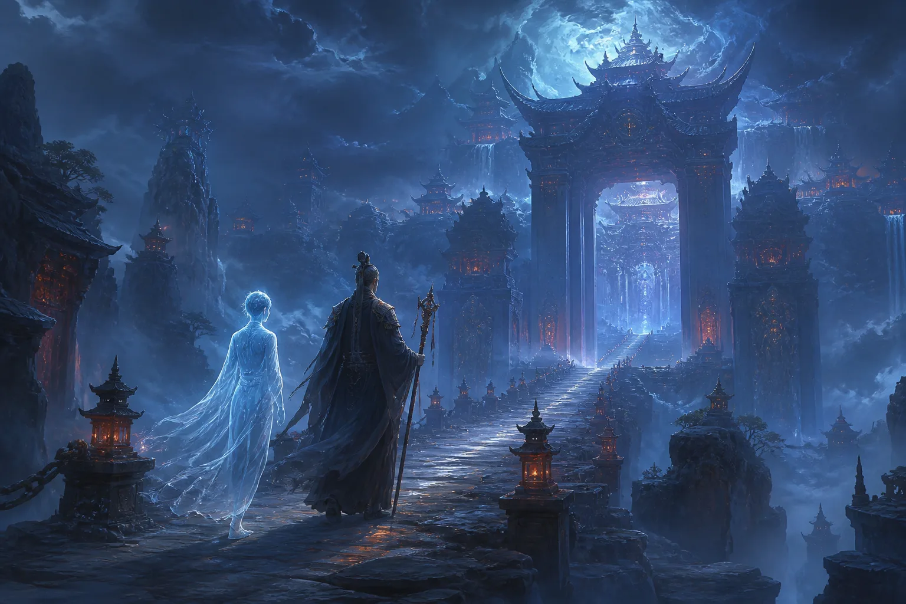

### 1. 魂魄分离与勾魂流程

首先说人噶了之后的流程。先从肉身上说，肉身上我们有魂魄，肉身之外的魂魄也叫做神魂。首先魂中有天地人三魂：天魂、地魂、人魂。

我们人是被天地阴阳所生，所以在噶了之后，你的天地二魂还有能量会返还给天地，归于天地。然后人魂会进入到一个轮回，对于普通人来说，人魂会进入到一个轮回。那我们的魄会去哪里呢？人死了之后，魂魄是从谷道出的，然后慢慢就消散于人间了。

这个魄的能量就消散了，如果说附近有一些其他的生灵，有些会食用，就是会把你这个魄的能量给吸收进去。然后我们这个人魂就会被阴差，也叫做勾魂使者，就是阴差的一部分，这个职位是勾魂的。

勾魂使者会把我们的魂勾出来之后，会带我们去到土地公那里。土地公那里会简单收留一下，给你检查一些事情，查一下是不是有记录，勾魂的册子上是否有你的记录，有没有搞错之类的。检查没有问题之后，我们就会被带到城隍爷那里去。到城隍爷那里就会办手续，就是你的死亡证明这种的。你在人间办了手续，当然在灵界也会办手续。之后就会经过很多地方，什么恶犬山之类的，达到了我们九幽的一个酆都。

### 2. 审判结果与去处

酆都里头的十殿，里面会有各种七十二司，其中十殿的一些判官就会检查你的生死簿，还有你的命簿。命簿会记录你在阳间的一切事物，类似于编年体那种，会把你哪一年干了什么事情记录在案。然后检查你犯了什么错，也就是赏罚，会检查你的功过。

这时候就会有几种情况了：

- **重大罪恶**：如果你犯了重大罪恶，干了很多坏事，特别严重的话，肯定是直接压入地狱了。这个不用多说，地狱十八层，大家也都了解，各种影视作品中也有写。还有一个可能提的人比较少，就是你会被流放到血海里面。血海里面有很多上古的生物，甚至还有一些修罗族比较残暴的生灵都在。这时候你基本上就是回不来了，很难回来。
- **轻度恶行**：如果说你犯的是轻度一点的，对于一些比如说神主、神二代、神三代这种，本身是下界来办事的，结果又犯下重大的恶行，那肯定会被拖去给丽芙打工，比如说当勾魂使者，就是所谓的*鸡爪子钱少、事儿多*，基本上干个千八百年吧，少说这么多。
- **投入恶道**：还有一种情况就是你会直接被投入恶道，比如说道家的五道轮回，其中的禽兽道、恶鬼道也是很惨的，这两道特别惨，基本上你是没有自我意识的，只是单方面受苦，没有任何自我意识。

然后我们再说一下，如果说你没有犯什么大的罪恶，就是普通人。普通人会根据你的业力，也叫做福报业力，福报各种天德、地德、人德、阴德等等，去统计成你的一个业力换算。

这个是专门在下面有一个标准的换算之后，如果你的业力还是处于一个比较好或者正常水平的话，会把你的业力变现一部分，可以兑换成米、冥币、冥力等等。这个业力其实也算是通货，在下面跟那些黄纸元宝也一样，也算是通货。

### 3. 家族祖地与头七

之后你会被带到家族祖地。阴差会告诉你的祖地在哪里，地图那些会给你，然后把你带到家族祖地，或者你自行前往。

> 这个祖地我要重点说一下，它是根据你在世的男方，就是比如说你爸爸、爷爷、太爷爷、祖太爷爷这种，是男方的一个家族祖地，在下面的一个根据地。这个也是跟整个家族的业力都有关系，家族的业力决定你的祖地的宅子有多大，里面人口有多少，当前没有投胎的人口有多少，他们都会一起住在这个里头，算是你的一个出生点吧，就像游戏的一个出生点一样。

然后你暂时就被分配到那里去了。当然，如果说你想去买新房子什么的，都是可以的，如果你的业力够，你的米够，想买新房子也是可以的。之后你会在那里自由活动七日。
七日之后会有专门的阴差盯着你，把你送回阳间去过你的头七，这时候你也可以跟家人见最后一面。后面也会讲一下亡魂如何返回阳间，会有哪些节日是正常返回，还会有哪些阳间阴魂的福利。

## 二、亡魂的形态、疾病与家庭

### 1. 外貌变化

人嘎了之后的外观，因为很多人有一个疑问，比如像一些横死的鬼，被撞到稀巴烂那种，已经成泥成河了，这种成盒了。那如果说成盒了之后，在下面没有投胎之前那几十年、几百年，我是不是一直都是那个样子？
这个是有一个权利可以改变容貌的。

>因为你们知道在地府九幽，无论是九幽还是九天，法界是跟我们维度不同的。我们现在是三维，他们那边是至少四维以上。这个是没有物质形态的，就是一个精神层面的东西。当然我们现在以三维的头脑没办法理解，大概意思就是他们是没有物质存在的。所以对于容貌来说，只是高维度投射下来的一个面而已。因此他们是能够改变容貌的。

改变容貌你可以花钱，下面的元宝、蜡烛、黄纸、玉皇钱等等一些硬通货，就是正常流通的东西。

然后你也可以花元宝到医馆，下面各个城邦也有医馆，专门会有医生给你做变换。如果自身之前是法师，或者是鬼修，自身有一定的法力，也可以有一个法身存在。法身也是可以变换、幻化的，包括你想变成多漂亮的大美女，什么都可以。因为如果你会通灵到下面去，你会发现基本上人人都是大美女、大帅哥，比现实中的明星好看多了，你可以变换容貌，所以这个不需要担心。

### 2. 疾病治疗

再讲一下疾病。很多人也有疑问，问我说，雪岭，比如有些人得重病走的，或者瘫痪，下肢出现问题走不了路，那在下面几十年几百年，是不是什么都干不了了？

这个其实跟外貌是一个意思，也是可以去医馆，花钱、花米去改变你的容貌、改变你的身体，各个疾病都是可以治好的。然后也可以在阳间找人给你做天医科这种，就是把亡魂的身体治好。各个派都不同。就哪怕你成盒了，成一坨了，甚至被绞肉机搅碎那种，也是不影响你的，因为你的魂还在。除非你非常倒霉，生魂出去后遭意外，

比如被罡风撕裂，或者被其他东西吞噬掉，属于你的*游戏存档整个被卸载了*，这种基本上就悬了，没有机会了。否则哪怕在阳间成盒，你还是有意识存在的，但不一定完全存在，意识有可能只剩下一部分，比如会有失忆的情况，甚至脑子没法思考，只有简单的一些生理行为，这个也是有一定可能性的。

### 3. 家庭关系

再讲一下家庭方面。这个也有很多人问，比如之前找法师给家里人送东西，家里老人去世后，给爷爷和奶奶送东西只送了一家的，然后奶奶过几天托梦说没有收到东西，还在要东西，大家不知道为什么。

我讲一下，嘎掉之后，之前的感情就不算数了，哪怕你们之前是夫妻，嘎掉之后今生的情缘也已经了结了。在下面你又可以进行重新的婚配，下面也会有婚介所存在，自由恋爱，跟阳间差不多，感情上面跟阳间差不多。为什么下面还是会有人结婚呢？因为这个魂自身的生理欲望还在，还没有断干净。

## 三、九幽阴间的世界设定

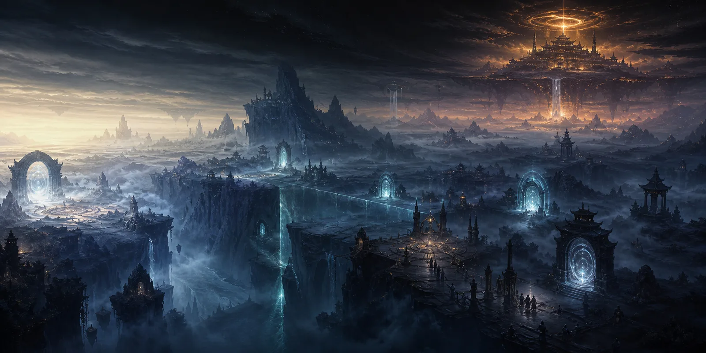

### 1. 环境与时间

再讲一下九幽阴间的场景。首先九幽阴间是没有白天的，不会像我们现在正午、午时阳光很大，没有的。基本上只有三种：
- 早晨那种天刚刚亮、雾蒙蒙的；
- 像黄昏昏暗的灯光，昏暗的月光，月光亮度大概就跟黄昏差不多；
- 完全的黑夜，一点光都没有。

其实大部分时间是完全的黑夜。然后有一些会通灵的小伙伴，还有会出体的，可能看到过天上有一个挺亮的地方，如果往上飞上去，会看见那里其实是轮回殿。但这里有结界的，不一定每个人都有手续能上去。

### 2. 九幽的定义与范围

九幽到底是什么？他跟地府有什么区别，他跟酆都有什么区别？九幽我们一般理解是叫幽冥界，也就是死后的世界。这样说有点太小了，因为本身在九幽下面，会有很多种很多个种族生命，不光只有鬼、小鬼、亡魂这些，还有一些种族，比如僵尸、妖兽，甚至底下还有妖姬，修罗界也挨得不远。

整个九幽非常大，至少面积在我目前探索下来，至少有几百个地球那么大。同时整个九幽地界有非常多的传送门，还有一些结界存在。传送门顾名思义，就类似于游戏那种，你从这里进去之后会来到一个新的地方。有些传送门可能直接通到九幽的某个地界，有些是维度的传送门，会带你去到其他的维度、其他的地界，非常非常大。

同时，他不光是只有地球的生灵投胎到九幽，其他地方、其他维度的生命体，如果体质纯阴了，万物都是由阴阳组成的，纯阴之后自然就会来到九幽。不是说只有地球上才有，其他维度的生命体阳耗尽之后，自然也会来到九幽。这是我目前知道的。

### 3. 结语与下期预告

今天时长也这么长了，就聊到这里。下一次想知道什么内容，可以在评论区给我发，想了解什么我会讲。如果没人发，下一期我准备讲一下在九幽的生活上的事，就最简单的衣食住行。下回就这样咯，拜拜。

## 地府·阴间生存指南(二):衣食住行

大家好，我是玄灵，也是被催更了很久。咱们的阴间冷知识第二期开始了，今天要讲一下衣食住行各方面，这也是大家后台私信我最多的内容，都很想知道下面的衣食住行到底是什么样子。在开始之前，我先声明一下，视频的全部观点都是我个人的主观思想，大家相信科学，如果不信也无所谓。

## 一、衣着：鬼魂穿什么，衣服有什么功能

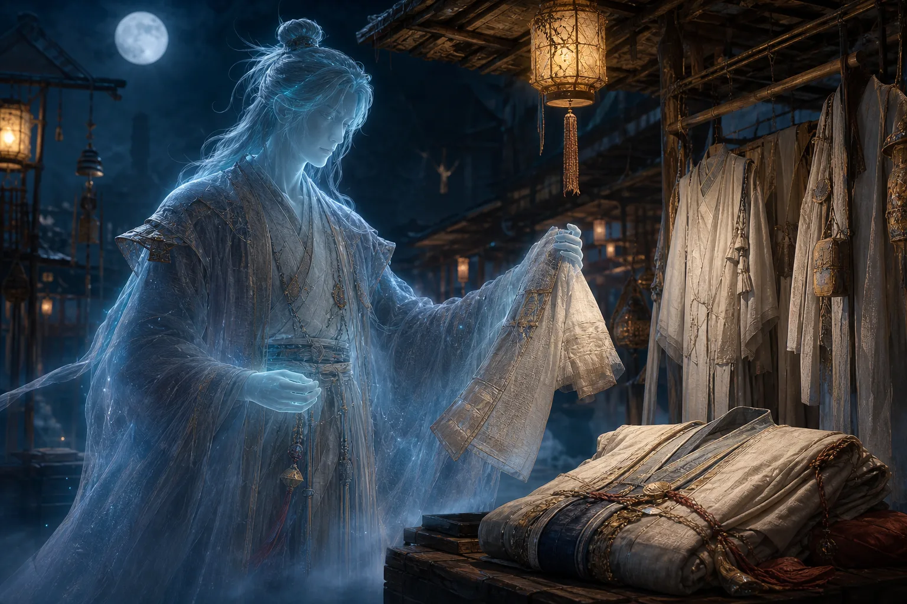

下面的人穿的衣服，首先有天然材质的，你给它烧的话，可以烧天然材质的，比如像纸、棉、棉花纸这种，是能够正常烧下去的。如果说衣服就是那种纸衣服，不是特别精致，比如没有扣子、没有口袋，是画出来的那种，没关系，它烧下去自然而然就会变成衣服。一般棉的比较多，像寒衣节的时候，你可以给祖先烧纸衣，也可以。但如果是棉的，细节肯定更好一点，下去的话质量也会更好一点。

如果说这个人家里都没有人给他烧，他怎么办？他可以在下面的铺子里去买。同时衣服也会有一些属性的差异，比如可以称之为法器的衣服，这种衣服兼具很多功能。有一些是护身的功能，简单理解就是你玩游戏里面衣服有一些护甲、魔抗，这种就是护身，打架的时候可以保护你。

还有一些是库身的能力，比如有收纳功能，收纳的意思是可以收武器，有些就是当成一个储物空间用。看过很多小说的都知道，可以当成储物空间，有个收纳系统，里面可以放一些杂物、丹药、武器之类的。有些只是单独作为一个剑匣来使用，存放武器的，有些就比较广泛，还有纯吃的、喝的、玩的各种各样。

还有一种比较特殊，它能够隔绝一定的信息，又可以叫做隐身衣。比如你在下面想去一个秘密的地方，有时候可以穿这个隐身衣去隔绝一下你的信息，大家就看不到你。隔绝也有很多种，有些是隔绝你的整个身形，就是看不见这种；有些是可以隔绝你的一些灵力、法力这种。普通的就不多说了，只起到一个御寒的作用。

## 二、饮食：鬼魂如何进食与供奉要点

### 1. 鬼魂吃气不吃实物

要知道下面的鬼鬼们，他们只是食气，就是吃阳间一些食物的气，不会真正去吃那个食物。因为它本身是灵体，所以吃不到那些物质的东西，因此它是食气，就是吃这个香味。但是有些人上供，可能就是放一个那种用塑料袋包着的吃的，如果说你供祖师爷的话，没问题；但是一些法力低的鬼，他们吃不到，因为有塑料袋隔着，他们就吃不到了。所以一定要把那个开封。

如果说你要供自家祖先，这种阴性比较重的，一般供了之后最好不要吃，吃的话也没关系，会拉肚子，就是会窜稀，这个是很正常的。有些法师供了下坛的，比如供了下坛的鸡鱼，忍不住跑去吃了，会发现会拉稀。

### 2. 水的重要性

再说一下鬼鬼们的一个必需品。首先水非常重要，跟在人间不同，在下面特别渴特别渴。比如你在人间可能一小时不喝水就渴了，他在下面可能十分钟就渴了，一定要喝水。所以水是很珍贵的东西，这也是为什么很多家庭可能供一个牌位或者供一个香炉，然后放一杯水，就会来很多众生过来。因为对于那些游魂或者散仙来说，水非常重要。

### 3. 下面也能买食物，但更喜欢阳间供奉

吃的方面，刚刚说了，吃气吃香味，阳间供奉的。下面如果你家里没有人供你，或者你没有吃到阳间的供奉，也可以在下面去买菜，就是买那种人家做好的。因为本身九幽有小卖部，会卖一些吃食，也会有商铺卖一些吃食，在下面买也是可以的。但是比起下面的东西，他们其实更喜欢阳间的东西，因为本身阳间的东西有一定的灵气，灵气要比下面的大一些。

### 4. 食物被食用后的特征

再说一下吃掉之后的状态。首先你能感受到你供了的东西，它变质非常快，就是有东西使用了之后，变质特别快。可能你正常来说，冬天一天就坏了，夏天有可能半天就坏。有些情况是你供了之后，你发现你后面去吃这个东西没有味道了，比如你供了一个很甜很甜的蛋糕，然后供完之后你说自己要去吃，一口吃进去一点味道都没有，没有香味，这也是表明有鬼鬼们食用过。上面两种情况都是鬼鬼们使用过的特点。

这里有个题外话，如果你供的是正神、祖师爷、正神，或者天上的兵将，你会发现那个吃的会变得很香很香。因为本身正神灵体有很强的阳气，这个东西也会被影响到，有阳气会很香，有灵气，你会感觉这种吃了对身体有很好的作用。

### 5. 饥饿感存在但饿不死

刚刚说的必需品水和食物，其实食物也不是非常必需的。跟在阳间不同，阳间你不吃东西会饿死，但下面会难受，就是你会非常难受，可以感觉到那个饥饿感，但是你不吃的话也没有关系，饿不死。这也是为什么下面如果说他拿不到阳间给他化的宝，他就会去打工。其实你一直不打工，摆烂也可以，但你一定要去忍受那个止渴和饿的感觉，这个感受是在的。哪怕你没有肉体了，你还是会有感受，因为你的魂还在，你的食神还在，所以你会有感受。

## 三、居住：九幽的房屋与区域安全

### 1. 城中：最安全且利于修行

房子的事情，简单来说从三个地方讲。有可能你住在城中，因为九幽有各个城域，有各个疆土城域，每一个管辖的首领都不同。但是整个九幽有一个最大的领导，不过每个城中的管辖不同。城中一直会有神职人员护着，是非常安全的，相对安全。同时它有一个很大的优点，就是修炼非常方便，对于修行来说非常方便。有些人可能在阳间并不知道修行的重要性，所以下去了之后大家都在修，一直在修功德。

功德好了，这边收入更高，转化率也更高，家里人给烧的转化率也更高，所以大家都会去做一个修行。这时候城里面会有一些官方人员，就是一些神职人员，会给你送一些经，就是公益性的，送一些经让你去修行。或者下面是有佛家、道家的庙宇的，同时这里面也会有神职人员，就是会有一些和尚、道士，专门从事度化九幽众生的这样的工作。所以城中的话是最好的选择，大部分人我们大部分人还是会在城中。

### 2. 城外：游魂黑户的过渡区，相对危险

然后城外，这里面有一些特殊的人，就是我上一期讲过有一些游魂，因为个人的原因不会被接下来，就不会去九幽。这个时候他可能通过比如鬼门开了、玉门开了这种，就会进到九幽去，但是他属于黑户了，没有登记户籍。这些是黑户，所以他进不到城里头，或者说他暂时还没有进到城里面，因为你可以去找阴差给你办手续，这些他没有暂时没有到城中，然后在外面迷失了，他可能会去住一些那种偏僻的房子，或者说是人家不要的一些房子。

这时候就不是特别安全了，会有很多其他的势力抢地盘，因为下面打架也比较多，各个地方抢地盘，统治是一块一块的，所以说会有抢地盘，经常打架，可能会波及到你，所以不是特别安全。

### 3. 域外：最危险之地

域外是最危险的地方，这个地方会有邪魔存在，神职员一直在跟他打的。邪魔他也是所谓道高一尺，魔高一丈，所以邪魔一直会有。这里面有一些邪魔，我大概给大家讲一下，比如大家很感兴趣的僵尸，就真的有僵尸在下面，什么毛僵、飞僵这种，真的是有。在九幽是有僵尸存在的，所以很危险这种地方。同时会有一些魔物怪兽，有些长得稀奇古怪的，像山海经里面那种拼接而成的，各个样子，就是头和尾巴各长各的那种样子都有，也是很厉害的怪兽。所以说你要是普通一个小鬼鬼的话，住在域外非常危险。

### 4. 家的组成部分

再讲一下你住的家里面组成部分。一般来说就是有地和房子。地的话，我们是地契，地契就是我上一期讲的，跟家族有关系，本身家族就会有一个地契存在。这个跟你祖上整体的功德相关，你家的地有多大，跟你祖上整体相关，这也是为什么风水可以改变一些东西。然后地是有限的，你必须要有地契，在你的房子，就是家里面人给你化的房子，或者你自己购买的房子，才能被放在这个地上面。如果你光有房子不行，你要有地，你没有地的话，你的房子放不了。

房子有哪些部分？首先日常房间，就是我们房子的那个，跟你现在的家一样，日常房间我们叫做日常房间。然后元辰宫又叫元神宫，这个的话是跟着你累世修行、累世投胎有关系的，这个变动也是只跟你的福报有关系变动。然后财库，这个很多人觉得是在元神宫里头，但其实不是，这个财库是你地府的财库，但是它一般是在你家家里面边上。然后有些人有可能会有堂，这个你可以理解为公司这种，但他不光是指那种像出马出道的，像很多法师道士都会有，他是在法界的一个存在，有可能是在你家边上，也有可能是在某个界域，比如有些厉害的修行的可能在四重天或者其他哪重天，又或者是在九幽普通的那种。

堂里面的话，大家说的兵马肯定是要有的，然后你的堂营，你的营地就是军营，同时还会有一些办事处，这个可以理解为就是公司那种法师办事、神职员办事的一个地方。

## 四、冥界通货：元宝、香烛与纸钱

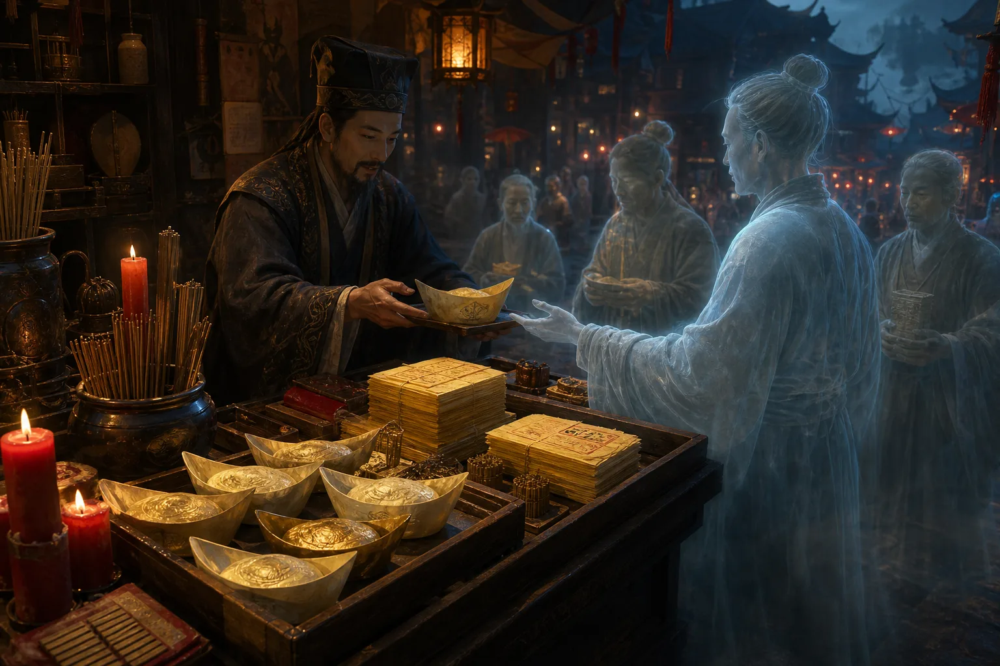

再讲一下大家很关心的米的问题，这个真的是重点，一定要记下来。上一个视频私信少说有十几个人问我，全部都是问怎么样化宝，怎么样下面的人能收到这个问题，我今天着重讲一下。

### 1. 元宝：硬通货中的硬通货

首先咱们来说一下硬通货，下面的硬通货元宝。这几年的话大家好些了，可能是宣传的比较多，大家都知道给祖先烧一些元宝是最好的。元宝我讲一下烧哪种的，首先金元宝、银元宝、锡纸元宝都可以，大小不限，当然越大的越好。然后一定要注意了，一定要手工，这个手工的话是一定要沾人气，就是要阳人要摸它一下才行。如果说是全部都是用机器那种，因为现在也有元宝机，就很多人偷懒儿，不想自己手工叠，就买那个元宝机，元宝机叠出来都是废纸，都没有用的，一定要沾人气。

然后这个时候我要告诉大家的是，最好你买的时候，不要买那种加了很多化工的东西，锡纸元宝是最好的，但是这个也是最贵的，这个看自己的经济实力吧。反正只要是元宝的话，沾了人气手工叠出来的都有用。你也可以稍微偷懒一点点，买那种半成品元宝，就是那种叠到一半的，然后你这样一拱，两边捏起来一拱，它就会变成一个元宝，这样的话也是可以的，因为你摸过它了，就是沾了人气。

### 2. 香烛：比钱更稀有的硬通货

说完元宝，我们再说下面鬼鬼们都觉得很真香的东西。对比人间，就像金子、大额的票票，这种就觉得很真香稀有，下面很稀有，购买力超强的这种就是我们的香。还有蜡烛的话，在下面一般是分红和白，他们更喜欢红一点，红蜡烛。如果说你要去购物的话，鬼哥们去购物，可能人家带20袋元宝，可能你一根蜡烛就可以买下来。我举个例子，就是说我想说的就是下面香和烛是非常稀有的，而且他们也很喜欢去闻这个香，因为本身这个香背后有一定的信仰之力，也叫做愿力，有一定的愿力，会增加鬼鬼们的法力，或者说是增加他的功德。

就是他会定期去买一些香，买一些烛去闻，点燃去闻那个气。如果说家里面有人给他化了的话，皆大欢喜；如果说没有的话，还是需要花钱去购买。所以你可以在下面大日子的时候，看见各种鬼鬼们在购物，就是去拿很多蜡烛、香去买很多。所以说大家有条件的话，可以给自己家里面祖先多搞一点这个香烛。香烛的话，没有太大的那个区别，反正注意就是最好少买一些化工添加比较多的，比如点起来味道很香，加了很多香精的那种，品级就次了，最好是要天然一点的，就是天然的香烛就可以了，可以买那个香粉自己回来做也可以，蜡烛也可以自己回来做也可以。

### 3. 各种纸钱与黄纸

再说各种钱，这里面就大概说几种。有玉皇钱，像救苦潜龙票这种，就是很多道士、道家的、法教的、佛家的一些做法事用的钱。这个对于法界来说也是硬通货，只是有一点很重要，普通人拿的这个钱，他没法去用，很难去找人换，所以说普通人给自己家人就不需要化这些宝，一般的话是给兵马用的，兵马、给祖师爷这种用的比较多。所以普通人的话，你就元宝加香烛管够就行了。

还有一种黄纸，就是最简单的那种，就是打了钱的那个纸，这个相当于零钱。基本上都是外面去买东西，可能他们就几坨几坨的，绑在车子上面去买东西，这个算是零钱了，也可以烧，可以黄纸加元宝结合起来一起上。

### 4. 天地银行废纸：千万不要买

然后我刚刚说了，天地银行废纸，就是很多人买的那个什么一千亿这种，好家伙，这个烧下去，那不是直接通货膨胀了吗？说实话你用脑子想一想，也不可能用得了这个纸，所以说大家不要买这个了，这个又贵，然后还没有用，千万不要买这个。

## 五、祭祀指南：如何确保祖先收到财物

最后再讲一下，怎么样把我们这些东西给祖先，能够确保他们最大限额能够拿到。

### 1. 大日子：清明节与中元节

先说两个日子，就大日子。清明节对于下面来说，跟我们的春节差不多，大日子，下面有很多活动。在清明节的时候，你烧，还有中元节的时候，七月半，中元节的时候烧都是可以的。

这个时候有阴差会在各个十字路口，或者各个墓地比较多的、集中的地方会站岗。你在这里点的时候，你在念安，请什么什么什么，把这些东西送给我的祖先某某某，这是哪家的，你在念到时候，他就过来了，他听到之后就把你的东西等你化完之后，就给你登记起来，记到册子上面，然后就运走了。这个的话你烧的肯定是能够拿到的，百分之百拿到，就是有阴差在的时候。其实节假日的话，一般都在。

### 2. 普通日子：画圈烧纸法

如果说是普通的日子，比如有人托梦给你，说没钱啦，这个时候你说我要临时去烧一下，怎么办？我教你一招，玄灵这边教你一招。首先你可以拿这个，如果你在泥土里烧，就是在那种荒郊野地上，你拿个棍子画一个圈出来，然后留一个口，留个口，这个相当于是个保护罩，就防止有东西去抢你的东西。

然后留个口之后，你就念叨城隍土地，念叨阴差过来，然后说你要给某某某哪个祖先烧什么什么东西。这时候你可以念化宝咒，这个我就不在这里讲了，你可以有法脉的话，可以问一下自己师傅，没有的话，可以百度搜一下化宝咒。然后你边烧边念，边烧边念，这时候可能就会有阴差过来，把你的东西给你祖先运过去。然后一定要记得就是外面留一坨，可以留一坨给那个孤魂野鬼们，因为可能会有一些围观的，或者是在你烧的时候围观，然后走的时候可能跟着你这种。所以说礼尚往来，都是人情世故嘛，捎一点给别人，这样的话吃人嘴软，拿人手软，他也不好找你麻烦什么的。

好啦，这就是今天这期的内容。如果说你还有什么想知道的，关于阴间、关于九幽地府的事情，可以跟玄灵发消息，然后我统计一下大家最想知道的内容，再做视频。谢谢大家观看，希望大家给我点个关注，一键三连哦。

## 地府·阴间生存指南(三):日常生活篇

大家好，我是玄灵。今天继续更新《阴间冷知识之日常生活篇》。前两期的播放量非常火爆，看来大家对阴间生活确实很好奇。大家发来的私信和留言我都看了，非常感谢大家的支持。

# 九幽的居民与城市

## 九幽有哪些居民

九幽居民的种族很多，大致可以分为以下几类：

- **鬼**：生前是人，死后变成鬼。
- **怪**：来自妖界、长相奇特且形态各异的生物，我们简称为“怪”。
- **修罗族**：修罗界域本身就在九幽之内，所以修罗族也经常在一些城邦中生活。
- **修出法身的妖**：这类妖可以在三界六道中穿梭，持有通行令时，也可以来到九幽居住。
- **天神**：包括在上界九天办事的神仙，以及本身在九幽受封的神仙，他们同样可能居住在九幽。

## 从古代土屋到现代高楼

很多人都做过与阴间有关的梦，梦见阴间的天气、建筑，或者收到过世家人的托梦。有人问我：“玄灵，为什么有时会梦见矮矮的土墙、灰蒙蒙的环境，以及非常老旧的木屋；有时又会梦见过世的爷爷奶奶住在灯火通明的高楼大厦里？”

九幽的时间轴很长。过去去世的人和现在去世的人，都在各自所处的时代留下了许多建筑，所以那里既有过去的房子，也有现代的房子。

九幽的房子通常不会自然损坏。如果没有战争之类的破坏，它不会像阳间的房屋一样，随着时间推移而逐渐老化。这就是为什么有时梦中的场景像古代，有时像近代，有时又完全是现代城市。

九幽的高楼大厦，密集程度甚至与北上广深等大城市相近，而且往往成片分布，看上去非常壮观宏伟。前几期提到过，九幽本身的面积比地球大很多，因此大规模的城市区域也非常常见。包括我自己和一些能够出体的小伙伴，都见过类似的景象。有人梦见的是高楼大厦，也有人梦见的是古代房屋。

## 房子是怎么建成的

九幽的房子并不是由建筑工人一砖一瓦垒起来的。这里可以类比一部电影中的设定：一位建筑师在梦中可以按照脑海里的蓝图，直接创造出建筑物。

九幽的房屋也类似于此。建筑师或者其他人先在脑海中形成蓝图，再通过自身的灵力或阴德，将房子“兑换”出来；也有一些房子，是阳间的人焚烧后送下去的。它们并非依靠现实中的砖瓦施工建成，而且在一般情况下不会损坏。

# 鬼市与九幽的热门行业

## 鬼市是什么

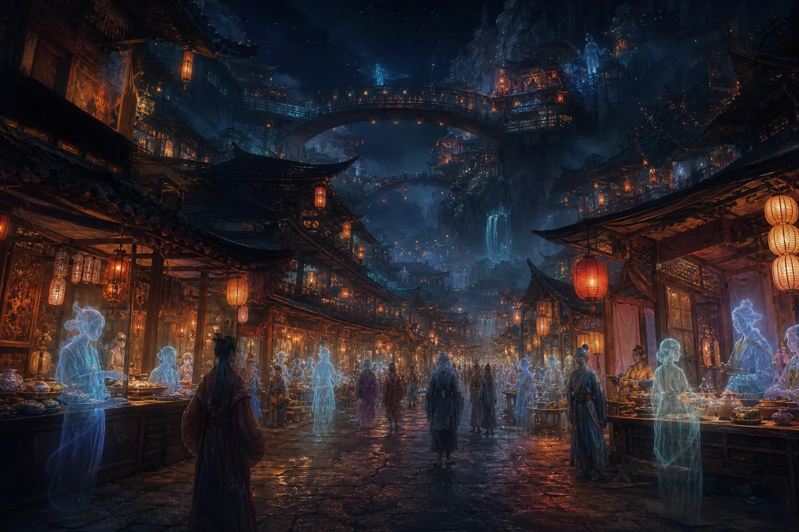

除了上班，九幽居民也有自己的娱乐和日常活动。至于工作的具体情况，内容比较多，可以留到下一期再讲。

九幽有一种很有意思的地方，叫作**鬼市**。例如青城山就有鬼市；河南好像也有一座钟灵山，那里同样有类似的地方，不过具体地点我记不太清楚了。懂这方面的一些修行人，自然会明白。

鬼市顾名思义，就是鬼的集市，和阳间赶大集差不多。里面的店铺、商品和往来的鬼都非常丰富。

## 阴德交易市场

鬼市里存在**阴德交易市场**，其中有些交易合法，也有些是非法的。

例如，有人可能用祖先的阴德，交换后代的阳寿。大部分涉及阳寿的私下交易都是非法的，因为阳寿必须经过地府的正规流程。有些阳寿则是通过与阴差勾结等手段非法弄出来的。

除此之外，还可以用阴德换取子孙的福德。这也对应了很多人在祭祖时许下的愿望。有人会对老祖宗说：

> 保佑我发大财，保佑我事事顺利。

但老祖宗可能也很为难：自己的阴德不够，只能尽量帮后代。这就是阴德交易市场存在的一种背景。

## 修炼资源与法器秘籍

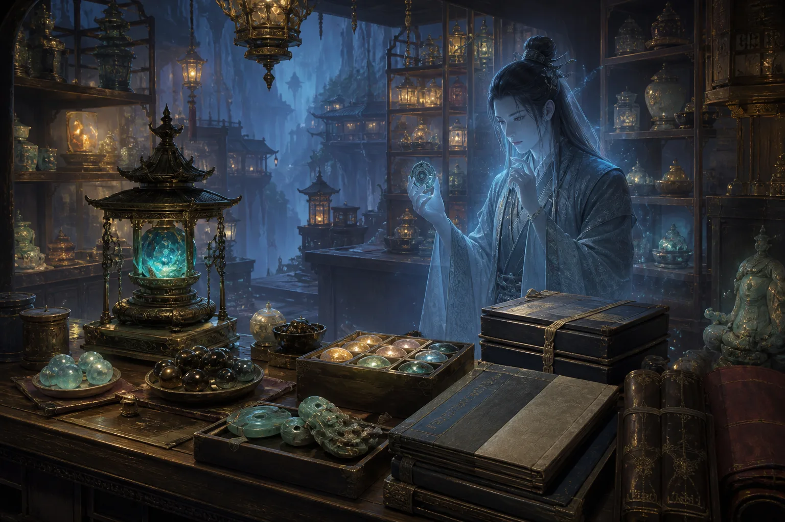

鬼市也会出售修炼资源，例如小说里经常出现的丹药。鬼修同样需要修行，所以也会购买丹药；九幽的一些道士则会购买法器。

有时，鬼市中还会出现极品秘籍，也就是各种修炼功法和修炼资料。

## 吃香的阵法师

**阵法师**在九幽是非常吃香的行业。九幽地域广阔，整体上虽然由地府管辖，但各地又存在类似于诸侯割据的状态。不同界域都需要官方阵法师布置阵法，防止其他人未经许可直接越界。

九幽有很多修行者可以御剑飞行，也有人乘坐坐骑，从空中穿行。因此，常规的防御阵法必须把天上和地下全部覆盖起来。

除了布置界域防御阵法，阵法师还可以承接很多业务：

1. **勘察阴宅**：也就是查看九幽居民的房屋及相关环境。
2. **布置聚灵阵**：帮助修行者加快修炼速度。
3. **布置避雷劫阵法**：帮助需要渡劫的妖或其他修行者抵挡雷劫。

例如，有些妖达到五百年修为时需要渡雷劫。如果能请到厉害的阵法师，就相当于有人帮助它扛过这一劫。因此，阵法师在九幽非常抢手。

# 跨界服务与托梦业务

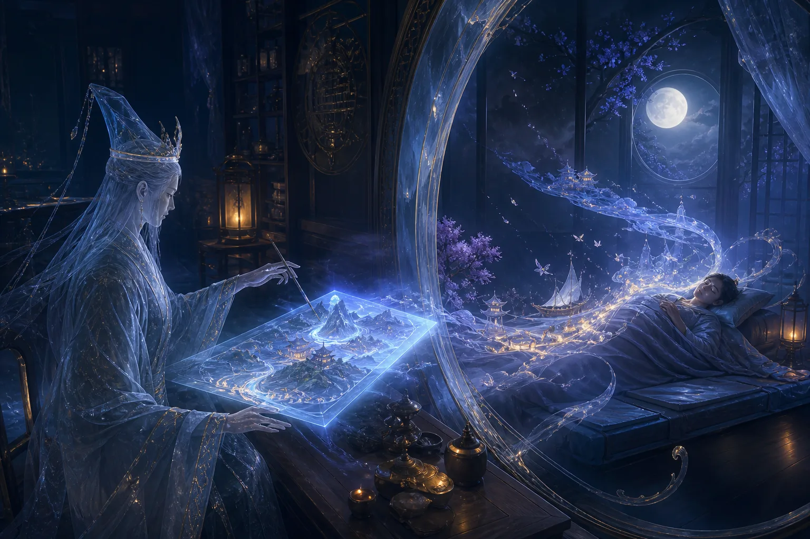

## 托梦也可以定制

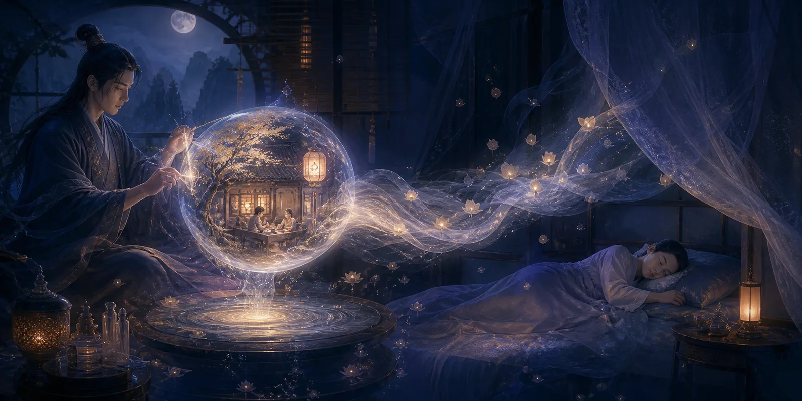

大家接触得比较多的跨界服务之一，就是**托梦业务**。很多人应该都被自家老祖宗托过梦。这项业务在九幽非常普遍，可能就像我们去营业厅办理套餐一样。

前两期有不少人私信问我：“为什么某位亲戚或祖先一直给我托梦，但另外一些祖先却从来不给我托梦？”

如果一位祖先反复给你托梦，那通常就是有事找你。你需要结合梦里的场景进行解梦，看看他到底想表达什么意思。

比如，你梦见祖先住在一间很破的房子里，屋顶漏水，身上穿着带补丁的破旧衣服，吃的只有馒头、白菜和榨菜。家里也没什么家具，可能只有一个电灯泡或一张桌子。这种情况，很可能就是来向你要钱的：他在下面找不到工作，也没有钱花，所以向你求助。

还有一些梦境中，祖先可能身体某处受了伤，或者被关在笼子里，周围黑压压的、伸手不见五指，整个人无法动弹。这种情况可能代表他被某些东西扣住了，也可能是被困在某个阵法里。

托梦业务可以定制内容和场景。专业人员会根据委托者希望传达给阳间之人的信息，设计相应的梦境。因为两界所处的维度不同，做梦的人往往只能看到片面的内容，无法直接看见真实场景，所以托梦服务人员会把信息转化成阳间之人能够理解的形式。

这也是为什么有些托梦场景特别光怪陆离，甚至让人觉得逻辑不通；可即便逻辑不通，你还是能隐约明白祖先究竟想告诉你什么。

## 墓碑和坟墓的作用

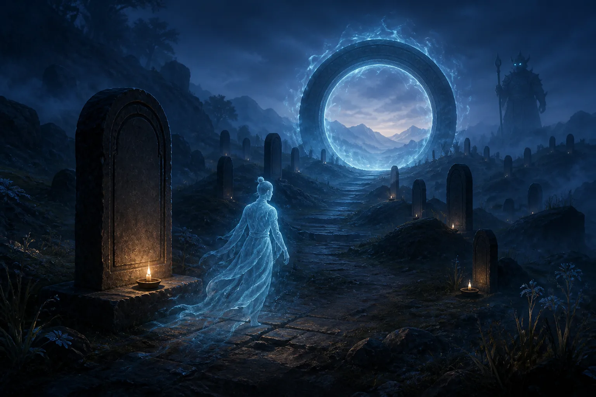

有一位粉丝问我：“墓碑和坟墓到底有什么作用？”

玩过游戏的人应该知道“传送门”或“标记点”的概念。墓碑和坟墓的作用，就有点像《魂》系列游戏里的篝火，可以作为传送和定位的标记。

一般的鬼想通过鬼门关，必须等到鬼门关大开；如果没有相关手续，平时会被拦住。但持有鬼门关手续的鬼，可以借助相应的标记来到阳间办事、赚外快。

很多法师使用的兵马，例如五鬼或者一些鬼仙兵马，就可以来到阳间工作。他们会和法师订立某种协议：

> 我帮法师办事，法师定期给我发工资。

这就是他们的一种工作方式。

## 阴间替身与伤害转移

另一种跨界服务叫作**替身**。阳间也有类似的说法，而阴间替身比较特殊的一点，是它可以替使用者承受来自阳间的伤害。

有些鬼仙或鬼修会经常来阳间办事。如果办事时遇到危险，或者执行某件难度很高的任务，打不过对方并受到致命伤，那么提前购买的替身就可以帮助它承担这次伤害。

比如，有人找人做了和合、爱情降之类的事情，一般是让小鬼过去办事，到目标耳边吹风、进入对方梦里，使对方想念某个人，甚至爱得死去活来。但目标如果感觉不舒服，找了一位道行更高的人，请来一道符贴在门上，那么小鬼过去时就可能被符所伤。

如果那道符具有直接斩杀的效果，就会优先消耗替身。也正因为能够承担这种严重伤害，替身在九幽的价格非常昂贵。

# 九幽居民的日常娱乐

## 通过意识连接的虚拟网络

九幽居民的日常娱乐，其实和阳间没有太大区别。九幽也有网络，只不过是一种**虚拟网络**。

那里未必存在实体电脑，电脑中也没有芯片、CPU或显卡等硬件，而是通过意识直接显示内容。可以把它理解成所有人的大脑连接在一起，知识和信息能够共享，但彼此并不会因此直接拥有其他人的私人记忆。

也就是说，大家可以接触到相应的信息或内容，却不会连同信息所属者的全部记忆一起获得。

## 追星、影视与神仙吐槽

九幽居民也会追星。有些明星去世后尚未投胎，就可以继续运用生前掌握的技能，例如吹拉弹唱、表演和演戏。

他们会观看阳间的电视剧和电影，也会自己拍摄一些作品。阳间拍摄的神仙题材影视剧，上面的神仙有时也会看，而且还会吐槽。

不过，如果作品拍得不好，甚至有辱某些大神，例如一些《封神榜》题材的影视作品可能冒犯了相关神明，那么参与者的功德和福德也可能受到一定影响。

## 节日、宴会与婚姻

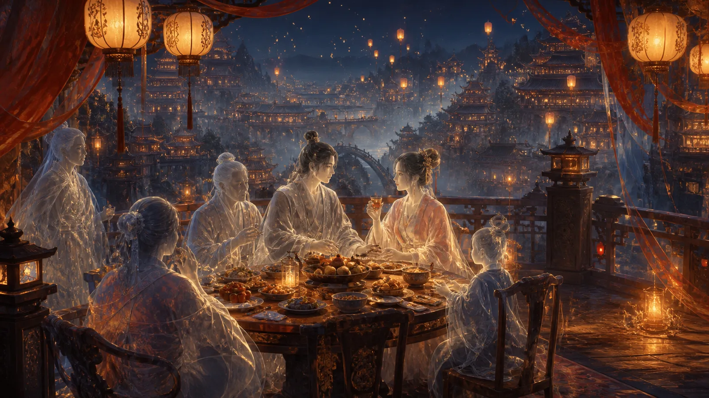

九幽居民也会举办宴会。清明节、中元节等重要日子到来时，他们会集中购物、应酬和办酒席。

九幽居民也可以娶妻生子。鬼本身没有阳气，所以孩子是通过阴气孕育出来的。这样的孩子出生时只有地魂；如果以后需要投胎，就必须从生父母的生魂中抽取一部分天魂和人魂，分给孩子。

有些大神孕育后代时，同样会把自己的魂分出一部分，形式上有点类似于**分灵**。

# 九幽的特色食物

## 晶莹剔透的冰晶果

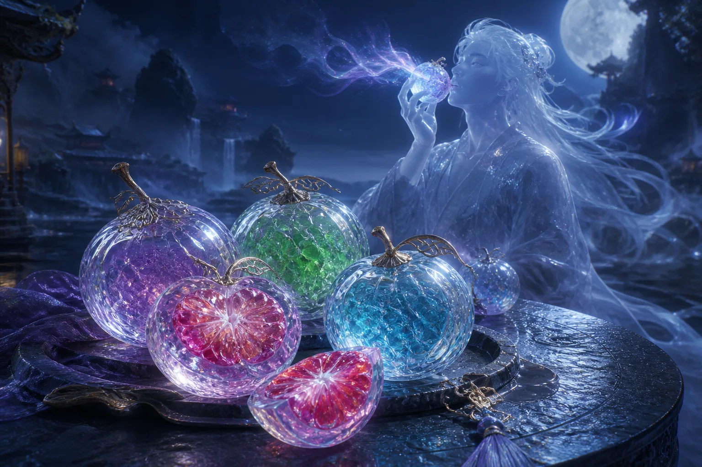

九幽大部分食物与人间差不多，但也有一些当地特有的东西。

我有一次出体后，吃到了一种叫作**冰晶果**的食物，可以算是一种水果。它看上去非常晶莹剔透，中间的果肉是彩色的。

冰晶果吃进嘴里时能够尝到味道，但不会产生任何明显的咀嚼感，就像在吃空气一样。你好像确实嚼了，却感觉不到自己正在咀嚼。

九幽居民吃东西，主要吃的是其中的“气”。那里的食物和阳间食物不同，不一定具有明确的物质实体，更多呈现为一种没有实体的感受。

## 地府·阴间生存指南(四):阴间生活杂谈

嗨各位观众老爷们大家好，我是玄灵，今天继续来更新阴间生活系列啦。本期内容都是个人见解，大家轻喷。如果觉得有兴趣的话，给玄灵一个一键三连吧，没有硬币的话，一个免费的赞也可以让我开心一整天。废话不多说，我们开始吧。

## 一、阴间的工作体系与公务员

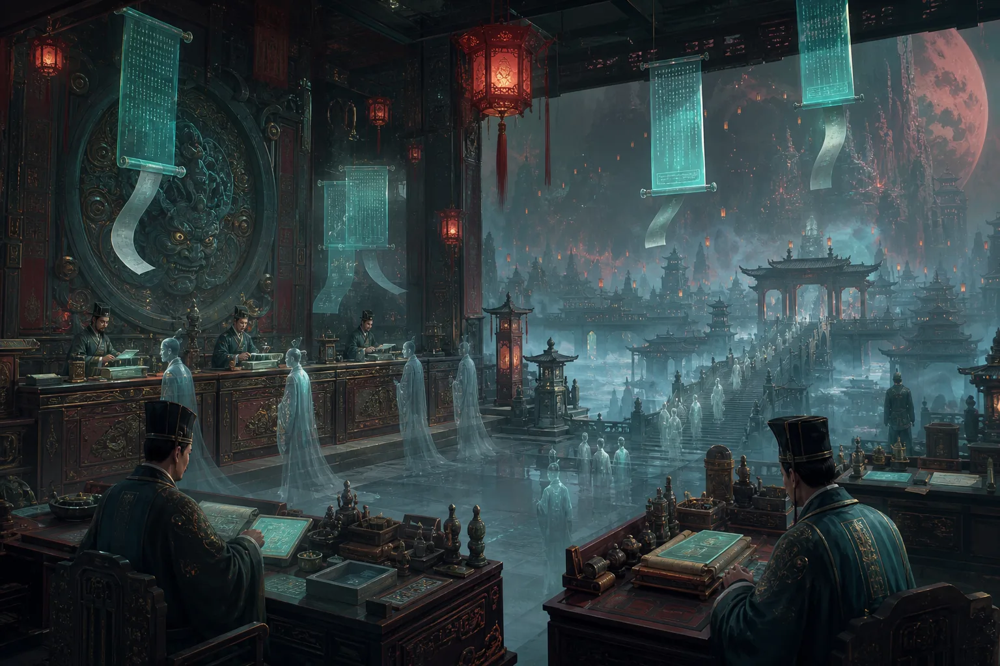

### 1. 功德分类与公务员录用

首先大家非常感兴趣的就是在阴间的工作。很多人问我，玄灵玄灵，我在日常生活中已经很累了，不想上班了，想躺平了，下面还要工作吗？很不幸告诉你的是，我们在下面大部分情况也是会工作的。

在变成鬼鬼之后，先会根据你的各个德行——天德、地德、人德、阴德加起来，查到你的一个总的功德，然后会根据功德分为**大德之人、有德之人、普通之人**。当然这里我也只是举了几种例子，在下面会有一套明确的功德系统。

大部分大德之人可以选择去当不当公务员，也可以选择躺平。首先公务员的话，一个就是他会根据你功德，下去之后本身就成为一个公务员，不需要经过考试这个流程。然后下面所有的鬼鬼们，还有一些修行修上来的、跑到九幽来玩的，他也可以去参加一个考试，就是公务员的考试。

还有一个情况比较特殊，就是阳人去兼职。比如有一些马家的、灵感比较好的人、通灵体质的，比如一些邪骨头这种，他可能会在梦里面就跑去兼职了，就当公务员了，但他大部分情况自己不知情，可能隔一段时间会给你几个梦境反馈。更有甚者可能已经当了40来年的公务员，他一直都有印象，包括他会做梦，但他不会轻易跟大家讲这个事情，因为很多人不理解。

### 2. 常见公务员职位

普通鬼的公务员，我列了几个比较常见的职位：

- **无常**：这个职位大家知道吧，七爷八爷，白无常、黑无常。但是七爷八爷也有白无常和黑无常，他不止一个人。你想他如果说一个人天天跑去办事，肯定会累死，那么多鬼魂需要管理，他其实就是个职位。
- **勾魂使者**：也是职位之一。
- **判官**：一般是查案、审案，有一些冤屈的案子需要审，包括事情的前因后果需要查明，然后再去计算功德。判官都会有助手，包括下面任何七十二司，都会有一些助手的职位，就是在那个司里面查不到职位的，这种就跟实习生一样，是干杂务的。
- **打手**：需要去打架，有些人闹事的，有些鬼闹事的，就需要你出面当打手。
- **轮回镜看守**：看守轮回镜，这里可以查你有几世投胎，每世经历了什么。我之前讲过，跟命簿一样，它也是一个编年体，但轮回镜除了可以出报告，就是文字报告，命簿以外，它还可以进到这个镜子里面去看，一个一个影像的形式，就跟咱们看电影一样，可以看到前世今生发生的一些事情。这个后面我会讲，有一种情况怎么去查。

### 3. 梦境中的地府通道

很多人可能会梦见一些地府的事情，包括看我视频的里面有一些人也可以，你们可以在评论区里讲讲你的故事。他可能会梦见在梦里面跑到地府去，是坐电梯下去的，可能梦见负几层，比如负18层，两层有可能去地狱参观等等，他会坐电梯。这个其实也是个通道，只是说在我们梦境中无法呈现出高维度九幽的真实面貌，所以大家都会经常梦见坐电梯。还有可能就是走大门，那大门也是特别大的一个门，上面可能会有牌匾，旁边会有看守。如果有类似梦境的人，大家可以聊一聊。

## 二、阴间的职业选择与生活状态

### 1. 根据阳间技能选择职业

关于下面工作的职业，其实会根据你在阳间的职业，还有你擅长的一些技能，去选择你在阴间的职业。我这里列举了几个：
- **学校的老师**：就是鬼校，下面学校的老师。有一些小孩子，比如从阴间本身出生的孩子，还有一些婴灵，比如有些堕胎婴灵，他会开始被送去孤儿院，差不多长大之后会有找领养，然后会送到学校里面去学习。这个会有老师，但他教学的内容可能跟阳间有点区别，而且整个学校的环境也是非常大的，甚至有一些走廊是那种无限走廊，无限走廊会有很多门，他的门其实也相当于是那种传送门一样的。
- **医院的医生**：我之前讲过，医生会有一些整容，还有给你治病，这种都是有的。但一般鬼轻易不会生病，不会感染病毒，但是打架可能会，还有包括会有一些血染嘛，之前说过的血染，他都是必须要去医院治疗的。所以医生的话可能也会有区别，但大体上跟阳间都是一样的。
- **建筑工人**：土木行业的，在下面也会去修房子。虽然房子能够烧到下面，但是难免会有一些磕碰，比如你买回来的那种纸房子质量很差，缺了个角、缺了个门这种，你又不好意思托梦给家里人让他重新烧，所以就有一些土木专门去买一些材料，把这个房子给拼好修好。当然这个流程跟阳间的有区别，不是什么钢筋混凝土拼接而成的。

### 2. 个体户与躺平

如果说你干腻了这些职业，你也可以选择去做个体户，但前提是你要有钱，你肯定要有钱去做投资，然后买地、买地契、修房子，买卖一些东西，这些都需要你的元宝。这个就是本身实力比较好的情况，但有德之人这种情况完全可以选择躺平。

## 三、常见疑问解答

### 1. 死后记忆是否保留？朋友还能一起玩吗？

接下来我想回答一下上一期和上上期关于阴间知识的一些网友问题，包括评论区发给我或私信我的。今天讲两个我觉得比较让人疑惑的问题。

有个网友问我，他说玄灵，我阳间的朋友，如果大家以后寿终正寝了之后，在下面还会一起玩吗？然后我结合了另外一个问题，有个网友比较质疑我，他说其实很多魂魄下去了之后，本身是没有记忆的。比如有种情况，他老人了，脑细胞出问题了，像得阿尔兹海默这种，他本身记忆就是错乱的，或者缺失了大部分记忆；又或者那种嘎的时候连头都没有的，怎么办呢？

首先你要知道，阴差如果在你的勾魂手册上找到你，他一定会来把你勾走的，勾走下去也会走流程，一直走到十殿那里。

十殿这里会去判官，判官会审理，如果说你是神志不清的这种人，他会通过一些手段先让天医把你的脑子还有记忆这些修复成功，你会记得人间全部的事情。哪怕我们下去，你可能年纪大了五六十岁，十几岁的记忆就没有了，他都会让你想起来，从三岁到你亡的时候，所有期间发生的所有事，事无大小、事无巨细，他都会让你一清二楚。

这也是为什么下面会这样决定，因为之前有些人可能会看了自己的命簿之后不认同，说“我记忆里面没有做过这个事情啊”，所以后面就出现了一个政策，就是会先把你的记忆修复好了。但是这只是记忆，如果说你身体上有什么，比如脸烂了、手断了这种，下面就不会管了，这个就需要你通过你的阴德、你的功德，去医院或者用元宝去治疗。

所以说记忆还在的，大家都可以去轮回殿找人，也可以在阴间的一些部门去找到这个人，通过他生前的一些信息去找到他。所以说是可以的，还是会一起玩的，如果对方还是没有忘记你的话。

### 2. 动物死后去哪里？如何投胎？

第二个也有很多人问我，说玄灵我看了很多书，不论古代的还是现代的，大家讲的都没有讲过，动物死了之后会去跟人走一样的地方吗？他们又是怎么投胎的？

上一期我说过，动物投胎不会像人类一样，就是变成鬼之后，你还要把你的阳寿过完，如果横死了，要把阳寿过完，然后同时把阴寿过完，然后再排队，然后再去投胎。动物基本上很快投胎。

动物分两种情况：**有灵智的**和**没有灵智的**。

有灵智的，他也会去跟人类一样去审案子。打个比方，比如某一条蛇修炼了500年，本身要回肉身去渡一个劫，假设他肉身在长白山上，然后刚好有一个人看到这个蛇，哇塞这个蛇而且还不是国家保护动物，我就把它砍了，把这个蛇打死了之后，它下去，下面的判官就会去审它，发现它是被某个人打死的，然后这笔账就会记到那个人身上。因为它这个事情，它就可以合法地去找他，他也是会去审的。

但如果是无灵智的，就是他没有觉醒灵智，也没有修行的这种普通动物，比如家猪、家鸭、肉鸭，吃的这种六畜嘛，这种就不会直接去审。但如果说有个人他吃过一些野生动物，开了灵智的话，这笔账就会记在他的本子上。但如果是吃的是家里养的这种，他只会有一些业力，但是不会记在每一个动物的头上。所以说这种基本上就是排队流程完了，就去专门去畜生道投胎的地方继续投胎。

今天的内容就讲到这里了，大家还有什么想知道的，都可以随时给我评论，给我私信，谢谢大家对我的支持，拜拜，下一期见。

## 地府·阴间生存指南(五):投胎与托梦

大家好，我是玄灵，本期继续讲阴间生存日常。以下内容均为个人了解，大家自行斟酌。

## 一、投胎时间与九幽世界

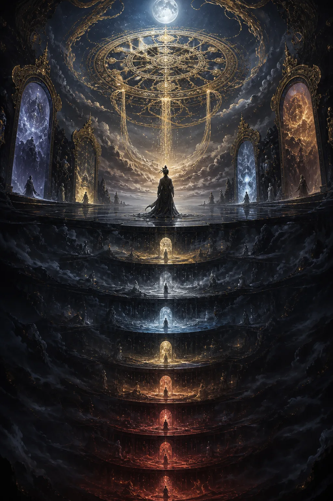

### 1. 投胎时间与排队机制

第一个是关于投胎时间。有很多宝子给我私信或反馈，说自家很多去世的亲人已经过了很长时间，甚至超过五六十年、将近一百年，为什么还会托梦，所以想问投胎时间是多长。首先下去之后，下面先会评审，看你会去到六道中的哪一道，是善道还是恶道。如果是善道，比如人道，就会继续排队。

排队时间会根据你整体的因果情况来定，如果有很长时间，说明你的**阴寿**还没有到。阴寿有时候很长，有时候短，具体跟因果、功德等挂钩。如果是其他道，比如恶道、畜生道，就要去轮回殿。这个我上次讲过，畜生道时间不是很长，很快就会投胎走，从轮回殿这边走。

### 2. 九幽的多元世界

关于其他信仰，九幽这个地方，很多人可能觉得九幽只有地府，但其实我也讲过很多次，九幽是一个很大的地方，是所有地方的一个幽冥界，就是冥界。所以来到九幽的不光是只有地球上的生灵，比如火星、木星等地方的生灵也可能会来，甚至银河系之外的。九幽是一个非常非常大的空间，是一个冥界，阴气汇聚的地方。

### 3. 阴间物价与外国人情况

很多小伙伴想问下面有没有便利店，怕下去饿肚子赶不上大集怎么办。下面像711、全家这种，包括商场都是有的。只是要注意，下面的物价很高，跟我们现在没法比，因为烧下去的份额和各方面都很大很多，水涨船高。还有小伙伴问，外国人如果不烧纸，下面怎么过日子？首先除了道教、佛教以外的，有一些宗教本身会有自己的界域，比如天界或者其他地方，有自己的小世界甚至大世界。如果符合这个宗教教义，会有信仰的神仙把你接到那个位置，去了之后自然会有其他物质转化，不一定通过货币流通。另外如果不烧的话，你可以用功德去换钱，甚至家里人、亲人给你用烛火，或者外人用烛火指名道姓烧给你，都是可以的，包括下面打工，各个方面都可以。

## 二、麻醉、做梦与死亡的区别

### 1. 麻醉的玄学机制

还有很多人问麻醉后断片，会不会跟死亡一样，和梦有什么区别。首先麻醉从肉身角度讲，是控制肉身大脑的一部分功能，让大脑一部分功能类似于手机关机重启。从玄学角度讲，人身体里是由**识神**和**元神**控制的，这个我讲过很多遍。麻醉相当于把识神退位了，识神藏起来了，控制记忆的地方是在识神控制的，控制欲望的东西是**魄**在控制的，它被藏起来了，所以这段时间没有任何记忆。

### 2. 做梦的多种来源

做梦是什么？做梦有可能是识神作用、元神作用产生的梦境，有可能只是识神作用，有可能是只有元神作用，还有可能是你**出体**了，还有可能记忆碎片等等，是很多种情况。基本上很少有人做梦是完全断片的。我们道家讲**神安无梦**，就是说你的识神好好藏起来了，没有乱动，只是元神作用这种，他其实也有梦，只是梦境是黑白的，你的识神不在感觉不到。

### 3. 手机比喻总结

打个很简单的比喻，麻醉相当于手机主动被关机，之后麻药退去重启。你的硬件还是好的，电量还在，以前的记忆还在，只是关机这段时间外面发生了什么你不知道。做梦相当于手机休眠，主动熄屏，后台可能还开着视频、音乐，还在播放，包括屏保，所以做梦还是有一点点意识。嘎了是怎么回事？嘎了可能是电量耗尽，寿终正寝；也可能是手机烂了坏了，支撑不了，有电量也没用，开不了机，已经坏掉了。

## 三、七情六欲与托梦表情

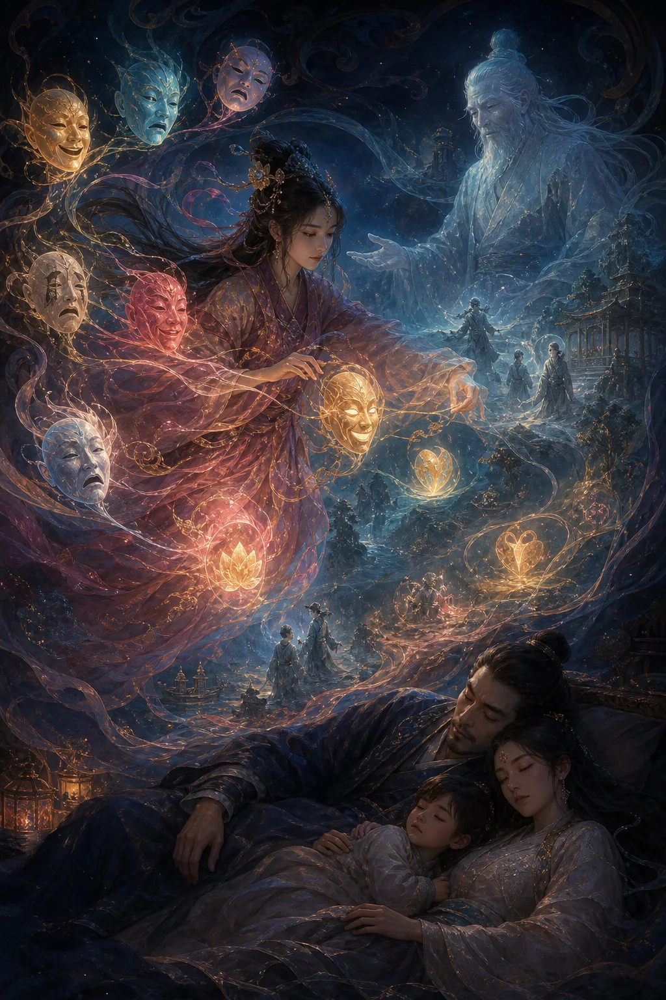

再讲讲七情六欲。为什么有些人说亲人或别人托梦时，面目呆呆的，没有太多表情，有点空洞？首先我之前讲过，人噶了之后，你的**魄**是从谷道出的，就是从肠道出去，然后会去到地下，也就是幽冥界九幽。这个魄和魂会融合一部分，缺失掉一部分，会回到**地气**里面。所以魄主管七情六欲，感情上面可能会淡一点，但它是有记忆的，只是不像以前在阳间时那么容易动情。

## 四、焚烧物品的阴阳转化与注意事项

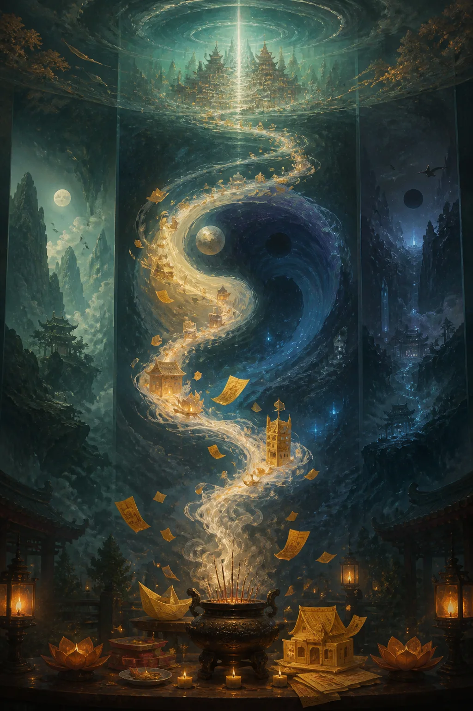

### 1. 无意识焚烧的转化

有人问，阳间焚化厂烧掉很多垃圾，包括我们自己焚烧垃圾，也不是元宝也不是钱，那会去哪里？比如焚烧塑料这些东西，但你是无意识焚烧的，不是说要送给下面哪个哪个人，所以无意识只会转化成能量。

烧掉的东西有一部分能量会来到九幽，就是一部分阴气的能量。从科学讲是燃烧有机物转化为无机物，从玄学角度讲是转化成阴气，阴气重，是浊气，自然往下掉，阳气上升，阴气下降，所以来到九幽。但这是无意识转化的，没有经过手续，没有官兵力将接收，就是无意识的能量转化到阴间。包括阴间有一些动物会吞噬阴气、吞噬魄，吸收掉，这是自然的道，阴阳转换、阴阳轮转。

### 2. 有意识烧化的信息准确性

而有意识的话，自然有人管你快递送到哪里，跟我们一样。你信息写得越准确，比如烧的时候让师傅写准确生辰、住址，快递员越容易找到。自己去化的时候也是一样，要把准确信息说出来或写出来。

### 3. 烧电视电器的注意事项

很多人好奇烧下去的电视机、电器、房子能收到吗？有两种情况。一种是纸片那种情况，就是印上去的卡片，上面画个小人儿、小房子、一辆车之类的，这种烧下去没有任何用。

因为烧下去的东西必须要有一定的精确度、精致度，烧下去之后它本身会携带这个东西在阳间的一个能量，比如在阳间叫三轮车，三轮车是有三个轮子的，否则烧下去不会让人联想到三轮车这个东西，它本身有这个属性的能量在。

但在下面，比如电脑这种，电脑里面有很多精致的东西，但如果你烧的是立体的东西，它里面是没有这些硬件的，包括电线这些没有。不过整体达到一定程度之后，它就能够在下面运作。所以如果你们要给下面的人烧，可以自己手工做，比如自己手工做纸的汽车、纸的轮子、纸的电视机、纸的房子、纸床等等。

## 五、轮回心态、魂飞魄散与灵魂多元性

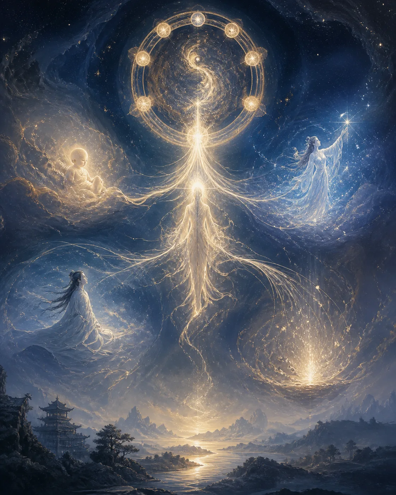

### 1. 不想轮回的心态

很多人在弹幕和私信说好累，不想再轮回了，想魂飞魄散怎么办。这个大概率很难完成你的心愿。我自己感觉，无论这一世贫穷富贵、生疮害病、或者活着没意思，都是一种体验，都是在累世轮回因果作用下。咱们不要怨天尤人，虽然大家都能体会到痛苦、负面情绪对识神的影响。但任何生物都向往阳气，阳气代表生发周转，没有阳就是一盘散沙，不会有动。那如何改善自身？有些因果业力必须要自身经历完之后，才能去做自己想做的事情，你的人生目标，你魂魄下来需要完成的事情。我建议你们带着一种体验，一种**一命通关**的心态，把人生当成一个游戏，我灵魂深处要做什么事情，最想做什么事情，一定要积极乐观去做，把今生当成一命通关的心态，想完成的事情就去完成吧。

### 2. 灵魂的多元投胎与血脉

很多人想知道，未来去投胎，去的地方仅仅是地球吗？首先六道，每个道里面不只有几个界，界有很多，比如天界、魔界、佛界、妖界等等，除此之外还有很多星球，不光是银河系的，甚至有其他星系的外星人，会投胎到地球，或者投胎到火星等等。

咱们其实经历过很多很多世，就好比打游戏，打完之后存档删了重新投入，你没有记忆，在人间时没有记忆。所以我们很多灵魂里面混杂了很多，比如今生我是人，下一辈子可能是狐仙等。所以说本源是人，最初那一世是人的，纯血是很少的，目前我看来的话，纯血的人比较少。还有一个想说的，咱们不是经常说我们华夏民族是龙的传人吗？为什么要这么说？因为我们本身就有龙的血脉，很早的时候我们就带龙的血脉，所以叫龙的传人，这话真没毛病。

今天就讲这么多，如果你们有想知道的内容可以发消息、弹幕、评论。谢谢支持，下回更新其他内容。
