> 本页为「修行与世相杂谈」9 篇的合订本；原文章链接会自动跳转到本页。

## 阳间修行指南

> **最好的修行心法是什么？——把自己修成一个更健全、更稳定、更有判断力的人。至于走内修、借法、灵视还是术数，要先看你究竟想得到什么。**

## 1. 先建立世界观：阳间、灵体界，以及“神”到底是什么

本系列就是基于我真实的法事生活和上下走动的见闻来做的，还是一样，尽量讲得乐一点。当然了，基于现代社会的科学发展观，以及一些小伙伴可能懒得了解封建迷信、民俗神秘学、真实存在等不同层次的分别，所以下面这些内容，你们当故事也行、当世界观也行、当睡前乐子也可以，随意。真有觉得无聊或者难辨真假的，我建议你上表问祖师，就说是我说的。

首先说一下整体概念：**世界还是唯物的。** 不是说有神仙存在，你就能原地起飞，然后变化成山川河流。哪怕是变化和起飞，也是有法的路径和逻辑在里面，这是一套很精密的运用，不是想来就来的。
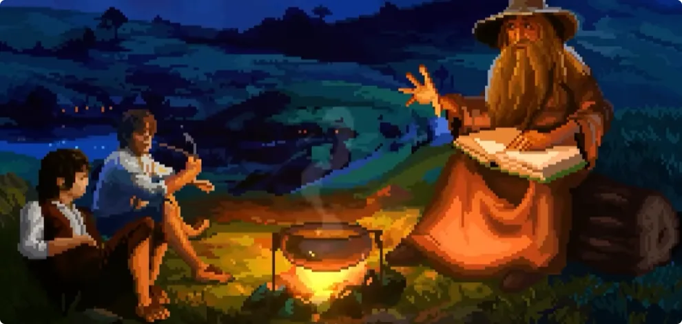

肉身所在的地方叫**阳间**，宇宙也属于阳间的范畴，有物理规则，有空间和时间的限制。就诞生的时间而言，其实很短。所以对于灵体界来说，我们有时候会称阳间为“末端”，也就是整个三界里最后诞生的部分。

灵体界也是唯物的，有属于灵体界的物质和规则，只是相比阳间，时间、空间的束缚要薄弱很多，而且比阳间更加巨大。各位平常听到的阴间、地府、地狱、天堂、天庭、冥界，其实都是灵体界的一部分，可以理解为各区块的行政机构，也就是和阳间有着紧密关联的地方。除此之外，灵体界绝大部分区域是不被阳间探知的；同样，绝大部分灵体界居民也对阳间没有兴趣，并不会来到阳间，甚至有些原住民同样不知道阳间。

各位平常听到的神，什么**三清、雷祖、提尔、宙斯、湿婆**等等，他们居住或者说存在于灵体界，是灵体界的高位灵体，是有强度和位格的行政者。其中有一些存在确实可以称为“神”，因为他们是某一大片区域的主要行政者，也就是阳间所称的**主神**。

和阳间的人一样，灵体也有强度大小之分，但这种强度更加纯粹、更加直接。就像游魂和正神的对比，是粉尘和石头的区别。

各位不要把灵体想成天上有、地下无，高高在上的一批。实际上，阳间大部分人对于“神”的概念来自人类自身。人类一厢情愿地把一个可以满足自己愿望、解决自己问题的“超我”套在灵体身上，并且相信这个灵体可以解决自己的问题。

很多人还以此论证神存不存在，比如说：
地球环境这么差，为什么神不惩罚人类？打仗了为什么神不帮我们？

关灵体屁事。你也没打电话让人家来帮忙，而且真帮了你，你也看不到。

不要去否定你自身的力量，更不要把这种否定上升到整个人类群体，两个行为都不合适。**人不是唯一的智慧种族，也不会是最后一个。**

人与灵体本质上可以达成的是**合作关系**，而不是奴隶和奴隶主的关系。肉身是非常强大的东西，精神力也是三界共同的好东西；灵体则有超越人类视角的视野和超脱人类的力量，所以希望各位正视自己的存在。

---

## 2. 普通人到底要不要修：可以不修，先做一个健全的人

说完一些基本概念，就可以聊一点乐的事情。

群里问得最多的是：

> “咋修啊？”  
> “听说未来三界要融合，能不能不修？”

先说一下，**完全可以不修。**

甚至即使是在有生之年，真的发生了“降临”级别的事情，到人可以肉眼看见灵体的程度，你也一样可以不管这些，因为阳间有阳间的特性，这里不是灵体界的主场。

也不要一直担心灵体会侵略你的生活，就像你不会每天担心家里有没有小偷，因为真有小偷可以报警。对于灵体也是如此，这就是**城隍和法师**存在的意义。

甚至大部分人遇到的“灵扰”现象，也就是很多法师口中的所谓“小鬼”“脏东西”，其实连游魂都算不上，只是一点气息，多晒晒太阳就可以了。如果真的非常不幸，遇到了可以称得上灵体的小鬼和脏东西，也不要害怕。只要你的意志足够坚定、精神足够强大，灵体很难撼动你，这就是肉身强大之处。

你只需要找法师，或者去正经的庙观妥善处理就可以了。因为目前阳间的灵体真的不大、也不强，**八成都是一道雷可以完全消散的存在；剩下一成是风水导致的问题，一成是城隍给雷部打电话可以解决的问题。**

### 真正通用的“心法”：德智体美劳全面发展

对于想要修行，或者说想要接触灵体界的人，这个就很好玩。

因为不是你走玄学路子，死后才可以去往灵体界常住；也不是一定得做法师，才算走在修行的路上。

我觉得最好的修行心法，可以概括成一句大家都听过的话：

> **德智体美劳全面发展——做一个健全的人。**

这个是真的。

因为如果有走内修的小伙伴就知道，**内修本质上是让自己变得更好、更强，不断挖掘和去除自身的问题，达到更高的境界。**

内修过程中出现的所谓幻象、心魔，以及感受到的痛苦和迷茫，最终都可以落在自身的问题上。生活中感到的负面情绪，对于修行而言反而是好事，因为这意味着你的问题出现了。只要弄清楚问题的根源，找到解决办法，就可以一劳永逸地把它解决掉。

这也是我唯一推荐的心法，因为它真的很直接。

---

## 3. 如果目标是“成仙”：传统道门、箓籍与跨体系修行

### 走传统路线：读书、学习、建立自己的理解

有了心法，具体走什么流派呢？

这个其实要看你想达成的目的是什么。

如果你说你就是想修仙、想成仙，不管现代科学怎么看，你就笃定自己能成仙，那么最快的路子就是找个道门。

因为按照我这里的世界观，**道教就是灵体界天庭区域驻阳间办事处**，简单来说，类似公务员机构。

虽然现在各个流派、各个门派或多或少都有点破事，但你就进去摁读书、死读，别人做什么你都不听，就摁看经典。祖师傅总会给你一口饭吃的。

走传统路子，要么：
1. **你是天才。** 有自己的思考能力和学习、建立知识体系的能力；
2. **你勤勤恳恳，真的努力。** 哪怕没有天赋，也能走出一条路来。

这两种都可以有成果，理论上也都可以入仙籍，也就是死后换个地方打工。

这里还涉及一个词，可以理解成**箓籍**：也就是通过一个体系获得身份、名籍和归属。只不过本质上还是换个地方工作，不是神话传说里那种随便飞天遁地的神仙。

最怕的是心态摆不正，自己不好好学，就想着有超能力，每天幻想“灵气复苏以后我可以成仙”。

说实话，早就复苏了，自己没察觉罢了。

### 不走道门，也可以进入其他体系

当然，你要说我对道家不感兴趣，那些古文一个字都看不明白，就喜欢魔法，那么同样可以走类似“箓籍”的路子，进入西方或者其他非本土体系。

唯一的问题，就是有一道类似“**转户籍**”的过程。

也就是说，在对方体系认可你，认为你死后可以去那个体系生活、工作的情况下，你在上下的档案会被转移到其他行政机构去，除此之外没有什么。

这个和单纯寻求信仰是不同的。

**这个路子需要其他体系认可你，你才能在其他体系中长久生活和工作。**

这个算是修行者、法师的专属。底下对于法师转“户籍”，也有特事特办的条例。至于这些体系具体走的是借法还是内修，我没有怎么研究，有修其他体系的大佬可以说一下。

### 修行一定会碰到假法、残法和骗子

还有一个所有体系都会遇到的问题：

你可能修了半天，发现这个流派是残缺的；或者找的师父是骗子；甚至这套法的逻辑本身就是矛盾的。

这个只能说，是修行过程中不得不碰上的一环。

即使灵体界，也有很多诈骗级别的法存在。

> **所以要多看、多思考。包括我在这里和你们说的这些，在你们不思考的情况下，也不要听什么就信什么。那就成宗教了。**

---

## 4. 如果目标是抓妖驱鬼：借法有两条路

有些小伙伴就要问了：

> “我对死后成仙、去灵体界一点兴趣都没有，我就想有神通，可以抓妖驱鬼，行不行？”

可以。

这个反倒简单，就是走**借法**的路子。

我把借法分成两种：
1. **灵体合作法**
2. **祖师打工法**

### 灵体合作：出马只是其中一种

“灵体合作”听起来比较陌生，但**出马**这个词大家就很熟悉了。

出马属于灵体合作的一种。广义上的灵体合作，就是和一个或者多个灵体达成合作关系，通过仪式、上身或者通灵仪式，请灵体降临来施行法术。

>**灵体行法、告知信息，人类则进行供奉。**

因为对人类来说，这是神通、法术；对于灵体而言，这就是它本身的力量，和你举铁练出来的肌肉其实是一个道理。

需要注意的是，灵体合作并不是非得**上身**。只是部分流派走的是上身，也就是顶灵的路子。上身对于自己会有一定程度的伤害，会导致精神和意志不同程度受到影响，甚至影响身体，所以需要考虑清楚要不要走这个路子。

而任何形式的灵体合作，都要注意：

> **自身一定要做好防护，不是什么玩意儿来了都能供起来。**

有些小灵体路过你的招灵仪式看一眼，你以为是神仙下来了；那个小灵体也懵，你也尴尬。
那桌子上的香火吃是不吃？

>不吃，怪可惜的, 等两秒一想：吃，好像也没什么问题。

于是你就获得了一个**自己也不知道能干什么的小灵体**，遇到脏东西跑得比你还快。

而且这甚至还是好的情况。
坏的情况下，你的招灵仪式会直接导致自身受到灵扰。在没有自保和驱灵手段的情况下，会导致自身意识和精神受到伤害，甚至影响肉身和正常生活。

这种情况在法事里屡见不鲜，是真的需要严肃对待。

**不存在你觉得自己是天才，你就真的是爽文主角的情况。**

---

## 5. “祖师打工法”：为什么接了法脉，就不只是拿力量

祖师打工法就很乐了。

简单来说，就是借民间法脉行法的时候，请**祖师以及麾下兵马**来帮你。
因为民间法脉非常直接，法本里也大量存在驱妖、打鬼、收魂、破秽之类的法术，和主内修的流派算是互补。
所以很多道门，或者内修方向的法师，会选择接一个民间法脉，作为自保和吃饭的手段。

但这个就得看法脉的**祖师强度**。
有些祖师是天才来的，在灵体界也有一席之地，那行法强度就很不错。
那反过来，为什么叫“祖师打工法”呢？

因为法脉不是轻易可以断的。接了之后，你就得给祖师打工、干活、赚香火。
而且有些法脉的传承仪式还很独特。比如师父吐一口口水在茶里，你喝下去之后，就算正式**接入法脉，上了祖师爷的白名单**。

所以无论是灵体合作，还是祖师打工，都请多寻思。
借法的路子对于他人或者其他存在的依赖性极大。加上阳间除了正神之外，真的没有多少灵体界的大东西，甚至很多法师都不知道那些存在。

所以一开始走这个路子，很容易认为：
- 自己看到的就是全部；
- 自己有了神通；
- 自己背后的灵体特别强。

### 修行圈为什么特别容易出现“战力膨胀”

因此在现实和网络中，各位很容易看见这种**数值膨胀**。
这个法师声称背后是什么什么娘娘，手眼通天；那个法师又是什么星宿转世，力能开海。

其中有的是真有实力，有的更多只是嘴上说说。

这里不是说硬踩或者嘲讽，因为即使是大的民间法教，例如**闾山、梅山**，在不同地区都有不同的起源传说和不同的供奉神祇，其法师对于自身的称呼和能力，也有不同程度的说法。

不论从真实的灵体界，还是从阳间的民俗神秘学来看，因为历史时间过长导致的**众说纷纭和数值膨胀**都是不能避免的。

哪怕灵体界里，也会出现大量这种情况。

这就是说明世界是活性的嘛，是好事。
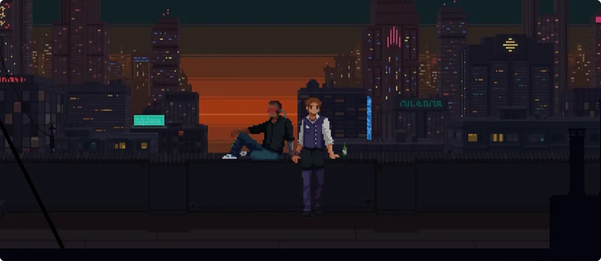

### 真正高位的存在，为什么反而很难在阳间见到

再说个扎心的：灵体界很多存在，为什么阳间观测不到，甚至成为法师之后也很难接触？
因为那些存在**太他妈大了**。
大到阳间没有办法承载它的本体。

你不能指望三清直接下来行走人间嘛，因为位格和体量都太庞大了。这种存在即使投胎到阳间，也只能分一部分意识下来。
毕竟你也不希望在阳间看到一个**一个省那么大的蜈蚣**吧？
那多吓人。

所以阳间能合作和借法的无神格灵体，对于整个灵体界而言，大部分都没有真正可以拍板、说得上话的分量。

你就想：

>有这么一个灵体，拳打星宿、脚踏山川，呼一口气都是法生百妙，天上天下狂得不行；正神见了要敬酒，散修看了要避让。

**怎么就偏偏收了你？**

还非得你不可。
你不愿意，还打你。
收完你以后，还不收别人、关门了。

这多抽象。

以前灵体诈骗多的时候，这种情况更加离谱。小灵体敢冒充正神下来骗取供奉和精神力，把人盘剥完之后，人变成精神病，小灵体一摆手走了。

当然，按照我这里的说法，经过灵体界和阳间一些法师的通力合作，现在这种情况已经很少了。

### “几万兵马”，最后一数只有五个

还有一个乐的。
基于灵体合作这个设定，阳间不是有**养兵马**这种做法吗？
养兵马操作起来比较复杂，有人造灵、有招募、有魂、有傀儡等等不同的做法。

重点是：

> **灵体是会骗人的。**

之前我看有人收兵马，说自己收了几万。
我好奇过去问了一下那个灵体。
他妈的就五个。

就是随便报个数给法师听，混口饭吃。
法师又看不清，对接不好的灵体说什么就是什么了。
但是五个也不少，至少处理阳间的事情够用了，又不是开战。

---

## 6. 如果只想“看见”：灵视和出体到底是什么

又有小伙伴问：

> “我对修仙和施法都不感兴趣，但是很想看看灵体界。只希望能看到、能交流，又不想走降神的路子，就想交朋友，能不能修？”

可以。

这种修**灵视和出体**就行。

### 灵视不是脑子里播放高清电影

灵视在各个流派的称呼不同，**天眼、阴阳眼**等词经常都在指向类似的能力。
但本质上它不一定是一种画面视觉，各位不要被这个称呼束缚了。
**灵视真正指的，是你的灵体感知和信息收集，比普通五感更加饱满。**

基于灵体的感知，是直接收集灵体界信息的功能。
不要着相，认为一定要把画面看得特别清楚。

不是的。
例如找人，或者和灵体交朋友，灵体界的**法相**，也就是外观皮肤，是可以随便换的。
你看得再清晰，也可能被蒙蔽。
所以要直达本质，也就是感知**气息**。

> **只要气息对上了，那就是这个人。**

灵视各门派都有自己的修法。我之后也打算开班教这个，不是广告，第一期免费。
因为我也很好奇，我这套方法普通人练的话能不能成，只能说做实验班。

### 出体分为“投射”和真正的出体

出体和灵视不同，这个确实看天赋。
出体又分成：
1. **投射**
2. **出体**

阳间大部分流派其实都是投射，因为投射真的可以练。
包括我自己虽然会出体，但办事一般也都是投射，因为它真的很快。

**投射**本质上，就是你的意识带着极少量的灵体，快速去到灵体界，并且遇到危险时快速回来。
好处是快、可以练，而且危险性相对较小；坏处就是，对接没有大体积灵体出去那么清晰、稳定，行使的力量也有上限。

**出体**则是你的灵体分出一大块，直接走出去，可以固定待在灵体界的某个地方，有需要的时候意识来回传送就好了。
有时候长期要在外面办事，我就会丢一块灵体在那边。

好处是稳定，可以动用的力量更多，能做的事情也更多，看到的也更多。坏处就是看天赋，因为有些人天生就出不去大块灵体；而且灵体在外面，需要找一个安全的地方待着。

所以你要说体验 **VR级别** 的灵体界生活，那真的够呛。
但是电影级别的还是可以的。
深度对接的感觉其实非常好。

---

## 7. 想学算命、甚至算彩票？术数本质上只是信息模型

这个时候又有小伙伴问：

> “这些我都不感兴趣，我想学算命，我要算彩票号码，能不能修？”

可以修。
**彩票号码不行。**
这破事我之前还特意问过北阴。

我说：

> “彩票到底算偏财还是正财？我看我拜比干还是拜赵帅去？”

结果告诉我：

**彩票和运势没得关系，纯随机。**

这里的“赵帅”就是传统信仰里的**赵公明、玄坛赵元帅**。
但是像棋牌，其实理论上可以用。
你过年打麻将的时候，找本地小灵体塞点力，约定好赢几局，那小灵体完全明白了，酷酷帮你做牌。

结果麻将摸出五张一样的，当场被拉去剁手指。
所以这里不是让大家去赌博。

实际上操作中，这个方案也就用来娱乐。真涉及金钱的话，还和大财运、自身事物的流转、介入运势有关系，以及和派出所和我国法律强相关。

> **只能说是一套非常精密的系统。有这个时间，你去打工赚的都比这个多。**

### 卜卦本质：收集信息，然后推演

再说回算命。

>**术数不过是一个模型，卜卦的本质是信息的接收和推演预测。**

你看到的信息越多、越全面，推演能力越强，最后出来的结果就越精准。而你自身的信息接收能力越强，你能卜的东西也就越大。

所以不存在本质上的：

> “算出了天机，泄露了天机，卦师嘎巴一下就死了。”

因为前者其实是一个逻辑矛盾。
你能算出天机，说明你有这个权限；你有这个权限，那你为什么会死呢？
不过我还挺喜欢看这类故事，就喜欢看由此衍生出来的阴谋论和秘俗传说，这也是世界多彩的一环。

后者确实有类似的情况，但更多指向的是**卦师本身的信息接收和分析能力**。
他目前还达不到，所以一时间没法算。

例如之前有人闲着起卦，手机突然掉地上，屏幕碎了，然后就不敢继续算了。但同样也有人可以不受影响地起卦。

这就是卦师自身的问题。

### 八字、小六壬、塔罗、镜听、射覆，没有谁天然更“高级”

那卜卦的流派有什么推荐吗？
我只能说，在我看来其实都行。
因为：

> **工具只是工具，真正运用工具的还是人。**

比如我自己用的方法是**望气和看烟**。
本质上其实都是灵视的延伸。

为什么会有“烟”存在呢？因为烟的形态可以作为一个媒介，而且这个形式我用得很舒服。我在山里望气的时候，总不可能还专门点烟，怪污染生态环境的，所以就望气。
因此在我看来，卜卦的方式不存在高低之分。
确实有些方式学的人多、玩的人也多，可以更好地交流，比如：
- 八字；
- 小六壬；   
- 塔罗。

也有一些方式学的人少、玩的也少，可以参考的内容也少，例如：
- 镜听；
- 射覆。

任何一种方式都可以做到很高，全看**卦师自己的能力**。
但有些模型是特化过的。

例如面相，你就没法靠看面相来卜“我丢的东西在哪里”。
当然，诈骗除外。
例如**圆光术**。

从现在很多人的描述来看，妈的整个一个“清朝VCR”，这不扯淡吗？

不排除这东西本质上是灵视和信息收集，但是独立出来，说可以让普通人看到高清画面，那就是另一回事了。至少按照我这里的世界观，在三界融合之前是不可能的。

---

## 8. 中邪、撞邪、夺舍：真正遇到的情况没故事里那么夸张

接下来是群里小伙伴问的一些问题。

### “中邪”和“夺舍”到底是什么

成因有很多。
可能是：
- 风水气冲到了；
- 自身深处的浊气；
- 去了不干净的地方，染了气息；
- 被小灵体缠上。

只有极少数，才是故事中那种真正意义上的“小鬼夺舍”。
因为人本身其实是非常硬的灵体。

**想抢占一个人的肉体，是一件很难的事情。**

我确实见过夺舍。
但真实情况，是事主抗争了很多年，导致两个灵体就挤在那个身体里，最终导致这个人精神不正常。
清理掉之后慢慢修养，再配合现代科学医疗手段，是可以恢复的。
更多所谓“夺舍”的情况，其实是小灵体来占据你的身体，然后被你自身的灵体给挤碎了，就这样死在你的身体里，导致自身气息很脏。

毕竟：

> **灵体的尸体也是尸体。**

### 更多“撞邪”其实只是沾染某种环境气息

俗称的撞邪、遇到脏东西，抛开一些迷信者别有用心的解释和当事人的心理作用，按照我这里的说法，真实存在的情况更多是**沾染气息**。

例如确实去了废弃建筑、墓地之类的地方，就可能沾上一些那个环境特有的气息。

有些并不是危险性的气息，而是这个地方特有的：
- 破败气；
- 死气。

这种气息对人必然有影响，但通常晒太阳就可以解决。
少部分确实是遇到小灵体，也就是我说的**灵扰**。

比如：
- 身上难受；
- 做事不顺；
- 找东西找不到；
- 家人生病。
都可能出现。

但具体问题具体分析。
不是说遇到灵扰以后，你家椅子年久失修坏了，也能怪它。

真实灵扰造成的效果多种多样，甚至很多听起来根本不像“灵扰”。
例如**遮蔽**就是常见形式：
一个东西明明就在你面前，就是死活找不到。
但这种更多其实还是事主自身的问题，小灵体最多只能推波助澜。

所以故事里那种恐怖、诡异的情况反而非常少见。造成你邻居家一家17口全部嗝屁的情况，更偏向于为了吓人创造出来的。

绝大多数小灵体问题都不大，包括所谓养小鬼、招兵马、死后的怨魂等等。
只是有些灵体做事情很脏。
不是说它们有多强，而是：

> **没有底线。**

相当于往你身上丢大粪。
这谁受得了？
真要是受影响了，又不好判断灵体强度，你可以去**城隍庙**告状。
要是处理不了，就找个有供雷主的殿进去。
你就哭。
就说被鬼盯上了，城隍说他帮不了，全家都深受其害；平常什么坏事都没有做，就是被人给害的。
你哭完，让庙祝或者法师帮你沟通一下，再上个香，问题不大。

真要确实有那个脏东西，而不是自己的心理作用，那么按照这个体系，会有很多法师和存在愿意帮你处理。

---

## 9. 中医能不能长生？符水能不能治病？

### 学中医不能长生不老

下一个问题：

> “学中医能不能长生不老？”

这他妈什么问题。
明确告诉各位：
**不行。**

因为肉身永存这个事情，非常舍本逐末。
成仙、飞升，在我这个世界观里就是去往灵体界。灵体界用的是灵体另一个层次的物质，你留着你那个破肉身干嘛呢？

相当于你好不容易破开锚点和束缚，准备飞升，完了你一寻思：

> “这个肉身我可喜欢，我得带着。”

你图啥？

真想肉体长生，那我建议拥抱科技，用数理化，也就是走养生、医学的路。

### “符水治病”不是一杯水替你做手术

顺便展开说一下**符水治病**这个设定，其实很好玩。
虽然我自己是法师，辅助治疗或者清理脏气的时候会给事主兑水喝，但这个只是辅助气息运转、处理所谓灵体问题的方法。

**不可能一杯水把你阑尾炎给割掉。**

那是符水吗？
那他妈是王水。

传统民间法书中，确实有题为：

> _**《后汉太极左宫葛仙翁治三部诸病心法灵符》**_

的一套内容。

其中写的流程并不是“喝一杯神水什么都好了”，而是包括净身、画符、念咒，以及竹叶、桑叶煎汤等具体操作。
弄完符水，还是要吃药的。

> **肉身一定得符合物理规则。**

### 与其分“中医西医”，不如区分传统医学和现代医学

再说回中医。

我没有系统学医，对现在的分类不太明白。
但我认为“中医、西医”这个分类其实不太严谨，更接近**传统医学和现代医学**。
因为西方传统医学也有放血疗法，包括很多和巫术相关的治疗方式。
历史流传中最容易出现的问题，就是一些本质属于巫术、仪式的东西，因为其中有“服用”这个动作，后来被断章取义，当成纯粹的药物医疗手段。

举个我很喜欢的例子：
假设你看到一个偏方，写着：

> “某块石头磨成粉，服下可以治疗孕妇产后出血。”

是不是一看就像纯粹的迷信偏方？
但是它背后可能原本属于巫术。

例如传统神话中有**涂山氏化石生启**的故事。巫师对故事进行了化用，认为涂山氏生启相关的那块石头具有和生产、止血有关的象征意义，所以取的是**特定地点的石头**，磨粉之后，在巫术中作为一种媒介来使用。

它的本质是仪式的一部分。
只是因为出现了一个“服用”的动作，后世就可能把整套语境全部剪掉，只剩下一句：

> “吃石头粉治产后出血。”

那当然就成封建迷信了。

### 药材对修行有没有用，我不知道，反正能炖汤

你要说传统的药物使用方式，对修行到底有没有帮助，我不清楚。
因为我把药材是当食材用的。

搞点：
- 黄酒；
- 干贝；
- 裙边；
- 羊肚菌；
- 茶树菇；
- 党参；
- 黄芪；
- 当归；
- 红参。

炖就完事了。
吃完之后气息充沛，打坐运转掉。
就不要走极端。

我这么干是因为我胆子大，你们怕出问题就少加点。
那玩意儿哪怕不能补，也挺好喝的。
药材它也是有味道的。

药不好喝？
你甩半包鸡精下去，那包好喝的。

---

## 10. 雷击木和法器：一件东西为什么会被称为“法器”

下一个问题：

> “人造雷击木和自然雷击木，哪个更好？”

刚好借这个问题，把法器的内容讲一下。
这两者其实差不多，主要是所谓**雷气的气息不同**。

但传统雷击木里面讲的“天雷”，按照我的体系，不是咱们下雨的时候看到劈下来的那个，那个叫**阳雷**。
“天雷”则是用灵视才可以感知的一种，带有**净化和神判**性质的东西，是猛烈、快速、有力的一种力量形式。

但长相上，确实和咱们下雨看到的雷一样。

### 法器首先看“力量流通性”

既然要用雷击木，本质上就是准备做法器。
法器，就是用特殊力量和行为改变物体的玄学性质，以达到行法或者其他目的。

它不是：

> 拿雷电劈一下，再拿朱砂画一下，就完事了。

传统法器制作流程很繁琐。
首先你要有一块好的料子。

这里所谓“好”，不是从文玩、古玩的角度看，而是看**力量的流通性**。
道家可能叫作“气”，我们叫“力量”，有些流派可能叫“灵感”“火花”，本质上在这个世界观里都指灵体力量。

这种力量在不同物质中的：
1. 存留时间；
2. 通行速度；

决定了这个物质适不适合做法器。
例如**朱砂**，力量流通性非常好，几乎瞬间就可以铺满，速度特别快。但朱砂太散，存留时间短，所以做完以后需要“锁”，把力量封住。

又比如水晶、玉石，流通性中等，适合做长期存留的法器，但价格贵，市场溢价比较高。
就性价比来说，我觉得不如小块骨头。

木头其实也不算特别好的料子，不过要看具体木料。只能说得益于它好加工、好入手，所以确实是作为法器的常见选择。

### 从材料到“过香”：一个基础法器怎么做出来

有了一块合适的料子之后，就可以开始造法器了。

最简单、通用的方法，大致就是：
1. 弄到料子以后雕刻、做形制；像朱砂这类媒介则不需要雕刻；
2. 令牌等器物可能还要刻相应符号、文字；
3. 做**过香**；
4. 把法器放在堂前，让它和灵体，甚至正神待在一起，沾染相应气息；
5. 最后再用各家的方法，把力量封住、不让它流失。

这就算完成。
有些客户找我聊，或者让我看看东西怎么样。
我说的“过香”，指的就是这种法器制造法的简略版本，常见于符箓绘制中。
法器制作好以后，未来法师在不断行法的过程中，因为力量持续浸染法器，所以法器上会留下**法的痕迹**。

我就是以此判断一个东西到底是法器，还是单纯的古玩。
因为很多民间市场上的东西，形制其实是错的，但法师确实拿它行过法，所以东西上仍然存在路径和气息。
传统通用制造法里，有时候也会要求使用特定草药、泥土等自然物质。
这个比较考验法师水平。

东西放得太多、太杂，实际上不一定对法器有帮助；调配得好，才可能产生特定方向的强化。
一些经验丰富的法师也会在法器处理干净之后施法，依照材料性质，在法器里做不同的法阵和运转。有时还会直接把法器作为施法的延伸。
这个就需要对“法”和器物本身理解比较深，是一种非常耗时费力的精致做法。
我自己的做法不同，感兴趣的话以后再说。

我自己造得也少。

---

## 11. “法”是不是唯心主义？力量、路径和符箓到底是什么

下一个问题：

> “法的原理是什么？是不是唯心主义，全靠想象力？”

不是。

**法有自己的原理和路径。**

### 把“力量”理解成一笔还没花出去的钱

各位可以简单地把你的力量理解为一团气，或者一团凝胶。
这团力量本身没有形态。
就像一堆钱。
力量和纸质钞票，本身并不能直接解决你面临的问题，而是需要**转化**。

例如：
- 我病了：你可以把力量捏成清新、舒缓、促进气息运转的路径形式给我，就像用钱给我买药；
- 你杀妖抓鬼：把力量转化成武器，或者转化成某种攻击性质，就像拿钱去买武器。

你要的结果越是可以通过“暴力”直接达成，越不需要精细化。
就像纸钞本身，也可以把人活活砸死。
你不需要给力量做出特定形态，只要力量足够多，一样可以伤害灵体。

### 固定一套力量路径，就是“预设程序”

如果你想把这套力量使用方式固定下来，就像做一个预设，方便未来重复调用，那么你就可以把**力量运行的路径画下来**。

未来有需要的时候，只要把力量注入这条路径，就能达成固定效果。
这就是广义上的“符”。
甚至符文、符号、符箓，都存在这种使用逻辑。
但落到实际使用中，还要看这个符箓的内容究竟是：
- **公文；**
- **力量路径；**
- **链接；**
- **力量形式。**

在使用力量的时候，你的想象力可以决定力量的**形态和走向**，但是不能改变它的强度。

这就是为什么：

> **法不唯心。**

### 你可以把力量想象成雷，但不代表你就获得了最高权限

举个例子。
你特别熟悉雷气，你这个人就像一个人形高压电塔。
那你当然可以把雷作为自己的力量形式，于是你认为自己会雷法。
但实际上，雷的强度也有区分。
按照这个体系，会有：
- 雷部行刑使用的红雷；
- 快速弥漫场地、作为雷阵使用的黄雷；
- 自诞生起就针对大型灵体的黑色雷；
- 不带杀伤、只有净化属性的雷。

每一种雷都有自己的特性和权限。
普通人就算想象一辈子，不修力量，也没法凭想象动用雷气；修行者如果不持戒、不获取权限，只靠想象，也无法达到雷部红雷的效果。

### 阳间的“法”，有真传路径，也有单纯的迷信拼装

再谈到阳间法术的原理，就更复杂了。

阳间的“法”里有：
1. 以物质特性和自然交流为底层的巫术；
2. 正经按照路径、代代相传的法术；
3. 纯粹瞎寻思、没什么用的迷信。

有些法的路径太繁琐、太稀碎，而且形式根本不符合力量流通方式。

这种东西本质上就不是一个合格、可以稳定复现的法。

> **就像你买一万个电脑配件，用绳子把它们绑在一起，它也不会运行。**
> 
> **不是你的材料不够多，而是运转逻辑根本对不上。**

一个阳间法的使用和创造，就完全看法师对于力量的理解，以及学习积累。

---

## 12. 为什么有些符本身没有“力量路径”：公文符和路径符的区别

以**符箓**为例。

各位可以看看古本的符箓形式，再看看民国时期的符箓形式，就会发现到了明清时期，很多法本里的符箓已经没剩下多少“路径”，更多剩下的是对灵体的**预制短信**。

因为解读路径很难，而道教体系里的很多符箓，本来就带有很强的**公文属性**。

于是长久流传以后，很多符本身已经不具备通过某条力量路径自行行法的功能，而主要剩下公文性质。

它能不能起效果？

按照这个体系：

**可以。**

但不是符自己把事情做了，而是灵体看到公文以后下来做事。

### 用“装电脑”理解两种符

如果我本身有力量，那我仍然不一定可以使用某张纯公文符，也无法从里面学习到什么。
因为这张符是在给**特定灵体发短信**，而我不在这位灵体的白名单上。
如果用装电脑举例：
**纯公文符**就像一张记录着装机师傅电话号码的名片，而且预设好了一条短信。

你只要按下按钮，就有人来替你装机。
期间你最多帮忙递递东西。
装机师傅也不会教你任何关于装电脑的知识。

而**纯路径符**就像一个自动装机程序。
只要你注入力量，它就可以自动运转，把机器装好。
而且你还能：

> **逆向拆解这个程序，学习它的原理。**

从此以后，你自己就会装电脑了。

甚至如果你觉得程序代码太繁琐，还可以优化它，创造新的程序。

---

## 13. 修仙要不要保持童子身：压抑和放纵其实是同一种极端

下一个问题：

> “修仙要不要保持童子身？”

不用。

修仙和这个不挨着。

因为：

> **过度放纵和过度节制，本质上都是极端。**
> 
> **极端和极端之间没有什么区别，都是坏的。**

就一条路，那么他妈宽。
你非得走马路牙子。
这不行的。

对于欲望，任何欲望都应该**正视它**，而不是压制它或者放纵它。
你的压制，本质上是在躲避和害怕；你的放纵，本质上是摆烂。

要说人有什么真正可以控制的，那就是自身。
不要总想着控制外物。
**我们真正能控制的只有自己。**

相当于有人来你家敲门。
你不能永远不开门，永远不见外面的人；你也不能永远大门敞开，什么人都往家里放。

---

## 14. 真实的灵体界和玄幻小说有什么区别

有区别。
按照这里的设定，灵体界是一个非常**鱼龙混杂、弱肉强食**的地方。
因为它太他妈大了。
*神兽、散修、宗门、世家团体、妖、鬼、凶兽、傀儡、人造灵、阳间人、自然精灵、灵兽、各种种族，全都住在一块。*

你就想去吧。
建筑风格也是混搭。

我之前说，你们可以在“底下”看到从奴隶制到现代制度下，几乎所有建筑风格和形式逻辑。放到整个灵体界也是一样。
而且因为没有阳间这种空间限制，所以在整体大空间内部，只要你有力量，自己完全可以造一个**小洞天**，或者在法器里面制造空间。

这个完全不受限制，全看自身能力。
年龄和寿命，其实也没有那么重要。

因为灵体只要啥也不干，它就可以一直存在。
只是随着时间流逝，它接触到的东西越来越多，自身承载的东西也越来越多，所以灵体反而更需要持续修行、突破和强化自身。

如果一个灵体一直不修，但是一直存在，会怎么样？
就是气息越来越老，内部越来越难以运转。

至少我目前还没有见过所谓“自然死亡”的情况。

---

## 15. 想定居灵体界？阳间其实才是修行的“高速区”

下一个问题：

> “想定居在灵体界，感觉阳间很不爽。阳间有什么优势吗？”

只能说：
**去灵体界看一眼，就知道阳间的好了。**
单从修行而言，阳间修炼的速度堪比火箭。

因为：
- 有肉身；
- 有事物快速变动；
- 一个又一个事件接连发生；
- 感知非常直接、强烈；
- 修行带来的反馈也极其明显。

所以会有很多存在选择投胎到阳间重新修回去，强度会更上一层楼。

> **因为变化才有契机，变化才有感悟。**

定居灵体界的话，作为普通灵体、又没有力量，其实蛮难的。
但确实可以在底下旅游。
如果你已经有了力量，也就是所谓“修出来了”，哪怕没有祖师、没有派别，也可以在灵体界待着。
至少你有了自保能力。

---

## 16. 我的内修：打坐不是为了看见神光，而是清理自己

最后说一些我自己的经验，仅供参考。
我是**内修法**。

不借法，不走灵体合作，更没有祖师。
内修法并不是让你“拥有力量”，而是：

> **让你拥有“选择拥有力量”的能力。**

即使我不做法师，没有法，不看灵体界，也不再去往上下，我仍然可以用这套方法处理生活里的问题，在“成为一个健全的人”这条路上不断进发。

外在的方法就是：
- 打坐；
- 聚气；
- 走经脉；
- 守丹田；
- 内修四变。

这些前期主要还是习惯构建。
我目前已经算是**全自动聚气**，因为成为习惯以后，确实不需要刻意做这些事情。

### 为什么我每天都打坐

打坐算每日必修课。
即使出去夜爬，回来已经凌晨四五点，睡觉之前我仍然要打坐。
这个事情怎么说呢？

> **肉身累了，所以要洗澡；精神累了，所以要打坐。**

我修行初期其实权衡过这件事情，因为我当初也怀疑这是封建迷信。
但是抛开玄学这一侧的内容，我也认为打坐是一个非常适合各位的行为。
它可以让你给自己划出一段时间。
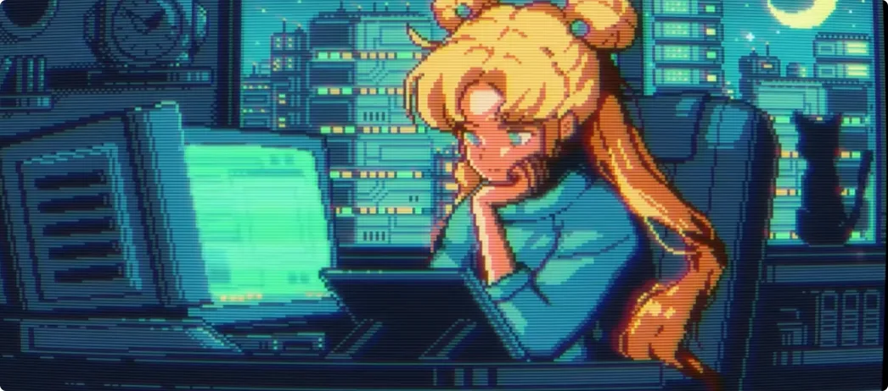

在这段时间里：
**你完全属于自己。**

不属于手机，不属于电脑，也不属于任何外在的东西。
你可以清理自己的精神和情绪。
每天清理，压力才不会不断累计。
我上班那段时间，算是靠着打坐顶过来的。
每天清理完自己以后，用一个健康的状态迎接第二天。
同时也是因为上班，我彻底明白自己到底想做什么。

> **修仙哪有红尘苦。属于是。**

### 普通人没人带，可以先从冥想开始

对于普通人，如果没有人带，我个人建议先接受**冥想**。
这就是一种简易的打坐。
不涉及聚气和走心脉，只清理精神和情绪。
做法也很简单：
1. 坐在那里；
2. 闭上眼睛；
3. 看着眼前的黑色；
4. 什么都不要想；
5. 缓慢、均匀地呼吸；
6. 就这样看着，完全放空。

这是非常好的放松方法。
到了后期，可以慢慢让意识往下沉。
它不是困倦。

是一种：

> **凝望着黑暗的清醒，慢慢下沉，直到落定。**

### 不要追光、追画面、追“异象”

不论打坐还是冥想，都不要去追求所谓的白光、眼前亮点，也不要追求各种景象。

>**入定是一种状态，而不是一个画面。**

是你融入了世界之中，你清晰地感觉到自己连接着这个世界；你能明确感知周围正在发生什么。
那些声音、那些气息，就像水流一样慢慢从你身上漫过去。
仅此而已。
如果拘泥于：

> “我刚刚看见了什么？”

那就是被信息流和幻境裹挟着走了。
因为一开始，不论是打坐还是冥想，都有可能看到一些景象：
- 有些人看到神；
- 有些人看到天空；
- 有的人看到自然；
- 有的人看到鬼怪；
- 有的人看见所谓神光弥漫、鬼气森森。

看的任何形态的景象，都只是**表象**。

> **追逐表象，就容易着相。**

到了后期，你可以有意识地对接一些事物、思考一些事情，此时看见的“象”才具有一定参考意义。
但是仍然需要解读。
在此之前看到的所有景象，我都建议不要理会。
除非这个象真的很特殊，连续几天都看到，或者一闭眼就是。

### 我为什么后来又去做了法师

等到后面熟悉以后，我自己想走法师的路子。
因为我确实很感兴趣，就干了。
然后就去底下了，被拉去打工。
我所有的法和力量，都是在底下干活的时候练出来的。
再加上老的那些关系，反正之后就是上下到处跑，办事、查案子。

只能说：
**现在处理灵体界事情，比处理阳间的还多。**

那么本期基本就到这里。
有什么想问的，可以评论区提出来。
我们下期再见。

## 发展机会：离火运时代的趋势与个人选择

## 第八次阶层跨越的窗口

离火运的时代趋势，是第八次跨越阶层的机会，但也很可能是最后一次。这篇视频我发了很多次，都因为部分内容敏感而没有通过。经过反复修改，才算把核心内容发出来，很不容易。内容很长，你需要仔细看，甚至每年都可以拿出来看一看，一定会对你在离火运时代的发展有所帮助。

我希望把粉丝当作朋友。作为朋友，我想为支持和关注我的人添一把力，帮助你在未来20年创造更辉煌的人生。

自1978年改革开放以来，中国出现过七次阶层飞跃的机会：

1. **1977年恢复高考。** 很多穷孩子实现了阶层飞跃。凡是1977年参加高考且考上的人，现在的生活基本都不差。
2. **20世纪80年代前后的乡镇企业。** 这是我国历史上农民群体大规模由农转商的一次机会。
3. **1984年双轨制套利。** 低价获取商品，再到计划外市场高价卖出，大量的人由此完成了原始积累。
4. **1992年南方谈话后的下海经商。** 一批敏锐的体制内人员和知识分子选择下海。
5. **2002年至2012年，中国加入世界贸易组织带来的资源红利期。** 这一时期诞生了一大批民营老板。
6. **1998年至2019年的房地产趋势。** 很多人依靠房价上涨和拆迁，一跃成为富豪。
7. **互联网兴起，以及后来移动互联网的红利期。**
8. **从现在开始的未来20年，也就是离火运中的“火”。**

2024年甲辰年起，我们正式进入九紫离火运时代。2024年至2043年，“火”在社会层面对应的是**人心与文化**。

## 全球经济转型与文化战争

## 传统增长红利正在消退

社会的发展、国家的发展、个人的发展都离不开经济。经济基础决定上层建筑，未来的战场在于**文化经济**。

20年前，中国的产业链还很弱：铁路不发达、速度慢，公路里程短，航空运输落后。甚至在2005年前后，车匪路霸仍然存在，假冒伪劣、粗制滥造的商品随处可见；信息技术不发达，能源利用效率低，村镇冬天过年停电都是家常便饭。

现在，我们的信息技术、信息安全、移动支付、高铁、物流、承建体系和工业体系，部分领域甚至比美国还要超前。在偏远山村，只要有人居住，快递物流就能送达，通信网络就能覆盖。随便一座四线城市，超市供应链中的采购、运输、加工、信息传递等环节都已经非常完善。这样的经济运转效率，在全球都处于领先水平。

过去20年，从中国加入世界贸易组织以后，中国经济一直保持飞速发展，吃的是人口红利和全球化红利。其实从2013年起，全球经济就已经开始出现萎靡。我们之所以能够一直保持较高的经济增速，一是因为起点低，二是因为在国际贸易方面做得好。

在世界经济一体化进程加快的当下，我们的经济运转效率已经触顶，微观操作很难改变大趋势，很多行业的红利也已经到期。

- 中国互联网用户已经超过10亿，很难再有大幅增长。
- 地产行业基本到顶，能买房的人基本已经买了，买不起的人短时间内仍然买不起。
- 中国目前的城镇化率接近65%，70%左右就是一道红线，大规模城镇化改革带来的红利已基本消耗殆尽。
- 能源消耗型行业和传统汽车领域也已扩张到顶峰，正在缓慢回落。

经济快速增长时，很多问题都被掩盖了。人们的财富在增加，生活质量在提高。虽然贫富差距一直在扩大，但普通人手里仍然有钱消费。现在经济增速放缓，你能切实感受到消费降级、资本越来越集中和垄断，贫富差距导致的社会矛盾愈发明显，民众戾气加重。

全世界都是如此，甚至有些国家比中国更严重。所以你能看到世界各地发生大量恶意伤人事件、日本枪击案等。普通人财富增长的速度跟不上被稀释的速度，循环出了问题，全球都处于经济危机之中。

## 科技、战争与文化竞争

过去解决这类问题，通常有两种方式：

1. **依靠科技进步和技术革命，也就是做大蛋糕。**
2. **依靠战争重新分配蛋糕。**

在当前的时间节点，科技发展的速度正在放慢。美国科技过去一直处于全球领先地位，也正因为科技发展速度放慢、前方被墙堵住了，中国才能迅速追上来。

美国想维持霸权，让全世界为其消费买单，就必须保持远超其他国家的地位。首先要打击的，便是追得最近的中国。所以近几年，我们才会看到美国对中国企业、制造业和产业链进行一轮又一轮的制裁。

全面战争的概率不高。我们现在是“坐在核弹上的和平”，真要打起来，普通人还没到前线，后方的资本大佬可能先“被和平”了。局部战争的概率则很高，例如俄乌战争、缅甸战争、巴以冲突、朝韩对抗等。但局部战争解决不了根本问题，剩下的方式就是**文化战争**。

文化战争其实早就开始了。美苏冷战时期，美国主动把中国纳入由其主导的世界经济体系。美国当时的想法是，只要中国把大门打开，美国的自由民主思想、先进文化和民族形态传入中国，中国人的思想就会迅速瓦解。

1954年，美国已经有彩色电视机和电视节目；20世纪60年代，彩色电视和电话在美国已经普及。当时美国的先进发达，对比中国的落后，基本属于降维打击。

美国自以为预判了一切，却忽略了中国人的凝聚力、大国情怀，以及中国文化的包容性。

在中国，无论你来自哪个省市、属于哪个民族，当你遇到不会做的事情，比如不会坐地铁，只要诚恳地说一句：“同志，你能不能教我坐地铁？”百分之百会有人帮你，不会有人嘲笑你。这就是中国人的凝聚力。

“修身、齐家、治国、平天下”，家国情怀是几千年来扎根于中国人内心深处的精神元素。对中国人来说，不仅有家国情怀，更有大国情怀。自秦始皇统一中华以来，中国人的意识形态始终只有一个：排名第一是应该的，排名第二就是不行。我们追求的是大国崛起，是民族复兴。

为此，我们愿意付出别人难以想象的代价。科学家愿意啃着馒头研制“两弹一星”，深入无人荒漠勘探石油，无数劳动力自带干粮开荒修路。中国文化的包容性，更是历经几千年而历久弥新。

现在爱喝可口可乐的人很多，爱吃肯德基、汉堡的人也很多，但在我们的意识里，都知道这些属于垃圾食品，只是偶尔尝个鲜。

## 文化输出决定产品空间

文化战争没有想象中那么简单。在文化输出方面，美国全方位占领了文化高地，并利用文化和舆论影响了太多国家。

从印度的《三傻大闹宝莱坞》、泰国的《天才枪手》等电影中，你会看到，他们顶级学校里的顶级学生，最大的梦想往往是去美国。好莱坞、美剧、影视、嘻哈音乐、民主自由、美食等文化符号，这些年为美国吸引了大量人才。

最近几年，也曝出过不少间谍新闻。美国在我国的间谍其实不少，尤其集中在文化传媒领域。他们引导着我们的思想和文化，一些“香蕉人”大V不停发表鼓吹国外的言论。之前的“毒教材”风波，就是典型案例。

为什么国内有些人那么向往美国，想要“润出去”？因为美国的文化宣传做得好。很多大V其实是美西方意识形态的带路党，是针对中国发动意识形态战争的伪军，也就是美西方口中的“让中国人忽悠中国人”。

如果所有人都向往美国、喜欢美国文化，以美国产品为尊，以去美国为荣，这个国家就再也没有希望了。

> **战争，攻心为上，攻城为下。**

离火运中的“火”，对应的正是人心和文化。中国文化博大精深、包容性强，想全面侵蚀中国文化很难；但中国文化想真正推广出去，仍然需要很长的路，而这也正意味着巨大的增长空间。

在文化领域，中国在世界上的影响力与美国相比仍有很大差距。在国际高端奢侈品和艺术领域，很多人瞧不起中国人，认为中国人没有审美。我们的手机厂商为什么要联名国外高端设计品牌？因为我们自己的品牌积淀还不够。为什么一定要打造自己的高端设计品牌？因为我们必须拥有。

谁的文化占据主流，谁就会拥有更大的产品输出空间。如果其他国家的人都向往中国文化，想来中国，以会说中文为荣，以使用中国产品为面子，甚至一个普通大学生去国外旅游，都能兼职做中文外教赚钱，中国经济怎么会不快速发展？

现在的文化战争中，真正坐上牌桌的玩家只有两个：**中国和美国**。

2024年至2043年的九紫离火运时期，文化战争将再上一个台阶。近几年，政策层面一直在提文化复兴、民族复兴，也在推动全面复兴传统文化。当前民众的道德价值观受西方文化影响较大，恶意伤人事件频发，民众心理压抑，没人再谈论为社会作贡献，也很少有人谈论理想和抱负，这是一种非常畸形的文化心理。

现在，对网络舆论引导和挑唆行为的处理已经比过去严厉很多，对不良文化风气、不良社会风气的管控也在进一步加强。国家层面承办亚运会、冬奥会等大型国际体育赛事，宣扬中国文化，同时鼓励各地发展特色文化旅游经济。

无论是国策，还是具体行动与鼓励，其实都在为一件事做准备：**文化输出，并将文化输出塑造为新的经济增长点。**

## 理解九紫离火运的底层逻辑

## 从问题溯源，而不是追逐答案

为什么要先说这些？因为离火运是“天时”，世界格局和社会经济是“地利”与“人和”。更重要的是，要理解趋势的起源。只有了解文化输出趋势的形成过程，才能更好地顺应趋势。

我的行事理念是：遇到问题，先寻找问题出现的原因，也就是溯源，再顺延到现在，真正了解这个问题。这样的行事理念让我受益良多，让我不会只局限于事情表面。

否则，即使这一次的问题解决了，下一次它还是会出现。人的成长，是让已经出现过的问题以后不再出现。出现一次解决一次，却始终没有触及根本，那就是一个无底洞。对于人的成长来说，其实没有任何进步。

有困惑时，我从来不是为了得到一个现成的结论，或者直接给你一个固定答案。我更倾向于启发思考。只有经过思考，才会真正理解，才能根据自己的情况去运用、去行动。

所以你才会看到，一些人看起来一直在跟着趋势走，总觉得自己发现了一个又一个商机，但既没有承接趋势的能力和条件，也不了解趋势当前所处的阶段，总是晚一步，最后只能像猴子下山一样，两手空空。

离火运是时代的机遇，但只有在真正理解的基础上，才能借此发展自己。

## 三元九运与离火之象

九紫离火运来源于三元九运。按照这一体系的说法，每隔60年，水星、金星、地球、火星、木星、土星等会回到与60年前相近的位置，形成一个小轮回，也就是一甲子，或者叫“一元”；每隔180年，九大行星会处于太阳的同一侧，分布在一个较小的扇面中，也就是所谓的“九星连珠”，形成一个大轮回。

三元九运是一种时间划分方式：

- 一元为60年；
- 三元共180年；
- 一元分为三运；
- 一运为20年；
- 三元合计九运。

## 离火的七重含义

### 1. 离为火：炎上与爆发

火的类象，核心状态是**炎上和爆发**，为日、为电、为甲胄、为戈兵，都是这一状态所象征的具体事物。

对应离火运中有利的行业方向：

1. 新型能源的开发与利用；
2. 能源传输和利用效率提升。

这两个方向也是未来科技发展的重要方向。

不利的一面是战争。目前已经显露端倪，例如俄乌战争、巴以冲突、缅甸战争、朝韩争端等。

### 2. 离为明：精神、文明与文化

“明”对应光明与文明。离卦象中虚，对应精神和文化。

> 星星之火，可以燎原。

火不是某一个具体的人，而是精神的传承。“火主礼”，对应的也是文化。

有利的行业方向包括：

- **文化方向：** 视觉类产品、电视、电影、短剧、绘画、艺术、动漫、游戏、短视频、国学、智能产品、虚拟现实等；
- **心灵方向：** 心灵疗愈、心理学、心理咨询、专业顾问、灵修、玄学、宗教、冥想等。

这些领域会被更多人关注，并得到更快速的发展。不利的一面是，精神空虚、心理疾病等问题会增多，人的戾气也会增加。

### 3. 离，丽也：依附、共生与运化

很多人把“丽”简单理解成美丽，以此判断医美行业会发展得很好，这是一个误解。

有火，才会产生光明；“明”依附于火，这就是“丽”。但依附只是一种表象，“丽”真正对应的是一种状态：**共生和运化**。

在原有事物的基础上运化出新的东西，也就是浴火重生。它来源于过去的事物，又融合新时代的理念，迸发出新的生机。

对于个人而言，可能是依附于大平台或产业链的资源，去做自己的东西；而自己的东西，又能为平台和产业链带来更多资源。

对应的有利行业包括传统文化、中医、针灸、习俗、手工艺、非遗传承等。这些历经时代考验而保留下来的事物，与当代理念和科技结合后，会诞生新的行业领域。

不利的一面，是腐朽思想可能出现复辟趋势。

### 4. 离为雉：美学、审美与外在形象

“雉”是羽毛漂亮、很有气势的野鸡，代表外在美丽、美学和审美。

对应的有利行业方向：

1. 美学设计、审美相关领域；
2. 体态培养、体态矫正、气质培养相关领域；
3. 外貌管理、美容、医美相关领域。

不利的一面，是可能出现畸形审美。

### 5. 离为目：眼睛、心脏与精神系统

“目”就是眼睛。人体中的眼睛、心脏、精神系统属火。

对应的有利行业方向：

- 眼睛、视力相关领域；
- 健康、养生相关领域；
- 精神与心理相关领域。

不利的一面，是视力和精神问题会增加，人们也更容易在这些方面出现疾病。

### 6. 离为中女：不是“中年妇女”

一些人把“中女”解释成中年妇女，这是很大的误区。

> “离再索而得女，故谓之中女。”

乾卦取坤卦第二爻而形成离卦，这是离卦的形成过程。水平再差，也不至于把离卦中的“中女”理解成中年妇女。

“中女”指的是一类女性的心性状态：**外刚内柔、独立自强，上能担得起责任，下能心思细腻、体谅别人。**

长女、中女、少女并不只是指不同年龄的人，也对应不同的心性与品德状态，可以理解为不同的“配位”。

我的看法是，具备“中女”心性状态的人，在离火运中会发展得更好，更能得到人们的认同与关注，而不是其他人所说的“中年妇女”。相对而言，外柔内刚的长女、过刚率性的少女，在离火运中的发展就没有那么有利。

### 7. 离为南方：信息公开与及时获取

> “离，南方之卦也。圣人南面而听天下，向明而治。”

“南”既是方位，也指能够及时获取最新信息的地方。只有信息公开、透明，才能形成大的成果。

## 离火运中的行业与城市机会

## 七类有利行业

综合来看，离火运中较为有利的行业包括：

1. **健康医疗**
   - 眼睛、视力相关；
   - 健康养生；
   - 中医；
   - 精神与心理相关领域。

2. **文化领域**
   - 传统文化；
   - 非遗传承；
   - 视觉类产品；
   - 短剧、电影；
   - 绘画、艺术、动漫；
   - 短视频；
   - 国学、智能产品等。

3. **能源方向**
   - 新型能源；
   - 能源利用效率提升；
   - 能源传输技术。

4. **心灵方向**
   - 心灵疗愈；
   - 心理学、心理咨询；
   - 专业顾问；
   - 灵修、玄学；
   - 宗教、冥想。

5. **女性相关领域**
   - 女性地位会进一步提高；
   - 女性认知、素质、才能培养等行业会进入爆发期。

6. **美业相关领域**
   - 美容、医美；
   - 整脊、正骨；
   - 体态调整；
   - 气质和形象管理。

   这些领域并不只局限于女性市场，未来会有越来越多的男性产生相关需求。

7. **体验式经济**
   - 地方特色文旅；
   - 虚拟现实；
   - 线下实体展馆；
   - 能够提供精神满足和愉悦体验的产品与服务。

## 可能快速崛起的城市

离火运中可能快速崛起的城市包括：

- 杭州；
- 长沙；
- 武汉；
- 苏州；
- 宁波；
- 潮汕等地区。

这些城市既有经济潜力，又有文化底蕴，还有产业支柱、科技创新能力，信息相对公开透明，能够吸纳更多的人才。人口流入增加，城市就更有可能崛起。

## 四类相对不利的行业与工作

### 1. 单纯依靠个人时间和精力产出的行业

例如传统金融业中的柜员，以及会计、审计、担保等岗位。这类工作有一个共同特点：主要依靠个人时间和精力产出，产出成果无法持续创造新的价值，也难以迅速传播和爆发。

火的核心类象就是“爆发”。成果能够迅速扩散、形成爆发的领域，才会拥有更大的潜力。

### 2. 重执行、低思考的工作

例如制造业流水线岗位，很容易被人工智能取代。

火对应精神和思考。只有思考和创新，才能创造新的价值。

### 3. 高能耗、高排放、高污染行业

未来能源结构优化、新能源发展是大趋势，传统高耗能企业会被逐渐淘汰。

### 4. 单纯依靠“人多”的行业

未来的经济发展，一定会从依靠人多、团体使劲，转向**精英战略**。未来，“人”不是核心，“人才”才是核心。

## 真正的机会不等于盲目跟风

## 天时、地利与人和缺一不可

任何一运都并非绝对的好或坏。只有真正理解离火运，思考它对应的状态，才能找到真正的机遇。

很多人为了迎合某些节奏而人云亦云，让大量女性变得非常亢奋，最后成为新一轮韭菜；或者看到自己当前就在所谓的离火运行业，待在所谓有利的城市，就觉得自己未来20年一定会发大财。

这样的人，在离火运中反而可能首先被淘汰。

> **忠言逆耳利于行。**

时代是人的时代。天象规律是天时，世界格局是地利，社会经济是人和。只有把天象与自然规律、世界格局、社会经济规律结合起来，才能找到真正的机遇。

历史上曾经出现过多次离火运，总结起来有几种共同表现：

- 艺术繁荣；
- 文艺复兴；
- 文明发展；
- 科技进步；
- 战争动乱；
- 人心归一。

但时代在向前发展，世界格局也在变化，轮回绝不意味着一模一样。这一次离火运的核心，是**文化输出**。

## 个人的文化输出就是价值观输出

对个人来说，文化输出就是把自己的价值观和理念表达出来，链接更多的人。

中国社会的主流价值观正在发生转变。离火运时代，人们对精神、文化和审美的追求增加。精神更加充实，人就会变得更理性，更专注于现实生活。

过去那种极端投机、相信可以一夜暴富的心理会越来越少，人的内心会更加成熟。未来不再是说几句忽悠的话就能搞定客户的时代。哄着、骗着、说好听的话、给人洗脑，不再有市场。

想靠捷径、投机取巧、忽悠割韭菜、仿冒欺诈，都会越来越行不通。成功学、贩卖焦虑会逐渐崩盘，很多故弄玄虚的东西也会消失。

如果你想在离火运中出头，必须有好的人品，得是一个好人。你的价值观和理念要能够指引更多人，能够给别人带来帮助，切实给别人带来好处，让人们产生更多思考和成长。只有这样，人们才会认可你、相信你、支持你。

*董宇辉会越来越多，李佳琦会越来越少。*

人工智能和虚拟经济越发达，人们就越会看重内在与真实。虚荣、炫耀、面子经济会逐渐衰落，人们会更加渴望内心富足，喜欢真实的东西。依靠包装、硬凹人设的时代正在过去。

完美人设的偶像是脱离大众群体的。一个完全没有黑暗面的人，反而不值得信任。是人就会有缺点，每个人或多或少都有黑暗的一面，但这并不妨碍我们去做正确的事，这才是真实的人。

未来，人们会越来越喜欢真实的人，越真实越好。一个真实、有内涵、有思考、有正向价值观的好人，才能在离火运时代链接更多的人，抓住真正的机会。

## 企业经营与文化价值观

## 产品的根基是品质、文化与体验

对于做事业、做企业的人来说，要把地方文化输出，形成更多产品与体验，为更多的人服务。

“地方”不只局限于地理区域。文化的载体不是某个地理城市，而是人群。你的特色、核心竞争力、行业圈子的文化、对待员工的文化理念、企业价值观、用户群体的文化理念，都会成为产品的根基。

“粗制滥造、力大砖飞”的时代过去了。未来的产品，靠的是：

- **品质；**
- **文化；**
- **体验。**

这些都需要老板或高管脚踏实地做事，真正满足客户需求、解决客户痛点，再以文化和价值观塑造认同。

## 老板和管理者应该把时间用在哪里

如果你是老板、高管，或者未来想做事业，希望你记住下面的话。这也是我过去做企业咨询时得到的宝贵经验：

> **富在术数，不在劳身。**

仅靠勤劳，很难创造大财富。单纯依靠体力和时间，并不是在努力改变未来，充其量只是在承受自己的过去。

在工作和事业上，能不亲自动手做的事情，就不要亲自做。你的时间应该用于思考整体行业趋势、市场趋势，思考如何服务员工和同事，提高他们的运转效率。

员工才是公司的财富。不要逼迫员工进行无意义的加班。很多中国式加班，不过是在满足老板“地主思想”式的控制欲。

应该从“如何让员工获得更多收入、过上更好的生活”这个出发点管理企业，塑造企业价值观。员工收入增加，你的收入自然也会更多。

火势聚众、形成爆发，上下一心，公司才能真正发展起来。

## 国家层面的文化输出

对国家来说，是要把民族文化和意识形态输出出去，引领世界文化发展，吸纳世界人才，开辟人类命运共同体。

国家层面的内容不适合说太多，只说一句：

> **中国文化智慧走向世界，势不可挡。**

把个人、公司、国家这三个层面琢磨透，再结合自己的条件和能力顺应时代发展，才有可能成为最终的赢家。

## 未来20年，人真正要修的是自己

## 从集体内卷转向向内求

离火运未来20年，人真正要修行的是自己。

现在的我们被套上了物质枷锁，陷入集体内卷，而且越来越严重。越来越多的人开始出现心理和精神问题。自我修行、向内求，是唯一的路。只有内心豁达，才能面对一切可能出现的危机。

一个人最大的底气是什么？

我们所倚仗的身体迟早会腐朽，我们所信任的大脑会逐渐迟钝，记忆会变得模糊，钱财终会散尽。我们爱的人，也会随着时间慢慢消逝。

> **兴尽悲来，识盈虚之有数。**

任何事物都有自己的生命周期，任何人与物都会改变。我们所拥有的一切，都只是暂时拥有，随时可能离我们而去。

当这些都离我们而去时，我们还能倚仗什么？我们还有什么底气？

## 允许一切发生的从容感

一个人最大的底气，是**允许一切发生的从容感**。

感受每一种情绪，感受生活本身，活在当下，做真正的自己。不在意别人的评价和眼光，永远保持自己的节奏和步调。

人生没有白走的路，每一步都有它的意义。一路上有你的成功，也有你的失败；记载了你的愚蠢，也印证了你的智慧。所有这一切，才造就了现在的你。

而现在的你，才是未来的起点，也具备成就未来的最大可能。

> **在你人生的舞台上点燃烟花，让你的未来在离火运中绽放。**

## 为何精英圈修行者更容易领悟仙道的捷径？

## 前言:  精英圈子的一定优势
为什么说精英圈的修行人士普遍比一般的修行人更容易参悟到，更容易找到修行的真正方法，更容易找到修仙的捷径？
这里面最大的差距体现在认知层次上。**当一个人站的位置足够高，他才能具备丰富的阅历，吃透更广阔的知识体系，在思考问题或领悟道理的时候会更本质，更贴近现实，更能落地。**
这三个要素在修行上缺一不可。具体来说就是能在众多修行骗局中去伪存真，用实证检验真相，而得到的真相往往只有一个，想要排除万千个错误答案，没有相应的认知能力的话，是办不到的。

虽然有这些认知优势，但这些人最大的痛点其实和所有人一样，就是遇不到真正的修行，完全不清楚真正的修行会是什么样子。
如果市面上本就没有答案，那无论你多聪明，多有悟性，也是徒劳的。
**从最现实的角度，凡人想要突破对仙道的认知壁垒，没有真正的人外高人介入，是不可能填补信息差的**。

大家好，我是修炼者小烨，一步步了解为什么他们更容易接近道，同时我也会给出解决问题的方向，在视频的最后，我还会透露一些求道的方法。

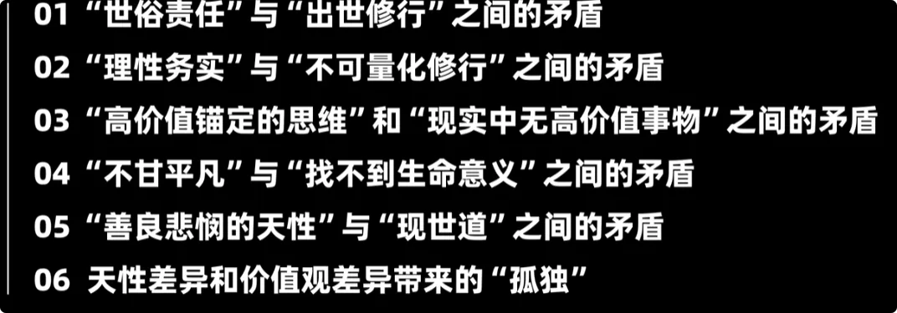

## 1.世俗责任与出世修行之间的矛盾

能走到精英阶层的人，要么是自己辛苦摸爬滚打才有了今天的日子，要么是继承祖业，肩负着家族的责任。这种情况下，他是不可能说放下就放下的。
1. 因为一个有求道之心的人，必定也是一个有道德责任感的人，又怎么可能随便抛弃他珍视的家人呢，更何况他的事业可能关乎着很多人的生计。
2. 其次让他抛弃之前辛苦创造的成果，这种行为无疑是否定他过往的努力，过往的人生甚至是否定他存在的价值。
在不知道眼前的路子对不对，不知道能修出什么正果的情况下，让他去冒这么大的风险去投入，这跟毁掉他和他的家人没有区别。

所以精英圈的修行者其实是厌倦传统修行中要求放下一切的二元对立论调的。

他深知自己肩负巨大的世俗责任，同时内心深处又放不下对修行的想法，那他必然是想在世俗责任与精神追求之间找到一个平衡。

所以相较于避世修行，精英修行者更喜欢听**入世修行**。
他会希望能有某位修行大师尊重并赋能他的尘世成就与责任，提供入世修行的可行路径，并产出实实在在的修行成果。

不过现实是大师给不了答案，除了让各位入世去修一套心法，或者去修看不见摸不着的未来式福报，其实给不出实在的修行路径。况且又有几位大师敢保证自己能修成呢

对于习惯了务实和追求高效的精英修行者来说，这种高投入低产出的修行方式显然是不合预期的。那到底应该如何入世修行，为什么精英修行者不得不比普通修行者陷进更深的世俗活动中，这里先按下不表，我们接着讲。

## 2.务实理性与不可量化修行之间的矛盾

对于这样一群思维活跃，洞察力强，时间又宝贵的人来说，做任何事情都要评估投资回报率。
**这不是功利思维，是尊重自己，尊重生命，尊重时间的表现。**
比如既然大家说修行是提升生命的质量，甚至可以提升生命的维度，那市面上提供的修行方法能不能给他带来实际的效果？他投入了金钱，精力和时间之后，有没有明确的可验证的，甚至是可触摸的回报？

然而现实是市面上流传的修行方式往往就只有一套心法，常常连最基本的两个诉求：
一个是规避风险和危险的能力
一个是保持高能量，高活力，都满足不了。
既不能帮助他察觉到危险，保护好自己和家人的安危，又不能实际提升他的生命力，健康和运气。究其原因是，这些修行理论不可被量化，也不见实效。不可量化，就不可实践，不可实践检验，就等于不可证伪。
人困在逻辑自洽，不可证伪，不见实效的学说里，能修成结果才怪了。所以更别提通过这些修行来解决精英修行者复杂的现实困境。

比如说人身在高处，就意味着面对巨大的风险，必须去竞争生存的空间，可能要面对更高背景，更无下限形势，比他更狠，运气比他更好的人。
在这种情况下，任何人都会希望自己具备对风险的预知能力和规避能力，同时希望保证自己高能量，高活力去潜心经营，要保证头脑灵光，能准确嗅到生机，否则就可能被淘汰。最后他还得想着怎么拼得过别人身上无法量化的运气。
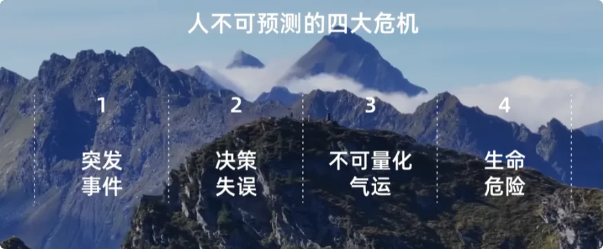

光以上这几点哪一点能通过常规手段来获得呢？
读书可以吗? 商业咨询可以吗?

都不能!

只有靠非常规手段。这也是很多人哪怕不是真正想修行的人，也愿意涉猎修行领域的原因。因为很多人都意识到自身气运的缺陷，所以开始无底线的向外借运，甚至是截运，虽然不是正道，但起码可验证。

所以如果一个修行方法不能带来任何实际的超常规的价值，甚至连歪门邪道都比不上，那对于一个务实的人来说，肯定是不敢投入的。

所以认知层次越高的修行者，越是寻找**可量化、可操作、可反馈**的修行方法，甚至会通过自己预期的结果来反推执行的过程。比如说既然要讲修行，要超越肉体凡胎，那首先要改变的就是一个人的性命。

改变性命的第一步是*改变肉体和生气*。
>在严格的自然法则下，肉体和生气是不可能被改变的，除非超自然法则，超常规的资源介入。既然是超自然超常规的资源，那么当人使用之后，身上必然应发生超自然超常规的变化。只有通过这些实实在在的变化，人才能确定自己修行的路子是对的。

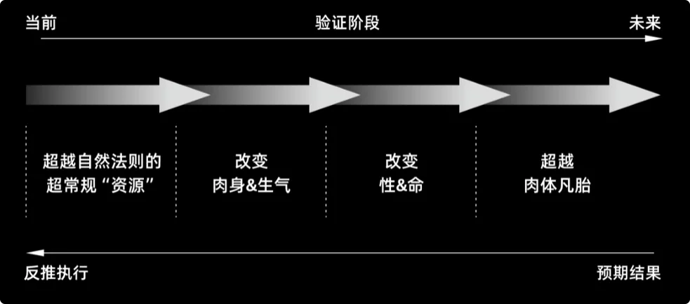

在我之前的视频中，我都有跟大家说第一步该怎么做，能获得什么，未来可以怎么规划。这些其实都是在告诉大家，修行需要量化，你要务实地去规划，去实践，去验证，不要空想一些不可证伪的理论，这样只会颗粒无收。

## 3.高价值锚定思维和现实中无高价值事物之间的矛盾

或者说叫停止成长的痛苦。当一个修行者在世俗层面攀至高峰的时候，其实是很无聊的。真正高层次的修行者很难看得上尘世的名利，只能说知道其重要性，但还不至于痴迷。很多人在取得巨大世俗成就之后，会陷入“然后呢”的虚无感和倦怠感。

物质成功带来的边际效益递减，他肯定渴望找到超越名利，超越世俗，**更具持久意义和深度的生命答案。** 这也是精英修行者寻求二次实现自我价值的动力来源。

这种生命意义上的虚无感会倒逼一个人对事物的价值更加挑剔。他会认为要么找到超常规价值的事情去做，要么浑浑噩噩地活在这个世界上。

我相信哪怕他已经站在社会的顶端，他也找不到比财权名更高价值的事情，因为再往上找就不是人间的事了。

说直白点就不是修圣人了，而是修仙人。

也许成为天外神仙，就能接触到更高价值的生命体验，这也是很多精英修行者开始寻求仙道的原因。

可问题是你能在社会上找到得道成仙的方法吗？不可能的。

为什么找不到呢，因为越往上走，想要突破信息差就越难，一丁点儿信息差就能改变一个人的结局，而最后一层揭开超常规价值的信息差，不掌握在人手里。

你要从原来的金字塔走向下一个全新的金字塔，那原来的金字塔的那些人能帮到你吗？不能，因为你们之间没有关键信息差。
所以如果没有下一个金字塔的人亲自搭把手，你不可能摸得到门道。也就是说，除非能见到天外高人，恐怕真的没有别的渠道了。

想必也有极小一部分精英修行者想到这一层，于是到处去寻高人，但最后都无功而返，因为此高人非彼高人，他们也给不了关键的信息差。

说白了这些人的认知层次还不够，对价值洞察力还不够。

我举个西游记的例子，因为这个例子最直接。
>菩提祖师问孙悟空，道，门下一共有360旁门，门门都可以有结果，从诸子百家到各种功法，从医药养生到万般神通，你学哪个？孙悟空说，我只学可长生的那个。这就是高认知的修行者和一般修行者的区别。

世上这么多修法，唯有长生道能带来生命之变，其他都只是思想和能力上的改变。得长生道就等于站在知识体系的顶点，有了长生，那其他知识还不是迟早学会的事情。
也就是说，**长生道才是最顶级的信息差，也是最顶级的价值**。
所以认知层次越高的求道者，越会像孙悟空那样去专注最本质，最有价值，最顶级的信息差。

这里必须先证明一下，有人会问修行者以价值为导向，这种修行是不是太功利了，太外求了，修行不都说要无欲清净为主吗？

其实不然。如果一个修行者没有明辨事物价值的能力，那就容易满足低价值事物，会耗在无意义的事情上，会耗在旁门偏道，识别不出成仙大道。

而且就算走进了正道，也会把精力放在无关紧要的小事上，修不成大器。

其次修行者若无法判断一件事物的价值，没有建立利益思维，就等同于没有利害思维。若不懂得事物的利害性思想和形式，肯定就会轻浮，这样不成熟的人是不够格儿参与更高级别世界的。

最后没有直面利益的考验，何谈无欲的觉悟。很多人都是在社会上吃了闭门羹才想修行，若真遇到大的利益，他可能比谁都要贪婪，又怎么谈无欲清净呢。

## 4.不甘平凡与找不到生命意义之间的矛盾

刚才说了，在原来的金字塔体系里，凡人是无法突破信息壁垒的，这也导致求道者陷进新的困境里。
**一个实现世俗层面高价值的人，对世间看得是非常透的，很多事情都不能引起他的共鸣，常常陷入无意义的虚无思绪中。**
**但是又不甘这么平凡的过完一生，所以会强行给自己编造一套生命的意义，找到一个最接近恒定价值的事情，以此来维持自己的高价值感官。**

从哲学上讲，个体的价值往往靠一些事物来衡量的。比如在社会上，人们常常以社会地位或者名垂千古来衡量一个人的价值。

但高层次的修行者一般会认为人类社会之上肯定有更有价值，更值得做的事情，他希望通过做这么一件事儿来感受它存在的意义。所以他必须把这件事想得足够宏大，才能显得他的思想和灵魂也宏大，他才有生活下去的动力，这也叫意义本体论。这种思想常常出现在殉道者身上。
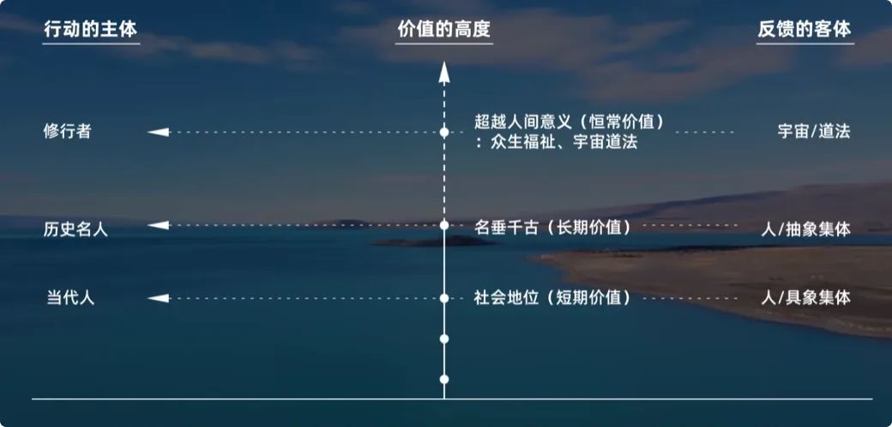

当一个真正的修行者开始自我定义的时候，他的底色就体现出来了：
***悲悯与道，也就是本心，悲悯众生和本心向往道法。***

这里我们先得搞清楚谁是修行者。不是谁想修行，谁就叫修行者。真正的修行者其实是一群本来就得到修炼过的人，他们的所有修炼经历和资源都来自于道。是道，让万物有了灵性，有了生机，也同样是道，让修行者更灵，更有生命力。

我们都懂一个道理叫“身体发肤，受之父母，不敢毁伤”，这群修行者也会本能地反哺到爱护他创造的万物万灵，而且会非常注重得道，注重道德。

所以当万物万灵受损时，他们会心疼，会悲悯；当道德崩坏时，他们会愤怒；当周围都堕落无光时，他们仍然会坚守善良的底色。

所以观众们，你明白你为什么放不下善良和道德了吗？因为你的底色确实不一样。

但真正的修行者毕竟是少数。

为了让自己活在这样一个格格不入的世界，修行者通常会给自己建立一套自我神圣性，比如**彻底叛离世俗价值，不想做功利型精英，不停地思考“我跟他人不同，那我存在的意义是什么”，时刻寻找自我存在意义的终极命题。**

在他的构想里: 
也许是为众生做点什么
也许是为宇宙道法做点什么
总之他希望将自我完全溶解在宏大意义中，甚至会觉得“这件事成了我消失也无妨”。
如果说功利型修行者追求的是“我因奉献而伟大”，那真正的修行者追求的就是“我消失于伟大中”。
所谓后其身而身先，外其身而身存，最终达到至人无己，神人无功，圣人无名的境界，妥妥的精神赤子。
讲到这里，你有没有发现这套想法和道德经里的“德”高度契合，即放下一切虚名，顺应宏大的道去实现自己的价值。

现在你回头看看你的一生，你会恍然明白: 
为何你投身在这样的家庭，为何你要有今天的成就，为何要有这样的思维和视野，为何又要深陷入世还是出世的两难。
因为最终的目的就是要锻炼你德与道的能力，这其实是在给你修仙道的准入门槛。当你明白这一点的时候，你可以开始真正的修行了。

## 5.善良悲悯的天性与现世道之间的矛盾

如何精准的悲悯，也许是精英修行者常常思考的问题，因为他们有一定的资源和能力去做出善举。

**我遇见的有能力的修行者，他们确实也是这么做的，但他很快就会遇见人性的阴暗面，让他失望透顶。当他失望到想放弃的时候，他又会遇见人性的光辉面，重燃心中的希望。**
命运就好像在戏弄他，让他对人类集体有种摇摆不定的态度，一边是对现实的失望，一边是不能完全放下的慈悲天性。这会促使他不停的思考，对于人类集体来说，到底什么是善，什么是恶。这个问题有没有答案不重要，重要的是这个人在善恶福祸这件事上锻炼了思辨的能力。

我不怀疑精英修行者理解“善非功，恶非过”的能力，毕竟头脑阅历和眼界都摆在那里，但是他肯定没有实现善果的能力。

善的评判标准是什么？

情境、动机、手段、结果、普惠性、信息差，缺一不可，但他一个都做不到。

从情境和普惠性上讲，人类及其他众生到底陷入什么困境，他不知道。连思考问题的背景都不知道，那他的立场动机和手段肯定也是错的，带来的结果也会大相径庭。

那判断善的关键是什么呢？是信息差。一个关键的，哪怕很小的信息差，就能导致原来的善恶定义完全颠倒。换句话说，如果他提前预设并站定了善人的立场，到头来善恶概念一换，他就可能万劫不复。
虽然这是他在无知的情况下做出的选择，但也是要引发因果和承担因果的，任何人都不能以“我本意是善的”为借口陶醉。

所以先补信息差，先提高认知。

那怎么填补信息差呢？还是一样，没有人间实例可以让我讲。

这里我讲西游记的故事：唐僧也是个修行者，慈悲又有智慧，但因为他肉眼凡胎，判断不出现实感官以外的真相，把白骨精当善人接纳，把徒弟当恶人赶走，最后差点步入绝境。

如果取经路上没有孙悟空的火眼金睛和非凡手段，像唐僧这样有影响力的善人，大概率会引狼入室，害死更多的人。

所以如果你只是肉眼凡胎，看不见世界的全貌，看不见众生的因果业力，那就别管行善的事情了，还是先修好自己。

## 6.天性差异和价值观差异带来的孤独

修行者必然是孤立于世人，人性人心，孤立于世人价值观的。

不管你有多会自我排解，不管你再坚强独立，一个人最真实的一面迟迟得不到正反馈
如同把你困在一座孤岛上，长期下去一定会精神崩溃的。如果你觉得你也没那么孤独，那么抱歉，命运一定会加大剂量。
因为真正的修行者注定得是孤独的，这种孤独既是一种诅咒，也是一种恩赐。因为只有这样才能防止你的心在人间扎根，才能逼迫你离开原来的圈子，迫使你去找路，去找自己真正的归宿。

因为人间不属于你，宇宙星辰才是。
逗留人间，等同于辜负你过往的万千岁月。

只有当你找回真正的修行道路的时候，你才能真正想起你是谁，真正的天梯才会出现在攀登的过程中，你才能遇见真正的朋友。

## 如何求道

最后我们再来讲讲如何求道，很多人都不知道如何求道。毕竟求道不同于人间的任何一门学问，因为它包含以下几个关键要素：
*求道者求道的方式，传道者传道的方式以及得到的方式。*

试问历史上有几个人见过真正的传道者，更别提如何向其讨教学问了。

首先作为求道之人，应该对仙道保持谨慎不怠的态度。

有了这种态度，你才会在接触不同修行理论的时候，时时想着分辨真伪，而求真恰恰是提高个人悟性的核心驱动力。
**真正有悟性的修行者，一定具备深刻的洞察力，能穿透语言和视觉的表象，直奔最深处的本质和核心。也就是说他会本能地去找最真实，最实在，最恒定，最接近顶层，最接近本貌的东西。** 
像市面上那种空泛的灵性营销，其实一眼就能望穿。反过来说，如果一个人没有建立这种意识，就没有办法对复杂的信息去伪存真，也就分辨不出谁才是道出真相的那个传道者。

其次求道必须要有传道者。正如前面所说，想要从一个金字塔走向另一个金字塔，这个信息差必须要有下一个金字塔的人来填补，否则你是无法实现认知突破的。

现在你需要反推一下这个陌生的人，对方会是一个什么样的人，会以什么方式出现，如何得以相见。
我们来推理一下：**首先他与凡人之间肯定是有价值观鸿沟的，他有着更高价值的目标，这样的人只会关注实现高价值事件本身，一切言行举止都围绕高价值事件而表露。只要有需要，他可以见人说人话，见鬼说鬼话，甚至可能是大道无情的。所以你不能用世俗的价值标准去判断它的外在表现，你必须发挥你求真的能力，而这也恰恰是传道者考验人的方式之一。**

我们翻翻古书，为何先人通常先化身成借赖老者的模样，最后才显露仙风道骨？
因为绝大多数人都是不合格的人，见到神仙就一个态度：
你要保佑我发财，你要度得众生平安，你要大爱无私帮助我，否则你就不是好神仙。

世人完全把神仙当做许愿池，所以真正的传道者不会招摇过市给自己找麻烦，他只需要在暗处偷偷考验少数的求道者就可以了。

接下来我们想想他会认可什么样的人呢？换句话说你有什么价值亮点值得一看的？

想修行的人很多，有悟性的人很多，有能耐的人很多，有钱的人很多，有品性的人很多，有来历的人很多，能持之以恒的人也很多，唯独样样全面的人很少。

## 结尾
当然人无完人，能以真诚态度全力以赴便是最好的开始，古书上的神仙大多也是以此为标准。所以再来反推你求道的方式，你到底该以何种姿态求道呢？

在这个时代，有的人习惯了义务教育，有的人习惯了花钱买知识。对于非义务的，非金钱衡量的学问，很多人是不懂怎么求学的，更别说进一步求道了。不懂的朋友可以了解一下“童蒙求我，非我求童蒙”，孔子礼问老子，只闻来学，未闻往教。束修之礼，程门立雪等这些故事。

接下来我们继续推理一下传道者传道的方式。

你既然是求道者，你要修炼仙道，那么对方理应传什么给你？还会是一套虚的无法证伪的理论或心法或几本书吗？不会的，一定需要一些能改变你生命本质的好东西，一定是实实在在的可证伪的真东西。这也是你作为求真者，判断传道者是真是假的依据，而真东西从不怕被检验，这就是传道者的底气。

最后你遇见了贵人，又有了方法和路径，是不是就一定能得到呢？当然还得看个人造化。如果你有点阅历，应该能明白以下两个道理：
*最好的东西(机缘/机会/资源)从来都是挑人(优秀的人)，而人成长的最佳捷径是同比你更厉害的人共事。*

这期就先聊到这儿，我是修炼者小烨，我们下期再见。

## 富豪明星为什么总爱找“大师”

> _**富豪和明星真正崇拜的从来都不是大师，而是背后能带来运势的力量。**_

## 1. 为什么越有钱，越想找大师：试错成本、选择意识与生存焦虑

### 富豪和明星为什么更愿意尝试“神秘力量”

为什么很多富豪和明星最后都爱找大师？如果你身边有娱乐圈的朋友，那么你会发现，连二三线的小明星都喜欢搞点神秘力量回家保自己的运势。

要说缘由，大致有三个：

1. **有钱，试错成本低。** 花点小钱检验一个大师，对他们来说很容易。
2. **有商人思维。** 生活条件好的人普遍都信奉“多一个选择，多一个出路”。如果神秘学有用，干嘛非要拒绝呢？
3. **这些大师多少是有真本事的。** 做出了一些常人做不到的事情，不然你真当这些富豪和明星都是傻子吗？

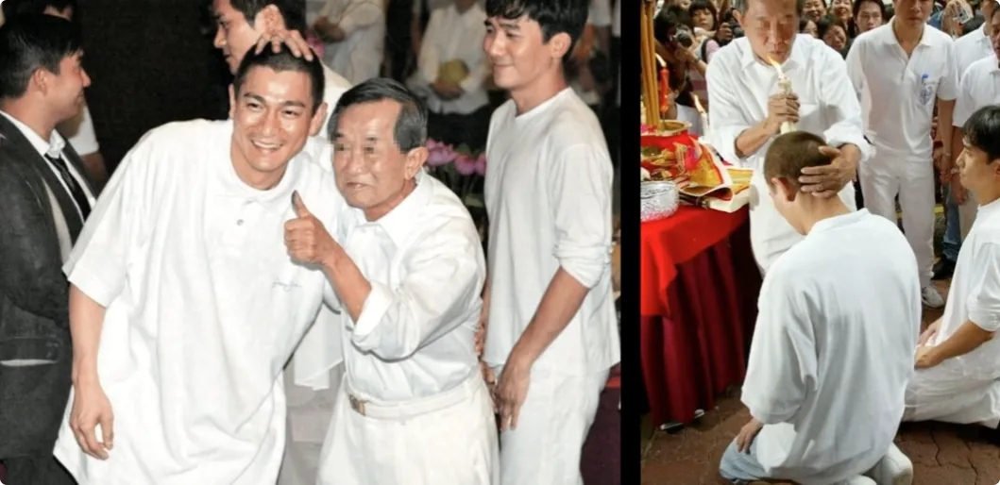

当然了，我是不信这些的，建议大家也不要信。

### 人拥有得越多，往往越害怕失去

那为什么越有钱的富豪和明星，就越想见到大师呢？首先是**人对生存的欲望**。哪怕你已经很有钱，你也无法确定自己不会走下坡路，或者被突如其来的意外带走；又或者有些人害怕死亡、失去一切，想要死后也可以富足。

人都是贪婪的，想要得到更多，可是有些东西不是你想要，你就能掌握。这时，一位具备预见力、能指导你获得更多财富、能帮你躲避意外的大师出现了，没有谁能拒绝这种诱惑力，他一定能在你心中占领一席之地。

---

## 2. 圈层越高，越容易接触到普通人看不见的资源

### 大师也是一种“稀缺资源”

其次是环境。

人越往上走，接触到的知识和资源就越稀有。像是有些拥有神秘力量的大师，也是这个层级才能接触得到的。这些大师可没兴趣给普罗大众露两手：
1. **不值得。** 人家做的是高净值客户，普通人挣不到几个子儿。
2. **不允许。**

所以这些大师，也是大富豪和大明星才见得到的。
如果你稍微动动手指头搜一搜，你就会发现这些圈子背后都有一个大师，而且还不分国籍。

在这种氛围下，哪怕你本来不信大师，但你敢不信同行那些机灵鬼吗？况且这些大师手里的人脉资源和神秘力量也不是盖的。你不站队，那以后那个世界的信息资源就轮不到你，你就没有发展的优势，而且你的优势还会被其他人吃掉，你肯定会心急的。

---

## 3. 大师为什么从未退出历史：真正被追逐的是背后的力量

那为什么会存在这种环境呢？

要知道，**大师这个角色自远古的祭祀开始，从未退出过历史的舞台。** 哪怕是历代大师去世，传承也没有断。

为什么呢？因为世界是阴阳平衡的，有修仙的存在，那么就有修妖魔的存在。

这世界上的妖魔其实是很多的，又基本不受物理约束。大师这个人凉了，可背后的神秘力量还会存在，物理超度没有什么用，所以大师的选任一直都在换。

况且：

> _**富豪和明星真正崇拜的，从来都不是大师，而是背后能带来运势的力量。**_

所以新的大师很快又会被捧起来，这种大师氛围自然是散不了了。

那背后这些神秘力量到底是怎么运作的呢？他们是怎么保人的呢？信徒有没有代价呢？

接下来我就来和大家聊聊大师的来历。

**再次强调，我瞎编的，我自己都不信，建议大家都不要信。**

---

## 4. 三种大师：对应三种级别的力量与合作模式

首先，大师有三种，对应背后三种级别的神秘力量和三种合作模式。

### 第一种：普通大师——依靠玄学知识、经验与“直觉”

**第一种就是普通的大师**，主要是会算卦，靠的是多年积累的书本知识和算卦经验。

学过一些西洋占星、紫微斗数、八字等玄学的朋友应该能体会，命数、相术、占术是真的会反映一些事情的。而这种大师属于生来对玄学知识比较上手，算得比较准，基本能满足一般人的算卦需求，所以也是大众层面最常接触得到的人。

但这些人的社会地位一般不会很高，这决定了他们背后能吸引来的神秘力量等级也不会很高。因为高级别的灵界大佬当然是去挑选收益更大的大师作为人选，所以这些中下等级的灵界大佬，只能去找一些社会地位一般的大师附身。

大佬会帮他们看一下求卦者的未来运势，并把这些信息返还给大师。具体而言，就是大师的直觉变得更敏锐，推演的卦也更精准。算得越成功，这些大师就会越发依赖这种直觉，与背后的大佬绑定得更牢，长久地建立这种双赢关系。
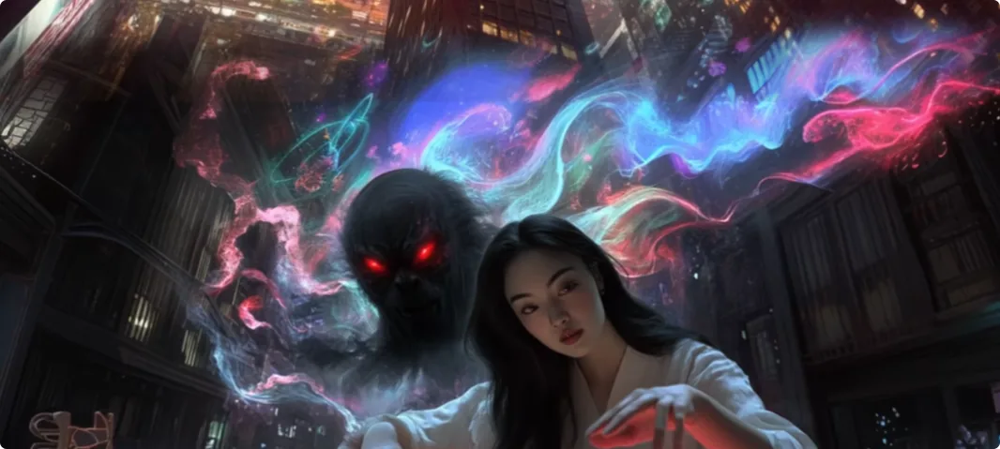

那灵界大佬为什么要帮他呢？

> **因为麻雀再小也是肉，只要信徒的基数够大，香火多一点，对自己的修为增长总归是有帮助的。**

### 第二种：富豪圈与娱乐圈的大师——传承、人脉与长期绑定

**第二种就是活跃在富豪圈和娱乐圈的大师。**

这种大师一般都是有传承的，或者是有一定社会地位为前提的。有传承的人，一般就是手里的神秘知识和经验远超第一类大师，都是一手资料，而且最重要的是，**几代人都和同一位灵界大佬合作。**

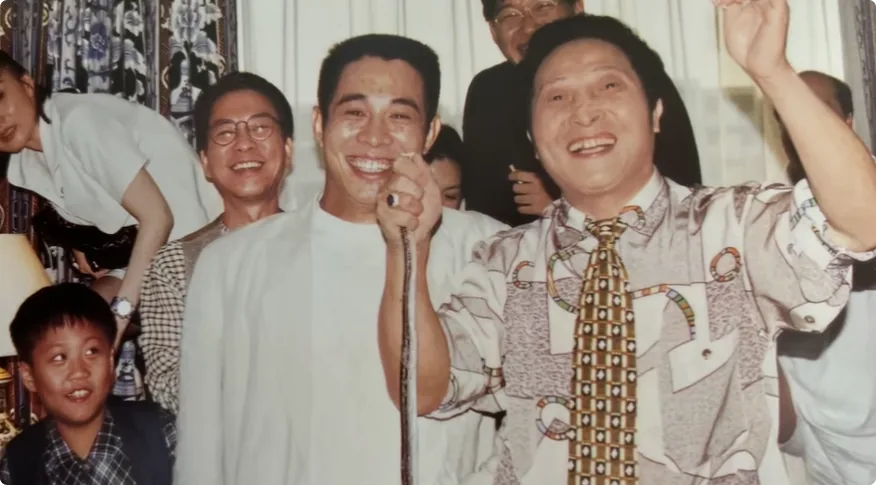

家族传承模式的好处之一，就是父母和子女的能量场是最相近的。如果父母的能量场跟大佬趋同，那么子女的能量场也会趋同，大佬可以更好地更换附身对象。

所以为什么传闻一些密会要讲血统纯净论？因为只有这样，才能更顺利地继承神秘力量，也就是所谓的法力。

另外，有传承的人拥有的人脉资源、社会资源都会沉淀下来，大佬在物质世界也有更多可操作的空间。

上一期我讲，世界是能量运作的。在大佬眼里，他们看得见能量的发展：
- 什么时候该告诉这些家族避险；
- 什么时候避不了，该弃了；
- 哪个新生儿自带阴性能量大，可以作为下一任通灵者。

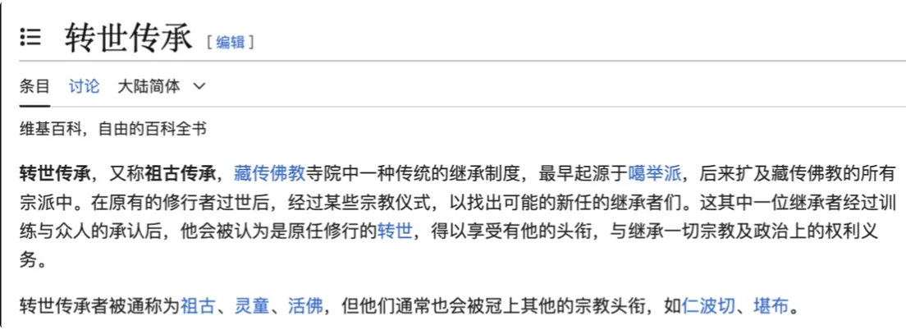

大佬也是门儿清的。真遇到该放弃某个家族的时候，大佬自然会去培养下一个大师。

### 第三种：更高层级的大师

**第三种大师**不方便多讲，观众自己猜就好。

那些榜上有名的大妖魔，什么七十二魔神、撒旦，还有世界各地的上古蛇神，人家也不是空穴来风。

---

## 5. 富豪、明星、大师与“大佬”：三方到底在交换什么

### 每一方都有自己想得到的东西

接下来说说，大佬怎么帮助富豪和明星的呢？
首先我们要知道，三方各需要什么：
1. **大师要的是影响力和名利。**
2. **富豪和明星要的是持久的发展。**
3. **大佬要的是臣服的信徒数量和质量。**

前两者的需求其实都是很好解决的。

首先，大佬的能量等级越高，越能察觉高维度的精微能量运作，以及更上层的灵界消息。比如什么时候会出现大机会，什么时候会有大变数，甚至怎么干扰生死及转移因果等等，都可以去操作。

**这也是二类大师和一类大师的本质区别。**

大佬帮助了富豪和明星，自然也帮助了大师。
但是代价是什么呢？那就要看大佬的需求是什么了。

### “大佬”真正要的是人气和臣服

大佬的需求从来都很纯粹，也就是之前讲过的**向上生存**。

大佬要的是臣服的信徒数量和质量，也就是以人气为食，供养自己的能量场。

很多富豪和明星帮开了很多大师班，帮大师拉人脉，建了很多寺庙，帮传福音等等，这些就是大佬需要的。

> **人头要多，人气要旺。**

所以为什么人的社会地位越高，招引来的灵界大佬越厉害？因为这些人的可利用价值更大。

---

## 6. 拿得越多，代价越大：从依赖到被彻底绑定

### 先制造麻烦，再由大师出手解决

如果遇到新晋富豪和明星不就范，或者有人想背叛信仰，那大佬有的是手段。

大佬手底下的妖众、鬼众不少，让你不能正常生活也是轻轻松松的。而且大佬很多时候拉人头，都是先让这些妖众、鬼众去捣乱，然后大师再来显法化解。

很多有价值的富豪和明星，从此逃离不出魔爪，本身也是一种代价。

### 越进入核心圈，绑定就越深

越是走进大佬的核心粉丝圈，拿到的越多，那么代价也越大。

首先，大佬的能量来源不正，属妖魔。其中无论是大师还是其他人，借用的能量越多，人自身能量场会越污浊，会逐渐被同化。

你看那些大师和身边的富豪、明星，自己的生气是越来越少的，人的五官都开始变形了。

而这种人死后，由于灵魂的能量场和大佬的能量场同频绑定太深，死后也无法逃离大佬的掌控，成为大佬底下的打工鬼。

---

## 7. 为什么“大师”总能找到信众：人真正放不下的是名利与顺遂

以上就是三种大师的来历。
为什么大师，或者说大佬，总能轻易地找到信众？

因为**人性是贪婪的，而且人在名利熏心下是非常短视的，只在乎眼前的利益，也不在乎正邪对错。**

甚至很多人会说：

> _**谁保我顺遂，我就信谁。**_

作为修仙者，我还是要给大家提一个醒：不管你是大师，还是富豪、明星或是普通人，如果走错了路，选错了信仰，那么你的生命、肉身、钱财、灵魂，甚至你的至亲都会成为代价。

灵界大佬的底线就是没有底线。他们本就没有道义，况且跟你都不是一个等级，也不是一个物种，怎么可能手下留情？

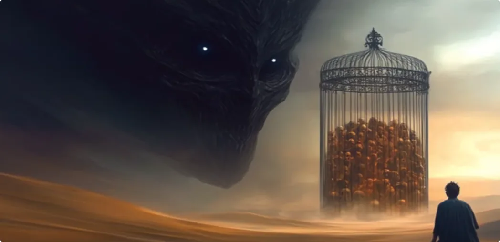

修行的这些年，我看得很清楚：
- 人的钱财，可以帮他们修建新的庙宇；
- 人的肉身和精神，可以贡献修炼所需的人气；
- 人的灵体，可以帮自己打工。

底层灵界弱肉强食。成长出来的大佬，为达到修炼目的，作恶也是很纯粹的，他绝对会把你吃干抹净。

---

## 8. 为什么明知路子不对，很多人仍然不敢离开

### 名利和恐惧，才是最难解开的绑定

我相信很多圈内人士也察觉到了异样，因为自己的运势、身体健康等等已经出问题了，脸型、姿态和气场都不对劲了，然后又不敢背叛大师，怕有报应。
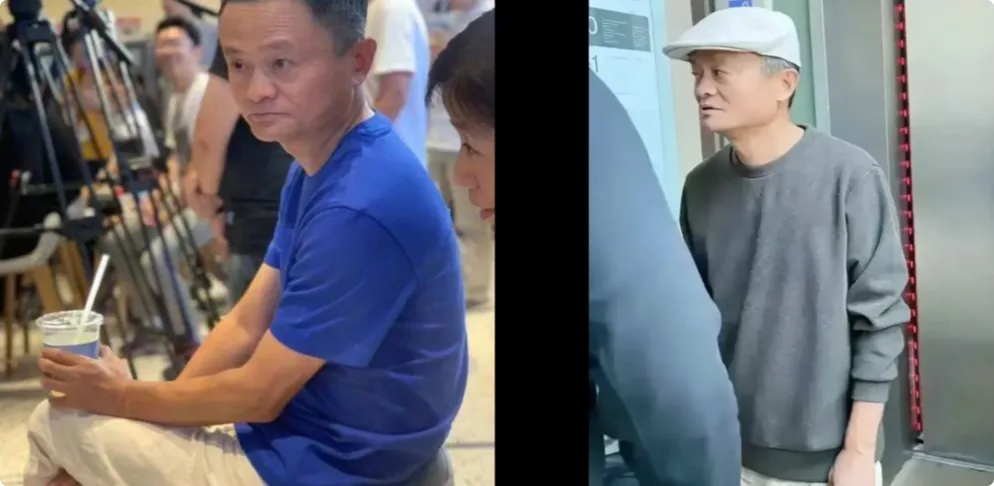

甚至很多大师自己身体已经囊肿了，也有快嘎的。

他们知道自己的路子不对，也有找到我这里来的，但是碍于自身现有的身份，始终拉不下脸面走正道。

> **名利常常是凡人最难放下的心结。**

大佬正是利用了这一点，在背后激发信徒的恐惧，不让信徒离开。
甚至有些人离开了，也因为名利观，转头又去找更有名望的大师，落入利益虎口。

---

## 9. 为什么走正道要先“切割”：保一时顺遂，还是保长久顺遂

### 真正让“大佬”害怕的，是信徒彻底离开

大佬之所以千方百计地阻拦，除了不想放弃韭菜，更核心的原因是：**如果信徒真的走上正道，那到时候大佬的损失会很严重。**

因为任何人走上正道都要先做切割，也就是正神过来赶鬼。

能对大佬造成实际伤害的就是魔法对轰，用真正纯净上乘的能量，对冲掉污浊下乘的能量。这是能掉大佬脑袋的，他还是会怕的。

所以不管是谁，都不应该怕走正道。

**正道一定是能保人、能驱邪、不会要挟你的。**

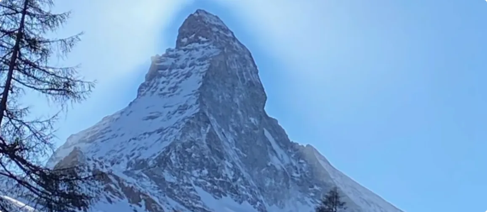

无论你是大师、富豪、明星还是其他人士，都要及时走上正道修行，保全自己和家人，不能任性地只顾眼前三瓜两枣，不要有侥幸心理。

> _**保一时顺遂，还是保一世、几世顺遂？哪个选择更好，一目了然。**_

只有当你选择走正道，正神才愿意出现，你才能借用到真正能保人顺遂的能量。

当然，既然是叫正道人，起码得是善良和真诚的。

**正神不会庇佑一个癫狂和轻浮之人。**

我是修炼者小烨，我们下期再见。

## 谁锁死了你的认知

大家好，我是修炼者小烨。今天我们来讲讲一个人的认知是怎么锁死自己的出路的: 
>**越顶级的知识越难流通，越是能带来实质性好处的知识越是被藏得好好的。**

首先，世界上不存在无限的资源，知道的人越少，对知识的持有者越有利。所以明面上你不可能接触得到别人的财富。
其次，只要是有用的知识就会产生流通权，即谁来持有，谁来继承，谁来决定流通，谁来把控人数以及怎么使用等等，总是会产生规则和约束力的。所以每个圈子都有自己进不去的俱乐部。
第三，收益越大的知识就越是一字千金，一两句话就能把关键和窍门说出来。不在于知识有多难，而在于知道还是不知道。知道的人就能撬动巨大的好处，这种好处可能是财富，也可能是力量。总之这种知识的厉害性极大, 于公于私，对外都需一字不漏，规矩极其严格。

所以顶级的知识都不在纸上流通，而是跟某个人绑在一块儿的，由那个人口传心授，想要破圈，要么拜师学艺，要么认作义父。
不过对于大部分人来说，如果你自身价值有限，资质不够，那么你几乎没可能闯进这些人际关系里，甚至连人影都摸不到。

反过来说，凡是能向你公开的知识，要么这知识没什么用，要么他对你有所企图，你是他的韭菜，无一例外。

大家可以根据自己的实际生活细想一下是不是这个道理。

经常有人说，小烨，你作为修行修仙博主，讲的东西是不是太现实了，太中国人思维了，修行不应该是超凡脱俗的吗？仙佛的世界怎会这么功利？

那小烨可要反问一句了：
**成仙成佛这么难实现的事情，你都不严谨、不现实、不实事求是的话，那你靠什么来修行的呢？光靠想象力吗？**

你当前所处的身份位置，无论是世俗层面还是修行层面都是很低很初级的，有用的信息都轮不到你，你连自保的能力都没有，你又有什么资格谈超凡脱俗的修行呢？

人要求知要向上走，要想改变自己，就必须清楚和遵守知识的潜规则。越有用的知识越是一字千金，越是有很大的利害性，它必然是分配不均的。
**当知识的持有者是人的时候，知道的人越多，蛋糕越小，稀释的是自己的生存，所以为了自身利益不会轻易分享。**

而当知识的持有者是仙佛的时候，所有的知识都具有超自然影响力。比如
风雨雷电之术，斩杀鬼神之法...
你当了仙佛，天地道法肯定也要把这些知识交于你。那你能随便告诉一个凡人吗？你敢任凭他瞎搞吗？你不用先考核他吗？你不用对道法和众生负责吗？

所以很多修行人认为摆几个手势，念几个咒语就能得到真理，得到神通，就是因为没有想明白真正的知识具备利害两面，不可能写进经书里，让什么人都可以随便学了去。能在书上公开告诉你的都只是在讲道理，包括小烨的视频在内。

至于真正的知识，你得找到知识的持有者，经受得住相应的考验，才有机会得到口传心授。
**拜师这个动作，换个角度也是体现一个人对知识的敬重。只有这样的人才能对知识的厉害性负责，这就是顶级知识的流通规则。**

## 1.真正有用的知识与现实案例

那什么是真正有用的知识呢？
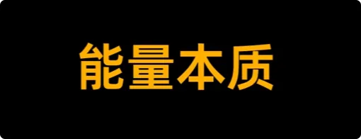

如果你社会身份比较低，基本接触不到认知之外的知识，那么我建议你多观察，去看看有钱人在做什么。因为有钱人最趋利，没有利益的事情他们不会做的，你要看他们在做什么，不要听他们说什么。

这里讲几个案例：
1. 我身边认识一个老板，几十岁人了，每天都在开会，倍精神。他的微信头像是他一岁不到穿着藏传僧衣的照片，而且这张照片散发的味道极大，一看就是做了灌顶的。
2. 还有一个老板，每年开工都要先摆台烧香，每天到办公室都要先点上一根香才开始办公，而且只要他的香一点，那香招来的东西就很大。
3. 还有一个老板亲口跟我说，盖寺庙很赚钱，很多老板都是合伙开连锁。完事后有些老板会把一部分钱捐给寺庙，至于捐了做什么，只有一小撮老板才知道了。这些人起码要给1000万才有跟大师面对面学习的机会。少于这个数，你顶多跟大师在厅堂一起用过膳。
4. 之前有个新闻，有位女士卖了全部身家五百多万，全捐了一分钱也没留给在念大学的子女，最后自己也没有得到任何实质性的好处。为什么呢？因为一不缺你这点钱，二你已经没有任何价值了。

那些老板除了能捐，还有社会价值，比如盖庙的能力、活动支持、拉人脉等等，所以他们才有晋升学习的机会。那他们在学什么呢？他们赚这么多钱，难道是为了虔诚的学修行吗？怎么可能？他们是要借某位大佬的能量给自己助运。至于具体怎么借的，听过这个说法的人自己知道就好，我反正是不知道的。

所以说很多人去庙里找正神，可这庙又不是正神开的，是人开的。有些庙观虽然是某位大神飞升的地方，可是大神走很久了，他不会再管这间屋子了。
**正神不需要香火，不需要人的信仰，也不屑于与凡人交易。人家飞升前就不需要这些东西，飞升后更不需要这些。**

回过头来说，为啥有些老板遇事总是不败，而有些老板败得快？因为除了自身积累，还要看背后站着谁。背后有人，那能量气场自然强，别人扛不住的事儿你能扛，机会就是你的。甚至有些人冥冥之中被拉来跟你合作，教你做事，这些都是特殊照顾得来的。

## 2.命运、能量与修行

人的命运本质上就是两种能量模式: 
命的能量难改，运的能量可以改。
强大的运势本质上就是强大的能量之势，能把你带到风口，把你带到更高的平台上，历练学习新的知识体系，获取别人看不见的资源。很多老板都是在不断破圈后，接触到了认知之外的事情，才意识到能量的重要性。而且他们试错成本很低，有机会都愿意试一试。对他们来说，打破信息壁垒更重要。

而普通人呢？口袋紧，试错成本高，本能的警惕任何认知之外的事情。

另外人的天赋也是如此，也是跟能量有关的。学过命理的朋友都知道，什么能量特质促成什么天赋。为什么有些人对某个领域有极大的兴趣，而且在这件事情上悟性极高？为什么他们能持久的钻研并最终成就一番事业？

>因为都是靠对应的能量，能量既是药引子，也给予相应的悟性。持续的能量支撑，一个人持续的投入，有所成就。

有很多人知道了能量的重要性，不惜借旁门邪道，也要一世名利。但常人怎么借能量，找谁借，带来什么恶果，这都是个人自己的选择。正神是没有义务给你收拾烂摊子的，不要最后退无可退的时候大骂神仙在哪。

当然了，作为修行修仙博主，我还是建议大家走正道修能量，因为只有正道才会有好的能量。

命运二字，命包括你的本性、结束和生命。**你的本性就是你的元神根底，决定了你当前是个什么心性的人，你会诉求什么，你的选择和行动是什么。你的行为带来了果业，决定了你的结束，而结束又跟你的生命挂钩。**

人想要改变本性，必须要有上层能量的辅助，把你的心性和格局拔高。不然你天天待在人间臭水沟里，能熏陶出什么品质来呢？淤泥里开出的莲花，本质上还是凡品，没有上层资源的改造，不可能出现本质的变化。

其次，人想要改变结束，改变因果，依旧是靠能量。在绝对的力量面前，因果也算不上什么。

最后想要改变生命，那你得有点资格说服得了改生死簿的那位及以上的力量。

说到这里你应该知道我已经是在讲修行和修仙了。

## 3.认清位置与神明的考验

从人到神仙之间，其实是有很多生灵存在的。只不过只有到神仙佛级别，才具有教导世人的意义，才会被立为榜样，写成故事，被世人知晓。
大多数人就以为人之上就那么几位神灵，而且离人不远，举头三尺罢了，并且有感必应。这个说法到底是哪位大佬加进经书的我也不清楚，但是确实很符合人心，很符合人的需要。

人们都很喜欢这两句话：
浪子回头金不换
放下屠刀，立地成佛。
就是希望自己犯的错不会被审视，就算干了坏事，自己也可以随时被谅解，最后只需要做一点点好事，就可以重新当圣人了。所以你看不论什么品德的人都能大大方方的烧香拜佛，他内心是没有一点心理负担的。

另外有感必应的说法，很能满足一个人的英雄情结。因为很多人都认为自己很正，是正义的化身，站在道法的制高点，张嘴一招就能把大神请下来，而且常常认为神仙佛就应该托他上去，他有这个资格，甚至上去了也是和大神平起平坐，你是道法，我也是道法，我们应当平等。

很多人看见小烨说要用能量修炼，要给仙人叩头，不屑，觉得不够高级，不够大气。
我只认本源，我只认如来，我只认三清，
其他我都看不上。这就像小学生在挑未来上清华还是北大一样，认不清自己的位置，认不清现实。

成仙成佛从来不是一步到位。典籍里白日飞升的，哪个不是大神下凡来教化世人的？他们是修回去，不是修上去的。任何人不管你过去什么来历，你都不可能比他们大，都得脚踏实地的修行。你当前什么段位就修什么段位。好大喜功的人，正神看都不看一眼。

而且神仙佛都是一群能量极大的存在，不可能为了地上某个人亲自下来一趟。人类看得上花花草草吗？

只能说喜爱，因为物种差距太大了。

神之下，人之上还有亿亿万万的众生，在神座下寻求修炼机缘的也不在少数。有修了很久的山水精灵，有打工很久的大妖大魔: 
哪个不是诚心向道，哪个不是脚踏实地，哪个没有付出辛勤劳动？
连他们都要遵守真理的流通规则，遵守能量的获取规则，才能更上一层楼。而人类比起来其实是差远了的，神其实是更爱非人类的。

所以大家不要以为神对世人有着无限的包容，相反神对人的愚性其实是不包容的。你可以浪子回头，但你该受的罚还得受。不浪子回头，那你的结局还会更惨。在神明眼里，人类都是小朋友。跌倒了就得知道疼，疼了你才能长进。如果不长进，周期性反复轮回，那就让你更疼，疼到成为你灵魂的印记。

**你可以把正神都视作一群极其严格的老师，能真正为你长远考虑的老师不会放任你的。愚行一定会使用教尺。因为被溺爱的人无法成长，唯有大火淬炼，才能诞生独立自由的灵魂。**

所以回过头来，为什么正神从不干涉人间的香火交易？为什么正神从不来给修行人指路，任由人们被大妖大魔耍的团团转？因为那都是人自己的选择，人自己愿意跟妖魔混一起的。
去寺庙烧香的人，你心里求什么你不知道吗？玩通灵占卜赚钱的人有多危险你不知道吗？打坐到精神发颤的人，你自己什么健康状态不知道吗？都是人自己选择视而不见罢了。人什么时候知道疼了，疼的在地上滚，叫了正神就出来了。尤其是那群本该修行修炼的人，被人被妖魔骗得越惨越好。因为只有看遍伪善的把戏，才能恢复对真理的嗅觉。

其实每个人在想些什么，灵界都知道: 
你贪恋钱财和地位，周围的魔一下就过来了。
你贪恋美色，周围的妖就过来了。
你有害人之心，周围的鬼就过来了。
因为同气相求，你什么能量状态招来的就是什么灵体。

很多人会说了，我这么想修行，我这么善良虔诚，神听不到吗？我不能把他们招过来吗？不能。

首先你无法模拟神的气场，也没有功能去连接正神，神注意不到你。其次光有心是没有用的，心是个人意愿，能促成什么结果才叫本事。

比如: 
你说你想修仙佛，那你有时刻虚心求道吗？你有寻找过真正的修行之法吗？你说你善良，那你帮助了谁？天地万物之间你又拯救了谁？你说你虔诚，那你为道做了什么？
我一问你可能都哑口无言。你什么实质性的动作和付出都没有，正神怎么敢给你机缘，给你能量？哪位神敢把一个只懂嘴皮子的人渡上天？

其实很多人说自己在修行，有奉献，却察觉不到已经陷入一种贪念，贪图轻松。比如念咒就很轻松，起伏也很轻松，放生几条鱼也很轻松。很多人不是真心想试修，只是想要被认可、被回应、被庇佑。人一旦有了贪念，就会招来不好的东西。

灵界个个都是千年的狐狸，这点要求他们略微出手就能把人框住。一个想要被善待，一个最会伪善。不过好在大多数寺庙里的都不是真正的大佬，因为大多数人都很普通，产出的能量也一般，大佬看不上的。

## 4.修行与道同行

那什么人产出的能量更好吃呢？
>那就是愈高愈寒，每天都提心吊胆，生怕被替代，永远没有安全感的人。这样的人执念才重，他们随时都在失心疯，但又因为太聪明太理智而没疯。
>这种人私下都是以虐己或虐人为乐，堕落到了既不信自己也不信他人的程度。其实这种人挺孤独的，身边没有敢真正交心的人也挺累的。

其实这是对你的考验，所有这类人都会被考验。那些顶级的大妖大魔是没兴趣去搞普通人的，他们所在的生态位大多是帮老天考验能人去的。他们会诱导你心中更大的贪欲和执念，你能扛得住，老天才会放心把一些东西交给你。

很多人扛不住，纷纷投降，但是心里又过意不去，在人间很迷茫，也不知道要追求什么。其实此题也好解，那就是修行与道同行。

看过我视频的都知道，我是呼吁所有人都修行的。不用出家，就用好的能量提升自己的品性，一步步往上走就可以了。

**道无情亦有情，有情无情都赏罚分明。你若向道，道亦向你。** 
只有真正的修行，你才能体验到正神对你的回应，对你的教导。道会告诉你什么是对的，你只需要有一颗纯粹的心去做就是了。**届时你会发现，无论你在地球的何处，你都能感受到诸神的回应，天地万物都在给你回应。**
这种归属感是人给不了你的，什么亲情、友情、爱情，什么功名利禄，都比不上这种高级的情感。用个词描述，也许叫与神同乐。到那时你会明白你真正想要的精神追求是什么。

最后我还得多说一句: 
*永远不要在大神或者大佬面前显摆你的聪明。灵界最不缺的就是聪明，真理永远是由上到下传递，你只能是下，也不要想着用最小成本撬动最大资源。人的想法都是透明的，任何心计都不好使，尤其是如果你想被心性（欲望）驱使并且做出来了，下场会很惨。*

以上，明白真理的流通规则，明白能量的意义，明白自己的位置，摆正自己的心态，你就可以开始启程了。

我是修炼者小烨，我们下期再见。

## 关于释永信的事情_ 你的信仰，根本不会保你周全

## 宗教圈的商业模式与立场执念

最近释永信的事情大家都知道吧？其实这种事情，一般就是普通阶层的人不懂。但是稍微在商业上有阅历的人都知道，宗教圈背后的商业模式其实是很成熟的，业内都是心照不宣、各取所需。有求财的商人，有借运的商人，倒没几个是真的求解脱的。

可能有人要伤心了，觉得我污蔑了某信仰。首先我要声明，我没有否定过佛菩萨。我自己是去过菩萨法界修行过的，与某位大神有过一面之缘，所以我得声明，我很尊重佛菩萨。但是凡人搞的那些是不是正法，就另说了。

**其实真正的上升渠道是不分佛道、基督、萨满的，只是人对立场这件事情太有执念了，想不通。如果你是真心想解脱的修行人，请先找修行的真相，找本质，而不是只顾着站立场。**

人是易伪装的，也是易伪善的，不要听信空口善言。

我今天想讲什么呢？我想讲的是，不管你再虔诚，没有找到正道正法，你的一切信念都是徒劳的。灵界那些大佬的操作都很黑，比人间还黑。

## 案例一：请回家的是朋友还是大佬？

先讲个案例。这是某位粉丝家里，视觉上第一感觉非常凌乱。这种情况下一般都会住进一些小妖小怪之类的，但是很出奇，他家的整体能量场比较干净，甚至找不到阴类众生。
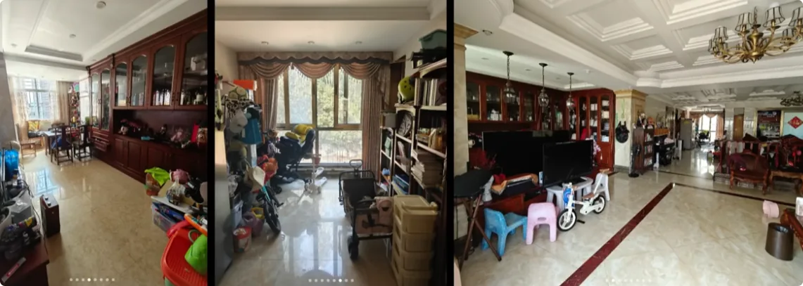

然后我往下翻其他照片，能量扫到这里才明白，原来是家里请了别的朋友。因为有这位大佬在，赶走了其他灵界生灵，同时她也没有过分影响主人家。并且这位大佬还是很有礼貌的，收敛着她的能量，不与我冲撞。

直到我轻轻地扫描了一下，对方才跟我有一点能量交流。而且当晚我就做了一个梦，有一个比较温和的女性，她跟我说，在她的星球，她负责种植某种毒植物。她还给我看了一下她施展的红色能量的一个法术，她的星球本身又是另一个大佬。

当然了，这只是一个梦。看到这里，很多人会觉得太好了，我也要请个大佬回去，帮我赶走其他生灵。那我就要再讲一个案例了。

## 案例二：做寺庙运营，却招来了大家伙

这是另一位粉丝的家。这几张照片都散发着昏沉的能量，但是仔细看家里的物品，却找不到是谁散发出来的。只有每张照片的下沿有一种油油的、黏稠的能量，只可能是拍摄者身上散发出来的能量了。
然后我就看到沙发，沙发上明显有一位大佬坐在上面。她的能量直接冲出屏幕，把我干吐了。而且她的能量属性和拍摄者身上的是相同的，说明就是她附身的。
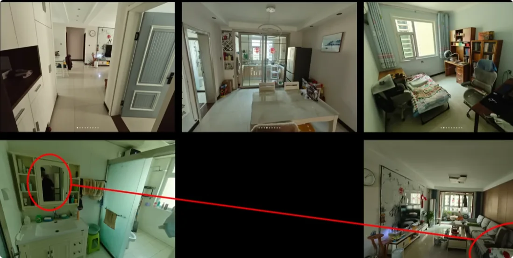

我赶紧看看这个粉丝什么背景，怎么招了这么大的家伙回家。这里是她的原话，她说她是做寺庙运营的。
当晚我也做了一个噩梦。梦里是山脚下有一个长脸猪妖，当着我和村民的面活吞了一个七岁的小女孩，而且不是第一次吃人了。村民拿家伙去追杀她，她就转身躲进山洞里，然后又从别的洞穴出来寻人来吃。

试问，普通人能分辨自己请了什么角色回去吗？不能的。区区凡人想跟大佬合作，还得掂量掂量自己的运气。想铤而走险、投机取巧，基本不会有好的结局。

以上两种情况，如果你不修行，不走正道修行的话，那么你要自己处理好这种关系，自己保护好自己。

## 正神不偏袒，各论各的因果

**对于正神来说，不管是普通人还是妖魔鬼怪，都是众生的一员。善恶角色很容易就转换，所以正神不会无私偏爱一方，再带着偏见压制另一方。从来都是各论各的因果，正神是不干涉的。**
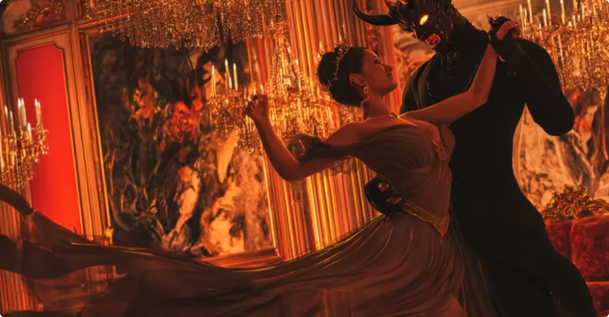

如果人太愚钝，非要跟阴类众生混，或者非要走邪道修行，那从大爱的角度来说，众神也不应该管。因为谁都是栽了跟头才长教训，连神仙下凡转世也不例外。不栽跟头、不长教训，都回不去的。

所以神明若真想为你的成长着想，那就看着你栽跟头。等你终于大彻大悟，知道怎么真心求正道正法的时候，再引你到门前一试。

## 想跟灵界合作，这趟水很深

但以上还不是我今天想讲的。我想说的是什么？想跟灵界神秘力量合作，这趟水很深。万千修行人都感化不了那些灵界大佬。信徒表忠贞也好，痛哭也好，献出宝贵的东西乃至生命也好，都没用. ***抛弃你就跟吐西瓜子一样随意，弄死你就跟弄死蚂蚁一样简单。***

相信有一些了解寺庙商业模式的人会感到困惑，为什么释永信那样高位的人会出事呢？背后那位不保他了吗？毕竟都保了他这么久了。

这里我要说个案例。有一次我出门修行，路过一个地方。那个地方有个雕塑，它直径一百米的范围内，魔气压人。有多压呢？走进这个结界，我和我的朋友都眉心紧皱发疼，两侧脸颊发颤发麻，站都站不稳。

我当时很好奇，哪位大佬这么厉害，为何又要在这儿呢？于是我顶着压力去看了一眼，原来是某教捐赠的雕塑。

雕塑周围一圈不仅刻满了经文，还写着是谁捐赠的。一共有十几二十个人，都是圈内有名有姓的大师，每个人都散发着衰败之气。
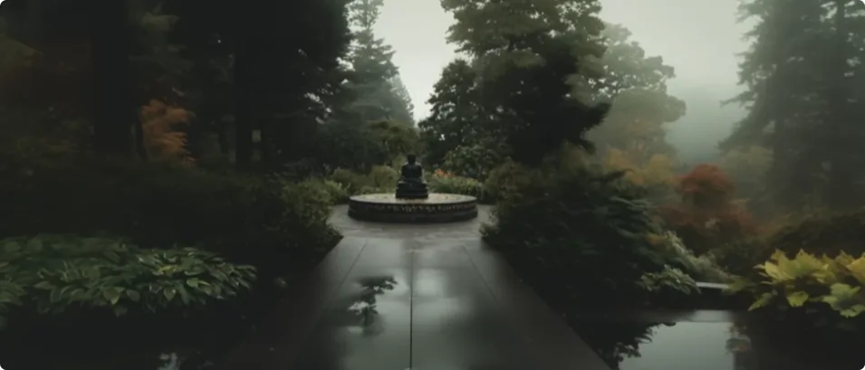

当时就让我联想到一位巨魔拉着一条条锁链，都套在这些人脖子上的一个景象。有一瞬间我有点同情他们，后来又想，万一他们一开始就知道呢？万一是他们主动投怀送抱呢？
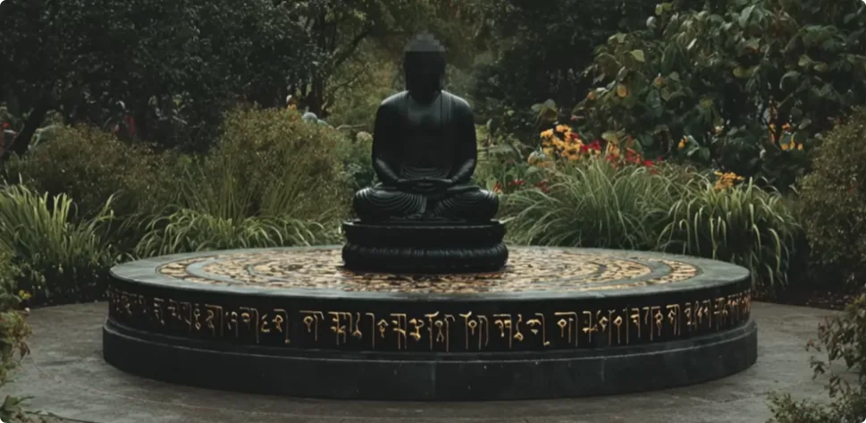

算了，不想了，我只想赶紧离开这个地方。我们沿着结界的外围绕道走，一边走还一边看到有很多游客在虔诚地跪拜，在求保佑。

## 被抛弃的释永信与人性

很多时候，人们觉得是得到了保佑的，有了富贵运，然后还愿砸钱盘下更多的地盘，招揽更多的人加入。你肯定会想，我付出了这么多，灵界大佬肯定要保我周全吧？

那就看看释永信吧。没有了利用的价值，或者说想换人了，随时就可以把你抛弃了。名利路上从来不缺虔诚者，任何人都可以随时抛弃。

不要想着大佬会顾及跟你的情分。魔子有魔爹疼，你区区凡人，灵魂层面毫无靠山。你不走正道，正神都没理由疼你、庇佑你。

很早以前我就说过，很多灵界大佬，上古的、非本世界的，都跟人不是一个维度，不是一个物种，对人类是半点都共情不来的。

人家自始至终都只专注修炼，能量越多，法力和影响力越强，生存舒适度越高，跟人类天天想着做大、富贵、资源是一个道理。

在这个底层逻辑下，灵界大佬们想的都是怎么把人圈养起来，偶尔立几个标杆，让他们展现信仰的好处。诸如此类，人能玩得有多阴，大佬肯定能玩得更阴。

跟灵界大佬谈感情和付出，真的是有点恋爱脑了。

最后还有一点，大佬之间也是要划清界限的。不同的圈子有不同的靠山。一般情况下，一个圈子的人不会主动去动另一个圈子的人。
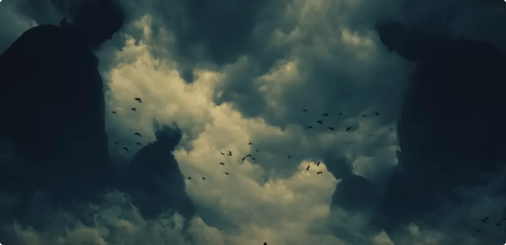

但是当一个人在公众层面出事了，那就说明这个人背后的那位已经把他抛弃了，不保他了。因此，其他人也不用顾及他背后那位同不同意了，他可以直接下线了。

## 安全_真题的操练与熟悉

> _**阴间生活不只要懂建设、就业和功德，还得懂安全法规。真题做得少，到了下面一样要吃亏。**_

## 1. 热身题：离开泉台收费站，什么场景绝对不可能见到

> **夜间行车，请注意安全。**

当你离开**泉台收费站**，即将到达阳间的时候，请问以下哪一个场景你**不可能**见到？
- **A** 牛头马面在路口抽检，查看车内是否携带了阴间物品。
- **B** 阳间司机把脚焊死在油门上之后，以时速199公里的速度朝你冲来，但到你面前的时候及时避让。
- **C** 有鬼在地上泼洒棺材钉，企图把你拉到距离收费站50公里的修车场去。
- **D** 路边有号称自己上山挖出宝贝的工人，拿着山龟告诉你这玩意儿功德长得快。

很明显，答案是：

> **D**

为什么？

> **因为泉台附近没有龟，全被陆压老祖打完了。**

积了小小的阴德。

上一期说到这个地府旅游区暂时不让进，只能委托我同事去买地图。结果我老板刚刚发来消息，说我同事涉嫌**夹带阴间商品**，在泉台边检被抓了。
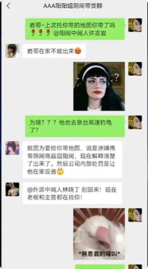
就很离奇。

所以本期就找一些**阴间安全与法规真题**，给各位做一做、熟悉一下。

---

## 2. 第一题：阴间土地建设局门口，千万不要乱种菜

> **日间出行请注意太阳温度以及植物光合作用的角度，避免踩踏草坪。**
> 
> **在以下行为中，哪一项容易发生“鬼体安全事故”？**

- **A** 在阴间土地建设局门前的方块草坪上偷偷种外来植物，如豌豆、向日葵、坚果等。
- **B** 在阴间墓地生态保护区内，无视管理员劝解，执意采摘坟头蘑菇带回家煲汤。
- **C** 在规划区的落英河段，利用路边长相怪异、带有网状结构的杆子，下河捞取落水的小鬼。
- **D** 利用放大镜企图加快植物光合作用，并在植物附近泼洒煤油与汽油，帮助植物保温。

这一题答案很明显，一看就知道是：

> **A**

咱们来看看为什么。

### B为什么没问题：坟头蘑菇可以摘，所谓管理员才有问题

首先用排除法，看B。
在阴间吃点蘑菇，还是坟头上的蘑菇，怎么了？
很合理。
而且墓地生态保护区里头根本没有管理员。
所谓的“管理员”，其实都是当地黄牛，自己偷偷收蘑菇，不让别人收。

所以：

> **直接排除。**

### C为什么已经不是正确答案：版本更新了

然后是C。
我在《阴间考编指南》那一期说过，落英河那边“放声听雷”的都已经被抓得差不多了。
所以这一题：

> **十几年前可能还能选C，现在不能选了。**

### D为什么也是陷阱：阴间根本不用煤油和汽油

最后是D。
这个可能很多刚从阳间下来的鬼会选错。
这里重新说一下：

> **阴间没有煤油和汽油这两个玩意儿。**

咱们用的那个叫“活水”，是骨灰炼出来的。
所以D本身就是专门坑那些刚刚下来、什么都不懂的新鬼的。
也可以排除。

### 为什么最终只能选A

那么为什么选A呢？
废话。
你跑到**阴间土地建设局门口种菜**，你想干嘛？
还种这种明显的外来物种。
一看就知道是地狱细作。
被抓以后，必然要严刑拷问一番。

所以：

> _**非常容易造成鬼体安全事故。**_

---

## 3. 第二题：为了骗“意外转生补贴”主动当鱼，会不会影响功德

> **坟头风水一向被认为是阴间转生的参考数据之一，那么在以下行为中，哪一项会影响转生时的功德积累？**

- **A** 中间人利用职务便利，让阳间的孩子给自己烧2万吨冥币。
- **B** 先申报转生成为鱼，转生以后光速重开，再进入忘川河故意被桥上的鬼砸到，企图享受“意外转生补贴”。
- **C** 在阴间大学就读期间，屡次推荐同学成为被献祭对象，而自己享受献祭福利。
- **D** 利用功德机，在阴间蹴鞠联赛中强行刷高我方球员的功德数量，使球员全身发光，以达到震慑对手的效果。

这一题比较吃小道消息储备。
各位选错也很合理。
答案是：

> **B**

咱们一个选项一个选项分析。

### A：两万吨冥币不会改功德，但会直接改你的转生进度

这个选项我上期提过，可能大部分人没看。
这事是我同事干的。
他刚成为中间人没多久，有一次喝多了，让自己的孩子多烧点冥币下来。
但因为中间人没转正的时候不能托梦，所以清醒以后他很害怕，怕这件事情被发现。
然后他亲自上去告诉孩子：

> “千万不要烧。”

结果他孩子看见以后，以为他是：

> **嫌少。**

于是直接作出了一个很离谱的决定：

> **一把火点了一个冥币厂。**

最后合计烧下来两万多吨冥币。
我同事现在已经没法托梦了，大概两百多年以后才能转生。
所以A虽然严重，但是：

> **它不影响原有功德积累，而是直接影响转生资格和时间。**

### C：推荐同学被献祭，是为了让同学早日享受阳间生活

然后是C。
各位应该清楚：

> **阴间大学献祭一两个学生，很合理。**

反正功德最后都会记到账户上，等下辈子的时候加回去。
你推荐自己的同学，说明什么？
说明你认为：

> **这个同学很有潜力，值得早点享受阳间的美好生活。**

你自己留在阴间承受苦难，主动把转生机会让给同学。
多么感人的事情。
怎么会影响功德积累呢？

### D：给别人刷功德，出问题的是别人

接着是D。
你的确用了功德机。
但是：

> **你给自己加了吗？**

没有。
既然都没给自己加，为什么会影响自己的功德？
你主动给别的鬼加功德，这甚至可以理解为：

> **舍己为鬼。**

所以自己的功德并不会因此受到直接影响。
但是要注意：

> **如果你恰好就是那个被刷高功德的人，就可能因为数据异常被封号、强制回档，并且直接转生。**

### B：鱼的问题在于“主观恶意骗补贴”

B这个案例，我之前在功德机操作指南里提过，但是当时没有讲最终结果。
现在告诉各位。
这个案子最终的判决认为：

> **这条鱼心术不正，企图利用张三、李四之间的情感纠纷，给自己增加功德。**

可以说非常坏。
用丧尽天良来形容也不为过。
所以这条鱼最后被判：

> 下辈子转生到养殖场；
> 
> 随后被做成烤鱼；
> 
> 又因为厨师没有处理好，被顾客打翻在地；
> 
> 最后还要在厨师与顾客争吵的过程中，被人踩上一脚。

只能说：

> **功德系统不好骗。**

---

## 4. 第三题：忘川河半夜的哭声，到底是什么东西发出来的

> **清明时节，忘川河畔总有很多旅游露营的鬼。**
> 
> **但每到午夜，他们都会听到呜咽的哭声，以及“咔嚓咔嚓”的啃食声，因此非常害怕。**
> 
> **作为一个熟知阴间都市传说的你，请问以下哪一项才是声音的真相？**

- **A** 有鬼因为抢不到露营草坪，在午夜期间故意播放声音，企图吓走其他鬼。
- **B** 落英河段的水鬼因为河道改建，拖家带口搬到了忘川河附近，午夜只是他们正常吃饭的时间。
- **C** 忘川河畔管理员因为呼吸道堵塞，导致睡眠鼾声过大，声音经过墓碑反射之后形成了这种效果。
- **D** 某公司团建时，把刚刚下来的员工丢在了附近，员工因为迷路过于害怕，所以发出了这种声音。

这个题目纯粹考：

> **知识储备。**

答案是：

> **C**

### A：忘川河根本不值得抢露营位

首先，A直接排除。
忘川河畔是什么地方？
著名的：

> **三无旅游区域。**

也就是：
- 无旅游项目；
- 无旅游景点；
- 无旅游设施。

说白了：

> **就是一片草地，旁边有一条河。**

为什么还会有鬼来旅游？
因为：

> **免费。**

所以“因为抢不到露营地而放声音赶人”这种事情，属于无稽之谈。

### B：阴间没有水怪，不要造谣

接着是B。
哪里有什么水怪？
不要乱说。
阴间当然没有水怪。
这么多年的河道治理，水怪肯定早就已经消失了。

> **不要造谣。**

### D：只有我们公司会这么团建，但我们不会数漏员工

最后是D。
这个只要在地府待过，都知道答案。
会把公司团建安排在这种：

> **免费，而且没有任何旅游项目的地方**

的单位，只有我们公司。
但是我们公司非常缺鬼。
所以：

> **少一两个员工，不至于看不出来。**

因此也排除。

### C背后的真实故事：河神其实只是管理员打呼噜

为什么是C？
这件事情和我一个已经转生的同事有关。
他最早进我们公司的时候，我们带他出去团建。
然后我们组长骗他说：
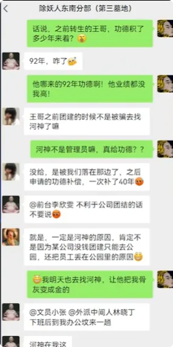

> “这里有一个河神，晚上会发出怪声。”
> 
> “只要顺着声音找到河神，就能积攒大量功德。”

我同事居然信了。
大半夜一个人顺着声音找过去。
最后：

> **跪在人家管理员床前开始哭。**

不知道的还以为管理员活了。
后来才知道：
管理员原来住在上游。
但是因为鼾声实在太大，被老婆赶了出来。
好在邻居十分热心，主动帮助管理员照顾家里的老婆孩子。
管理员这才安安心心地在下游做起了管理员。
从此以后：

> **这个所谓的忘川河都市传说，也算破案了。**

---

## 5. 第四题：阴间交友诈骗题——六个故事里，哪两个绝对不可能发生

第四题是比较新的题目。
而且是一道：

> **多选题。**

**阴间交友讲究功德圆满、门当户对，同时也要谨防诈骗交友。请问以下情形中，绝对不可能出现的是哪些？**

### A

你把流浪猫养在楼道里，遇到了一位一起喂猫的阿姨。
阿姨告诉你，她有一个女儿：

> 长相甜美；
> 
> 不善言辞；
> 
> 而且马上就要转生。

希望你们可以结下阴婚，共赴阳间，并且成为兄妹。
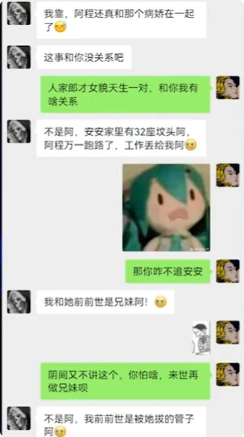

### B

黄泉路上有一位长相俊朗、不善言辞的道长，主动提出为你开坛做法，让你下辈子多一点桃花运。

### C

你是一名**铁处女刑罚力度测试员**。
工作多年以后，你每天测试的铁处女突然产生了灵性，并且表示：

> **要和你结婚。**

还要求你：

> **永远留在阴间。**

### D

你最近使用功德轮转机时，遇到了一位因为版本更新而没人要的修女。
她因为案底无法升入天堂。
但是在你的悉心照料下，她逐渐走出了阴影。
就在你转生前夜，修女表示想要报答你，可以让你转生以后：

> **随意选择自己想去的地方。**

### E

你是一名黄昏崖的办事员。
一次登记途中，意外认识了一位误入阴间的仙女。
经历一番曲折后感动上苍，天庭最终决定把你调上去，让你和仙女：

> **永结同心。**

### F

你是一名在阴间生活多年的鬼。
在黄泉接待处做志愿者的时候，偶然与一名刚刚去世、长相甜美、不善言辞的少女相爱。
就在你们准备约定共同转生、成为兄妹的时候，她却偷偷先投胎了。
后来调查才发现：

> **她原来是比你晚出生一年的姐姐。**

这一题答案是：

> **D、F**

我真的不知道地府编题这群人，每天都在看些什么电视剧。
不过既然出了，还是照例分析一下。

### A：看起来像诈骗，但在阴间居然正常

A虽然看起来非常像诈骗。
但在阴间反而属于正常情况。
毕竟双方结婚会同时增加功德。
功德虽然不多：

> **但总比没有好。**

所以A完全可能发生。

### B：黄泉路上真的可能遇到“营业道长”

B就牵扯到阳间的一些事情了。
按理来说，道长们的编制在天庭，不应该有想不开的主动下来玩。
但是为了刷功德，总有人铤而走险。
通过各种我目前还不知道的方式：

> **卡进黄泉路营业。**

至于桃花运这种业务有没有效果，那就难说了。
但是：

> **黄泉路上营业的道长确实不少。**

### C：铁处女爱上测试员，居然还是“真实案件”

C是一个真实案件。
很久以前有一个骨骼惊奇的小伙子，号称：

> **铁处女唯一指定测试员。**

因为测试次数实在太多，而且一直没死，结果硬是把铁处女养出了灵性。
随后铁处女天天缠着他：

> **要求结婚。**

好在这个小伙子也是艺高鬼胆大，最后真的选择和铁处女在一起。
只能说：

> **可喜可贺。**

要不然这东西以后还不知道会祸害谁。

### D：一个自己都回不去天堂的修女，没资格决定你去哪投胎

D就是：

> **纯纯的诈骗。**

她一个修女，户口都不在阴间。
自己还得靠你照顾才能活。
她何德何能：

> **决定你一个鬼下一世转生到哪里？**

这种剧情：

> _**《聊斋》都不敢这么写。**_

### E：仙女不可能因为“走错路”误入阴间

至于E：
你觉得一个仙女，能因为什么原因误入阴间？
怎么可能：

> **单纯走错路？**

台阶朝上还是朝下都分不清，怎么做仙女？
一看就是诈骗。
遇到这种事情，各位立刻联系我。
我会帮你们处理。

### F：黄泉接待处不可能需要志愿者

F就是凑数答案。
这完全是瞎写。
为什么？

> **黄泉接待处怎么可能会有志愿者？**

想做接待员的鬼，估计能从奈何桥一路排到南天门。
队伍指不定比天王站得还高。
还招志愿者？

> **做梦都不敢做这种梦。**

---

## 6. 第五题：坟头设计师张三案——一道阴间版阅读理解

第五题是一道：

> **阅读理解题。**

请阅读以下案例，写出答案。

### 案情

张三是一名**坟头设计师**。
偶然遇到了一位需要修建坟头的李四。
李四表示，想要修一座比较别致的坟头，希望能够影响**子孙后代的运势**，要求：

> 坟头朝阴；
> 
> 并且在坟头种满向日葵。

于是张三联系了中间人王五，让王五去阳间帮忙调查李四的档案。
结果王五喝酒误事，在阳间和别人发生争执：

> **被拘留了。**

张三眼看工期快到了，于是收买了路边对联店的老板。
让老板：

> **伪造了一张李四的假档案。**

随后张三按照这份假档案设计出了坟头蓝图。
李四拿到档案和蓝图以后非常高兴。
于是：

> **连夜杀死了张三，把档案和蓝图据为己有。**

随后，李四又把自己的档案交给了刚刚结束拘留、回到阴间准备向张三道歉的王五。
他想让王五把档案重新拿回阳间。
因为：

> **自己已经用完了。**

王五看见李四的档案以后非常气愤。
他认为，一定是张三把自己在阳间被拘留的事情告诉了李四。
李四现在是在：

> **故意羞辱自己。**

王五于是：

> **一不做二不休，接下了这个档案。**

然后王五在去阳间的时候，根据档案上的风水资料，找到了“李四的坟头”。
为了报复，他狠狠地：

> **刨坟泄愤。**

结果因为档案本来就是假的。
王五刨到的其实是：

> **赵六家的坟。**

### 案情进一步升级

赵六是李四的好友。
发现自己的坟被刨以后，把事情告诉了李四。

李四重情重义，表示：

> **一定要替兄弟出一口恶气。**

于是趁着月黑风高，两人找到了王五：

> **先杀后杀，再杀再杀。**

完事以后，李四一点也不害怕。
因为：

> **反正他已经杀过张三了。**

但是赵六只是突然被冲昏了头脑。
事后非常害怕。

因为他的功德已经快**攒好了**，本来马上就准备转生。
于是赵六决定：

> **给自己修建一座坟头。**

说不定自己下辈子重新到阳间以后，就不会受到这件事情的影响。
赵六按照地址找到坟头设计师张三家。
门一打开，却看见：

> **正在调查案件的鬼差。**

赵六当场被捉。
随后：

> **李四也被供了出来。**

此案结束。

---

## 7. 阅读理解答案：向日葵、坟头顺序与对联店老板

根据以上材料，回答三个问题：

### 第一问：李四坟头上的向日葵能影响阳间风水吗

答案：

> **不能。**

这个很好理解。

你在自己家门上挂一把瓜子：

> **它能影响风水吗？**

最多：

> **影响食欲。**

所以第一题直接回答不能即可。

### 第二问：赵六应该先修阴间坟头，还是先修阳间坟头

这一题稍微刁钻。

因为很少有人会专门去记：

> **功德计算流程。**

咱们中间人有时候都得现查。
先说结论：

> **赵六必须先修建阴间坟头，再去修补阳间坟头。**

为什么？
因为功德计算顺序是按照：

> **当前所在地**

来算的。
也就是说：

> 你在阴间，就先算阴间；
> 
> 你在阳间，就先算阳间。

所以赵六当前身处阴间，自然要：

> **先处理阴间坟头。**

### 第三问：对联店老板收了钱，又向国安局举报张三，道德吗

第三题：

> **对联店老板在接受张三的钱以后，如果又选择报告给国安局，那么对联店老板的行为是否道德？**

这个答案：

> **留到下一期再说。**

可能不少真正做过这道题的小伙伴已经想起来了。

可以在弹幕或者评论区：

> **写下误导性的回答。**

本期就到这里结束。

> **如果有机会，我们还会再见。**

## 如果徒步, 慎去一些地方

>url: https://www.youtube.com/watch?v=_lSu0pTcLA4
>作者: 修炼者小烨
>

户外有些地方鬼很多，徒步的朋友最好不要去。

上期我讲了怎么选酒店，讲了诡异类的阴性生灵他们在城市中怎么生存。这期我们继续来了解一下，在户外他们又会在哪些地方活动。

## 人民碎片和两大学生掉湖事件
先来聊一个户外博主。有一个叫某某过江的博主，他前两年在户外徒步的时候，好几次都发现了人名碎片。他那几期的视频里，整个人都散发着鬼气。修炼过的朋友可以看出来，为什么他身上的鬼气那么大呢？
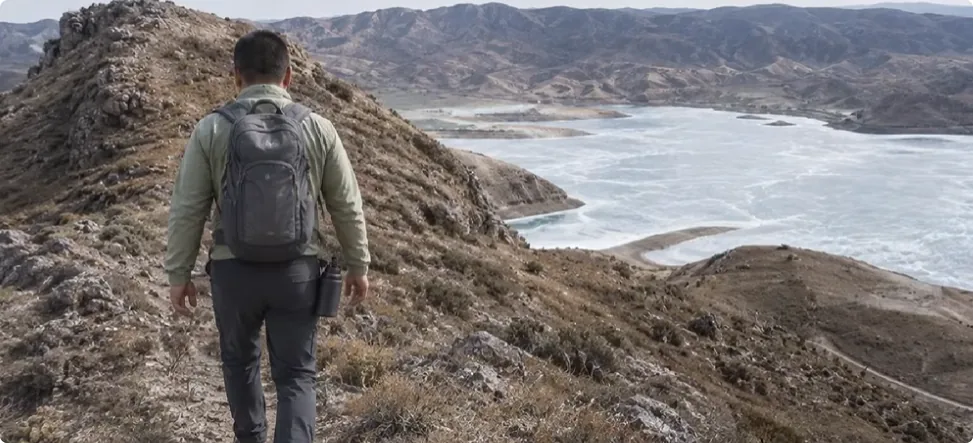

因为他为了追求刺激，喜欢跑去荒野地带和荒废古迹里探险。那些地方鬼本来就多，而且他还喜欢挑战身体极限，去极端环境徒步。一边去鬼多的地方，一边不把自己的生命当回事儿。这样一来，野外的鬼就不得不盯上他了。

**灵质世界有个规律叫同气相求，就是人身上是什么气，就会招来什么东西，就会遇到对应的事情。**
所以当这个博主经常去一些鬼气多的地方，身上的鬼多到一定程度的时候，鬼就能干扰他的判断，会带他去死气重的地方。这就是为什么他老碰到人民碎片。

他去年在汾河二库探险的时候，他沿着水库的一条山脉徒步，快走到头的时候出现了一个野庙。他当时走进去看，庙还有点新，看起来有人在打理。他喊了两声，却没有人回应。
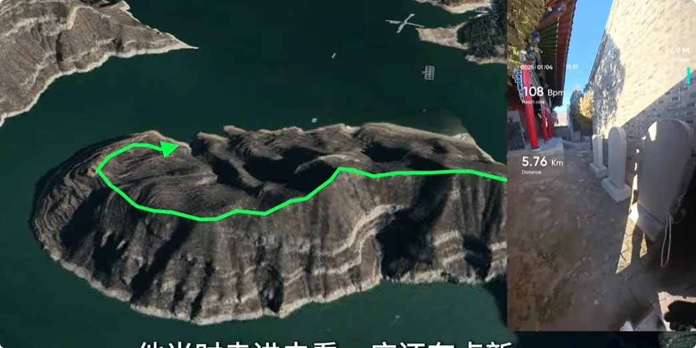

但是突然他听到了类似电锯的声音，然后他有点害怕，就打算走了。走之前，他用铁丝把门把手拴好，把门关严实，然后他就沿着山脊继续往下走，走到水边。

当时正是冬天，水库上结了厚厚的冰。他拿起旁边的石头去砸冰面，想看看有多厚。等他去挑石头的时候，挑着挑着，他就发现枯草里散落着很多人的骨头。

他一开始也被吓到了，然后又冷静下来拍照取证，然后才转身回去。等他回到那个野庙的时候，他发现野庙的门又开了。他吼了两声：“有人吗？”发现还是没有人回应。
这时候他就真的害怕了，因为明明就有人，但是又不回应他，而且水库边还有尸
骸。换谁都会害怕，里面是个杀人犯。然后他撒腿就跑，心率飙到180。
跑回去的路上，他身上的摄影设备无意间拍到庙这一侧的冰面上有一大块冰窟窿，应该是有人凿冰捕鱼留下来的。

结果三天后，新的冰重新冻上了薄薄的一层，基本看不出来。刚好有两个大学生计划骑电动车穿越水库冰面，然后这两个人都掉进这个冰窟窿里死了。
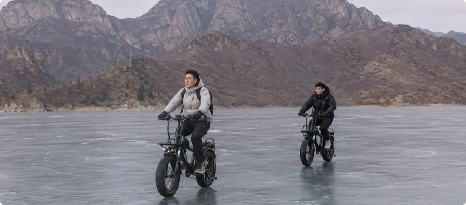

大家知道这件事诡异在哪吗？在于一种巧合，好像有一股无形的力量，把这些不好的人事物聚在一起。如果说你修炼了，你就知道这里面是厉鬼在作怪。

首先，这整个山头盘踞着厉鬼，有大的也有小的。野外的很多庙，人们以为是自己主动给神灵修了庙，其实是那些大的妖魔鬼怪让人类帮他们修的。该修在哪些地方，他们都会潜移默化地告诉那些人。
**有些地方的阴灵，吃吃人的香火和生气就可以了，也不会明面上搞死人，不然没人敢来烧香。而有些地方的阴灵太凶，就是要吃人的。**

比如这个水库旁边的庙，那两个大学生肯定早就被很多鬼缠身了，气场弱到鬼都能影响他们的判断了。当他们安排去水库的时候，他们身上的鬼就提前去跟那个庙的鬼打招呼，串通起来下套。
庙里的鬼又会去找附近阴德差的人，给这个人一个鬼点子，告诉他可以凿开冰面，趁美人偷偷捕鱼。就这样，鬼借人的手，提前三天在大学生必经的路线上埋下隐患。等三天后，水面结出一层肉眼看不出来的薄冰，然后杀人于无形。

这世上没什么意外，所谓的意外都是计划好的杀人。对于灵界来说，杀人不需要杀人，犯的巧合够多就行。
水库旁边的尸骸，也许只是以前的旧坟被水冲开了。水库边的庙平时肯定也有人打理，本来是很正常的事情，但是偏偏营造出了有杀人犯、你看不见我、我看不见你的阴森氛围。

这其实就是鬼类生灵最喜欢的把戏。他们想吓破人胆，让人失魂，因为失魂状态最容易附体，失魂的人可以吃很久。

这个博主最后心率飙到180，可见被吓成什么样了。这个博主身上的鬼太多了，就讲到这儿，我写不下去了。

## 关于户外过山洞
我还关注过另外一个户外博主，是个大学生，家里的底子应该也比较好。他经常去青藏高原一带徒步。他以前看起来非常开朗，但是他现在抑郁了，知道为什么吗？

因为他户外活动的时候，经常会躲到山洞里休息和过夜。山洞不是人该待的地方，很多阴性生灵都是住在山洞里的。或者应该这么说，野外修炼的大妖、大魔、大鬼都是住在山洞里的。
你想，方圆多少公里才会出现一个天然大洞穴？这个地方能是一般的小妖小鬼住的吗？

有些地方你别看它风景秀丽，但是只要出现一个特别大的天然洞窟，远看黑漆漆的，像一只大眼睛似的窥视你，那这种百分百有大家伙住在里面。知道为什么吗？
**无形世界讲究一个形神兼备。看起来阴的东西，它背后积攒的气就是阴的；看起来邪的东西，它背后一定附着邪的生灵；看起来凶的东西，它一定带着煞气或者杀气。**

所以不要被人间的营销掩盖了自然风景本来的面目。棚里，我们来看看各种自然风光，它们背后会散发什么气息，这些气息会吸引来什么生灵，又会引发什么事情。

## 关于徒步路线的选择
哪些户外徒步路线不建议去？

### 1. 忌高海拔登山
首先是高海拔登山。

雪山很美、很高，也很大、秀美，而且是超脱世俗的美，说明蕴藏的气很正，是好的，能使人清明。但是它又很高耸，有的山峰很尖锐，有的很钝，再加上体积又大，走近一点看，就像有一把大刀压在你的脑门上。
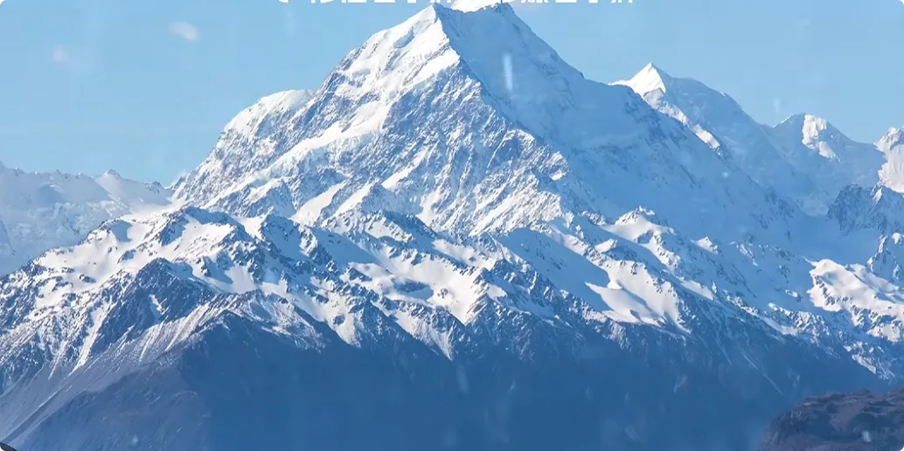

所以说明雪山的气息也很凶，是可远观而不可亵玩的。
有一句话叫 *“灵山脚下狮驼岭，菩萨心肠，金刚手段”，* 其实就是这类风景了。雪山是可以让你赏心悦目，清明你的头脑，但是你要想去打扰它、征服它，动机就不对了，那就完蛋了。

为什么有的雪山突然就起风了、下大雪，让人难以登顶？原因就在这儿了。很多雪山脚下全是大鬼，专杀不懂事的人。

### 2. 寻开阔具有层次之地

想要去看雪山，远远地看看就可以了。比如说萨普神山的徒步路线就很好，去正面看一看。你看雪山，雪山也低头看你，相互尊重总比跑到人家头上好。

还有洋湖自驾路线，隔着古蓝色的大湖远远地看看。宁金岗桑峰，**知自己于天地间渺小，方生敬畏自然之心。** 你能发这个心，神灵都愿意多看你一眼，说不定就帮你开窍了，这点意义非凡。

这两条路线共同的特点是什么呢？就是风景很开阔，很有层次感。

**所谓形存则神存，行不正则气不顺。风景开阔，心神就能放松，你的气息是向上走的。相反，如果风景太逼仄或者太凶险，你的心神就是一直吊着的，气是持续损耗的。**
其次，风景有层次感。尤其是远方有一座可以遥望的美丽的雪山，这种风景会引导人向远处看，告诉你人外有人，山外有山，远方有更值得追寻的目标。人的心结会被引导慢慢放下，人的格局和心气会打开。

大家有机会可以找些类似的地方徒步游玩，去对比一下，是不是回来之后你的心气神会不一样。理解这个，你就能大致理解我所说的修炼了。
其次是重装徒步和超长距离徒步，好几天都在外面待着的那种。

如果是想追求剥离尘市的感觉，想回归简单原始的状态，其实没必要选太荒凉的地方。太荒凉的地方是没有生气的。
比如鳌泰县山脊、羌塘无人区这类寸草不生的地方，有的地方还裸露着刀片一样的山石。这种膳食会散发尖煞之气，人在这些环境别说充能了，还可能被刮掉一层。
生气在哪儿？那些地方生气本来就少。如果说刚好有厉鬼镇守在附近的话，有时候真的会杀几个人，拿人的生气去匀下当地的气息。
所以太荒凉的地方，除非是顶级的修炼者，能扛得住凶杀煞气，否则捞不到好。

### 3. 忌原始森林
可能有人会问，那原始森林路线呢？那种地方不荒凉了吧？肯定充满生机。

其实不然。就算有生机，也是很原始、很纯粹的生气，不适合还要在城市生活的人，而且也不会显露出来。反倒是原始森林周围的毒气、瘴气和迷幻之气，也保持着原始和纯粹，会吸引很多大家伙来修炼。

很多大妖大魔就是待在原始森林里修炼的，修的就是很原始的那种毒瘴之气或者致幻之气。

为什么很多地方会磁场混乱，让人迷失方向？其实就是在猎杀擅自闯入的人。比如哀牢山、黑竹沟这种**原始森林，真的属于你凝望深渊，深渊也凝望你的那种**。

所以重装徒步这类活动，折中点可以找路面开阔又有生机的路线。比如川西有很多开阔的美景，有山、有水、有绿地，只要确保不高反，都可以去。
再者是一般的山地徒步，青徒步一日游的那种。这种可以选择成熟的步岛。同理也要选风景开阔的、看了心旷神怡的、不会有负面情绪的那种路线。
尤其是临近大海、大湖，甚至是湿地旁边的那些步道。这些地方的路线很多是神灵教人来开发的，是专门用来滋养人类的。

### 3. 忌险峻之地
如果是险峻的山，哪怕已经修了路，也不太建议去。因为险峻的地方肯定是凶的，有些地方还要吃人，常常有人不知不觉踩空，跌落悬崖。
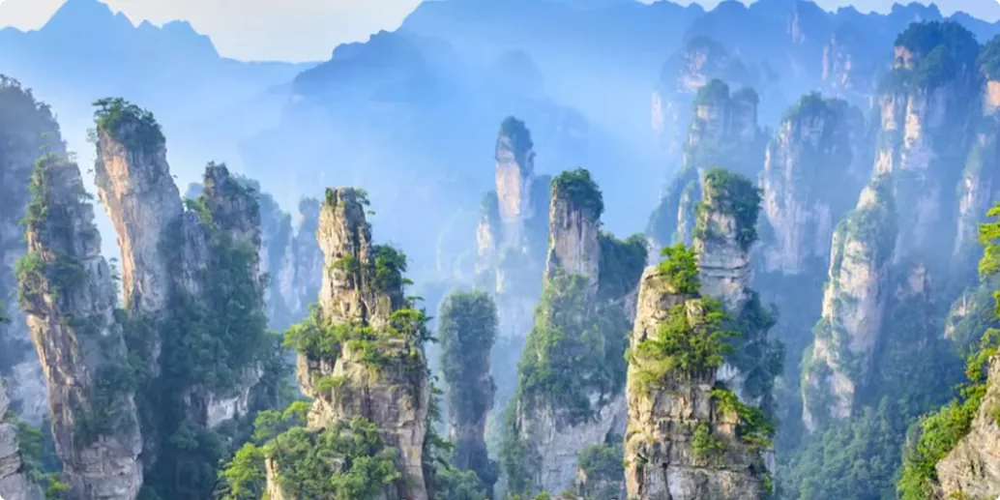

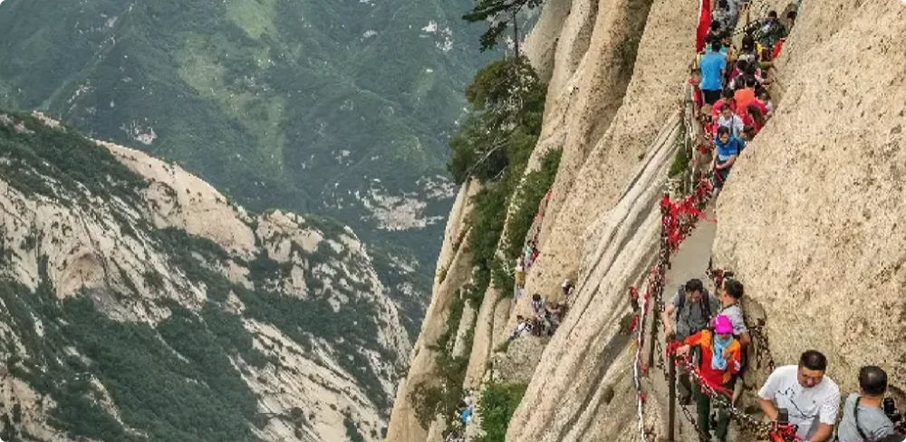

如果是素溪，可以选水面相对比较宽、水质清澈、水流平缓、整体视野开阔的地方，也就是阳光可以轻松照到、风可以轻松吹到的地方。
不要去沙坳里的小溪流，树荫多，黑漆漆的，里面的小景观多得不得了。经常去这种地方，人都要变呆傻，尤其是有孩子的朋友。

### 4. 忌洞浅和洞窟
最后讲一下探洞。
任何洞浅和洞窟，通通都不建议。
**天然洞窟是大妖大魔的天然洞穴，人造洞窟是野鬼避风的地方。**
很多水洞也是一个道理，水洞年年有人死。专业人士要去做研究，跟普通人没关系，普通人不要跟风去寻找刺激。
还有一种是出水洞，这种属于众生的水源地，这种地方也不要去。因为涉及众生的生存来源，一定会安排厉鬼或者大妖大魔来把守洞口。他们会围在洞口外围一圈，不让任何生林污染水源，谁乱来就杀谁。

*涉及杀生这种事情，霸道一般都不是让神灵来做的，而是让厉鬼来做。*

## 结尾
好了，以上就是关于户外徒步的一些建议。

这期我也不弯弯绕绕了，直接把最凶的、最可能害人的地方和最适合人放松的地方点出来，让大家明白不同的地方会蕴藏什么气息，会住着什么生灵，什么情况下他们会伤害人，以及好的地方为什么好，是怎么帮助人恢复精气神的。
本期的图片大家可以多看看，多对比一下，不好的地方是什么感觉，好的地方又是什么感觉。

以后大家出门徒步可以靠眼力判断，知道哪些地方不对劲，哪些地方可以放心去。当然，最好还是有条件就修行修炼。
大家选择户外徒步，大多是为了逃离社会的那张大网，想找个地方静下心来做回自己，感受自由，恢复精气神。这个动机其实跟求仙问道差不多了，修炼修仙的人不就是这样吗？

**想远离尘世，想安静下来，想做回自己，向往真正的自由，想保持高能量的状态，这些都是相通的。**

但是单纯靠户外徒步，是很难达到这种状态的。想要彻底解脱，想要在这个世界上游刃有余，那么还得踏入真正的修炼之道，学会真正地欣赏风景。

我是修仙者小烨，我们下期再见。

## 关于一些城市的建筑点评

为什么城市中的很多建筑看起来怪怪的？

这是长得像三口棺材的客运中心

这是长得像三炷香的小区

这是长得像六根蜡烛的某银行大厦

这是长得像大砍刀的国际金融中心。

看起来都非常不吉利，对吧？你想一下，连你都能看出来，难道那些比你心思重的商人看不出来吗？

作为修仙之人，我是很明显能感受到哪些建筑散发着浊气。我也能猜到为什么那些商人要修这种建筑。估计很多人听过一种说法，说这种建筑都是在借运，把普通人的运借到自己身上。

其实这种说法并不完全正确。
**运并不是从他人身上直接借到自己身上的，而是通过将这群人当作交易品，和那些看不见的超自然力量做了交易后，得到了超自然力量的帮衬，而这种帮衬看起来就像是得到了运势。**

理解这一点后，接下来我就跟大家聊聊，不同的建筑形状和格局，其背后与超自然力量交易的原理是什么，分别对普通人的伤害有多大。

不过我要先重申一遍，我的频道始终是为了劝大家修行，大家不要去干涉别人的事情。

目前我见过的、常见的带有超自然能量的建筑形状和格局，大致可以分为五种范式。

## 第一种范式：刀俎式

香港某银行大厦设计了九面刀锋，意图送走敌人——港督、英军部队。
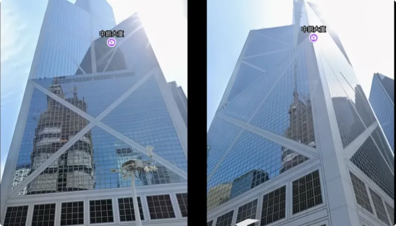

英国某银行这种建筑我经常拿出来讲，之前也专门讲过香港某银行大厦的事情。不过简体中文区的任何建筑我都不好讲，大家体谅体谅。

如果有国外的建筑案例，希望我帮忙看看，大家可以分享到评论区。

刀俎式建筑背后的原理，之前我讲的是：流动的浊气附着在建筑上，最后会在交界处汇聚、挤压并释放出去。
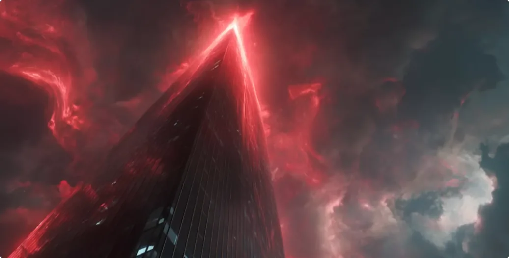

刀锋越尖，煞气越大；体积越大，辐射越广。如果你在生活中遇到了，记得避开锋芒。而且不是避开刀锋的正对面就完事儿了，只要以你的视觉觉得刺眼、锋利，那就是带煞气的，就是能杀你的。

现在我们来做一个思维实验。假如你希望这个建筑的攻击力是两千，但是城市能汇聚到的浊气只有五百，那么力量就要大打折扣，好比打造了一把钝刀。

那么，如何才能确保超载力量显著呢？

>答案是借势。
> 第一种最直接的方式，就是让高级别的超自然力量住进去，这样建筑就拥有强大的浊煞之气。很多高楼里面其实都住着灵界大佬。我去过的一些商场，没修炼过的人可能感受不出来那种大妖大魔趴在整个天花板、盯着大家的感觉。我经常刚走进大门就想赶紧跑，因为太伤人的煞气了。
> 
第二种方法，就是使用一些本身就带有浊气的物质去修这个建筑。比如之前我说过的云铁、石雷、金木，这种物品就是普通人经常能接触到的、自带煞气的材料。但还有很多普通人接触不到、带有毒煞之气的化工材料。通过这些材料，把这栋建筑锻造成一把邪刀。

然后，最次的做法就是改变建筑的颜色、形状，比如深色、金属色、阴间造型等，让它们看起来更讨嗜煞成性的阴性生灵喜欢。

总之，最后这把大邪刀是锻造好了。那这把刀有什么用呢？给谁用呢？

答案是谁得利谁用。

为什么我称之为刀俎式？因为魔为刀俎，人为鱼肉。
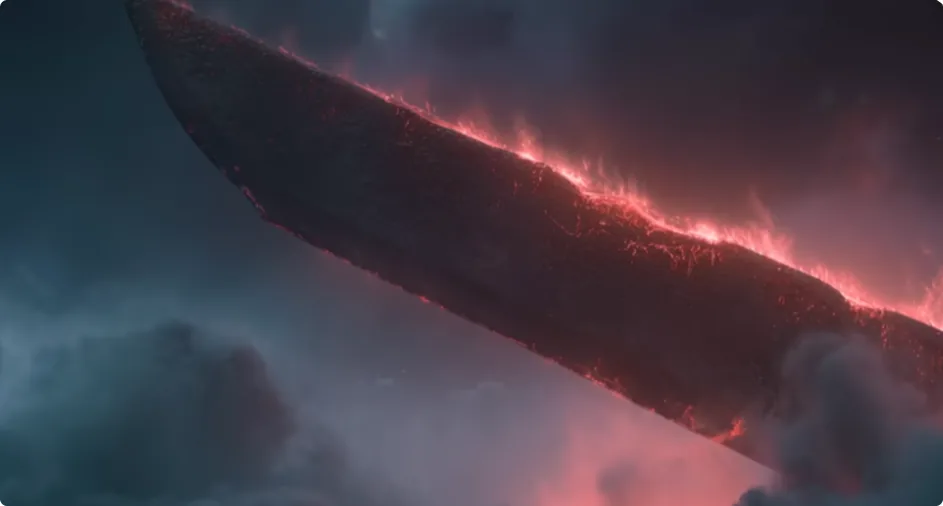

大砍刀其实是一个交易的平台。既然是交易，那我们就要理解交易双方的需求是什么。

### 其一，对于超自然力量来说

也就是我一直称呼的灵界大佬。他们跟人不是一个维度，不是一个物种。他们只在意修炼的能量资源，或者说气资源。因为只有切实的能量、切实的气，才能帮助他们爬上灵界的金字塔。

记住我说的是“资源”两个字。资源这个概念意味着什么？大家要认真想想。

>对于无形维度来说，人的生气就是一种不错的能量资源。注意，我说的是不错，不是唯一，也不是最贵。好比煤矿、金矿、稀土矿，人的生气就是煤矿，价值不算高，但体量巨大。

不过，超自然力量想从健康人士身上掠夺生气并非易事。比如之前我们说过，黄赌毒都是一点点让人堕落下去，才能拿到人释放出来的生气。

但是如果能修建一把大砍刀，直接大范围砍下去，刮掉一群人的生气，岂不更有效率？

### 其二，对于某些人来说

他们知道有超自然力量存在，知道对方能给自己想要的运势，也知道对方的需求，知道自己能满足对方的需求，那么他们之间肯定是要合作的。

我们不可能要求缺乏道德、正道意识的一群人，去守护什么正邪有别的底线。
人为财死，鸟为食亡。只要存在超自然力量，那么人和超自然力量之间一定有合作，而且一直都有。

大家还要注意的是，合作不是指两个人握手言谈，合作是指一种知识。

什么知识？

与神秘力量建立桥梁的知识，包括：
- 如何联系到对方；
- 如何使用对方的力量；
- 如何确保只有自己能使用对方的力量。
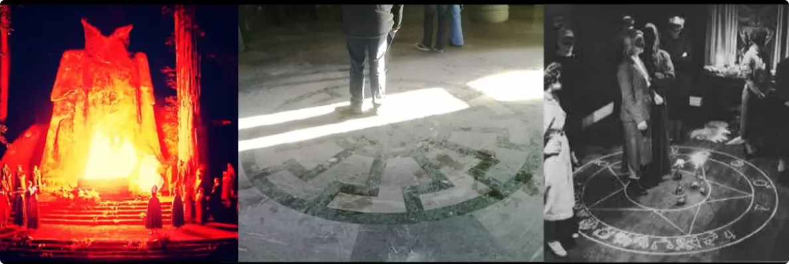

这叫
***通过对无形世界信息差的垄断，实现对有形世界物质资源的垄断。***

听明白了吗？

从古至今都有这样的角色出现，人家从来没有退出历史的舞台，比如大家熟知的共济会、光明会等等。

你以为别人是迷信的有神论者，其实是有莫大的利益在里头。这叫人性趋利的丑态，不叫有信仰。

> Man Koman moment die werdie alnoda vertoum mit  
> handling an in.  
> That's was a bregprint.  
> Da Werich gefraged Yeah, ich kode mit?

从古至今，这些知识都不被普通人知晓，因为好事轮不到你，就这么简单。

就基于这么一条简单的底层逻辑，整条链路的实用神秘学知识都完全垄断及关闭。这件事情不难理解？

所以回过头来我们继续说，市面上所谓借运的说法是不准确的，一般都是那些不懂行的商人才信这套说辞。

实际情况是，你得先认识中间人，才能认识到超自然大佬。然后你搭好一个台子，请超自然大佬上桌吃饭。吃饱、吃满意了，他再回头帮衬你，在某些时间节点上保你抓住新的机会，或者渡过难关。
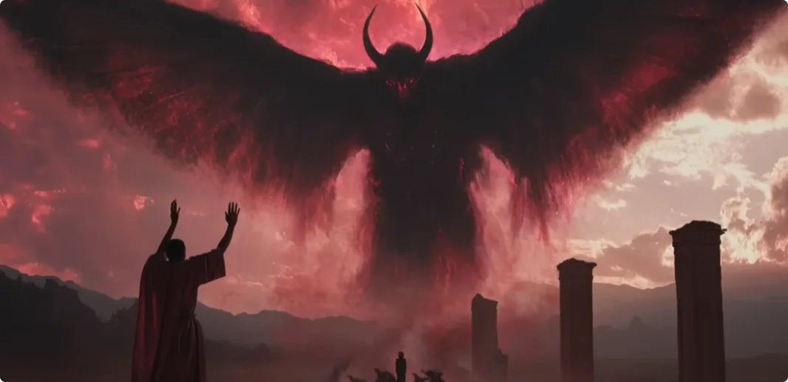

这样，在旁人看来，这就是屹立不倒的好运。
换句话说，所谓帮大佬修建筑、请大佬吃饭，也不过是其中一种交易方式，不占大头。所以对于这第一种建筑范式，我的评价是：**恶毒程度四颗星**。

## 第二种范式：供台式

如果你看到某些像上香的建筑，那你不妨把视野往后再挪一挪，挪到一个视野相对比较正的位置，就能知道是谁在上香、谁在吃这炷香。

一般来说，被吃掉的可能是这座香形建筑里面的人，也可能是香后面那片区域的人。

不过，目前我看到很多的这种做法，其实都是某些商人的一厢情愿。他们只学了一个样式，自顾自地上香，以为能够以物换物，实际上他们连交易对象都没找到。
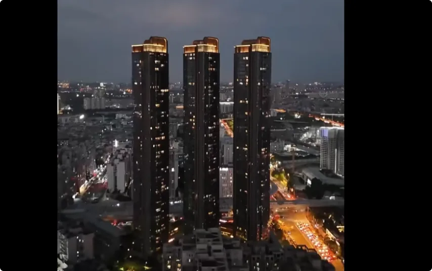
所以很多时候这种建筑是无效的，空有一个形，都没有大佬在上桌吃饭。

其次是一些像棺材的建筑。这种建筑确实很阴，背后的道理很简单，就跟人一样：

- 有些人会被潮玩店吸引；
- 有些人会被鬼屋吸引；
- 有些人会被酒吧、夜店吸引。
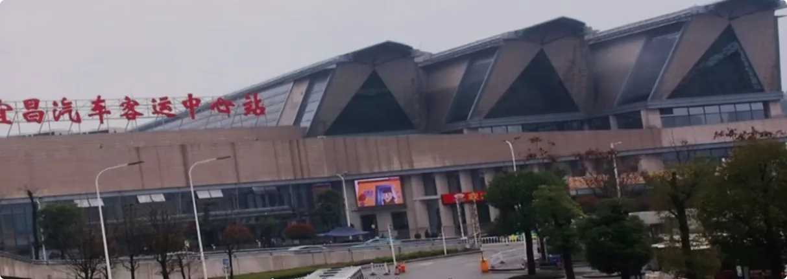

灵界有那么多千奇百怪的灵体，人家也各有各的喜好。
所以棺材形的建筑确实很吸引一些鬼住进去，但也仅此而已。没有交易对象的话，也是借不到运的。

综上，第二种建筑范式的**恶毒程度为两颗星**。

## 第三种范式：朝拜式

如果一栋大楼、一片小区朝着远处一座庙塔看过去，那么这就是朝拜式建筑。
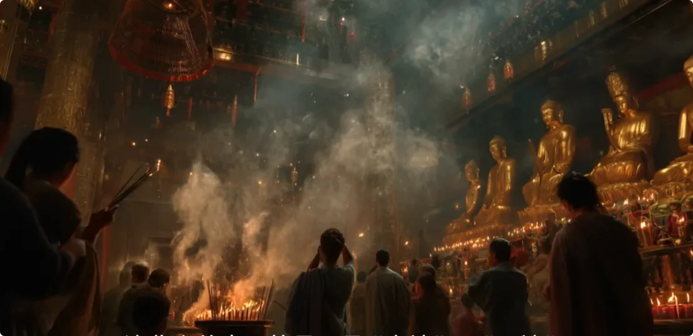
大家不要以为这样很神圣。之前我就说过，成仙成佛在山上，但不见得在庙观里。

那些香火旺盛的地方，从来都是凡人拿钱祈求超自然力量满足自己的愿望。这些人从来不管是不是真神、正神，反正能实现他的愿望就是好神。

所以那种建筑只能吸引来妖魔鬼怪。

你们上网搜一搜照片，那些地方是不是都黑漆漆、阴森森的，有一种油油的、昏昏沉沉的感觉？这就是典型的魔鬼之气。

我说得直白点，每一座庙塔至少都有一位灵界大佬坐镇。

接下来我要普及一个神秘学知识。
在神秘学领域，也就是无形的这个世界，视觉线是非常重要的元素。

正是因为在视觉上看到了两个独立的个体之间，才会观察到对方，才会意识到对方，然后产生交互。而且越是在视觉上显眼，越是会引发关注。

好比餐桌上的菜，其他盘子都斜着摆，离你很远或者很偏。唯独有一盘菜，它端正地摆在你的正前方，远近距离都很合适，上面还雕了一朵花，那朵花还朝着你，好像这盘菜就是刻意呈现给你的，你肯定会产生伸手去品尝的冲动。

这就叫视觉上的布局，引发意识上的倾向。

在朝拜式建筑布局里，寺庙和寺塔的位置会更高，经常在山上。当灵界大佬从山上看下去，恰好有一片楼房把阳台、窗户都正对着它，里面的人都看得清清楚楚。
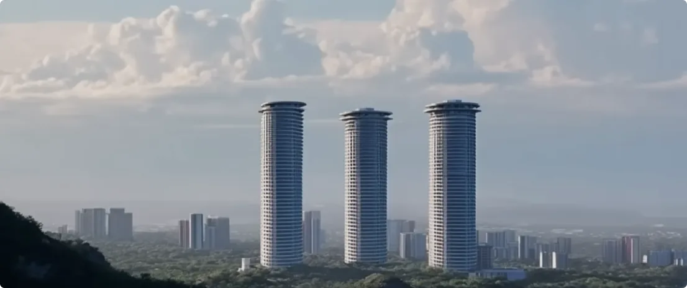

当人的生气从身体剥离的时候，它可以第一时间观察到，并远程牵引、吸收掉，非常方便。
如果这片小区周围刚好有刀俎式建筑，帮忙把人气刮下来，这样就更完美了。

对于这第三种建筑范式，我的评价是：**恶毒程度三颗星**。

## 第四种范式：圈养式

**恶毒程度五颗星。**

这种范式实在太不人性。为了评论区的和谐，恕我只能简单聊聊。

提问：如何让蜗牛在一个地方乖乖待着，跑不出去呢？

>答案是在蜗牛周围撒一圈盐巴，因为盐巴是蜗牛的克星。

但撒盐巴这种方式太直白了，目的昭然若揭，蜗牛们肯定会团结协作，逃离这里。

那么，如何让蜗牛毫无察觉地接触盐巴，既能削弱它们的生命力，让它们跑不动，又能让它们持续创造价值呢？

方法是营造一个看起来适宜的环境，在中间放上新鲜食物，然后偷偷地在泥土中铺上淡盐水。这样蜗牛就能保持虚弱的状态，又不耽误繁衍。最重要的是，它们没有离开故土的动机。

那么，世界上存不存在这样一种针对人的盐巴呢？

>答案是存在的。

我在国外就见过这种地方，是一个小乡村，乡村的中间就是教堂。

当我从中央街道穿过的时候，我的感受是，寂静岭都比这里好。寂静岭的鬼我起码可以应对，可是这满地的危毒，我实在招架不住一点。

多待一分钟，那天我就算是白修炼了。所以我让司机赶紧带我离开这个地方。

## 第五种范式：阵法式

顾名思义，这套东西只能属于顶级妖魔的本事了。
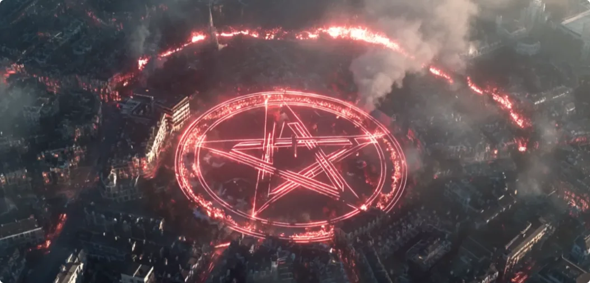

**恶毒程度有六颗星以上。**

由于里面的东西过于超标，我就简单放几个图片和视频片段好了。各位就当是看玄幻作品，不过我也相信有些商人能看得明白，毕竟接触多了能触类旁通。

## 凡人，被一菜两吃

以上五个建筑范式我就讲完了。

总的来说，**普通人或者说凡人，就是被一菜两吃的。**

你不修行、不修炼，那就是温水煮蛙。
温水煮蛙最后的结局是什么？就是到死都挣扎不了。

生死是你自己的事情，神仙、佛菩萨顶多同情你，但不会干涉你。关键还在于你自己想不想解脱。

之前有人说小叶恐吓大家修行，其实我是真的不在意大家修不修行，因为你的生死大事跟我没有关系。

我很早之前就说过，我引渡人纯粹是出于修行人的情怀，不是针对某个修行人，而是针对修行的集体。

很多人不知道，我邮箱中有很多来信问我怎么修行的人，我都是不回复的。

因为如果你这个人给我第一感觉很不靠谱，那无论你多大咖位、多有才华、多有钱、多有名，我都引渡不了。

因为如果你不是真心的、有觉悟的、准备好修行的人，从根本上讲，你就是还不想解脱。你经受不住后面修行的考验，你一定会回到尘世，我的一切付出都将是打水漂。

所以不要觉得博主无情。情义是双方的，你未付出、未证明，又怎么能要求陌生人给你情义和重视呢？
最后，我们来给本期视频收个尾。

想必有观众朋友会问，那到底什么建筑住着好呢？

我们不妨看看那些生活得比较好，也就是富人区的房子。它们有一些视觉上的共通点：
- 低矮的楼层；
- 明亮的装修；
- 干净的活水；
- 周边几乎没有高楼大厦。

但是普通人确实住不起，所以还是修行吧。
能分辨出舒适的地方，已经比大多数人好太多了。

我是修炼者小烨，我们下期再见。
