> _**人住的房子里，真正需要注意的可能不只是朝向、格局和摆设。按照这套阳宅观念，首先要明白的是：活人的规则，只能约束活人。**_

## 1. 阳宅第一条规则：活人的规矩，在“灵界”并不管用

大家好，我是修炼者小烨，是一个漫山遍野找能量、不爱城市、只爱修炼的散人。今天小烨想给大家分享的话题，是**人住的房子**。

你有没有在家里遇到过邪门的事情？是不是还相信人气能赶走脏东西？怎么知道自己的房间有没有脏东西呢？本期小烨会给大家揭露房子里那些不为人知的秘密。

阳宅，就是指活人住的地方，是相对死人而言的，毕竟阴阳有别嘛。从古至今，人的很多规矩都围绕着**趋生避死**来制定，逐渐发展出了各种玄学理论、公式和工具。
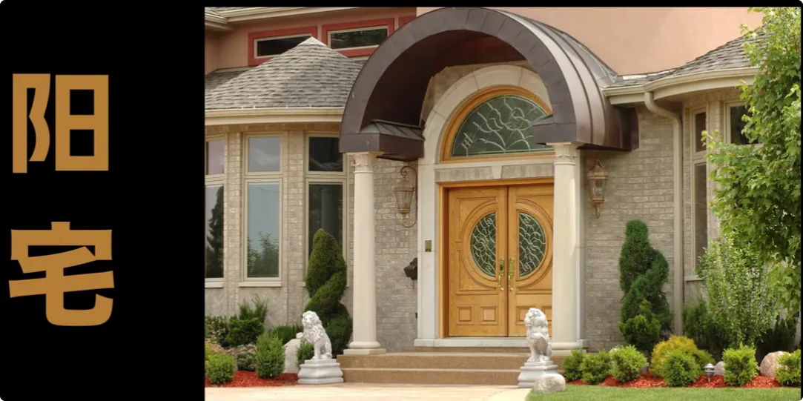

大多数玄学爱好者认为，依据这些理论办事，就可以很好地和另一个层面打交道，比如：

- 摆个什么东西就能招财；  
- 布个什么局就能辟邪；
- 放个什么物件就能镇宅。
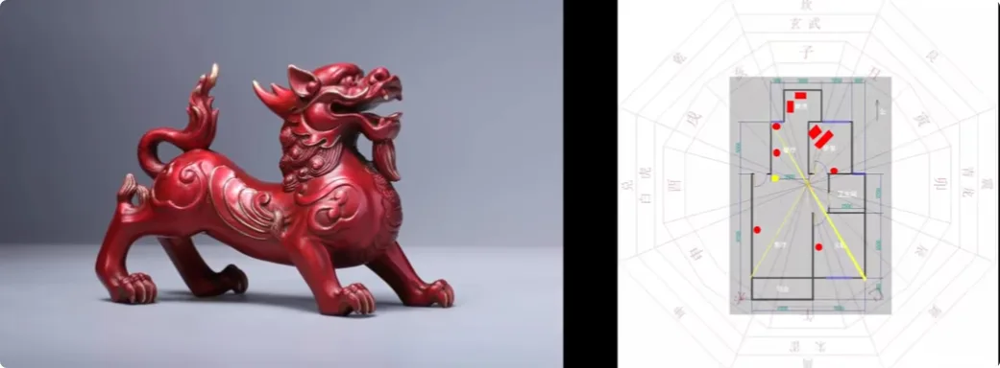

但是你有没有想过：**这些灵体真的会听你活人的规矩吗？**

你立个牌子说“非人免进”，他们就不会进去住吗？
答案显然是否定的。

人家没有形体，无拘无束，干嘛要听你活人唠叨？活人的法度只能约束活人，但是从来没有办法去约束死人。

> _**这就是今天一定要知道的第一个阳宅要点：活人的规矩，在灵界不顶用。**_

因为常人看不见、感受不到，所以从选择房子，到居住，到莫名生病，再到请人做法，这整个过程中，你根本不知道有谁从你家里进进出出过。

其实一个人的家庭、爱情、事业、财富、健康等等，有些不顺利，甚至可以说是厄运，在这套体系里可能就被认为跟房子有关系。

有些人已经怀疑过是家里的格局不好，请了大师来帮忙，但是小烨认为，这些都是无用功。

---

## 2. 大师为什么不一定有用：能抓老鼠的，不一定是猫

因为市面上的大师做的事情，还是想通过**活人建立的规矩去约束死人**。

很多观众朋友可能就要跳出来问了：

> “不对呀，小烨。很多大师资历老、有名声，理论也扎实，给人驱邪也确实有见效啊。”

这里小烨有必要解答一下。

**资历老、有名声，不代表方法就是对的。**

> _**能抓老鼠的不一定是猫，也有可能是蛇。借用的是猫的力量还是蛇的力量，人要付出的代价是不一样的。**_

我敢保证，那些大师自己都不知道，将来要付出什么样的代价。
其次，古人写的书也不一定是对的。
在玄学这条路上，学富五车、名声赫赫，没有用。玄学只看重**真假二字**。
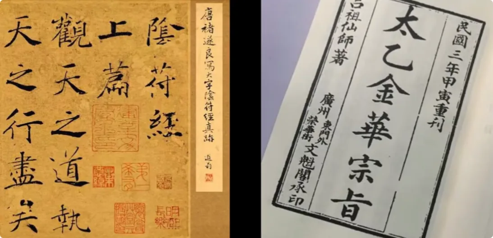

**真的东西一字千金，假的东西制造得再漂亮也不顶用。**

所以你看，从古至今，任何跟玄学有关的理论都是越搞越多，逐渐形成壁垒，让人越来越看不懂。背后都是人心贪婪所致，都想留下名声。

其实真正的玄学很简单，知道真实的原理，就足以把其他东西甩掉。
所以接下来，我会还原平日里看到的灵界世界，告诉你什么才叫趋吉避凶。

---

## 3. 香港“刀炮之战”：建筑的形状，为什么会被解释成“煞气”

有这么一件真事发生在某个小渔村。

时间回到1982年⌚️。

坊间传闻，港英政府故意将渔村中条件不好的一块地皮卖给了中国银行。在各种恶劣条件下，中银最终还是在渔村立起了当时的亚洲第一高楼——**中银大厦**。

中银大厦外形犹如一把三棱钢刀，尖锐的棱角分别朝向周边建筑。后来围绕中银大厦、汇丰银行以及港督府，又逐渐衍生出了香港非常有名的“风水大战”传说。([维基百科](https://zh.wikipedia.org/wiki/%E4%B8%AD%E9%8A%80%E5%A4%A7%E5%BB%88_%28%E9%A6%99%E6%B8%AF%29?utm_source=chatgpt.com "中銀大廈 (香港)"))

传闻中，汇丰银行后来直接在顶楼架起了两门“钢炮”，目标直指中银大厦。夹在二者之间的长江集团中心，则最终建成了一栋方方正正、外形收敛的大楼，像是一面盾牌，尽可能避开两边的“刀炮”。

时至今日，如果你去这附近转转，会发现周边不少建筑的造型都颇为特别。

很多观众朋友肯定已经一头雾水：

> **尖刀、大炮这种形状的建筑，真的会起作用吗？真的不是心理安慰吗？**

小烨来给大家解释一下，在这套体系里背后的原理是什么。

### 物体是瓶子，能量是瓶子里的水

上期我们聊过，在这个世界里，**能量是根本**。
能量从自然中生成后，会散落在大地上，然后附在有形的物体上。
可以把物体理解成一个瓶子，而能量就是瓶子里的水。

水能伤人吗？

>能。

关键是怎么用：

1. **量少而缓**，一时无害，但仍可以滴水穿石；
2. **量少而急**，则可以一击致命。

小烨平时在做法的时候，就是将能量注入到一个容器里，借助容器的“形”来塑造能量的形，再施加一个推力，就可以把能量打出去。

而现在如果换成一栋数百米高的庞然大物，本身形状又锐利无比，按照这套理解，能量的**泄口**就会集中在细细的棱角上。

这种能量，就叫：

> **煞气。**

而且还是**大煞**。

### 两股煞气互相对冲，并不等于互相抵消

那汇丰建造另一个“煞角”与之相对，可以化解吗？

其实不能。

因为按照这里的能量逻辑：

> _**能量只有一正一负才会抵消，如果两栋楼发出的都是负能量，那就只会 1 + 1 = 2。**_

那这些煞气去哪儿了呢？

按照小烨的说法，其实只是被抛到了周围空间，由周边的环境和人吸收掉。

所以如果你家里有很尖锐的东西，尤其是石器、金属等材质，小烨的观点是要尽量清理。任何正对着人的**尖角**，哪怕是窗外建筑出现的棱角，也尽量避开。

---

## 4. 阳宅格局能做到的，只是“少一点负能量”

那怎么才能化解已经出现在身边的负能量呢？
刚才说了，按照这套体系，只有正能量才能抵消负能量。
所谓正能量，指的是能滋养万物生长的能量。它有一个中国人都知道的称呼，叫：

> **真气。**

在灵界，这就是最好的资源。
试问资源有这么好拿吗？

答案是否定的。

有形界和灵界存在的个体数目这么多，好的东西怎么可能扔在大街上给大家随便挑选？怎么可能你一念经、一打坐，好的能量就会自动投怀送抱呢？

显然是不成立的。

实际上，人界和灵界对待资源的观念，以及衍生出来的规则，是大同小异的：

- 比较文明的上层灵界，讲究**能者拿，也讲究拿的秩序**；
- 比较野蛮的下层灵界，则没有太多讲究，主打一个**能者强，弱肉强食**。
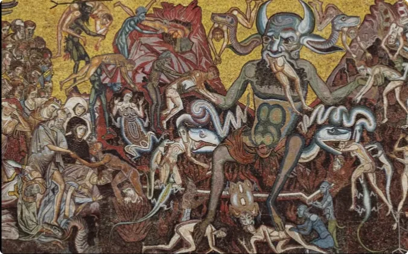

有些人可能要问：

> “不是说灵界都是高灵性的吗？怎么可能没人来主持公道呢？”

小烨反问一句就明白了：
人类文明进步到现在，谁又会去管哪个池塘里的哪条鱼，吃了哪只虫子呢？
根本不会。

文明的差距摆在那里，完全不是一个档次。人只会说这是自然法则，弱肉强食与我无关。

上层灵界又何尝不是这么想的呢？

> _**所以第二个阳宅要点就是：按照小烨的体系，人的周边，也就是下层灵界，并不会天然存在大量好的能量。**_

想要单纯靠改变家里的格局就“转好运”，是不可能的。

改变格局能做的，只是尽可能减少负能量和负面存在的淤积，**仅限于减少霉运发生的可能性。**

---

## 5. “请神容易送神难”：开光、镇宅与供奉物为什么反而可能成为风险

那些请市面大师开光镇宅的物品，以及做法清理住宅的事情，在小烨这套体系里反而被认为存在风险。

你有没有想过：

> **他们使用的力量，到底来自哪里？**

他们可能会说来自灵界、来自师祖、来自高灵。
但小烨的疑问是：

> “他们凡人之躯，哪来的资格直接对接上层灵界呢？”

按照他的观点，背后无非还是下层灵界里的某些“大佬”而已。
他们自己都分辨不出利害，只凭心中的信念，认定自己走的是正道。
所以有句话叫：

> _**请神容易，送神难。**_

这里的“神”，按照这套说法，指的就是这些负面的大佬。
如果普通人把这些存在请到家里，那才是真正的问题。
所以如果家里有镇宅石、桃木剑、神像等等，小烨的观点是，都需要重新思考它们到底承担了什么作用。
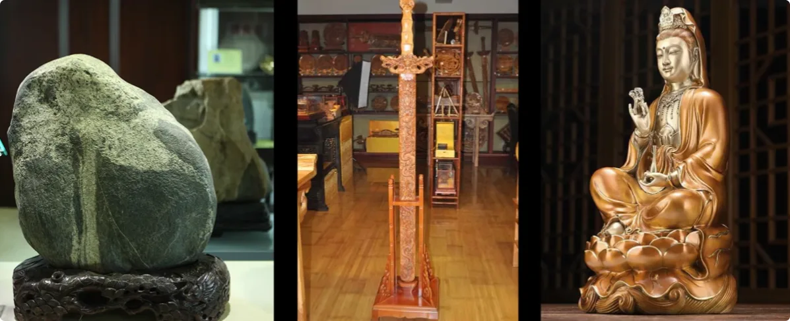

很多人喜欢玄学、喜欢佛道、喜欢西方冥想、喜欢灵性和新纪元，估计要失望了。
因为在小烨的描述中：

> **真正的灵界远远要残酷得多。**

里面的水很深。
想要理解这一点，记住“**能量守恒**”四个字就足够了。

### 正负同时存在，才叫“能量守恒”

能量一定是有正就有负，正负能量一定是同时存在的，只有维持两极平衡，世界才能运转。

所以千万不要只信神佛、天使，而不知道妖魔鬼怪。
前者可以有多强，后者就可以有多强。

这叫：

> **能量守恒原则。**

而小烨认为，在地上、在这些建筑里，包括家里供奉的很多存在，都不是真正意义上的正神。
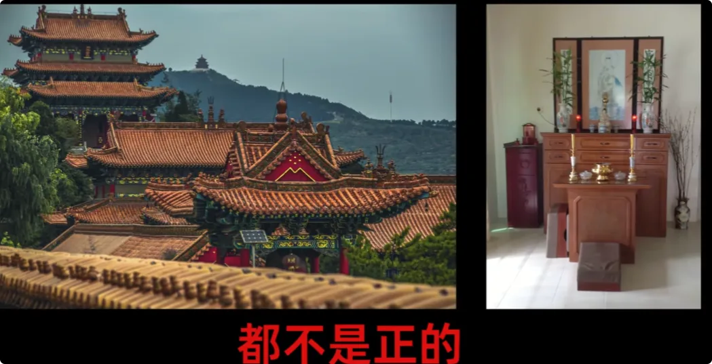

神的意志跟人的意志完全不是一个等级，**神之爱和人之爱也不是一个概念。**
换你做神，你愿不愿意天天待在一个神像里过日子？
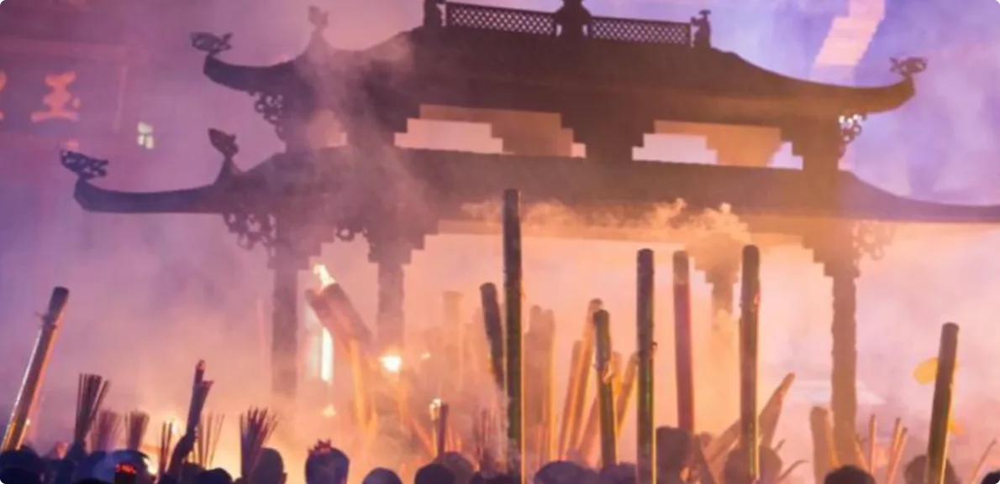

>不会。

那么：

> **这里面住的到底是什么？**

---

## 6. 人气真的能赶鬼吗？按照这套体系，答案恰恰相反

接下来小烨说的内容，可能会颠覆很多人的玄学观：

> _**凡事有求必应，一定图谋不轨。**_
> 
> _**“人气可以驱邪”的说法，纯粹是人的一厢情愿。**_

在这里的解释中，人气算不上干净的能量。

相反，对于负能量众生来说，人气却是**下层灵界很好的修炼材料**。
所以不论人类愿不愿意，这些大大小小的灵体还是会来找你。
在下层灵界“吃人”这件事情上，唯一的规则就是：

> **弱肉强食。**

也就是没有规则。

### 为什么越有社会资源的人，反而越容易被“大东西”找上

按照小烨的说法，越是有社会资源的人，越容易被大的灵体找上门。

为什么呢？

因为这些人可以对接的人员更多，关联到的人气也更多，**投资回报率很高**。
而且这些“大佬”会给这些人一些特殊能力。

比如：
1. 让俊男靓女更有性吸引力，让旁边的人产生更多欲望，以交换更多人气；

2. 让某个地方的大师、神婆得到一些特殊功能，让他们去富豪家里开光做法；
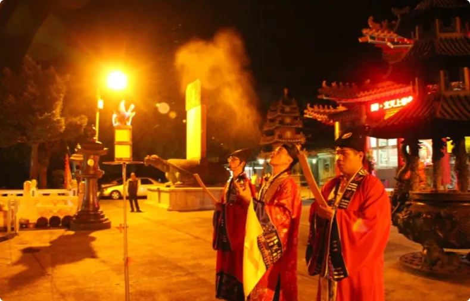
3. 帮助某些人扩展影响力，获得更多人心灵上的信任，让人主动接纳这股力量。
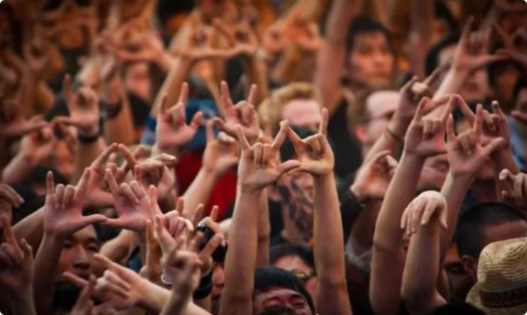

这样一来，大佬就可以在很多个体身上吸收到人气。
所以在这套观点中：

> **谁越出名，背后找上来的家伙可能就越厉害。**

如果看到一个名人开始抑郁、犯错、跌落神坛，小烨会把这种情况解释成肉身已经承受不住高浓度负能量，届时运势开始衰退，也是被“大佬”抛弃的表现。

---

## 7. 家里的其他“住客”：玩偶、衣柜、霉墙和信仰物品

对于普通人来说，虽然未必惹得到所谓“大佬”，但周边还有数不清的中小型负面灵体。
他们的盘子不大，落脚的地方可能只是千千万万个普通家庭中的：
- 某个物品；
- 某个角落；
- 甚至人体的某个部位。

具体而言，要看他们各自的修炼方式。

### 1) 鬼：可能依附在玩偶一类物品上

比如有些鬼一直得不到转世名额，就会喜欢钻进玩偶娃娃里。

你喜欢玩偶，心中有动念，玩偶就可以接收到你的人气。

所以按照小烨的说法：

> **没有玩偶是不“注进东西”的。**

除了玩偶，首饰和画作也是同样的道理。

### 2) 妖：可能停留在衣柜等与欲望相关的空间

有些妖喜欢吸收性行为释放出来的能量，因此会住进衣柜里。

如果你的衣柜有股寒气，小烨建议多透透风。

### 3) 怪：常和病菌、脏污、潮湿环境联系在一起

有些怪一般与病菌相存。
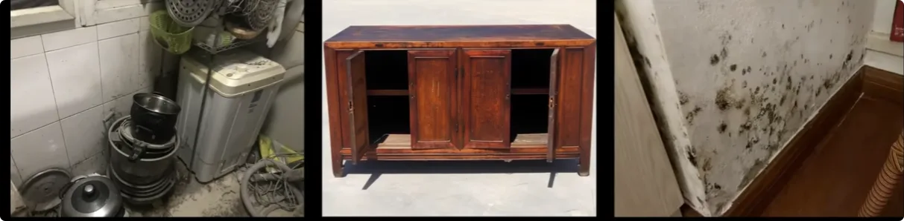

如果不注重家里的卫生，或者家居多年不换，墙体出现发霉、发黑，那么在这套说法中，这些环境就更容易成为“怪类”停留的地方。

### 4) 魔：更喜欢成为人的信仰或心结

最后要介绍的就是魔。

他们的玩法更高级，更喜欢成为人的**信仰或心结**，寄宿在人的头部。

“末法时代”四个字大家都听过吧？

> _**魔会披着袈裟降临的时代，所有信徒都找不到路的时代。**_

所以家里有与信仰相关的物品，包括帮助调整意识频率的熏香在内，小烨都持非常谨慎的态度。
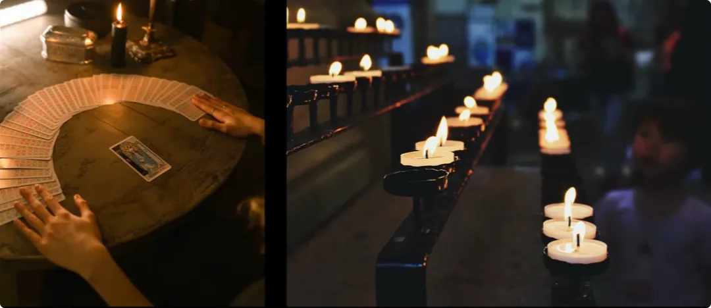

---

## 8. 阳宅最后看的不是“摆什么阵”，而是你到底生活在什么环境里

以上四类，无论哪一种，只要家里存在的数量和量级上去了，按照小烨的观点，都会影响人的身心状态和个人运势。

所以当一个人出现莫名抑郁、家庭不和、各类运势下滑，他会建议先检查自己的房子。

如果出现意外，则要及时处理，避免出现不可挽回的损失。
其实关于阳宅的话题，小烨真的有说不完的见闻。
因为常人感受不到能量，所以根本不知道自己生活在什么样的环境里。

### 为什么现代人越来越喜欢买宝石、器物、熏香和“能量产品”

为什么这个时代消费欲望这么强，还在不断开发各种所谓的情绪价值？
按照小烨的解释：

> **灵界背后都是一场场大型交易。**

如今很多人特别信“能量”这一套，买了一堆宝石、器物，在家里大搞冥想，根本不知道自己可能已经成为了所谓的“韭菜”。

在他的描述中，这些人以为自己得到了正能量，实际上反而可能白白被收割了大量人气。

也只有等他们开始抑郁、生病、诸事不顺，开始自我怀疑的时候，才会醒悟自己过去的愚行。

> _**末法、末法，又有几个人真正知道这两个字背后的含义？**_

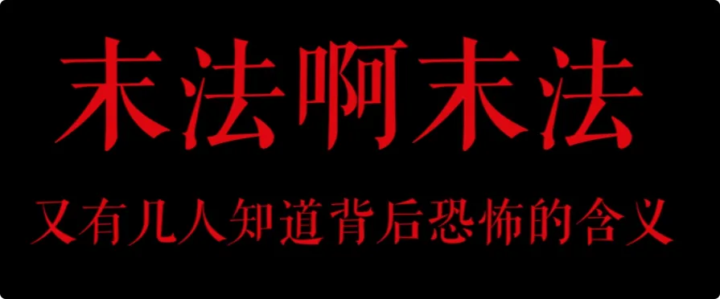

感谢大家看到这里。

如果想了解自己的家里情况如何，可以在评论区发照片，小烨会点评一二，也可能做成一期合集，专门给大家讲解一下。

如果你喜欢什么玄学话题，也欢迎在评论区告诉我。

**我们下期再见。**
