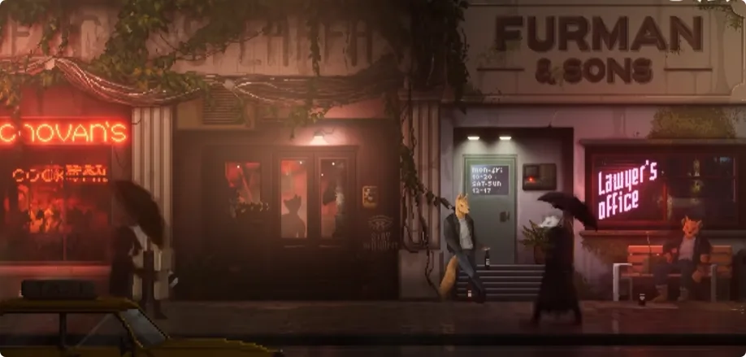
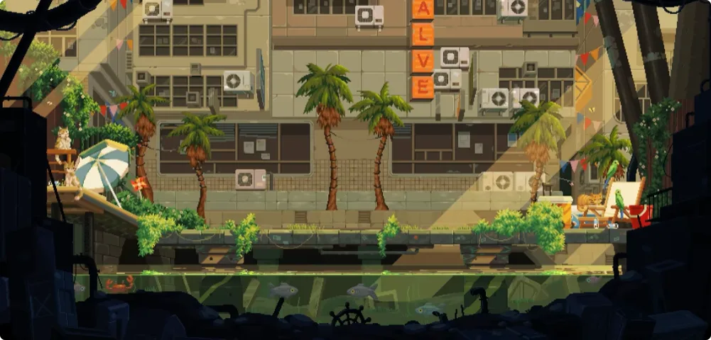
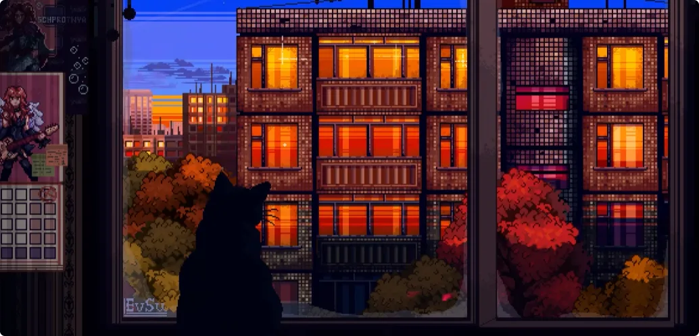
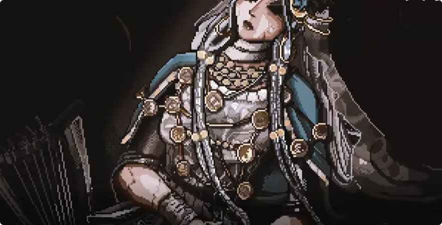
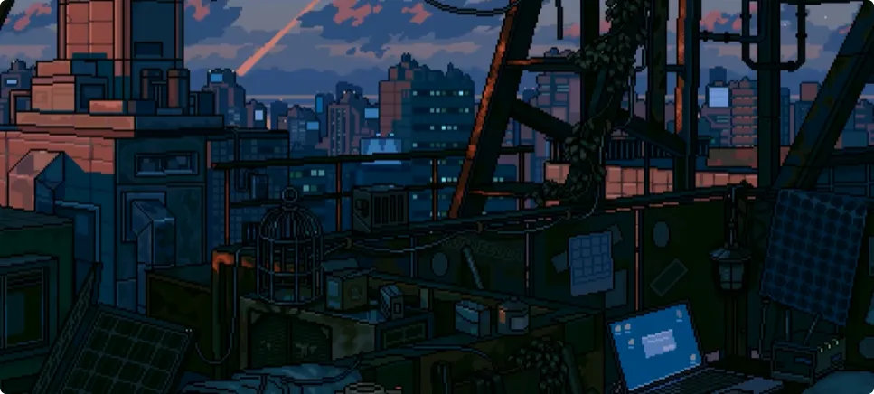
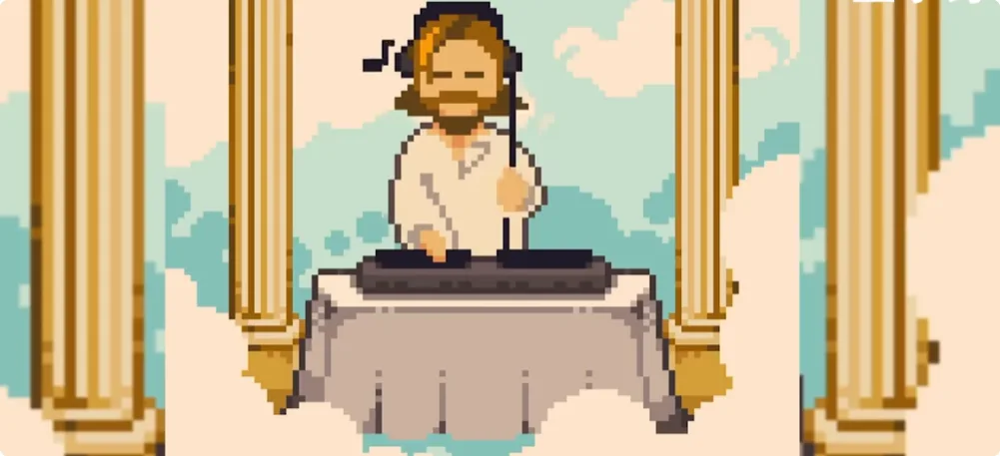

> **最好的修行心法是什么？——把自己修成一个更健全、更稳定、更有判断力的人。至于走内修、借法、灵视还是术数，要先看你究竟想得到什么。**

## 1. 先建立世界观：阳间、灵体界，以及“神”到底是什么

本系列就是基于我真实的法事生活和上下走动的见闻来做的，还是一样，尽量讲得乐一点。当然了，基于现代社会的科学发展观，以及一些小伙伴可能懒得了解封建迷信、民俗神秘学、真实存在等不同层次的分别，所以下面这些内容，你们当故事也行、当世界观也行、当睡前乐子也可以，随意。真有觉得无聊或者难辨真假的，我建议你上表问祖师，就说是我说的。

首先说一下整体概念：**世界还是唯物的。** 不是说有神仙存在，你就能原地起飞，然后变化成山川河流。哪怕是变化和起飞，也是有法的路径和逻辑在里面，这是一套很精密的运用，不是想来就来的。

肉身所在的地方叫**阳间**，宇宙也属于阳间的范畴，有物理规则，有空间和时间的限制。就诞生的时间而言，其实很短。所以对于灵体界来说，我们有时候会称阳间为“末端”，也就是整个三界里最后诞生的部分。

灵体界也是唯物的，有属于灵体界的物质和规则，只是相比阳间，时间、空间的束缚要薄弱很多，而且比阳间更加巨大。各位平常听到的阴间、地府、地狱、天堂、天庭、冥界，其实都是灵体界的一部分，可以理解为各区块的行政机构，也就是和阳间有着紧密关联的地方。除此之外，灵体界绝大部分区域是不被阳间探知的；同样，绝大部分灵体界居民也对阳间没有兴趣，并不会来到阳间，甚至有些原住民同样不知道阳间。

各位平常听到的神，什么**三清、雷祖、提尔、宙斯、湿婆**等等，他们居住或者说存在于灵体界，是灵体界的高位灵体，是有强度和位格的行政者。其中有一些存在确实可以称为“神”，因为他们是某一大片区域的主要行政者，也就是阳间所称的**主神**。

和阳间的人一样，灵体也有强度大小之分，但这种强度更加纯粹、更加直接。就像游魂和正神的对比，是粉尘和石头的区别。

各位不要把灵体想成天上有、地下无，高高在上的一批。实际上，阳间大部分人对于“神”的概念来自人类自身。人类一厢情愿地把一个可以满足自己愿望、解决自己问题的“超我”套在灵体身上，并且相信这个灵体可以解决自己的问题。

很多人还以此论证神存不存在，比如说：
地球环境这么差，为什么神不惩罚人类？打仗了为什么神不帮我们？

关灵体屁事。你也没打电话让人家来帮忙，而且真帮了你，你也看不到。

不要去否定你自身的力量，更不要把这种否定上升到整个人类群体，两个行为都不合适。**人不是唯一的智慧种族，也不会是最后一个。**

人与灵体本质上可以达成的是**合作关系**，而不是奴隶和奴隶主的关系。肉身是非常强大的东西，精神力也是三界共同的好东西；灵体则有超越人类视角的视野和超脱人类的力量，所以希望各位正视自己的存在。

---

## 2. 普通人到底要不要修：可以不修，先做一个健全的人

说完一些基本概念，就可以聊一点乐的事情。

群里问得最多的是：

> “咋修啊？”  
> “听说未来三界要融合，能不能不修？”

先说一下，**完全可以不修。**

甚至即使是在有生之年，真的发生了“降临”级别的事情，到人可以肉眼看见灵体的程度，你也一样可以不管这些，因为阳间有阳间的特性，这里不是灵体界的主场。

也不要一直担心灵体会侵略你的生活，就像你不会每天担心家里有没有小偷，因为真有小偷可以报警。对于灵体也是如此，这就是**城隍和法师**存在的意义。

甚至大部分人遇到的“灵扰”现象，也就是很多法师口中的所谓“小鬼”“脏东西”，其实连游魂都算不上，只是一点气息，多晒晒太阳就可以了。如果真的非常不幸，遇到了可以称得上灵体的小鬼和脏东西，也不要害怕。只要你的意志足够坚定、精神足够强大，灵体很难撼动你，这就是肉身强大之处。

你只需要找法师，或者去正经的庙观妥善处理就可以了。因为目前阳间的灵体真的不大、也不强，**八成都是一道雷可以完全消散的存在；剩下一成是风水导致的问题，一成是城隍给雷部打电话可以解决的问题。**

### 真正通用的“心法”：德智体美劳全面发展

对于想要修行，或者说想要接触灵体界的人，这个就很好玩。

因为不是你走玄学路子，死后才可以去往灵体界常住；也不是一定得做法师，才算走在修行的路上。

我觉得最好的修行心法，可以概括成一句大家都听过的话：

> **德智体美劳全面发展——做一个健全的人。**

这个是真的。

因为如果有走内修的小伙伴就知道，**内修本质上是让自己变得更好、更强，不断挖掘和去除自身的问题，达到更高的境界。**

内修过程中出现的所谓幻象、心魔，以及感受到的痛苦和迷茫，最终都可以落在自身的问题上。生活中感到的负面情绪，对于修行而言反而是好事，因为这意味着你的问题出现了。只要弄清楚问题的根源，找到解决办法，就可以一劳永逸地把它解决掉。

这也是我唯一推荐的心法，因为它真的很直接。

---

## 3. 如果目标是“成仙”：传统道门、箓籍与跨体系修行

### 走传统路线：读书、学习、建立自己的理解

有了心法，具体走什么流派呢？

这个其实要看你想达成的目的是什么。

如果你说你就是想修仙、想成仙，不管现代科学怎么看，你就笃定自己能成仙，那么最快的路子就是找个道门。

因为按照我这里的世界观，**道教就是灵体界天庭区域驻阳间办事处**，简单来说，类似公务员机构。

虽然现在各个流派、各个门派或多或少都有点破事，但你就进去摁读书、死读，别人做什么你都不听，就摁看经典。祖师傅总会给你一口饭吃的。

走传统路子，要么：
1. **你是天才。** 有自己的思考能力和学习、建立知识体系的能力；
2. **你勤勤恳恳，真的努力。** 哪怕没有天赋，也能走出一条路来。

这两种都可以有成果，理论上也都可以入仙籍，也就是死后换个地方打工。

这里还涉及一个词，可以理解成**箓籍**：也就是通过一个体系获得身份、名籍和归属。只不过本质上还是换个地方工作，不是神话传说里那种随便飞天遁地的神仙。

最怕的是心态摆不正，自己不好好学，就想着有超能力，每天幻想“灵气复苏以后我可以成仙”。

说实话，早就复苏了，自己没察觉罢了。

### 不走道门，也可以进入其他体系

当然，你要说我对道家不感兴趣，那些古文一个字都看不明白，就喜欢魔法，那么同样可以走类似“箓籍”的路子，进入西方或者其他非本土体系。

唯一的问题，就是有一道类似“**转户籍**”的过程。

也就是说，在对方体系认可你，认为你死后可以去那个体系生活、工作的情况下，你在上下的档案会被转移到其他行政机构去，除此之外没有什么。

这个和单纯寻求信仰是不同的。

**这个路子需要其他体系认可你，你才能在其他体系中长久生活和工作。**

这个算是修行者、法师的专属。底下对于法师转“户籍”，也有特事特办的条例。至于这些体系具体走的是借法还是内修，我没有怎么研究，有修其他体系的大佬可以说一下。

### 修行一定会碰到假法、残法和骗子

还有一个所有体系都会遇到的问题：

你可能修了半天，发现这个流派是残缺的；或者找的师父是骗子；甚至这套法的逻辑本身就是矛盾的。

这个只能说，是修行过程中不得不碰上的一环。

即使灵体界，也有很多诈骗级别的法存在。

> **所以要多看、多思考。包括我在这里和你们说的这些，在你们不思考的情况下，也不要听什么就信什么。那就成宗教了。**

---

## 4. 如果目标是抓妖驱鬼：借法有两条路

有些小伙伴就要问了：

> “我对死后成仙、去灵体界一点兴趣都没有，我就想有神通，可以抓妖驱鬼，行不行？”

可以。

这个反倒简单，就是走**借法**的路子。

我把借法分成两种：
1. **灵体合作法**
2. **祖师打工法**

### 灵体合作：出马只是其中一种

“灵体合作”听起来比较陌生，但**出马**这个词大家就很熟悉了。

出马属于灵体合作的一种。广义上的灵体合作，就是和一个或者多个灵体达成合作关系，通过仪式、上身或者通灵仪式，请灵体降临来施行法术。

>**灵体行法、告知信息，人类则进行供奉。**

因为对人类来说，这是神通、法术；对于灵体而言，这就是它本身的力量，和你举铁练出来的肌肉其实是一个道理。

需要注意的是，灵体合作并不是非得**上身**。只是部分流派走的是上身，也就是顶灵的路子。上身对于自己会有一定程度的伤害，会导致精神和意志不同程度受到影响，甚至影响身体，所以需要考虑清楚要不要走这个路子。

而任何形式的灵体合作，都要注意：

> **自身一定要做好防护，不是什么玩意儿来了都能供起来。**

有些小灵体路过你的招灵仪式看一眼，你以为是神仙下来了；那个小灵体也懵，你也尴尬。
那桌子上的香火吃是不吃？

>不吃，怪可惜的, 等两秒一想：吃，好像也没什么问题。

于是你就获得了一个**自己也不知道能干什么的小灵体**，遇到脏东西跑得比你还快。

而且这甚至还是好的情况。
坏的情况下，你的招灵仪式会直接导致自身受到灵扰。在没有自保和驱灵手段的情况下，会导致自身意识和精神受到伤害，甚至影响肉身和正常生活。

这种情况在法事里屡见不鲜，是真的需要严肃对待。

**不存在你觉得自己是天才，你就真的是爽文主角的情况。**

---

## 5. “祖师打工法”：为什么接了法脉，就不只是拿力量

祖师打工法就很乐了。

简单来说，就是借民间法脉行法的时候，请**祖师以及麾下兵马**来帮你。
因为民间法脉非常直接，法本里也大量存在驱妖、打鬼、收魂、破秽之类的法术，和主内修的流派算是互补。
所以很多道门，或者内修方向的法师，会选择接一个民间法脉，作为自保和吃饭的手段。

但这个就得看法脉的**祖师强度**。
有些祖师是天才来的，在灵体界也有一席之地，那行法强度就很不错。
那反过来，为什么叫“祖师打工法”呢？

因为法脉不是轻易可以断的。接了之后，你就得给祖师打工、干活、赚香火。
而且有些法脉的传承仪式还很独特。比如师父吐一口口水在茶里，你喝下去之后，就算正式**接入法脉，上了祖师爷的白名单**。

所以无论是灵体合作，还是祖师打工，都请多寻思。
借法的路子对于他人或者其他存在的依赖性极大。加上阳间除了正神之外，真的没有多少灵体界的大东西，甚至很多法师都不知道那些存在。

所以一开始走这个路子，很容易认为：
- 自己看到的就是全部；
- 自己有了神通；
- 自己背后的灵体特别强。

### 修行圈为什么特别容易出现“战力膨胀”

因此在现实和网络中，各位很容易看见这种**数值膨胀**。
这个法师声称背后是什么什么娘娘，手眼通天；那个法师又是什么星宿转世，力能开海。

其中有的是真有实力，有的更多只是嘴上说说。

这里不是说硬踩或者嘲讽，因为即使是大的民间法教，例如**闾山、梅山**，在不同地区都有不同的起源传说和不同的供奉神祇，其法师对于自身的称呼和能力，也有不同程度的说法。

不论从真实的灵体界，还是从阳间的民俗神秘学来看，因为历史时间过长导致的**众说纷纭和数值膨胀**都是不能避免的。

哪怕灵体界里，也会出现大量这种情况。

这就是说明世界是活性的嘛，是好事。

### 真正高位的存在，为什么反而很难在阳间见到

再说个扎心的：灵体界很多存在，为什么阳间观测不到，甚至成为法师之后也很难接触？
因为那些存在**太他妈大了**。
大到阳间没有办法承载它的本体。

你不能指望三清直接下来行走人间嘛，因为位格和体量都太庞大了。这种存在即使投胎到阳间，也只能分一部分意识下来。
毕竟你也不希望在阳间看到一个**一个省那么大的蜈蚣**吧？
那多吓人。

所以阳间能合作和借法的无神格灵体，对于整个灵体界而言，大部分都没有真正可以拍板、说得上话的分量。

你就想：

>有这么一个灵体，拳打星宿、脚踏山川，呼一口气都是法生百妙，天上天下狂得不行；正神见了要敬酒，散修看了要避让。

**怎么就偏偏收了你？**

还非得你不可。
你不愿意，还打你。
收完你以后，还不收别人、关门了。

这多抽象。

以前灵体诈骗多的时候，这种情况更加离谱。小灵体敢冒充正神下来骗取供奉和精神力，把人盘剥完之后，人变成精神病，小灵体一摆手走了。

当然，按照我这里的说法，经过灵体界和阳间一些法师的通力合作，现在这种情况已经很少了。

### “几万兵马”，最后一数只有五个

还有一个乐的。
基于灵体合作这个设定，阳间不是有**养兵马**这种做法吗？
养兵马操作起来比较复杂，有人造灵、有招募、有魂、有傀儡等等不同的做法。

重点是：

> **灵体是会骗人的。**

之前我看有人收兵马，说自己收了几万。
我好奇过去问了一下那个灵体。
他妈的就五个。

就是随便报个数给法师听，混口饭吃。
法师又看不清，对接不好的灵体说什么就是什么了。
但是五个也不少，至少处理阳间的事情够用了，又不是开战。

---

## 6. 如果只想“看见”：灵视和出体到底是什么

又有小伙伴问：

> “我对修仙和施法都不感兴趣，但是很想看看灵体界。只希望能看到、能交流，又不想走降神的路子，就想交朋友，能不能修？”

可以。

这种修**灵视和出体**就行。

### 灵视不是脑子里播放高清电影

灵视在各个流派的称呼不同，**天眼、阴阳眼**等词经常都在指向类似的能力。
但本质上它不一定是一种画面视觉，各位不要被这个称呼束缚了。
**灵视真正指的，是你的灵体感知和信息收集，比普通五感更加饱满。**

基于灵体的感知，是直接收集灵体界信息的功能。
不要着相，认为一定要把画面看得特别清楚。

不是的。
例如找人，或者和灵体交朋友，灵体界的**法相**，也就是外观皮肤，是可以随便换的。
你看得再清晰，也可能被蒙蔽。
所以要直达本质，也就是感知**气息**。

> **只要气息对上了，那就是这个人。**

灵视各门派都有自己的修法。我之后也打算开班教这个，不是广告，第一期免费。
因为我也很好奇，我这套方法普通人练的话能不能成，只能说做实验班。

### 出体分为“投射”和真正的出体

出体和灵视不同，这个确实看天赋。
出体又分成：
1. **投射**
2. **出体**

阳间大部分流派其实都是投射，因为投射真的可以练。
包括我自己虽然会出体，但办事一般也都是投射，因为它真的很快。

**投射**本质上，就是你的意识带着极少量的灵体，快速去到灵体界，并且遇到危险时快速回来。
好处是快、可以练，而且危险性相对较小；坏处就是，对接没有大体积灵体出去那么清晰、稳定，行使的力量也有上限。

**出体**则是你的灵体分出一大块，直接走出去，可以固定待在灵体界的某个地方，有需要的时候意识来回传送就好了。
有时候长期要在外面办事，我就会丢一块灵体在那边。

好处是稳定，可以动用的力量更多，能做的事情也更多，看到的也更多。坏处就是看天赋，因为有些人天生就出不去大块灵体；而且灵体在外面，需要找一个安全的地方待着。

所以你要说体验 **VR级别** 的灵体界生活，那真的够呛。
但是电影级别的还是可以的。
深度对接的感觉其实非常好。

---

## 7. 想学算命、甚至算彩票？术数本质上只是信息模型

这个时候又有小伙伴问：

> “这些我都不感兴趣，我想学算命，我要算彩票号码，能不能修？”

可以修。
**彩票号码不行。**
这破事我之前还特意问过北阴。

我说：

> “彩票到底算偏财还是正财？我看我拜比干还是拜赵帅去？”

结果告诉我：

**彩票和运势没得关系，纯随机。**

这里的“赵帅”就是传统信仰里的**赵公明、玄坛赵元帅**。
但是像棋牌，其实理论上可以用。
你过年打麻将的时候，找本地小灵体塞点力，约定好赢几局，那小灵体完全明白了，酷酷帮你做牌。

结果麻将摸出五张一样的，当场被拉去剁手指。
所以这里不是让大家去赌博。

实际上操作中，这个方案也就用来娱乐。真涉及金钱的话，还和大财运、自身事物的流转、介入运势有关系，以及和派出所和我国法律强相关。

> **只能说是一套非常精密的系统。有这个时间，你去打工赚的都比这个多。**

### 卜卦本质：收集信息，然后推演

再说回算命。

>**术数不过是一个模型，卜卦的本质是信息的接收和推演预测。**

你看到的信息越多、越全面，推演能力越强，最后出来的结果就越精准。而你自身的信息接收能力越强，你能卜的东西也就越大。

所以不存在本质上的：

> “算出了天机，泄露了天机，卦师嘎巴一下就死了。”

因为前者其实是一个逻辑矛盾。
你能算出天机，说明你有这个权限；你有这个权限，那你为什么会死呢？
不过我还挺喜欢看这类故事，就喜欢看由此衍生出来的阴谋论和秘俗传说，这也是世界多彩的一环。

后者确实有类似的情况，但更多指向的是**卦师本身的信息接收和分析能力**。
他目前还达不到，所以一时间没法算。

例如之前有人闲着起卦，手机突然掉地上，屏幕碎了，然后就不敢继续算了。但同样也有人可以不受影响地起卦。

这就是卦师自身的问题。

### 八字、小六壬、塔罗、镜听、射覆，没有谁天然更“高级”

那卜卦的流派有什么推荐吗？
我只能说，在我看来其实都行。
因为：

> **工具只是工具，真正运用工具的还是人。**

比如我自己用的方法是**望气和看烟**。
本质上其实都是灵视的延伸。

为什么会有“烟”存在呢？因为烟的形态可以作为一个媒介，而且这个形式我用得很舒服。我在山里望气的时候，总不可能还专门点烟，怪污染生态环境的，所以就望气。
因此在我看来，卜卦的方式不存在高低之分。
确实有些方式学的人多、玩的人也多，可以更好地交流，比如：
- 八字；
- 小六壬；   
- 塔罗。

也有一些方式学的人少、玩的也少，可以参考的内容也少，例如：
- 镜听；
- 射覆。

任何一种方式都可以做到很高，全看**卦师自己的能力**。
但有些模型是特化过的。

例如面相，你就没法靠看面相来卜“我丢的东西在哪里”。
当然，诈骗除外。
例如**圆光术**。

从现在很多人的描述来看，妈的整个一个“清朝VCR”，这不扯淡吗？

不排除这东西本质上是灵视和信息收集，但是独立出来，说可以让普通人看到高清画面，那就是另一回事了。至少按照我这里的世界观，在三界融合之前是不可能的。

---

## 8. 中邪、撞邪、夺舍：真正遇到的情况没故事里那么夸张

接下来是群里小伙伴问的一些问题。

### “中邪”和“夺舍”到底是什么

成因有很多。
可能是：
- 风水气冲到了；
- 自身深处的浊气；
- 去了不干净的地方，染了气息；
- 被小灵体缠上。

只有极少数，才是故事中那种真正意义上的“小鬼夺舍”。
因为人本身其实是非常硬的灵体。

**想抢占一个人的肉体，是一件很难的事情。**

我确实见过夺舍。
但真实情况，是事主抗争了很多年，导致两个灵体就挤在那个身体里，最终导致这个人精神不正常。
清理掉之后慢慢修养，再配合现代科学医疗手段，是可以恢复的。
更多所谓“夺舍”的情况，其实是小灵体来占据你的身体，然后被你自身的灵体给挤碎了，就这样死在你的身体里，导致自身气息很脏。

毕竟：

> **灵体的尸体也是尸体。**

### 更多“撞邪”其实只是沾染某种环境气息

俗称的撞邪、遇到脏东西，抛开一些迷信者别有用心的解释和当事人的心理作用，按照我这里的说法，真实存在的情况更多是**沾染气息**。

例如确实去了废弃建筑、墓地之类的地方，就可能沾上一些那个环境特有的气息。

有些并不是危险性的气息，而是这个地方特有的：
- 破败气；
- 死气。

这种气息对人必然有影响，但通常晒太阳就可以解决。
少部分确实是遇到小灵体，也就是我说的**灵扰**。

比如：
- 身上难受；
- 做事不顺；
- 找东西找不到；
- 家人生病。
都可能出现。

但具体问题具体分析。
不是说遇到灵扰以后，你家椅子年久失修坏了，也能怪它。

真实灵扰造成的效果多种多样，甚至很多听起来根本不像“灵扰”。
例如**遮蔽**就是常见形式：
一个东西明明就在你面前，就是死活找不到。
但这种更多其实还是事主自身的问题，小灵体最多只能推波助澜。

所以故事里那种恐怖、诡异的情况反而非常少见。造成你邻居家一家17口全部嗝屁的情况，更偏向于为了吓人创造出来的。

绝大多数小灵体问题都不大，包括所谓养小鬼、招兵马、死后的怨魂等等。
只是有些灵体做事情很脏。
不是说它们有多强，而是：

> **没有底线。**

相当于往你身上丢大粪。
这谁受得了？
真要是受影响了，又不好判断灵体强度，你可以去**城隍庙**告状。
要是处理不了，就找个有供雷主的殿进去。
你就哭。
就说被鬼盯上了，城隍说他帮不了，全家都深受其害；平常什么坏事都没有做，就是被人给害的。
你哭完，让庙祝或者法师帮你沟通一下，再上个香，问题不大。

真要确实有那个脏东西，而不是自己的心理作用，那么按照这个体系，会有很多法师和存在愿意帮你处理。

---

## 9. 中医能不能长生？符水能不能治病？

### 学中医不能长生不老

下一个问题：

> “学中医能不能长生不老？”

这他妈什么问题。
明确告诉各位：
**不行。**

因为肉身永存这个事情，非常舍本逐末。
成仙、飞升，在我这个世界观里就是去往灵体界。灵体界用的是灵体另一个层次的物质，你留着你那个破肉身干嘛呢？

相当于你好不容易破开锚点和束缚，准备飞升，完了你一寻思：

> “这个肉身我可喜欢，我得带着。”

你图啥？

真想肉体长生，那我建议拥抱科技，用数理化，也就是走养生、医学的路。

### “符水治病”不是一杯水替你做手术

顺便展开说一下**符水治病**这个设定，其实很好玩。
虽然我自己是法师，辅助治疗或者清理脏气的时候会给事主兑水喝，但这个只是辅助气息运转、处理所谓灵体问题的方法。

**不可能一杯水把你阑尾炎给割掉。**

那是符水吗？
那他妈是王水。

传统民间法书中，确实有题为：

> _**《后汉太极左宫葛仙翁治三部诸病心法灵符》**_

的一套内容。

其中写的流程并不是“喝一杯神水什么都好了”，而是包括净身、画符、念咒，以及竹叶、桑叶煎汤等具体操作。
弄完符水，还是要吃药的。

> **肉身一定得符合物理规则。**

### 与其分“中医西医”，不如区分传统医学和现代医学

再说回中医。

我没有系统学医，对现在的分类不太明白。
但我认为“中医、西医”这个分类其实不太严谨，更接近**传统医学和现代医学**。
因为西方传统医学也有放血疗法，包括很多和巫术相关的治疗方式。
历史流传中最容易出现的问题，就是一些本质属于巫术、仪式的东西，因为其中有“服用”这个动作，后来被断章取义，当成纯粹的药物医疗手段。

举个我很喜欢的例子：
假设你看到一个偏方，写着：

> “某块石头磨成粉，服下可以治疗孕妇产后出血。”

是不是一看就像纯粹的迷信偏方？
但是它背后可能原本属于巫术。

例如传统神话中有**涂山氏化石生启**的故事。巫师对故事进行了化用，认为涂山氏生启相关的那块石头具有和生产、止血有关的象征意义，所以取的是**特定地点的石头**，磨粉之后，在巫术中作为一种媒介来使用。

它的本质是仪式的一部分。
只是因为出现了一个“服用”的动作，后世就可能把整套语境全部剪掉，只剩下一句：

> “吃石头粉治产后出血。”

那当然就成封建迷信了。

### 药材对修行有没有用，我不知道，反正能炖汤

你要说传统的药物使用方式，对修行到底有没有帮助，我不清楚。
因为我把药材是当食材用的。

搞点：
- 黄酒；
- 干贝；
- 裙边；
- 羊肚菌；
- 茶树菇；
- 党参；
- 黄芪；
- 当归；
- 红参。

炖就完事了。
吃完之后气息充沛，打坐运转掉。
就不要走极端。

我这么干是因为我胆子大，你们怕出问题就少加点。
那玩意儿哪怕不能补，也挺好喝的。
药材它也是有味道的。

药不好喝？
你甩半包鸡精下去，那包好喝的。

---

## 10. 雷击木和法器：一件东西为什么会被称为“法器”

下一个问题：

> “人造雷击木和自然雷击木，哪个更好？”

刚好借这个问题，把法器的内容讲一下。
这两者其实差不多，主要是所谓**雷气的气息不同**。

但传统雷击木里面讲的“天雷”，按照我的体系，不是咱们下雨的时候看到劈下来的那个，那个叫**阳雷**。
“天雷”则是用灵视才可以感知的一种，带有**净化和神判**性质的东西，是猛烈、快速、有力的一种力量形式。

但长相上，确实和咱们下雨看到的雷一样。

### 法器首先看“力量流通性”

既然要用雷击木，本质上就是准备做法器。
法器，就是用特殊力量和行为改变物体的玄学性质，以达到行法或者其他目的。

它不是：

> 拿雷电劈一下，再拿朱砂画一下，就完事了。

传统法器制作流程很繁琐。
首先你要有一块好的料子。

这里所谓“好”，不是从文玩、古玩的角度看，而是看**力量的流通性**。
道家可能叫作“气”，我们叫“力量”，有些流派可能叫“灵感”“火花”，本质上在这个世界观里都指灵体力量。

这种力量在不同物质中的：
1. 存留时间；
2. 通行速度；

决定了这个物质适不适合做法器。
例如**朱砂**，力量流通性非常好，几乎瞬间就可以铺满，速度特别快。但朱砂太散，存留时间短，所以做完以后需要“锁”，把力量封住。

又比如水晶、玉石，流通性中等，适合做长期存留的法器，但价格贵，市场溢价比较高。
就性价比来说，我觉得不如小块骨头。

木头其实也不算特别好的料子，不过要看具体木料。只能说得益于它好加工、好入手，所以确实是作为法器的常见选择。

### 从材料到“过香”：一个基础法器怎么做出来

有了一块合适的料子之后，就可以开始造法器了。

最简单、通用的方法，大致就是：
1. 弄到料子以后雕刻、做形制；像朱砂这类媒介则不需要雕刻；
2. 令牌等器物可能还要刻相应符号、文字；
3. 做**过香**；
4. 把法器放在堂前，让它和灵体，甚至正神待在一起，沾染相应气息；
5. 最后再用各家的方法，把力量封住、不让它流失。

这就算完成。
有些客户找我聊，或者让我看看东西怎么样。
我说的“过香”，指的就是这种法器制造法的简略版本，常见于符箓绘制中。
法器制作好以后，未来法师在不断行法的过程中，因为力量持续浸染法器，所以法器上会留下**法的痕迹**。

我就是以此判断一个东西到底是法器，还是单纯的古玩。
因为很多民间市场上的东西，形制其实是错的，但法师确实拿它行过法，所以东西上仍然存在路径和气息。
传统通用制造法里，有时候也会要求使用特定草药、泥土等自然物质。
这个比较考验法师水平。

东西放得太多、太杂，实际上不一定对法器有帮助；调配得好，才可能产生特定方向的强化。
一些经验丰富的法师也会在法器处理干净之后施法，依照材料性质，在法器里做不同的法阵和运转。有时还会直接把法器作为施法的延伸。
这个就需要对“法”和器物本身理解比较深，是一种非常耗时费力的精致做法。
我自己的做法不同，感兴趣的话以后再说。

我自己造得也少。

---

## 11. “法”是不是唯心主义？力量、路径和符箓到底是什么

下一个问题：

> “法的原理是什么？是不是唯心主义，全靠想象力？”

不是。

**法有自己的原理和路径。**

### 把“力量”理解成一笔还没花出去的钱

各位可以简单地把你的力量理解为一团气，或者一团凝胶。
这团力量本身没有形态。
就像一堆钱。
力量和纸质钞票，本身并不能直接解决你面临的问题，而是需要**转化**。

例如：
- 我病了：你可以把力量捏成清新、舒缓、促进气息运转的路径形式给我，就像用钱给我买药；
- 你杀妖抓鬼：把力量转化成武器，或者转化成某种攻击性质，就像拿钱去买武器。

你要的结果越是可以通过“暴力”直接达成，越不需要精细化。
就像纸钞本身，也可以把人活活砸死。
你不需要给力量做出特定形态，只要力量足够多，一样可以伤害灵体。

### 固定一套力量路径，就是“预设程序”

如果你想把这套力量使用方式固定下来，就像做一个预设，方便未来重复调用，那么你就可以把**力量运行的路径画下来**。

未来有需要的时候，只要把力量注入这条路径，就能达成固定效果。
这就是广义上的“符”。
甚至符文、符号、符箓，都存在这种使用逻辑。
但落到实际使用中，还要看这个符箓的内容究竟是：
- **公文；**
- **力量路径；**
- **链接；**
- **力量形式。**

在使用力量的时候，你的想象力可以决定力量的**形态和走向**，但是不能改变它的强度。

这就是为什么：

> **法不唯心。**

### 你可以把力量想象成雷，但不代表你就获得了最高权限

举个例子。
你特别熟悉雷气，你这个人就像一个人形高压电塔。
那你当然可以把雷作为自己的力量形式，于是你认为自己会雷法。
但实际上，雷的强度也有区分。
按照这个体系，会有：
- 雷部行刑使用的红雷；
- 快速弥漫场地、作为雷阵使用的黄雷；
- 自诞生起就针对大型灵体的黑色雷；
- 不带杀伤、只有净化属性的雷。

每一种雷都有自己的特性和权限。
普通人就算想象一辈子，不修力量，也没法凭想象动用雷气；修行者如果不持戒、不获取权限，只靠想象，也无法达到雷部红雷的效果。

### 阳间的“法”，有真传路径，也有单纯的迷信拼装

再谈到阳间法术的原理，就更复杂了。

阳间的“法”里有：
1. 以物质特性和自然交流为底层的巫术；
2. 正经按照路径、代代相传的法术；
3. 纯粹瞎寻思、没什么用的迷信。

有些法的路径太繁琐、太稀碎，而且形式根本不符合力量流通方式。

这种东西本质上就不是一个合格、可以稳定复现的法。

> **就像你买一万个电脑配件，用绳子把它们绑在一起，它也不会运行。**
> 
> **不是你的材料不够多，而是运转逻辑根本对不上。**

一个阳间法的使用和创造，就完全看法师对于力量的理解，以及学习积累。

---

## 12. 为什么有些符本身没有“力量路径”：公文符和路径符的区别

以**符箓**为例。

各位可以看看古本的符箓形式，再看看民国时期的符箓形式，就会发现到了明清时期，很多法本里的符箓已经没剩下多少“路径”，更多剩下的是对灵体的**预制短信**。

因为解读路径很难，而道教体系里的很多符箓，本来就带有很强的**公文属性**。

于是长久流传以后，很多符本身已经不具备通过某条力量路径自行行法的功能，而主要剩下公文性质。

它能不能起效果？

按照这个体系：

**可以。**

但不是符自己把事情做了，而是灵体看到公文以后下来做事。

### 用“装电脑”理解两种符

如果我本身有力量，那我仍然不一定可以使用某张纯公文符，也无法从里面学习到什么。
因为这张符是在给**特定灵体发短信**，而我不在这位灵体的白名单上。
如果用装电脑举例：
**纯公文符**就像一张记录着装机师傅电话号码的名片，而且预设好了一条短信。

你只要按下按钮，就有人来替你装机。
期间你最多帮忙递递东西。
装机师傅也不会教你任何关于装电脑的知识。

而**纯路径符**就像一个自动装机程序。
只要你注入力量，它就可以自动运转，把机器装好。
而且你还能：

> **逆向拆解这个程序，学习它的原理。**

从此以后，你自己就会装电脑了。

甚至如果你觉得程序代码太繁琐，还可以优化它，创造新的程序。

---

## 13. 修仙要不要保持童子身：压抑和放纵其实是同一种极端

下一个问题：

> “修仙要不要保持童子身？”

不用。

修仙和这个不挨着。

因为：

> **过度放纵和过度节制，本质上都是极端。**
> 
> **极端和极端之间没有什么区别，都是坏的。**

就一条路，那么他妈宽。
你非得走马路牙子。
这不行的。

对于欲望，任何欲望都应该**正视它**，而不是压制它或者放纵它。
你的压制，本质上是在躲避和害怕；你的放纵，本质上是摆烂。

要说人有什么真正可以控制的，那就是自身。
不要总想着控制外物。
**我们真正能控制的只有自己。**

相当于有人来你家敲门。
你不能永远不开门，永远不见外面的人；你也不能永远大门敞开，什么人都往家里放。

---

## 14. 真实的灵体界和玄幻小说有什么区别

有区别。
按照这里的设定，灵体界是一个非常**鱼龙混杂、弱肉强食**的地方。
因为它太他妈大了。
*神兽、散修、宗门、世家团体、妖、鬼、凶兽、傀儡、人造灵、阳间人、自然精灵、灵兽、各种种族，全都住在一块。*

你就想去吧。
建筑风格也是混搭。

我之前说，你们可以在“底下”看到从奴隶制到现代制度下，几乎所有建筑风格和形式逻辑。放到整个灵体界也是一样。
而且因为没有阳间这种空间限制，所以在整体大空间内部，只要你有力量，自己完全可以造一个**小洞天**，或者在法器里面制造空间。

这个完全不受限制，全看自身能力。
年龄和寿命，其实也没有那么重要。

因为灵体只要啥也不干，它就可以一直存在。
只是随着时间流逝，它接触到的东西越来越多，自身承载的东西也越来越多，所以灵体反而更需要持续修行、突破和强化自身。

如果一个灵体一直不修，但是一直存在，会怎么样？
就是气息越来越老，内部越来越难以运转。

至少我目前还没有见过所谓“自然死亡”的情况。

---

## 15. 想定居灵体界？阳间其实才是修行的“高速区”

下一个问题：

> “想定居在灵体界，感觉阳间很不爽。阳间有什么优势吗？”

只能说：
**去灵体界看一眼，就知道阳间的好了。**
单从修行而言，阳间修炼的速度堪比火箭。

因为：
- 有肉身；
- 有事物快速变动；
- 一个又一个事件接连发生；
- 感知非常直接、强烈；
- 修行带来的反馈也极其明显。

所以会有很多存在选择投胎到阳间重新修回去，强度会更上一层楼。

> **因为变化才有契机，变化才有感悟。**

定居灵体界的话，作为普通灵体、又没有力量，其实蛮难的。
但确实可以在底下旅游。
如果你已经有了力量，也就是所谓“修出来了”，哪怕没有祖师、没有派别，也可以在灵体界待着。
至少你有了自保能力。

---

## 16. 我的内修：打坐不是为了看见神光，而是清理自己

最后说一些我自己的经验，仅供参考。
我是**内修法**。

不借法，不走灵体合作，更没有祖师。
内修法并不是让你“拥有力量”，而是：

> **让你拥有“选择拥有力量”的能力。**

即使我不做法师，没有法，不看灵体界，也不再去往上下，我仍然可以用这套方法处理生活里的问题，在“成为一个健全的人”这条路上不断进发。

外在的方法就是：
- 打坐；
- 聚气；
- 走经脉；
- 守丹田；
- 内修四变。

这些前期主要还是习惯构建。
我目前已经算是**全自动聚气**，因为成为习惯以后，确实不需要刻意做这些事情。

### 为什么我每天都打坐

打坐算每日必修课。
即使出去夜爬，回来已经凌晨四五点，睡觉之前我仍然要打坐。
这个事情怎么说呢？

> **肉身累了，所以要洗澡；精神累了，所以要打坐。**

我修行初期其实权衡过这件事情，因为我当初也怀疑这是封建迷信。
但是抛开玄学这一侧的内容，我也认为打坐是一个非常适合各位的行为。
它可以让你给自己划出一段时间。

在这段时间里：
**你完全属于自己。**

不属于手机，不属于电脑，也不属于任何外在的东西。
你可以清理自己的精神和情绪。
每天清理，压力才不会不断累计。
我上班那段时间，算是靠着打坐顶过来的。
每天清理完自己以后，用一个健康的状态迎接第二天。
同时也是因为上班，我彻底明白自己到底想做什么。

> **修仙哪有红尘苦。属于是。**

### 普通人没人带，可以先从冥想开始

对于普通人，如果没有人带，我个人建议先接受**冥想**。
这就是一种简易的打坐。
不涉及聚气和走心脉，只清理精神和情绪。
做法也很简单：
1. 坐在那里；
2. 闭上眼睛；
3. 看着眼前的黑色；
4. 什么都不要想；
5. 缓慢、均匀地呼吸；
6. 就这样看着，完全放空。

这是非常好的放松方法。
到了后期，可以慢慢让意识往下沉。
它不是困倦。

是一种：

> **凝望着黑暗的清醒，慢慢下沉，直到落定。**

### 不要追光、追画面、追“异象”

不论打坐还是冥想，都不要去追求所谓的白光、眼前亮点，也不要追求各种景象。

>**入定是一种状态，而不是一个画面。**

是你融入了世界之中，你清晰地感觉到自己连接着这个世界；你能明确感知周围正在发生什么。
那些声音、那些气息，就像水流一样慢慢从你身上漫过去。
仅此而已。
如果拘泥于：

> “我刚刚看见了什么？”

那就是被信息流和幻境裹挟着走了。
因为一开始，不论是打坐还是冥想，都有可能看到一些景象：
- 有些人看到神；
- 有些人看到天空；
- 有的人看到自然；
- 有的人看到鬼怪；
- 有的人看见所谓神光弥漫、鬼气森森。

看的任何形态的景象，都只是**表象**。

> **追逐表象，就容易着相。**

到了后期，你可以有意识地对接一些事物、思考一些事情，此时看见的“象”才具有一定参考意义。
但是仍然需要解读。
在此之前看到的所有景象，我都建议不要理会。
除非这个象真的很特殊，连续几天都看到，或者一闭眼就是。

### 我为什么后来又去做了法师

等到后面熟悉以后，我自己想走法师的路子。
因为我确实很感兴趣，就干了。
然后就去底下了，被拉去打工。
我所有的法和力量，都是在底下干活的时候练出来的。
再加上老的那些关系，反正之后就是上下到处跑，办事、查案子。

只能说：
**现在处理灵体界事情，比处理阳间的还多。**

那么本期基本就到这里。
有什么想问的，可以评论区提出来。
我们下期再见。
