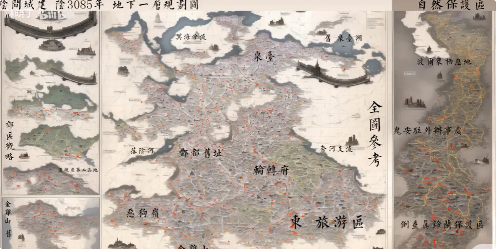
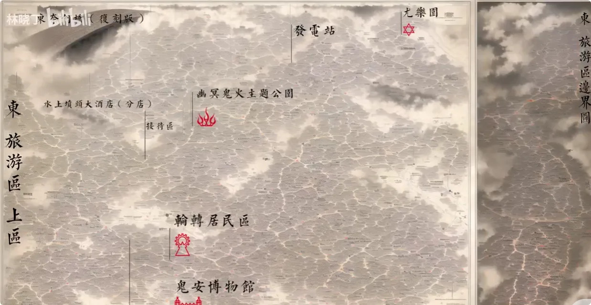
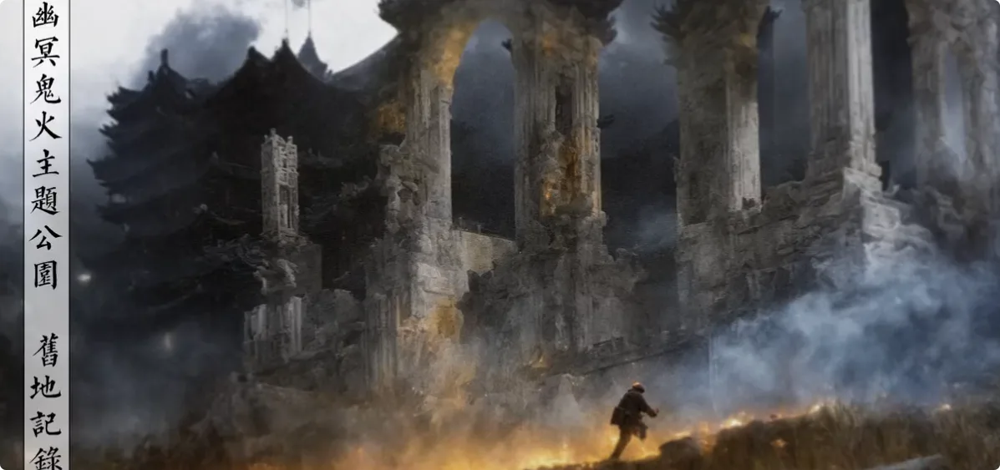
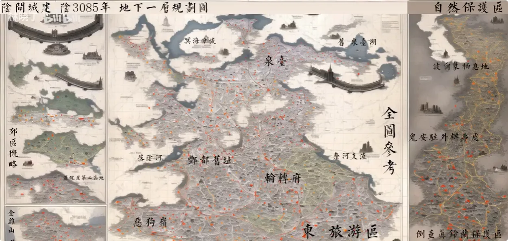
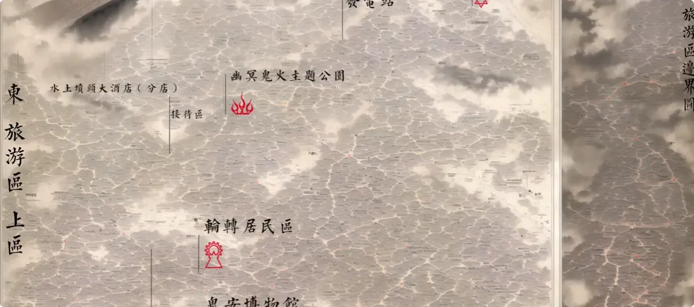
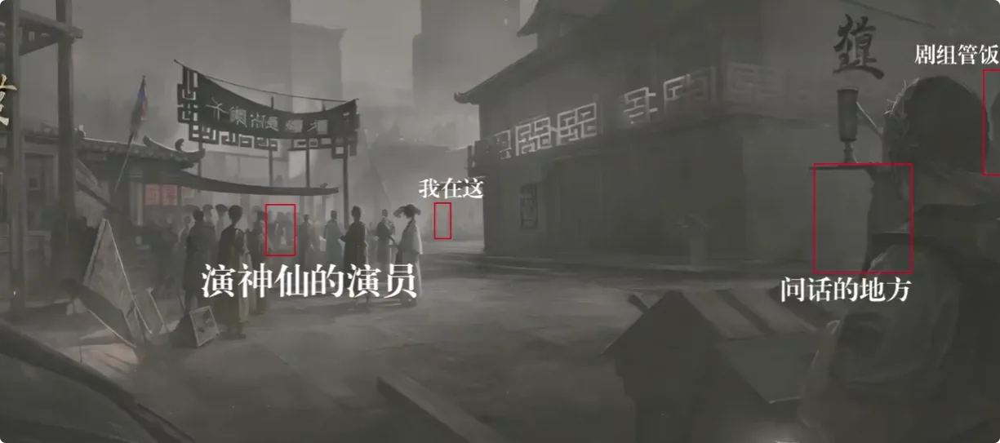
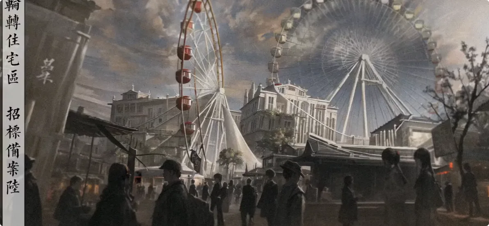
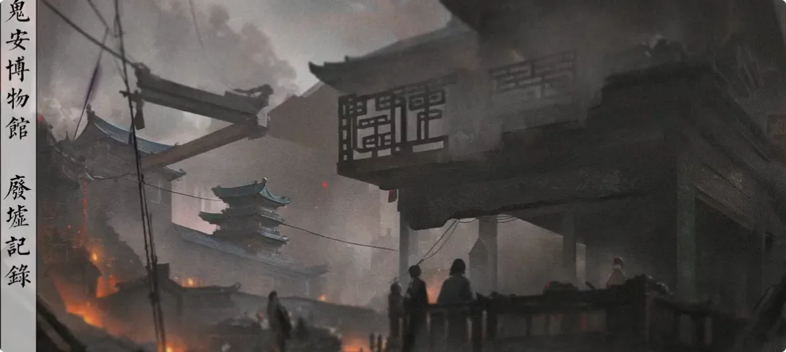
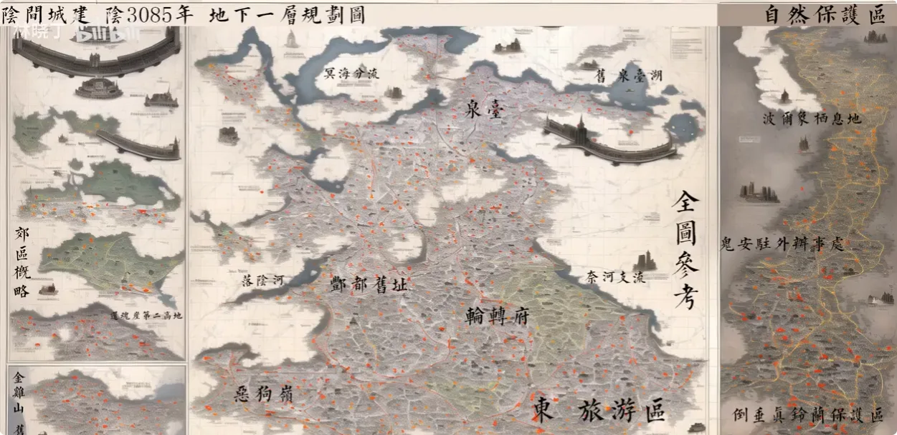

## 阴间旅游指南的由来

前两天我算了一下，如果我开大巴车去天庭开办旅游专线，就算全台落地签证，一次赚的也不够有钱；如果每一趟都能赚，就得一个位置上坐三个神仙，那和开公交的也没什么区别。

从去年就说要搞这个阴间旅游指南，其实最开始只是口嗨，没想到阳间人还真想看，我就只能托同事去阴间城建局搞了一张地图来。
也不知道是什么神、明年的地图，算了，没差，反正和我在底下见到的差不多。你们下去发现不一样，那一定是阴间城建突然改主意了，和我没关系。

## 地狱交界区域

首先是和地狱的交界处。交界处这一片不用签证，但它有边界，越过边界才需要签证。早年间有无良旅游机构在边界上建立关卡，鬼走一半的时候会找你拿护照，没有就临时补办，体验很差。最后被一个喝醉的鬼一把火点了，这才结束。现在各位过去的话，应该还能看到原来的旅行社老板在那边吊着，和烧女巫似的。

## 西方极乐世界游乐园

这一片区是西方极乐世界建造的游乐园，独立收费，没有通票。我没去过，因为一直要预约，排不上。根据去过的鬼说，里面其实就是洗浴城，没什么好去。这里和各位提一嘴，有兴趣的可以看一看。 桀桀桀👿

## 地府区域：避风发电站与幽冥鬼火主题公园

往下走，在咱们地府的地界上，玩的虽然没有地狱那边那么花，但还是挺魔幻的。这一块是避风发电站。以前有段时间阴间流传一个传说，说阳间人修仙的太多了，没人来阴间了，搞得鬼口局很头痛。那几年因为这个谣言搞出来一堆避风。我估计当时的鬼口局长脑子里想的是：我搞了这么多避风，天庭一定不会有很多人。结果很明显，被骗了。也不知道这个谣言是哪来的，反正最后避风没有用，只能拿来发电。

这玩意儿也不是纯能源用途，也算景点。各位到底下拿望远镜往风力发电站上看，能看到上一任鬼口局员工被绑在上面，算是公司团建旅游必去的小景点。

再往下这一块是幽冥鬼火主题公园。说是主题公园，其实就是焚烧厂。本地没有鬼来这里玩，又没吃的，又没景点，整个景区就一个阴火烧烤，就是拿手电给你照一下，说这玩意儿烤好了。完全诈骗，也就骗骗新来的鬼和你们这些阳间人。

等一下，好像有个新政策：
*在册中间人凭阴阳互通渡牒代团，或签署姓名，可减免功德税。*

(光速变脸☺️)刚刚说到鬼火主题公园，这个主题公园很好，很赞，是阴间必来不可的景点。首先它历史悠久，大概有二十多年，所有建筑都是当时建成的，完全没有之后翻修重建，比起阳间一些崭新的旅游区，不知道好到哪里去。

整个景点的设计讲究原汁原味，几乎看不见商业化痕迹，那些烂大街的阴间美食，比如蜡骨灰、半生鸭场、石灰水火烧，这里一律没有。整个景区只有一家从建设之初就开业的阴火烧烤。

阴间有句话说得好：
*您吃地火三顿，不要百年功德。*

其中的地火三顿，指的就是地火落水、地火如岭南、地火煎骨灰。

这他妈也没阴火，加上隐藏在地火三顿背后的阴火烧烤，才能共同支撑起阴间美食的天花板。

这个特殊的烹饪手法只有在这里才能知道。阴火烧烤主打原汁原味，不烤食材，而是超度食材。比如你烤个生鱼片，烤完了还是生鱼片，但鱼和寄生虫都被超度了，吃起来仿佛会增加功德。

这里算是一个顺便路过可以进来看一眼就退出去的景区。毕竟如果细走，各个牌坊建筑和迷宫一样，走出去也比较耗时间。不过反正活着也需要时间，都到地府了就慢悠悠地生活，多花点没关系。

## 水上坟头大酒店

再往下走，这一块是整个旅游区的住宿地，建在明海岸边，叫水上坟头大酒店。最开始建的时候说是要学习哥特尖顶的布局，特意去地狱那边重金请了几个设计师设计出来。

但最后负责人觉得不够哥特、房顶不够尖，就磨了几根避雷针插房顶上。据说这些避雷针都是鬼工手模请的匠人世家，祖上和李白还有点关系。

哥特不哥特我也不懂，倒是挺朋克。

反正装了之后，原先是海景大酒店，现在应该是渔景大酒店。我住过一次，拉开窗户才知道明海的鱼有这么多，全都挤在水面上。

我问酒店负责人，他们说这些鱼看了都忍不住浮上来想要入住，又恨自己没有阴间户口，享受不到三鬼入住一人投胎的超级优惠政策，悔恨得集体溺毙。反正我是不信。

酒店的住宿环境还可以，基本做到了每个房间都有坟头，每张桌子都摆着牌位。虽然牌位上的鬼你也不认识，牌位上的名字和坟头里埋的多半也不一样，但整体氛围至少到位了。

要是半夜睡不着，你就拿冷水泼那个坟头，然后就能听见坟头里的鬼开始哀嚎，发出怨念，疯狂在你床头说自己死得好惨，入睡体验很不错。

酒店的退房时间是每天傍晚四点半之前，这和阳间不太一样。阳间大部分酒店退房时间是中午十二点，但之前确实发生过游客中午退房，结果一出门就神形俱灭的情况，之后统一改到四点半。

酒店提供晚餐，但分档次。如果买的是很高级的独立大神龛套餐，晚餐会送上门，并且保证精致级别的骨灰不少于一百克，饮料或气泡酒也都是现杀的。

我个人推荐**普通墓地房**，一来价格便宜，均价大概十五张黄纸，住三天两夜；按照我之前住的阴间阳间汇率来看，大概两千多住三天。毕竟是旅游区，肯定比其他地方贵。
普通墓地房没有晚餐上门服务，统一是晚上六点半到八点半在酒店地下室吃自助餐。骨灰有，但比较粗糙，二级品相；饮料和酒多是冷冻的，很少出现窖藏或现杀。不过有些特色菜还可以，比如鱼菜沙拉、鱼肠刺身，到夏天也会有草岭兰和彼岸花汤。

### 酒店住宿规则

1. 不要觉得菜好吃或难吃就说要见主厨，也不要问食材是哪里来的。酒店的厨师大多是社恐，你一问他就哭，跪在地上求你别再说了，到时候场面非常尴尬。
2. 睡觉时如果听到敲窗户的声音，不要回应，不要问，不要开窗，就当什么都不知道。酒店外墙修缮和清洁大多在深夜到凌晨进行，你要是开窗，他们容易掉下去，出了事情很麻烦。
3. 走在酒店楼道或电梯里时，如果听到有鬼叫你或有声音喊你的名字，一定要报告前台，并说明时间和位置。酒店建立时拆了很多本来的建筑和林地，附近会有鹦鹉跑进来玩。这群鹦鹉平常没事干，就喜欢吓鬼，和本地黑帮一样，所以听到声音一定要告诉前台，前台好让鬼来处理。

## 天庭贵客接待区

在酒店旁边的一小块区域，是专门接待天庭上面下来的贵客的地方。

我也不懂天庭没事坐大巴车下来干嘛，一辆大巴车就塞了几个神仙，一个位置坐三个神仙，一下车连衣服都挤没好几件。这地方现在不让一般鬼进来。

最早这里刚建成的时候，我还以为是什么影视城，天天招演员，要演小摊小贩，还要演游客，有台词的一天加两张黄纸，午饭时给打半勺骨灰。

我当时还没毕业，想着在学校每天也没事干，不是去后山刨坟，就是跑旅行社骗水喝，干脆来这里打工，多少补贴一下生活。

我去的时候只抢到一个在角落里卖死鱼的摊贩，角色没台词，午餐包饭没菜。干了差不多一周，我看到有演天庭神仙的，当时很羡慕这些鬼，也没见过，难道是他们和导演认识，或者有什么抢角色的小技巧？

我抽空过去逮住一个落单的，问他：老鬼兄弟，我没有恶意，就想问一下你这一天赚不少。对面还挺谦虚，说什么奉献、香火之类的车轱辘话，我听不明白。

我说我在这混这么久了，头一次见到你们几个演神仙的，一天多少，包饭包菜吗？对面一听更谦虚了，说饭都是自带，什么钱不钱的都是自己愿意。

当时也是太年轻，心想你演个神仙，还真把自己当得道高人了？我就让他以后走坟头小心一点。后来他在背后说什么我记不太清了，只记得那天之后这一块就不招演员了，说什么重建整改，我也不清楚为什么。

之后也没什么事端，阴间突然说要统一孤魂野鬼的管理，学校也让我们这群学生提前半年出去找工作，别赖在学校，还不让学生兼职，尤其是阳间交流系的学生，也不知道校长是不是疯了。所以各位路过这个景区的时候小心一点，别进去了。

## 摩天轮居民楼

地图上有个摩天轮图标，这里大家注意一下，它就是个摩天轮。什么？它不是摩天轮，它是居民楼。虽然阴间宣传了很多年，说这个设计师全阴间首屈一指，主打活动式楼层设计，但我不信，我觉得住这里的鬼脑子多少不太好。

你们想一下，在阳间你楼号写什么？A栋302、C楼2单元16-2，这都是好理解的。但住在这里要怎么写？我住在摩天楼垂直平分线和左边切线中间夹角那一截？我住在摩天楼十点半的位置上？

被逼急了还能写出：我住在坐标-1-3的位置上。不知道的还以为地府殖民宇宙了。

这里不是景点，和各位说只是为了别到时候玩上头了，跑去摩天轮打卡，怕是要被住户从楼上丢下来。

## 鬼门关边防博物馆

接着往下走。这一块说是旧址，明面上的标牌和注册建筑物名称叫鬼门关边防博物馆，是整个园区规划之前就在的鬼门关边防，实际位置是现在的鬼庵。这里说是旧址，实际上就是之前单独拉了一块出来做纪念馆。

具体为什么要在这里建，历史问题太多，我很难说得明白。各位可以理解成：既要建一个纪念博物馆，又要保证原先的地点可以办公，就只好换一个地方建博物馆。

我之前在前几期讲过，之所以会有鬼门关边防，和我们的江东大力哥项羽先生脱不开关系。

这边的博物馆也保留了部分关于项羽的物品，以及他英勇事迹的表演节目。你们是不是以为会是什么《垓下之围》，或者《破釜沉舟》，要不就是《四面楚歌》？错了，这表演的是《鸿门宴》。

我个人觉得这个馆长对项羽先生还是有一点意见的，但不多，也不好说。

### 鸿门宴主题活动

这个表演还可以。每周六的时候，会场空地会摆宴席，多交点钱就能参加，说白了就是鸿门宴主题餐厅。

每次鸿门宴活动复刻的，也都是鸿门宴上被鬼传送至今的经典桥段，比如樊哙吃生猪肘。

早年间官方便有一个挑战：谁在气势上能压过樊哙的表演者，就能免单。一开始大家都觉得，毕竟对面是一个生吃猪肉的主，哪怕放在阴间也是极其炸裂的料理手段。

直到后来有一位名不见经传的勇士，在宴会上追着猪啃，第一次把对面狠狠镇住了。后来他就成了现役的樊哙表演者，听着颇有一股《水浒传》里好汉的味道。

### 博物馆三大镇馆之宝

既然是纪念馆，肯定有非常重量级的藏品。据馆长打出的宣传口号，博物馆有三大镇馆之宝，哪怕是江东大力哥本人来了也得惊叹；要放在千百年前，那就是能掀起地府腥风血雨的神器。

当时我看宣传看得一愣一愣的，还以为传国玉玺在这里，兴奋地从鬼市斥重金买了一张门票。

1. 第一件镇馆之宝是破釜沉舟时被砸碎的锅。虽然有点超乎意料，但可以理解，确实是能让项羽惊叹的存在，也算是纪念他的英勇事迹。
2. 第二件藏品是四面楚歌时用的乐器。虽然难以理解，但确实代表着英雄末路，也别有一番风味。
3. 第三件藏品就更了不得了：给项羽指路的老农手上拿的锄头。

看完以后我只能感慨，确实是能掀起腥风血雨的存在。要不是有保安，我都想掀起腥风血雨了。

虽然花了两个月工资，还买的是限时票，那天又下雨，路上又堵车，看到的又是这玩意儿。不过我转头一想，历史的事情就留在过去，这些东西还是留给我很多感慨的。所以我平静地在展馆留言那边写下了我的感想：

>***日你🐴，退钱。***

## 结尾

以上就是阴间地上一层东区A区块旅游区的上半部分，算是比较小的地方。其他地方等之后再和各位说。

希望各位偷偷三连，尤其是投币的时候小声一点。本期就到此结束，我们终会再见。
