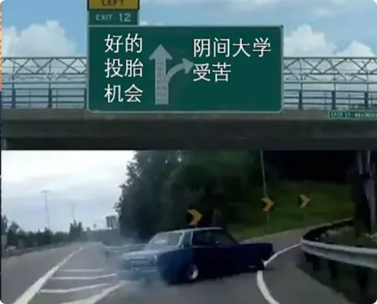
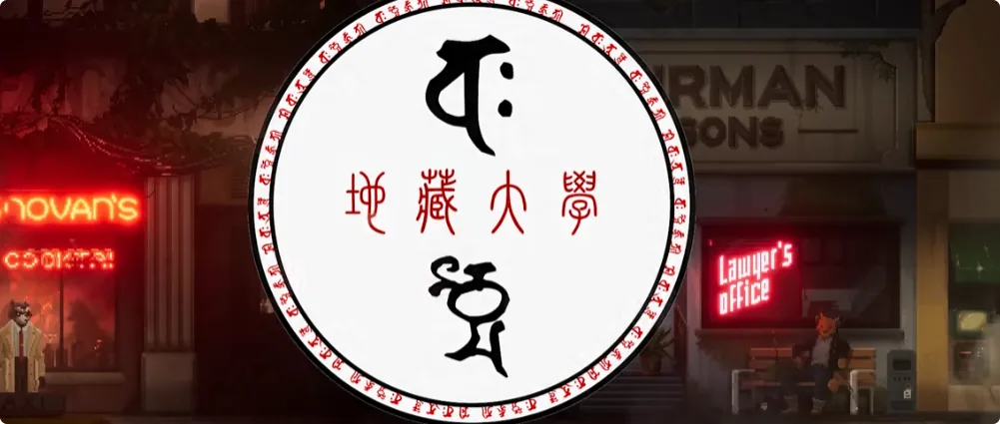
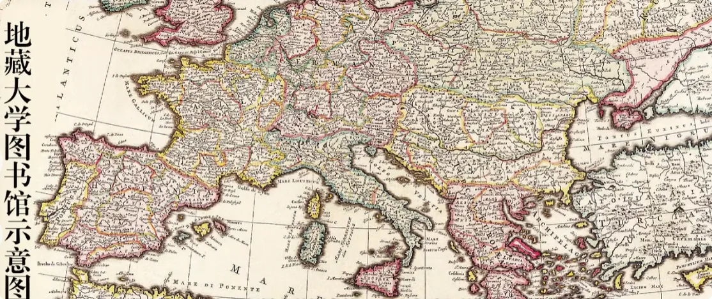
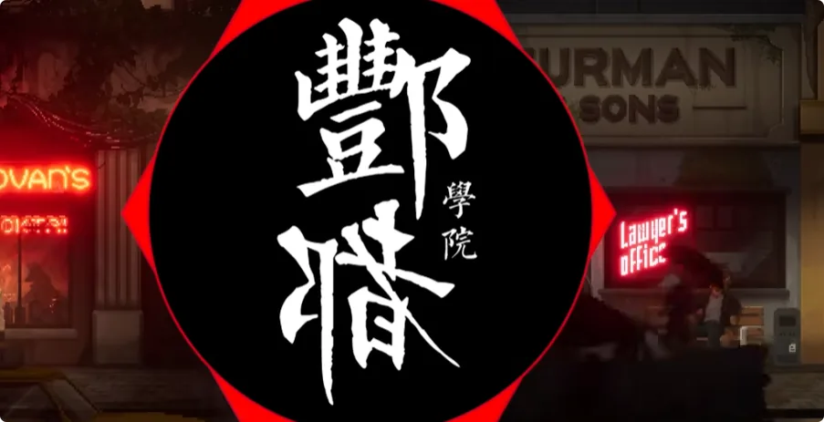
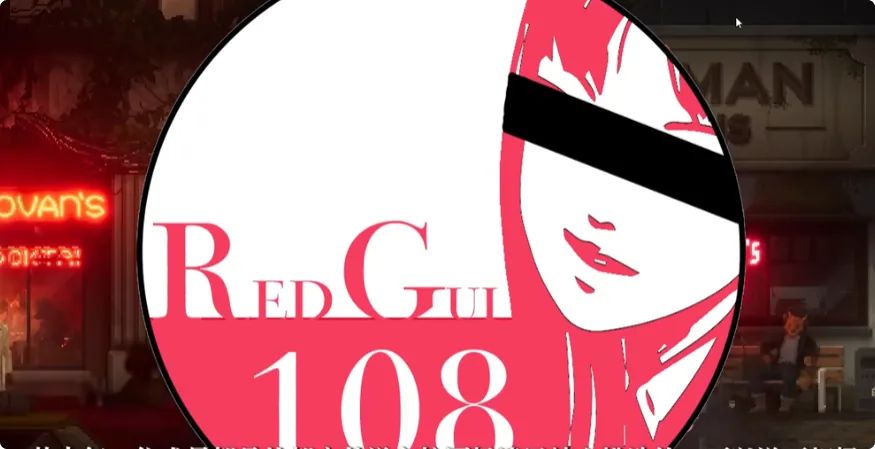
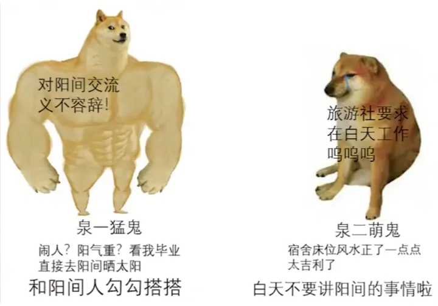
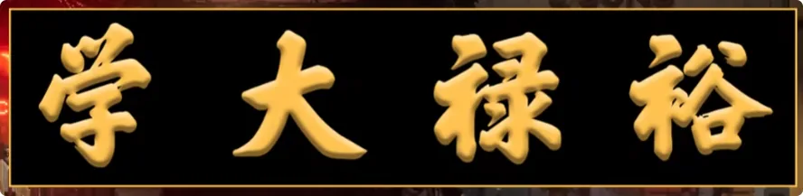

> 原视频《阴间就业指南——阴间大学的招生与专业前景》，作者林晓丁，发布于 2022 年 9 月 9 日。([Bilibili](https://search.bilibili.com/all?keyword=%E6%8B%9B%E7%94%9F%E5%B0%B1%E4%B8%9A&utm_source=chatgpt.com "招生就业-哔哩哔哩_bilibili"))
> 
> _**刚下去不知道该直接工作、等待转生，还是先考个阴间学历？这一期就来聊聊阴间大学怎么报、学校怎么选，以及哪些专业真正“好就业”。**_

## 1. 阴间大学怎么报考：一年一次，九月开招

积了大阴德。

上一期咱们聊了刷功德的事，刚好这两天不少刚刚下去的小伙伴都给我托梦，说自己很迷茫，不知道应该直接工作之后转生，还是先在阴间大学考个文凭；如果进大学，又该选什么学校、找什么专业。

所以这一期就来谈谈**阴间大学的招生政策、报考指南，以及当代热门专业的就业前景。** 首先了解一下阴间大学的报考时间。因为和阳间存在时间差，所以折算到咱们阳间的时间，基本上是**九月中旬开始报考，九月底发布录取信息，并开始进行专业调剂。**

而且录取和报考的机会只有一次，还是比较严格的。
具体考试内容我就不提了，下去了自然就知道。

这里直接开始推荐大学和专业。

---

## 2. 第一推荐：地藏大学——阎罗殿唯一指定学府

首先还得是老牌大学：

> **千年老校——地藏大学。**

地藏大学对分数看得不算特别重，主要的**录取指标是功德**。

但各位注意，用过功德机的要小心。
因为面试的时候，学校会把你的祖宗十八代一起找来审核；已经转生的，直接通过托梦进行，梦中三方会审。
如果最后查出来存在功德造假，后果还是蛮严重的。
但你要是一个行善积德、又英年早逝的人才，那地藏大学基本属于：

> _**脑子一热就可以冲的大学。**_

### 校区不大，但图书馆大得离谱

环境建设方面，地藏大学夹在两个古战场——**望鬼坑和上一代地厅墓**——之间，所以校区比较小，交通也不算便利。

基本上你要点个外卖的话：

> **从阳间送下去，都比在阴间点来得快。**

但地藏大学拥有**全阴间最大的图书馆**。
大到什么程度？
里面有独立的导航软件，用来实时定位你现在究竟在哪。
同时，它还有全阴间最危险的**禁书阅览室**，以及大量由那些走不出图书馆的鬼的怨念化成的家伙。

我之前下去办事的时候，听一个校工说，前段时间因为导航系统更新，出现了十分钟左右的延迟。
>结果当场就出事了, 死了十几个，疯了百来个。

最后还是抓了几个教导主任祭天，才解决这事。

### 考研失败不要死磕，可以直接“重开”

校内的学术氛围还是很浓厚的。
基本上学生进来，就是冲着地藏大学的直属研究生学位去的，其中复读了几十年的：

> **大有鬼在。**

这里也分享一个小技巧。
如果第一次没考上研究生，不要灰心。

> **直接转生到人间以后光速重开。**

基于“阳寿未尽”的补偿政策，可以继承上辈子在阴间的记忆，再直接以未成年鬼的身份降分录取到地藏大学。
比死磕学位申请要快多了。

### 王牌专业：通用驱邪术的运用

提到地藏大学，就不得不提它最为离谱、也是阴间就业前景最为迷幻的专业：

> **通用驱邪术的运用。**

比起阳间的普通驱邪术，地藏大学吸收了各门各派、各个维度的不同驱邪技术。
不管对面是：
- 人；
- 鬼；
- 妖兽；
- 还是外星球居民；

都可以通过这门技术实现：

> **原地超度。**

超度的时候，蓝色火焰堪比点燃了西伯利亚天然气。

可以说是一门：

> **艺术与实用兼具的手艺。**

只要学成毕业，基本上全阴间的正规单位都可以直接报考。
平均工资与福利待遇是：

> **每年18罐纯净骨灰 + 一箱镀金黄纸。**

功德和通用冥币，则按照各地工作单位的**二级工资标准**进行发放。
\

不过对于大多数鬼而言，地藏大学还是难了一点。

接下来推荐一些简单的。

---

## 3. 第二推荐：丰都学院——校园环境最阴，阴间料理最好就业

第二推荐，就是由**轮转王担任名誉校长的丰都学院**。
丰都学院的校园建设，可以说是阴间首屈一指：

> _**每一寸土地都死过鬼，每一间宿舍的阴气和煞气都重得离谱。**_

校内还有**忘川河直达班车**和每月一次的阳间观光活动。
每年，学校还会给学生发放手工孟婆汤的购买津贴。

印象里，我上辈子参加联谊的时候，认识过一个学长。
他年年都能申请到免费的孟婆汤。
结果：

> **留级留了四百多年。**

家里卖了四座坟头，才勉强供得起学费。

### 女鬼偶像团体“红衣之女108”

除此之外，丰都学院还紧跟国际潮流，在校内组建了阴间最出名的女鬼偶像团体：

> **“红衣之女108”**

其中每一位成员，都是从都市传说和校园怪谈里精心挑选出来的。
可以说：

> **死相极惨，演出更是晦气至极。**

比起那些荒郊野岭里刨坟凑齐的贫鬼女团，视觉效果还是要好不少。
很难想象，校内学生究竟是在怎样的一种精神状态下读书的。

### 王牌专业：阴间料理

如果能进入丰都学院，除了享受这种造孽般的大学生活以外，还是应该以学业为重, 那么就可以试着申报这几年潜力最大的专业：

> **阴间料理。**

因为这几年阴间生活好了不少，鬼对生活质量的要求也在逐步提升。
坐拥大面积坟场和部分忘川河资源的丰都学院，自然也就开设了阴间料理专业。
其中对于：

> **解剖、下咒、放毒，以及料理之间的胡乱搭配**

已经达到了一种难以理解的境界。
每年阴间料理行业的招聘季，基本上**三分之一的岗位**都会留给丰都学院。
该专业毕业生工作后的平均福利，大约是：

> **每年10罐骨灰 + 两叠镀金黄纸。**

但是冥币和功德给得比较多，已经逼近各地办事单位的**一级工资水平**。
基本上属于：

> _**一个鬼，能够养活祖上三代。**_

---

## 4. 第三推荐：泉台直属第二大学——离阳间最近，王牌是“阳间交流”

第三推荐的，就是我上辈子的母校。
也是离阳间最近的大学：

> **泉台直属第二大学，简称“泉二”。**

泉二的老校区“泉一”，因为当初某位**陈姓将军**的原因已经被废弃，据说是阳气太重、过于吉利，所以后来就不用了。
现在的校区，则建立在**百鬼坑**上。
虽然晦气程度比不上丰都学院，但也已经相当不错。

而且这是整个地府距离阳间最近的地方。
也正因为如此，泉二的：

> **阳间交流专业**

可以说是阴间首屈一指。

### 校园最严重的问题：以前经常“闹人”

虽然校区环境比较一般，但一直都在建设。
每年也都稳定地抓学生祭天。
每到**中元节**的时候，校园里死得那叫一个多，整体的校园氛围特别好。

为了对标国际一流学校，去年学校还紧急修建了祠堂，并放生了一批**会吃鬼的鲛人**，同时修改了学校大门的朝向，让风水变得更凶一点。
只能说，比我当初在的时候好多了。
我读书那会儿，还经常能看到阳间走错路的老乡来找我们问路。

校园里：

> **“闹人”事件频发。**

前段时间下去看的时候，确实比以前好了不止一点。
就是不知道这些建设资金到底是哪里来的。

### 阳间交流专业真正值钱的，是“渡牒”

既然提到泉二，那就必须朝着王牌专业：

> **阳间交流**

去冲一冲。

虽然阳间交流专业毕业之后不包分配，而且工作开销以及阴阳两界来回跑的路费都要自理，但这些都是小问题。
有些不懂的学生，毕业以后傻乎乎地进了阳间旅行社，天天累死累活。
这是不对的。
正确路线应该是：

> **先把“阴阳互通渡牒”考下来。**

然后凭借渡牒注册成为**在册中间人**。
从此以后就可以：

> _**阴间、阳间，两头吃。**_

我现在这套地下十二层的房子，就是凭借自己的努力：

> **在阳间烧给自己的。**

### 为什么不读专业，直接去考证不行

有人可能会疑惑：

> “那我不读这个专业，直接去考渡牒不行吗？”

还真不行。
这东西是**泉二和阳间交流部门共同签署的**。

考试时必须提供：
1. 泉二的毕业证；
2. 泉二发放的骨灰盒。

有些无良教考机构，从来不和你们说这个。
导致很多鬼都以为是这个证通过率特别低。
实际上：

> _**你压根就没有报考资格，还以为是自己不够努力。**_

只能说被骗了。

### 毕业待遇：单位比专业更重要

至于考取渡牒以后的工资待遇，其实就不固定了。
我得和你们实话实说：

> **基本上取决于工作单位的规模和良心。**

像我现在所在的单位——**除妖人驻阴间办事处**——属于在阳间也有分部的单位。
所以每年发放的福利会多一些：

> **香、普通黄纸和78罐骨灰。**

冥币和功德基本就看个人业务能力。
我算业务能力还行的，功德多一点，冥币就勉强够用。
但如果去了那种空壳、无固定办公点的单位，那就可怜了。
什么染色的黄纸、掺奶粉的骨灰，都是屡见不鲜。

而且经常：

> **扣功德、发未注册的手绘冥币。**

下场比在阳间上班还惨一点。
当然，劣势虽然明显，优势也确实存在。
有了渡牒以后，就可以阴阳两界自由来回跑。
有时候下面的鬼来讨债，你直接跑上来。
上面一有人来讨债：

> **那就再跑到底下躲债。**

非常自由。
所以阳间交流专业，各位可以重点考虑。

---

## 5. 第四推荐：裕禄大学——国际交换鬼最多的学校

第四推荐，就是阴间最国际化的大学之一：

> **裕禄大学。**

这里也是交流鬼最多的学校。
我没转生以前，可喜欢去裕禄大学做迎新志愿者了。
特别是：

> **吸血鬼交流校区。**

那叫一个好看。
罗刹国的吸血鬼见过没有？
白毛、尖牙、红眼，多少都带点病娇。
看见你穿一身小红衣，上来就缠着你：

> **要吸你血，光想想就减阳寿。**

不过我还是建议各位别这么干。
我当年被抓以后，在两个学校都做了全校广播检讨，还扣了一整年的功德。

### 校园建筑：从哥特尖顶到日式一户建

说远了，还是谈回裕禄大学。
校园建设方面，学校里面有各式各样的建筑：
- 哥特尖顶；
- 日式一户建；
- 荒坟；
- 合葬墓地。

校内宿舍甚至还分成：
1. **地上城堡室；**
2. **地下墓穴室。**

根据国籍不同，还会配备各种棺材和裹尸布。
只能说：

> **大城市就是有钱。**

每年从万圣节一直到来年清明期间，各学校还会组织统一交换生互访。
交换专业包括：
- 与**死灵大学**共同开设的“风水与开棺”专业；
- 与**魔药大学**开设的“长生与入土”专业；
- 与**木乃伊职业技术学院**合作创建的“保鲜与储存”专业；
- 以及与**女巫结社**外聘签约的“防火材料学”专业。

校内还有全球第二大的科研机构，专门负责：

> **阴间机械的设计与制造。**

### 我最推荐的冷门专业：天雷的储存与运用

但我个人最推荐的，其实是一个冷门专业：

> **天雷的储存与运用。**

这个专业由雷电天尊主持，由**尼古拉·特斯拉**创立。

之前一直因为阳间电力技术发展得太快，所以没什么鬼愿意学。
但是前几年，校方又跟阳间一位木汤的天才教授签了终身教学合同。
等这位木教授下去以后：

> **这个专业势必会迎来极大的发展。**

我估计也就是这几年了。
我的阴间眼光一向不错，各位可以信我。

---

## 6. “天雷专业是天坑”？那是因为你的就业路线走错了

这时候，可能已经有这个专业的毕业生要出来反驳我了：

> “出来之后根本找不到工作！”
> 
> “地坑专业！”
> 
> “千万别去！”

那我就得教你们一下。
这个专业毕业以后：

> **千万不要直接找相关工作。**

因为“天雷应用许可”是一张非常刁钻的证书，普通行业根本用不上。
真正正确的就业路线是：
1. **先去扎纸公司，应聘“电力纸马”的研发岗位；**
2. **拿着就业证明，去纸马与白车管理所备案；**
3. **申请一张地府通路交通工具研究许可证；**
4. **拿到许可证之后，从原来的扎纸公司辞职；**
5. **带着劳动合同和许可证申请创业津贴，以及“被投资许可”；**
6. **获得被投资许可以后，直接成立电力纸马公司。**

做到这里以后：

> **无数风投公司会主动来找你。**

同时，你还能拿到：

> **新动力纸马研究补贴。**

虽然这个专业毕业以后没有固定福利，也没有固定工资，但有了这些补贴以后：

> _**一年上市，两年成为独角兽，完全没有问题。**_

就算你拿了投资以后啥也不会，也可以直接：

> **外包给扎纸公司。**

让他们替你干活。
你原来的老板？
现在已经变成你的员工了。

---

## 7. 阴间报志愿最后一条：千万别信教考机构

基本上，目前最容易报考、就业前景也最好的学校和专业，就这么一些。
最后还是提醒一句：

> _**千万不要信那些阴间教考机构的话。**_

尤其别听他们忽悠，跑去读什么：

> **名字特别好听、听起来特别吉利的不知名学校。**

阴间上大学，学校太吉利往往不是什么好事。
到时候真正痛苦的是你们自己。
本期就先这样。
你们对学校有什么问题的话，在评论区直接问就行，应该会有不少学姐、学长帮你们解答。

**我们下期再见。**
