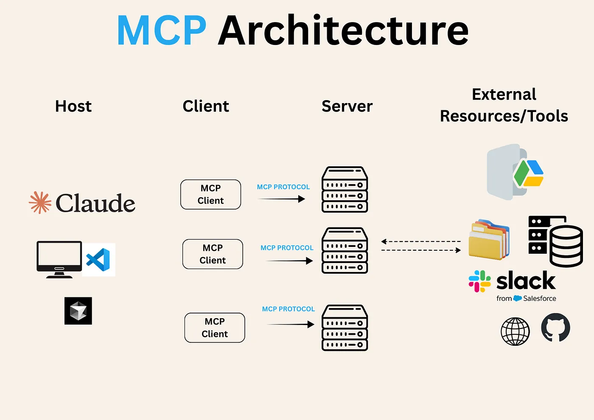
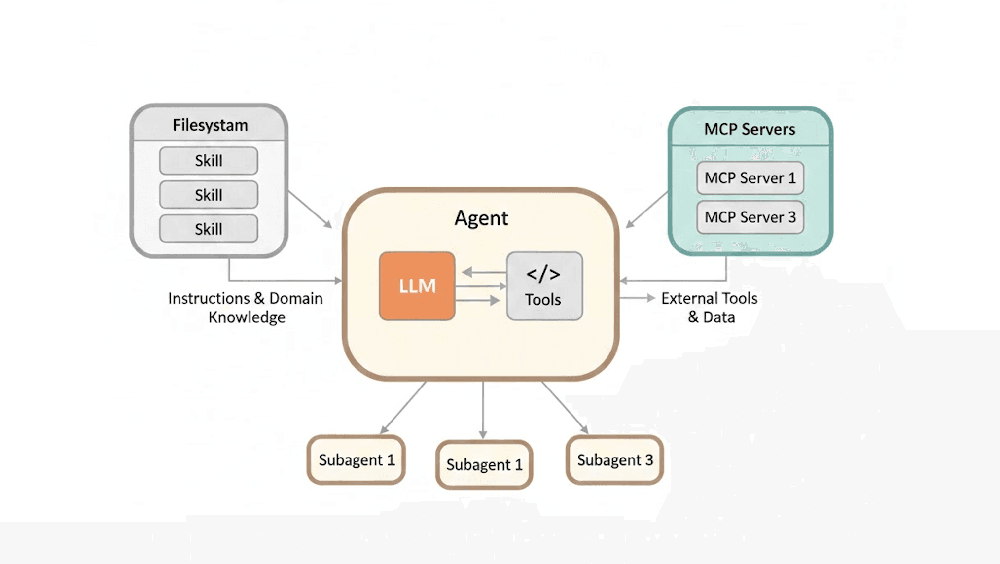
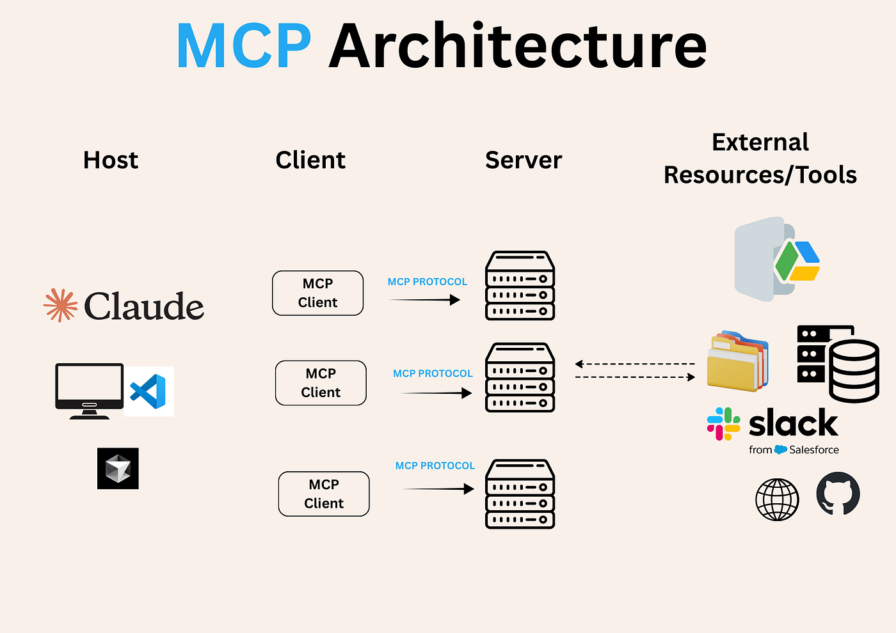
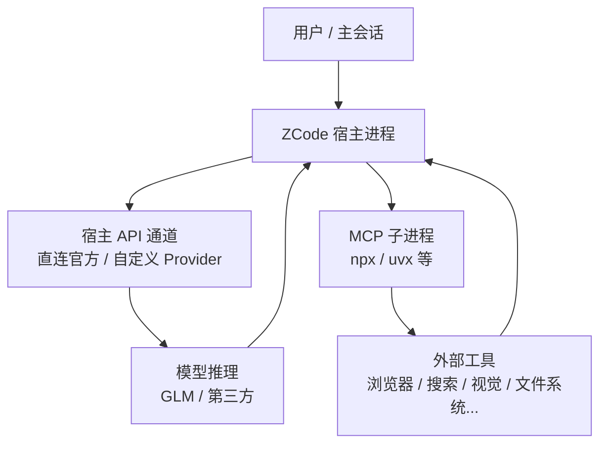
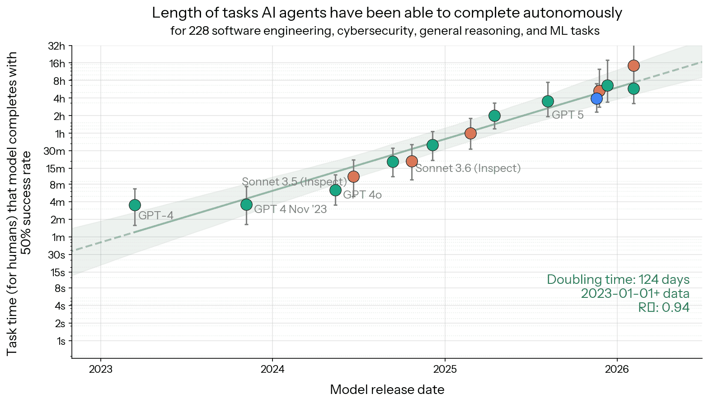

## 前言

前些阵子我还沉浸在 Cursor 计费 bug 的狂欢里，不亦乐乎着猛蹬 SOTA 模型。那段时间其实挺舒服的——一边是梁圣性价比拉满的 DeepSeek V4f，一边是 Grok 4.6 extra high fast 的 Cursor 大额度 auto 池子，耐用又高质量。

直到 8/13 那天晚上🌙，我发现 DS 官方在 API 平台悄摸摸把 V4 Pro 正式版挂了出来。本来只是想探探，没想到智谱 GLM-5.3 直接中门对狙。

突然想起之前在咸鱼🐟️捡漏的 GLM 老 Lite，再加上智谱官方 Harness 工具那 150% 额度和对 GLM 系列高得吓人的缓存命中，我干脆先把 ZCode 下下来，看看这位“没落的国模一哥”现在到底什么成色。

于是就有了后面这些。

它帮我完成了两个开源项目（Velaterm 和 Claude-hud）交叉情况下的顽固 bug。  
虽然是纯文本模型，但它跑了 50 多分钟（将近一个小时），修复过程非常完整，To-Do List 也列得清清楚楚。配合识图的 MiniMax MCP、官方的图片理解，再加上 Chrome MCP 和 Playwright，它把长任务直接打通，还把交叉和回归测试一起做完了。

不禁赞叹，做得相当干净 ✨

现在倒是之前吃灰的老 Lite 有了发挥余热的空间了。那么各位小园丁们🌲，下面我把我探索到的 ZCode 的 Harness 生态和配置，完整摊开揉碎地讲一遍吧😁

---

## 它到底站在什么位置？

初次打开 ZCode，是比较纯粹的集成工作台 ADE，像 Codex、Cursor 一样：  
任务、权限、终端、浏览器、Review，全部围着同一个 Agent 转。



也就是说，它是一款对标目前主流 ADE 的国内落地化产品。  
对智谱 GLM 系列做了深度的缓存优化和适配，还提供了 150% 的额度供应。

比较美中不足的是，GLM 和 DS 系列目前都是纯文本 model，识图得额外接 vision 模型。

---

## Harness 生态全景

我习惯把扩展面分成五块，它们构成比较完善的全景：

| 模块 | 适合解决 | 关键入口 / 文件 |
|------|----------|----------------|
| **Skills** | 动态渐进式加载的技能书 | `SKILL.md` |
| **MCP** | 接外部三方的工具与生态 | 设置 → MCP 服务器 |
| **Hooks** | 在关键节点自动执行的脚本 | 用户级 hooks（项目级目前不执行） |
| **Subagents** | 减少主会话开销的子智能体 | `~/.zcode/agents/<name>.md` |
| **Plugin** | 把上面几样打包分发 | 插件市场 |


以下是老生常谈的几个模块，我们简单过一下。

### Skills：动态渐进式加载的技能书

Skill 本质上是一份可复用的工作指令。它根据 description 做渐进式披露——Agent 在用户 prompt 注入后识别需求，匹配 name 和 description，路由到对应场景的 skill，加载正文，再按 workflow 规划后续步骤。

发现顺序大致是：

1. `~/.zcode/skills`（本地用户级）  
2. `~/.agents/skills`（共享 hub）  
3. 当前工作区  
4. 插件带来的技能  

官方内置了几个特别实用的：

1. **`zcode-configuration-guide`**  
   可以直接问它：「这条命令该放用户级还是仓库级？」它会按作用域和优先级回答。

2. 一组诊断技能，专门对付：  
   - 技能没被识别  
   - MCP 连不上  
   - Hook 没有触发  

hub 里目录一多（我这边曾经到过 121 个），每轮先注入的是 name + description。  
description 有长度预算。超了之后，模型眼里就只剩一长串名字，真正会主动用的反而变少。  

所以技能的关键是「日常那一桌要干净」。

### MCP：接上外部世界

MCP（Model Context Protocol）把文件系统、浏览器、记忆、搜索、视觉等能力接到 Agent 上。



列表分两组：

- **已配置的**：手动添加，可直接编辑、启用/停用  
- **Plugin MCP**：随插件一起进来，由插件统一管理  

官方最推荐的三个智谱亲儿子：

| 名称 | 作用 |
|------|------|
| `zai-mcp-server` | 视觉理解（看图、截图、界面） |
| `web-search-prime` | 联网搜索 |
| `web-reader` | 读网页正文 |

本机如果没装这三件套，通常会被 Brave、Firecrawl、MiniMax 之类顶替。  
能用，但工具名、额度、失败形态都不一样。

### Hooks：关键节点自动插手

Hooks 对齐了 Claude Code 那套事件机制，支持 camelCase / snake_case 写法。

它能在特定生命周期节点自动执行脚本，比如：

- 工具调用前后  
- 命令执行前后  
- 会话开始 / 结束  
- 权限确认相关节点  

当前版本有一个明确限制：

- **项目级 Hooks 故意不执行**  
- 只走**用户级**和**插件**带来的 Hooks  

也就是说，想在仓库里用 `.zcode` 或项目配置做门闸，目前是行不通的。  
真正生效的门闸只能写在用户级配置里，并确保 `hooks.enabled` 打开。

实际使用时，常见场景包括：

- 危险命令（rm、force push、改生产配置）先弹确认  
- 特定工具调用后自动记日志  
- 会话结束时做清理或状态落盘  

配置入口主要在用户级 `cli/config.json` 以及插件自带的 Hook 定义里。  
改完之后，新开会话才会稳定生效。

### Subagents：主会话之外的独立工人

内置两个：

- **`general-purpose`**：全工具  
- **`Explore`**：只读探索  

自定义子代理放在：

```text
~/.zcode/agents/<name>.md
```

（项目级自定义目前还在完善中，设置界面主要管用户级。）

几个关键注意的细节：

- 主会话默认会注入 `AGENTS.md`  
- 内置 **Explore 默认不注入**（`injectAgentsMd: false`）  
- 子代理只能看到**主会话启动时**已经连上的 MCP  
- 中途新连的 MCP，子代理看不见  
- 子代理不能再派子代理  

实践中更稳妥的做法是：  
主 Agent 在布置任务或与子 Agent 交互时，就把充足的上下文、格式规范、核心规则和入口文件一并传过去，让子 Agent 从一开始就默认遵守这些规范。  

单纯依赖自动注入，在 Explore 或工具白名单较严的场景下，经常会出现「它根本没吃到你的宪法」的情况。  
上下文和规则写进 prompt / 定义文件，比事后补救可靠得多。

### Plugin：打包单位

Plugin 可以把 Skill、Command、Agent、MCP、Hook 打成一包。

ZCode 预载了 Claude Code 很多开箱的官方市场，常见预装大致如下：

| 插件 / 能力 | 主要适用场景 |
|-------------|--------------|
| context7 | 文档与上下文增强 |
| code-review | 代码审查与回归风险检查 |
| feature-dev | 功能开发完整工作流 |
| playwright | 浏览器自动化与端到端测试 |
| commit-commands | 提交相关快捷命令 |
| document-skills | 文档类技能集合 |
| skill-creator | 快速创建新技能 |

有些演示性质的插件如果一直开着，会占名册却不贡献实际能力，还是建议按需启用。

---

## 配置目录心智模型

配置不是散落一地的。完整一点可以这样理解：

```text
~/.zcode/
├── AGENTS.md                 # 全局宪法入口（用户级规则）
├── rules/                    # 自建规则补充（可选，个人扩展）
│   ├── harness.md            # 本机 Harness 相关约定
│   ├── minimax.md            # MiniMax 视觉相关说明
│   └── network.md            # 网络分层约定
├── skills/                   # 本地用户技能（通常很少，真正常用的留在这里）
├── agents/                   # 自定义子代理定义（用户级）
├── commands/                 # 自定义斜杠命令（如果有）
├── cli/
│   └── config.json           # MCP、权限默认、插件/技能开关、Hooks 等 Agent 运行时配置
└── v2/
    ├── setting.json          # 界面与行为相关设置
    └── config.json           # 模型供应商、通道、API Key、模型列表等
```

项目级配置则在仓库内的 `.zcode/` 下，跟着仓库走。  
换机器时，优先带走用户级的 `cli/config.json`、`v2/config.json`、`AGENTS.md`、`agents/`、`skills/`、`commands/`。  
`credentials.json` 和带设备标识的文件不要直接复制。

---

## 模型通道与自定义 Provider

ZCode 并不是只能接官方 GLM。  
它支持添加兼容 Anthropic / OpenAI 协议的自定义 Provider——公网模型服务、团队企业通道、内网自托管都可以。

配置路径大致是：

1. 打开模型设置  
2. 添加 Provider  
3. 填写名称、Base URL、API Key  
4. 系统自动拉取可用模型列表（必要时手动补）  
5. 启用后即可在会话里选用  

官方 GLM 系列在缓存命中、长任务稳定性和工具调用适配上仍然是目前发挥最完整的一档。  
第三方模型能接，但在 Harness 深度优化和额度策略上，官方通道通常更占优。

---

## 宿主 API、直连通道与 MCP 进程的关系

这是之前踩过的一个坑，建议先建立清晰的心智模型。



简单来说：

- **宿主 API**：负责跟模型说话，走直连官方或你配的自定义 Provider，通常不进系统代理。  
- **MCP 子进程**：独立拉起的外部工具进程，网络行为可能会受本地代理环境影响。  
- 两者在进程和网络路径上是分开的。  

排障时先分清问题出在「模型通道」还是「MCP 工具侧」，会少走很多弯路。

---

## 综上，一些简单的提效建议

| 现象 | 实际表现 | 处理思路 |
|------|----------|----------|
| 技能名册过肥 | 大量目录全开，模型只看见名字 | 只保留日常真正会用的 |
| codegraph 路径固定 | 结构查询跑到旧目录 | 改成当前工作区或按仓启动 |
| Explore 规则缺失 | 派出去探索时不吃 AGENTS.md | 主会话传足上下文，或写注入型子代理 |
| 官方三件套缺席 | 视觉/搜索走了替代方案 | 按需求决定是否换回智谱亲儿子 |
| 密钥明文 | 早期导入留在 JSON 里 | 迁到环境变量或更安全的管理方式 |
| 项目级 Hooks 无效 | 配了也不执行 | 只走用户级 Hooks |

这些地方锁不紧的时候，窗口再大也容易在错误的路径和名册上消耗预算。

---

用了一段时间之后，整体感受比较具体：

ZCode 能扛长任务，窗口也够大，插件生态让它看起来和 Claude Code 很像表亲。  



真正影响一次排查能不能一次做对的，往往是路径有没有指对、技能名册有没有收干净、子代理有没有吃到足够的上下文和规则。

工具越强，配置的缝就越显眼。官方提供的 Harness 马甲固然重要，但更重要的还是自己把路径、名册和上下文纪律管住。

各位小园丁们如果也在用，欢迎交流具体卡点——很多时候我们踩的是同一类问题哦 🌱


