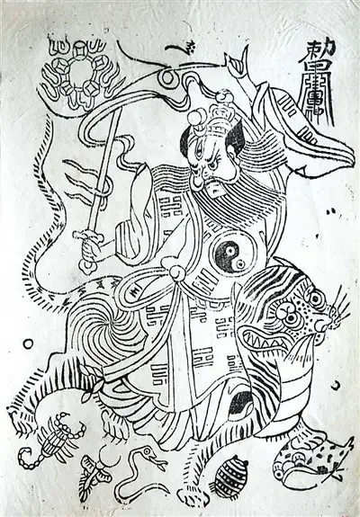
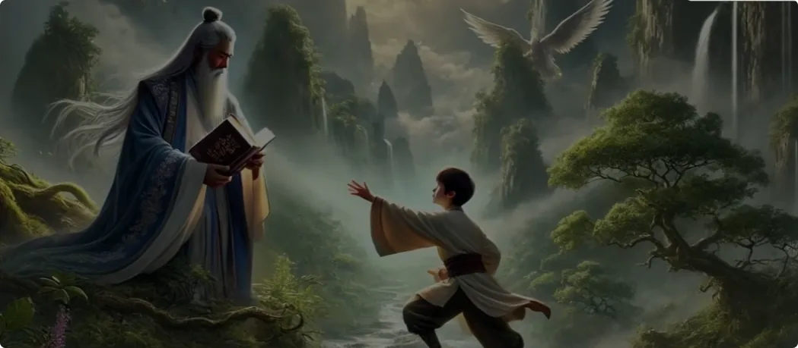

> **为什么是张道陵？为什么他成功了？他到底哪一步跟其他修行人不一样？真正的修仙契机，又出现在什么时候？**

## 1. 为什么是张道陵：真正的仙缘，首先要看一个人的根底

### 家庭、知识与修仙环境

大家好，我是修炼者小烨。今天之所以要来聊一位神仙，是因为很多观众朋友提出，小烨说的东西无凭无据，那么今天我们就来读一读古籍，看看古代那些颇有影响力的仙人，到底是怎么修仙的。

为什么是他？为什么他成功了？哪一步跟其他修行人不一样了？背后的契机是什么？常人怎么才能把握到机缘呢？

今天我们来聊的神仙是**张道陵**，也称张天师，是道教的祖师爷。相传2000年前，他在蜀地降妖除魔，降服当地六天大魔、众多鬼神，救济无数百姓，最后携弟子白日飞升。

关于张天师的事迹，我们先来看一下相关资料的介绍。

张道陵是东汉人，被视为天师道的创始者，故又称**张天师**。相传张道陵为西汉开国功臣张良的后代，他的父亲叫张大顺，好神仙之术，生下儿子后取名为“陵”，希望将来能够追随先祖，远离尘世，登临成仙。

我们先看一下张天师的社会地位和家庭条件：他生在功臣后人的家庭，父亲又好神仙之术，说明家庭条件放在古代也是衣食无忧的情况下，才有闲心去想神仙之术。如果生活条件差，人都忙于生计，又怎会想修仙呢？而且父亲还支持儿子修仙，可见从家庭上就是**精神和物质的双重支持**。

张道陵自幼聪慧过人，七岁便读通《道德经》，为太学书生时博通五经，天文地理、河洛谶纬之书无不通晓，从其学者千余人。相关传统资料中确有“七岁通《道德经》”“博通五经、河洛谶纬”等说法。([黄老,玄黄道家](https://huanglaodao.cn/zhangtianshi.html?utm_source=chatgpt.com "张天师 | 黄老,玄黄道家"))

### 学了这么多知识，却仍觉得解决不了生死

但张道陵常常叹息：

> _**“此无益于年命。”**_

因为对于他来说，如何解决生死问题，如何让自己永恒存续，才是真正有意义的事情。

所以他不痴迷于解读经书，而是更注重**实践**。他虽然读通了大量知识，又有这么多学徒，却并没有因此感到满足，也没有感到自豪，反而弃儒改学长生之道。

相传汉章帝、汉和帝先后征召其为太傅、冀县侯等职，张道陵均辞而不就。([黄老,玄黄道家](https://huanglaodao.cn/zhangtianshi.html?utm_source=chatgpt.com "张天师 | 黄老,玄黄道家"))

张天师家庭条件好，又有要职、有身份地位，钱也是不缺的，但是他仍然不为名利所动。

**可见他修仙的心意是多么坚定。**

---

## 2. 不在书里死磕：古仙人为什么一定要云游名山大川

### 辞官之后，他真正开始“找路”

辞官之后，张道陵开始云游名山大川、访道求仙。

云锦山山清水秀，景色清幽，为古仙人栖息之所，张道陵就在山上结庐而居，并筑坛炼丹。传说三年之后，神丹成、龙虎出现，因此云锦山后来又被称为**龙虎山**。

也就是说，张天师为了修炼是**走遍名山大川的**。

他没有坐在原地死磕书本上的知识，更没有从什么“本我”中内寻修行宝典。另一方面，他自身还要有好的经济基础，才能支撑他云游山川，尤其是在古代那种环境。

张道陵在山上结庐而居，并筑坛炼丹。传说三年后神丹炼成，龙虎出现。

讲到这里，就是大家最扑朔迷离的地方了。我们常闻修仙要练这个、练那个，那到底怎么练？**方法到底是什么？**

### 古籍每到真正的方法，往往就一笔带过

每每遇到古籍讲到修仙方法，都是一笔带过。
要么就是一些人拿着锅搞了一些化学反应，终究没有说清楚，这个“丹”到底是怎么炼的。
前面我们说过，张天师读遍现有的书籍，都没有找到长生的方法。
那他后来是怎么知道修仙方法的呢？
这里我们先按下不表，稍后再用《神仙传·张道陵篇》做补充。

还有一个值得关注的地方：

> **张道陵在山上结庐而居，着重在于一个“山”字。**

何为仙？

>**人也有山，才能成仙；无山，则不成。**

这是绝大多数修行人不知道的地方。

---

## 3. 炼成神丹之后为什么还要入蜀：真正重要的不是“山”，而是山中的什么

时年张道陵约六十岁，听闻蜀中民风淳厚、可以教化，便移居四川鹤鸣山。

入川之后，他先后居阳平山、鹤鸣山，还到了西城山、葛溃山、秦中山、昌利山、涌泉山、真都山、北平山、青城山等一系列山中修炼。相关传说资料也保存了这一串入蜀后的山岳行迹。([新浪](https://www.sina.cn/news/detail/5272367749137855.html?utm_source=chatgpt.com "张道陵（34-156），字辅汉，原名张陵，东汉丰县（今江苏徐州丰县）人。道教创始人。因其最初创立的五斗米道又称天师道，故又称张天师。相传为西汉开国功臣张良的第八世孙，汉光武建武十年正月十五日生于丰县阿房村。张道陵的父亲叫张大顺，好神仙之术，自称“桐柏真人”，生下儿子，即取名为“陵”， ​_新浪新闻"))

此时的张天师已经炼成神丹，却还留在人间。

**为什么？他在等什么呢？**

他听闻四川人民风淳厚，可以教化，便移居四川，又跑遍了四川各地的山。
他的目的是什么呢？
还是先按下不表。

### 太上老君降临：为什么偏偏把“盟威之道”传给张道陵

相传汉安元年（142年），太上老君降临蜀地，传授张天师正一盟威之道，使其扫除妖魔、救护生民。张天师由此建立天师道的教团体系，尊老子为教祖，以道为最高信仰。不同道教文献对于具体日期和授法内容存在不同记载，但“老君授法”“正一盟威”是相关传统的核心叙事。([道教网](https://taoist.org.cn/showInfoContent.do?id=1421&p=%27p%27&utm_source=chatgpt.com "中国道教协会"))

这里的“盟威”是什么呢？
指的是**盟约的神威**。
也就是太上老君与张天师订立盟约，张天师及其正一派弟子，可以借助这个盟约施展神力、扫除妖魔。
但这里有几个值得注意的地方。

1. **为什么太上老君要亲自传授张天师本领？**   

难道只是因为张天师发心善良，想教化百姓，就可以得到大神亲授吗？

显然不是。

有这么简单的话，地球上早就出现一大群天师了。因为心系众生的人多了去了，既然不是，那一定还有别的不为人知的原因。

2. **是不是正一派的弟子，都能使用盟威来施展神力？**

显然也不是。
如果正一派弟子都能凭一张符咒施展神威，有这个影响力，正一派早该是目前世界上最强大的宗教。
所以说，盟约之下罩着的人，到底是**张天师亲自考验过的弟子**，还是后来自己认张天师做师父的弟子，两者有很大区别。
一个是师父亲自考验过的徒弟，一个是后来的仰慕者，自认拜了师父。

> **在这世上，单方面认同没有什么意义。**

建议修行人都好好想想这个问题。

3. **为什么称作“正一”？**

既然寻仙问道者都求真，那就不必分什么叫道、什么叫法。
**万法都应该归一，才能称得上真。因为一就是一，真就是真。**
没有必要分出这么多支派。
但正所谓：

> _**“不尚贤，使民不争。”**_

尽管张天师称呼自己的理论为“正一”，大众终究还是逃不过人的规律，后来依旧分出了许多不同派系。
这也是为何张天师又尊《道德经》为重要经典。

---

## 4. 古籍为什么看起来什么都讲了，却偏偏看不懂关键

相传156年，张天师升仙而去，时年123岁。
以上就是传统资料中对于张道陵事迹的大致介绍。
跟其他神话、神仙故事一样，通篇讲得非常顺畅，但是细细品味，又让人读不懂。
为什么呢？
**因为讲的都很浅显，没有讲背后的因果。**

比如：

- 为什么是他？
- 为什么他成功了？
- 哪一步跟其他修行人不一样？
- 背后的契机是什么？
- 常人怎么才能把握到机缘？

你看，通通没有讲。

> **因为每个世人都是局外人。只要局内人不透露关键信息，局外人再聪明，也读不懂其中真正的含义。**

那接下来，小烨结合《神仙传·张道陵篇》，给大家解读一下背后的修行契机。

---

## 5. 第一次得法：真正放下名利以后，仙人才第一次把方法给他

### 五十岁退身修道：第一次考验是你到底舍不舍得

《神仙传》中首先交代了一段背景：

> _**“初天师值中国纷乱，在位者多危，退耕于余杭。又汉政陵迟，赋敛无度，难以自安，虽聚徒教授，而文道凋丧，不足以拯危佐世。陵年五十方退身修道，十年之间已成道矣。”**_ ([汉典](https://ctext.org/shen-xian-zhuan/5/zhangdaoling/zhs?utm_source=chatgpt.com "神仙傳 : 卷五 : 張道陵 - 中國哲學書電子化計劃"))

世道逐渐凋零，教书也不能帮助世人。
张道陵为世人着想，却发现自己做不了什么，反而退隐修仙去了。
这里体现了两个东西：

1. **善良、正派，有责任心，也有定力。** 明明自身条件很好，但他不是那种一生追求名利的利己主义者。他看不惯世间为名为利，反而时时为世人着想。
2. **始终对修仙有追求。** 即便已经过了半辈子，看了这么多书，他也没有像世人那样，一定要“看开人生”，平静地面对死亡。

换句话说：

> **他始终没有放弃自己的生命。**

一般来说，谁有这两种品性作为根底，那前世一定是一个有修行根底的人。

因为只有有这样的根底，才能让人在尘世中始终相信修仙是存在的，内心深处渴望找到修行的出路；同时凭借生生世世对道德的践行，才能让人在荒诞的尘世中不沉沦。

换而言之，张道陵本身就来历不凡。

**他本身就是有缘人，有前因后果地来到这个世界。**

这也是为什么他前后有三次得到仙人指引，教他如何正确修仙。

### 用行动证明求道以后，才得到《黄帝九鼎丹经》

第一次指引，就发生在张道陵辞去官职、正式开始寻仙问道以后。

《神仙传》记载：

> _**“遂学长生之道，得黄帝九鼎丹经，修炼于繁阳山，丹成服之，能坐在立亡，渐渐复少。”**_ ([汉典](https://ctext.org/shen-xian-zhuan/5/zhangdaoling/zhs?utm_source=chatgpt.com "神仙傳 : 卷五 : 張道陵 - 中國哲學書電子化計劃"))

当他用实实在在的行动证明自己，**放下了名利，证明自己真的要修行以后，他才得到了丹经。**
在此之前，张道陵也不会知道自己到底有没有仙缘。
因为他得亲自迈过心里这道坎，向神灵证明自己的品性和觉悟。

> **这其实就是一种考验。**

很多人说想修仙，其实根本放不下名利。
如果修行人放不下名利，那将来一定会觊觎不属于自己的东西，因贪婪而带来祸端。
再说说这个“秘法”。
肯定不是市面上谁都能手抄、复刻的一段文字方法。

**真正的方法，都要经历过考验才给。**

市面上的修行人又没经历过考验，怎会通过一本书，就拿到不属于自己的东西呢？
哪怕张道陵拿到这个秘法，也只是让他进入了新的修炼阶段。
神灵并没有一上来，就把修仙的终极秘诀全部教给他。
那什么时候再教给他新的秘诀呢？

**当张道陵通过第二次考验的时候。**

---

## 6. 第二次得法：不是只会“放下”，还要懂得入世渡人

### “闻蜀民朴素可教化，且多名山”

《神仙传》中还有一段非常关键的记载：

> _**“闻蜀民朴素可教化，且多名山，乃将弟子入蜀，于鹤鸣山隐居。”**_
> 
> _**“后于万山石室中，得隐书秘文及制命山岳众神之术，行之有验。”**_ ([汉典](https://ctext.org/shen-xian-zhuan/5/zhangdaoling/zhs?utm_source=chatgpt.com "神仙傳 : 卷五 : 張道陵 - 中國哲學書電子化計劃"))

这两句话，可谓是道出了所有修仙古籍中最关键、最宝贵的契机。
何为仙？
**人和山也。**

为何要巡山呢？

关键就写在这句话里。
张道陵在山中获得了“制命山岳众神之术”，并且：

> _**“行之有验。”**_

小烨来翻译一下，就是在山上获得了山岳众神的帮助，并且是可以亲自验证的。
而且要看清楚：

> **是在万山之中，而非只在某一座山。**

这也是为什么古仙人必须要游历这么多山川。
**没有自然能量和神灵的相助，光凭肉体凡胎，怎么修得了性命呢？**

### 第二个考验：既要渡己，也要渡人

那张道陵为什么能学到这个秘诀呢？
因为他听闻蜀人朴素，亲自前往巴蜀地区教化。
结合修仙之前张道陵“退身修道”的经历，这里说明张道陵又再度选择了**入世渡人**。

什么原因呢？

如果说修仙的第一个考验，是懂得：

> **放下人间名利。**

那第二个考验便是懂得：

> **渡人，也渡己。**

古往今来，每一位中国神仙，都是做了利众的事情，才被大神封作新的神仙。这些事迹也供凡人当榜样学习。
这也恰好说明，为什么想修仙的人大多道德感、责任感、善心都比较重。
因为在过往修炼的岁月里，天地都在迫使大家践行道德，维持天地众生的秩序，道德感早已经成为他们的天性，哪怕转世成人也不可抹除。

但：

> **只有道德感仍然是不够的。**

**修行人论迹，不论心。**

如何真正践行道德，才是关键。

---

## 7. 第三次得法：已经能飞升了，却因为“没有功德”选择留下

### 神丹已成，却不敢服

我们接着看《神仙传》：

> _**“既遇老君，遂于隐居之所备药物，依法修炼，三年丹成，未敢服饵。”**_
> 
> _**“神丹已成，若服之，当冲天为真人，然未有大功于世，须为国家除害兴利，以济民庶，然后服丹即轻举，臣事三境，庶无愧焉。”**_ ([汉典](https://ctext.org/shen-xian-zhuan/5/zhangdaoling/zhs?utm_source=chatgpt.com "神仙傳 : 卷五 : 張道陵 - 中國哲學書電子化計劃"))

这里道出了修仙中另一个关键：

> **功德。**

在这一阶段，张道陵已经可以成仙了，但他仍旧没有直接服下神丹飞升。
因为如果没有功德升天，也不会是大神仙。
常言：

> _**一分付出，一分收获。**_

想谋多大的成绩，就要有多大的觉悟。
也因此，张道陵才迎来了**第三次仙人指引**。

### 真正用于“降魔利民”的力量，此时才出现

《神仙传》后面记载：

> _**“老君寻遣清和玉女，教以吐纳清和之法。修行千日，能内见五藏，外集外神，乃行三步九迹，交乾履斗，随罡所指，以摄精邪，战六天魔鬼，夺二十四治，改为福庭，名之化宇，降其帅为阴官。”**_
> 
> _**“先时，蜀中魔鬼数万，白昼为市，擅行疫疠，生民久罹其害。自六天大魔推伏之后，陵斥其鬼众，散处西北不毛之地……”**_ ([汉典](https://ctext.org/shen-xian-zhuan/5/zhangdaoling/zhs?utm_source=chatgpt.com "神仙傳 : 卷五 : 張道陵 - 中國哲學書電子化計劃"))

当时的巴蜀地区，相传魔鬼数万，不分白天黑夜地横行于世，擅自散播疫疠，百姓深受其害。
于是太上老君遣清和玉女，传授张道陵新的功法。
这套功法让张道陵拥有了强大的神力，能够战六天魔鬼，夺回二十四治，改为福庭，并招降其中的头领，令其成为阴官。
随后，又将剩余鬼众赶到西北不毛之地。

至此，张天师立下功德，才飞升离去。

---

## 8. 三次得法背后的共同规律：每一次“秘诀”都出现在考验之后

以上就是《神仙传·张道陵篇》的故事。

从这个故事中我们可以看到，张道陵前后三次得到了修仙的**真法**。

但每一次，都出现在他经历某一种考验、有了新的觉悟，并且**付出行动证明以后**。

可以归纳为：

1. **第一次：放下名利，真正开始求道。**  
    他以行动证明自己真的想修仙，于是得到《黄帝九鼎丹经》。
2. **第二次：不只渡己，还重新入世渡人。**  
    他进入蜀地、游历群山，在山岳之间获得新的修炼方法。
3. **第三次：已有飞升之能，却不急于只利自身。**  
    他认为自己尚无大功于世，因此留下来除害兴利、济民立功，之后才得到更高一层的法。

> **每一次新的方法，都不是提前发给他的，而是等他先通过前面的考验之后才出现。**

很多人问：
“何为修炼的真正方法？”
“能不能发一份？”
“为什么不直说？”
好像方法就是一串文字、一份PPT。
如果连对待真法该有的态度都没有，又怎么可能触摸得到呢？

无论你来历如何、根底如何，先问问自己：
- 目前接受了什么考验？
- 付出了什么行动？
- 自己当前的品性能不能接得住珍贵之物？

> **有付出，才能有收获。**

连道教创始人张天师，都要求入道者以“五斗米”等形式参与教团。
**在古籍里，从来没有“先给人好处，靠诱惑劝别人来修仙”的逻辑。**
需要靠诱惑才肯行动，根本不是修仙之道。

---

## 9. 为什么普通人读不懂修仙古籍：答案从来没有完整写在纸面上

> **同盟求我，非我求同盟。**

小烨常跟大家说，看古书意义不大。
为什么？
因为你不是局中人。
是人都不是局中人，又怎么知道哪些信息是真正有用的信息，哪些信息是刻意修饰过的无效信息呢？
古代成仙成佛者，好比已经考过高考的人。
**是不会把答案原封不动地留给众人照抄的。**

另外，考卷也不是一成不变的。
古往今来：

> _**仙佛写一半，留一半；妖魔可以顺从世人的期待，再写完另一半。**_

只有当你接触过真正的修行，你才有分辨力。
你才知道哪些是有效的信息，哪些是误导的信息。

**届时，你才真正拥有读懂古书的能力。**